# Apache Kafka

## 概述

Apache Kafka是一个分布式发布 - 订阅消息系统和一个强大的队列，可以处理大量的数据，并使您能够将消息从一个端点传递到另一个端点。 Kafka适合离线和在线消息消费。 Kafka消息保留在磁盘上，并在集群内复制以防止数据丢失。 Kafka构建在ZooKeeper同步服务之上。 它与Apache Storm和Spark非常好地集成，用于实时流式数据分析。

Kafka的消息模式遵循pub-sub模式，而不是传统的点对点消息系统

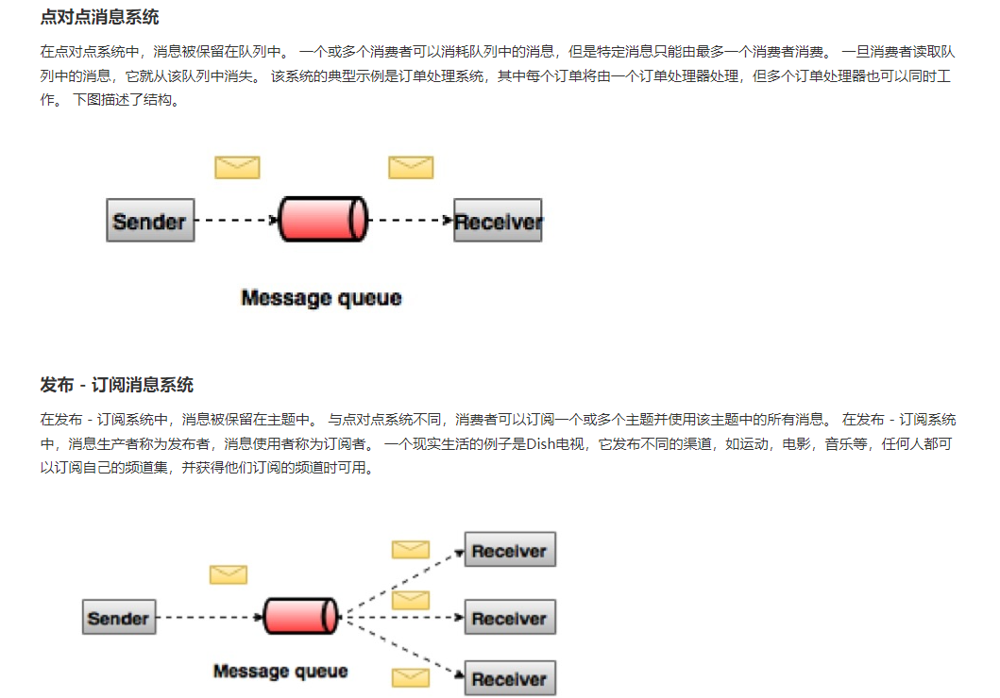

Kafka是一个分布式消息队列。Kafka对消息保存时根据Topic进行归类，发送消息者称为Producer，消息接受者称为Consumer，此外kafka集群有多个kafka实例组成，每个实例(server)称为broker。

无论是kafka集群，还是consumer都依赖于zookeeper集群保存一些meta信息，来保证系统可用性。

## Kafka架构及相关概念

> 1. Producer ：消息生产者，就是向kafka broker发消息的客户端；
> 2. Consumer ：消息消费者，向kafka broker取消息的客户端；
> 3. Topic ：可以理解为一个队列；
> 4. Consumer Group （CG）：这是kafka用来实现一个topic消息的广播（发给所有的consumer）和单播（发给任意一个consumer）的手段。一个topic可以有多个CG。topic的消息会复制（不是真的复制，是概念上的）到所有的CG，但每个partion只会把消息发给该CG中的一个consumer。如果需要实现广播，只要每个consumer有一个独立的CG就可以了。要实现单播只要所有的consumer在同一个CG。用CG还可以将consumer进行自由的分组而不需要多次发送消息到不同的topic；
> 5. Broker ：一台kafka服务器就是一个broker。一个集群由多个broker组成。一个broker可以容纳多个topic；
> 6. Partition（分区）：为了实现扩展性，一个非常大的topic可以分布到多个broker（即服务器）上，一个topic可以分为多个partition，每个partition是一个有序的队列。partition中的每条消息都会被分配一个有序的id（offset）。kafka只保证按一个partition中的顺序将消息发给consumer，不保证一个topic的整体（多个partition间）的顺序；
> 7. Offset：kafka的存储文件都是按照offset.kafka来命名，用offset做名字的好处是方便查找。例如你想找位于2049的位置，只要找到2048.kafka的文件即可。当然the first offset就是00000000000.kafka。

一个 topic 对应的多个 partition 分散存储到集群中的多个 broker 上，存储方式是一个 partition 对应一个文件，每个 broker 负责存储在自己机器上的 partition 中的消息读写。

**副本（Replication）**:

> 同一个partition可能会有多个replication（对应 server.properties 配置中的 default.replication.factor=N）。没有replication的情况下，一旦broker 宕机，其上所有 patition 的数据都不可被消费，同时producer也不能再将数据存于其上的patition。引入replication之后，同一个partition可能会有多个replication，而这时需要在这些replication之间选出一个leader，producer和consumer只与这个leader交互，其它replication作为follower从leader 中复制数据。

关于生产和消费过程的分析可以参考

- https://github.com/Diffblue-benchmarks/liuzhaopo-Queue/blob/master/Kafka%E8%B6%85%E7%BA%A7%E8%AF%A6%E7%BB%86%E6%95%99%E7%A8%8B.md#kafka%E7%94%9F%E4%BA%A7%E8%BF%87%E7%A8%8B%E5%88%86%E6%9E%90
- https://www.w3cschool.cn/apache_kafka/apache_kafka_fundamentals.html

# 环境搭建

http://kafka.apache.org/downloads

在此之前，因为kafka依赖于zookeeper，所以要提前安装Java和zookeeper

首先启动zookeeper

```
zkServer.sh/cmd

zkCli.sh/cmd
```

启动kafka

```
kafka-server-start.bat ..\..\config\server.properties
```

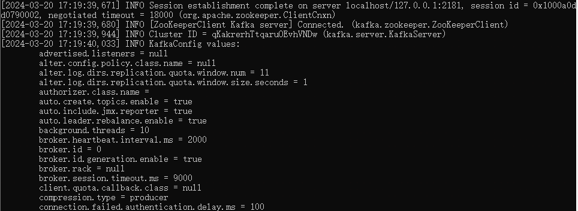

```
kafka-server-stop.bat ..\..\config\server.properties
```

# 使用

## topic相关

### 创建主题

```
kafka-topics.bat --create --zookeeper localhost:2181 --replication-factor 1 --topic test
```

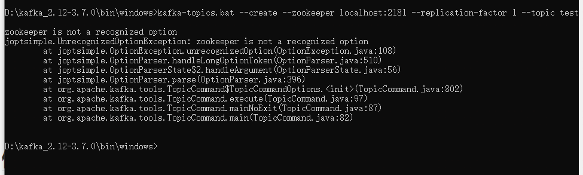

报错了，新版本的kafka，已经不需要依赖zookeeper来创建topic，新版的kafka创建topic指令为下：

```
kafka-topics.bat --create --bootstrap-server localhost:2181 --replication-factor 1 --partitions 1 --topic test1
```

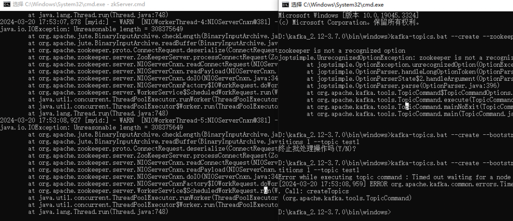

因为老版本的 Kafka/Zookeeper 设置与新的设置之间的变化。 在老版本中，我们应该使用 --zookeeper 选项和端口 2181(问题代码);但是，对于新的 Kafka/Zookeeper 版本，**用户应默认将端口 9092 用于客户 API**。

```
kafka-topics.bat --create --bootstrap-server 127.0.0.1:9092 --replication-factor 1 --partitions 1 --topic test1
```

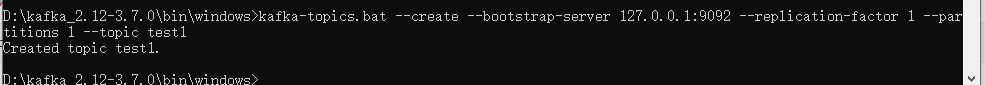

- `--topic` 定义topic名 
- `--replication-factor` 定义副本数 
- `--partitions` 定义分区数

### 查看topic

列出服务器的topic

```
kafka-topics.sh --zookeeper localhost:2181 --list
在kafka3后使用下面命令
kafka-topics.bat --bootstrap-server localhost:9092 --list
```

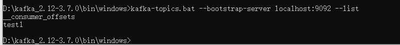

查看topic详情

```
kafka-topics.bat --bootstrap-server localhost:9092 --describe --topic test1
```

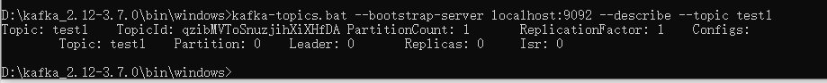

### 删除topic

```
kafka-topics.bat --bootstrap-server localhost:9092 --delete --topic test1
```

需要server.properties中设置delete.topic.enable=true否则只是标记删除或者直接重启。

## 生产者生产消息

```
kafka-console-producer.bat --broker-list localhost:9092 --topic test1
```

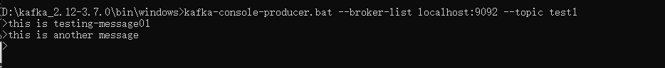

## 消费者消费消息

```
kafka-console-consumer.bat --bootstrap-server localhost:9092 --topic test1 --from-beginning
```

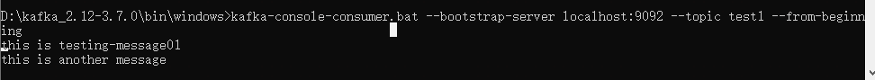

```
kafka-console-consumer.bat --bootstrap-server localhost:9092 --topic test1 --partition 0 --from-beginning
```

这将只从名为 "test1" 的主题的第一个分区（分区0）开始消费消息，并且 `--from-beginning` 参数表示从该分区的起始位置开始消费消息。你可以根据需要更改 `--partition` 参数的值，以便从其他分区开始消费消息。

```
kafka-console-consumer.bat --bootstrap-server localhost:9092 --topic test1
```

获取订阅后发布的消息

# 使用Java操作Kafka

相关依赖

```xml
<dependencies>
    <dependency>
        <groupId>org.apache.kafka</groupId>
        <artifactId>kafka-clients</artifactId>
        <version>0.11.0.0</version>
    </dependency>
    <dependency>
        <groupId>org.apache.kafka</groupId>
        <artifactId>kafka_2.12</artifactId>
        <version>0.11.0.0</version>
    </dependency>
    <dependency>
        <groupId>log4j</groupId>
        <artifactId>log4j</artifactId>
        <version>1.2.17</version>
    </dependency>
    <dependency>
        <groupId>org.apache.kafka</groupId>
        <artifactId>kafka-streams</artifactId>
        <version>0.11.0.2</version>
    </dependency>
</dependencies>
```

## 创建生产者

在创建生产者之前，还是要先创建一个topic，分区和副本均为1

```
kafka-topics.bat --create --bootstrap-server 127.0.0.1:9092 --replication-factor 1 --partitions 1 --topic first
```

利用java代码创建生产者生产消息到topic

```
package org.example;

import org.apache.kafka.clients.producer.KafkaProducer;
import org.apache.kafka.clients.producer.ProducerRecord;

import java.util.Properties;

/**
 * <p> Author：lzhpo </p>
 * <p> Title：</p>
 * <p> Description：
 * 创建生产者（新API）
 * </p>
 */
public class NewProducer {

    public static void main(String[] args) {

        Properties properties = new Properties();
        // Kafka服务端的主机名和端口号
        properties.put("bootstrap.servers", "localhost:9092");
        // 等待所有副本节点的应答
        properties.put("acks", "all");
        // 消息发送最大尝试次数
        properties.put("retries", 0);
        // 一批消息处理大小
        properties.put("batch.size", 16384);
        // 请求延时
        properties.put("linger.ms", 1);
        // 发送缓存区内存大小
        properties.put("buffer.memory",33554432);
        // key序列化
        properties.put("key.serializer", "org.apache.kafka.common.serialization.StringSerializer");
        // value序列化
        properties.put("value.serializer", "org.apache.kafka.common.serialization.StringSerializer");

        KafkaProducer<String, String> producer = new KafkaProducer<>(properties);
        for (int i = 0; i < 50; i++) {
            producer.send(new ProducerRecord<String, String>("first", Integer.toString(i), "HelloWorld-" +i));
        }

        producer.close();
    }
}
```

运行后向生产消息到topic中，然后消费者消费消息

```
kafka-console-consumer.bat --bootstrap-server localhost:9092 --topic first --from-beginning
```

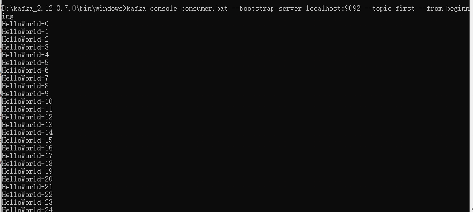

消息内容是append到log文件里面的

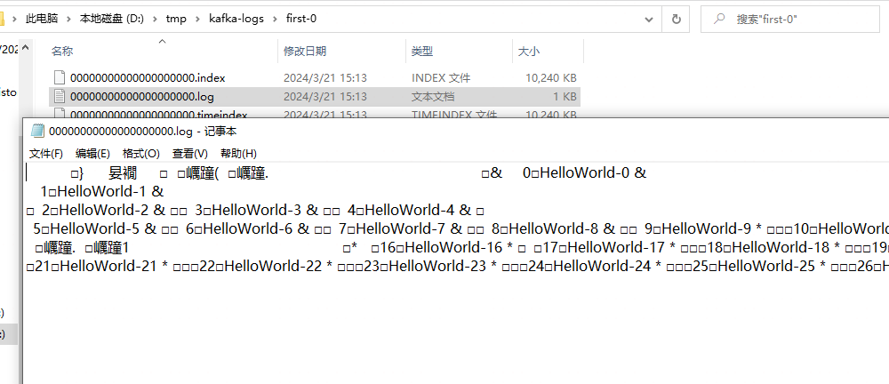

## 创建消费者

```java
package org.example;
import org.apache.kafka.clients.consumer.ConsumerRecord;
import org.apache.kafka.clients.consumer.ConsumerRecords;
import org.apache.kafka.clients.consumer.KafkaConsumer;

import java.util.Arrays;
import java.util.Properties;

/**
 * <p> Author：lzhpo </p>
 * <p> Title：</p>
 * <p> Description：
 * 官方提供案例（自动维护消费情况）（新API）
 * </p>
 */
public class CustomNewConsumer {

    public static void main(String[] args) {

        Properties props = new Properties();
        // 定义kakfa 服务的地址，不需要将所有broker指定上
        props.put("bootstrap.servers", "localhost:9092");
        // 制定consumer group
        props.put("group.id", "test");
        // 是否自动确认offset
        props.put("enable.auto.commit", "true");
        // 自动确认offset的时间间隔
        props.put("auto.commit.interval.ms", "1000");
        // key的序列化类
        props.put("key.deserializer", "org.apache.kafka.common.serialization.StringDeserializer");
        // value的序列化类
        props.put("value.deserializer", "org.apache.kafka.common.serialization.StringDeserializer");
        // 定义consumer
        KafkaConsumer<String, String> consumer = new KafkaConsumer<>(props);

        // 消费者订阅的topic, 可同时订阅多个
        consumer.subscribe(Arrays.asList("first", "second","test1"));
//        consumer.subscribe(Arrays.asList("*"));

        while (true) {
            // 读取数据，读取超时时间为100ms
            ConsumerRecords<String, String> records = consumer.poll(100);

            for (ConsumerRecord<String, String> record : records)
                System.out.printf("offset = %d, key = %s, value = %s%n", record.offset(), record.key(), record.value());
        }
    }
}
```

当我在消费者订阅的topic中发布消息的时候，消费者收到对应信息，还有偏移量

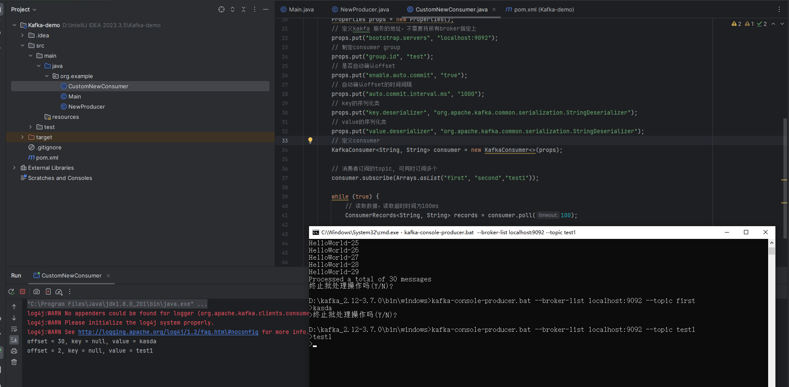

# 利用Python操作Kafka

## 创建生产者

这些都源于最近写的爬虫需要接入Kafka的代码的部分函数

```python
def send_message_to_kafka(final_use_record_list):
    bootstrap_servers = get_kafka_server()
    topic_name = get_kafka_topic()
# 创建kafka生产者
producer = KafkaProducer(bootstrap_servers=bootstrap_servers, value_serializer=lambda x: json.dumps(x).encode('utf-8'), api_version=(0, 10, 2))

# print(final_use_record_list)
for use_record in final_use_record_list:
    producer.send(topic_name, use_record)

# 关闭生产者
producer.close()
```
对于生产者的话只需要将消息发布到kafka，只需要对应的Kafka服务器地址和topic，与分区和副本无关

## 创建消费者

    def consume_messages_from_kafka(group_id):
        bootstrap_servers = get_kafka_server()
        topic_name = get_kafka_topic()
    # 创建kafka消费者
    consumer = KafkaConsumer(
        topic_name,
        bootstrap_servers=bootstrap_servers,
        group_id=group_id,
        auto_offset_reset='earliest',
        value_deserializer=lambda x: json.loads(x.decode('utf-8'))
    )
    
    # 消费消息
    for message in consumer:
        print("Received message:", message.value)
    
    # 关闭消费者
    consumer.close()

对于消费者的话，就需要提供自己的group_id来进行消费，auto_offset_reset的话有latest和earliset，从最早或者最晚进行消费，当消费后，如果重新运行就拿不到对应的信息了，需要换一个group_id


对于Kafka，还有更多的应用，他可以结合Storm对Kafka数据进行计算，在实际场景中，可以用kafka手机各种服务的日志，通过Kafka以接口服务的方式开放给各种消费者，例如Flink，Hadoop，ElasticSearch，这样可以实现分布式系统中海量日志数据的处理和分析。


参考链接：

https://blog.csdn.net/qq_27166635/article/details/134897956

https://dunwu.github.io/linux-tutorial/linux/soft/kafka-install.html#%E5%90%AF%E5%8A%A8%E6%9C%8D%E5%8A%A1%E5%99%A8

https://www.w3cschool.cn/apache_kafka/apache_kafka_basic_operations.html