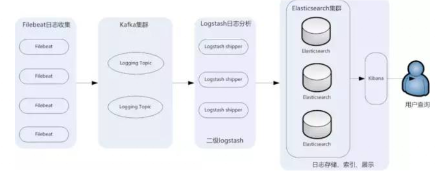
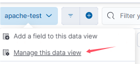

# 前言

ELK是一套开源免费、功能强大的日志分析管理系统，由ElasticSearch、Logstash、Kibana三部分组成。ELK开源对系统日志，网站日志进行收集、清洗、过滤，集中在可视化平台上实时检索分析。

> - Elasticsearch ：分布式搜索引擎。具有高可伸缩、高可靠、易管理等特点。可以用于全文检索、结构化检索和分析，并能将这三者结合起来。Elasticsearch 基于 Lucene 开发，现在使用最广的开源搜索引擎之一，Wikipedia 、StackOverflow、Github 等都基于它来构建自己的搜索引擎。
> - Logstash ：数据收集处理引擎。支持动态的从各种数据源搜集数据，并对数据进行过滤、分析、丰富、统一格式等操作，然后存储以供后续使用。
> - Kibana ：可视化化平台。它能够搜索、展示存储在 Elasticsearch 中索引数据。使用它可以很方便的用图表、表格、地图展示和分析数据。

这套架构由Logstash部署在节点上收集日志，分析后发送给ElasticSearch服务器进行存储，ES数据库提供了查询的API，可以通过Kibana对日志进行可视化查询，分析，根据需求生成报表

这套架构非常简单，但是Logstash这个日志采集器依赖Java，在数据量大的时候会消耗过多的资源，可能会塞爆JVM虚拟机，并且在数据量大的时候没有使用消息队列，所以可能造成日志丢失的情况

为了解决这一问题，可以使用FileBeats代替前端的Logstash Agent（filebeat就基于Go语言没有任何依赖，配置文件简单，格式明了，同时filebeat比logstash更加轻量级，所以占用系统资源极少），使用kafka这种消息队列对日志进行缓存，于是整个的架构就变成了这样的架构（抄的一副图，有点模糊）



通过FileBeats在节点上收集日志，打入Kafka队列，再通过Logstash进行分析（这里不是在应用节点上，可以不用考虑资源对于应用的影响），将分析后的结果存储到ES数据库种，用户通过Kibana进行可视化查询

# 实践

本次采集日志以apache为例

kibana：8.15.0

es：8.15.0

logstash：8.15.0

## Kafka集群搭建

这一步在很早之前就做过，先启动zookeeper，再启动kafka，至于topic的话，再日志采集的时候会自动创建，只需要消费者消费信息

另外还可以用grafana对kafka集群进行监控

## FileBeats搭建

日志采集器选择了Filebeat而不是Logstash，是由于 Logstash 是跑在 JVM 上面，资源消耗比较大，后来作者用 GO 写了一个功能较少但是资源消耗也小的轻量级的 Agent 叫 Logstash-forwarder，后来改名为FileBeat

https://www.elastic.co/cn/downloads/beats/filebeat

尝试采集数据，Linux的配置文件在/etc/filebeat/filebeat.yml

```
filebeat.inputs: 
- type: log
  enabled: true
  paths:
    - D:\phpstudy_pro\Extensions\Apache2.4.39\logs\access.log.1724371200
    - D:\phpstudy_pro\Extensions\Apache2.4.39\logs\error.log
  fields:
    log_topic: apachelogs
  multiline:
    pattern: '^(\d{3}|\d{2}|\d{1})\b'
    negate: true
    match: after

output.kafka:
  enabled: true
  hosts: ["localhost:9092"]
  topic: applog
  version: "0.10.2.0"
  compression: gzip

processors:
- drop_fields:
    fields: ["beat", "input", "source", "offset"]

logging.level: error
name: app-server-ip
```

这个配置文件的意思是采集apache的日志，输出到applog这个topic下，可以输出到多个kafka中

启动filebeat采集数据

```
filebeat.exe -e -c filebeat.yml
```

暂时在windows上测试，用phpstudy的日志

消费者消费日志，数据会存在一定延时

```
kafka-console-consumer.bat --bootstrap-server localhost:9092 --topic applog
```


最后搭建的时候放在了Ubuntu上

```
filebeat.inputs: 
- type: log
  enabled: true
  paths:
    - /var/log/apache2/access.log
    - /var/log/apache2/error.log
    - /var/log/apache2/other_vhosts_access.log
  fields:
    log_topic: apachelogs
  multiline:
    pattern: '^(\d{3}|\d{2}|\d{1})\b'
    negate: true
    match: after

output.kafka:
  enabled: true
  hosts: ["localhost:9092"]
  topic: applog
  version: "0.10.2.0"
  compression: gzip

processors:
- drop_fields:
    fields: ["beat", "input", "source", "offset"]

logging.level: error
name: app-server-ip
```

```
sudo filebeat -e -c filebeat.yml
```


## Elastic集群搭建

ElasticSearch架构有三类角色——Client Node、Data Node和Master Node

搜索查询的请求一般是经过Client Node来向Data Node获取数据，而索引查询首先请求Master Node节点，然后Master Node将请求分配到多个Data Node节点完成一次索引查询


**Master Node**：主要用于元数据(metadata)的处理，比如索引的新增、删除、分片分配等，以及管理集群各个节点的状态。由于数据的存储和查询都不会走主节点，所以主节点的压力相对较小，因此主节点的内存分配也可以相对少些，但是主节点却是最重要的，因为一旦主节点宕机，整个elasticsearch集群将不可用。所以一定要保证主节点的稳定性。

**Data Node**：数据节点，这些节点上保存了数据分片。它负责数据相关操作，比如分片的CRUD、搜索和整合等操作。数据节点上面执行的操作都比较消耗CPU、内存和I/O资源，数据节点服务器要选择较好的硬件配置。

**Client Node**：客户端节点。client node存在的好处是可以分担data node的一部分压力，因为elasticsearch的查询是两层汇聚的结果，第一层是在data node上做查询结果汇聚，然后把结果发给client node，client node接收到data node发来的结果后再做第二次的汇聚，然后把最终的查询结果返回给用户。这样，client node就替data node分担了部分压力。

直接去官网下载es的安装包

要配置集群的话需要修改配置文件

```
$ vim config/elasticsearch.yml

cluster.name: es 
node.name: es-node1
node.master: true
node.data: true
network.host: 192.168.0.1
discovery.zen.ping.unicast.hosts: ["192.168.0.2","192.168.0.3"]
discovery.zen.minimum_master_nodes: 2
```

集群重要配置项

- **node.name** 可以配置每个节点的名称
- **node.master** 可以配置该节点是否有资格成为主节点。如果配置为 true，则主机有资格成为主节点，配置为 false 则主机就不会成为主节点，可以去当数据节点或[负载均衡](https://cloud.tencent.com/product/clb?from_column=20065&from=20065)节点
- **node.data** 可以配置该节点是否为数据节点，如果配置为 true，则主机就会作为数据节点，注意主节点也可以作为数据节点
- **discovery.zen.ping.unicast.hosts** 可以配置集群的主机地址，配置之后集群的主机之间可以自动发现，需要剔除自己。
- **discovery.zen.minimum_master_nodes**: 为了防止集群发生“脑裂”，通常需要配置集群最少主节点数目，通常为 (主节点数目 / 2) + 1

这里为了测试，所有的搭建都是单机启动的

运行后访问9200出现如下界面


检测节点健康状况，在任意节点通过执行如下命令，如果能发现列表展示的主节点、客户端和数据节点都是一一对应的，那么说明集群服务都已经正常启动了，我这里只单机模式启动，显示的名字——GbjhXUV

```
curl "http://ip:port/_cat/nodes"
```


开启远程访问，elasticsearch.yml


这里要注意一下，kibana8需要es7以上的，所以重新下一个高版本的elasticsearch

在启动过程中可以看到密码和token


需要通过https访问


重置kibana_system，可以直接用账号密码访问

```
bin/elasticsearch-reset-password -u kibana_system
```


刷新token

```
./elasticsearch-create-enrollment-token -s kibana --url "https://192.168.56.103:9200"
```

## Logstash

https://doc.yonyoucloud.com/doc/logstash-best-practice-cn/get_start/install.html

虽然没有用Logstash去采集日志了，但是对于数据的处理还是要用到Logstash

Logstash是一个开源的、服务端的数据处理pipeline（管道），它可以接收多个源的数据、然后对它们进行转换、最终将它们发送到指定类型的目的地

Logstash是通过插件机制实现各种功能的，可以在https://github.com/logstash-plugins 下载各种功能的插件，也可以自行编写插件

Logstash的数据处理过程主要包括：**Inputs**, **Filters**, **Outputs** 三部分， 另外在Inputs和Outputs中可以使用**Codecs**对数据格式进行处理。这四个部分均以插件形式存在，在logstash.conf配置文件中设置需要使用的input，filter，output, codec插件，以实现特定的数据采集，数据处理，数据输出等功能

- **Inputs**：用于从数据源获取数据，常见的插件如file, syslog, redis, beats 等
- **Filters**：用于处理数据如格式转换，数据派生等，常见的插件如grok, mutate, drop, clone, geoip等
- **Outputs**：用于数据输出，常见的插件如elastcisearch，file, graphite, statsd等
- **Codecs**：Codecs不是一个单独的流程，而是在输入和输出等插件中用于数据转换的模块，用于对数据进行编码处理，常见的插件如json，multiline

查看一下自带的插件类型，我是8.15.0版本

```
logstash-plugin list
```


这些是自带的插件

```
logstash-codec-avro
logstash-codec-cef
logstash-codec-collectd
logstash-codec-dots
logstash-codec-edn
logstash-codec-edn_lines
logstash-codec-es_bulk
logstash-codec-fluent
logstash-codec-graphite
logstash-codec-json
logstash-codec-json_lines
logstash-codec-line
logstash-codec-msgpack
logstash-codec-multiline
logstash-codec-netflow
logstash-codec-plain
logstash-codec-rubydebug
logstash-filter-aggregate
logstash-filter-anonymize
logstash-filter-cidr
logstash-filter-clone
logstash-filter-csv
logstash-filter-date
logstash-filter-de_dot
logstash-filter-dissect
logstash-filter-dns
logstash-filter-drop
logstash-filter-elastic_integration
logstash-filter-elasticsearch
logstash-filter-fingerprint
logstash-filter-geoip
logstash-filter-grok
logstash-filter-http
logstash-filter-json
logstash-filter-kv
logstash-filter-memcached
logstash-filter-metrics
logstash-filter-mutate
logstash-filter-prune
logstash-filter-ruby
logstash-filter-sleep
logstash-filter-split
logstash-filter-syslog_pri
logstash-filter-throttle
logstash-filter-translate
logstash-filter-truncate
logstash-filter-urldecode
logstash-filter-useragent
logstash-filter-uuid
logstash-filter-xml
logstash-input-azure_event_hubs
logstash-input-beats
└── logstash-input-elastic_agent (alias)
logstash-input-couchdb_changes
logstash-input-dead_letter_queue
logstash-input-elastic_serverless_forwarder
logstash-input-elasticsearch
logstash-input-exec
logstash-input-file
logstash-input-ganglia
logstash-input-gelf
logstash-input-generator
logstash-input-graphite
logstash-input-heartbeat
logstash-input-http
logstash-input-http_poller
logstash-input-jms
logstash-input-pipe
logstash-input-redis
logstash-input-stdin
logstash-input-syslog
logstash-input-tcp
logstash-input-twitter
logstash-input-udp
logstash-input-unix
logstash-integration-aws
 ├── logstash-codec-cloudfront
 ├── logstash-codec-cloudtrail
 ├── logstash-input-cloudwatch
 ├── logstash-input-s3
 ├── logstash-input-sqs
 ├── logstash-output-cloudwatch
 ├── logstash-output-s3
 ├── logstash-output-sns
 └── logstash-output-sqs
logstash-integration-elastic_enterprise_search
 ├── logstash-output-elastic_app_search
 └──  logstash-output-elastic_workplace_search
logstash-integration-jdbc
 ├── logstash-input-jdbc
 ├── logstash-filter-jdbc_streaming
 └── logstash-filter-jdbc_static
logstash-integration-kafka
 ├── logstash-input-kafka
 └── logstash-output-kafka
logstash-integration-logstash
 ├── logstash-input-logstash
 └── logstash-output-logstash
logstash-integration-rabbitmq
 ├── logstash-input-rabbitmq
 └── logstash-output-rabbitmq
logstash-integration-snmp
 ├── logstash-input-snmp
 └── logstash-input-snmptrap
logstash-output-csv
logstash-output-elasticsearch
logstash-output-email
logstash-output-file
logstash-output-graphite
logstash-output-http
logstash-output-lumberjack
logstash-output-nagios
logstash-output-null
logstash-output-pipe
logstash-output-redis
logstash-output-stdout
logstash-output-tcp
logstash-output-udp
logstash-output-webhdfs
logstash-patterns-core
```

编写配置文件/etc/logstash/logstash.conf

```
input {
  kafka {
    type => "kafka"
    bootstrap_servers => "localhost:9092"
    topics => "applog"
    consumer_threads => 2
    codec => "json"
  }
}

filter {
    grok {
        match => [
            "message","%{HTTPDATE:timestamp}",
            "message","%{COMBINEDAPACHELOG}"
        ]
    }
    date {
        match => ["timestamp", "dd/MMM/yyyy:HH:mm:ss Z"]
    }
}

output {
  elasticsearch {
    hosts => ["https://localhost:9200"]
    index => "applogs-%{+YYYY.MM.dd}"
    user => "elastic"
    password => "PUWBT2v*I6wM=2Hz38Fb"
    ssl => true
    ssl_certificate_verification => false  # 跳过证书验证,不适用与生成环境
  }
}
```

生产环境应该配置证书

```
output {
  elasticsearch {
    hosts => ["https://localhost:9200"]
    index => "applogs-%{+YYYY.MM.dd}"
    user => "elastic"  # 替换为实际的用户名
    password => "password"  # 替换为实际的密码
    ssl => true  # 启用 SSL/TLS
    cacert => "/path/to/ca.crt"  # 替换为 CA 证书的路径
  }
}
```

```
logstash --path.settings /etc/logstash -f /etc/logstash/logstash.conf
```

访问`https://192.168.56.103:9200/applogs-*/_search?pretty`观察数据采集是否成功发送到es


## Kibana安装

```sh
https://artifacts.elastic.co/downloads/kibana/kibana-8.15.0-linux-x86_64.tar.gz

windows
https://artifacts.elastic.co/downloads/kibana/kibana-8.15.0-windows-x86_64.zip
```

修改配置文件开启远程访问

```
vim /usr/local/kibana/kibana-8.15.0/config/kibana.yml

server.port: 5601
server.host: "192.168.0.1"
elasticsearch.url: "http://192.168.56.103:9200"
```

kibana我是直接搭在本机上的


填入es生成的token


填入verify-code


或者自己选择输入用户名密码（刚才重置的kibana_system账号）

在kibana登录界面用elastic账号登录


添加索引




展示日志


# 写在最后

本次kibana搭建在windows上，其他的均搭建在Ubuntu上，整体的流程如下

filebeats采集web服务器的apache日志——>kafka集群——>logstash设置kafka输入源，对数据清洗过滤——>ES集群中——>kibana设置es集群的索引（logstash中配置过），进行可视化展示

因为机器配置的原因，有一部分在windows上，有一部分在Ubuntu上

看到过一些文章，把ES数据库换成了click house，貌似可以增加效率

当然也不止是采集web流量，只要能拿到输入源都可以


参考链接：

https://cloud.tencent.com/developer/article/1474799

https://cloud.tencent.com/developer/article/2310819