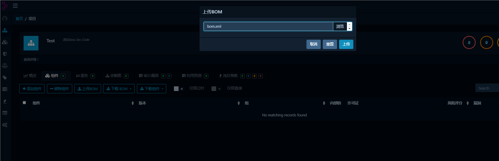
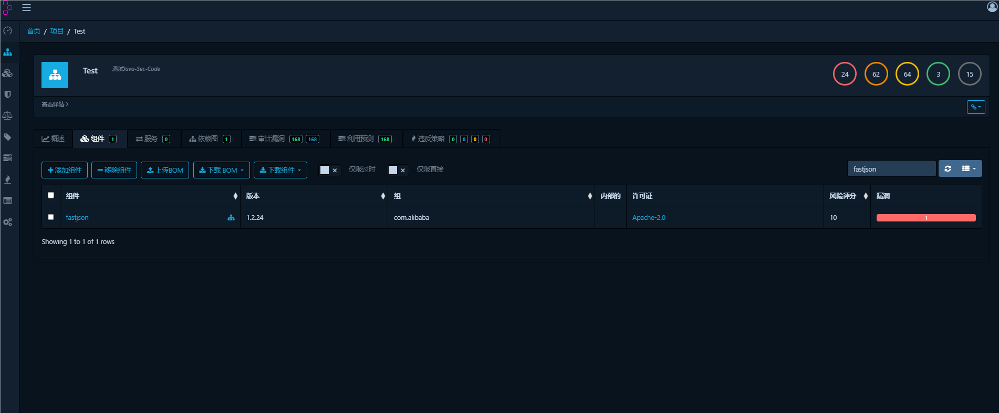
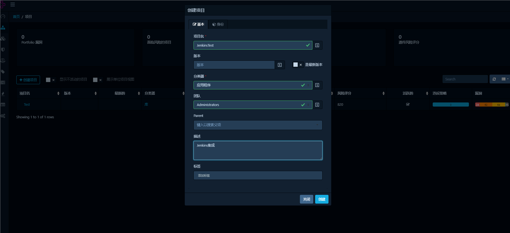

# 前言

之前在Gitlab+SonarQube+Jenkin的流水线中集成了Dependency-Check进行第三方组件扫描， 并且可以在SonarQube中看到Dependency-Check的报告


但是这个报告给人的感觉并不是很友好，于是尝试在Jenkins流水线中集成另外一个第三方组件扫描Dependency-Track

# 安装Dependency-Track

```
# 下载DependencyTrack镜像
docker pull owasp/dependency-track

# 创建并使用宿主机上的存储以避免数据丢失（自己搭建的测试环境跳过了这不）
docker volume create --name dependency-track

# 在8089端口上运行DependencyTrack
docker run -d -p 8089:8080 --name dependency-track owasp/dependency-track
```

默认账户密码admin/admin


如果虚拟机的内存不够，可以把里面的jar包托出来，然后用jdk21运行

Dependency Track通过接收到生成的Software BOM(软件物料清单)，然后检查物料清单中的各个组件(以及当前清单中的版本)在漏洞数据库中是否存在已知安全漏洞的记录，并通过Dashboard展示出来。所以你需要先准备好一份SBOM清单，然后发送给Dependency Track，等待它完成扫描检测之后，然后在管理界面上查看结果

生成SBOM的工具有几个，其中比较有名的是CycloneDX。一旦我们有了BOM文件，我们就可以手动或通过整合CI/CD中的上传功能将其上传到Dependency-Track。Dependency track相当于一个漏洞库和分析引擎，它基于SBOM，在漏洞库中搜索，这样我们就可以获得比传统组件分析更完整、更复杂的信息

类似pip request requirements，清点出使用的组件。Dependency track相当于一个漏洞库和分析引擎，这个方法好处就是只需要在客户端直接生成bom.xml

总结起来分为两步：

1. 生成bom.xml文件
2. 将生成的bom.xml文件上传到Dependency-Track

生成bom.xml

```
mvn org.cyclonedx:cyclonedx-maven-plugin:makeBom
```


上传到Dependency-Track，先创建一个项目


点击项目名称进入项目，目前由于没有上传bom.xml也就是软件物料文件，所以没有数据显示


点击Components->Upload Bom进行上传



刷新后看到了分析，搜索fastjson找到对应组件



点进去会有对应的漏洞编号


也有漏洞审计相关，界面比Dependency-Check会好不少


并且在概述还有看板

# 集成到Jenkins

在jenkins中安装Dependency-Track插件


生成一个API密钥


```
odt_9AMaTtDu00LtB7gA0ifo9WehkMDkFBsM
```

在Jenkin中配置DT的API


与Gitlab的流水线之前是配置好了的，就不再配置了，修改一下配置，将原本的Dependency-Check删掉


构建的时候需要

```
# 打包
mvn clean install -D mvn.test.skip=true
# 生成bom.xml文件
mvn org.cyclonedx:cyclonedx-maven-plugin:makeBom
```

所以配置了mvn的构建步骤，接下来再是sonarqube的扫描

再Dependency-Track中创建一个新的项目——JenkinsTest



在构建后操作中添加Publish BOM to Dependency-Track，选择刚才创建的空项目


在Gitlab推送后，触发了Jenkins的构建


构建完成后可以点击这个跳转到对应页面


可以看到已经有对应数据了，因为和前面的代码相同，所以得到的结果也一样


# 写在最后

总的来说，对于安全从业人员来看，我们就需要看到的是这个组件是否存在什么漏洞，就需求来看，Dependency-Track比Dependency-Check更为直观

这种数据展示方式相比于直接放NVD的数据可以很直观地看到对应组件的版本，是否存在漏洞，对应的漏洞编号，可以更方便定位漏洞进行修复，并且也可以很好地集成到CICD的流程中


参考链接：

https://www.cnblogs.com/yemoox/p/16478513.html

https://www.freebuf.com/articles/network/287486.html

https://plugins.jenkins.io/dependency-track/