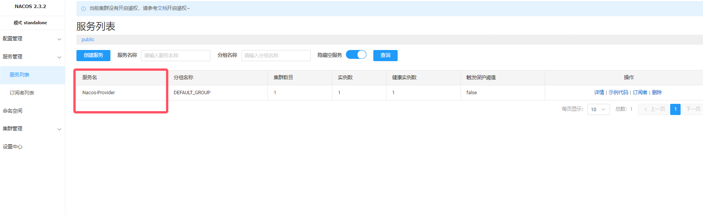

# 前言

之前遇到过很多Nacos，但是却不清楚Nacos具体用法，最近想来了解一下Nacos的具体用法，顺便复现一下前端时间爆出来的Nacos的RCE漏洞

# 环境搭建

Nacos 是一个用于动态服务发现和配置以及服务管理的平台，Derby 是一个轻量级的嵌入式数据库。接口 /nacos/v1/cs/ops/derby 和 /nacos/v1/cs/ops/data/removal 在使用 Derby 数据库作为内置数据源时。用于运维人员进行数据运维和问题排查，在使用 standalone 模式启动 Nacos时，为了避免因搭建外置数据库而占用额外的资源，会使用 Derby 数据库作为数据源。

受影响版本的 Nacos 默认未开启身份认证，/data/removal 接口存在条件竞争漏洞，攻击者可借此接口执行恶意SQL，加载恶意jar并注册函数，随后可以在未授权条件下利用 derby sql 注入漏洞（CVE-2021-29442）调用恶意函数来执行恶意代码。

此前官方开发者认为属于功能特性，未做处理，后在2.4.0版本中通过增加 derbyOpsEnabled 选项默认关闭 derby 接口来避免被滥用。

**影响范围：**Nacos低于2.4.0

漏洞Commit：https://github.com/alibaba/nacos/commit/ed7bd03d4c214d68f51654fee3eea7ecf72fd9ab

**修复方案：**

- 将组件 com.alibaba.nacos:nacos-config 升级至 2.4.0 及以上版本
- 将组件 nacos 升级至 2.4.0 及以上版本

**复现环境：**

- win10
- Nacos-server 2.3.2
- JDK17

在Github下载漏洞源码和可执行文件，修改startup.cmd，将里面的部分内容修改为如下

```
rem if nacos startup mode is standalone
if %MODE% == "standalone" (
    echo "nacos is starting with standalone"
    set "NACOS_OPTS=-Dnacos.standalone=true"
    set "NACOS_JVM_OPTS=-Xms512m -Xmx512m -Xmn256m -agentlib:jdwp=transport=dt_socket,server=y,suspend=n,address=*:5005"
)

rem if nacos startup mode is cluster
if %MODE% == "cluster" (
    echo "nacos is starting with cluster"
    if %EMBEDDED_STORAGE% == "embedded" (
        set "NACOS_OPTS=-DembeddedStorage=true"
    )
    set "NACOS_JVM_OPTS=-server -Xms2g -Xmx2g -Xmn1g -XX:MetaspaceSize=128m -XX:MaxMetaspaceSize=320m -XX:-OmitStackTraceInFastThrow -XX:+HeapDumpOnOutOfMemoryError -XX:HeapDumpPath=%BASE_DIR%\logs\java_heapdump.hprof -XX:-UseLargePages -agentlib:jdwp=transport=dt_socket,server=y,suspend=n,address=*:5005"
)
```

IDEA配置远程调试，断点下在Commit中修改的地方


进入断点

# 漏洞复现

单机模式启动Nacos

```
startup.cmd -m standalone
```


运行POC


至于分析的话就不分析了，因为这个漏洞就是因为单机模式下的derby接口未授权，可以结合derby数据库远程加载jar包进行RCE，当然在P牛的星球中也有师傅提到了不出网RCE的方式

接下来来了解一下Nacos使用教程

# SpringBoot整合Nacos

需要两个项目Nacos-Provider和Nacos-Consumer，一个服务提供者，一个服务消费者

Nacos-Provider相关依赖

```
<dependencies>
    <dependency>
        <groupId>org.springframework.boot</groupId>
        <artifactId>spring-boot-starter-web</artifactId>
    </dependency>

    <dependency>
        <groupId>org.springframework.boot</groupId>
        <artifactId>spring-boot-starter-test</artifactId>
        <scope>test</scope>
    </dependency>

    <dependency>
        <groupId>com.alibaba.cloud</groupId>
        <artifactId>spring-cloud-starter-alibaba-nacos-discovery</artifactId>
        <version>2.1.2.RELEASE</version>
    </dependency>
    <!--服务配置依赖-->
    <dependency>
        <groupId>com.alibaba.cloud</groupId>
        <artifactId>spring-cloud-starter-alibaba-nacos-config</artifactId>
        <version>2.1.2.RELEASE</version>
    </dependency>
</dependencies>
```

这里因为Spring-Cloud版本依赖问题，需要用低版本的Spring-boot，JDK版本用的1.8

```
<parent>
    <groupId>org.springframework.boot</groupId>
    <artifactId>spring-boot-starter-parent</artifactId>
    <version>2.1.13.RELEASE</version>
    <relativePath/> <!-- lookup parent from repository -->
</parent>
```

ProviderController.java

```
package org.example.nacosprovider.Controllers;

import org.springframework.web.bind.annotation.GetMapping;
import org.springframework.web.bind.annotation.RestController;

import java.time.LocalTime;

@RestController
public class ProviderController {
    @GetMapping("invoke")
    public String invoke() {
        return LocalTime.now() + " invoke";
    }
}
```

一个控制器，输出时间加上invoke字符串

application.yml

```
server:
  port: 8070
spring:
  application:
    name: Nacos-Provider
  cloud:
    # nacos服务地址
    nacos:
      server-addr: 127.0.0.1:8848

```

启动类添加@EnableDiscoveryClient注解启动

从Spring Cloud Edgware开始，@EnableDiscoveryClient 或@EnableEurekaClient 可省略。只需加上相关依赖，并进行相应配置，即可将微服务注册到服务发现组件上。

@EnableDiscoveryClient和@EnableEurekaClient共同点就是：都是能够让注册中心能够发现，扫描到改服务。

不同点：@EnableEurekaClient只适用于Eureka作为注册中心，@EnableDiscoveryClient 可以是其他注册中心



注册成功

接下来再修改Provider-Consumer项目

```
<dependencies>
    <dependency>
        <groupId>org.springframework.boot</groupId>
        <artifactId>spring-boot-starter-web</artifactId>
    </dependency>
    <dependency>
        <groupId>org.springframework.cloud</groupId>
        <artifactId>spring-cloud-function-web</artifactId>
    </dependency>

    <dependency>
        <groupId>org.springframework.boot</groupId>
        <artifactId>spring-boot-starter-test</artifactId>
        <scope>test</scope>
    </dependency>
    <dependency>
        <groupId>org.springframework.cloud</groupId>
        <artifactId>spring-cloud-starter-openfeign</artifactId>
    </dependency>
    <dependency>
        <groupId>com.alibaba.cloud</groupId>
        <artifactId>spring-cloud-starter-alibaba-nacos-discovery</artifactId>
        <version>2.1.2.RELEASE</version>
    </dependency>

</dependencies>
```

需要nacos-discovery和openfeign依赖，spring版本和刚才一样

```
server:
  port: 8071
spring:
  application:
    name: Nacos-Consumer
  cloud:
    # nacos服务地址
    nacos:
      server-addr: 127.0.0.1:8848
```

接口ProviderFeign.java

```
package org.example.nacosconsumer.Interfaces;

import org.springframework.cloud.openfeign.FeignClient;
import org.springframework.web.bind.annotation.GetMapping;

@FeignClient("Nacos-Provider")
public interface ProviderFeign {
    @GetMapping("invoke")
    String invoke();
}
```

这里@FeignClient注解的内容和需要远程调用的服务名相同，接口是RPC的接口

ConsummerController.java

```
package org.example.nacosconsumer.Controllers;

import org.example.nacosconsumer.Interfaces.ProviderFeign;
import org.springframework.beans.factory.annotation.Autowired;
import org.springframework.web.bind.annotation.GetMapping;
import org.springframework.web.bind.annotation.RestController;

@RestController
public class ConsummerController {
    @Autowired
    private ProviderFeign providerFeign;
    @GetMapping("/test")
    public String test() {
        return providerFeign.invoke();
    }
}
```

创建一个Controller调用接口中的invoke方法来远程调用注册中心的Nacos-Provider服务invoke接口的方法

启动类加上@EnableFeignClients和@EnableDiscoveryClient注解


接下来访问`http://127.0.0.1:8071/test`


# 负载均衡

Nacos注册的服务默认是DEFAULT集群


可以再Nacos服务的配置文件下指定服务集群，比如 application.yml 中添加 spring.cloud.nacos.discovery.cluster-name 属性即可

```
server:
  port: 8070
spring:
  cloud:
    # nacos服务地址
    nacos:
      server-addr: 127.0.0.1:8848
      discovery:
        cluster-name: Test
```


由于集群机器配置不同，可以配置不同机器的权重，权重越大则访问频率越高，为 0 时则完全不会被访问到


调用的时候都可以去调用到


# 配置中心读取数据

再Nacos中创建配置，使用yaml或者properties格式


Date ID是识别标志

整合Spring Cloud

```
<dependency>
    <groupId>com.alibaba.cloud</groupId>
    <artifactId>spring-cloud-starter-alibaba-nacos-config</artifactId>
    <version>2.1.2.RELEASE</version>
</dependency>
```

nacos 配置需要配置到 bootstrap.yml 或 bootstrap.properties 文件中，而不能是application.yml/properties 文件

```
spring:
  cloud:
    nacos:
      server-addr: 127.0.0.1:8848
      config:
        prefix: Nacos-Provider
        server-addr: 127.0.0.1:8848
        file-extension: properties
        gourp: DEFAULT_GROUP # 默认DEFAULT_GROUP
```


创建一个新的Controller通过Value注解获取数据，添加@RefreshScope注解实现配置的动态刷新，这样再Nacos中修改数据可以动态更新代码数据内容

```
package org.example.nacosconsumer.Controllers;

import org.springframework.beans.factory.annotation.Value;
import org.springframework.cloud.context.config.annotation.RefreshScope;
import org.springframework.stereotype.Controller;
import org.springframework.web.bind.annotation.RequestMapping;
import org.springframework.web.bind.annotation.ResponseBody;

@RefreshScope
@Controller
public class IndexController {
    @Value("${user.name}")
    private String name;
    @Value("${user.age}")
    private String age;

    @RequestMapping("/")
    @ResponseBody
    public String index() {
        return " I am " + name + " , I am " + age + " years old!";
    }
}
```


读取多个配置，修改bootstrap.yml

```
spring:
  cloud:
    nacos:
      server-addr: 127.0.0.1:8848
      config:
        extension-configs:
          - refresh: true
            data-id: redis.properties
          - refresh: true
            data-id: jdbc.properties

```


# 命名空间

不同的项目，可以使用同一个Nacos服务，只需要创建不同的命名空间即可


然后再配置列表中就可以对不同命名空间进行配置


在服务中切换命名空间在bootstrap.yml添加，namespace使用的是命名空间的ID

```
spring:
  cloud:
    nacos:
      config:
        namespace: 99c2a531-b660-4d60-9351-e88b07b9f621
```


参考链接：

https://www.oscs1024.com/hd/MPS-sxgr-j9ak

代码审计星球

https://blog.csdn.net/cristianoxm/article/details/113639172

https://www.cnblogs.com/wenxuehai/p/16179629.html#autoid-h2-3-0-0

https://nacos.io/zh-cn/docs/v2/ecology/use-nacos-with-spring-cloud.html
