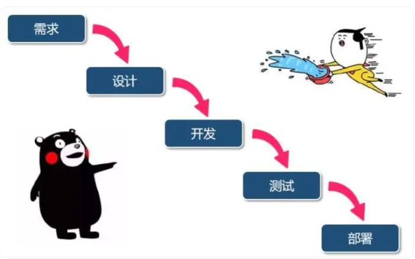
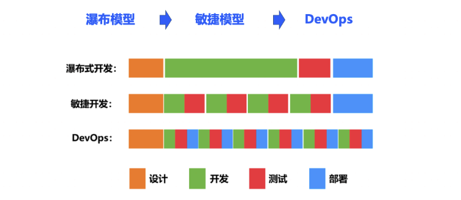

# 前言

之前都是在做技术，对于甲方的思路就是安全建设，应用安全，业务安全，安全研发，反入侵，安全运营等词语，但是具体是什么都是只听过一些名词，最近看到一篇文章把SDL相关的说的还是很细，就想来深入了解一下SDL相关的内容，以及SDL与DevSecOps究竟有什么关系

要说SDL，就不能只说SDL，更要了解为什么要做这个，这个怎么做，做到后有什么好处

# 如何减少产品中的漏洞

这种说法一般来说对象是已经完成开发的产品，有两种理论防御：一是漏洞防御，二是威胁防御

**漏洞防御体系**：面对的对象是已知的，明确的安全漏洞进行修复和防御，相当于厂商pr，这边就进行相应的修复，这种方式好处就是模式简单，发现漏洞那个快速高效的修复起到作用，但是存在未知的风险

**威胁防御体系**：一般来说是潜在的威胁，通过威胁建模、安全设计、安全测试等多个角度消减威胁和建立防御手段。与漏洞防御体系相比，这里的威胁不需要是明确的已经形成的安全问题，而是潜在的威胁都应该建立对应的手段进行识别和消减。肯定会更加的全面，但是耗费的成本和时间肯定也更多。

上面两种体系其实主要是在开发后的处理方式，有没有更前置的安全呢

回到软件开发阶段，如果能在开发周期内嵌入安全来发现问题，就能更好的收敛安全漏洞问题，由此就有了SDL和DevSecOps，其主要思想就是安全前置，或者说安全左移（在更早的流程中嵌入安全）

在不同阶段的漏洞修复成本是不一样的，越早发现成本越低，漏洞也更容易修复（在新代码编写前就修复了漏洞，这样新编写的代码就能更好地适配开发的软件）

# 安全开发生命周期（SDL）

SDL由微软提出并应用一个**帮助开发人员构建更安全的软件和解决安全合规要求的同时降低开发成本的软件开发过程**，侧重于软件开发的安全保证过程，旨在开发出安全的软件应用。

SDL的核心理念就是将**安全考虑集成在软件开发的每一个阶段**：需求分析、设计、编码、测试和维护。从需求、设计到发布产品的每一个阶段每都增加了相应的安全活动，以减少软件中漏洞的数量并将安全缺陷降低到最小程度。

在SDL模型中，一个核心点就是安全设计核心原则，就是安全要怎么做

可能比较难理解的就是攻击面最小化和默认安全：

- 攻击面最小化其实主要是两块，一个维度是暴露的CGI等都可能是攻击点，非必要的接口等要减少，另一个是即时暴露也应该限制访问访问范围从而缩小攻击面；而默认安全则指产品在设计的时候一些配置的默认项应该考虑是安全状态，比如一些安全开关应该是默认开启。

SDL、S-SDLC、SDLC的区别

- **SDLC（Software Development Life Cycle）**
  - SDLC是一个描述软件从开始到结束的生命周期的流程。它包括了需求分析、设计、编码、测试、部署和维护等阶段。SDLC的主要目标是生产高质量的软件，满足或超过客户期望，并在预定的时间和成本内完成。
- **SDL（Security Development Lifecycle）**
  - SDL是一个将安全性考虑纳入到软件开发生命周期中的过程。这意味着在SDLC的每个阶段（如需求分析、设计、编码、测试和维护）都会考虑到安全性。SDL的目标是在软件开发过程中减少安全性问题，从而降低潜在的安全风险。
- **S-SDLC（Secure Software Development Life Cycle）**
  - S-SDLC与SDL类似，都是将安全性纳入到软件开发生命周期中。S-SDLC强调在软件开发的每个阶段都应考虑和实施安全措施。这包括在需求分析、设计、编码、测试、部署和维护等阶段都应考虑到安全性。

从英文来看，SDLC是一个软件的生命开发周期，而SDL和S-SDLC都是在这个基础上假如了安全性的考虑

SDL和S-SDLC的主要区别在于，虽然两者都强调在软件开发过程中的安全性，但SDL通常是指微软定义的一个特定的安全开发过程，而S-SDLC则是一个更一般的术语，可以包括各种各样的安全开发实践和流程。

# 从DevOps到DevSecOps

## DevOps

在了解DevSecOps前，还是先来了解一下DevOps，这篇文章介绍得很白话https://baijiahao.baidu.com/s?id=1649919009474612596#/

在计算机之初，开发者编写的是一个一个小程序，然后逐渐演变成软件，慢慢变成了赚钱的产品，最开始，程序很简单，工作量并不大，程序员一个人就可以完成

但是随着软件产业的壮大，软件的规模也逐渐变大，光靠程序员一个人就已经顶不住了，整个程序的开发流程就增添了很多其他的角色

分工后，传统的软件开发流程是这样的：

软件开发人员花费数周和数月编写代码，然后将代码交给QA（质量保障）团队进行测试，然后将最终的发布版交给运维团队去布署。所有的这三个阶段，即开发，测试，部署。

最早的软件交付模型被称为瀑布模型

他是在完成一个阶段的所有工作后，再进入下一个阶段

但是对于一个产品来说，并不是单向发布就行了，当用户有需求，就需要去维护，随着时间推移，瀑布模型已经不适用了，于是又有了一个新的概念叫敏捷开发

可以看到，相当于瀑布模型，把测试环节加到了开发流程中去，能够大幅度地提升开发的效率，产品被更快地交付到用户手中，团队可以更快地得到用户的反馈，从而进行更快地响应。

但是呢部署环节，也就是运维负责的部分还是在最后，在发生改变时，运维就不乐意了，这就诞生了DevOps

开发测试部署是快速迭代同时进行，部署操作不再是等到最后。这就是一个简单的开发运维模型的一个变更过程。

DevOps的优势：快速交付，可靠性，增强团队合作，规模

三大要素：持续集成（CI），持续交付（CD），持续部署（CD）

## SDL与DevOps的矛盾点

从SDL的理念和DevOps的优势来看，二者是有一定的矛盾点的

- 快速交付：DevOps的优点是快速交付，但是呢这样与SDL在开发流程中嵌入安全无疑是相悖的，快速交付与缓慢的SDL过程是一个冲突
- 新的技术：例如微服务，这个东西不是传统的安全能力和安全团队就能解决的，引入了新的技术就会有新的风险
- 最小化可行：敏捷倡导最小化可行产品，需求设计阶段的减短导致安全评估难以展开
- 安全职责：这是安全团队普遍的一个问题，安全团队需要为安全兜底，业务不承担安全责任，但安全问题又是业务团队产生的
- 安全协同：SDL是在安全开发中进行产品的安全建设，安全人员没有深入业务过程，或者说业务对安全不理解
- 安全文化：在安全人员不断收敛安全问题的同时，另外一边业务又在不断产生安全问题

为了解决这些矛盾点，在2012年Gartner就提出了DevSecOps，并通过这么多年的发展，逐渐成熟。

## DevSecOps

相对于SDL，DevSecOps不再是一个单纯的安全开发模型，也不仅仅是关注开发阶段，它所强调的是**人人为安全负责，人人参与安全，安全嵌入到开发到运维的每个阶段**。

它的核心理念就是：安全是整个IT团队（包括开发，测试，运维及安全团队）所有成员的责任，需要贯穿整个业务生命周期的每一个环节，每个人都需要对安全负责。

SDL和DevSecOps的对比,其中最明显就是安全责任、安全关注的流程以及效率的区别。

# 从SDL到DevSecOps

其实SDL和DevSecOps没有明显的冲突，需要做的其实是流程融入，自动化，更多的安全前置，安全文化的改变

在人的方面就需要人人为安全负责，流程方面更多要考虑整合流程，建立相关安全流程，加强不同团队间的协作,以及安全需要低入侵柔和的嵌入开发和运维流程

技术方面就是要实现更多的自动化安全监测：代码是无时无刻都在提交的，人力的方式是审计不完的

比较关键的工具就是AST和SCA

DAST就是动态应用测试，可以简要地将其理解为漏扫，SAST可以理解为我们平常使用的代码审计工具，IAST是介于两者之间的交互式应用测试工具通过插桩的方式实现（java中就是agent的技术方式）

DAST技术比较适合用于线上运行环境的监控，研发阶段代码检测适合使用SAST技术，QA阶段适合使用IAST技术。

具体的可以看看https://www.aqniu.com/learn/46910.html#/

之前在学习洞态的ISAT的时候可以理解过一部分

**SCA：**开源组件扫描，可以理解为第三方组件安全检查工具，比如说检查fastjson版本是否存在漏洞等

## CI/CD嵌入DevSecOps

借用https://www.fooying.com/from_sdl_to_devsecops_security_in_dev/#/devops%E4%B8%8Edevsecops的图片

当然不是所有的企业都适合做SDL和DevSecOps的

参考链接：

https://baijiahao.baidu.com/s?id=1649919009474612596#/

https://www.aqniu.com/learn/46910.html#/

https://www.fooying.com/devsecops_white_paper/

https://www.fooying.com/from_sdl_to_devsecops_security_in_dev