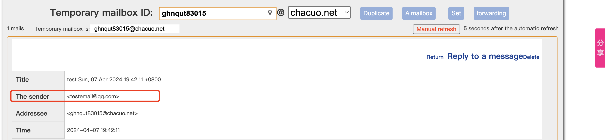

# 任意邮件伪造漏洞

任意邮件伪造漏洞，是指攻击者可以通过此漏洞对网站管理人员或者运维人员发送钓鱼邮件，对相关人员进行钓鱼攻击，进一步获取网站或者服务器权限。

假设test.com存在邮件伪造漏洞时，我们事先知晓了管理员账户为`admin@test.com`。我们利用邮件伪造漏洞冒充管理员尝试对test.com的用户发送邮件，此时，用户很可能会因为邮件来源是admin的账户，对邮件内容没有过多怀疑，直接进行点击其中存在的链接或者下载邮件中存在的文件，导致遭受到攻击。进而被攻击者获取控制权限。

# Swaks

官方下载地址：http://www.jetmore.org/john/code/swaks/

swaks在kali中自带，是用来测试邮箱联通性的

用http://24mail.chacuo.net/enus获取一个测试用的邮箱

使用`-t`，来向目标地址发送测试邮件


用`-f`来构造发件人

```
 swaks -t ghnqut83015@chacuo.net -f testemail@qq.com
```




-h用于伪造邮件的ehlo头，即发件人邮箱域名，用于绕过身份验证

--header用于伪造邮件标题，利用 `"Subject：伪造标题"`实现


`--body`：用于伪造邮件的内容


在使用swaks后，输出内容看到了大致有这些标志

> \===：表示Swaks输出的信息行。
> *：表示Swaks中产生的错误。
> ->：表示正常情况下，发送到目标的预期行。
> <- ：表示正常情况下，服务器的预期回复。
> <**：表示出现错误情况时，服务器返回的错误信息。


当我向qq邮箱发送信息的时候就出错了，原因是QQ邮箱采用了SPF验证

# SPF

## 什么是SPF

spf全称为（Sender Policy Framework），即发件人策略框架

> 假设邮件服务器收到了一封邮件，发件人的IP为：192.6.6.6，并且声称发件人为 [email@example.com](mailto:email@example.com)。为了确认发件人不是伪造的，邮件服务器会查询 `example.com`的spf记录。如果该域的spf记录设置允许IP为 192.6.6.6 主机发送邮件，则服务器认为这封邮件是合法的，否则，会退信（即收件人收不到邮件），或者邮件躺在垃圾箱。邮箱伪造可以声明他来自`example.com`，但是却无法操作 `example.com` 的 DNS解析记录，也无法伪造自己的IP地址，所以SPF还是可以有效防御邮件伪造的。

相当于A向B发送消息，B会检查A是不是在允许的范围内发的消息，如果不是则拒收

查询网站的SPF，windows可以用nslookup查询

```php
nslookup -type=txt 域名
```


linux可以用dig -t txt 域名


`qq.com`的SPF语法为`v=spf1 include:spf.mail.qq.com -all`

## SPF语法

一条SPF记录定义了一个或者多个mechanism（机制），而 mechanism 则定义了哪些 IP 是允许的，哪些 IP 是拒绝的。

有如下几类mechanism

```
all | ip4 | ip6 | a | mx | ptr | exists | include
```

每种mechanism都有这几种前缀，默认为+

```
"+"  Pass（通过）
"-"  Fail（拒绝）
"~"  Soft Fail（软拒绝）邮件可被接受，也可被标记为垃圾邮件，这种情况一般是在测试中
"?"  Neutral（中立）忽略，不考虑邮件是否被接受。
```

对于多种mechanism，从左往右看

all表示所有IP，通常把它放在 SPF 记录的结尾，表示处理剩下的所有情况

```
"v=spf1 -all" 拒绝所有（表示这个域名不会发出邮件）
"v=spf1 +all" 接受所有（域名所有者认为 SPF 是没有用的，或者根本不在乎它）
```

ip4和ip6，指定对应地址或者地址段可以接受

```
"v=spf1 ip4:192.168.0.1/16 -all"
只允许在 192.168.0.1 ~ 192.168.255.255 范围内的 IP，从左到右看，除去ip段段就是-all，表示拒绝
"v=spf1 ip6:1080::8:800:200C:417A/96 -all"
只允许在 1080::8:800:0000:0000 ~ 1080::8:800:FFFF:FFFF 范围内的 IP
```

这俩的格式是相同的，以`a`为例，格式为以下四种之一：

a和mx，这两种对应DNS中的记录，a是ip的解析，mx是邮箱

```
a
a/<prefix-length>
a:<domain>
a:<domain>/<prefix-length>
```

会命中相应域名的 a 记录（或 mx 记录）中包含的 IP 地址（或地址段）。如果没有提供域名，则使用当前域名。例如：

```
"v=spf1 mx -all"
允许当前域名的 mx 记录对应的 IP 地址。

"v=spf1 mx mx:deferrals.example.com -all"
允许当前域名和 deferrals.example.com 的 mx 记录对应的 IP 地址。

"v=spf1 a/24 -all"
类似地，这个用法则允许一个地址段。
```

include

格式为`include:<domain>`，表示引入`<domain>`域名下的 SPF 记录。注意，如果该域名下不存在 SPF 记录，则会导致一个`PermError`结果。例如：

```
"v=spf1 include:example.com -all" 即采用和 example.com 完全一样的 SPF 记录
```

腾讯的就是include


exists

格式为`exists:<domain>`。将对`<domain>`执行一个 A 查询，如果有返回结果（无论结果是什么），都会看作命中。

ptr

格式为`ptr`或者`ptr:<domain>`。使用`ptr`机制会带来大量很大开销的 DNS 查询，所以连官方都不推荐使用它。

## SPF绕过

### 解析不当

```php
v=spf1 ip4:192.168.0.0/24 -all
```

这种SPF配置并没有什么问题，但是如果我的在一个IP控制了一个机器，一样能够伪造邮件

除此之外，限定词不当也会存在绕过的风险

采用软拒绝的方式。

```php
v=spf1 ip4:192.168.0.1 ~all
```

这种方式还是会收到邮件

或者将匹配机制使用错误，多条ip只使用一个ip4引入。

```php
v=spf1 ip4:192.168.0.1 192.168.0.2 -all
```

这样的话因为语法错误，整个SPF验证机制都会失效

### 配置不当

- 对域名增加SPF记录，但未对他人的SPF记录进行检测，导致无法对邮件的来源进行校验。
- 邮件服务器配置在内网当中，SPF解析在公网中，内部的DNS无法对SPF进行解析，导致可以绕过
- 攻击者通过内网的内网SMTP服务器，采用匿名邮件的方式进行发送邮件。或者SMTP服务器连接信任的IP数量过度，为一整个IP段，任意一台的终端可以连接SMTP服务器，导致伪造邮件发送。


参考链接：

https://forum.butian.net/share/2089

https://0range-x.github.io/2022/01/10/%E6%B5%85%E6%9E%90%E9%82%AE%E4%BB%B6%E4%BC%AA%E9%80%A0/

https://blog.le31ei.top/2021/02/24/spf%E4%B8%8E%E9%82%AE%E4%BB%B6%E4%BC%AA%E9%80%A0/#0x02-%E9%82%AE%E4%BB%B6%E4%BC%AA%E9%80%A0