# 写在前面

最近开始在甲方做安全了，思路发生了一定的转变，从最开始单项的研究漏洞到了一个需要对业务使用框架熟悉的阶段，这样才能更好地去发现修复漏洞，最近zookeeper也爆洞了，所以在分析和复现之前，先来学一下zookeeper的简单使用。

> ## 什么是ZooKeeper
>
> ZooKeeper是一个开源的分布式应用程序协调系统。简称ZK，ZK是一个典型的分布式数据一致性解决方案，分布式应用程序可以基于它实现数据的发布/订阅、负载均衡、名称服务、分布式协调/通知、集群管理、Master选举、分布式锁盒分布式队列等等功能。
>
> ## ZooKeeper集群概念
>
> **集群角色**
>
> - **Leader：**领导者，通过集群选举产生的主节点，负责集群的读与写工作
> - **Follower：**追随者，有资格参与集群选举，但未能被成功选举为`Leader`的备用选举节点，负责集群的读服务
> - **Observer：**观察者，没有资格参与集群选举，负责集群的读服务，同步`Leader`状态
>
> 注意：当Leader故障之后ZooKeeper集群会通过Follower选举新的Leader，如果老的Leader故障修复之后，会再次接管集群中的Leader脚本，新的Leader则退回Follower角色。一般集群当中无需设置Observer节点，Follower节点即可。

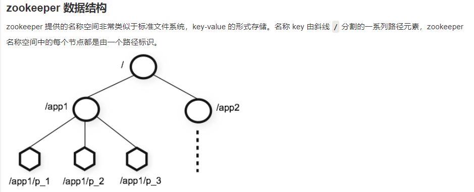

1. **分布式协调和同步：** Zookeeper 提供了分布式环境下的协调和同步功能，使得多个节点之间可以实现一致性、有序的状态管理。它可以用来协调分布式系统中各个节点的行为，保证系统的一致性和可靠性。
2. **配置管理：** Zookeeper 可以用来集中管理分布式系统的配置信息，包括各个节点的配置参数、应用程序的配置文件等。节点可以从 Zookeeper 中读取配置，并且可以监听配置的变化，从而实现动态配置管理。
3. **命名服务：** Zookeeper 提供了命名服务的功能，可以让分布式系统中的节点注册自己的名称、地址等信息，并且可以根据名称来发现节点。这样可以实现节点的动态发现和管理。
4. **分布式锁：** Zookeeper 提供了分布式锁的实现，可以用来实现复杂的同步逻辑。例如，在分布式系统中，多个节点需要争夺某个资源时，可以使用 Zookeeper 提供的分布式锁来保证资源的互斥访问。
5. **分布式队列：** Zookeeper 提供了有序节点（Sequential Nodes）的功能，可以用来实现分布式队列。应用程序可以将任务添加到队列中，并且可以按照严格的顺序来处理队列中的任务。
6. **选举机制：** Zookeeper 提供了一种简单而有效的选举机制，可以用来选举分布式系统中的领导者节点。这在实现分布式系统中的主备模式或者领导者-追随者模式时非常有用。
7. **监控和管理：** Zookeeper 提供了丰富的监控和管理功能，可以监控集群的状态、性能指标等，并且可以通过命令行工具或者 API 进行管理和配置。

# 环境搭建

可参考https://www.runoob.com/w3cnote/zookeeper-setup.html

启动服务端运行`zkServer.cmd`

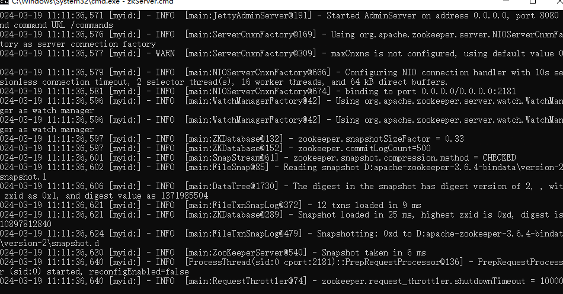

客户端进行操作使用`zkCli.cmd`，linux或者mac就使用对应sh脚本

## Java客户端

这里的客户端和`zkCli`并不一样，可以理解为`zkCli`是操作台

pom.xml

```xml
<?xml version="1.0" encoding="UTF-8"?>

<project xmlns="http://maven.apache.org/POM/4.0.0" xmlns:xsi="http://www.w3.org/2001/XMLSchema-instance"
         xsi:schemaLocation="http://maven.apache.org/POM/4.0.0 http://maven.apache.org/xsd/maven-4.0.0.xsd">
    <modelVersion>4.0.0</modelVersion>

    <groupId>com.runoob.zookeeper</groupId>
    <artifactId>zookeeper-demo</artifactId>
    <version>1.0-SNAPSHOT</version>

    <name>zookeeper-demo</name>
    <!-- FIXME change it to the project's website -->
    <url>http://www.example.com</url>

    <properties>
        <project.build.sourceEncoding>UTF-8</project.build.sourceEncoding>
        <maven.compiler.source>1.8</maven.compiler.source>
        <maven.compiler.target>1.8</maven.compiler.target>
    </properties>

    <dependencies>
        <dependency>
            <groupId>junit</groupId>
            <artifactId>junit</artifactId>
            <version>4.11</version>
            <scope>test</scope>
        </dependency>
        <dependency>
            <groupId>org.apache.zookeeper</groupId>
            <artifactId>zookeeper</artifactId>
            <version>3.4.8</version>
        </dependency>
        <dependency>
            <groupId>org.apache.curator</groupId>
            <artifactId>curator-framework</artifactId>
            <version>4.0.0</version>
        </dependency>
        <dependency>
            <groupId>org.apache.curator</groupId>
            <artifactId>curator-recipes</artifactId>
            <version>4.0.0</version>
        </dependency>

    </dependencies>

    <build>
        <pluginManagement><!-- lock down plugins versions to avoid using Maven defaults (may be moved to parent pom) -->
            <plugins>
                <plugin>
                    <artifactId>maven-clean-plugin</artifactId>
                    <version>3.0.0</version>
                </plugin>
                <!-- see http://maven.apache.org/ref/current/maven-core/default-bindings.html#Plugin_bindings_for_jar_packaging -->
                <plugin>
                    <artifactId>maven-resources-plugin</artifactId>
                    <version>3.0.2</version>
                </plugin>
                <plugin>
                    <artifactId>maven-compiler-plugin</artifactId>
                    <version>3.7.0</version>
                </plugin>
                <plugin>
                    <artifactId>maven-surefire-plugin</artifactId>
                    <version>2.20.1</version>
                </plugin>
                <plugin>
                    <artifactId>maven-jar-plugin</artifactId>
                    <version>3.0.2</version>
                </plugin>
                <plugin>
                    <artifactId>maven-install-plugin</artifactId>
                    <version>2.5.2</version>
                </plugin>
                <plugin>
                    <artifactId>maven-deploy-plugin</artifactId>
                    <version>2.8.2</version>
                </plugin>
            </plugins>
        </pluginManagement>
    </build>
</project>
```

### zookeeper原生API

```java
package com.runoob.zookeeper;

import org.apache.zookeeper.*;
import org.apache.zookeeper.data.Stat;

import java.io.IOException;
import java.util.concurrent.CountDownLatch;


public class ConnectionDemo {

    public static void main(String[] args) {
        try {
            final CountDownLatch countDownLatch=new CountDownLatch(1);
            ZooKeeper zooKeeper=
                    new ZooKeeper("10.102.7.111:2181", 4000, new Watcher() {
                        @Override
                        public void process(WatchedEvent event) {
                            if(Event.KeeperState.SyncConnected==event.getState()){
                                //如果收到了服务端的响应事件，连接成功
                                countDownLatch.countDown();
                            }
                        }
                    });
            countDownLatch.await();
            //CONNECTED
            System.out.println(zooKeeper.getState());
            //添加节点
            zooKeeper.create("/runoob","0".getBytes(),ZooDefs.Ids.OPEN_ACL_UNSAFE,CreateMode.PERSISTENT);
        } catch (IOException e) {
            e.printStackTrace();
        } catch (InterruptedException e) {
            e.printStackTrace();
        } catch (KeeperException e) {
           e.printStackTrace();
        }
    }
}
```

这里使用Java去连接zookeeper的服务端

用如下代码添加一个API——`/runoob`，设置值为0

```
zooKeeper.create("/runoob","0".getBytes(),ZooDefs.Ids.OPEN_ACL_UNSAFE,CreateMode.PERSISTENT);
```

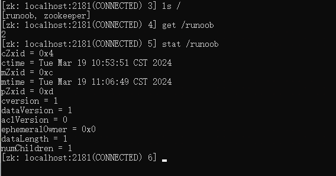

这里值应该是0，但是我之前用`set /runoob 2`修改了值

### 客户端的curator连接

> Curator 是 Netflix 公司开源的一套 zookeeper 客户端框架，解决了很多 Zookeeper 客户端非常底层的细节开发工作，包括连接重连、反复注册 Watcher 和 NodeExistsException 异常等。
>
> Curator 包含了几个包：
>
> - **curator-framework**：对 zookeeper 的底层 api 的一些封装。
> - **curator-client**：提供一些客户端的操作，例如重试策略等。
> - **curator-recipes**：封装了一些高级特性，如：Cache 事件监听、选举、分布式锁、分布式计数器、分布式 Barrier 等。

```java
package com.runoob.zookeeper;

import org.apache.curator.framework.CuratorFramework;
import org.apache.curator.framework.CuratorFrameworkFactory;
import org.apache.curator.retry.ExponentialBackoffRetry;
import org.apache.zookeeper.data.Stat;


public class CuratorDemo {

    public static void main(String[] args) throws Exception {
        CuratorFramework curatorFramework=CuratorFrameworkFactory.
                builder().connectString("10.102.7.111:2181").
                sessionTimeoutMs(4000).retryPolicy(new
                ExponentialBackoffRetry(1000,3)).
                namespace("").build();
        curatorFramework.start();
        Stat stat=new Stat();
        byte[] bytes = curatorFramework.getData().storingStatIn(stat).forPath("/runoob");
        System.out.println(new String(bytes));
        curatorFramework.close();
    }
}
```

这里简单查询了节点数据

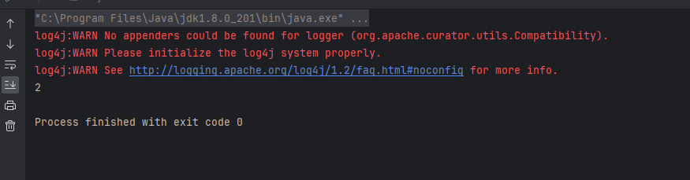

# Znode

zookeeper的所有存储的形式都是节点形式，节点被称为Znode，以Key-Value存储，整体来看有点类似于Linux的文件系统结构，路径以`/`开头

可以看到对应节点其实就和Linux文件系统目录差不多

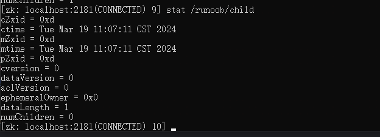

Znode 的状态属性：

| cZxid          | 创建节点时的事务ID                                           |
| :------------- | :----------------------------------------------------------- |
| ctime          | 创建节点时的时间                                             |
| mZxid          | 最后修改节点时的事务ID                                       |
| mtime          | 最后修改节点时的时间                                         |
| pZxid          | 表示该节点的子节点列表最后一次修改的事务ID，添加子节点或删除子节点就会影响子节点列表，但是修改子节点的数据内容则不影响该ID**（注意，只有子节点列表变更了才会变更pzxid，子节点内容变更不会影响pzxid）** |
| cversion       | 子节点版本号，子节点每次修改版本号加1                        |
| dataversion    | 数据版本号，数据每次修改该版本号加1                          |
| aclversion     | 权限版本号，权限每次修改该版本号加1                          |
| ephemeralOwner | 创建该临时节点的会话的sessionID。**（\****如果该节点是持久节点，那么这个属性值为0）** |
| dataLength     | 该节点的数据长度                                             |
| numChildren    | 该节点拥有子节点的数量**（只统计直接子节点的数量）**         |

现在来用`set /runoob/child` 11 修改节点

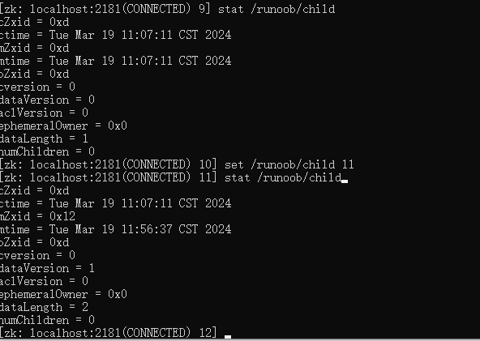

对比一下， mZxid、mtime、dataVersion 都发生了变化

对于Zookeeper的节点具有如下特性

- 同一级节点 key 名称是唯一的
- 创建节点时，必须要带上全路径）
- session 关闭，临时节点清除
- 自动创建顺序节点（create -s）
- watch 机制，监听节点变化
- delete 命令只能一层一层删除，新版本可以通过 deleteall 命令递归删除。

# ZooKeeper基础命令

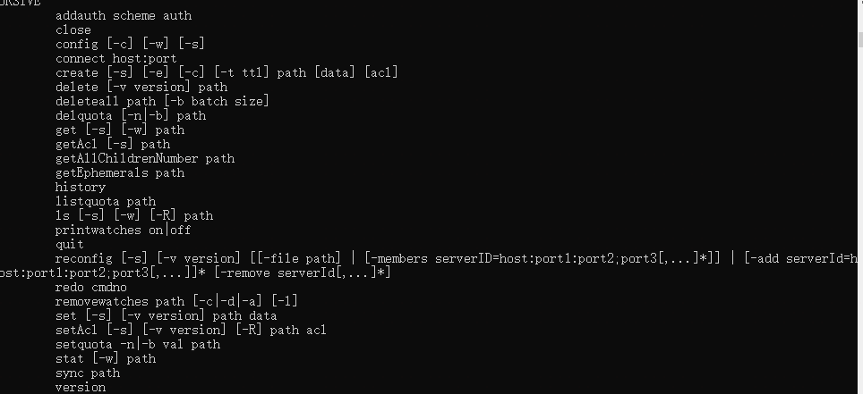

以上是一些Zookeeper客户端的基本命令，对于菜鸟教程的来看，有一些命令实际上已经弃用了

ls和linux使用差不多，只是查看的是不同节点路径下节点有什么

```
ls /runoob 	# 查看/runoob的子节点
```

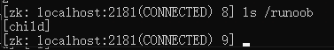

get 命令用于获取节点数据和状态信息。

- -s 查看节点所有信息:数据信息+节点属性值
- -w 查看节点数据信息

```
get -w /runoob
get -s /runoob
```

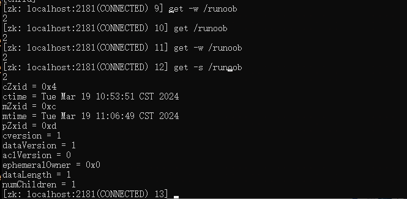

create 命令用于创建节点并赋值

```
create [-s] [-e] path data acl
```

- **[-s] [-e]**：-s 和 -e 都是可选的，-s 代表顺序节点， -e 代表临时节点，注意其中 -s 和 -e 可以同时使用的，并且临时节点不能再创建子节点。
- **path**：指定要创建节点的路径，比如 **/runoob**。
- **data**：要在此节点存储的数据。
- **acl**：访问权限相关，默认是 world，相当于全世界都能访问。

以下实例添加临时顺序节点：

```
$ create -s -e /runoob 0
```

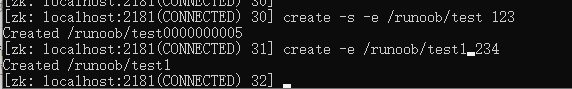

如果加上-s的话就是顺序节点

stat 命令用于查看节点状态信息。

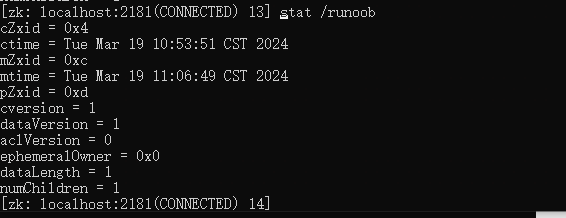

set 命令用于修改节点存储的数据。

```
set path data [version]
```

- **path**：节点路径。
- **data**：需要存储的数据。
- **[version]**：可选项，版本号(可用作乐观锁)。

如果加上version，需要正确的版本才能设置成功

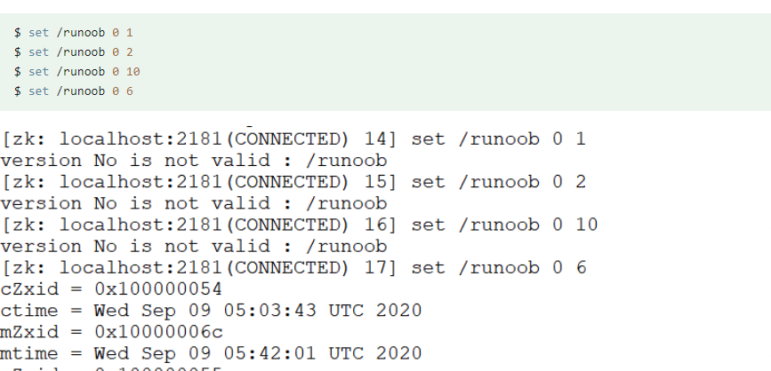

delete 命令用于删除某节点。

```
delete path [version]
```

- **path**：节点路径。
- **[version]**：可选项，版本号（同 set 命令）。

# 常用四字命令

首先先在zoo.cfg中添加如下代码，然后重启服务

```cobol
#开启四字命令
4lw.commands.whitelist=*
```

四字命令格式：

```
echo [command] | nc [ip] [port]
```

ZooKeeper 常用四字命令主要如下：

| 四字命令 | 功能描述                                                     |
| :------- | :----------------------------------------------------------- |
| conf     | 3.3.0版本引入的。打印出服务相关配置的详细信息。              |
| cons     | 3.3.0版本引入的。列出所有连接到这台服务器的客户端全部连接/会话详细信息。包括"接受/发送"的包数量、会话id、操作延迟、最后的操作执行等等信息。 |
| crst     | 3.3.0版本引入的。重置所有连接的连接和会话统计信息。          |
| dump     | 列出那些比较重要的会话和临时节点。这个命令只能在leader节点上有用。 |
| envi     | 打印出服务环境的详细信息。                                   |
| reqs     | 列出未经处理的请求                                           |
| ruok     | 测试服务是否处于正确状态。如果确实如此，那么服务返回"imok"，否则不做任何相应。 |
| stat     | 输出关于性能和连接的客户端的列表。                           |
| srst     | 重置服务器的统计。                                           |
| srvr     | 3.3.0版本引入的。列出连接服务器的详细信息                    |
| wchs     | 3.3.0版本引入的。列出服务器watch的详细信息。                 |
| wchc     | 3.3.0版本引入的。通过session列出服务器watch的详细信息，它的输出是一个与watch相关的会话的列表。 |
| wchp     | 3.3.0版本引入的。通过路径列出服务器watch的详细信息。它输出一个与session相关的路径。 |
| mntr     | 3.4.0版本引入的。输出可用于检测集群健康状态的变量列表        |

```
1. 可以通过命令：echo stat|nc 127.0.0.1 2181 来查看哪个节点被选择作为follower或者leader
2. 使用echo ruok|nc 127.0.0.1 2181 测试是否启动了该Server，若回复imok表示已经启动。
3. echo dump| nc 127.0.0.1 2181 ,列出未经处理的会话和临时节点。
4. echo kill | nc 127.0.0.1 2181 ,关掉server
5. echo conf | nc 127.0.0.1 2181 ,输出相关服务配置的详细信息。
6. echo cons | nc 127.0.0.1 2181 ,列出所有连接到服务器的客户端的完全的连接 / 会话的详细信息。
7. echo envi |nc 127.0.0.1 2181 ,输出关于服务环境的详细信息（区别于 conf 命令）。
8. echo reqs | nc 127.0.0.1 2181 ,列出未经处理的请求。
9. echo wchs | nc 127.0.0.1 2181 ,列出服务器 watch 的详细信息。
10. echo wchc | nc 127.0.0.1 2181 ,通过 session 列出服务器 watch 的详细信息，它的输出是一个与 watch 相关的会话的列表。
11. echo wchp | nc 127.0.0.1 2181 ,通过路径列出服务器 watch 的详细信息。它输出一个与 session 相关的路径。 
```

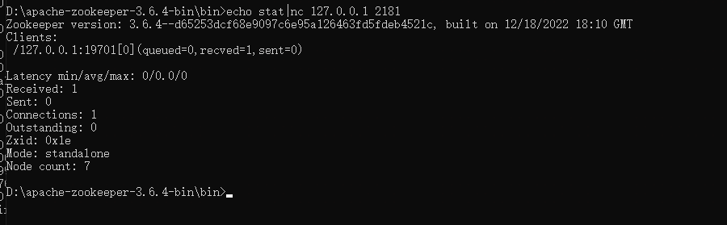

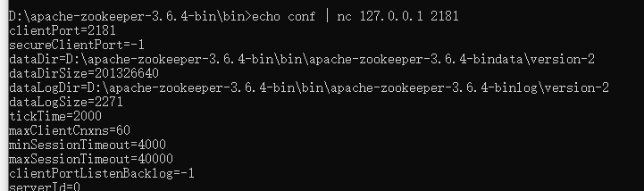

# 权限控制ACL

Zookeeper的ACL在生产环境中是相当重要的，ACL可以针对节点设置读写选取，保证数据安全性，permissions 可以指定不同的权限范围及角色。

- **getAcl 命令**：获取某个节点的 acl 权限信息。
- **setAcl 命令**：设置某个节点的 acl 权限信息。
- **addauth 命令**：输入认证授权信息，注册时输入明文密码，加密形式保存。

zookeeper 的 acl 通过` [scheme:id:permissions]` 来构成权限列表。

- **scheme**：代表采用的某种权限机制，包括 world、auth、digest、ip、super 几种。
- **id**：代表允许访问的用户。
- **permissions**：权限组合字符串，由 cdrwa 组成，其中每个字母代表支持不同权限， 创建权限 create(c)、删除权限 delete(d)、读权限 read(r)、写权限 write(w)、管理权限admin(a)。

对于各种权限机制的介绍：

1. world：默认方式，相当于全世界都能访问
2. auth：代表已经认证通过的用户(cli中可以通过addauth digest user:pwd 来添加当前上下文中的授权用户)
3. digest：即用户名:密码这种方式认证，这也是业务系统中最常用
4. ip：使用Ip地址认证


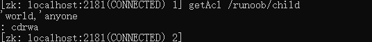

可以看到之前创建的child节点默认权限的scheme为world，表示全世界可以访问，权限为cdrwa

现在就可以修改一下，将删除权限给去掉

```
setAcl /runoob/child world:anyone:crwa
```

整体的权限配置可以在https://www.runoob.com/w3cnote/zookeeper-acl.html看，这里就不一个一个配置各种权限了，知道就行，都只是访问控制

也可以使用这个demo

DemoWatcher.java

```
package com.runoob.zookeeper;

import org.apache.zookeeper.WatchedEvent;
import org.apache.zookeeper.Watcher;

public class DemoWatcher implements Watcher {

    @Override
    public void process(WatchedEvent watchedEvent) {
        System.out.println("watch path: "+watchedEvent.getPath());
        System.out.println("watch event is: "+watchedEvent);

    }
}
```

Demo1

```java
package com.runoob.zookeeper;

import org.apache.zookeeper.*;

public class Demo1 {
    public static void main(String[] args) {
        try {
            ZooKeeper zooKeeper = new ZooKeeper("127.0.0.1:2181",5000,new DemoWatcher());
            zooKeeper.addAuthInfo("digest","sa:123".getBytes());
            String path1 = zooKeeper.create("/test","haha".getBytes(), ZooDefs.Ids.CREATOR_ALL_ACL, CreateMode.EPHEMERAL);
            System.out.println("zkNode create success: "+path1);

//            ZooKeeper zooKeeper2 = new ZooKeeper("127.0.0.1:2181",5000,new DemoWatcher());
//            zooKeeper2.getData("/test",new DemoWatcher(),null);

//            ZooKeeper zooKeeper3 = new ZooKeeper("127.0.0.1:2181",5000,new DemoWatcher());
//            zooKeeper3.addAuthInfo("digest","sa:321".getBytes());
//            zooKeeper3.getData("/test",new DemoWatcher(),null);
//
            ZooKeeper zooKeeper4 = new ZooKeeper("127.0.0.1:2181",5000,new DemoWatcher());
            zooKeeper4.addAuthInfo("digest","sa:123".getBytes());
            System.out.println(new String(zooKeeper4.getData("/test",new DemoWatcher(),null)));


        } catch (Exception e) {
            e.printStackTrace();
        }
    }
}

```

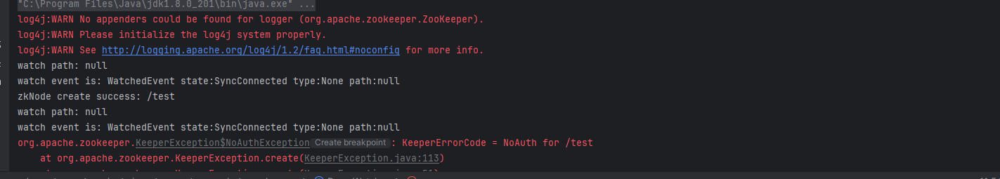

当运行到zookeeper2的时候，就没有权限了，ZK3密码不正确，ZK4就可以通过

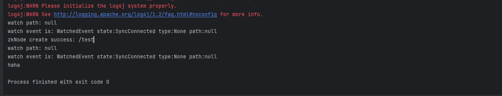

# Watcher

zookeeper 的 watcher 机制，可以分为四个过程：

- 客户端注册 watcher。
- 服务端处理 watcher。
- 服务端触发 watcher 事件。
- 客户端回调 watcher。

客户端注册 watcher 有三种方式，调用客户端 API 可以分别通过 getData、exists、getChildren 实现

1. **getData()：**
   - 作用：`getData()` 方法用于获取指定节点的数据，并在数据发生变化时触发 Watcher。
   - 适用场景：适用于需要监视节点数据变化的场景，例如监控配置信息的变化、任务状态的变化等。
2. **getChildren()：**
   - 作用：`getChildren()` 方法用于获取指定节点的子节点列表，并在子节点列表发生变化时触发 Watcher。
   - 适用场景：适用于需要监视节点的子节点变化的场景，例如监控任务队列的变化、领导者选举中候选者列表的变化等。
3. **exists()：**
   - 作用：`exists()` 方法用于检查指定节点是否存在，并在节点存在或状态发生变化时触发 Watcher。
   - 适用场景：适用于需要监视节点的存在性或状态变化的场景，例如监控节点创建、删除等操作。

这里有一个测试例子

```java
package com.runoob.zookeeper;

import org.apache.zookeeper.*;
import org.apache.zookeeper.data.Stat;

import java.io.IOException;

public class WatcherDemo implements Watcher {
    static ZooKeeper zooKeeper;

    static {
        try {
            zooKeeper = new ZooKeeper("127.0.0.1:2181", 4000, new WatcherDemo());
        } catch (IOException e) {
            e.printStackTrace();
        }
    }

    @Override
    public void process(WatchedEvent event) {
        System.out.println("eventType:" + event.getType());
        if (event.getType() == Event.EventType.NodeDataChanged) {
            try {
                zooKeeper.exists(event.getPath(), true);
            } catch (KeeperException e) {
                e.printStackTrace();
            } catch (InterruptedException e) {
                e.printStackTrace();
            }
        }
    }

    public static void main(String[] args) throws IOException, KeeperException, InterruptedException {
        String path = "/watcher";
        if (zooKeeper.exists(path, false) == null) {
            zooKeeper.create("/watcher", "0".getBytes(), ZooDefs.Ids.OPEN_ACL_UNSAFE, CreateMode.PERSISTENT);
        }
        Thread.sleep(1000);
        System.out.println("-----------");
        //true表示使用zookeeper实例中配置的watcher
        Stat stat = zooKeeper.exists(path, true);
        System.in.read();
    }
}
```

首先创建的zookeeper实例绑定的是WatcherDemo这个watcher，在主程序运行的时候会创建/watcher节点，然后绑定watcher，在对应事件触发的时候回调process方法

首先运行程序

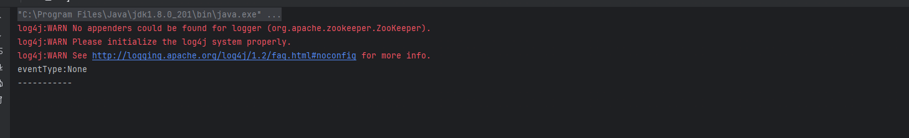

因为API实现是exist，`exists()` 方法用于检查指定节点是否存在，并在节点存在或状态发生变化时触发 Watcher，所以在控制台对节点进行操作，

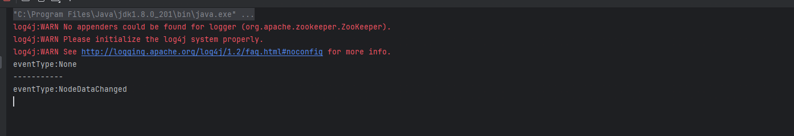

回调了process方法打印了eventType

## 漏洞分析

当然在这次漏洞中提到了受影响版本中，由于 addWatch 命令缺少 ACL 检查，未经身份验证的攻击者可利用通过 addWatch 命令将 persistent watchers 添加到攻击者已经访问的父节点来监视子 znodes，进而获取 znode 的路径信息（可能包含用户名或登录ID等敏感信息）。

我们也可以利用addWatch命令在控制台中添加watchers到对应的znode

在Zookeeper 3.6.0版本之后，客户端可以在节点上创建永久监听，永久监听在被触发后不会被删除。也就是为什么影响范围在3.6.0之后了

```txt
addWatch [-m mode] path
```

永久监听在创建时可以通过 -m 指定模式，模式分为两种：PERSISTENT和PERSISTENT_RECURSIVE，不指定默认使用PERSISTENT_RECURSIVE模式。

- **PERSISTENT**：节点的数据变化以及子节点的变化会触发相应事件，子节点的数据变化不会触发。
- **PERSISTENT_RECURSIVE**：节点的数据变化以及所有子孙节点的目录或者数据变化都会触发相应事件。

因为addWacth命令没有经过ACL检查，可以未经授权调用，如果知道了父节点的znode，可以添加PERSISTENT_RECURSIVE来监控子znodes，从而获取znode路径信息

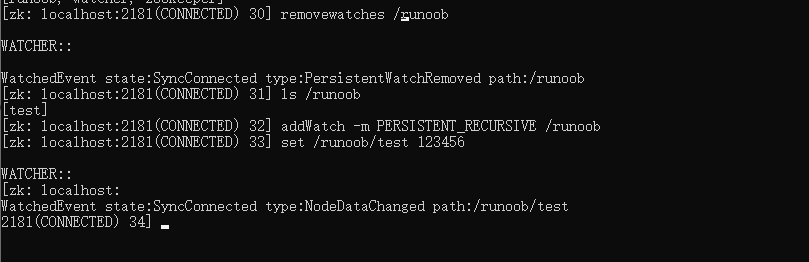

可以看到，在我没有设置任何ACL访问控制的情况下，我通过**PERSISTENT_RECURSIVE**来监视/runoob节点，当对子节点进行操作的时候出发了watchers，看到了子znode的路径，并且这个watcher是永久监听

## 漏洞修复

漏洞commit在https://github.com/apache/zookeeper/commit/65b91d2d9a56157285c2a86b106e67c26520b01d?diff=split&w=0

在修复代码中也可以看见，其实都是对addWatch命令添加acl检查的修复

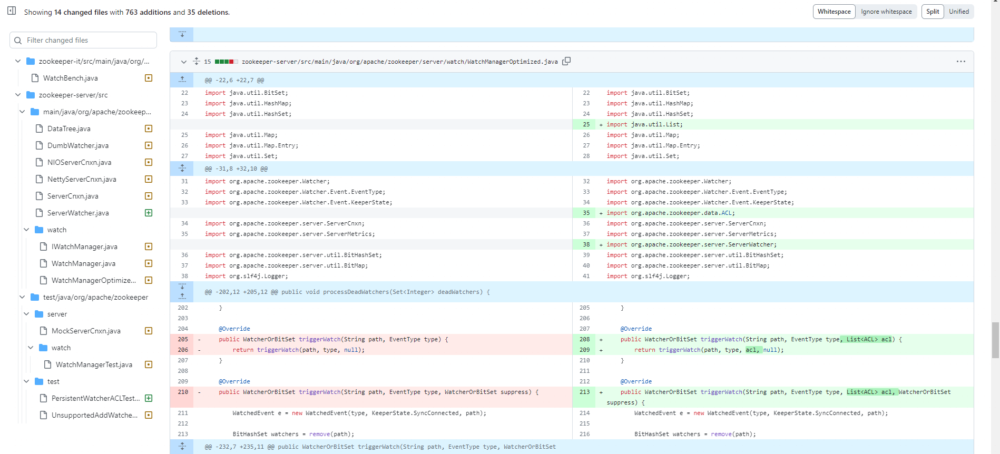


参考链接：

https://www.cnblogs.com/rickiyang/p/11074198.html

https://zhuanlan.zhihu.com/p/190192346

https://www.runoob.com/w3cnote/zookeeper-tutorial.html

https://www.cnblogs.com/seve/p/14701705.html

https://www.oscs1024.com/hd/MPS-kfgl-etid

https://github.com/apache/zookeeper/commit/65b91d2d9a56157285c2a86b106e67c26520b01d?diff=split&w=0