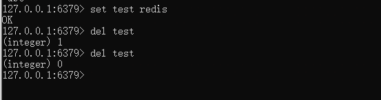

# 前言

在很早之前，对于redis的攻击方式有了一些了解，端口在6379，可以通过创建webshell文件，ssh秘钥，crontab以及redis的主从复制等手段去进行攻击，但是没有去了解redis本身的作用，以及为什么要用到这个东西，他本身肯定不是为漏洞攻击去设计的，好如flink，avtivemq，kafka等不应该只是了解他的漏洞，而且要从他的应用场景开始，明白其具体的作用，在平常的环境中扮演着什么样的角色，其实才是去对他的漏洞进行了解，攻击复现，这样才能知道漏洞具体的危害等等。

# Redis介绍

Redis是一个开源的内存数据库，提供了一个高性能的K-V存储系统，常用于缓存，消息队列，会话存储等应用场景

> - **性能极高：**Redis 以其极高的性能而著称，能够支持每秒数十万次的读写操作24。这使得Redis成为处理高并发请求的理想选择，尤其是在需要快速响应的场景中，如缓存、会话管理、排行榜等。
> - **丰富的数据类型：**Redis 不仅支持基本的键值存储，还提供了丰富的数据类型，包括字符串、列表、集合、哈希表、有序集合等。这些数据类型为开发者提供了灵活的数据操作能力，使得Redis可以适应各种不同的应用场景。
> - **原子性操作：**Redis 的所有操作都是原子性的，这意味着操作要么完全执行，要么完全不执行。这种特性对于确保数据的一致性和完整性至关重要，尤其是在高并发环境下处理事务时。
> - **持久化：**Redis 支持数据的持久化，可以将内存中的数据保存到磁盘中，以便在系统重启后恢复数据。这为 Redis 提供了数据安全性，确保数据不会因为系统故障而丢失。
> - **支持发布/订阅模式：**Redis 内置了发布/订阅模式（Pub/Sub），允许客户端之间通过消息传递进行通信。这使得 Redis 可以作为消息队列和实时数据传输的平台。
> - **单线程模型：**尽管 Redis 是单线程的，但它通过高效的事件驱动模型来处理并发请求，确保了高性能和低延迟。单线程模型也简化了并发控制的复杂性。
> - **主从复制：**Redis 支持主从复制，可以通过从节点来备份数据或分担读请求，提高数据的可用性和系统的伸缩性。
> - **应用场景广泛：**Redis 被广泛应用于各种场景，包括但不限于缓存系统、会话存储、排行榜、实时分析、地理空间数据索引等。
> - **社区支持：**Redis 拥有一个活跃的开发者社区，提供了大量的文档、教程和第三方库，这为开发者提供了强大的支持和丰富的资源。
> - **跨平台兼容性：**Redis 可以在多种操作系统上运行，包括 Linux、macOS 和 Windows，这使得它能够在不同的技术栈中灵活部署。

> 以下是 Redis 的一些独特之处：
>
> - **丰富的数据类型：**Redis 不仅仅支持简单的 key-value 类型的数据，还提供了 list、set、zset（有序集合）、hash 等数据结构的存储。这些数据类型可以更好地满足特定的业务需求，使得 Redis 可以用于更广泛的应用场景。
> - **高性能的读写能力：**Redis 能读的速度是 110000次/s，写的速度是 81000次/s。这种高性能主要得益于 Redis 将数据存储在内存中，从而显著提高了数据的访问速度。
> - **原子性操作：**Redis 的所有操作都是原子性的，这意味着操作要么完全执行，要么完全不执行。这种特性对于确保数据的一致性和完整性非常重要。
> - **持久化机制：**Redis 支持数据的持久化，可以将内存中的数据保存在磁盘中，以便在系统重启后能够再次加载使用。这为 Redis 提供了数据安全性，确保数据不会因为系统故障而丢失。
> - **丰富的特性集：**Redis 还支持 publish/subscribe（发布/订阅）模式、通知、key 过期等高级特性。这些特性使得 Redis 可以用于消息队列、实时数据分析等复杂的应用场景。
> - **主从复制和高可用性：**Redis 支持 master-slave 模式的数据备份，提供了数据的备份和主从复制功能，增强了数据的可用性和容错性。
> - **支持 Lua 脚本：**Redis 支持使用 Lua 脚本来编写复杂的操作，这些脚本可以在服务器端执行，提供了更多的灵活性和强大的功能。
> - **单线程模型：**尽管 Redis 是单线程的，但它通过高效的事件驱动模型来处理并发请求，确保了高性能和低延迟。

可以看到，Redis其实和Zookeeper的功能是有一定相似之处的，但是Redis更专注于数据的存储，而Zookeeper更专注于分布式组件的协调配置

# 环境搭建

这里我使用的是windows

**下载地址：**https://github.com/tporadowski/redis/releases。

启动服务

```
redis-server.exe redis.windows.conf
```


连接redis数据库

```
redis-cli.exe -h 127.0.0.1 -p 6379
```


# redis命令

redis的命令是不区分大小写的，键（key）和值（value）是区分大小写的

## 设置与删除key

```
set test redis
del test
```

设置key采用set命令，后跟value，删除则是del命令，如果键被删除成功，命令执行后输出 **(integer) 1**，否则将输出 **(integer) 0**



## 字符串

Redis支持5种数据类型，关于字符串类型常用的命令如下

```
set key value 	# 设置指定key的值
get key			# 获取key的value
getrange key start end	# 返回key的子字符串
getbit key offset	# 获取指定偏移量
strlen key		# 获取key对应value的长度
incr key		# key中存储的数字加1
decr key		# key中存储的数字减1
```


还有一些其他的命令可以查看[Redis 字符串(String) | 菜鸟教程 (runoob.com)](https://www.runoob.com/redis/redis-strings.html)

## Hash

这是redis支持的另一个数据类型，Redis hash 是一个 string 类型的 field（字段） 和 value（值） 的映射表，hash 特别适合用于存储对象。Redis 中每个 hash 可以存储 232 - 1 键值对（40多亿）。

这里的hash不是我们平常见到的如MD5，Sha1那种hash，准确来说这个应该称为hash表，类似于Java中的一个hashmap

```
HMSET runoobkey name "redis tutorial" description "redis basic commands for caching" likes 20 visitors 23000	 # 创建Hash表
hgetall runoobkey	# 获取指定hash表中的key和value
HGET key field	# 获取存储在哈希表中指定字段的值。
hlen key	# 获取hash表中字段的数量
hkeys key	# 获取hash表中所有字段
hvals key	# 获取hash表中所有value
```


## 列表list

列表的值就不是一对一的了，和正常列表一样，通过索引等方式

```
lpush key value	# 将一个值插入到已存在的列表头部
lpush key value1 value2	# 将value添加到一个列表中去
LLEN key		# 获取列表长度
LPOP key	# 移出并获取列表的第一个元素
RPOP key	# 移除列表的最后一个元素，返回值为移除的元素。
LRANGE key start stop	# 获取列表指定范围内的元素
LSET key index value	# 通过索引设置列表元素的值
LINDEX key index	# 通过索引获取列表中的元素
LINSERT key BEFORE|AFTER pivot value	# 在列表的元素前或者后插入元素
```


## 集合Set

集合和列表的区别在于，集合的成员是唯一的，Redis 的 Set 是 String 类型的无序集合。

```
SADD key member1 [member2]	# 向集合添加一个或多个成员
SCARD key	# 获取集合的成员数
SINTER key1 [key2]	# 返回给定所有集合的交集
SMEMBERS key	# 返回集合中的所有成员
SISMEMBER key member	# 判断 member 元素是否是集合 key 的成员
```

对于集合来讲，不同集合的交集，并集，差集都有命令实现，这里只演示单个集合使用


## 有序集合sorted set

Redis 有序集合和集合一样也是 string 类型元素的集合,且不允许重复的成员。

不同的是每个元素都会关联一个 double 类型的分数。redis 正是通过分数来为集合中的成员进行从小到大的排序。

有序集合的成员是唯一的,但分数(score)却可以重复。

```
ZADD key score1 member1 [score2 member2]	# 向有序集合添加一个或多个成员，或者更新已存在成员的分数
ZCARD key	# 获取有序集合的成员数
ZCOUNT key min max	# 计算在有序集合中指定区间分数的成员数
ZRANK key member	# 返回有序集合中指定成员的索引
ZRANGE key start stop [WITHSCORES]	# 通过索引区间返回有序集合指定区间内的成员
```


## 发布订阅

启动两个cli，一个发布消息，一个订阅消息


```
SUBSCRIBE runoobChat	# 先订阅消息
```

接下来用另外一个cli发布消息

```
PUBLISH runoobChat "Redis PUBLISH test"
```

## 数据备份

Redis **SAVE** 命令用于创建当前数据库的备份。

```
CONFIG GET dir	可以获取redis的安装目录
config get dbfilename	获取备份文件的名字
```


当然也可以设置dir的值，然后输出备份文件，

这也就是为什么在redis未授权的情况下可以去进行一系列威胁的操作

```
config set dir /var/www/html
config set dbfilename shell.php
set x "\r\n\r\n<?php phpinfo();?>\r\n\r\n"
save
```

crontab和ssh公钥也有对应的文件，都是利用这个方式去写文件进行利用

一些常用的命令就是这些了

# redis在开发中的应用

基于redis的5种类型的数据结构，使得redis在开发场景有很多可以应用的地方

## 缓存

当你的应用需要读取某些数据时，首先从 Redis 中查找这些数据。如果数据在 Redis 中存在，就直接返回这些数据。如果数据在 Redis 中不存在，就从数据库中读取数据，并将读取到的数据存储到 Redis 中，以便下次使用。

为了防止 Redis 中的数据过于陈旧，你可以为存储在 Redis 中的数据设置过期时间。当数据过期后，Redis 会自动删除这些数据。

## 存储

redis对一些数据的修改操作可以用命令很简单的实现，可以用redis来存储读写比较频繁的数据来缓解数据库的压力，redis如果作为存储系统的话，为了防止数据丢失，持久化必须开启。

场景的有：

- 计数器：计数器的需求比较普遍，而且可以直接用incr和decr来实现自增和自减
- 社交列表：用集合结构存储关注列表，收藏列表，点赞列表等等
- session：redis对于key-value的存储非常高效，可以将登陆状态保存到redis中

为什么要把session保存在redis中：

1. **分布式环境**：在分布式或者负载均衡的环境中，用户的多个请求可能会被路由到不同的服务器上。如果会话数据保存在单个服务器的内存中，那么只有这台服务器上的请求能够访问到这些会话数据，其他服务器上的请求无法访问。而如果将会话数据保存在 Redis 中，所有的服务器都可以访问到这些数据，因为 Redis 是一个独立的、集中的存储系统。
2. **持久性**：服务器的内存是易失的，如果服务器崩溃或者重启，内存中的数据就会丢失。如果你将会话数据保存在 Redis 中，你可以配置 Redis 来将数据持久化到磁盘上，这样即使 Redis 重启，数据也不会丢失。
3. **性能**：Redis 是一个内存数据存储系统，它的数据读写速度非常快。如果你的应用有大量的会话数据，将这些数据保存在 Redis 中可能会比保存在数据库或者文件系统中更快。
4. **可扩展性**：随着你的应用的增长，你可能需要更多的内存来存储会话数据。Redis 提供了一种简单的方式来扩展内存存储，你只需要增加更多的 Redis 服务器就可以了。

## 队列

redis的数据结构，已经发布订阅的模式也可以适用于消息队列，但是我看大多数的消息队列还是会去用到kafka，这是绝大多数的情况，而且吞吐量均很好

## 分布式锁

### 什么是分布式锁

现在绝大多数应用都是分布式部署的（将一个应用或系统的不同组件部署在多台计算机或服务器上），分布式锁是一种在分布式系统中实现资源同步访问的机制。在一个分布式系统中，多个节点可能会同时访问和操作共享的资源。为了保证数据的一致性和防止并发问题，我们需要一种机制来保证在同一时刻只有一个节点可以操作这个资源，这就是分布式锁。

可以理解为我们在单机部署应用的时候加的多线程锁，到了分布式部署的情况下，就是分布式锁


变量A存在三个服务器内存中（这个变量A主要体现是在一个类中的一个成员变量，是一个有状态的对象），也就是说请求后会发生变化，当一个请求需要修改这个变量时，它只能修改当前服务器上的副本。如果没有任何控制，那么当其他请求在其他服务器上修改这个变量时，它们就会看到一个过时的、不一致的状态，这就导致了数据一致性问题。

为了解决这个问题，我们需要实现一种机制来同步这个变量的状态。这就是之前提到的分布式锁，它可以保证在同一时刻只有一个请求可以修改这个变量。当这个请求完成修改后，它会将新的状态同步到所有的服务器，然后释放锁。这样，其他的请求就可以看到一个一致的、最新的状态。

### 基于Redis的分布式锁

在用redis实现分布式锁的时候会用到这三个命令

```
SETNX key val：当且仅当key不存在时，set一个key为val的字符串，返回1；若key存在，则什么都不做，返回0。
expire key timeout：为key设置一个超时时间，单位为second，超过这个时间锁会自动释放，避免死锁。
delete key：删除key
```

实现思想：

1. 获取锁的时候，使用setnx加锁，并使用expire命令为锁添加一个超时时间，超过该时间则自动释放锁，锁的value值为一个随机生成的UUID，通过此在释放锁的时候进行判断。
2. 获取锁的时候还设置一个获取的超时时间，若超过这个时间则放弃获取锁。
3. 释放锁的时候，通过UUID判断是不是该锁，若是该锁，则执行delete进行锁释放。

测试代码如下

```python
import time
import uuid
from threading import Thread

import redis

redis_client = redis.Redis(host="localhost",
                           port=6379,
                           db=10)

# lock_name：锁定名称
# acquire_time: 客户端等待获取锁的时间
# time_out: 锁的超时时间
def acquire_lock(lock_name, acquire_time=10, time_out=10):
    """获取一个分布式锁"""
    identifier = str(uuid.uuid4())
    end = time.time() + acquire_time
    lock = "string:lock:" + lock_name
    while time.time() < end:
        if redis_client.setnx(lock, identifier):
            redis_client.expire(lock, time_out)
            return identifier
        elif not redis_client.ttl(lock):    # 返回key剩余的生命时间，如果 key 不存在，那么返回 -2 。如果 key 存在但没有设置剩余生存时间时，返回 -1 。否则，以秒为单位，返回 key 的剩余生存时间。
            redis_client.expire(lock, time_out) # 避免锁没有释放造成死锁，保证其他线程正常运行
        time.sleep(0.001)
    return False

def release_lock(lock_name, identifier):
    """通用的锁释放函数"""
    lock = "string:lock:" + lock_name
    pip = redis_client.pipeline(True)
    while True:
        try:
            pip.watch(lock)
            lock_value = redis_client.get(lock)
            if not lock_value:
                return True

            if lock_value.decode() == identifier:
                pip.multi()
                pip.delete(lock)
                pip.execute()
                return True
            pip.unwatch()
            break
        except redis.exceptions.WatchError:
            pass
    return False

def seckill():
    identifier = acquire_lock('resource')
    if identifier:
        print(Thread().getName(), "获得了锁")
        # 在此实现对应操作
        release_lock('resource', identifier)

if __name__ == '__main__':
    for i in range(50):
        t = Thread(target=seckill)
        t.start()
```


通过线程顺序可以判断加锁是否成功


参考链接：

https://cloud.tencent.com/developer/article/1753916

https://www.cnblogs.com/liuqingzheng/p/11080501.html

https://www.runoob.com/redis/redis-tutorial.html