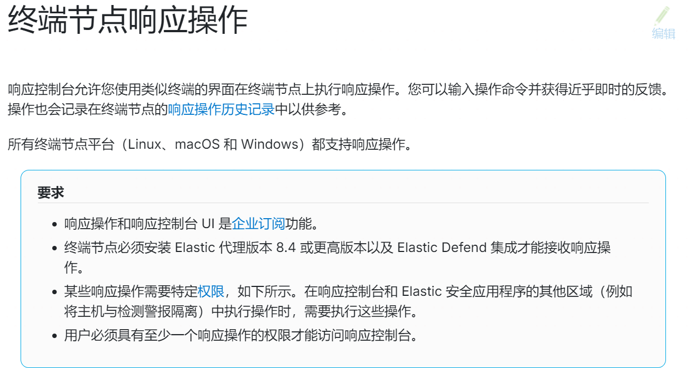

# 前言

在上一篇已经成功搭建了一套日志采集平台，现在用之前安装的kibana和elastic搭建一套edr，Elastic 是唯一参加过ATT&CK官方的评估而且可以免费使用的。

# 配置Fleet

kibana和elastic这些已经安装完成了，就直接来配置Fleet了

在左侧菜单栏找到Fleet

添加Fleet服务器，填入名称和Fleet Server的URL，默认为8220端口

快速开始

这里用Ubuntu来安装，和ES是同一台机器，它是从ES服务器上去下载的Agent

在Agent policy中，点击Fleet Server Policy添加集成

这里我添加了Elastic Defend 和Network Packet Capture

在左侧项目栏中选择Security栏目，观察告警发现需要API集成密钥

在kaibana/bin目录下运行kibana-encryption-keys generate

将生成的key保存到kibana.yml重启服务

重启后

规则栏中添加规则

全部安装

安装完成

有一点不好就是里面的规则需要自己去开启

# 检测

MSF生成了一个木马

目录下并没有，发现被拦截了

点击左边的箭头可以查看详情

默认的检测是防御，发现后会直接删除，可以来更改一下检测模式

改为检测，重新生成一个msf木马，检测到了，但是不会删除

至于节点响应的操作，是付费功能

参考链接

https://www.elastic.co/cn/getting-started/security/secure-my-hosts-with-endpoint-security#working-with-elastic-security-for-endpoint

https://blog.csdn.net/csdn12368/article/details/136657190

https://www.secrss.com/articles/29598