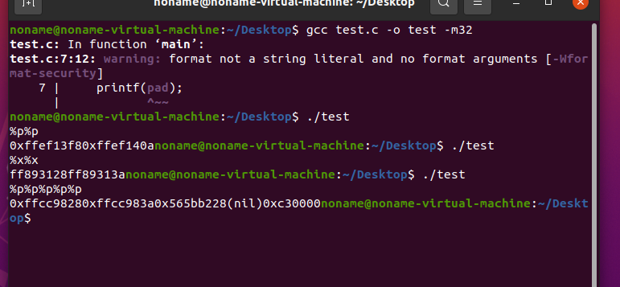

# 格式化字符串函数（ing）

格式化字符串函数就是可以接受可变数量的参数，然后将第一个参数作为格式化字符串，解析后面传入的参数。正如在python中的占位`%s`，或者`{}`配合format函数这种格式，在`C/C++`中我们常见的就`printf`，平常我们看到的打印大多数是这种格式：`printf(%d, n)`。几乎所有的 C/C++ 程序都会利用格式化字符串函数来**输出信息，调试程序，或者处理字符串**。

一般来说，格式化字符串在利用的时候主要分为三个部分

- 格式化字符串函数
- 格式化字符串
- 后续参数（可选）

在菜鸟教程中我们也能清楚地看到`printf`的用法


也可以结合这张图片理解


当然常见的格式化字符串的函数并不止`printf`，还有这些

- 输入
  - `scanf`
- 输出
  - `printf`: 输出到` stdout`
  - `fprintf`: 输出到指定 FILE 流
  - `vprintf`: 根据参数列表格式化输出到 stdout
  - `vfprintf`: 根据参数列表格式化输出到指定 FILE 流
  - `sprintf`: 输出到字符串
  - `snprintf` :输出指定字节数到字符串
  - `vsprintf`: 根据参数列表格式化输出到字符串
  - `vsnprintf`: 根据参数列表格式化输出到指定字节到字符串
  - `setproctitle`: 设置 argv
  - `syslog`: 输出日志
  - `err, verr, warn, vwarn etc...`

格式化字符串中的占位符用于指明输出的参数值如何格式化, 格式化占位符的基本格式为:

```
%[parameter][flags][field width][.precision][length]type
```

具体的pattern可以在https://zh.wikipedia.org/wiki/%E6%A0%BC%E5%BC%8F%E5%8C%96%E5%AD%97%E7%AC%A6%E4%B8%B2查看

我们平常见到的基本就是type是必须的，以`printf`为例

```
printf("%s",padding)	# 打印padding
printf("%p",padding)	# 打印padding的栈上数据，其实就是地址，字符串在程序中的传递用的就是指针，结束就是\x00
```

- %p:直接打印栈上的数据
- %s:把栈上的数据作为地址解析，打印地址解析的数据
- %x 以十六进制打印，只能打印4字节，一般只用于32位
- %c 打印单个字符
- %hhn 写一字节
- %hn 写两字节
- %n 把已经成功输出的字符个数写入对应的整型指针参数所指的变量。将栈上的内容作为地址解析，然后改变这个地址上的内容，写四字节
- %ln 32位写四字节，64位写八字节
- %lln 写八字节
- %d,%i有符号十进制数值`int`'`%d`'与'`%i`'对于输出是同义；但对于`scanf()`输入二者不同，其中`%i`在输入值有前缀`0x`或0时，分别表示16进制或8进制的值。如果指定了精度，则输出的数字不足时在左侧补0。默认精度为1。精度为0且值为0，则输出为空。


# 格式化字符串漏洞原理

> 格式化字符串漏洞的成因在于像`printf/sprintf/snprintf`等格式化打印函数都是接受可变参数的，而一旦程序编写不规范，比如正确的写法是：`printf("%s", pad)`，偷懒写成了：`printf(pad)`，此时就存在格式化字符串漏洞。

正常情况下，我们对一个字符串输出采用这种形式

```
#include <stdio.h>
#include<stdlib.h>
int main()
{
  int n=5;
  printf("%d",n);
  return 0;
}
```


但是不采用格式化字符串的情况下， 直接输出字符串也可以

```
#include <stdio.h>
#include<stdlib.h>

int main()
{
  char a[]="neuqcsa";
  printf(a);
  return 0;
}
```

不过这种情况下，如果用户可控输入的话就会存在一定的 问题

```
#include <stdio.h>
#include<stdlib.h>

int main()
{
  char a[100];
  scanf("%s",a);
  printf(a);

  system("pause");
  return 0;
}
```


换个方式来看

```c
#include <stdio.h>

int main()
{
    int a = 10;
    printf("The value of a is %d\n", a);
    return 0;
}
```

这串代码采用格式化字符串，应该会输出`The value of a is 10`

但是我们如果后面不跟上a这个参数的话，会输出什么呢


可以看到输出了一串随机的数字

在进入`printf`之后, 函数首先获取第一个参数, 一个一个读取其字符会遇到两种情况:

- 当前字符不是`%`, 直接输出到相应标准输出.
- 当前字符是`%`， 继续读取下一个字符:
  - 后续未有字符, 报错.
  - 后续字符是`%`, 输出`%`.
  - 否则根据后续相应的字符来获取相应的参数, 对其进行解析并输出.

假设在程序编写时出现了如下语句:

```
printf("Color %s, Number %d, Float %4.2f");
```

此时可以发现语句中并没有提供参数, 但是程序照样会运行, 会将栈上存储格式化字符串地址上面的三个变量分别解析为:

1. 解析其地址对应的字符串
2. 解析其内容对应的整形值
3. 解析其内容对应的浮点值

对于`情形1`来说, 如果提供了一个不可访问地址, 比如`0`, 那么程序就会因此而崩溃, 这基本就是格式化字符串漏洞的基本原理.

我们来对如下程序看看

```
#include <stdio.h>

int main()
{
    char pad[100];
    scanf("%s", pad);
    printf(pad);

    return 0;
}
```



32位`linux`系统下是用栈传递参数，栈顶指针`esp`是第一个参数，此时`printf`就会打印该字符串，如果进一步遇到格式化符号，比如这里的`%p`，那么就会以十六进制的方式打印第二个参数，但我们并没有传递第二个参数，所以系统还是将`esp+0x4`的位置当作第二个参数打印了，以此类推。


这里我输入了两个%p，如果按照这个理解就是打印`0xffffd1280xffffd13a`


# 漏洞利用

格式化字符串漏洞的两个利用手段

- 使程序崩溃，因为 %s 对应的参数地址不合法的概率比较大。
- 查看进程内容，根据 %d，%f 输出了栈上的内容。

下面就参考CTF WIKI来看看具体怎么利用的

## 程序崩溃

`%s`对应参数地址，只需要不合法的地址就可以使程序崩溃，只需要输入若干个 %s 即可

```
%s%s%s%s%s%s%s%s%s%s%s%s%s%s
```

这是因为栈上不可能每个值都对应了合法的地址，所以总是会有某个地址可以使得程序崩溃。这一利用，虽然攻击者本身似乎并不能控制程序，但是这样却可以造成程序不可用。比如说，如果远程服务有一个格式化字符串漏洞，那么我们就可以攻击其可用性，使服务崩溃，进而使得用户不能够访问。

## 泄露内存

利用格式化字符串漏洞，我们还可以获取我们所想要输出的内容。一般会有如下几种操作

- 泄露栈内存
  - 获取某个变量的值
  - 获取某个变量对应地址的内存
- 泄露任意地址内存
  - 利用 GOT 表得到 libc 函数地址，进而获取 libc，进而获取其它 libc 函数地址
  - 盲打，dump 整个程序，获取有用信息。

### 泄露栈内存

```
#include <stdio.h>
int main() {
  char s[100];
  int a = 1, b = 0x22222222, c = -1;
  scanf("%s", s);
  printf("%08x.%08x.%08x.%s\n", a, b, c, s);
  printf(s);
  return 0;
}
```

将代码编译一下

```
gcc -m32 -fno-stack-protector -no-pie -o leakmemory leakmemory.c
```


编辑器还告警了第二个格式化字符串没有参数的问题

#### 获取栈上变量数值

在运行上面编辑出的可执行文件后，输入`%08x.%08x.%08x`


用GDB来调试看看，将断点下载printf函数上


在scanf输入后，断在了第一个printf处

观察栈中数据，栈中第一个变量的值函数的返回地址，第二个变量是格式化字符串的真实地址——`0x804a00b`，第三个变量是a的值，第四个变量是b的值，第五个变量是c的值，地六个变量则是输入的格式化字符串对应的地址——`0xffffd080`


并且打印出来了一些内容，按照前面所想的就是a，b，c三个变量的值，已经拼接的字符串

继续运行最后得到了第二个printf打印字符


这是因为我们的格式化字符串是%08x.%08x.%08x，对应 %x%x%x的格式，所以程序会将栈上格式化字符串所在地址0xffffd074以及之后数值作为第一，第二，第三个参数按照int类型解析然后打印出来，也就是`ffffd080，f7ffd990，80491d1`


这样就获取到了栈上的数据

除此之外，还可以通过%p来获取内容


这里需要注意的是，并不是每次得到的结果都一样 ，因为栈上的数据会因为每次分配的内存页不同而有所不同，这是因为栈是不对内存页做初始化的。

上面的可以看到，我们要获取第二个变量的值就是`%x.%x`，或者是`%p.%p`(点只是为了分割开)，这样都是一个一个参数地去获取，**有没有办法直接获取栈中被视为第 n+1 个参数的值呢**？答案是可以的。方法如下

```
%n$x
```

利用如下的字符串，我们就可以获取到对应的第 n+1 个参数的数值。因为格式化参数里面的 n 指的是该格式化字符串对应的第 n 个输出参数，那相对于输出函数来说，就是第 n+1 个参数了。


用gdb调试运行


可以看到在printf函数中的第四个参数就是08491d1

#### 获取栈变量对应字符串

在前面我们通过了%x或者%p获取到了栈变量的数值，除此之外，还可以通过%s获取栈变量对应的字符串


这里通过%s打印了0xffffd080对应地址的字符串`%s`

当多个%s的时候**对应的变量不能够被解析为字符串地址，那么，程序就会直接崩溃。**


### 泄露任意地址内存

在前面达到了泄露栈上的变量或者是数值，但是效果甚微，如果有时候想泄露一个libc的got表内容，得到地址，算出libc其他函数的值，所以能否泄露到指定


参考链接

https://ctf-wiki.org/pwn/linux/user-mode/fmtstr/fmtstr-exploit/#_7

https://xz.aliyun.com/t/12712
