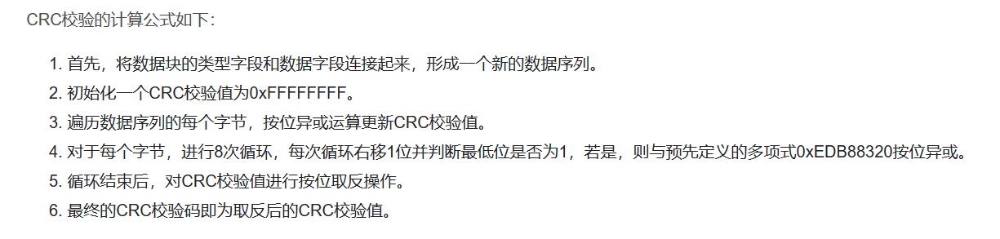
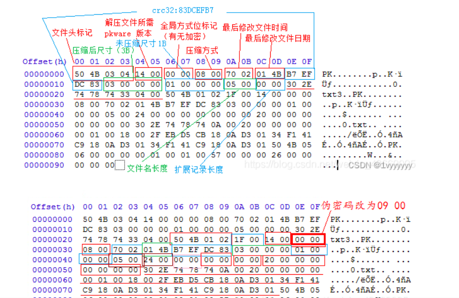
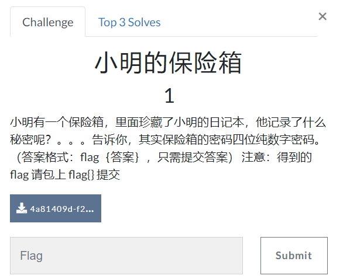
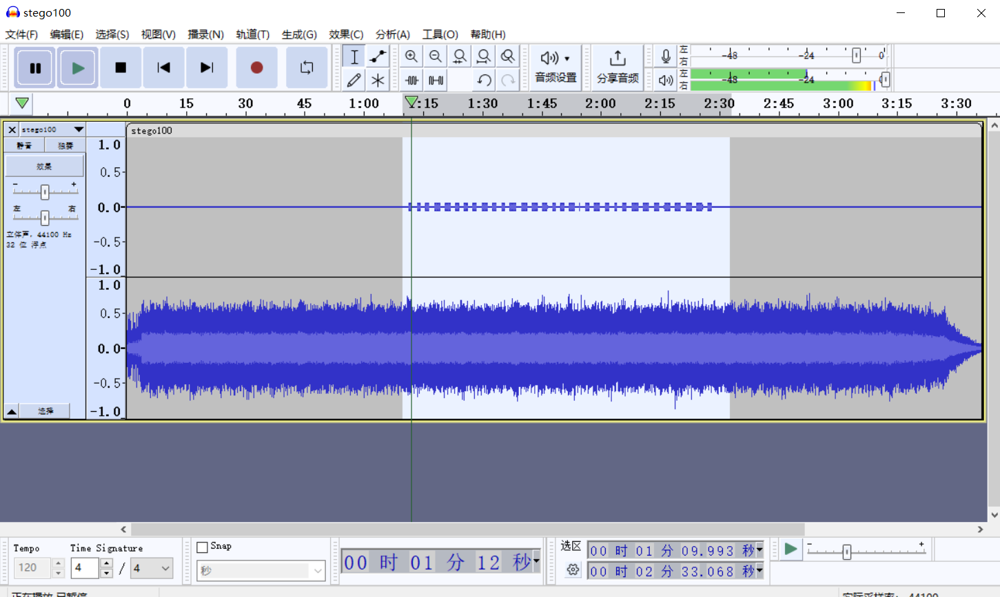
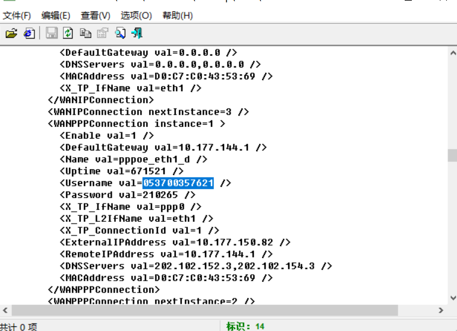
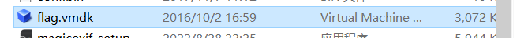
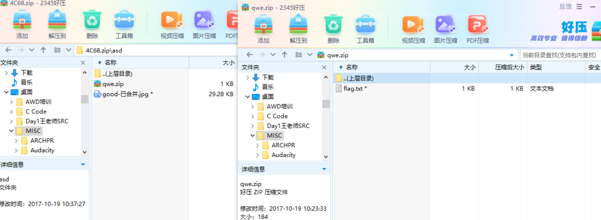

# 金三胖

下载下来是一个gif，直接用stegsolve逐帧查看


所以最后flag{he11o}

# 你竟然赶我走

将图片拖入010editor或者winhex中


看到最后的flag

# 二维码

拿到的是一张二维码图片，用扫描后发现并没有其他内容


丢进010中


看到了PK文件头，想到可能隐藏了一个zip压缩包(zip的创始人名字简写为PK)和4number.txt文件

这里可以用binwalk分析出来，也可以修改后缀为zip

binwalk看到里面藏有一个zip，可以用`binwalk -e`直接分离，也可以用foremost，比较新的kali应该是自带了这个的


查看压缩包内文件需要密码


```
fcrackzip -D -p passwd passwd.zip
-D 使用一个字典
-p 初始化password字符串
 
fcrackzip -b -l 6-6 -c 1 -p 000000 passwd.zip
-b 暴力破解
-l 6-6 限制密码长度为6
-c 1 限制密码是数字
-p 000000 初始化破解起点
 
fcrackzip -b -l 3-3 -c 1 -v flag.zip
-b 暴力破解
-l 3-3 限制密码长度为6
-c 1 限制密码是数字
-v 显示每一步

参数解释：
-b：			使用暴力破解
-c 1：			使用字符集，1指数字集合
-l 4-4：		指定密码长度，最小长度-最大长度
-u：			不显示错误密码，仅显示最终正确密码
```

因为文件名为4number.txt，所以我们使用4位的暴力破解

最后的命令为`fcrackzip -b -l 4-4 -c 1 -u 1D7.zip `


看到加密的内容

# 大白


题目提示屏幕太小


```
开头的0~7八个字节为png的文件头：89 50 4E 47 0D 0A 1A 0A （固定格式）
8~11四个字节：00 00 00 0D 表示头部数据块的长度为13（固定格式）
12~15四个字节：49 48 44 52 表示文件头数据块的标示（固定格式）
16~19四个字节：00 00 02 A7表示图片的宽（不固定）
20~23四个字节：00 00 01 00表示图片的高（不固定）
24~28五个字节：08 06 00 00 00表示Bit depth（图像深度）、ColorType（颜色类型）、 Compression method（压缩方法）、 Filter method（滤波器方法）、Interlace method（隔行扫描方法）这五个字节不固定，均为可变数据
29~32四个字节：76 EC 1E 40为图片的crc校验值由从第12个字节到第28个字节的十七位字节进行crc计算得到
```

另外在Stegsolve中也能分析出CRC等

在010中我们找到IHDR后面8个bytes为000002A7|00000100，对应的分别是宽度和高度


```
89 50 4E 47 0D 0A 1A 0A 是 PNG 头部署名域，表示这是一个 PNG 图片
00 00 00 0D 描述 IHDR 头部的大小，定义了长度为 13 个 Bytes，所以，这里，你看到是 13 个字节
49 48 44 52 是 Chunk Type Code, 这里 Chunk Type Code=IHDR
00 00 02 A7 00 00 01 00 08 06 00 00 00 描述了 Chunk Data，它是可变长度数据.
6D 7C 71 35 是对 IHDR 的 CRC 校验
```

所以目前图片的大小为：679 * 256

虽然在windows上打开能正常显示，但是很明显下面一截没有显示完全，放在kali里面


直接说IHDR块的CRC错误，从上面分析可以得出CRC的值为6D7C7135

我们宽度是正常的，所以通过CRC的校验在求得正常的值

```
import os
import binascii
import struct
 
misc = open("dabai.png","rb").read()
 
for i in range(1024):
    data = misc[12:20] +struct.pack('>i',i)+ misc[24:29]
    crc32 = binascii.crc32(data) & 0xffffffff
    if crc32 == 0x6d7c7135:
        print (i)
```



当然也可以直接爆破宽高

```
import binascii
import struct

crcbp = open("dabai.png", "rb").read()  # 打开图片
crc32frombp = int(crcbp[29:33].hex(), 16)  # 读取图片中的CRC校验值
print(crc32frombp)

for i in range(4000):  # 宽度1-4000进行枚举
    for j in range(4000):  # 高度1-4000进行枚举
        data = crcbp[12:16] + \
               struct.pack('>i', i) + struct.pack('>i', j) + crcbp[24:29]
        crc32 = binascii.crc32(data) & 0xffffffff
        # print(crc32)
        if (crc32 == crc32frombp):  # 计算当图片大小为i:j时的CRC校验值，与图片中的CRC比较，当相同，则图片大小已经确定
            print(i, j)
            print('hex:', hex(i), hex(j))
            exit(0)

```


所以修改高度为01DF


最后打开图片看到flag


# N种方法解决

虽然给到的是一个exe，但是010打开后发现是jpg


解base64后发现是二维码


这里cyberchef需要保存到图片才能看到，也可以用一些在线工具转图片，然后再扫描二维码


# 乌镇峰会图

010打开最后看到flag


# wireshark

在HTTP的导出对象中看到与flag相关的请求


追踪流看到flag


# 基础破解

提到了四位数字加密的压缩包


用ARCHPR来爆破压缩包密码


将得到的内容base64解码

# 文件中的秘密


有時候可以搜flag的关键词，也可以可能里面会存在点可以搜`66 00`，flag的hex为0x666c6167

`flag{870c5a72806115cb5439345d8b014396}`

# LSB

在题目中提到了LSB隐写这个关键词

LSB隐写原理就是图片中的像素一般是由三种颜色组成，即三原色(红绿蓝)，由这三种原色可以组成其他各种颜色，在png图片的存储中,每个颜色占有8bit,即有256种颜色，一共包含256的三次方颜色，即16777216中颜色，人类的眼睛可以区分约1,000万种不同的颜色，剩下无法区分的颜色就有6777216。

LSB隐写就是修改了像素中的最低位，把一些信息隐藏起来。png图片是一种无损压缩,也只有在无损压缩或无压缩的图片（bmp图片是一种无压缩）上实现LSB隐写，如果是jpg图片,就没办法使用lsb隐写了。

这里直接引用一个图片来看了


图像处理主要是analyse这个模块，主要有这四个功能：

- File Format: 文件格式，查看图片的具体信息
- Data Extract: 数据抽取，提取图片中隐藏数据
- Frame Browser: 帧浏览器，主要是对GIF之类的动图进行分解，动图变成一张张图片
- Image Combiner: 拼图，图片拼接

对于LSB隐写的图片，我们用StegSolve打开模块，由于是RGB三原色的最低位隐写，所以在Data Extract模，提取Red，Green，和Blue的`0通道`信息，在这三个颜色的`0通道`上打勾，并按下Preview键，当隐写的内容为文本文件时如下所示：


我们可以查看这个内容是否藏有了flag，或者看到PNG头，可以保存为PNG，这里保存为PNG后看到了二维码


然后得到flag


如果出题用隐写脚本可以参考https://zhuanlan.zhihu.com/p/461716971

# ZIP伪加密

对于压缩包密码可以是爆破，但也可能是伪加密的

zip 伪加密是在文件头的加密标志位做修改，进而再打开文件时识被别为加密压缩包。

一个 ZIP 文件由三个部分组成：压缩源文件数据区 + 压缩源文件目录区 + 压缩源文件目录结束标志

在压缩源文件数据区中，第七和第八个字节是判断文件有无加密的重要标志，00 00表示文件未被加密，09 00或者01 00表示文件被加密，需要解密密码

在压缩源文件目录区中，第九和第十个字节用来判断打开文件是否需要密码，00 00表示无需密码，09 00表示需要密码

而当压缩源文件数据区中为00 00，压缩源文件目录区中为09 00时，这个文件就是一般伪加密的zip，此时无论怎样爆破密码都进不去，因为根本就不存在密码，只是会弹输入框出来；当源文件数据区和目录区均为00 00时就是无需解密的正常zip；当源文件数据区和目录区均为09 00时就是需要解密的正常zip，可以通过爆破的方式破解密码，同时也可能是另一种伪加密的zip

将压缩包拖进010来看


压缩源文件数据区：

```
50 4B 03 04：这是 PK 头文件标记（0x04034b50）
14 00：解压文件所需 pkware 版本
09 00：全局方式位标记（图中代表是有加密🔐, 如果是 00 00 就是代表无加密🔐）
08 00：压缩方式
50 A3：最后修改文件时间
A5 4A：最后修改文件日期
21 38 76 65：CRC-32 校验（1480B516）
19 00 00 00：压缩后尺寸（25）
17 00 00 00：未压缩尺寸（23）
08 00：文件名长度
00 00：扩展记录长度
```

也可以偷一个CSDN的图



压缩源文件目录区

```
50 4B 01 02：目录中文件 PK 文件头标记 (0x02014b50)
1F 00：压缩使用的 pkware 版本
14 00：解压文件所需 pkware 版本
09 00：全局方式位标记（图中代表是有加密🔐, 如果是 00 00 就是代表无加密🔐）
08 00：压缩方式
50 A3：最后修改文件时间
A5 4A：最后修改文件日期
21 38 76 65：CRC-32 校验（1480B516）
19 00 00 00：压缩后尺寸（25）
17 00 00 00：未压缩尺寸（23）
08 00：文件名长度
24 00：扩展字段长度
00 00：文件注释长度
00 00：磁盘开始号
00 00：内部文件属性
20 00 00 00：外部文件属性
00 00 00 00：局部头部偏移量
```

压缩源文件目录结束标志：

```
50 4B 05 06：目录结束标记
00 00：当前磁盘编号
00 00：目录区开始磁盘编号
01 00：本磁盘上纪录总数
01 00：目录区中纪录总数
5A 00 00 00：目录区尺寸大小
3F 00 00 00：目录区对第一张磁盘的偏移量
00 00：ZIP 文件注释长度
```

这个压缩包目前是伪加密的，可以通过

- 把 压缩源文件目录区 的 全局方式位标记 的 01 00 或 09 00 改为 00 00 就可以去除密码 提示

- 把 压缩源文件目录区 的 全局方式位标记 的 00 00 改为 01 00 或 09 00 就可以添加密码 提示


也可以使用 ZipCenOp.jar 清除密码

```
java -jar ZipCenOp.jar r xxx,zip # 这个填你压缩包的名字
```


运行后压缩包修复成功，可以直接打开了

# 被嗅探的流量

在一个http请求中找到了文件上传的流


并且上传了flag.jpg


直接在流里面搜到了flag

# rar

在压缩包中有一个rar文件，提示加密为4为纯数字，直接爆破


得到密码8795，解压得到flag

# qr

直接扫描二维码，拿到flag


# 镜子里的世界

发现是一张图片steg.png，直接用stegsolve打开，怀疑是LSB


flag{st3g0_saurus_wr3cks}

# ningen


binwalk看到里面藏了一个zip


题目提示4位数，爆破为8368

# 爱因斯坦

一张图片010看到了一个flag.txt


很明显里面藏了一个zip，binwalk一下


但是爆破密码和伪加密试了都不行，最后才知道原来在图片里面


`this_is_not_password`就是压缩包密码

# 小明的保险箱



给的个图片，看起来有点向压缩包的密码爆破，直接binwalk跑出来了一个rar


APCHRP爆破出密码7869


# easycap

只有TCP流，追踪一看就是flag


# 隐藏的钥匙

在010中找到了flag


是一串base64

# 另外一个世界


010的结尾有一段二进制，解密就是flag

# FLAG

在010找flag无果，binwalk看看


看到了 Zlib 的地址开头为 0x29，也没有其他东西，试试LSB


发现一个压缩包


解压出来


发现是一个elf文件，在kali中转字符串


看到了flag

# 神秘龙卷风


提示压缩包伪4位数字密码，爆破得5463


brainfuck代码，直接在线解码[Brainfuck - interpreter online (doleczek.pl)](http://bf.doleczek.pl/)


随波逐流可以直接爆破出来


# 数据包中的线索


早流量包中看到了一个访问fenxi.php的文件，看到返回包是一串编码


base64解码后发现是jpg格式，保存下来看到flag

flag{209acebf6324a09671abc31c869de72c}

# 假如给我三天光明

给了一个zip和一张图片


music.zip里面给了一段音频但是解压需要密码


看jpg下面给了一段盲文

现行盲文是表音文字，汉语的每个音节由一至三方盲符组成，分别表示声母、韵母和声调。字母（声母与单元音韵母）的符号选择基于汉语拼音所对应的盲文的拉丁字母表。


对照下来为 kmdonowg，然后解压得到wav文件

听起来像摩斯电码，拖入**audacity**工具打开分析


最后得到

```
-.-. - ..-. .-- .--. . .. ----- ---.. --... ...-- ..--- ..--.. ..--- ...-- -.. --..
```


最后flag{wpei08732?23dz}

# 后门查杀


解压的时候360都爆毒了


D盾也扫到了


# webshell后门


360又找到了，这种简单的后门D盾也可以扫到


还找到了一些其他的，图片马以及一个混淆的木马，但是最原始的还是zp.php，感觉和上个题一样


# 来首歌吧

给了个30多M的wav文件



摩斯电码，放大分析出来

```
..... -... -.-. ----. ..--- ..... -.... ....- ----. -.-. -... ----- .---- ---.. ---.. ..-. ..... ..--- . -.... .---- --... -.. --... ----- ----. ..--- ----. .---- ----. .---- -.-.
```


# 荷兰宽带数据泄露

给的一个bin文件，显示是带宽数据，用routerpassview打开



flag{053700357621}

# 面具下的flag


在010中看到最后藏了一个zip，foremost分离出来


但是解密需要密码


伪加密修复后得到vmdk文件



`vmdk`文件可以用`7z`解压

```
7z x flag.vmdk -o./
```


得到了两部分的key


第一部分用brainfuck解码`flag{N7F5_AD5`


第二部分一样的brainfuck解码`_i5_funny!}`

flag{N7F5_AD5_i5_funny!}

# 九连环


图片内又存在压缩包




其中的qwe.zip可以直接解压，jpg需要密码


尝试伪加密修改为00后，解密得到jpg，但是没有看到什么东西，binwalk也没有看到

网上用steghide提取到了隐写的内容

```
steghide extract -sf good-已合并.jpg 
```


这题没有密码，回车即可


看到了另外一个压缩包的密码


flag{1RTo8w@&4nK@z*XL}


参考链接：

https://lanyundev.com/posts/19bf4b6f

https://zhuanlan.zhihu.com/p/461716971

http://note.shenghuo2.top/MISC/BUU-misc%E7%AC%AC%E4%B8%80%E9%A1%B5/#webshell