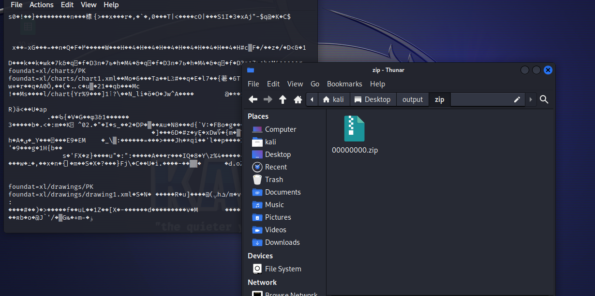
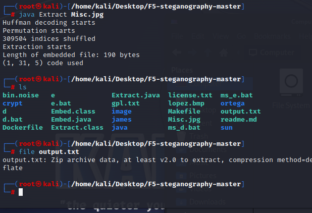
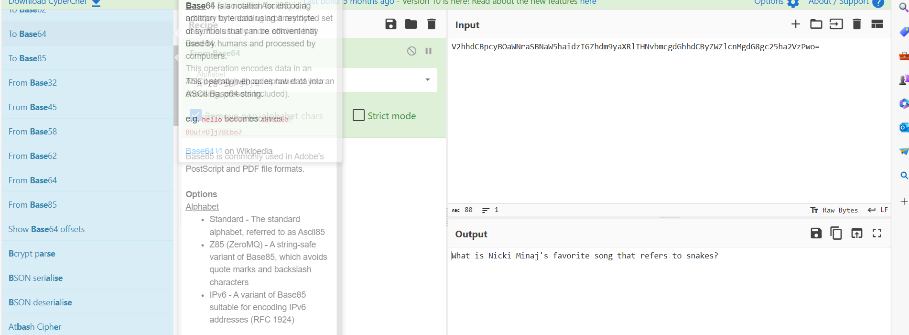
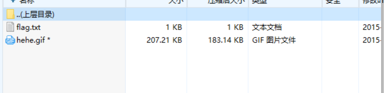
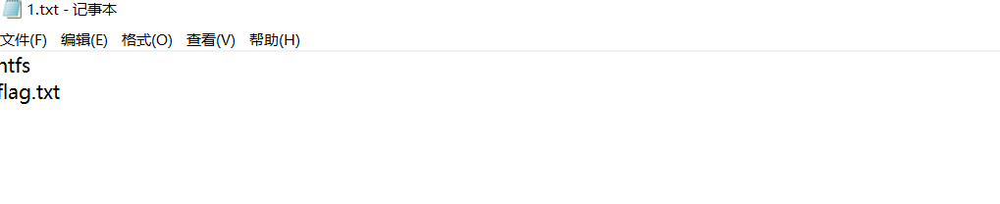
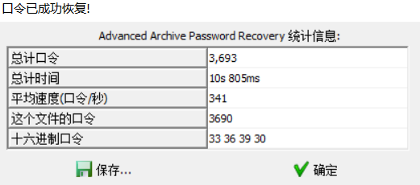

# 被劫持的神秘礼物


找到账号密码，在http流中，看到了登录请求，里面有账号密码admina/adminb


flag{1d240aafe21a86afc11f38a45b541a49}

# BJDCTF2020]认真你就输了

下载下来是个xls，foremost分离



拿到了一个zip，网上说在这里面看到了flag，其实只是在xl/charts下看到了一个`{}`与flag相关的字段

接下来在压缩包中找到flag


flag{M9eVfi2Pcs#}

# BJDCTF2020藏藏藏


foremost分离出zip


解压得到一个二维码


# 被偷走的文件


发现被偷走的文件是flag.rar直接提交不对

找到原始数据将rar提取出来


尝试爆破密码


# 刷新过的图片

F5隐写`https://github.com/matthewgao/F5-steganography`

需要jdk11



看到output.txt是zip文件，伪加密修复后拿到flag


# [GXYCTF2019]佛系青年

1.png可以正常解压，fo.txt需要密码


先看看是否有伪加密


成功解压，看到了与佛论禅


也可以在线解密

http://www.keyfc.net/bbs/tools/tudoucode.aspx

# [BJDCTF2020]你猜我是个啥

下载后的压缩包打不开，发现是PNG文件


修改后缀名看到是个二维码，本来扫二维码


结果就直接看到了flag

# snake


看到一串base64编码的key后最后存在一个ZIP

压缩包内有两个文件


key就是刚才看到的base64



看到一个问题


发现问题的答案是anaconda，这就是key

这是和蛇有关 于是搜索一下和蛇有关的加密方式，**serpent加密**

http://serpent.online-domain-tools.com/


flag{who_knew_serpent_cipher_existed}

# 秘密文件

追踪TCP流，发现偷了6b0341642a8ddcbeb7eca927dae6d541.rar


找到这个包的原始数据保存下来打开发现需要密码，尝试四位爆破


密码1903

# [BJDCTF2020]just_a_rar

压缩包名字叫做4位数rar直接爆破


密码2016，得到一个flag.jpg


在010中找到了flag

flag{Wadf_123}

# [BJDCTF2020]鸡你太美


两个图片


副本图片没有gif头，无法正常打开，在前面插入4字节补上GIF89a缺失的部分


再次打开图片


flag{zhi_yin_you_are_beautiful}

# 菜刀666

菜刀流量分析


本来以为他直接去读的flag.txt，但是没找到，后面再其他包中找到了一个zip，里面有flag.txt


要稍微处理一些，把前面不需要的删了开头位zip的16进制504b0304

尝试伪加密和爆破均行不通，回到流量包，其中一个比较大的http数据包引起了我的注意


z2的开头是FFD8，结尾是FFD9


将这个16进制保存为jpg


拿到压缩包密码

Th1s_1s_p4sswd_!!!

flag{3OpWdJ-JP6FzK-koCMAK-VkfWBq-75Un2z}

# 攻防世界4-1


分离得到了一个zip


zip里面有个上述txt，还有一个zip


发现两张一样的图片，猜测盲水印


wdflag{My_c4t_Ho}

# [BJDCTF2020]一叶障目


打开发现crc不匹配，爆破一下宽高

```
import binascii
import struct

crcbp = open("1.png", "rb").read()  # 打开图片
crc32frombp = int(crcbp[29:33].hex(), 16)  # 读取图片中的CRC校验值
print(crc32frombp)

for i in range(4000):  # 宽度1-4000进行枚举
    for j in range(4000):  # 高度1-4000进行枚举
        data = crcbp[12:16] + \
               struct.pack('>i', i) + struct.pack('>i', j) + crcbp[24:29]
        crc32 = binascii.crc32(data) & 0xffffffff
        # print(crc32)
        if (crc32 == crc32frombp):  # 计算当图片大小为i:j时的CRC校验值，与图片中的CRC比较，当相同，则图片大小已经确定
            print(i, j)
            print('hex:', hex(i), hex(j))
            exit(0)
```


010改一下


# [SWPU2019]神奇的二维码


扫描二维码发现是假的flag


binwalk看到了4个rar，分离出来


得到了如下内容


其中18394这个压缩包是需要密码的，剩下的解压出来就是其他的那些文件，解压出来的那个看看flag的rar也需要密码

encode.txt是一串base64，是看看flag的rar的密码，里面没什么东西

还有个flag.doc，里面是一长串base64解了后还有

```
import base64

def decode(f):
    n = 0
    while True:
        try:
            f = base64.b64decode(f)
            n += 1
        except:
            print('[+]Base64共decode了{0}次，最终解码结果如下:'.format(n))
            print(str(f, 'utf-8'))
            break


if __name__ == '__main__':
    f = open('./base64.txt', 'r').read()
    decode(f)

```


最后解了20此，得到了18394这个压缩包的密码，解出来一个mp3


摩斯电码

```
-- --- .-. ... . .. ... ...- . .-. -.-- ...- . .-. -.-- . .- ... -.--
```


# [BJDCTF2020]纳尼

给了一个GIF但是打不开，010看到头文件坏了


将文件头修复为GIF89a


修复后发现动图，再stegsolve逐帧查看

```
Q1RGe3dhbmdfYmFvX3FpYW5nX2lzX3NhZH0=
```

然后解base64


# 梅花香之苦寒来

再010中看到了一堆16进制


发现是一堆坐标

画图，所以这里就借用gnuplot来进行绘制
不过在使用gnuplot之前需要先将坐标格式转换成gnuplot可以识别的格式，下面是脚本

```
with open('result.txt', 'r') as res:  # 坐标格式文件比如(7,7)
    re = res.read()
    res.close()
    
with open('gnuplotTxt.txt', 'w') as gnup:   # 将转换后的坐标写入gnuplotTxt.txt
    re = re.split()
    tem = ''
    for i in range(0, len(re)):
        tem = re[i]
        tem = tem.lstrip('(')
        tem = tem.rstrip(')')
        for j in range(0, len(tem)):
            if tem[j] == ',':
                tem = tem[:j] + ' ' + tem[j+1:]
        gnup.write(tem + '\n')
    gnup.close()

```


得到了二维码


# [HBNIS2018]excel破解


010打开搜到了flag

# [HBNIS2018]来题中等的吧


摩斯电码

```
.- .-.. .--. .... .- .-.. .- -...
```


# 穿越时空的思念

Audacity打开看到摩斯电码


我下载新版的会出现下面这种状况


有声道为摩斯电码，换成了老版本才行，关闭左声道，在kali下用morse2ascii直接跑出来


看到两段摩斯电码解码情况

```
f029bd6f551139eedeb8e45a175b0786  f029bd6f5

第二段与第一段是重复的
flag{f029bd6f551139eedeb8e45a175b0786}
```


# [ACTF新生赛2020]outguess


flag.txt没什么东西


在mmm.jpg的exif中看到了社会主义核心价值光编码


解码结果abc


用outguess导出隐写内容

```
outguess -k 'abc' -r mmm.jpg flag.txt 
```


然后再flag.txt中看到内容

flag{gue33_Gu3Ss!2020}

# 谁赢了比赛？


发现了rar，分离出来



flag.txt可以直接解出来，但是gif需要密码


可以爆破出来，用stegsolve逐帧查看


这一帧保存下来后，拖到stegsolve里面左右看看，在red plane0中看到了二维码


# [WUSTCTF2020]find_me


看图片的EXIF，看到备注有一些盲文

```
⡇⡓⡄⡖⠂⠀⠂⠀⡋⡉⠔⠀⠔⡅⡯⡖⠔⠁⠔⡞⠔⡔⠔⡯⡽⠔⡕⠔⡕⠔⡕⠔⡕⠔⡕⡍=
```

[文本加密为盲文,可自设密码|文本在线加密解密工具 (qqxiuzi.cn)](https://www.qqxiuzi.cn/bianma/wenbenjiami.php?s=mangwen)


# [SWPU2019]我有一只马里奥

虽然给的一个exe，但是结尾是藏了一个rar


解压出来的1.txt，需要查看ntfs数据流



[关于NTFS数据流ADS的详细介绍-CSDN博客](https://blog.csdn.net/AmrYu/article/details/122770431)


所以可以执行notepad 1.txt:flag.txt，也可以用ntfsStreamsEditor


```
flag{ddg_is_cute}
```

# [GUET-CTF2019]KO

brainfuck


解码后


# [GXYCTF2019]gakk


将rar分离出来


爆破出密码，flag.txt


按频率统计[中文词语文字频率统计 - 批量之家 (tl.beer)](https://www.tl.beer/zicipinlv.html)


也可以用python

```
input_string = input("请输入字符串：")
char_count = {}

# 统计每个字符出现的次数
for char in input_string:
    if char not in char_count:
        char_count[char] = 1
    else:
        char_count[char] += 1

# 按字符出现次数降序排序
sorted_chars = sorted(char_count.items(), key=lambda x: x[1], reverse=True)

# 打印每个字符及其出现的次数
for char, count in sorted_chars:
    print(f"字符 '{char}' 出现了 {count} 次")

for char, count in sorted_chars:
    print(char, end="")
```


# [ACTF新生赛2020]base64隐写

给了一个二维码，一个txt


二维码没有什么用，txt全是base64，根据题目名，直接用base64隐写的脚本，可以参考[Base64隐写 - tolele - 博客园 (cnblogs.com)](https://www.cnblogs.com/tolele/p/16271548.html)

```
# base64隐写
import base64


def get_diff(s1, s2):
    base64chars = 'ABCDEFGHIJKLMNOPQRSTUVWXYZabcdefghijklmnopqrstuvwxyz0123456789+/'
    res = 0
    for i in range(len(s2)):
        if s1[i] != s2[i]:
            return abs(base64chars.index(s1[i]) - base64chars.index(s2[i]))
    return res


def b64_stego_decode():
    file = open("ComeOn!.txt", "rb")
    x = ''
    lines = file.readlines()
    for line in lines:
        l = str(line, encoding="utf-8")
        stego = l.replace('\n', '')
        # print(stego)
        realtext = base64.b64decode(l)
        # print(realtext)
        realtext = str(base64.b64encode(realtext), encoding="utf-8")
        # print(realtext)
        diff = get_diff(stego, realtext)
        n = stego.count('=')
        if diff:
            x += bin(diff)[2:].zfill(n * 2)
        else:
            x += '0' * n * 2

    i = 0
    flag = ''
    while i < len(x):
        if int(x[i:i + 8], 2):
            flag += chr(int(x[i:i + 8], 2))
        i += 8
    print(flag)


if __name__ == '__main__':
    b64_stego_decode()

```

# [MRCTF2020]ezmisc


crc报错，用脚本跑一下，修复宽高


修改后打开看到flag


flag{1ts_vEryyyyyy_ez!}

# [HBNIS2018]caesar

给了个txt


看名字就是凯撒

‘

一位位移

# [SWPU2019]伟大的侦探


压缩包需要密码，将txt用010打开


修改编码


```
wllm_is_the_best_team!
```


福尔摩斯小人密码


```
flag{iloveholmesandwllm}
```

# 黑客帝国


一串16进制，发现是rar



爆破得到密码，解压出来的png打不开


在010打开


发现应该是jpg的开头FFD8FF


看到了flag

flag{57cd4cfd4e07505b98048ca106132125}

# [HBNIS2018]低个头


键盘加密


# [MRCTF2020]你能看懂音符吗

下来一个rar，但是是损坏的


010看到文件头有问题


修改后成功打开解压出来一个docx，但是文件开头是zip的开头


document.xml中有音符[文本加密为音乐符号,可自设密码|文本在线加密解密工具 (qqxiuzi.cn)](https://www.qqxiuzi.cn/bianma/wenbenjiami.php?s=yinyue)


