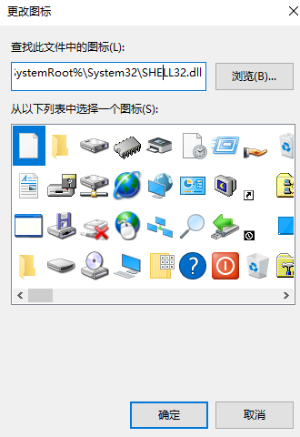
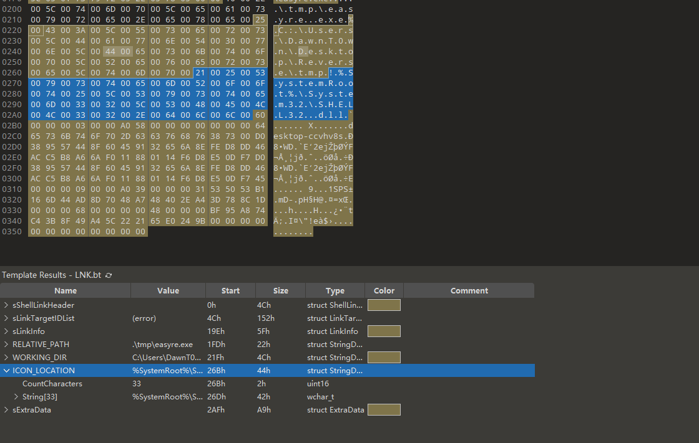
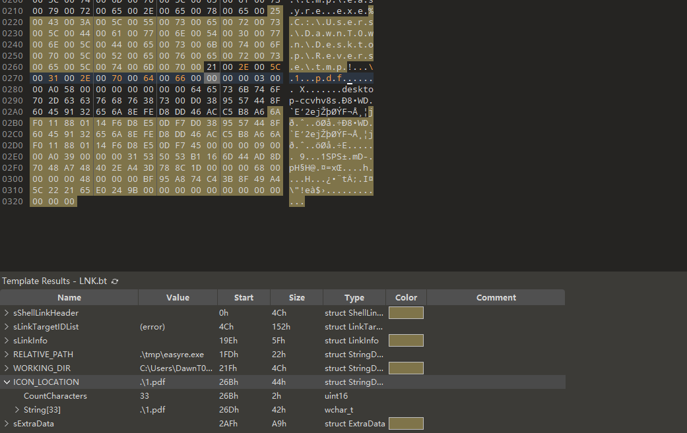
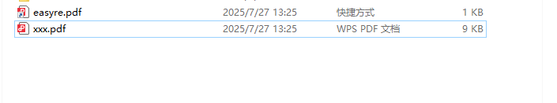

# lnk钓鱼随笔

lnk钓鱼想必大家都比较熟悉，无非就是用lnk替换图标，执行恶意木马执行或者通过powershell命令远程下载木马执行等操作，但是其具有一定的特征，可能火绒就直接拦截了，还有就是lnk图标问题，当lnk文件到了受害者电脑上怎么才能显示我们想要的图标，如果是直接替换ico图标，因为路径问题到了受害者电脑上其实是不显示的

这里就简单记录一下在磐石期间看到了一个lnk钓鱼样本，以及如何替换lnk图标

```
C:\Windows\System32\rundll32.exe url.dll,FileProtocolHandler ".\其他资料\__MACOS__\__MACOS__\__MACOS__\__MACOS__\xxx.exe"
```

可以通过rundll32执行`url.dll`的FileProtocolHandler来打开文件

如果只这样打开火绒的行为监控还是会报，需要再替换一下图标

至于lnk图标就用010来修改对应的块，可以自适应当前用户默认的文件编辑器




当前图标是用的`shell32.dll`，里面并没有我们想要的pdf图标

在010里打开



修改ICON_LOCATION，如果想lnk文件展示为pdf那就修改为`.\1.pdf`



看看效果



和我系统自带的pdf打开图标一样