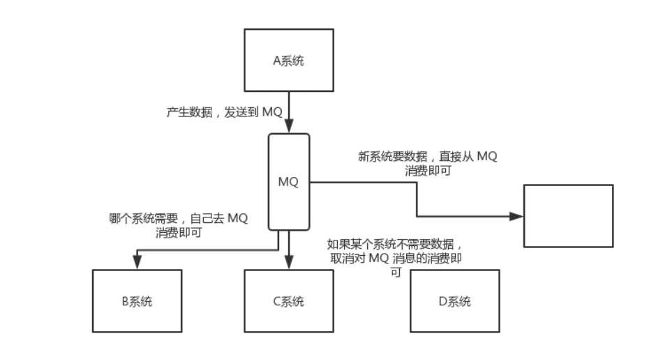

# 消息队列有哪些

我们经常看到的一些消息的UI列有kafka，activemq，rabbitmq，rocketmq，那这么多消息队列有什么区别呢

| 特性                     | ActiveMQ                              | RabbitMQ                                           | RocketMQ                                                     | Kafka                                                        |
| :----------------------- | :------------------------------------ | :------------------------------------------------- | :----------------------------------------------------------- | :----------------------------------------------------------- |
| 单机吞吐量               | 万级，比 RocketMQ、Kafka 低一个数量级 | 同 ActiveMQ                                        | 10 万级，支撑高吞吐                                          | 10 万级，高吞吐，一般配合大数据类的系统来进行实时数据计算、日志采集等场景 |
| topic 数量对吞吐量的影响 |                                       |                                                    | topic 可以达到几百/几千的级别，吞吐量会有较小幅度的下降，这是 RocketMQ 的一大优势，在同等机器下，可以支撑大量的 topic | topic 从几十到几百个时候，吞吐量会大幅度下降，在同等机器下，Kafka 尽量保证 topic 数量不要过多，如果要支撑大规模的 topic，需要增加更多的机器资源 |
| 时效性                   | ms 级                                 | 微秒级，这是 RabbitMQ 的一大特点，延迟最低         | ms 级                                                        | 延迟在 ms 级以内                                             |
| 可用性                   | 高，基于主从架构实现高可用            | 同 ActiveMQ                                        | 非常高，分布式架构                                           | 非常高，分布式，一个数据多个副本，少数机器宕机，不会丢失数据，不会导致不可用 |
| 消息可靠性               | 有较低的概率丢失数据                  | 基本不丢                                           | 经过参数优化配置，可以做到 0 丢失                            | 同 RocketMQ                                                  |
| 功能支持                 | MQ 领域的功能极其完备                 | 基于 erlang 开发，并发能力很强，性能极好，延时很低 | MQ 功能较为完善，还是分布式的，扩展性好                      | 功能较为简单，主要支持简单的 MQ 功能，在大数据领域的实时计算以及日志采集被大规模使用 |

各种对比之后，有如下建议：

> - 一般的业务系统要引入 MQ，最早大家都用 ActiveMQ，但是现在确实大家用的不多了，没经过大规模吞吐量场景的验证，社区也不是很活跃，所以大家还是算了吧，我个人不推荐用这个了；
> - 后来大家开始用 RabbitMQ，但是确实 erlang 语言阻止了大量的 Java 工程师去深入研究和掌控它，对公司而言，几乎处于不可控的状态，但是确实人家是开源的，比较稳定的支持，活跃度也高；
> - 不过现在确实越来越多的公司，会去用 RocketMQ，确实很不错（阿里出品），但社区可能有突然黄掉的风险，对自己公司技术实力有绝对自信的，推荐用 RocketMQ，否则回去老老实实用 RabbitMQ 吧，人家有活跃的开源社区，绝对不会黄。
> - 所以中小型公司，技术实力较为一般，技术挑战不是特别高，用 RabbitMQ 是不错的选择；大型公司，基础架构研发实力较强，用 RocketMQ 是很好的选择。
> - 如果是大数据领域的[实时计算](https://cloud.tencent.com/product/oceanus?from_column=20065&from=20065)、日志采集等场景，用 Kafka 是业内标准的，绝对没问题，社区活跃度很高，绝对不会黄，何况几乎是全世界这个领域的事实性规范

一般来说，kafka还是使用得最多的，吞吐量大，可用性高，反应速度快，在日志采集的时候也经常用到

# 为什么要使用消息队列

对于消息队列来说，有几种情况下可以提醒它的好处，解耦，异步，削峰

## 解耦

来看这样一个场景，A是一个消息的生产方，他要把消息发送到各个需要它的系统中去，那么新增一个系统，就需要在A系统中修改对应的接口代码，同理，在减少一个系统的时候，也需要同样的工作，这样代码就高度耦合在了A系统中，那假如使用消息队列会有什么好处呢

得到的概念图大概就是这样

作为消息的生产者，A系统只需要把自己的数据发送到消息队列中，其他系统如果需要，它就自己去消息队列取消息消费，A 系统压根儿不需要去考虑要给谁发送数据，不需要维护这个代码，也不需要考虑人家是否调用成功、失败超时等情况

这就好比看电视，如果你想看电视还需要去给某个平台申请，让它给你加接口，你才能看到对应的内容，和他在某个平台上线，你自己去点击播放相比，肯定是第二者简单

其实如果要开发什么东西也可以通过这样的方式去解耦，但是还没有接触过实际的开发场景，不过通过这样的方式对于系统间的消息发送的便捷度有很大的提升

## 异步

A 系统接收一个请求，需要在自己本地写库，还需要在 BCD 三个系统写库，自己本地写库要 3ms，BCD 三个系统分别写库要 300ms、450ms、200ms。最终请求总延时是 3 + 300 + 450 + 200 = 953ms，接近 1s，用户感觉搞个什么东西，慢死了慢死了。用户通过浏览器发起请求，等待个 1s，这几乎是不可接受的

一般互联网类的企业，对于用户直接的操作，一般要求是每个请求都必须在 200 ms 以内完成，对用户几乎是无感知的。

如果使用 MQ，那么 A 系统连续发送 3 条消息到 MQ 队列中，假如耗时 5ms，A 系统从接受一个请求到返回响应给用户，总时长是 3 + 5 = 8ms，对于用户而言，其实感觉上就是点个按钮，8ms 以后就直接返回了

## 削峰

这个场景下更容易理解在消息队列中常常提到的一个词——吞吐

在日常的场景中，不同时间段的流量肯定是不一样的，假设每天 0:00 到 12:00，A 系统风平浪静，每秒并发请求数量就 50 个。结果每次一到 12:00 ~ 13:00 ，每秒并发请求数量突然会暴增到 5k+ 条。但是系统是直接基于 MySQL 的，大量的请求涌入 MySQL，每秒钟对 MySQL 执行约 5k 条 SQL。

一般的 MySQL，扛到每秒 2k 个请求就差不多了，如果每秒请求到 5k 的话，可能就直接把 MySQL 给打死了，导致系统崩溃，用户也就没法再使用系统了

都是如果使用消息队列的话，就可以控制吞吐量

不管我的请求多少，将它全部吐进消息队列中，多少我A系统最多每秒只能处理多少，就从消息队列中拿多少，要超过自己每秒能处理的最大请求数量就 ok，这样下来，哪怕是高峰期的时候，A 系统也绝对不会挂掉。而 MQ 每秒钟 5k 个请求进来，就 2k 个请求出去，结果就导致在中午高峰期（1 个小时），可能有几十万甚至几百万的请求积压在 MQ 中。

但是这只是短暂的积压，高峰期过了之后，每秒钟就 50 个请求进 MQ，但是 A 系统依然会按照每秒 2k 个请求的速度在处理。所以说，只要高峰期一过，A 系统就会快速将积压的消息给解决掉。

这样就把高峰期的峰值降低了，保证了A系统的稳定性。

大多数是[这篇文章](https://cloud.tencent.com/developer/article/1408126)的文字，自己只是记录一下，加深一下理解

参考链接：

https://cloud.tencent.com/developer/article/1408126