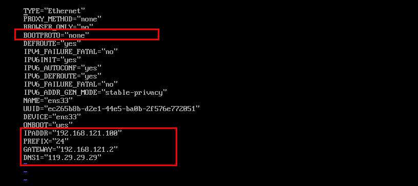

# 环境准备

正常最小化安装三台虚拟机Centos7.9

## 设置hostname

使用hostnamectl设置每台机器的hostname

```
hostnamectl set-hostname master
hostnamectl set-hostname worker1
hostnamectl set-hostname worker2
```


## 设置ip

为了方便后续，把三台主机设置固定的ip地址

```
192.168.121.100 master
192.168.121.101 worker1
192.168.121.102 worker2
```

master配置如下：

```
TYPE="Ethernet"
PROXY_METHOD="none"
BROWSER_ONLY="no"
BOOTPROTO="none"
DEFROUTE="yes"
IPV4_FAILURE_FATAL="no"
IPV6INIT="yes"
IPV6_AUTOCONF="yes"
IPV6_DEFROUTE="yes"
IPV6_FAILURE_FATAL="no"
IPV6_ADDR_GEN_MODE="stable-privacy"
NAME="ens33"
UUID="ec265b8b-d2e1-44e5-ba0b-2f576e772051"
DEVICE="ens33"
ONBOOT="yes"
IPADDR="192.168.121.100"
PREFIX="24"
GATEWAY="192.168.121.2"
DNS1="119.29.29.29"
```

根据自己nat的网关进行设置，方便物理机连接ssh以及联网

这里的dns就用腾讯旗下的公共DNS服务119.29.29.29，修改了如下地方



重启网络

```
systemctl restart network
```


其余两台机器相同，都设置完成后就可以用ssh连接方便使用了


## 编辑host文件

```
192.168.121.100 master
192.168.121.101 worker1
192.168.121.102 worker2
```


能够ping通


## 关闭防火墙

```bash
systemctl stop firewalld	#关闭
systemctl disable firewalld		#开机不自启
systemctl status firewalld		#查看状态
```


stop后需要关闭开启自启，worker节点


可以使用`firewall-cmd --state`检测防火墙状态


## 关闭selinux

```
getenforce # 获取selinuix状态

sed -i 's/enforcing/disabled/' /etc/selinux/config 
setenforce 0
```


重启后生效


## 主机时间同步设置

```
yum install ntpdate -y
```

可能会出现报错，原因是使用的 CentOS 7 仓库已经被归档，当前的镜像地址无法找到所需的文件。CentOS 7 的官方仓库在 2024 年 6 月 30 日之后已经停止维护。因此，使用最新的 CentOS 7 官方仓库可能会遇到问题

参考：[CentOS 7 yum无法使用解决方法Could not retrieve mirrorlist http://mirrorlist.centos.org/?release=7&arch= - 愚生浅末 - 博客园 (cnblogs.com)](https://www.cnblogs.com/kohler21/p/18331060)

```
cd /etc/yum.repos.d
cp  CentOS-Base.repo   CentOS-Base.repo.backup
vi CentOS-Base.repo
```

改为如下内容

```
# CentOS-Base.repo
#
# The mirror system uses the connecting IP address of the client and the
# update status of each mirror to pick mirrors that are updated to and
# geographically close to the client.  You should use this for CentOS updates
# unless you are manually picking other mirrors.
#
# If the mirrorlist= does not work for you, as a fall back you can try the 
# remarked out baseurl= line instead.
#
#
 
[base]
name=CentOS-$releasever - Base
#mirrorlist=http://mirrorlist.centos.org/?release=$releasever&arch=$basearch&repo=os&infra=$infra
#baseurl=http://mirror.centos.org/centos/$releasever/os/$basearch/
#baseurl=http://vault.centos.org/7.9.2009/x86_64/os/
baseurl=http://vault.centos.org/7.9.2009/os/$basearch/
gpgcheck=1
gpgkey=file:///etc/pki/rpm-gpg/RPM-GPG-KEY-CentOS-7
 
#released updates 
[updates]
name=CentOS-$releasever - Updates
#mirrorlist=http://mirrorlist.centos.org/?release=$releasever&arch=$basearch&repo=updates&infra=$infra
#baseurl=http://mirror.centos.org/centos/$releasever/updates/$basearch/
#baseurl=http://vault.centos.org/7.9.2009/x86_64/os/
baseurl=http://vault.centos.org/7.9.2009/updates/$basearch/
gpgcheck=1
gpgkey=file:///etc/pki/rpm-gpg/RPM-GPG-KEY-CentOS-7
 
#additional packages that may be useful
[extras]
name=CentOS-$releasever - Extras
#mirrorlist=http://mirrorlist.centos.org/?release=$releasever&arch=$basearch&repo=extras&infra=$infra
#$baseurl=http://mirror.centos.org/centos/$releasever/extras/$basearch/
#baseurl=http://vault.centos.org/7.9.2009/x86_64/os/
baseurl=http://vault.centos.org/7.9.2009/extras/$basearch/
gpgcheck=1
gpgkey=file:///etc/pki/rpm-gpg/RPM-GPG-KEY-CentOS-7
 
#additional packages that extend functionality of existing packages
[centosplus]
name=CentOS-$releasever - Plus
#mirrorlist=http://mirrorlist.centos.org/?release=$releasever&arch=$basearch&repo=centosplus&infra=$infra
#baseurl=http://mirror.centos.org/centos/$releasever/centosplus/$basearch/
#baseurl=http://vault.centos.org/7.9.2009/x86_64/os/
baseurl=http://vault.centos.org/7.9.2009/centosplus/$basearch/
gpgcheck=1
enabled=0
gpgkey=file:///etc/pki/rpm-gpg/RPM-GPG-KEY-CentOS-7
```

或者

```
curl -o /etc/yum.repos.d/CentOS-Base.repo https://mirrors.aliyun.com/repo/Centos-7.repo
```

执行

```
sudo yum clean all
sudo yum makecache
```

然后设置crontab定时同步时间

```
0 */1 * * * ntpdate time1.aliyun.com
```


## 关闭swap

因为后续部署是用kubadm部署，必须关闭swap分区

```
swapoff -a # 临时关闭
sed -ri 's/.*swap.*/#&/' /etc/fstab  #永久关闭
```


该行已经被注释掉了，reboot一下，重启后可以看到swap为0


## 添加网桥过滤

```
cat > /etc/sysctl.d/k8s.conf << EOF
net.bridge.bridge-nf-call-ip6tables = 1
net.bridge.bridge-nf-call-iptables = 1
net.ipv4.ip_forward = 1
EOF
```


加载br_netfilter

```
modprobe br_netfilter

lsmod |grep br_netfilter
```


应用网桥过滤配置文件

```
sysctl -p /etc/sysctl.d/k8s.conf
```


## 开启ipvs

安装ipset和ipvsadm，主要为了在用户空间对文件配置进行查看

```
yum -y install ipset ipvsadm
```

添加需要加载的模块

```
cat > /etc/sysconfig/modules/ipvs.modules << EOF
# !/bin/bash
modprobe -- ip_vs
modprobe -- ip_vs_rr
modprobe -- ip_vs_wrr
modprobe -- ip_vs_sh
modprobe -- nf_conntrack_ipv4
EOF
```


当前文件权限是644，改为755添加可执行权限

```
chmod 755 /etc/sysconfig/modules/ipvs.modules 
bash /etc/sysconfig/modules/ipvs.modules
lsmod | grep ip_vs_rr
```

执行后模块成功加载


# 安装docker

为所有节点安装docker-ce

```
yum install wget.x86_64 -y
rm -rf /etc/yum.repos.d/*
wget -O /etc/yum.repos.d/centos7.repo http://mirrors.aliyun.com/repo/Centos-7.repo
wget -O /etc/yum.repos.d/epel-7.repo http://mirrors.aliyun.com/repo/epel-7.repo
wget -O /etc/yum.repos.d/docker-ce.repo https://mirrors.aliyun.com/docker-ce/linux/centos/docker-ce.repo
yum install docker-ce-20.10.11 -y
systemctl start docker
systemctl enable docker
```


# 集群部署

## 安装k8s相关内容

| 软件 | kubeadm                | kubelet                                       | kubectl            |
| ---- | ---------------------- | --------------------------------------------- | ------------------ |
| 用处 | 初始化集群，管理集群等 | 用于接收api-server指令，对pod生命周期进行管理 | 集群命令行管理工具 |

为了方便，直接为三台集群都进行安装

```
cat <<EOF > /etc/yum.repos.d/kubernetes.repo
[kubernetes]
name=Kubernetes
baseurl=https://mirrors.aliyun.com/kubernetes/yum/repos/kubernetes-el7-x86_64/
enabled=1
gpgcheck=1
repo_gpgcheck=1
gpgkey=https://mirrors.aliyun.com/kubernetes/yum/doc/yum-key.gpg https://mirrors.aliyun.com/kubernetes/yum/doc/rpm-package-key.gpg
EOF
yum install kubelet-1.22.2 kubeadm-1.22.2 kubectl-1.22.2 -y
systemctl enable kubelet && systemctl start kubelet
```

## 修改docker配置

```
cat > /etc/docker/daemon.json <<EOF
{
   "exec-opts": ["native.cgroupdriver=systemd"],
   "registry-mirrors": [
    "https://docker.m.daocloud.io",
    "https://docker.imgdb.de",
    "https://docker-0.unsee.tech",
    "https://docker.hlmirror.com",
    "https://cjie.eu.org"
    ]
}
EOF
systemctl daemon-reload
systemctl restart docker.service
systemctl restart kubelet.service
systemctl status kubelet.service
```


这里从节点的kubelet.service状态报code=exited, status=1/FAILURE是正常的

## 部署master节点

```bash
kubeadm init \
--apiserver-advertise-address=192.168.121.100 \
--image-repository registry.aliyuncs.com/google_containers \
--kubernetes-version v1.22.2 \
--control-plane-endpoint master \
--service-cidr=172.16.0.0/16 \
--pod-network-cidr=10.244.0.0/16
```


初始化成功，接下来安装要求执行

```
mkdir -p $HOME/.kube
sudo cp -i /etc/kubernetes/admin.conf $HOME/.kube/config
sudo cp -i /etc/kubernetes/admin.conf $HOME/.kube/config
export KUBECONFIG=/etc/kubernetes/admin.conf
systemctl status kubelet.service
```


可以看到master节点已经加入

## node节点接入集群

```
# master节点执行 配置文件的复制（为了在node节点可以使用kubectl相关命令）
scp /etc/kubernetes/admin.conf 192.168.121.101:/etc/kubernetes/
scp /etc/kubernetes/admin.conf 192.168.121.102:/etc/kubernetes/
```


admin.conf已经传输到了node节点

```
# 将admin.conf加入环境变量，直接使用永久生效
echo "export KUBECONFIG=/etc/kubernetes/admin.conf" >>  ~/.bash_profile
# 加载
source ~/.bash_profile
```

在初始化时给出了node节点加入集群的命令

```
kubeadm join master:6443 --token mr3qkm.8a8j8k7bwe5xmg3e \
	--discovery-token-ca-cert-hash sha256:7786ec1ac533738241bae6e12d15493c46aed82096a58ad15a61a3dc2793e214 \
	--control-plane 
```

```
# ---------------------------------加入集群-------------------------------------
# 1.在master节点执行 kubeadm init成功后，会出现 kubeadm join xxx xxx的命令，直接复制到node节点执行就好。
# 2.下面是若没有复制到kubeadm join的命令或者是想要在集群中加入新节点，
#   则先在master执行，获取token 和 discovery-token-ca-cert-hash。
#   获取 token 参数
		kubeadm token list   # 查看已有 token
		kubeadm token create # 没有token则执行，创建新的 TOKEN
#   获取 discovery-token-ca-cert-hash 参数 
		openssl x509 -pubkey -in /etc/kubernetes/pki/ca.crt | openssl rsa -pubin -outform der 2>/dev/null |  openssl dgst -sha256 -hex | sed 's/^.* //'

# 3.node节点执行 kubeadm join
# 修改获取的 token 和 discovery-token-ca-cert-hash 后，再执行
    kubeadm join 192.168.255.140:6443 --token y8v2nc.ie2ovh1kxqtgppbo --discovery-token-ca-cert-hash sha256:1fa593d1bc58653afaafc9ca492bde5b8e40e9adef055e8e939d4eb34fb436bf --cri-socket unix:///var/run/cri-dockerd.sock
```


找不到CA，那就再把/etc/kubernetes/pki的下的证书传输到worker节点

```
scp /etc/kubernetes/pki/ca.* 192.168.121.101:/etc/kubernetes/pki
scp /etc/kubernetes/pki/sa.* 192.168.121.101:/etc/kubernetes/pki
scp /etc/kubernetes/pki/front-proxy-ca.* 192.168.121.101:/etc/kubernetes/pki
scp /etc/kubernetes/pki/etcd/ca.* 192.168.121.101:/etc/kubernetes/pki/etcd
```

pki和/pki/etcd目录需要手动创建


其他node节点相同，若etcd健康检测失败，排查是否是因为防火墙未关闭，加入集群后，安装指示执行命令


现在worker1和worker2都以及加入集群了，但是状态是NotReady

## 安装网络插件

master节点执行

```
wget https://github.com/flannel-io/flannel/releases/download/v0.22.3/kube-flannel.yml
kubectl apply -f kube-flannel.yml
```


安装后节点为ready状态


到此集群就可以正常使用了


参考链接

https://blog.csdn.net/weixin_52270081/article/details/121375107

[CentOS 7.9 环境下搭建k8s集群（一主两从） - misakivv - 博客园 (cnblogs.com)](https://www.cnblogs.com/misakivv/p/18073708)

[CentOS 7 yum无法使用解决方法Could not retrieve mirrorlist http://mirrorlist.centos.org/?release=7&arch= - 愚生浅末 - 博客园 (cnblogs.com)](https://www.cnblogs.com/kohler21/p/18331060)

[centos 7 部署k8s集群 1.28.2版本_centos7 kubernetes 1.28-CSDN博客](https://blog.csdn.net/qq_41076892/article/details/133872947)