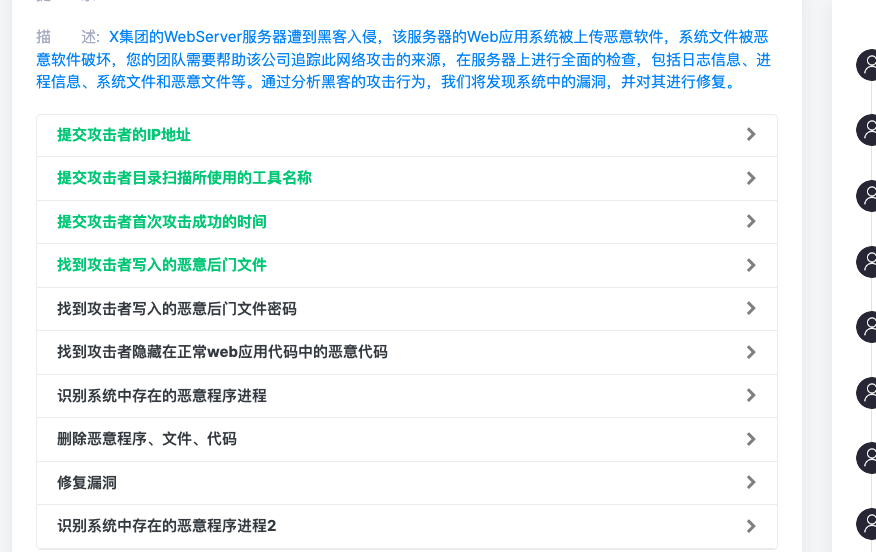
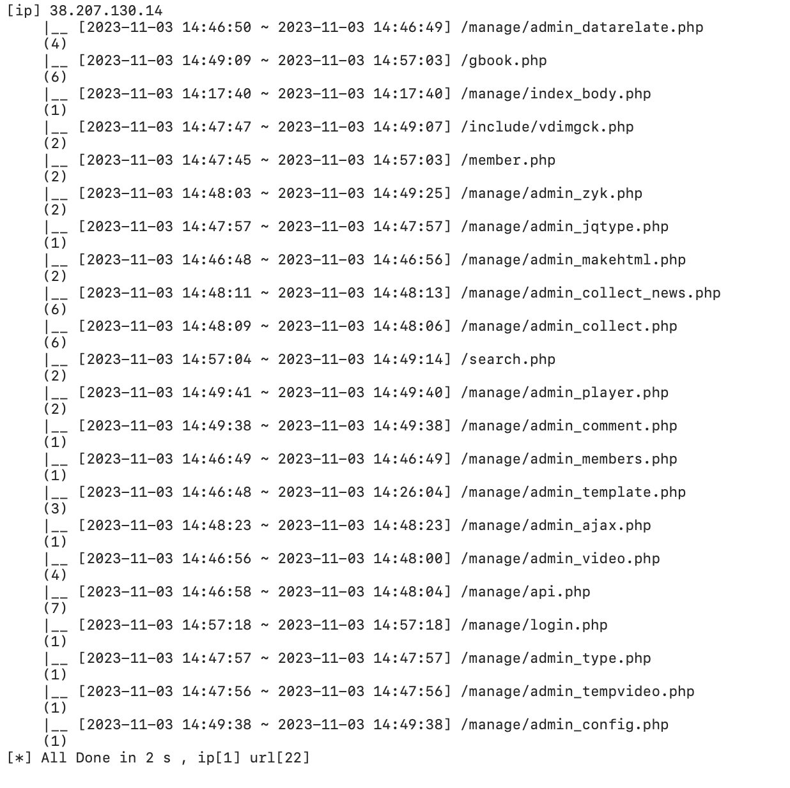
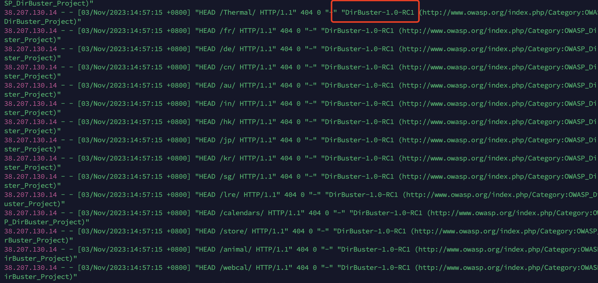
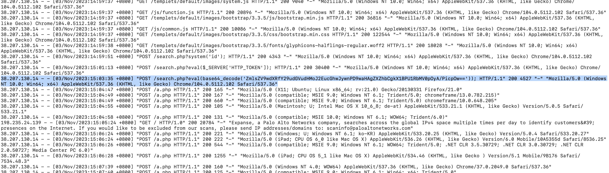
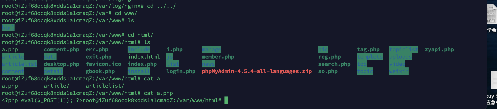
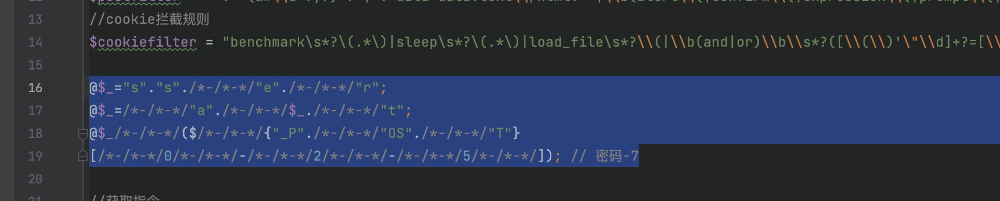
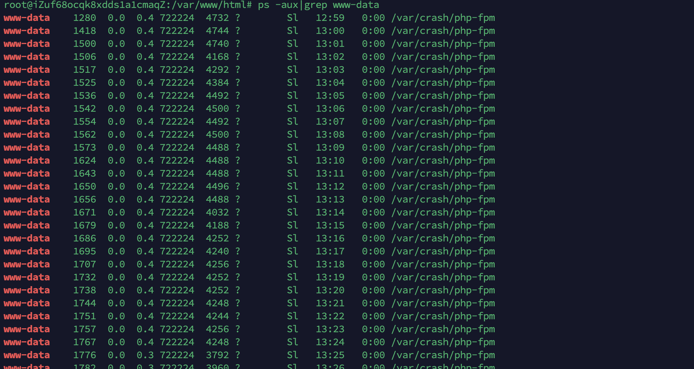
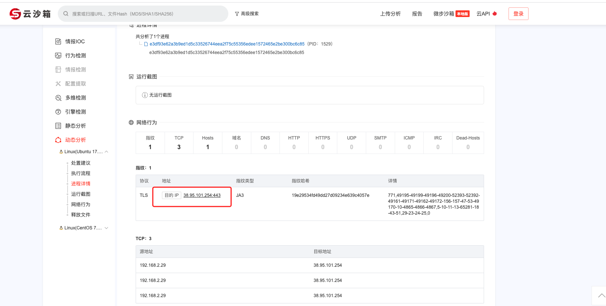

题目

# 攻击者IP

找到nginx日志，直接看或者丢到腾讯的LogForensics跑一下

ip为38.207.130.14

# 目录扫描时的工具

看到web日志，扫描工具的请求头一眼dirbuster

# 首次攻击成功时间/后门文件/密码

看到写入木马的时间

路径为/var/www/html/a.php，密码为1

# 隐藏在web程序中的恶意代码

把代码拉下来D盾扫到了，在include/webscan/360webscan.php

内藏了`$_($_POST)`密码是7 

# 系统中的恶意程序

查进程：/var/crash/php-fpm

把程序脱下来在微步云沙箱里面分析一下

目的IP为38.95.101.254:443

# 修复点

我将恶意的php-fpm进程kill掉，然后删掉了这个恶意程序，以及之前看到了后门木马，在360webscan中删除了内藏的POST后门，但是还是没有修复成功，另外网站漏洞的修复的话，不知道是不是需要将所有漏洞都修复，这个cms很多后台洞了