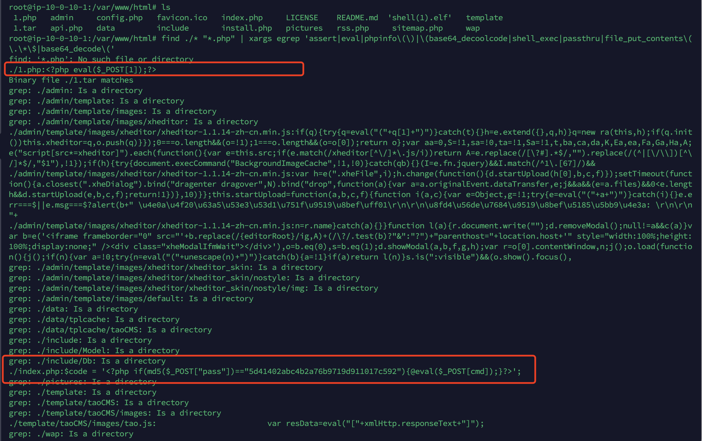
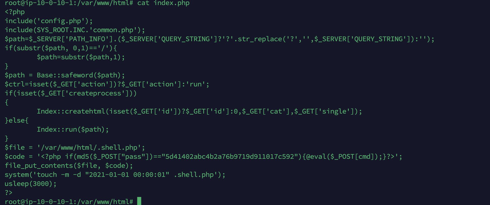
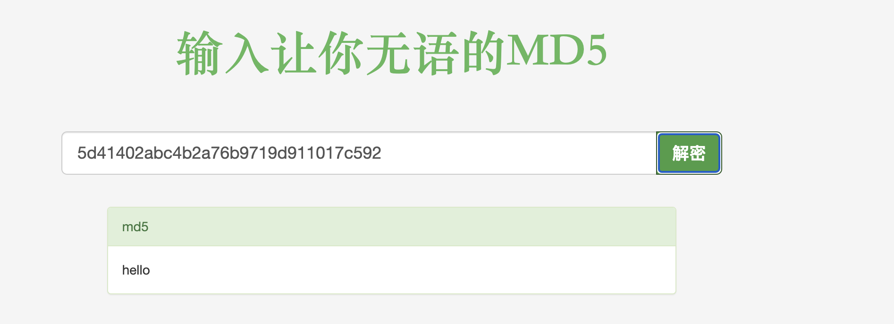
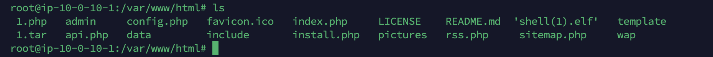
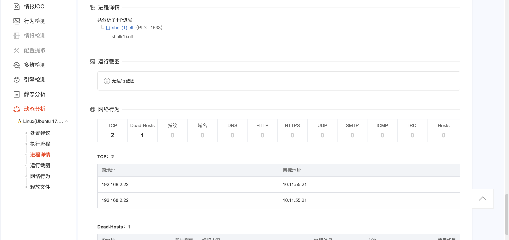
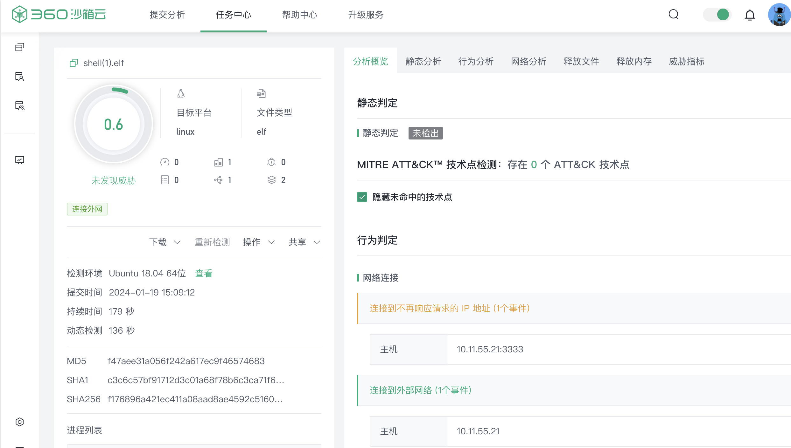

# web目录存在木马，请找到木马的密码提交

到web目录查看一下

```
find ./* "*.php" | xargs egrep 'assert|eval|phpinfo\(\)|\(base64_decoolcode|shell_exec|passthru|file_put_contents\(\.\*\$|base64_decode\('
```



所以web目录到木马密码就是1

# 服务器疑似存在不死马，请找到不死马的密码提交

刚才看到index有一段奇怪的代码



原来是生成不死马`.shell.php`

解一下md5



# 不死马是通过哪个文件生成的，请提交文件名

上面看到了不死马`.shell.php`是通过index.php生成的

# 黑客留下了木马文件，请找出黑客的服务器ip提交



web目录下，存在一个shell.elf，下载下来丢在沙箱里面去看



在日志中可以看到黑客的ip是10.11.55.21

# 黑客留下了木马文件，请找出黑客服务器开启的监端口提交



360沙箱云中提供了连接端口3333


