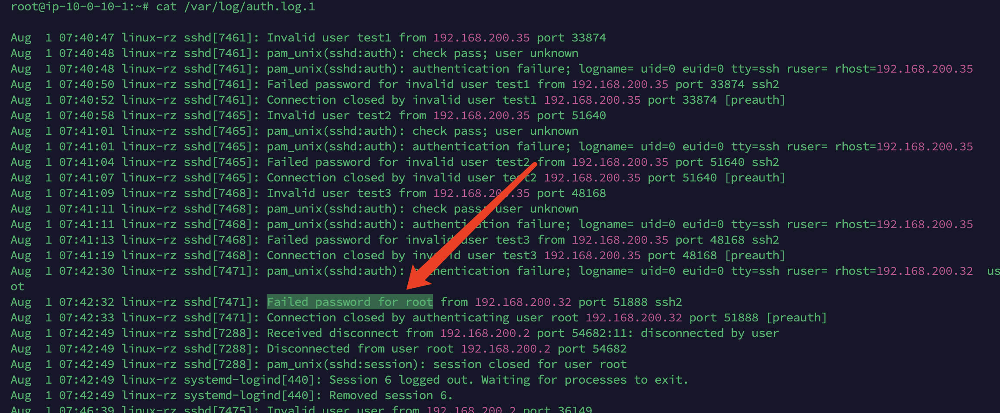
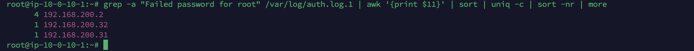
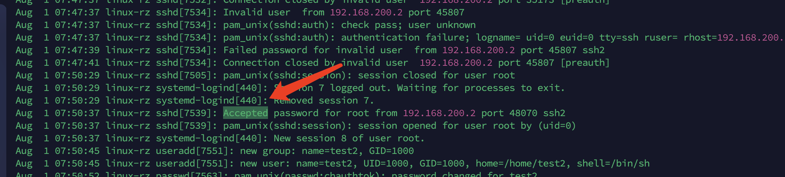
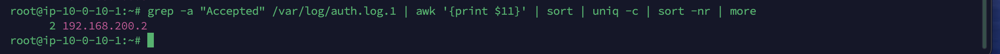
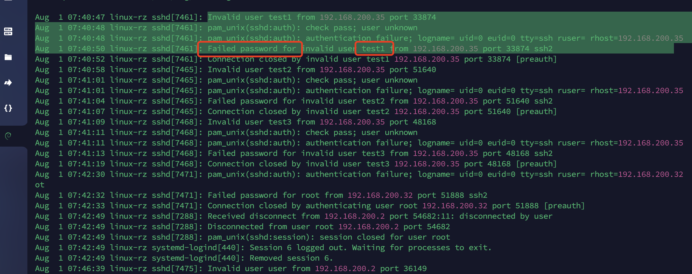
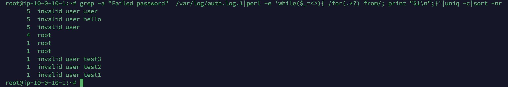
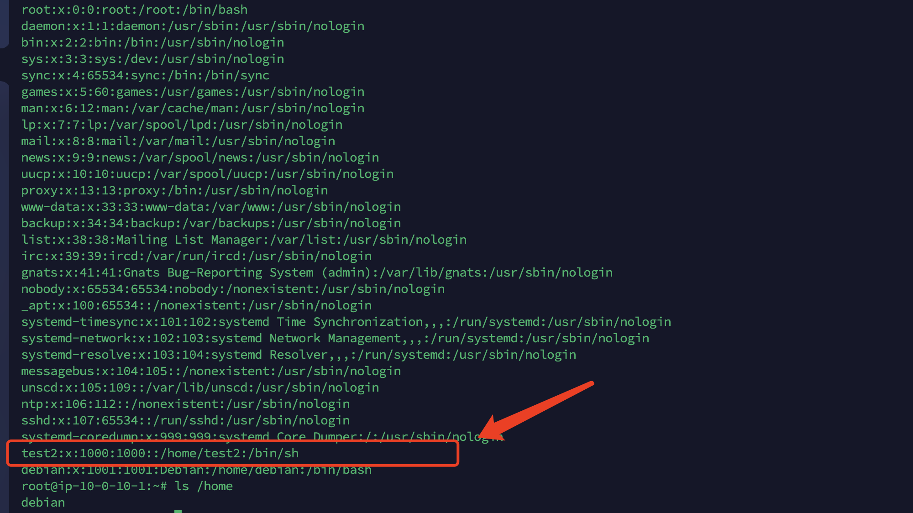
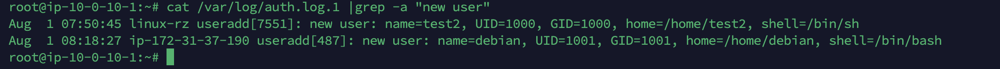

# 有多少IP在爆破主机ssh的root帐号，如果有多个使用","分割

linux登陆日志在/var/log/auth.log



这种failed password for root就是登陆失败的

```
grep -a "Failed password for root" /var/log/auth.log | awk '{print $11}' | sort | uniq -c | sort -nr | more
```

1. `grep -a "Failed password for root" /var/log/auth.log`:
   - 使用 `grep` 命令搜索 `/var/log/auth.log` 文件中包含字符串 "Failed password for root" 的行。
   - `-a` 选项表示以二进制模式搜索，适用于包含非文本内容的文件。
2. `awk '{print $11}'`:
   - 使用 `awk` 提取每一行中的第11个字段（以空格为分隔符）。在这里，它可能提取了包含 IP 地址或用户名的信息。
3. `sort`:
   - 对提取的字段进行排序。
4. `uniq -c`:
   - 使用 `uniq` 统计每个唯一的字段出现的次数，并在前面显示出现次数。
5. `sort -nr`:
   - 对统计结果进行逆序排序，以便最常见的条目在顶部。
6. `more`:
   - 使用 `more` 命令逐页显示结果。这对于大量数据的情况下查看结果是有用的。



统计后发现192.168.200.2一共有4次，一个有三个ip没用登陆上root

最后`flag{192.168.200.2,192.168.200.32,192.168.200.31}`

# ssh爆破成功登陆的IP是多少，如果有多个使用","分割

和上一个内容一样，只是登陆成功的内容不同，匹配的内容不同

```
grep -a "Accepted" /var/log/auth.log.1 | awk '{print $11}' | sort | uniq -c | sort -nr | more
```





`flag{192.168.200.2}`

# 爆破用户名字典是什么？如果有多个使用","分割



登陆的日志可以看到尝试的用户名

```
grep -a "Failed password"  /var/log/auth.log.1|perl -e 'while($_=<>){ /for(.*?) from/; print "$1\n";}'|uniq -c|sort -nr
```

1. `grep -a "Failed password" /var/log/auth.log.1`:
   - 使用 `grep` 命令搜索 `/var/log/auth.log.1` 文件中包含字符串 "Failed password" 的行。
   - `-a` 选项表示以二进制模式搜索，适用于包含非文本内容的文件。
2. `perl -e 'while($_=<>){ /for(.*?) from/; print "$1\n";}'`:
   - 使用 Perl 脚本，该脚本从每一行中提取 "for(.*?) from" 的内容，其中 `.*?` 表示非贪婪匹配。
   - 打印提取的内容，这可能是 IP 地址或用户名。
3. `uniq -c`:
   - 使用 `uniq` 统计每个唯一的字段出现的次数，并在前面显示出现次数。
4. `sort -nr`:
   - 对统计结果进行逆序排序，以便最常见的条目在顶部。



所以得到最后的字典

`flag{user,hello,root,test3,test2,test1}`

# 登陆成功的IP共爆破了多少次

上面看到了192.168.200.2是登陆失败了4次，然后就是登陆成功了，所以`flag{4}`

# 黑客登陆主机后新建了一个后门用户，用户名是多少

看/etc/passwd发现可疑用户



仍然可以在auth.log中验证

```
cat /var/log/auth.log.1 |grep -a "new user"
```



发现是test2用户名