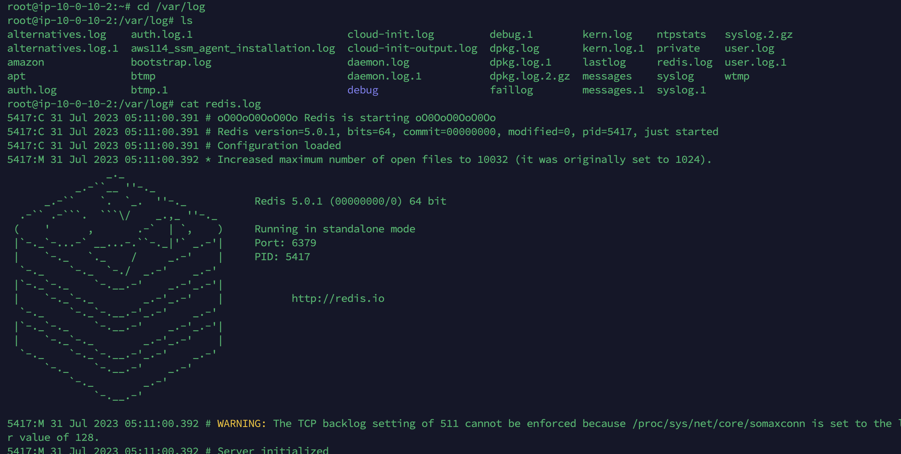
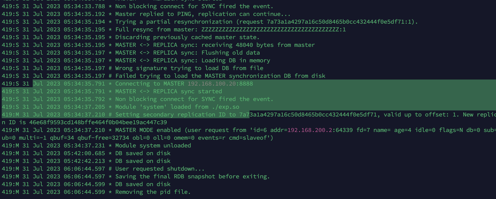
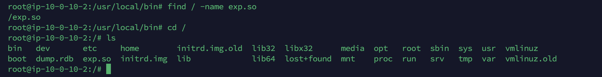
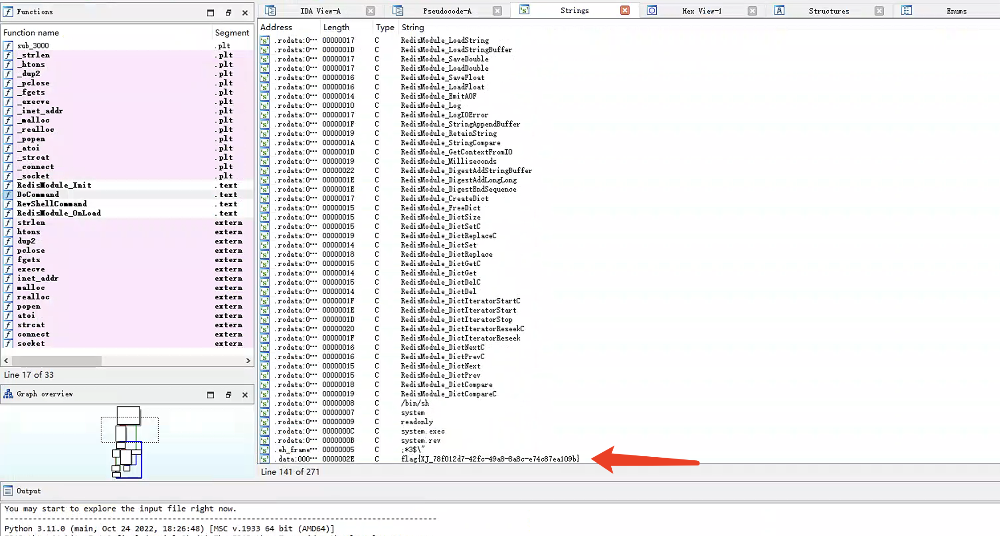
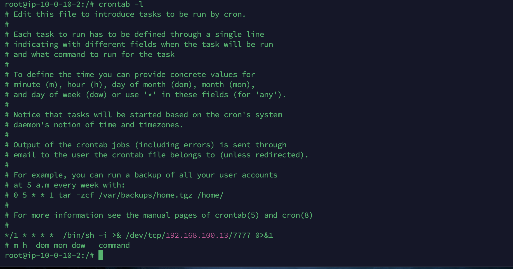
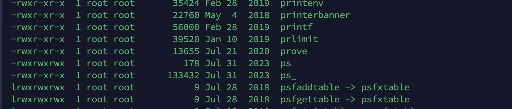
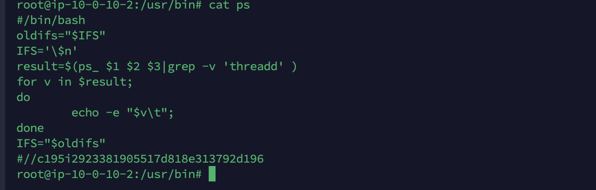

# 分析黑客攻击成功的 IP 为多少

redis的应急响应，先来看redis的日志，/var/log/redis.log

看到了192.168.100.20在加载exp.so

# 黑客第一次上传的恶意文件,将黑客上传的恶意文件里面的 FLAG 

找到exp.so，丢ida里面看看

查找字符串找到了flag

# 分析黑客反弹 shell 的IP 为多少

在crontab中看到了反弹shell的ip

# 并且溯源分析黑客的用户名，并且找到黑客使用的工具里的关键字符串(flag{黑客的用户-关键字符串} 注关键字符串 xxx-xxx-xxx)。将用户名和关键字符串作为 FLAG提交

这一个问不知道怎么找，wp找到了redis-rogue-getshell这个工具，但是并不知道依据是什么，另外在这个工具的python文件中拿到了注释，不知道是不是挨个比对打redis主从复制的工具找到了，或者是分析exp.so的特征，感觉exp.so里面也可以找到回连的IP

# 分析黑客篡改的命令,将黑客篡改的命令里面的关键字符串作为 FLAG 提交;

在/usr/bin中发现了两个ps

找到了关键的字符串

