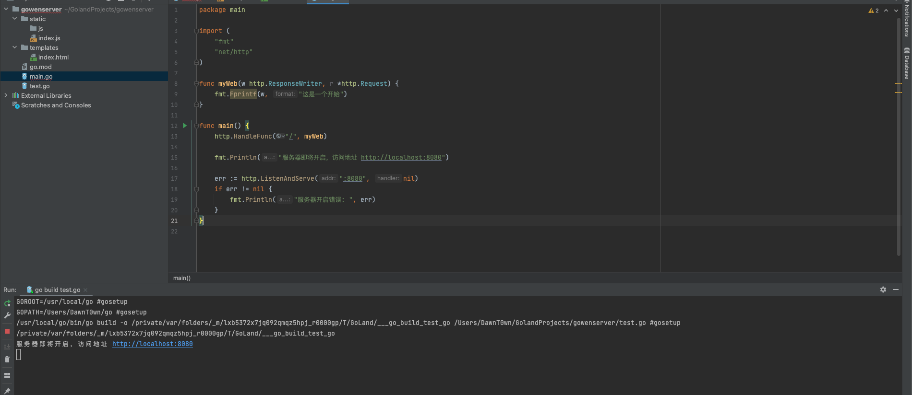
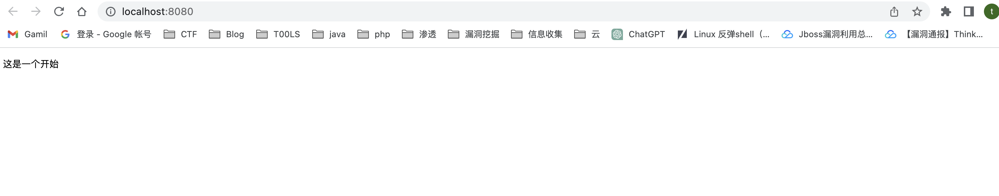
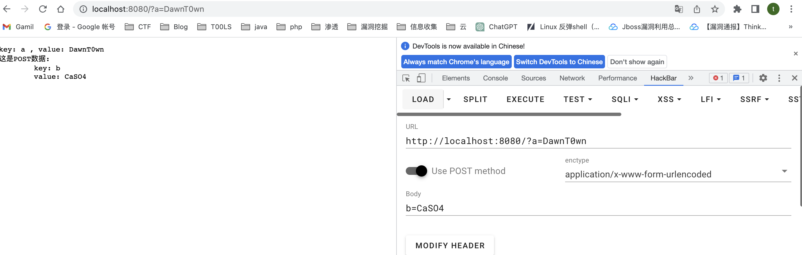
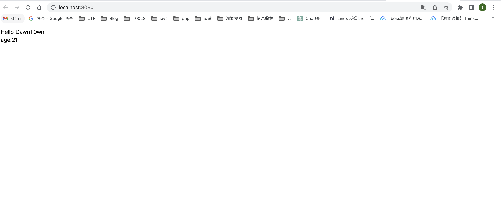
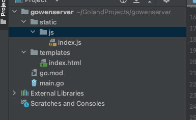
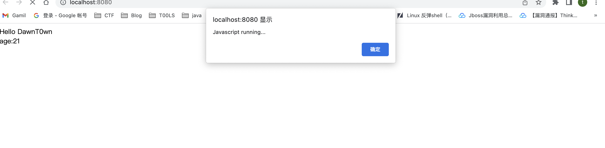
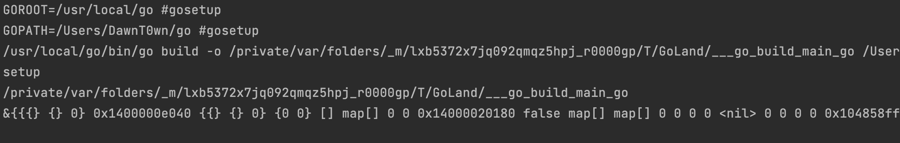
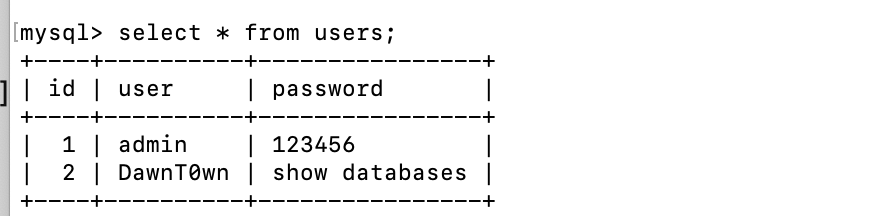
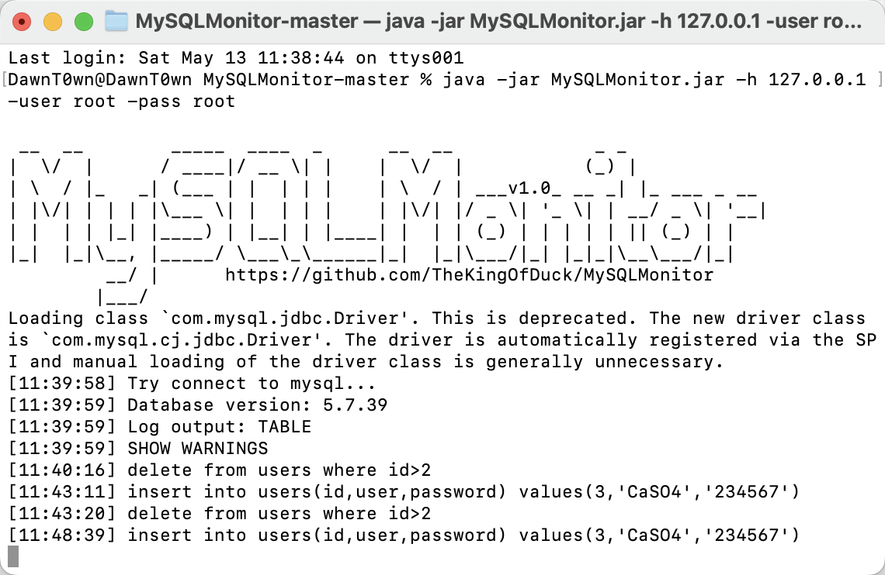
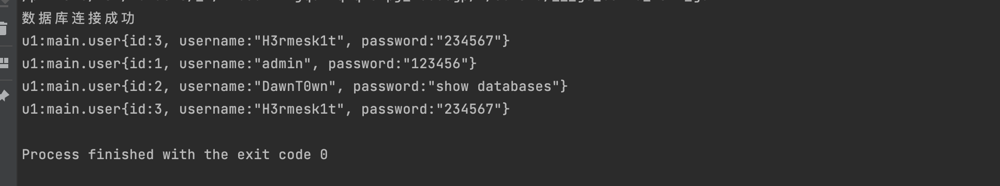

# 第一个Go web程序

```
package main

import (
   "fmt"
   "net/http"
)

func myWeb(w http.ResponseWriter, r *http.Request) {
   fmt.Fprintf(w, "这是一个开始")
}

func main() {
   http.HandleFunc("/", myWeb)

   fmt.Println("服务器即将开启，访问地址 http://localhost:8080")

   err := http.ListenAndServe(":8080", nil)
   if err != nil {
      fmt.Println("服务器开启错误: ", err)
   }
}
```

这里我们用到的是一个新的包（net/http）

## main函数

我们将`/`路由绑定到myWeb这个函数，当访问根路由的时候，相当于调用了myWeb这个函数

fmt.Println是在控制台打印，为了方便

接下来就是开启服务，我们需要监听一个端口，将我们的web服务起在这个端口上

这里调用了`http`包中的`ListenAndServe`函数，该函数有两个参数，第一个是指定监听的端口号，第二个是指定处理请求的handler，通常这个参数填nil，表示使用默认的ServeMux作为handler。

最后这里是为了做错误处理，这里和java是有一定区别的，在go中我们看不到try/catch这种处理异常的方式

```
if err != nil {
   fmt.Println("服务器开启错误: ", err)
}
```

Go语言中规定，如果函数可能出现错误，应该返回一个error对象，这个对象至少包含一个Error()方法错误信息。

因此，在Go中，是看不到try/catch语句的，函数使用error传递错误，用if语句判断错误对象并且处理错误。

## myWeb函数体

在main函数中，我们已经将路由和myWeb函数绑定，这个函数定义了两个参数w和r，参数类型分别是`http.ResponseWriter`和`*http.Request`，`w`是响应流写入器，`r`是请求对象的指针

有点像HttpServletResponse和Request对象，但是这里不是对象，一个是响应流，一个是指针

```go
fmt.Fprintf(w, "这是一个开始")
//也可以用fmt.Println，它能打印的类型更多，而且自带换行
```

使用fmt的`Fprintf`函数将字符串“这是一个开始”,写入到`w`响应流写入器对象。`w`响应流写入器里写入的内容最后会被Response输出到用户浏览器的页面上。对比java来看，就对应servletResponse.getWriter().println("xxx");





# 参数解析

其他的不变，我们来修改myWeb函数来获取参数

```
func myWeb(w http.ResponseWriter, r *http.Request) {
	//它还将请求主体解析为表单，获得POST Form表单数据，必须先调用这个函数
	r.ParseForm()

	// GET
	for k, v := range r.URL.Query() {
		fmt.Fprintln(w, "key:", k, ", value:", v[0])
	}

	// POST
	for k, v := range r.PostForm {
		fmt.Fprintln(w, "这是POST数据:")
		fmt.Fprintln(w, "	key:", k)
		fmt.Fprintln(w, "	value:", v[0])
	}

}
```




首先，调用`r.ParseForm()`，作用是填充数据到 `r.Form` 和 `r.PostForm`

接下来，分别循环获取遍历打印出 `r.URL.Query()` 函数返回的值 和 `r.PostForm` 值里的每一个参数。

`r.URL.Query()` 和 `r.PostForm` 分别是URL参数对象和表单参数对象，它们都是键值对值，键的类型是字符串`string`，值的类型是`string`数组。

> 在http协议中，无论URL和表单，相同名称的参数会组成数组。

**循环遍历：for...range**

Go语言的循环只有`for`关键字，以下是Go中4种`for`循环

```go
//无限循环，阻塞线程，用不停息，慎用！
for{

}

//条件循环，如果a<b，循环，否则，退出循环
for a < b{

}

//表达式循环，设i为0，i小于10时循环，每轮循环后i增加1
for i:=0; i<10; i++{

}

//for...range 遍历objs，objs必须是map、slice、chan类型
for k, v := range objs{

}
```

前3种，循环你可以看作条件循环的变体（无限循环就是无条件的循环）。

本例种用到的是 `for...range` 循环，遍历可遍历对象，并且每轮循环都会将键和值分别赋值给变量 `k` 和 `v`

# Map

在java中，我们经常见到map对象，基本上用到的是HashMap，Go中也有Map，也是用来存储键值对的

`map`的初始化可以使用`make`：

```go
var data = make(map[string]string)
data = map[string]string{}
```

> make是内置函数，只能用来初始化 map、slice 和 chan，并且make函数和另一个内置函数new不同点在于，它返回的并不是指针，而只是一个类型。

map赋值于其他语言的字典对象相同，取值有两种方式，请看下面的代码：

```go
data["name"]="zeta" //赋值

name := data["name"] //方式1.普通取值

name,ok := data["name"] //方式2.如果不存在name键，ok为false
```

> 代码中的变量ok，可以用来判断这一项是否设置过，取值时如果项不存在，是不会异常的，取出来的值为该类型的零值，比如 int类型的值，不存在的项就为0；string类型的值不存在就为空字符串，所以通过值是否为0值是不能判断该项是否设置过的。
> ok，会获得true 或者 false，判断该项是否设置过，true为存在，false为不存在于map中。

Go中的map还有几个特点需要了解：

1. `map`的项的顺序是不固定的，每次遍历排列的顺序都是不同的，所以不能用顺序判断内容
2. `map`可以用`for...range` 遍历
3. `map`在函数参数中是引用传递（Go语言中，只有map、slice、chan是引用传递，其他都是值传递）

# HTML模板解析

基本上所有web框架都是读取模板文件，用值替换里面的标签，GO也不例外

用到的是`"text/templates"`包

我们先来创建一个模板目录templates，放一个html文件

```
<html>
<head></head>
<body>
<div>Hello {{.name}}</div>
<div>{{.age}}</div>
</body>
</html>
```

重新来编写myWeb函数

```
func myWeb(w http.ResponseWriter, r *http.Request) {

   t, _ := template.ParseFiles("./templates/index.html")

   data := map[string]string{
      "name": "DawnT0wn",
      "age":  "21",
   }

   t.Execute(w, data)
}
```



感觉和python的模板渲染很像，可以渲染一个文件，通过Execute将map对象渲染进html中，而且Execute函数还代替了fmt.Fprintln，结果输出到Response数据流写入器中

## 赋值给 _

Go有一个特点，变量定义后如果没使用，会报错，无法编译。一般情况下没什么问题，但是极少情况下，我们调用函数，但是并不需要使用返回值，但是不使用，又无法编译，怎么办？

"`_`" 就是用来解决这个问题的，`_`用来丢弃函数的返回值。比如本例中，`template.ParseFiles("./templates/index.html")` 除了返回模版对象外，还会返回一个`error`对象，但是这样简单的例子，出错的可能性极小，所以我不想处理`error`了，将`error`返回值用“`_`”丢弃掉。

> 注意注意注意：在实际项目中，请不要丢弃error，任何意外都是可能出现的，丢弃error会导致当出现罕见的意外情况时，非常难于Debug。所有的error都应该要处理，至少写入到日志或打印到控制台。（切记，不要丢弃 error ，很多Gopher们在这个问题上有大把的血泪史）


## 直接渲染代码

Go中也可以直接渲染代码，但是这种写法并不是很规范，只做个了解

```go
func myWeb(w http.ResponseWriter, r *http.Request) {

    t := template.New("index")

    t.Parse("<div id='templateTextDiv'>Hi,{{.name}},<br>age{{.age}}</div>")

    data := map[string]string{
        "name":    "DawnT0wn",
        "age": "21",
    }

    t.Execute(w, data)

    // fmt.Fprintln(w, "这是一个开始")
}
```

# 静态文件处理

对于一个web程序，前端只有html显然是不够的，还需要js和css等，一般的项目都有一个static静态目录存储这些文件，在Go中仍然可以绑定路由，用处理器来解析这些文件

我们先创建一个`./static/js`目录，放一个index.js

```
alert("Javascript running...");
```

再修改index.html，引入我们的js，如果解析到的话会有一个弹框

```
<html>
<head></head>
<body>
<div>Hello {{.name}}</div>
<div>age:{{.age}}</div>
</body>
<script src="/js/index.js"></script>
</html>
```

这次需要修改我们的main函数

```
func main() {
   http.HandleFunc("/", myWeb)

   http.Handle("/js/", http.FileServer(http.Dir("./static")))

   fmt.Println("服务器即将开启，访问地址 http://localhost:8080")

   err := http.ListenAndServe(":8080", nil)
   if err != nil {
      fmt.Println("服务器开启错误", err)
   }
}
```



文件结构



## 解读

程序检查到第一层路由匹配`/js/`，于是用文件服务处理这次请求，匹配到程序运行的路径下相对路径`./static/js`

也就是将js理由绑定到./static/js中

当然，这种方式就需要我们有一个静态目录，然后对应其子目录

```
http.Handle("/js/", http.FileServer(http.Dir("./static"))) 对应到 ./static/js

http.Handle("/css/", http.FileServer(http.Dir("./static"))) 对应到 ./static/css

http.Handle("/img/", http.FileServer(http.Dir("./static"))) 对应到 ./static/img

http.Handle("/upload/", http.FileServer(http.Dir("./static"))) 对应到 ./static/upload
```

假如我的js目录在根目录又怎么办，可以用到http.StripPrefix，这个函数用来剥开前缀

```
http.StripPrefix("/js/", http.FileServer(http.Dir("./static")))
```

比如正常的话/js路由应该是对应的是`./static/js`剥开前缀的话，就是直接访问static目录下的文件

```
http.Handle("/js/", http.StripPrefix("/js/", http.FileServer(http.Dir("./js")))) 对应到 ./js

http.Handle("/css/", http.StripPrefix("/css/", http.FileServer(http.Dir("./css")))) 对应到 ./css

http.Handle("/img/", http.StripPrefix("/img/", http.FileServer(http.Dir("./img")))) 对应到 ./img

http.Handle("/upload/", http.StripPrefix("/upload/", http.FileServer(http.Dir("./upload")))) 对应到 ./upload
```

这样就不用在多一层子目录

# 操作数据库

对于任何一个web程序，与数据库的交互都必不可少，都会有一个和数据库交互的方式，java中的JDBC，以及mybatis和hibernate等框架，在Go中，我们用到database/sql这个库

我们操作的是mysql数据库，所以还得安装一个驱动github.com/go-sql-driver/mysql

`_"http://github.com/go-sql-driver/mysql"`这行不能省略，这是MySQL的驱动包，重点是加个下划线 _ ，用来初始化驱动。

## 数据库驱动连接

```
package main

import (
	"database/sql"
	"fmt"
	_ "github.com/go-sql-driver/mysql"
	"log"
)

// 数据库指针
var db *sql.DB

func init() {
	database, err := sql.Open("mysql", "root:root@tcp(127.0.0.1:3306)/test?parseTime=true")

	if err != nil {
		log.Fatal("open mysql failed", err)
	}
	db = database
}
func main() {
	fmt.Println(db)
}
```



init方法系统会在main函数前执行

## 增(insert)

数据库结构




```
package main

import (
   "database/sql"
   "fmt"
   _ "github.com/go-sql-driver/mysql"
   "log"
)

// 数据库指针
var db *sql.DB

func init() {
   database, err := sql.Open("mysql", "root:root@tcp(127.0.0.1:3306)/test?parseTime=true")

   if err != nil {
      log.Fatal("open mysql failed", err)
   }
   db = database
}

func main() {
   sql := "insert into users(id,user,password) values(?,?,?); "

   r, err := db.Exec(sql, 3, "CaSO4", "234567")
   if err != nil {
      fmt.Println("Exec failed", err)
      return
   }
   id, _ := r.LastInsertId()
   fmt.Println(id)
}
```



可以看到已经执行了

## 删

```
package main

import (
   "database/sql"
   "fmt"
   _ "github.com/go-sql-driver/mysql"
   "log"
)

// 数据库指针
var db *sql.DB

func init() {
   database, err := sql.Open("mysql", "root:root@tcp(127.0.0.1:3306)/test?parseTime=true")

   if err != nil {
      log.Fatal("open mysql failed", err)
   }
   fmt.Println("数据库连接成功")
   db = database
}

func delete(id int) {
   sql := "delete from users where id = ?; "

   res, err := db.Exec(sql, id)

   if err != nil {
      fmt.Println("delete failed", err)
   }
   n, _ := res.RowsAffected()
   fmt.Println(n)
}
func main() {
   delete(3)
}
```

可以通过RowsAffected来看到影响的行数

## 改

仍然用到的是db.Exec方法

```
package main

import (
   "database/sql"
   "fmt"
   _ "github.com/go-sql-driver/mysql"
   "log"
)

// 数据库指针
var db *sql.DB

func init() {
   database, err := sql.Open("mysql", "root:root@tcp(127.0.0.1:3306)/test?parseTime=true")

   if err != nil {
      log.Fatal("open mysql failed", err)
   }
   fmt.Println("数据库连接成功")
   db = database
}

func update(id int, username string) {
   sql := "update users set user=? where id = ?;"

   res, err := db.Exec(sql, username, id)

   if err != nil {
      fmt.Println("delete failed", err)
   }
   n, _ := res.RowsAffected()
   fmt.Println(n)
}
func main() {
   update(3, "H3rmesk1t")
}
```

## 查

对于select语句的话，需要返回数据，存在专门的两个方法，Query和QueryRow

Query可以查询多行数据，而QueryRow只查询特定的一行

因为select是需要返回数据的，我们可以用一个结构体来存放取出来的数据，通过result.Scan赋值给结构体参数（取地址）

```
package main

import (
	"database/sql"
	"fmt"
	_ "github.com/go-sql-driver/mysql" //导入包但不使用，init()
	"log"
)

type user struct {
	id       int
	username string
	password string
}

var db *sql.DB //连接池对象
func init() {
	database, err := sql.Open("mysql", "root:root@tcp(127.0.0.1:3306)/test?parseTime=true")

	if err != nil {
		log.Fatal("open mysql failed", err)
	}
	fmt.Println("数据库连接成功")
	db = database
}
func query(id int) {
	//1.查询单挑记录的sql语句  ?是参数
	sqlStr := "select id,user,password from users where id=?;"
	//2.执行
	rowObj := db.QueryRow(sqlStr, id) //从连接池里取一个连接出来去数据库查询单挑记录
	//3.拿到结果
	var u1 user
	rowObj.Scan(&u1.id, &u1.username, &u1.password)
	//打印结果
	fmt.Printf("u1:%#v\n", u1)
}

func queryMore(n int) {
	//1.sql语句
	sqlStr := "select id,user,password from users where id >?;"
	//2.执行
	rows, err := db.Query(sqlStr, n)
	if err != nil {
		fmt.Printf("%s query failed,err:%v\n", sqlStr, err)
		return
	}
	//3一定要关闭rows
	defer rows.Close()
	//4.循环取值
	for rows.Next() {
		var u1 user
		rows.Scan(&u1.id, &u1.username, &u1.password)
		fmt.Printf("u1:%#v\n", u1)
	}
}

// Go连接Mysql示例
func main() {

	//查询单行
	query(3)
	//查询多行
	queryMore(0)
}

```



# sql语句预编译

前面虽然采用了占位符的方式，但是还是没有预编译，要预编译的话我们得调用一个db.prepare方法

就用insert来举例吧

```
package main

import (
   "database/sql"
   "fmt"
   _ "github.com/go-sql-driver/mysql"
   "log"
)

// 数据库指针
var db *sql.DB

func init() {
   database, err := sql.Open("mysql", "root:root@tcp(127.0.0.1:3306)/test?parseTime=true")

   if err != nil {
      log.Fatal("open mysql failed", err)
   }
   db = database
}

func main() {
   sql := "insert into users(id,user,password) values(?,?,?); "

   stmt, err := db.Prepare(sql)

   if err != nil {
      log.Fatal("prepare failed", err)
   }

   r, err := stmt.Exec(4, "CaSO4", "234567")
   if err != nil {
      fmt.Println("Exec failed", err)
      return
   }
   id, _ := r.LastInsertId()
   fmt.Println(id)
}
```


可以看到的执行前已经预编译了

其实通过mysql的日志我发现，直接通过占位符执行的时候好像也可以预编译


# 编译

每次运行`go run`都会重新编译源码，如何将程序运行在没有Go环境的计算机上？

使用 `go build` 命令，它会编译源码，生成可执行的二进制文件。

最简单的 `go build` 命令什么参数都不用加，它会自动查找目录下的main包下的main()函数，然后依次查找依赖包编译成一个可执行文件。

其他依赖文件的相对路径需要和编译成功后的可执行文件一致，例如范例中的templates文件夹和static文件夹。

默认情况下，`go build`会编译为和开发操作系统对应的可执行文件，如果要编译其他操作系统的可执行文件，需要用到交叉编译。

例如编译成macos可执行文件

```
GOOS=darwin GOARCH=arm64 go build
```


参考链接：

[从0开始Go语言-用Golang搭建网站（无依赖） - 知乎 (zhihu.com)](https://zhuanlan.zhihu.com/p/65469850#:~:text=从0开始Go语言-用Golang搭建网站（无依赖） 1 1.下载Go语言安装文件 访问Go语言官方网站下载页面%3A https%3A%2F%2Fgolang.org%2Fdl ... 2 2.和其他软件一样，根据提示安装,... 8 3.打开命令行终端，输入以下命令 %24 go run main.go )

https://blog.csdn.net/weixin_41605937/article/details/122298656

https://zhuanlan.zhihu.com/p/159266823