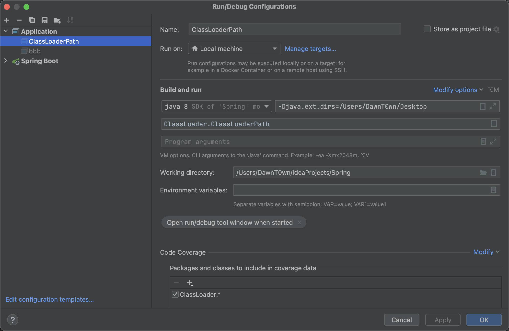

# ClassLoader(类加载机制)

​    Java程序在运行前需要先编译成`class文件`，Java类初始化的时候会调用`java.lang.ClassLoader`加载类字节码，`ClassLoader`会调用JVM的native方法（`defineClass0/1/2`）来定义一个`java.lang.Class`实例

​    类加载器（class loader）用来加载 Java 类到 Java 虚拟机中。一般来说，Java 虚拟机使用 Java 类的方式如下：Java 源程序（.java 文件）在经过 Java 编译器编译之后就被转换成 Java 字节代码（.class 文件）。类加载器负责读取 Java 字节代码，并转换成 java.lang.Class类的一个实例。每个这样的实例用来表示一个 Java 类。通过此实例的 newInstance()方法就可以创建出该类的一个对象。实际的情况可能更加复杂，比如 Java 字节代码可能是通过工具动态生成的，也可能是通过网络下载的。

​    其实可以一句话来解释：类的加载指的是将类的.class文件中的二进制数据读入到内存中，将其放在运行时数据区的方法区内，然后在堆区创建一个 java.lang.Class对象，用来封装类在方法区内的数据结构。

# 类加载的开放性

在类加载的时候，我们需要用类的全限定名（就是类的全名）来获取定义此类的二进制字节流，完成这个动作的就是类加载器

这一动作是放在Java虚拟机外部去实现的，以便让应用程序自己决定如何获取所需的类。

虚拟机规范并没有指明二进制字节流要从一个Class文件获取，或者说根本没有指明从哪里获取、怎样获取。这种开放使得Java在很多领域得到充分运用，例如：

- 从本地磁盘中获取class文件
- 从ZIP包中读取，这很常见，成为JAR，EAR，WAR格式的基础
- 从网络中获取，最典型的应用就是Applet
- 从数据库中获取class文件
- 运行时计算生成，最典型的是动态代理技术，在java.lang.reflect.Proxy中，就是用了ProxyGenerator.generateProxyClass来为特定接口生成形式为“*$Proxy”的代理类的二进制字节流
- 有其他文件生成，最典型的JSP应用，由JSP文件生成对应的Class类 ……

# 类加载过程

类从被加载到虚拟机内存中开始，到卸载出内存为止，它的整个生命周期包括：加载、验证、准备、解析、初始化、使用和卸载七个阶段。它们的顺序如下图所示


类加载的过程就是前五步，加载，验证，准备，解析，初始化

在这五个阶段中，加载、验证、准备和初始化这四个阶段发生的顺序是确定的，而解析阶段则不一定，它在某些情况下可以在初始化阶段之后开始

虽然发生顺序是确定的，但是结束的顺序却是不一定的，这些阶段通常都是互相交叉地混合进行的，通常在一个阶段执行的过程中调用或激活另一个阶段

## 加载阶段

”加载“是”类加机制”的第一个过程，在加载阶段，虚拟机主要完成三件事：

（1）通过一个类的全限定名来获取其定义的二进制字节流

（2）将这个字节流所代表的的静态存储结构转化为方法区的运行时数据结构

（3）在堆中生成一个代表这个类的Class对象，作为方法区中这些数据的访问入口。

相对于类加载的其他阶段而言，加载阶段是可控性最强的阶段，因为程序员可以使用系统的类加载器加载，还可以使用自己的类加载器加载，类加载器再后面会提到

## 验证阶段

验证本如其名，主要是对加载的class文件进行一个验证，保证class文件不会对JAVA虚拟机有危害

主要是完成四个阶段的验证：

（1）文件格式的验证：验证.class文件字节流是否符合class文件的格式的规范，并且能够被当前版本的虚拟机处理。这里面主要对魔数、主版本号、常量池等等的校验（魔数、主版本号都是.class文件里面包含的数据信息、在这里可以不用理解）。

（2）元数据验证：主要是对字节码描述的信息进行语义分析，以保证其描述的信息符合java语言规范的要求，比如说验证这个类是不是有父类，类中的字段方法是不是和父类冲突等等。

（3）字节码验证：这是整个验证过程最复杂的阶段，主要是通过数据流和控制流分析，确定程序语义是合法的、符合逻辑的。在元数据验证阶段对数据类型做出验证后，这个阶段主要对类的方法做出分析，保证类的方法在运行时不会做出威海虚拟机安全的事。

（4）符号引用验证：它是验证的最后一个阶段，发生在虚拟机将符号引用转化为直接引用的时候。主要是对类自身以外的信息进行校验。目的是确保解析动作能够完成。

对整个类加载机制而言，验证阶段是一个很重要但是非必需的阶段，如果我们的代码能够确保没有问题，那么我们就没有必要去验证，毕竟验证需要花费一定的的时间。当然我们可以使用-Xverfity:none来关闭大部分的验证


## 准备阶段

这一阶段为类变量（static静态变量）分配内存并设置初始值（注意是初始值，不是赋值）

（1）类变量（static）会分配内存，但是实例变量不会，实例变量主要随着对象的实例化一块分配到java堆中，

（2）这里的初始值指的是数据类型默认值，而不是代码中被显示赋予的值。比如public static int value = 1; //在这里准备阶段过后的value值为0，而不是1。赋值为1的动作在初始化阶段


注意，在上面value是被static所修饰的准备阶段之后是0，但是如果同时被final和static修饰准备阶段之后就是1了。

我们可以理解为static final在[编译器](https://so.csdn.net/so/search?q=编译器&spm=1001.2101.3001.7020)就将结果放入调用它的类的常量池中了

## 解析阶段

解析阶段主要是虚拟机将常量池中的符号引用转化为直接引用的过程。什么是符号应用和直接引用呢？

符号引用：以一组符号来描述所引用的目标，可以是任何形式的字面量，只要是能无歧义的定位到目标就好，就好比在班级中，老师可以用张三来代表你，也可以用你的学号来代表你，但无论任何方式这些都只是一个代号（符号），这个代号指向你（符号引用）

直接引用：直接引用是可以指向目标的指针、相对偏移量或者是一个能直接或间接定位到目标的句柄。和虚拟机实现的内存有关，不同的虚拟机直接引用一般不同。

解析动作主要针对类或接口、字段、类方法、接口方法、方法类型、方法句柄和调用点限定符7类符号引用进行。

## 初始化阶段

类加载的最后一步

什么时候要对类进行初始化工作（加载+链接在此之前已经完成了），jvm有严格的规定（四种情况）：

```
1.遇到new，getstatic，putstatic，invokestatic这4条字节码指令时，加入类还没进行初始化，则马上对其进行初始化工作。其实就是3种情况：用new实例化一个类时、读取或者设置类的静态字段时（不包括被final修饰的静态字段，因为他们已经被塞进常量池了）、以及执行静态方法的时候。

2.使用java.lang.reflect.*的方法对类进行反射调用的时候，如果类还没有进行过初始化，马上对其进行。

3.初始化一个类的时候，如果他的父亲还没有被初始化，则先去初始化其父亲。

4.当jvm启动时，用户指定一个要执行的主类（包含static void main(String[] args)的那个类），则jvm会先去初始化这个类。

以上4种预处理称为对一个类进行主动的引用，其余的其他情况，称为被动引用，都不会触发类的初始化。
```

这一阶段我们可以去执行java代码，去对需要的变量进行赋值

初始化的时候，注意分为对静态变量的初始化和对类的初始化，静态变量则是对其赋予正确的初始值，对类的初始化则由JVM负责，而主要的是对类变量进行初始化

在Java中对类变量进行初始值设定有两种方式：

①声明类变量是指定初始值

②使用静态代码块为类变量指定初始值


JVM初始化步骤：

1、假如这个类还没有被加载和连接，则程序先加载并连接该类

2、假如该类的直接父类还没有被初始化，则先初始化其直接父类

3、假如类中有初始化语句，则系统依次执行这些初始化语句


什么时候去对类进行初始化，上面也写过一些主动引用：

（1）创建类的实例，也就是new的方式

（2）访问某个类或接口的静态变量，或者对该静态变量赋值，调用类的静态方法

（3）反射（如 Class.forName(“com.Test”)）

（4）初始化某个类的子类，则其父类也会被初始化

（5）Java虚拟机启动时被标明为启动类的类（ JavaTest），直接使用 java.exe命令来运行某个主类  

到目前为止就是类加载机制的整个过程，但是还有一个重要的概念，那就是类加载器。

# 类加载器

系统级别的类加载器：

       Bootstrap ClassLoader（启动类加载器）
    
       Extention ClassLoader  （扩展类加载器）
    
       Appclass Loader     （系统类加载器）

  用户级别的类加载器

       自定义类加载器（继承ClassLoader）
## Bootstrap ClassLoader

启动类加载器，加载java的核心类库，也就是我们环境变量下面%JRE_HOME%\lib下的rt.jar、resources.jar、charsets.jar和class等

底层由CPP实现，不是ClassLoader的子类


比如rt.jar（这个包里面就是我们常用的String类等）


可以通过启动jvm时指定-Xbootclasspath（在edit configuration中添加vm options选项来用这个参数）和路径来改变Bootstrap ClassLoader的加载目录。比如java -Xbootclasspath/a:path被指定的文件追加到默认的bootstrap路径中

这里我把一个Common-Collections的包放到桌面上，用-Xbootclasspath/a来指定这个目录将Common-Collections包当作核心类加载

```
public static void BootClassLoaderPath() throws Exception{
    System.out.println(String.class.getClassLoader());  // 启动类加载器加载的，存在于JVM中，所以为null
    System.out.println(InvokerTransformer.class.getClassLoader());

    String bootClassLoaderLoadingPath = System.getProperty("sun.boot.class.path");  // 利用sun.boot.class.path获取Bootstrap ClassLoader目录
    String[] asList = bootClassLoaderLoadingPath.split(":");    // windows下用;，unix下用:
    for (String s : asList) {
        System.out.println("【启动类加载器====加载目录】" + s);
    }
    System.out.println("\n");
}
```


运行后的结果，这里要提一下，因为String类是通过启动类加载器加载的，Bootstrap ClassLoader底层是cpp实现的，所以这里为获取String类的classloader为null，我获取InvokerTransfomer的加载器就是AppClassLoader，这个加载器后面会提到

接下来，我添加vm options


这里可以是指定的目录，也可以是指定的jar包


在结尾输出了我添加的目录或者jar包

另外-Xbootclasspath/a:path是在结尾追加，他是在本身的核心类加载之后完成的，-Xbootclasspath/p:path则是在核心类加载之前完成的，这里因为我用的commons-collections的jar包，所以CC别当做核心类加载了，他的类加载器就不是AppClassLoader了，这个在之后的双亲委派机制可以了解到


## Extention ClassLoader

底层由java实现，是ClassLoader的子类，位于sun.misc.Launcher.ExtClassLoader

扩展类加载器，加载目录%JRE_HOME%\lib\ext目录下的jar包和class文件。还可以加载-Djava.ext.dirs选项指定的目录


```
public static void extClassLoaderLoadingPath() {
    String bootClassLoaderLoadingPath = System.getProperty("java.ext.dirs");    // 通过java.ext.dirs获取扩展类目录
    List<String> asList = Arrays.asList(bootClassLoaderLoadingPath.split(":"));
    for (String s : asList) {

        System.out.println("【拓展类加载器====加载目录】" + s);
    }
    System.out.println("\n");
}
```


-Djava.ext.dirs指定目录，但是自定义配置的话，会覆盖本来的目录



可以看到只有这一个结果了


## AppclassLoader

底层由java实现，是ClassLoader的子类，位于sun.misc.Launcher.AppClassLoader

也称为SystemAppClass。 加载当前应用的classpath的所有类，其实就是除了前两个加载器加载的包，其他的类都是由这个AppClassLoader加载的，包括我们导入的包（也在classpath下）

```
public  static void   appClassLoaderLoadingPath() {

    String appClassLoaderLoadingPath = System.getProperty("java.class.path");
    List<String> asList = Arrays.asList(appClassLoaderLoadingPath.split(":"));
    for (String s : asList) {
        System.out.println("【系统类加载器====加载目录】" + s);
    }

}
```


## 自定义类加载器

主要有两种方式

（1）遵守双亲委派模型：继承ClassLoader，重写findClass()方法。

（2）破坏双亲委派模型：继承ClassLoader,重写loadClass()方法。

通常我们推荐采用第一种方法自定义类加载器，最大程度上的遵守双亲委派模型。

实现步骤

（1）创建一个类继承ClassLoader抽象类

（2）重写findClass()方法

（3）在findClass()方法中调用defineClass()

```
package ClassLoader;

public class Sun {
    static{
        System.out.println("Hello,HZ ，Sun 已经初始化了");

    }

}
```

先javac编译一下

```
package ClassLoader;

import java.io.ByteArrayOutputStream;
import java.io.FileInputStream;
import java.io.InputStream;
public class SunClassloader extends ClassLoader {
    private String path;
    public SunClassloader(String path) {
        this.path = path;
    }
    public SunClassloader() {
    }
    public SunClassloader(ClassLoader parent) {
        super(parent);
    }

		// defineClass 通常是和findClass 方法一起使用的，我们通过覆盖ClassLoader父类的findClass 方法来实现类的加载规则，
    // 从而取得要加载类的字节码，然后调用defineClass方法生成类的Class 对象，如果你想在类被加载到JVM中时就被链接，
    // 那么可以接着调用另一个 resolveClass 方法，当然你也可以选择让JVM来解决什么时候才链接这个类。
    @Override
    protected Class<?> findClass(String name) throws ClassNotFoundException {
        System.out.println("findClass ok");
        String classPath = path + ".class";

        try (InputStream in = new FileInputStream(classPath)) {
            ByteArrayOutputStream out = new ByteArrayOutputStream();
            int i = 0;
            while ((i = in.read()) != -1) {
                out.write(i);
            }
            byte[] byteArray = out.toByteArray();
            //defineClass 方法用来将 字节流解析成 JVM 能够识别的 Class 对象
            return defineClass(null, byteArray, 0, byteArray.length);
        } catch (Exception e) {
            e.printStackTrace();
        }
        System.out.println("findClass over");
        return null;
    }
    @Override

    public Class<?> loadClass(String name) throws ClassNotFoundException {
        System.out.println("loadClass ok");
        return super.loadClass(name);
    }


    public static void main(String[] args) throws Exception {
        SunClassloader sunClazz = new SunClassloader("/Users/DawnT0wn/IdeaProjects/Spring/src/main/java/ClassLoader/Sun");
        Class<?> clazz = sunClazz.findClass("Sun");
        clazz.newInstance();
    }
}
```

假如我们铁了心了就是想要不遵循双亲委派模型，可以直接去重写loadClass。但是这样做也有需要解决的问题，比如一个类Hello，该类依赖java.lang.Object和java.lang.String方法。

如果在自定义ClassLoader时按照如下写法加载Hello时，自定义ClassLoader无法加载Object和String，则会报出NoClassDefFoundError。对于这种情况，手动地将调用super.loadClass，以便让父ClassLoader去加载Object和String的类

```
	public Class<?> loadClass(String name) throws ClassNotFoundException {
		System.out.println("load:" + name);
		byte[] bytes = paraseClassByName(name);
		if (bytes == null) {
			System.out.println("load failed:" + name);
			return null;
		}
		return defineClass(name, bytes, 0, bytes.length);
	}

```


# 类的唯一性

在java中，对于任意一个类，都需要由加载它的类加载器和这个类本身共同确立其在Java虚拟机中的唯一性

就是说，在java中，类相等的条件必须是由同一个类加载器加载的，否则就算加载的类来自同一个class文件，这两个也是不相同的，在https://www.cnblogs.com/luckforefforts/p/13642685.html有一个例子

```
package test;

import java.io.IOException;
import java.io.InputStream;

/**
 * 类加载器在类相等判断中的影响
 *
 * instanceof关键字
 *
 */

public class ClassLoaderTest {
    public static void main(String[] args) throws Exception {
        // 自定义类加载器
        ClassLoader myLoader = new ClassLoader() {
            @Override
            public Class<?> loadClass(String name) throws ClassNotFoundException {
                try {
                    String fileName = name.substring(name.lastIndexOf(".") + 1) + ".class";
                    InputStream is = getClass().getResourceAsStream(fileName);
                    if (is == null) {
                        return super.loadClass(fileName);
                    }
                    byte[] b = new byte[is.available()];
                    is.read(b);
                    return defineClass(name, b, 0, b.length);
                } catch (IOException e) {
                    throw new ClassNotFoundException();
                }
            }
        };

        // 使用ClassLoaderTest的类加载器加载本类
        Object obj1 = ClassLoaderTest.class.getClassLoader().loadClass("test.ClassLoaderTest").newInstance();
        System.out.println(obj1.getClass());
        System.out.println(obj1 instanceof ClassLoaderTest);

        // 使用自定义类加载器加载本类
        Object obj2 = myLoader.loadClass("test.ClassLoaderTest").newInstance();
        System.out.println(obj2.getClass());
        System.out.println(obj2 instanceof ClassLoaderTest);
    }
}
```

结果

```
class test.ClassLoaderTest
true
class test.ClassLoaderTest
false
```

main函数的第一部分使用系统加载主类ClassLoaderTest的类加载器加载ClassLoaderTest，输出显示，obj1的所属类型检查正确，这时虚拟机中有2个ClassLoaderTest类，一个是主类，另一个是main()方法中加载的类，由于这两个类使用同一个类加载器（AppClassLoader）加载并且来源于同一个Class文件，因此这两个类是完全相同的

第二部分使用自定义的类加载器加载ClassLoaderTest，此时ClassLoaderTest是由AppClassLoader加载的，而obj2岁由自定义加载器加载的，是不同的类加载器，即使加载的同一个class文件，但是这两个类是不同的

# 双亲委派模型


双亲委派模型的工作过程为：如果一个类加载器收到了类加载的请求，它首先不会自己去尝试加载这个类，而是把这个请求委派给父类加载器去完成，每一个层次的加载器都是如此，因此所有的类加载请求都会传给顶层的启动类加载器，只有当父加载器反馈自己无法完成该加载请求（该加载器的搜索范围中没有找到对应的类）时，子加载器才会尝试自己去加载。

这里要分一下父亲和父类，AppClassLoader的父亲是ExtClassLoader，但是父类是ClassLoader，这里是有一定区别的

使用双亲委派模型的好处在于**Java类随着它的类加载器一起具备了一种带有优先级的层次关系**。例如类java.lang.Object，它存在在rt.jar中，无论哪一个类加载器要加载这个类，最终都是委派给处于模型最顶端的Bootstrap ClassLoader进行加载，因此Object类在程序的各种类加载器环境中都是同一个类。相反，如果没有双亲委派模型而是由各个类加载器自行加载的话，如果用户编写了一个java.lang.Object的同名类并放在ClassPath中，那系统中将会出现多个不同的Object类，程序将混乱。因此，如果开发者尝试编写一个与rt.jar类库中重名的Java类，可以正常编译，但是永远无法被加载运行

简单的说，就是一个类只会加载一次，这样就不会导致混乱

# ClassLoader类

ClassLoader是一个抽象类，主要功能是通过指定的类的名称，找到或生成对应的字节码，返回一个java.lang.Class类的实例。开发者可以继承ClassLoader类来实现自定义的类加载器。

| 方法                                              | 说明                                                         |
| ------------------------------------------------- | ------------------------------------------------------------ |
| getParent()                                       | 返回该类加载器的父类加载器                                   |
| loadClass(String name)                            | 加载名称为name的类，返回的结果是java.lang.Class类的实例      |
| findClass(String name)                            | 查找名称为name的类，返回的结果是java.lang.Class类的实例      |
| findLoadedClass(String name)                      | 查找名称为name的已经被加载过的类，返回的结果是java.lang.Class类的实例 |
| defineClass(String name,byte[] b,int off,int len) | 把字节数组b中的内容转换成Java类，返回的结果是java.lang.Class类的实例，该方法被声明为final |
| resolveClass(Class<?> c)                          | 链接指定的Java类                                             |

## loadClass

当loadClass()方法被调用时，会首先使用findLoadedClass()方法判断该类是否已经被加载（在缓存中寻找），如果未被加载，则优先使用加载器的父类加载器进行加载。当不存在父类加载器，无法对该类进行加载时，则会调用自身的findClass()方法，因此可以重写findClass()方法来完成一些类加载的特殊要求

```
protected Class<?> loadClass(String name,boolean resolve) throws ClassNotFoundException
{
	synchronized(getClassLoadingLock(name)){
		Class<?> c = findLoadedClass(name);
		if(c == null){
			long t0 = System.nanoTime();
			try{
				if(parent != null){
					c = parent.loadClass(name,false);
				}else{
					c = findBootstrapClassOrNull(name);
				}
			}catch(ClassNotFoundException e){
				//省略
			}
			if (c == null){
				//省略
				c = findClass(name);
				//省略
			}
		}
		if (resolve){
			resolveClass(c);
		}
		return c;
	}
}

```

## 自定义类加载

通过重写findClass，利用defineClass加载字节码转换成`java.lang.Class`类对象，就可以实现自定义的类加载器

```
package ClassLoader;

public class Sun {
    public Sun(){
        System.out.println("Hello,HZ ，Sun 已经初始化了");

    }

}
```

编译一下

```
package ClassLoader;

import java.io.*;
import java.lang.reflect.Constructor;

public class DawnT0wn extends ClassLoader{
    public String name;
    public byte[] bytes;
    public DawnT0wn(String name, byte[] bytes) {
        this.name = name;
        this.bytes = bytes;
    }
    @Override
    protected Class<?> findClass(String name) throws ClassNotFoundException{
        if(name.equals(this.name)){
            defineClass(name,bytes,0,bytes.length);
        }
        return super.findClass(name);
    }
    public static void main(String[] args) throws Exception {
        String classname = "ClassLoader.Sun";
        InputStream inputStream = new FileInputStream("/Users/DawnT0wn/IdeaProjects/Spring/src/main/java/ClassLoader/Sun.class");
        ByteArrayOutputStream bos = new ByteArrayOutputStream();
        int in = 0;
        while ((in = inputStream.read()) !=-1 ){
            bos.write(in);
        }
        byte[] bytes = bos.toByteArray();
        DawnT0wn dawnT0wn = new DawnT0wn(classname,bytes);
        Class clazz = dawnT0wn.loadClass(classname);
        Constructor constructor = clazz.getConstructor();
        constructor.newInstance();
    }
}
```

## loadClass()方法与Class.forName的区别

loadClass()方法只对类进行加载，不会对类进行初始化。Class.forName会默认对类进行初始化。当对类进行初始化时，静态的代码块就会得到执行，而代码块和构造函数则需要适合的类实例化才能得到执行

在JDBC中就是，我们通过Class.forName获取的驱动类，自动运行了其静态代码块

## URLClassLoader

类加载的过程是一样的，但是可以远程加载jar包

```
URL url = new URL("http://xxxx/33.jar");
URLClassLoader urlClassLoader = new URLClassLoader(new URL[]{url});
Class test = urlClassLoader.loadClass("Test");

接下来Class对象就可以通过反射等操作来进行来
```

可以通过http://远程加载jar包，可以通过file://加载本地jar包


参考链接

https://blog.csdn.net/huzecom/article/details/105232922

https://blog.csdn.net/weixin_45007073/article/details/120314369

https://www.cnblogs.com/luckforefforts/p/13642685.html

[JavaSec/ClassLoader(类加载机制).md at main · Y4tacker/JavaSec (github.com)](https://github.com/Y4tacker/JavaSec/blob/main/1.基础知识/ClassLoader(类加载机制)/ClassLoader(类加载机制).md)