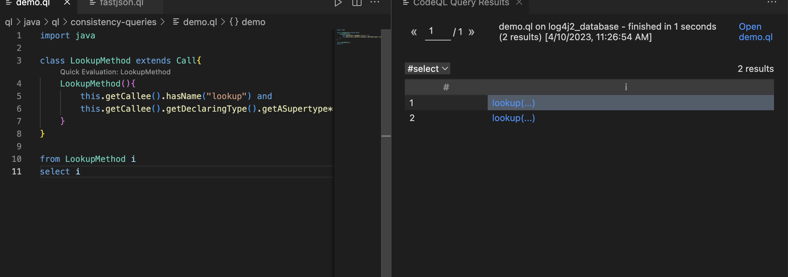

# 前言

很早之前就复现过log4j2这个核弹级漏洞，但是前段时间看到一篇文章通过codeql来挖掘log4j2中的jndi注入，就专门来学学这种操作，对以后的java代码审计会有一定的帮助

# 环境搭建

首先我们要构建Log4j的数据库，由于`lgtm.com`中构建的是新版本的Log4j数据库，所以只能手动构建数据库了。首先从github获取源码并切换到2.14.1版本。

```
git clone https://github.com/apache/logging-log4j2.git
git checkout be881e5
```

由于我们这次分析的主要是`log4j-core`和`log4j-api`中的内容，所以打开根目录的Pom.xml注释下面的内容。

```
<modules>
    <module>log4j-api-java9</module>
    <module>log4j-api</module>
    <module>log4j-core-java9</module>
    <module>log4j-core</module>
    <!-- <module>log4j-layout-template-json</module>
    <module>log4j-core-its</module>
    <module>log4j-1.2-api</module>
    <module>log4j-slf4j-impl</module>
    <module>log4j-slf4j18-impl</module>
    <module>log4j-to-slf4j</module>
    <module>log4j-jcl</module>
    <module>log4j-flume-ng</module>
    <module>log4j-taglib</module>
    <module>log4j-jmx-gui</module>
    <module>log4j-samples</module>
    <module>log4j-bom</module>
    <module>log4j-jdbc-dbcp2</module>
    <module>log4j-jpa</module>
    <module>log4j-couchdb</module>
    <module>log4j-mongodb3</module>
    <module>log4j-mongodb4</module>
    <module>log4j-cassandra</module>
    <module>log4j-web</module>
    <module>log4j-perf</module>
    <module>log4j-iostreams</module>
    <module>log4j-jul</module>
    <module>log4j-jpl</module>
    <module>log4j-liquibase</module>
    <module>log4j-appserver</module>
    <module>log4j-osgi</module>
    <module>log4j-docker</module>
    <module>log4j-kubernetes</module>
    <module>log4j-spring-boot</module>
    <module>log4j-spring-cloud-config</module> -->
  </modules>
```

由于`log4j-api-java9`和`log4j-core- java9`需要依赖JDK9，所以要先下载JDK9并且在`C:\Users\用户名\.m2\toolchains.xml`中加上下面的内容。

```

<toolchains>
<toolchain>
  <type>jdk</type>
  <provides>
    <version>9</version>
    <vendor>sun</vendor>
  </provides>
  <configuration>
    <jdkHome>/Library/Java/JavaVirtualMachines/jdk-9.jdk/Contents/Home</jdkHome>
  </configuration>
</toolchain>
</toolchains>
```

不修改虽然会搭建成功，但是会少了log4j-api何log4j-core的源码

通过下面的命令完成数据库构建

```
codeql database create log4j2_database --language=java --command="mvn -fn clean install --file pom.xml -Dmaven.test.skip=true" --source-root=/Users/DawnT0wn/java/logging-log4j2
```

# CodeQL过程分析

首先明确我们的目的是为去寻找一些可以命令执行的sink点

**定义sink点**：我们通过定义JNDI注入点作为我们的sink点

```
class LookupMethod extends Call{
    LookupMethod(){
        this.getCallee().hasName("lookup") and
        this.getCallee().getDeclaringType().getASupertype*().hasQualifiedName("javax.naming", "Context")
    }
}
```



这里一共发现了两个lookup方法

一个是`log4j-core/src/main/java/org/apache/logging/log4j/core/appender/db/jdbc/DataSourceConnectionSource.java`

```java
try {
    final InitialContext context = new InitialContext();
    final DataSource dataSource = (DataSource) context.lookup(jndiName);
    if (dataSource == null) {
        LOGGER.error("No data source found with JNDI name [" + jndiName + "].");
        return null;
    }
```

另一个是`log4j-core/src/main/java/org/apache/logging/log4j/core/net/JndiManager.java`

```java
@SuppressWarnings("unchecked")
public <T> T lookup(final String name) throws NamingException {
    return (T) this.context.lookup(name);
}
```

接下来是source点

Log4j会通过`error/fatal/info/debug/trace`等方法对不同级别的日志进行记录

通过分析我们可以看到我们输入的message都调用了AbstractLogger的`logIfEnabled`方法并作为第四个参数输入，所以可以将这里定义为source。


但是在实际使用Log4j打印日志时可能不会带上Marker参数而是直接写入messge的内容

所以我们去找到那些只传入啦message参数的方法，类似这样


把这里当作我们的source点

```
class Logger extends Call{
    Logger(){
        this.getCallee().hasName("logIfEnabled") and 
        this.getCallee().getDeclaringType().getASupertype*().hasQualifiedName("org.apache.logging.log4j.spi", "AbstractLogger") and
        this.getCaller().getNumberOfParameters() = 1 and
        this.getCaller().getParameterType(0).hasName("String")
    }
}
```

借助edges谓词，完整的代码如下

```
/**
 * @kind path-problem
 */
import java

class LookupMethod extends Call{
    LookupMethod(){
        this.getCallee().hasName("lookup") and
        this.getCallee().getDeclaringType().getASupertype*().hasQualifiedName("javax.naming", "Context")
    }
}

class Logger extends Call{
    Logger(){
        this.getCallee().hasName("logIfEnabled") and 
        this.getCallee().getDeclaringType().getASupertype*().hasQualifiedName("org.apache.logging.log4j.spi", "AbstractLogger") and
        this.getCaller().getNumberOfParameters() = 1 and
        this.getCaller().getParameterType(0).hasName("String")
    }
}

query predicate edges(Callable a, Callable b) { a.polyCalls(b) }

from LookupMethod end,Logger start,Callable c
where end.getCallee()=c and
    edges+(start.getCallee(), c)
select end.getCaller(),start.getCallee(),end.getCaller(),"jndi"
```


下面的代码是网上的师傅根据污点分析来写的

```
/**
 *@name Tainttrack Context lookup
 *@kind path-problem
 */
import java
import semmle.code.java.dataflow.FlowSources
import DataFlow::PathGraph
class Context extends  RefType{
    Context(){
        this.hasQualifiedName("javax.naming", "Context")
        or
        this.hasQualifiedName("javax.naming", "InitialContext")
        or
        this.hasQualifiedName("org.springframework.jndi", "JndiCallback")
        or 
        this.hasQualifiedName("org.springframework.jndi", "JndiTemplate")
        or
        this.hasQualifiedName("org.springframework.jndi", "JndiLocatorDelegate")
        or
        this.hasQualifiedName("org.apache.shiro.jndi", "JndiCallback")
        or
        this.getQualifiedName().matches("%JndiCallback")
        or
        this.getQualifiedName().matches("%JndiLocatorDelegate")
        or
        this.getQualifiedName().matches("%JndiTemplate")
    }
}
class Logger extends  RefType{
    Logger(){
        this.hasQualifiedName("org.apache.logging.log4j.spi", "AbstractLogger")
    }
}
class LoggerInput extends  Method {
    LoggerInput(){
        this.getDeclaringType() instanceof Logger and
        this.hasName("error") and this.getNumberOfParameters() = 1
    }
    Parameter getAnUntrustedParameter() { result = this.getParameter(0) }
}
predicate isLookup(Expr arg) {
    exists(MethodAccess ma |
        ma.getMethod().getName() = "lookup"
        and
        ma.getMethod().getDeclaringType() instanceof Context
        and
        arg = ma.getArgument(0)
    )
}
class TainttrackLookup  extends TaintTracking::Configuration {
    TainttrackLookup() { 
        this = "TainttrackLookup" 
    }

    override predicate isSource(DataFlow::Node source) {
        exists(LoggerInput LoggerMethod |
            source.asParameter() = LoggerMethod.getAnUntrustedParameter())
    }

    override predicate isAdditionalTaintStep(DataFlow::Node fromNode, DataFlow::Node toNode) {
        exists(MethodAccess ma,MethodAccess ma2 |
            ma.getMethod().getDeclaringType().hasQualifiedName("org.apache.logging.log4j.core.impl", "ReusableLogEventFactory") 
            and ma.getMethod().hasName("createEvent") and fromNode.asExpr()=ma.getArgument(5) and ma2.getMethod().getDeclaringType().hasQualifiedName("org.apache.logging.log4j.core.config", "LoggerConfig")  
            and ma2.getMethod().hasName("log") and ma2.getMethod().getNumberOfParameters() = 2 and toNode.asExpr()=ma2.getArgument(0)
                    )
      }
    override predicate isSink(DataFlow::Node sink) {
        exists(Expr arg |
            isLookup(arg)
            and
            sink.asExpr() = arg
        )
    }
} 
from TainttrackLookup config , DataFlow::PathNode source, DataFlow::PathNode sink
where
    config.hasFlowPath(source, sink)
select sink.getNode(), source, sink, "unsafe lookup", source.getNode(), "this is user input"
```


# 写在最后

虽然用codeQL看过一些关于fastjson和CC链的挖掘了，这里也看了一点关于CodeQL的部分，但是对于污点分析和挖掘出来的链子是否为误报还是不太了解，上面虽然找到了几条链，但是并没有去验证，应该可以直接写个Logger.error("Log4j2的payload")打断点调试验证
