# 前言

最近没事看文章的时候，突然又看到了关于在java中加载字节码的方式，在看到BCEL的时候，看到了BCEL在fastjson的利用，之前只知道这个利用，并没有深入的去看，刚好看到了一个熟悉且陌生的东西——Class.forName，之前只在反射中知道这个来加载类，然而对于三个参数的Class.forName并没有去看过，这个方法的第三个参数是一个ClassLoader，刚好有可以结合ClassLoader来看看BCEL，顺便来复习一下类加载机制和类初始化

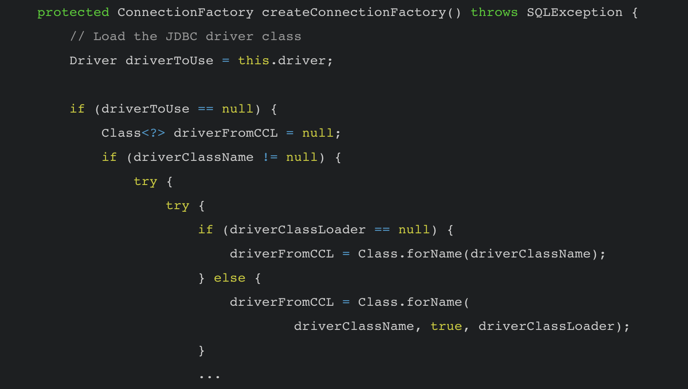

# ClassLoader

在Java中有很多加载字节码的方式，在P牛的Java漫谈中也提到了

1. 利用URLClassLoader 远程加载class文件，其实也可以加载jar包
2. 基础的ClassLoader 获取class通过defineclass加载字节码
3. 利用TemplatesImp加载字节码，其实也是重写了defineclass，只是加载的类要求是AbstractTranslet 的子类
4. 通过BCEL ClassLoader加载字节码，这个ClassLoader和其他ClassLoader又有点不同

这篇文章的重点并不在URLClassLoader和TemplatesImpl，主要是来看看ClassLoader和BCEL ClassLoader他们加载类的区别，以及Class.forName是怎么对类进行初始化的

```
package com.example.iast_test_demo.TestLoader;

public class Test {
    public static void main(String[] args) throws Exception{
        Class evil = ClassLoader.getSystemClassLoader().loadClass("com.example.iast_test_demo.TestLoader.Evil");
    }
}
```

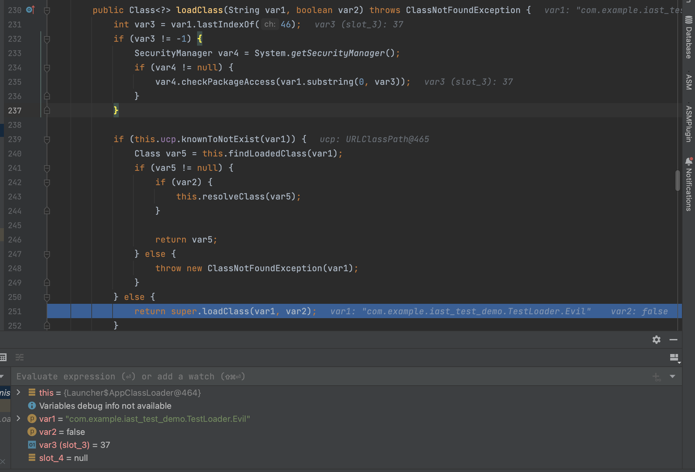

首先是调用到对应`ClassLoader`的`loadClass`方法，这里应该是`AppClassLoader`的`loadClass`方法，它会从已加载的类缓存寻找。没有找到的话就调用父类的`ClassLoader`

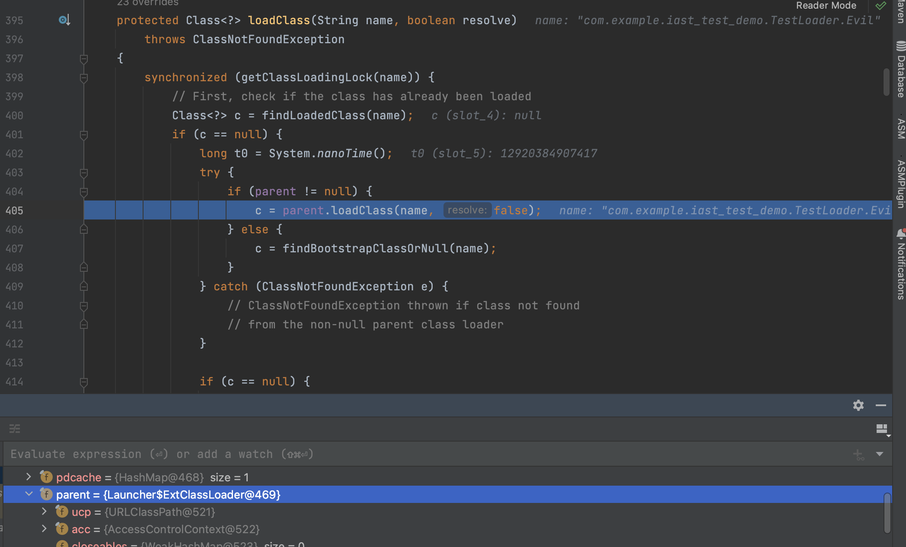

这里会通过`ClassLoader`类的`loadClass`去实现，因为`AppClassLoader`是遵循双亲委派机制的，它的父亲是`ExtClassLoader`（父类和父亲要分开是不一样的），知道`ClassLoader`的类加载机制的话，就没有问题。

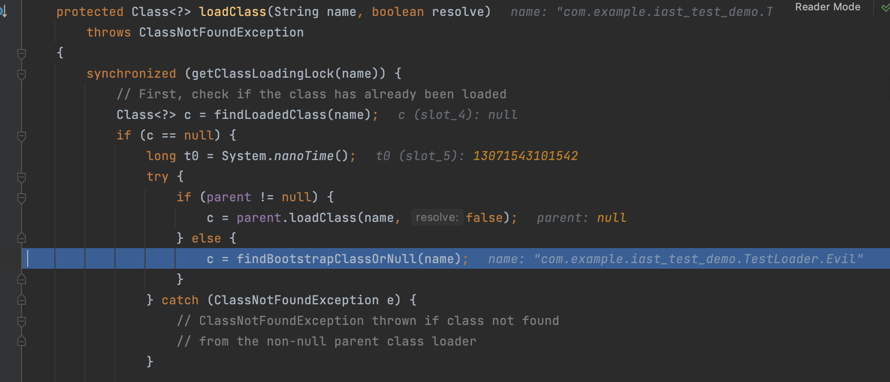

通过双亲委派模型没有找到JVM缓存的类的话，调用`findBootstrapClassOrNull`

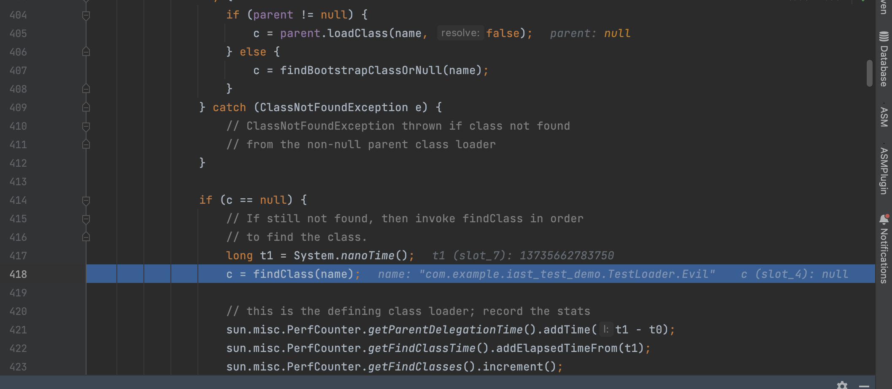

最后返回空进入if条件，调用findClass

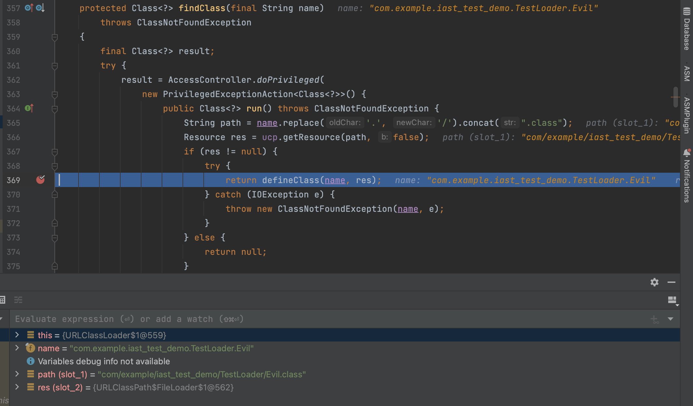

findClass 的作用是根据基础URL指定的方式来加载类的字节码，可能会在本地文件系统、jar包或远程http服务器上读取字节码，然后交给 defineClass 最后通过defineClass加载类，defineClass其实就是是处理前面传入的字节码，将其处理成真正的Java

在Resource对象中，我的url被封装成了`file:/对应的class`这样来读取到class到字节码，在defineClass中通过res.getBytes来得到读取

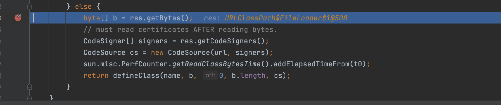

这里用一个demo来演示一下

```
package com.example.iast_test_demo.TestLoader;

import java.lang.reflect.*;
import java.util.Base64;

public class Test {
    public static void main(String[] args) throws Exception {
        Method defineClass = ClassLoader.class.getDeclaredMethod("defineClass", String.class, byte[].class, int.class, int.class);
        defineClass.setAccessible(true);
        byte[] code = Base64.getDecoder().decode("yv66vgAAADQALwoACwAVCQAWABcIABgKABkAGgoAGwAcCAAdCgAbAB4HAB8KAAgAIAcAIQcAIgEABjxpbml0PgEAAygpVgEABENvZGUBAA9MaW5lTnVtYmVyVGFibGUBAAg8Y2xpbml0PgEADVN0YWNrTWFwVGFibGUHAB8BAApTb3VyY2VGaWxlAQAJRXZpbC5qYXZhDAAMAA0HACMMACQAJQEACVRlc3QgZXhlYwcAJgwAJwAoBwApDAAqACsBABJvcGVuIC1hIENhbGN1bGF0b3IMACwALQEAE2phdmEvbGFuZy9FeGNlcHRpb24MAC4ADQEAKmNvbS9leGFtcGxlL2lhc3RfdGVzdF9kZW1vL1Rlc3RMb2FkZXIvRXZpbAEAEGphdmEvbGFuZy9PYmplY3QBABBqYXZhL2xhbmcvU3lzdGVtAQADb3V0AQAVTGphdmEvaW8vUHJpbnRTdHJlYW07AQATamF2YS9pby9QcmludFN0cmVhbQEAB3ByaW50bG4BABUoTGphdmEvbGFuZy9TdHJpbmc7KVYBABFqYXZhL2xhbmcvUnVudGltZQEACmdldFJ1bnRpbWUBABUoKUxqYXZhL2xhbmcvUnVudGltZTsBAARleGVjAQAnKExqYXZhL2xhbmcvU3RyaW5nOylMamF2YS9sYW5nL1Byb2Nlc3M7AQAPcHJpbnRTdGFja1RyYWNlACEACgALAAAAAAACAAEADAANAAEADgAAAB0AAQABAAAABSq3AAGxAAAAAQAPAAAABgABAAAAAwAIABAADQABAA4AAABbAAIAAQAAABqyAAISA7YABLgABRIGtgAHV6cACEsqtgAJsQABAAAAEQAUAAgAAgAPAAAAGgAGAAAABgAIAAcAEQAKABQACAAVAAkAGQALABEAAAAHAAJUBwASBAABABMAAAACABQ=");
        Class Evil = (Class) defineClass.invoke(ClassLoader.getSystemClassLoader(), "com.example.iast_test_demo.TestLoader.Evil", code, 0, code.length);
        Evil.newInstance();
    }
}
```

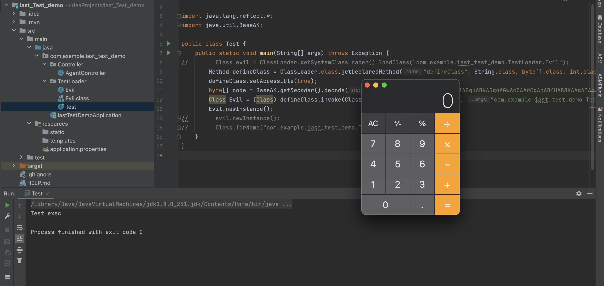

第一个参数是类名（需要用全限定名），第二个参数是byte也就是class到字节码，后面是偏移量和字节长度

需要注意的是，defineClass加载的类，并不会初始化，也就是不会调用其静态代码块，需要用newInstance去实例化

# forName

Class.forName与直接用loadClass加载的类不同，他会去初始化类，然后执行静态代码块，但是不会执行构造函数

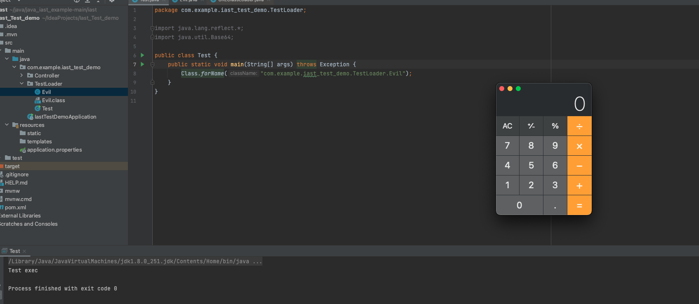

但是在Fastjson的中，看到了一个关于BCEL加载类的情况，看到触发点是`getConnection()->createDataSource()->createConnectionFactory()`的调用关系，调用到了`createConnectionFactory`方法

```java
 protected ConnectionFactory createConnectionFactory() throws SQLException {
        // Load the JDBC driver class
        Driver driverToUse = this.driver;

        if (driverToUse == null) {
            Class<?> driverFromCCL = null;
            if (driverClassName != null) {
                try {
                    try {
                        if (driverClassLoader == null) {
                            driverFromCCL = Class.forName(driverClassName);
                        } else {
                            driverFromCCL = Class.forName(
                                    driverClassName, true, driverClassLoader);
                        }
                        ...
```

Class.forName存在三个参数，这与平常见到的Class.forName并不相同

于是去Class类中寻找看到了两个forName方法

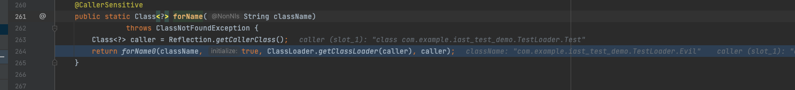

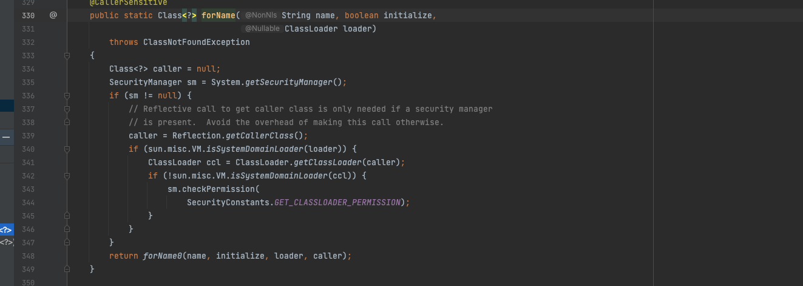

他们最后都调用的forName0这个方法，这个方法有四个参数，第一个name是加载的类名，第二个是选择是否初始化，第三是用到的ClassLoader，第四个是调用Class.forName的类，这里就是Test类

如果值传入类名的话，默认会选择初始化执行静态代码块，用到的ClassLoader是caller的ClassLoader，这里也就是AppClassLoader

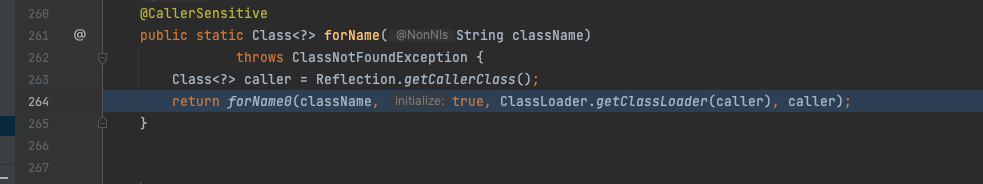

至于这里为什么选择true就会初始化，我并没有找到原因，应该是在设计的时候的设定吧

不过，在Java中，不管是TemplatesImp还是说Class.forName，加载类的本质就是defineClass，而Class.forName也是通过调用ClassLoader的loadClass最后来执行defineClass来加载类的

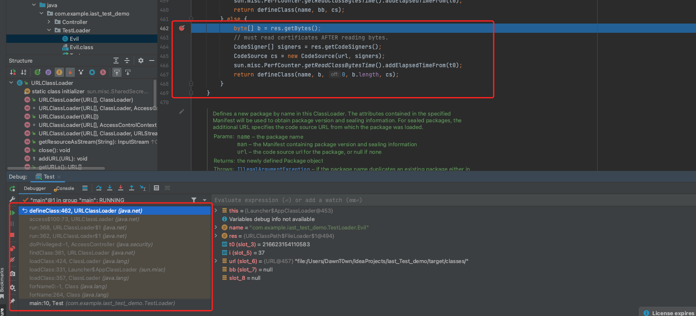

那么说明它会去调用ClassLoader的loadClass，那么如果用到的是这个forName方法

```
public static Class<?> forName(String name, boolean initialize,
                               ClassLoader loader)
```

我们就可以去指定ClassLoader了

在BCEL的Classloader的loadClass方法中，和平常的又不太一样

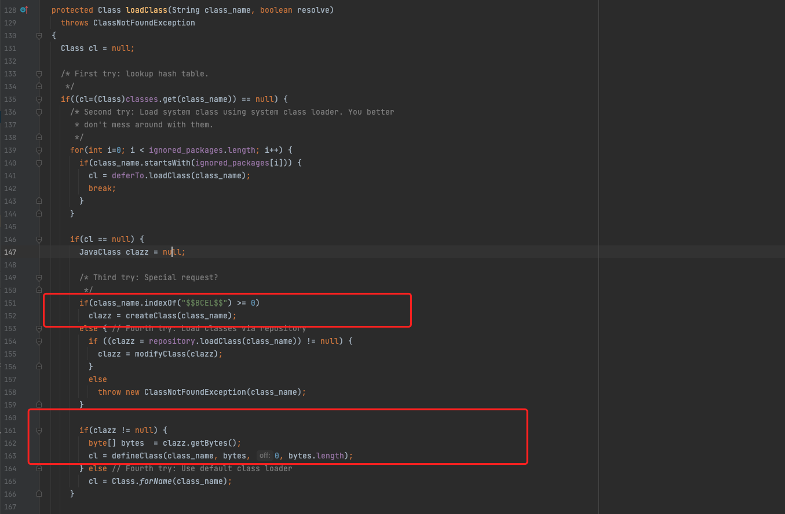

他会判断class_name是否以特定的字符开头，然后调用createClass

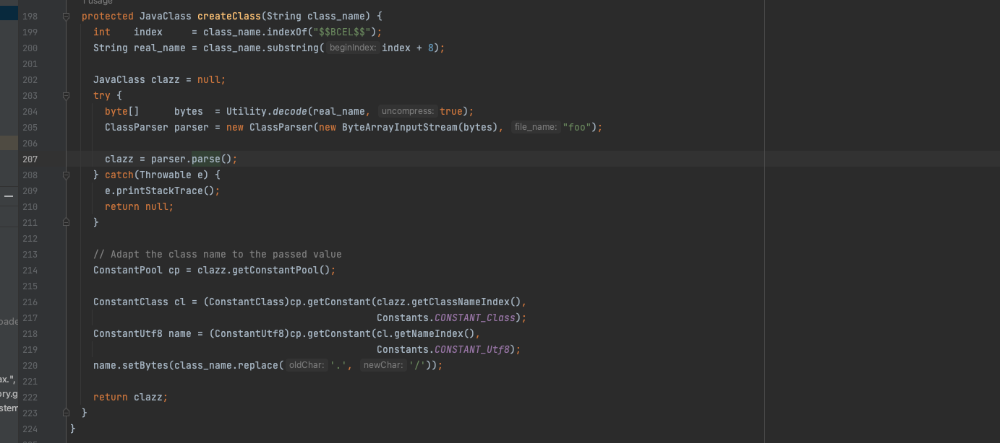

会去除特定开头的字符，截取后面的部分通过decode解密得到字节码，加密其实就是传统字节码的HEX编码，再将反斜线替换成`$`。默认情况下外层还会加一层GZip压缩，在https://www.leavesongs.com/PENETRATION/where-is-bcel-classloader.html可以看到

最后从字节码中得到JavaClass对象，然后在loadClass中判断clazz不为空，获取字节码调用defineClass加载字节码吗，所以说，其实这个ClassLoader传入的并不是真正意义上的类名，而是一个恶意类的字节码生成的BCEL形式

先来直接调用BCEL的loadClass加载BCEL形式的字节码看看效果

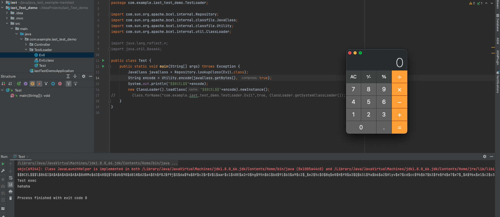

接下来用Class.forName

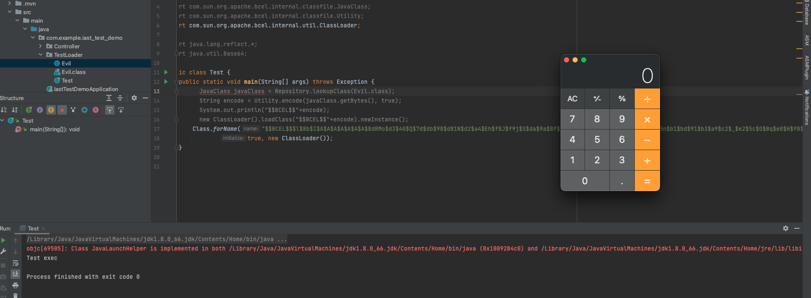


用对应的loadClass加载


# 写在最后

其实Class.forName就是用到了对应loadClass去加载类，但是在设计的时候多了一个初始化选项在我看来


参考链接：

https://www.leavesongs.com/PENETRATION/where-is-bcel-classloader.html

Java漫谈