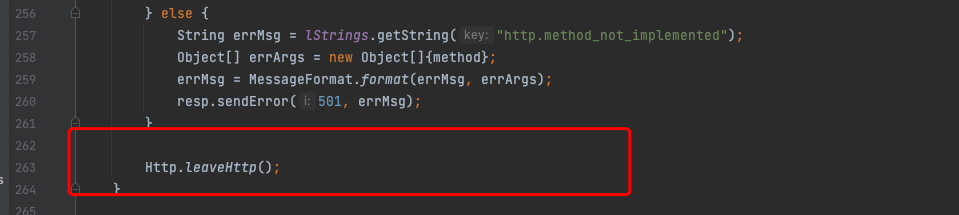
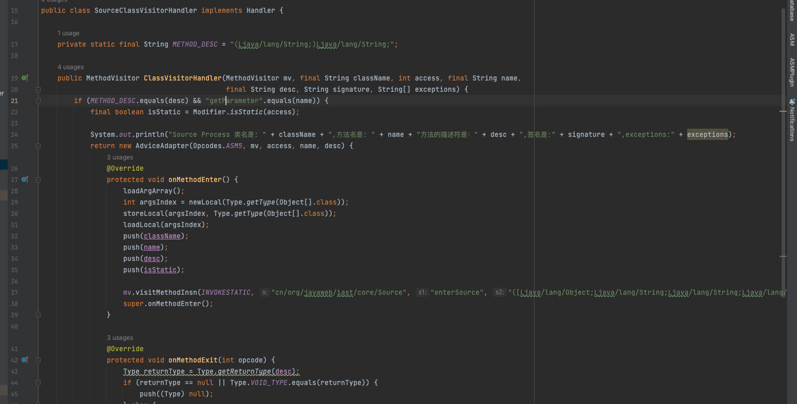
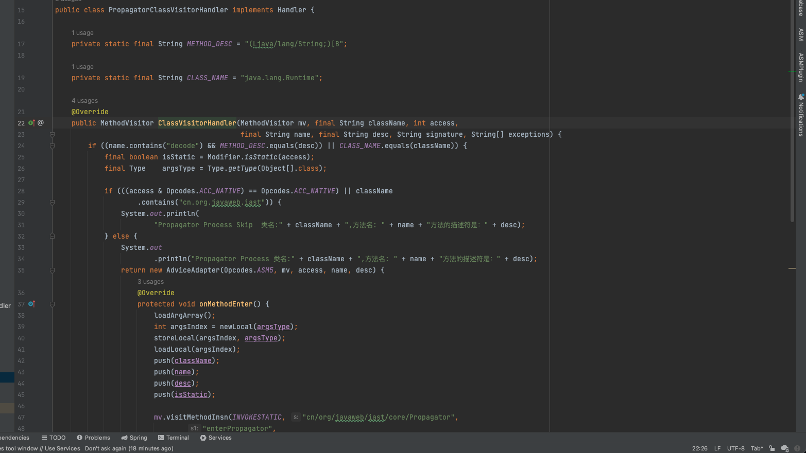
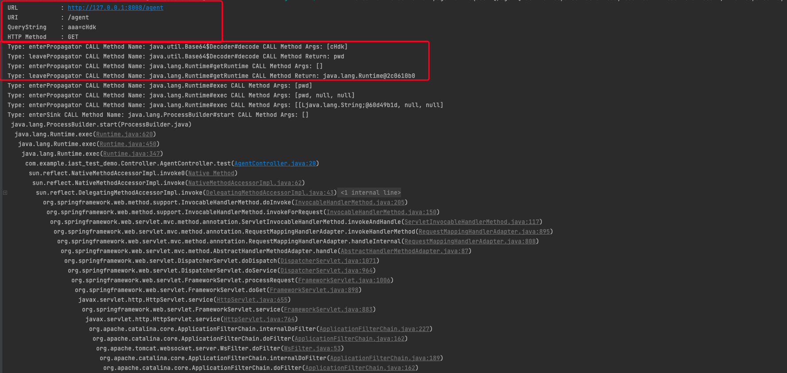
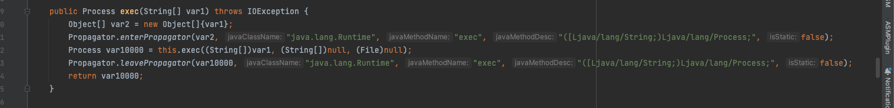
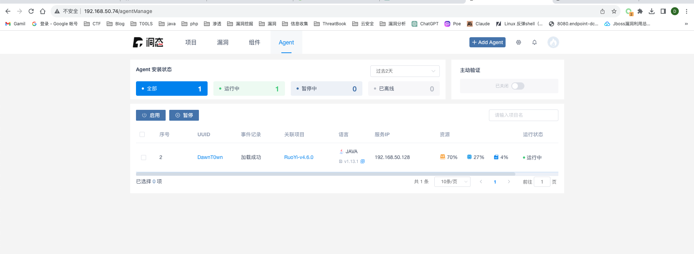

# 什么是IAST

AST是Application Security Testing的简称，翻译过来就是应用安全测试，这里不是抽象语法树。在他之下衍生出来以下几种类型:

\- SAST（Static Application Security Testing）静态应用安全测试
\- DSAT（Dynamic Application Security Testing）动态应用安全测试
\- MAST（Mobile Application Security Testing）移动应用安全测试
\- IAST (Interactive Application Security Testing)交互式应用安全测试

- IAST技术结合了SAST和DAST的优势，它在应用程序运行时插入安全检测引擎，监控应用程序的执行过程，并利用静态分析技术分析源代码，从而在应用程序运行时动态地发现潜在的安全漏洞。这种综合的方法使得IAST技术能够更准确地识别和验证安全问题，减少误报，并提供更及时的安全反馈。
- 大概就是在程序运行时，通过服务端部署Agent探针，流量代理/VPN等方式，监控WEB应用程序运行时函数执行与扫描器实时交互，高效，精准地扫描漏洞，是一种运行时的灰盒检测技术。
- 和RASP一样，都是通过agent探针去实现应用程序的安全保护和漏洞检测，但是有一定的区别：

IAST（Interactive Application Security Testing）和RASP（Runtime Application Self-Protection）都是通过agent探针来实现应用程序的安全保护和漏洞检测，但它们的主要区别在于功能和应用场景：

1. 功能：
   - IAST：IAST是一种结合了静态应用程序安全测试（SAST）和动态应用程序安全测试（DAST）的技术。它在应用程序运行时插入agent探针，可以监控应用程序的执行过程，同时结合静态分析技术分析源代码。这使得IAST能够在应用程序运行时动态地发现潜在的安全漏洞，并提供更准确的安全反馈。
   - RASP：RASP是一种运行时应用程序自我保护技术。它在应用程序运行时插入agent探针，用于监控应用程序的行为和交互。RASP可以实时检测和防御应用程序中的安全攻击，例如SQL注入、XSS等，并采取相应的保护措施，如拦截恶意请求、阻止攻击等。
2. 应用场景：
   - IAST：适用于应用程序的安全测试阶段，可以帮助开发人员和安全团队发现和解决应用程序的安全漏洞。IAST通常在开发和测试环境中使用，可以与持续集成和持续交付（CI/CD）流程集成，提供及时的安全反馈。
   - RASP：适用于应用程序的运行时保护阶段，用于实时监控和保护正在运行的应用程序免受攻击。RASP通常用于生产环境中，可以帮助应用程序在运行时自我保护，防止安全漏洞被利用。

虽然两者都使用agent探针来实现，但它们的目标和重点不同。IAST主要关注于安全漏洞的发现和测试阶段，而RASP主要关注于应用程序在运行时的实时保护。在实际应用中，两种技术可以结合使用，以提供更全面的应用程序安全保护。


IAST的检测模式通常分为主动和被动：


> - 在被动模式下，agent可以动态获取一次请求的调用链、数据流等信息，基于获取的信息，IAST可以做一些基于污点追踪的白盒分析，从而检测该次请求的调用链中是否存在漏洞；
> - 在主动模式下，agent会hook一些危险函数，当一次请求触发到这些危险函数后，agent会将该次请求发送给IAST server端，并使用DAST能力发送攻击payload做主动验证。基于这些特性，IAST非常适合融入到DevOps的测试环节，在业务测试完成正常功能逻辑测试工作的同时，无感知的进行一些安全漏洞的检测。

# demo

首先在一些文章中提到了agent的隔离加载，其实本质就是将agent包中的core代码使用BootstrapClassLoader加载加载，而在agent的定义中，可以指定他使用BootstrapClassLoader加载


如果使用pom文件定义的话，也是可以指定的

这次就用https://github.com/iiiusky/java_iast_example这个简单项目进行分析，看看究竟实现了什么，以及IAST到底做了什么


这是这个项目的一些逻辑，主要实现了四个埋点，这个项目没有添加报错处理，可能有点小问题，简单修改后


得到的效果，可以看到触发了一系列埋点，其实就是通过我的一些埋点，打印了一部分内容，对污点参数进行追踪，得到一些有用的信息，最后打印了出来了整个调用栈（包括底层），可以直接定位到对应的Controller以及调用过程，当然，真正的IAST产品功能绝对不会只有这点，这种结合上下文的方式，可以更加精确地找到污点位置，以便程序员更好地修复，当然，合理地利用，对于灰盒测试进行漏洞挖掘也有一定的作用。

IAST仍然是通过agent注入的方式

```java
package cn.org.javaweb.iast;

import org.objectweb.asm.ClassReader;
import org.objectweb.asm.ClassVisitor;
import org.objectweb.asm.ClassWriter;

import java.io.FileNotFoundException;
import java.io.FileOutputStream;
import java.io.IOException;
import java.lang.instrument.ClassFileTransformer;
import java.lang.instrument.IllegalClassFormatException;
import java.security.ProtectionDomain;
import java.util.regex.Pattern;

public class AgentTransform implements ClassFileTransformer {

   /**
    * @param loader
    * @param className
    * @param classBeingRedefined
    * @param protectionDomain
    * @param classfileBuffer
    * @return
    * @throws IllegalClassFormatException
    */
   @Override
   public byte[] transform(ClassLoader loader, String className,
                           Class<?> classBeingRedefined, ProtectionDomain protectionDomain,
                           byte[] classfileBuffer) throws IllegalClassFormatException {

      className = className.replace("/", ".");
      if (className.contains("cn.org.javaweb.iast")) {
         System.out.println("Skip class: " + className);
         return classfileBuffer;
      }

      if (className.contains("java.lang.invoke")) {
         System.out.println("Skip class: " + className);
         return classfileBuffer;
      }
      byte[] originalClassfileBuffer = classfileBuffer;

      ClassReader  classReader  = new ClassReader(classfileBuffer);
      ClassWriter  classWriter  = new ClassWriter(classReader, ClassWriter.COMPUTE_MAXS);
      ClassVisitor classVisitor = new IASTClassVisitor(className, classWriter);

      classReader.accept(classVisitor, ClassReader.EXPAND_FRAMES);

      classfileBuffer = classWriter.toByteArray();
      className = className.replace("/", ".");


      String regexp = "(Decoder|Servlet|connector|Request|Parameters|Base64|Runtime|ProcessBuilder)";

      if (Pattern.compile(regexp).matcher(className).find()) {
         ClassUtils.dumpClassFile("/Users/DawnT0wn/java/java_iast_example-main/iast/class/", className, classfileBuffer, originalClassfileBuffer);
      }

      return classfileBuffer;
   }

}
```

transformer方法还是通过ASM方式去修改，如果匹配到类的关键词，则会调用dumpClassFile将通过ASM修改后的类保存下来，对于具体的会交给IASTClassVisitor处理

## HTTP埋点

接下来逐个分析这个项目的几个埋点


当调用方法前会调用visitMethod，在这个方法中对相应的Method进行hook，首先是HTTP相关的，request和resonse对象相关方法，定义了Handler接口，对于不同的埋点，调用不同的处理器的ClassVisitorHandler方法


这个处理器会去判断调用的方法是否是service方法，并且接受的参数是HttpServletRequest和HttpServletResponse对象，返回为空，也就是Request的service方法，为什么会hook这个点，因为无论是servlet还是spring-boot，关于请求都会用到service方法

对于这种service方法，用到了AdviceAdapter的两个钩子函数，用ASM在方法最前面添加cn.org.javaweb.iast.core的enterHttp方法，最后添加了leaveHttp方法


最后dump下来的service方法是这样的，enterHttp的内容

```
public static void enterHttp(Object[] objects) throws Exception{
   if (!haveEnterHttp()) {
      IASTServletRequest  request  = new IASTServletRequest(objects[0]);
      IASTServletResponse response = new IASTServletResponse(objects[1]);

      RequestContext.setHttpRequestContextThreadLocal(request, response);
   }
}
```

这个方法主要是为来将`HttpServletRequest`和`HttpServletResponse`对象存到了当前线程的上下文中，方便后续对数据的调取使用

对于leaveHttp，目前只适用于GET方法，主要是答应请求的URL，URI，GET请求的内容，请求方法，在初始化HTTP的时候，将新建一个`LinkedList<CallChain>`类型的对象，用来存储线程链路调用的数据


而在leaveHttp方法中，获取这个`LinkedList<CallChain>`类型的对象存储来后面埋点的一些信息，通过遍历请求保存下来的节点，打印出相关信息，有关leave和sink会在后面看到



## Source埋点

在对servicehook进行埋点后，接下来选择source埋点，逻辑和HTTP很像，选取的是getParameter方法，我这里实验应该没有触发到这个埋点，因为我用到的Spring，没有用到getParameter方法


对于这些getParameter方法在首尾仍然用钩子函数通过ASM插入相应的方法

```
public static void enterSource(Object[] argumentArray,
                               String javaClassName,
                               String javaMethodName,
                               String javaMethodDesc,
                               boolean isStatic) {
   if (Http.haveEnterHttp()) {
      CallChain callChain = new CallChain();
      callChain.setChainType("enterSource");
      callChain.setArgumentArray(argumentArray);
      callChain.setJavaClassName(javaClassName);
      callChain.setJavaMethodName(javaMethodName);
      callChain.setJavaMethodDesc(javaMethodDesc);
      callChain.setStatic(isStatic);
      RequestContext.getHttpRequestContextThreadLocal().addCallChain(callChain);
   }
}
```

```
public static void leaveSource(Object returnObject,
                               String javaClassName,
                               String javaMethodName,
                               String javaMethodDesc,
                               boolean isStatic) {
   if (Http.haveEnterHttp()) {
      CallChain callChain = new CallChain();
      callChain.setChainType("leaveSource");
      callChain.setReturnObject(returnObject);
      callChain.setJavaClassName(javaClassName);
      callChain.setJavaMethodName(javaMethodName);
      callChain.setJavaMethodDesc(javaMethodDesc);
      callChain.setStatic(isStatic);
      RequestContext.getHttpRequestContextThreadLocal().addCallChain(callChain);
   }
}
```

enterSource和leaveSource都是设置CallChain，enterSource将调用的参数，类名，方法名，描述符等信息添加到callChain中


插入leaveSource的时候，在方法结束前获取了返回值，传入了leaveSource，在leaveSource处理的时候放入了`callChain.returnObject`

## Propagator埋点

对于Source埋点后，是对于传播点进行埋点，这个选择就非常重要，覆盖广，最后得到的链路就相对清晰。都是如果没有选好，比如说对于String，Byte等类埋点，可想而知，会非常多，最后堆栈就一大堆，不好分析。



这里demo多传播点其实选取的是Runtime类或者是一个decode方法（传入String返回byte[]），还是一样通过钩子函数函数配合ASM对相应的方法进行修改，添加enterPropagator和leavePropagator方法


这两个方法和Source的埋点很像，这里主要是为了做一个标记，存入到callChain里面，最好在HTTP埋点判断好打印出来

最后的效果：



## Sink埋点

Sink点的选择就和找RASP危险函数hook点一样，可以是`java.lang.UNIXProcess#forkAndExec`方法，这种给`java.lang.UNIXProcess#forkAndExec`下点的方式太底层，如果不想这么底层，也可以仅对`java.lang.ProcessBuilder#start`方法或者`java.lang.ProcessImpl#start`进行埋点处理。本次实验选择了对`java.lang.ProcessBuilder#start`进行埋点处理


在handler中，发现只添加了一个enterSink方法


enterSink方法稍微有点不同，当触发这个方法的时候，会将当前线程的堆栈信息也保存下来，这个println打印的其实只是一个对象，堆栈信息具体打印在http的leaveHttp方法


通过for循环打印的堆栈，排除掉其中enterSource和本来的Thread类

## 效果展示

写一个简单的控制器

```
package com.example.iast_test_demo.Controller;

import org.springframework.stereotype.Controller;
import org.springframework.web.bind.annotation.RequestMapping;
import org.springframework.web.bind.annotation.RequestParam;
import org.springframework.web.bind.annotation.ResponseBody;

import java.io.BufferedReader;
import java.io.InputStream;
import java.io.InputStreamReader;
import java.util.Base64;

@Controller
public class AgentController {

    @RequestMapping("/agent")
    @ResponseBody
    public String test(@RequestParam String aaa)throws Exception{
        byte[] cmd = Base64.getDecoder().decode(aaa);
        Process process = Runtime.getRuntime().exec(new String(cmd));
        InputStream inputStream = process.getInputStream();
        InputStreamReader inputStreamReader = new InputStreamReader(inputStream);
        BufferedReader bufferedReader = new BufferedReader(inputStreamReader);
        StringBuffer stringBuffer = new StringBuffer();
        String line = null;
        while ((line = bufferedReader.readLine()) != null){
            stringBuffer.append(line).append("\n");
        }
        return stringBuffer.toString();
    }
}
```

spring启动时添加agent


IAST不会阻止命令执行，但是会根据上面的逻辑，当触发的时候会输出相应的路径等，以及调用栈


可以看到一共是触发了五次传播点，第一次是Base64的decode，传入参数cHdk，返回pwd，第二次是getRuntime方法，传入空，返回了一个Runtime对象。

第三次触发的埋点信息为调用`java.lang.Runtime#exec`方法(接收参数类型为:`String`)，传入的值是`pwd`，在这次调用中可以看到，第一次Propagator点的返回值作为了入参传入了这次调用，但是紧接着并触发没有想象中的`leavePropagator`方法，而是调用了另一个`exec`方法。


第四次触发的埋点信息为调用`java.lang.Runtime#exec`方法(接收参数类型为:`String、String[]、File`)，其中第一个参数的值为`pwd`，而其它参数为`null`，在这次调用中可以看到，第三次中传递过来的`pwd`没有发生变化，然而也没有触发`leavePropagator`方法，由此可以推测出来这个方法内部继续调用了在规则里面预先匹配到的方法。



第五次触发的埋点信息为调用`java.lang.Runtime#exec`方法(接收参数类型为:`String[]、String[]、File`)，传入的值是`[[Ljava.lang.String;@60d49b1d, null, null]  `，这时候就看到了在传入的值由`pwd`变为了一个`String`数组类型的对象，返回到第四次触发的埋点看，其实就可以看到`var`6其实是最开始是由`var1`，也就是入参值`pwd`转换得到的。然后可以看到在当前调用的方法里面，又调用了规则中的Sink点（`java.lang.ProcessBuilder#start`）方法。



我这里没有触发到getParameter方法，因为用到的是spring，对于一些埋点的选取也可以尽可能多的覆盖多种场景吧

# 洞态IAST搭建

官方下载，https://github.com/HXSecurity/DongTai

```
git clone git@github.com:HXSecurity/DongTai.git
cd DongTai
chmod u+x build_with_docker_compose.sh
./build_with_docker_compose.sh
```

安装完设置端口后访问，默认账号密码为admin/admin，直接下载agent，在最新版本可以直接自动创建项目，可联系官网获取token


简单实验了一下




# 写在最后

其实所谓的IAST，就是通过注入Agent，实时监控一些sink点，比如说exec这种，然后通过灰盒测试，触发到这个点的时候，能够输出对应的内容（记录payload，输出调用栈等等），因为是通过上下文信息进行的发现，能够帮助开发人员更好地修复问题。主要的还是对hook点的选取，


https://www.anquanke.com/post/id/288054#h2-6

https://tttang.com/archive/1375/#toc_0x10